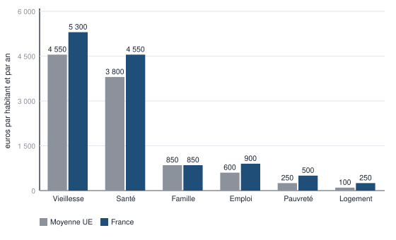
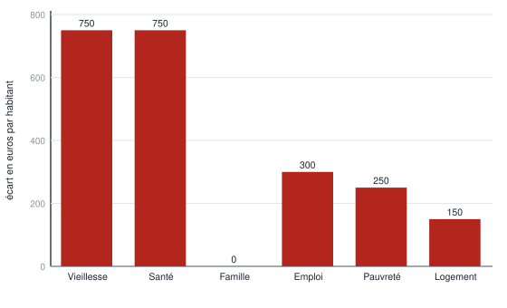
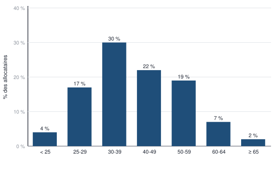
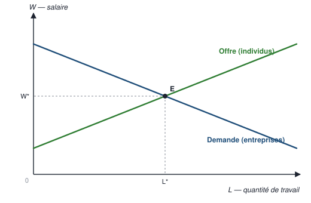
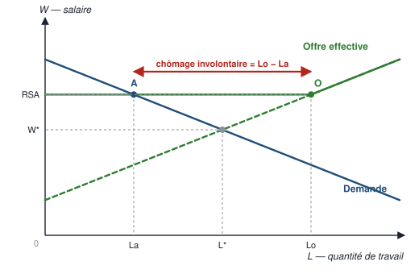
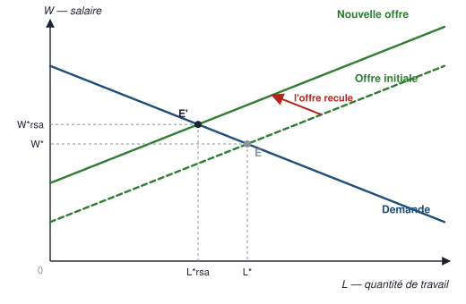
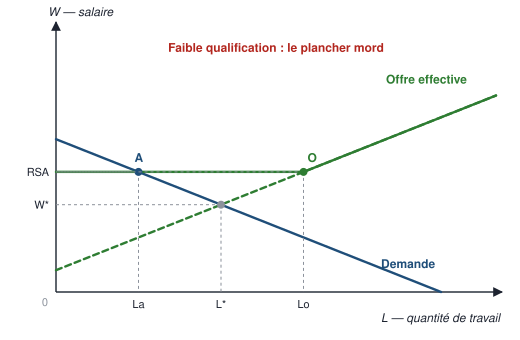
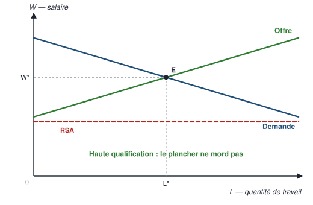
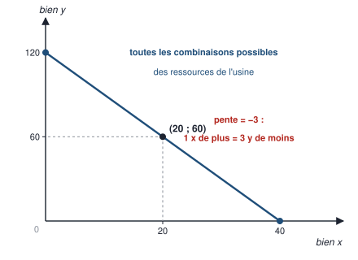

# 1 — Carte du chapitre

::: synthese Le chapitre en dix lignes
1. Le cours part d'un **débat public** : met-on trop d'argent dans les aides sociales ? Chacun a son chiffre, personne ne s'accorde.
2. L'économiste ne tranche pas le débat : il le **reformule en trois questions** auxquelles on peut répondre — pourquoi verser des aides, y en a-t-il trop, à qui doivent-elles aller ?
3. **Pourquoi** : pour redistribuer, **verticalement** (des riches vers les pauvres) et **horizontalement** (selon les risques de la vie).
4. **Trop ?** Seul un raisonnement **relatif** répond : la France dépense 33,3 % de son PIB contre 29,0 % en Europe — mais **68 % de l'écart vient des retraites et de la santé**, pas des aides aux pauvres.
5. **À qui ?** Les allocataires du RSA sont surtout en âge de travailler — mais un tiers des ayants droit ne demandent même pas l'aide.
6. Les aides découragent-elles le travail ? On construit un **modèle du marché du travail** : quatre cas, **pas de prédiction univoque**, un effet possible seulement pour les **moins qualifiés**.
7. On confronte aux **données** : le seuil de 25 ans du RSA sert d'**expérience naturelle** — aucune rupture nette. Conclusion : **doute**, et méfiance envers les corrélations.
8. L'**illusion de la gratuité** : l'université « gratuite » coûte 11 000 € par an, payés à 97 % par le contribuable.
9. D'où la définition : **l'économie étudie la façon dont la société gère ses ressources rares** (Robbins) — décisions individuelles, interactions, fonctionnement d'ensemble.
10. Raisonner en économiste : une **méthode** (modèles, théories, expériences), la distinction **positif / normatif**, et des désaccords **souvent solubles par les données**.
:::

**Les idées maîtresses à retenir absolument**

1. **Un chiffre ne dit rien seul** : on le rapporte au PIB, à la population, à d'autres pays.
2. **Sur le marché du travail, les individus OFFRENT et les entreprises DEMANDENT** — l'inverse du marché des biens.
3. **Cas 2 ≠ cas 3** : salaire bloqué et chômage involontaire, contre courbe d'offre qui se déplace et nouvel équilibre.
4. **Une corrélation n'est pas une causalité** : causalité inverse, facteur commun, coïncidence.
5. **Le coût d'opportunité** est le bénéfice du **meilleur** choix auquel on renonce ; on décide **à la marge**, jamais en moyenne.
6. **Positif / normatif** : *est, provoque* contre *devrait, il faut*.

**Prérequis** — aucun. Le vocabulaire (PIB, points de pourcentage, salaire de réserve, biais de
sélection, régression) est **enseigné ici** au moment où il sert.

::: marche Le lien avec la finance, là où il est réel
- **Le coût d'opportunité** est exactement la logique d'un **benchmark** : un placement qui rapporte 250 € quand l'alternative sans risque en rapportait 300 a **perdu** 50 € — c'est l'idée de rendement excédentaire.
- **Le raisonnement à la marge** est celui du **dimensionnement d'une position** : on ajoute un lot tant que son espérance de gain marginale dépasse son risque marginal.
- **« Les prix augmentent quand la banque centrale imprime trop de monnaie »** : c'est la raison pour laquelle les marchés réagissent à chaque décision de politique monétaire.
- **Corrélation contre causalité** : le piège de tout backtest — une stratégie qui a « marché » sur une corrélation fortuite n'a aucun pouvoir prédictif.
:::

**Pour plus tard** — pourcentages, écarts relatifs et **points de pourcentage**, lecture de
tableaux et de graphiques : le cœur des épreuves de calcul et de raisonnement du **TAGE MAGE**.
Coût d'opportunité et raisonnement à la marge : les deux outils de base de toute la **finance**.

<!--saut-->

# 2 — Le cours reconstruit

> **Cinq sections d'apprentissage.** Chacune se travaille en un cycle APPRENDRE de quatre
> pomodoros : **P1** lecture active · **P2** restitution de mémoire, cours fermé · **P3** cartes de
> la section (§ 4.2) · **P4** questions de niveau 1 de la section (§ 5).

## 2.1 — Le cadre du cours et le problème posé (diapositives 1 à 17)

**À quoi sert cette section.** Elle installe le cours — organisation, évaluation, plan — puis pose le problème qui va servir de fil rouge à toute l'introduction : **y a-t-il trop d'aides sociales en France ?** L'essentiel n'est pas la réponse, c'est la façon dont l'économiste **transforme un débat d'opinions en questions auxquelles on peut répondre**.

### 2.1.1 — Le cadre du cours (diapositives 1 à 10)

Ces dix diapositives ne sont pas examinables, à une exception près : **les modalités
d'évaluation**, qui commandent toute la stratégie de révision — la méthode de l'épreuve est au § 5.

| Élément | Contenu |
|---|---|
| **Volume** | 30 h de cours magistral, 12 h de travaux dirigés |
| **Évaluation** | CC = examen de TD en présentiel ; CT = questions de cours + exercices, **1 h 30** |
| **Place dans la maquette** | **BCC 1**, « Compréhension des objectifs des acteurs, firmes et organisations », **6 crédits** |
| **Objectifs annoncés** | Introduire les notions de base pour comprendre des problèmes économiques concrets ; présenter des principes de micro et de macroéconomie en s'appuyant sur des **analyses graphiques et mathématiques** ; rendre l'étudiant capable de **mener un raisonnement économique pour répondre à des questions précises** |
| **Plan général** | **Introduction générale** (ce document) · **Partie 1** : raisonner à l'échelle macroéconomique · **Partie 2** : raisonner à l'échelle microéconomique |

**BCC** = **bloc de connaissances et de compétences**, unité de regroupement des matières
dans la maquette d'un diplôme ; la compensation des notes s'organise à l'intérieur d'un BCC.
La maquette du semestre 1 comporte trois BCC pour **30 crédits** : BCC 1 — Principes
d'économie (6) et Principes de gestion (6) ; BCC 2 — Techniques statistiques (5) et
Environnement des organisations (6, soit Introduction au droit et Institutions politiques) ;
BCC 3 — Mathématiques 1 (5, mise à niveau comprise), Ecri+ (1) et GoFluent (1).

**Le reste de ces dix diapositives, pour que rien ne manque.** Les *difficultés des cours à
l'université* (d. 5) : croire que les cours ne sont pas obligatoires — « FAUX » selon le
règlement AMU rappelé en diapositive 2 —, le piège du statut **sans travaux dirigés**, un
emploi du temps avec beaucoup de temps libres, des habitudes de travail « au dernier moment »
qui ont marché jusqu'ici ; « bref : **l'autonomie** ». Les *remèdes* proposés (d. 6) :
se rapprocher de personnes qui veulent réussir, s'inscrire aux TD, employer les temps libres
à travailler régulièrement et à préparer les TD, recourir au **parrainage** de la FEG
(feg-parrainage@univ-amu.fr). Les *ressources* annoncées (d. 9) : ses propres notes de cours
— « prévoir un cahier : graphiques et équations » —, les ressources déposées sur **Ametice**,
et « **un** manuel de référence », que la diapositive ne nomme pas. Les *règles de séance*
(d. 2) : cours de 3 h avec deux pauses de 5 minutes, aucun retard accepté, entrée aux pauses
en cas de retard, pas de casquette, pas de bavardage, questions et rendez-vous aux pauses ou
en fin de cours.

::: piege La citation de la diapositive 7 — une attribution à manier avec prudence
Le support affiche : *« Je n'enseigne pas, je raconte »* et *« Enseigner, ce n'est pas
remplir un vase, c'est allumer le feu »*, attribuées à **Montaigne, XVIᵉ siècle**. La
première est bien de Montaigne (*Essais*, III, 2). La seconde, sous cette forme française,
est une **formule de tradition** : elle ne figure pas telle quelle dans les *Essais* et
circule aussi attribuée à Plutarque, à Rabelais ou à Yeats. **Je ne peux pas t'en donner la
source certaine et je ne l'inventerai pas.** Si tu la cites, attribue-la comme le fait le
cours — à Montaigne — puisque c'est la version que l'enseignant a donnée.
:::

::: objectif Ce que dit l'objectif « mener un raisonnement économique »
L'examen ne demandera pas seulement de restituer des définitions : il demandera de
**dérouler une chaîne** — poser une question, choisir un modèle, en tirer une prédiction,
confronter aux données, conclure en nuançant. C'est exactement la structure de la section 1
du cours, et c'est pour cela qu'elle occupe 25 diapositives sur 53 : elle est la
**démonstration en acte** de ce que le cours veut enseigner. Le § 5 en fait un gabarit
de réponse (gabarit 5).
:::

### 2.1.2 — Le problème : un débat public que l'économiste reprend autrement (diapositives 11 à 15)

**Le point de départ.** Le cours ouvre sur une phrase d'Emmanuel Macron, président de la
République : *« On met un pognon de dingue dans les minima sociaux et les gens sont quand
même pauvres. On n'en sort pas, les gens qui naissent pauvres, restent pauvres. »* Et sur
une tribune d'**Agnès Verdier-Molinié** dans *Le Figaro* du **8 juillet 2025** : en cumulant
le RSA, les allocations logement, les allocations familiales, l'allocation aux adultes
handicapés, l'allocation de rentrée scolaire, le minimum vieillesse et « une cinquantaine
d'autres aides », on atteint **138 milliards d'euros de dépenses en 2022 sous conditions de
ressources** ; les aides françaises seraient « généreuses, voire très généreuses », au point
qu'un **parent isolé avec 4 enfants sans travail** puisse toucher **plus de 3 000 euros
d'aides cumulées par mois** ; et la France n'imposerait « pas assez d'obligations de retour
à l'emploi ».

**Sous conditions de ressources** signifie que l'aide n'est versée que si les revenus du
foyer restent sous un plafond — par opposition aux prestations **universelles**, versées
sans considération de revenu.

**Le débat est politiquement occupé de toutes parts** (d. 13). Le cours juxtapose trois
positions supplémentaires, qui ne se réduisent pas à un axe droite-gauche :

- **Fabien Roussel**, secrétaire national du **PCF**, dans une tribune au *Monde* du
  **13 septembre 2022** : *« J'assume défendre le parti du travail »*. Il oppose « la gauche
  du travail » à « la gauche des allocations [et] des minima sociaux », et pose que le défi
  de la gauche est de « travailler à une société qui garantit à chacun d'avoir un emploi,
  une formation et un salaire tout au long de sa vie ». **Intérêt pour le cours :** la
  critique des minima sociaux n'est pas l'apanage de la droite libérale.
- **Le projet de loi « immigration »** (*Le Monde*, 19 décembre 2023) : restriction de
  l'accès aux prestations sociales pour les ressortissants non européens.
- **Éric Zemmour** sur France info, **24 novembre 2021** : retirer les aides sociales « non
  contributives » aux étrangers permettrait d'économiser « 20 milliards d'euros » par an —
  et l'article ajoute lui-même : **« Son chiffre est surévalué. »**

**Aide non contributive** = prestation versée sans qu'aucune cotisation n'ait été payée en
contrepartie (RSA, AAH) ; par opposition aux prestations **contributives**, financées par
des cotisations antérieures (retraite, assurance chômage).

::: piege Pourquoi le cours retient un chiffre en signalant qu'il est faux
Ce n'est pas un détail de mise en page. La juxtaposition « 138 milliards » / « 20 milliards
— chiffre surévalué » est **la première leçon de méthode du cours** : dans le débat public,
les chiffres circulent comme des arguments d'autorité, sans que leur construction soit
jamais donnée. Le rôle de l'économiste commence exactement là. En copie, citer cet exemple
pour illustrer la différence entre un chiffre et une donnée est un point gagné.
:::

**Le constat du cours** (d. 14-15) : c'est *« un sujet qui fait débat et qui, selon les
positions, ne permet pas de dégager une position commune »*. Il soulève par ailleurs
plusieurs questions — **comment financer ces aides ? à qui doivent-elles profiter ? quelle
durée ?** Et le débat *« doit-on réformer notre système de protection sociale ? »* mobilise
**des arguments de différentes natures : politiques, culturels, sociaux, économiques.**

D'où la question qui ouvre réellement le cours : **« Quelles réponses apporterait un
économiste ? »**

::: definition Ce que « raisonner en économiste » veut dire, ici
Non pas trancher le débat, mais le **reformuler en questions auxquelles on peut répondre
par des faits et des modèles**. L'économiste ne dit pas si l'on « met trop » d'argent dans
les minima sociaux — c'est un jugement de valeur. Il dit : voici à quoi sert ce dispositif,
voici combien il coûte comparé à d'autres pays, voici à qui il va, voici ce qu'un modèle
prédit de ses effets, voici ce que les données montrent. La décision reste politique ; ce
que l'économiste change, c'est la qualité de l'information sur laquelle elle se prend.
:::

### 2.1.3 — Les trois questions que se posent les économistes (diapositive 16)

Le cours reformule le débat en **trois questions**, et c'est ce triptyque qui structure
toute la section 1 :

**a)** Pourquoi verser des aides sociales ?  **b)** Y a-t-il trop d'aides sociales ?
**c)** À qui doivent s'adresser les aides sociales ?

L'ordre n'est pas arbitraire : on ne peut juger d'un « trop » qu'après avoir établi à quoi
sert le dispositif, et on ne peut discuter du ciblage qu'après avoir mesuré le volume.
**En copie, restituer les trois dans cet ordre, en une ligne chacune.**

| | La question | La réponse du cours |
|:---:|---|---|
| **a)** | **Pourquoi verser** des aides sociales ? | Politique de **redistribution horizontale et verticale**. Objectif : les plus aisés aident les plus pauvres → **réduction des écarts de niveaux de vie**. |
| **b)** | **Y a-t-il trop** d'aides sociales ? | Réflexion **relative et non absolue** ; regarder l'**affectation des dépenses**. |
| **c)** | **À qui doivent s'adresser** les aides sociales ? | Analyse du **profil des allocataires** (âge, situation) et des **entraves au retour à l'emploi**. |

### 2.1.4 — a) Pourquoi verser des aides sociales ? (diapositive 17)

La réponse du cours tient en trois flèches :

1. **Politique de redistribution horizontale et verticale**
2. **Objectif : les plus aisés aident les plus pauvres**
3. **Réduction des écarts de niveaux de vie**

Le support s'arrête là. Les deux adjectifs — horizontale, verticale — ne sont pas définis.
Ils sont pourtant la matière même d'une question de cours.

::: definition Redistribution verticale
Transfert de revenu **des ménages les plus aisés vers les ménages les plus modestes**. Le
critère qui déclenche le transfert est le **niveau de revenu**. Elle réduit directement les
**écarts de niveaux de vie** — c'est la troisième flèche de la diapositive.

*Exemples :* le RSA, les minima sociaux, l'impôt progressif sur le revenu qui les finance.
:::

::: definition Redistribution horizontale
Transfert entre ménages **de niveau de revenu comparable**, mais **inégalement exposés à un
risque ou à une charge**. Le critère qui déclenche le transfert n'est pas le revenu, c'est
la **situation** : être malade, être âgé, avoir des enfants, être au chômage.

*Exemples :* l'assurance maladie (des bien-portants vers les malades), les retraites (des
actifs vers les retraités), les allocations familiales (des ménages sans enfant vers les
ménages avec enfants).
:::

::: exemple Le test qui départage, à connaître
Deux ménages gagnent **2 500 € par mois** chacun. L'un a trois enfants, l'autre aucun. Le
premier reçoit des allocations familiales, le second non.

**Redistribution horizontale** : le revenu est identique, c'est la **charge de famille** qui
diffère. Aucun des deux n'est « plus pauvre » que l'autre au sens du revenu.

Change une seule donnée : le second ménage gagne **9 000 €** et finance, par son impôt, le
RSA versé à un troisième ménage sans revenu. **Redistribution verticale** : cette fois c'est
bien l'**écart de revenu** qui commande le transfert.
:::

**Pourquoi cette distinction compte pour la suite du cours.** Elle prépare l'argument
décisif du § 2.2 : quand on reproche à la France de « trop dépenser » en aides sociales, on
vise mentalement la redistribution **verticale** — le RSA, les minima. Or l'essentiel de la
dépense française est de la redistribution **horizontale** : retraites et santé. Le débat
public et la réalité comptable ne portent pas sur le même objet.

::: synthese Les deux redistributions, en un tableau
| | Redistribution **verticale** | Redistribution **horizontale** |
|---|---|---|
| Logique | Des **plus riches** vers les **plus pauvres** | Entre personnes de **même niveau de revenu**, selon le **risque** ou la **situation** subie |
| Critère | Le **niveau de revenu** | L'**exposition à un risque** : maladie, vieillesse, charge d'enfants, chômage |
| Exemples | RSA, minima sociaux, impôt progressif | Assurance maladie, retraites, allocations familiales |
:::

<!--saut-->

## 2.2 — Mesurer : y a-t-il trop d'aides sociales, et à qui vont-elles ? (diapositives 18 à 21)

**À quoi sert cette section.** Elle montre ce que veut dire **répondre avec des chiffres** : rapporter un montant à quelque chose, décomposer un total, vérifier qu'un tableau est cohérent, lire un graphique sans le recopier. **C'est le terrain des exercices de l'examen.**

Le cours répond par deux consignes de méthode, puis par des données.

### 2.2.1 — Consigne 1 : « réflexion relative et non absolue » (diapositive 18)

::: methode Pourquoi un chiffre seul ne veut rien dire
« 138 milliards d'euros » est un chiffre, pas une information. Il devient une information
quand on le rapporte à quelque chose :

1. **Au produit intérieur brut (PIB)** — la richesse produite dans le pays en un an. C'est
   le dénominateur qui permet de comparer des pays de tailles différentes.
2. **À la population** — la dépense par habitant. C'est le dénominateur qui permet de
   comparer l'effort réellement consenti par personne.
3. **À la même grandeur dans d'autres pays ou à d'autres dates.**

Un raisonnement **absolu** dit : « 138 milliards, c'est énorme ». Un raisonnement
**relatif** dit : « 33,3 % du PIB, contre 29,0 % en moyenne dans l'Union européenne ». Seul
le second est un raisonnement d'économiste.
:::

**PIB** = **produit intérieur brut**, valeur totale des biens et services produits sur le
territoire d'un pays pendant une année.

**Les données du cours** (source : **DREES**, *La protection sociale en France et en Europe
en 2021 — Résultats des comptes de la protection sociale*, édition 2022, parue le
15 décembre 2022).

**Premier indicateur — en part de PIB, 2021 :**

| Pays | Dépenses de protection sociale, en % du PIB |
|---|---:|
| **France** | **33,3 %** |
| Autriche | 31,8 % |
| Italie | 31,5 % |
| Allemagne | 31,0 % |
| **Union européenne** | **29,0 %** |

La France est donc **premier pays européen** pour les dépenses de protection sociale.
L'écart avec la moyenne européenne est de **4,3 points de PIB**, soit, en relatif,
$ 4{,}3 / 29{,}0 = 14{,}8\ \% $ de dépenses en plus.

**Second indicateur — en euros par habitant et par an, 2021 :** **12 350 €** en France
contre **10 150 €** en moyenne dans l'Union européenne, soit **2 200 € de plus par habitant**
($ 2\,200 / 10\,150 = +21{,}7\ \% $).

::: piege Deux indicateurs, deux questions
Ces deux chiffres ne disent pas la même chose et ne se déduisent pas l'un de l'autre. Le
premier rapporte la dépense à la **richesse produite** : il mesure l'effort de l'économie.
Le second la rapporte à la **population** : il mesure ce qui est effectivement versé par
personne. Un pays riche peut verser beaucoup par habitant tout en y consacrant une faible
part de son PIB. La France est au-dessus de la moyenne européenne **sur les deux**, ce qui
rend le constat robuste. Le noter en copie vaut un point.
:::

### 2.2.2 — Consigne 2 : « affectation des dépenses » — et ce que le cours ne calcule pas

Le cours affiche la décomposition des **12 350 €** par grande fonction, mais ne la commente
pas. C'est pourtant là que se trouve la réponse à la question « y a-t-il trop d'aides
sociales ? », et c'est le calcul qui fera la différence sur ta copie.

| Fonction | Moyenne UE | France | Écart en € | Part de l'écart total | Écart relatif |
|---|---:|---:|---:|---:|---:|
| **Vieillesse** | 4 550 € | 5 300 € | **+750 €** | **34,1 %** | +16,5 % |
| **Santé** | 3 800 € | 4 550 € | **+750 €** | **34,1 %** | +19,7 % |
| **Famille** | 850 € | 850 € | **0 €** | **0,0 %** | 0,0 % |
| **Emploi** | 600 € | 900 € | **+300 €** | **13,6 %** | +50,0 % |
| **Pauvreté** | 250 € | 500 € | **+250 €** | **11,4 %** | +100,0 % |
| **Logement** | 100 € | 250 € | **+150 €** | **6,8 %** | +150,0 % |
| **Total** | **10 150 €** | **12 350 €** | **+2 200 €** | **100 %** | **+21,7 %** |





::: demo Le calcul, étape par étape — à savoir refaire
1. **Vérifier que les colonnes sont cohérentes.**
   UE : $ 4\,550 + 3\,800 + 850 + 600 + 250 + 100 = 10\,150 $ ✔
   France : $ 5\,300 + 4\,550 + 850 + 900 + 500 + 250 = 12\,350 $ ✔
2. **Écart par poste** = France − UE. Vieillesse : $ 5\,300 - 4\,550 = 750 $ €. Etc.
3. **Vérifier que les écarts somment à l'écart total :**
   $ 750 + 750 + 0 + 300 + 250 + 150 = 2\,200 $ €, et $ 12\,350 - 10\,150 = 2\,200 $ € ✔
4. **Part de l'écart** = écart du poste ÷ écart total. Vieillesse : $ 750/2\,200 = 0{,}3409 $,
   soit **34,1 %**.
5. **Écart relatif** = écart du poste ÷ valeur UE du poste. Logement :
   $ 150/100 = 1{,}50 $, soit **+150 %**.
:::

::: synthese La conclusion que le support ne tire pas — et qui vaut deux points en copie
**Vieillesse + santé = 68,2 % de tout l'écart** entre la France et l'Europe
($ (750+750)/2\,200 $).
**Pauvreté + logement = 18,2 % seulement** ($ (250+150)/2\,200 $).
**Famille = 0 %** : la France verse exactement la moyenne européenne.

Autrement dit : **si la France dépense plus que ses voisins, c'est d'abord parce qu'elle
verse davantage de retraites et de soins — de la redistribution horizontale — et non parce
qu'elle « arrose » les plus pauvres.** Le débat public porte sur les 18 %, la dépense se
joue sur les 68 %.

**Le piège symétrique**, à mentionner pour montrer qu'on maîtrise l'outil : en **écart
relatif**, le classement s'inverse — logement **+150 %**, pauvreté **+100 %**, contre
vieillesse **+16,5 %**. Les deux lectures sont exactes et disent des choses différentes.
Une petite dépense peut doubler sans peser ; une grosse dépense pèse en augmentant peu.
**Ne jamais choisir une lecture sans dire laquelle on choisit et pourquoi.**
:::

### 2.2.3 — L'exemple du RSA (diapositive 19)

::: definition Le RSA
**RSA** = **revenu de solidarité active**. Le cours le définit comme **« une allocation
destinée à assurer un revenu minimum »**. C'est un **minimum social** : il est versé sous
conditions de ressources, sans contrepartie de cotisation, à des personnes dont les
ressources sont inférieures à un plancher.
:::

Les trois chiffres du cours :

- **près de 1,85 million d'allocataires** ;
- **en moyenne 520 euros par mois** ;
- **en 2021, 12,26 milliards d'euros**.

::: piege Les trois chiffres ne se recoupent pas — vérifie-le toi-même
$$ 1\,850\,000 \times 520 \times 12 = 11\,544\,000\,000 \approx 11{,}54 \text{ milliards d'euros} $$

Le cours annonce **12,26 Md€**. L'écart est de **0,72 Md€**, soit **+6,2 %**.

Pour que les trois chiffres soient cohérents, il faudrait **soit**
$ 12{,}26 \times 10^9 / (520 \times 12) = 1\,964\,744 $ allocataires, soit **1,96 million** ; **soit**
$ 12{,}26 \times 10^9 / (1{,}85 \times 10^6 \times 12) = 552 $ € par mois.

**Explication la plus probable :** les trois chiffres ne portent pas sur la même période ni
sur la même assiette — un effectif mesuré à une date donnée, un montant moyen mensuel, et
une dépense annuelle qui intègre les entrées et sorties du dispositif en cours d'année. Ils
sont justes séparément, mais ne se multiplient pas.

**Conduite à tenir en examen :** si l'on te demande le coût du RSA, réponds **12,26 Md€
(2021)**, le chiffre du cours. Si l'on te demande de le **recalculer**, pose le produit,
donne **11,54 Md€**, et signale l'écart en une phrase. C'est exactement ce que le correcteur
attend d'une excellente copie : appliquer la consigne **et** voir ce qui cloche.
:::

**Le rapport d'échelle à retenir :** le RSA (12,26 Md€) représente **8,9 %** des 138 Md€ de
dépenses sous conditions de ressources cités en ouverture
($ 12{,}26/138 = 0{,}0888 $). Le dispositif qui concentre presque tout le débat public pèse
moins d'un dixième de l'ensemble.

::: piege Une incohérence de titre dans le support
La diapositive 19 est intitulée **« b) Pourquoi verser des aides sociales ? »**, alors que
la question **b)** est **« Y a-t-il trop d'aides sociales ? »** (diapositive 16) et que le
contenu de la diapositive — effectifs, montant, coût total — relève bien du « trop ». C'est
une erreur de copier-coller du titre de la diapositive 17. **Retiens la nomenclature de la
diapositive 16, qui est la bonne.**
:::

### 2.2.4 — c) À qui s'adressent les aides sociales ? Le profil par âge (diapositive 20)

Source : *lafinancepourtous.com* d'après **DREES**, sur **1,9 million d'allocataires**.

| Tranche d'âge | Part | Lecture |
|---|---:|---|
| Moins de 25 ans | **4 %** | Le RSA n'est ouvert aux moins de 25 ans que sous conditions très restrictives |
| 25 à 29 ans | **17 %** | La part bondit dès le franchissement du seuil d'âge |
| 30 à 39 ans | **30 %** | Tranche la plus représentée |
| 40 à 49 ans | **22 %** | |
| 50 à 59 ans | **19 %** | |
| 60 à 64 ans | **7 %** | |
| 65 ans ou plus | **2 %** | Le minimum vieillesse prend le relais |
| **Total** | **101 %** | Le graphique le signale : « en raison de l'utilisation de données arrondies, le total dépasse 100 % » |



**Les deux lectures qui rapportent des points :**

1. **51 % des allocataires ont moins de 40 ans** ($ 4 + 17 + 30 $), et **47 % ont entre 25
   et 39 ans** ($ 17 + 30 $). Le RSA est majoritairement versé à des personnes **en âge de
   travailler**, ce qui rend la question de l'effet sur l'emploi pertinente — elle n'aurait
   pas de sens si le dispositif visait surtout des retraités.
2. **Le décrochage entre « moins de 25 ans » (4 %) et « 25-29 ans » (17 %) n'est pas un
   effet de génération : c'est un effet de règle.** Le RSA est en principe réservé aux
   **25 ans et plus**. Ce seuil administratif est exactement ce que l'étude de Bargain et
   Vicard exploitera au § 2.4. **Le voir ici, c'est comprendre pourquoi la diapositive 32
   existe.**

::: piege Le total à 101 %
Ne « corrige » pas le tableau et n'accuse pas le cours d'une erreur : **les arrondis
expliquent l'écart et la source le dit elle-même.** En revanche, le **signaler** montre que
tu lis un tableau au lieu de le recopier. Formulation prête à l'emploi : *« Le total atteint
101 % du fait des arrondis, ce que la source signale explicitement. »*
:::

### 2.2.5 — Les facteurs explicatifs : le non-recours (diapositive 21)

Le cours part « à la recherche de facteurs explicatifs » et livre trois constats qui
renversent l'intuition du débat public.

| Constat | Chiffre | Source |
|---|---|---|
| **Non-recours** | **34 % des foyers éligibles ne recourent pas au RSA**, chaque trimestre en moyenne | DREES, février 2022 |
| **Motif financier** | **Moins de 1 %** des bénéficiaires de minima sociaux invoquent la **non-rentabilité financière du travail** comme raison les empêchant de trouver un emploi | Céline Marc, 2008 |
| **Entraves réelles** | État de santé · contraintes familiales · inadéquation des qualifications · transport · discriminations | Céline Marc, 2008 |

::: definition Le non-recours
Situation d'un ménage qui **remplit les conditions** pour percevoir une prestation et **ne
la demande pas**. Causes usuelles : méconnaissance du droit, complexité administrative,
crainte de la stigmatisation, anticipation d'un contrôle ou d'un indu à rembourser.
:::

::: synthese Pourquoi ces deux chiffres démolissent l'argument de la « trappe à inactivité »
**Un tiers des ayants droit ne demandent même pas l'aide.** Si le RSA était si attractif
qu'il détournerait du travail, on ne comprendrait pas que 34 % de ceux qui y ont droit s'en
passent. La direction du non-recours est l'inverse de celle que prédit l'argument.

**Moins de 1 % des bénéficiaires invoquent la rentabilité financière du travail.** L'argument
du désincitatif suppose un calcul « RSA contre salaire ». Interrogés, les intéressés ne le
citent pratiquement jamais : ils citent la santé, la famille, la qualification, le transport,
les discriminations — **des obstacles à l'entrée sur le marché du travail, pas un arbitrage
en faveur du loisir.**

**Ce que ces chiffres ne prouvent pas, et qu'il faut concéder pour être crédible :** une
déclaration n'est pas un comportement. On peut être découragé par une incitation financière
sans l'invoquer, par méconnaissance ou par pudeur. C'est précisément pour trancher cela que
le cours passe ensuite au modèle, puis aux données.
:::

<!--saut-->

## 2.3 — Le modèle du marché du travail (diapositives 22 à 31)

**À quoi sert cette section.** Elle construit un **modèle** — une représentation simplifiée — pour tester une affirmation du débat public : *les minima sociaux découragent-ils le travail ?* Les quatre graphiques sont **à savoir redessiner** : axes, courbes, point d'équilibre, et ce qui change d'un cas à l'autre.

### 2.3.1 — La question et les arguments à tester (diapositive 22)

Le cours annonce vouloir **« comprendre le lien entre minima sociaux et taux d'emploi à
l'aide d'une modélisation »**.

**Question posée :** *« Les minima sociaux ont-ils un effet désincitatif sur le retour à
l'emploi ? »*

**Les deux arguments à mettre à l'épreuve :**

1. *« Il est plus rentable de bénéficier des minima sociaux que d'occuper un emploi sur le
   marché du travail. »*
2. *« Les minima sociaux augmentent le nombre de personnes sans emploi. »*

::: methode Pourquoi construire un modèle plutôt que discuter
Un **modèle** est une représentation volontairement simplifiée : on garde deux ou trois
mécanismes, on suspend tout le reste. On n'y gagne pas en réalisme — on y gagne la
possibilité de **dérouler une conséquence sans se contredire**, et de voir exactement
**sous quelle condition** un argument tient. C'est ce que le § 2.4 exploitera : le modèle ne
dira pas « le RSA décourage » ou « ne décourage pas », il dira « il décourage **si et
seulement si** telle condition est remplie ». Puis on ira regarder si elle l'est.
:::

### 2.3.2 — Les définitions et, surtout, leurs pentes (diapositives 23-24)

::: definition Les concepts de la diapositive 23 — au mot près
**Minima sociaux :** « ensemble des allocations minimum garanties à certaines personnes qui ne
disposent pas des ressources suffisantes pour vivre ». **Le RSA fait partie des minima sociaux.**

**Emploi (au sens du BIT) :** « l'emploi regroupe l'ensemble des personnes ayant travaillé **ne
serait-ce qu'une heure** durant la semaine précédant l'enquête ».

**Taux d'emploi :** rapport entre l'ensemble de la **population active occupée** et l'ensemble de
la **population âgée de 15 à 64 ans**.
:::

**BIT** = **Bureau international du travail**, agence des Nations unies qui fixe les définitions
statistiques internationales du travail. **Population active occupée** = les personnes qui ont un
emploi au sens du BIT.

::: piege Une erreur dans le support — la tranche d'âge
La diapositive 23 écrit « **15 à 65 ans** ». La convention internationale — BIT, INSEE, Eurostat —
est **15-64 ans**. **Écris 15-64 ans** (section 3, anomalie P1).
:::

::: definition Les concepts de la diapositive 24 — au mot près
**Demande de travail :** « Les firmes, les administrations, les associations expriment une demande
de travail. Celle-ci dépend du **coût du travail** : plus il est élevé, moins la demande est
forte. » → courbe **décroissante**.

**Offre de travail :** « Les individus offrent leur force de travail ; cette offre est d'autant plus
forte que le **salaire** est élevé. » → courbe **croissante**.

**Marché :** « D'une manière ou d'une autre, les demandeurs de travail rencontrent les offreurs :
c'est le marché. »
:::

::: piege L'inversion qui coûte le plus de points du chapitre
Sur le marché du travail, **les entreprises DEMANDENT** le travail et **les individus l'OFFRENT**.
C'est l'inverse du marché des biens, où les entreprises offrent. Une copie sur trois se trompe.
:::

Ce que le support ne dit pas, c'est **pourquoi les
courbes ont ces pentes**. Or c'est la seule chose qui permette de raisonner sur un graphique
qu'on n'a pas appris par cœur.

::: demo Pourquoi la demande de travail est décroissante
1. Pour l'entreprise, le salaire n'est pas un revenu, c'est un **coût**.
2. Elle embauche un salarié de plus tant que ce que ce salarié lui rapporte est **supérieur**
   à ce qu'il lui coûte.
3. Quand le salaire monte, des postes qui étaient rentables cessent de l'être : ils
   disparaissent, ou sont remplacés par des machines, ou délocalisés.
4. Donc : **salaire ↑ ⟹ quantité de travail demandée ↓.** La courbe descend.

C'est exactement ce qu'écrit la diapositive 24 : « Celle-ci dépend du coût du travail, plus
il est élevé moins la demande est forte. »
:::

::: demo Pourquoi l'offre de travail est croissante
1. Pour l'individu, le salaire est le **prix de son temps**.
2. Travailler une heure de plus, c'est renoncer à une heure de loisir, de formation, de vie
   familiale : c'est un **coût d'opportunité** (➔ § 2.5).
3. Plus le salaire est élevé, plus il compense ce renoncement pour un nombre croissant de
   personnes : certaines se mettent à chercher un emploi, d'autres acceptent plus d'heures.
4. Donc : **salaire ↑ ⟹ quantité de travail offerte ↑.** La courbe monte.
:::

::: definition Le salaire de réserve — le concept qui manque au support
Le **salaire de réserve** d'un individu est le **salaire minimum en dessous duquel il
n'accepte pas de travailler**. En dessous, il préfère son temps ; au-dessus, il l'échange
contre un salaire.

Ce terme n'apparaît nulle part dans le support, et pourtant **toute la mécanique des cas 2,
3 et 4 repose sur lui** : le RSA agit en relevant le salaire de réserve de ceux qui le
perçoivent — accepter un emploi payé moins que le RSA reviendrait à travailler pour rien.
Sans ce concept, les graphiques sont des dessins ; avec lui, ils sont un raisonnement.
:::

### 2.3.3 — Cas 1 : le marché sans minima sociaux (diapositive 25)



**Comment lire ce graphique en une phrase :** « au salaire $ W^* $, le nombre d'heures que
les entreprises veulent acheter est exactement égal au nombre d'heures que les individus
veulent vendre ; le marché est équilibré, et toute personne qui souhaite travailler à ce
salaire trouve un emploi. »

::: definition Chômage volontaire et chômage involontaire
**Chômage involontaire :** une personne cherche un emploi **au salaire en vigueur** et n'en
trouve pas. Dans le cas 1, il n'y en a pas.

**Chômage volontaire :** une personne pourrait être embauchée au salaire en vigueur mais le
refuse, parce que ce salaire est inférieur à son salaire de réserve. Dans le cas 1, les
individus situés à gauche du point d'équilibre sur la courbe d'offre travaillent ; ceux qui
sont à droite ne travaillent pas, **par choix**.
:::

### 2.3.4 — Pourquoi le cas 1 ne décrit pas la réalité : les quatre rigidités (diapositive 26)

Le cours pose deux constats :

- **« Le marché du travail est fortement réglementé. »**
- **« Le salaire ne s'adapte pas toujours pour égaliser l'offre à la demande »**, à cause de
  quatre mécanismes : **syndicats · salaire minimum · salaire d'efficience · minima sociaux**.

Aucun des quatre n'est expliqué. Les voici.

| Rigidité | Mécanisme | Effet sur le salaire |
|---|---|---|
| **Syndicats** | Les salariés négocient **collectivement** au lieu d'individuellement : une convention de branche fixe des minima que l'employeur ne peut pas descendre | Plancher **négocié** |
| **Salaire minimum** | La loi interdit de rémunérer en dessous d'un seuil — en France, le **SMIC** | Plancher **légal** |
| **Salaire d'efficience** | L'employeur choisit **volontairement** de payer plus que le marché, parce qu'un salarié mieux payé est plus productif, part moins et se surveille lui-même : le surcoût est rentable | Plancher **choisi par l'employeur** |
| **Minima sociaux** | Un revenu garanti hors emploi relève le **salaire de réserve** : personne n'accepte un salaire inférieur à ce qu'il touche sans travailler | Plancher **par le salaire de réserve** |

**Moyen de retenir : les quatre S** — **S**yndicats, **S**alaire minimum, **S**alaire d'efficience,
minima **S**ociaux.

**SMIC** = **salaire minimum interprofessionnel de croissance**, salaire horaire minimum
légal en France.

::: piege Quatre rigidités, deux logiques
Les trois premières s'imposent **à l'employeur** : il ne peut pas, ou ne veut pas, payer
moins. La quatrième s'impose **au salarié** : c'est lui qui refuse. Le résultat graphique se
ressemble — un plancher sous le salaire — mais l'histoire économique est opposée. C'est
cette quatrième logique que modélisent les cas 2, 3 et 4. **Le dire en copie distingue
immédiatement une bonne copie.**
:::

### 2.3.5 — Cas 2 : le RSA fait plancher, il y a chômage involontaire (diapositive 27)



**Le raisonnement, étape par étape :**

1. Le RSA garantit un revenu **sans travailler**. Personne n'acceptera donc un emploi payé
   moins que le RSA : ce serait travailler pour un gain nul ou négatif.
2. L'offre de travail devient **horizontale** au niveau du RSA : entre 0 et $ L_o $, aucune
   offre ne se présente sous ce salaire, et beaucoup se présentent dès qu'il est atteint.
3. Or les entreprises, à ce salaire élevé, ne veulent embaucher que $ L_a $ heures.
4. **Il y a donc $ L_o - L_a $ personnes qui veulent travailler à ce salaire et ne trouvent
   pas de poste : c'est du chômage involontaire.**
5. Le salaire **ne peut pas** redescendre vers $ W^* $ pour résorber cet écart : le RSA fait
   plancher. Le marché reste déséquilibré.

::: piege L'erreur la plus fréquente sur le cas 2
L'emploi effectivement réalisé vaut **$ L_a $** — le **plus petit** des deux, celui que
fixent les entreprises. Un marché échange toujours la quantité la plus faible entre ce qui
est offert et ce qui est demandé : **on ne peut pas embaucher quelqu'un que personne ne veut
payer, ni payer quelqu'un que personne ne veut embaucher.** Écrire que l'emploi vaut $ L_o $
ou $ L^* $ fait perdre la question entière.
:::

### 2.3.6 — Cas 3 : les minima sociaux déplacent l'offre (diapositive 28)



**Le raisonnement :**

1. Ici, le RSA ne bloque pas le salaire : il modifie **les préférences des offreurs**. Chaque
   individu, disposant d'un revenu garanti, exige davantage pour renoncer à son temps — son
   salaire de réserve monte.
2. **À chaque niveau de salaire, moins d'individus se présentent.** La courbe d'offre se
   déplace **vers le haut et vers la gauche** — c'est le même déplacement lu de deux façons.
3. Le marché retrouve un équilibre, mais ailleurs : **$ W^*_{rsa} > W^* $** (il faut payer
   plus cher) et **$ L^*_{rsa} < L^* $** (on obtient moins de travail).
4. **Il n'y a pas de chômage involontaire** : au salaire $ W^*_{rsa} $, tous ceux qui
   veulent travailler travaillent.

::: piege Cas 2 contre cas 3 — la question de cours la plus discriminante du chapitre
| | **Cas 2** | **Cas 3** |
|---|---|---|
| Ce qui bouge | **Rien ne bouge** : le salaire est bloqué au-dessus de l'équilibre | **La courbe d'offre se déplace** |
| Type de mouvement | Déplacement **le long** des courbes | Déplacement **de** la courbe |
| Salaire final | Bloqué au niveau du RSA | Nouvel équilibre $ W^*_{rsa} $, supérieur à $ W^* $ |
| Chômage involontaire | **Oui**, $ L_o - L_a $ | **Non** |
| Effet mesuré | Le RSA **empêche l'ajustement** du salaire | Le RSA **modifie le comportement** d'offre |

Les deux cas prédisent moins d'emploi. Ils ne le prédisent pas pour la même raison, et ils
n'appellent pas la même politique : dans le cas 2 il faudrait libérer le salaire, dans le
cas 3 il faudrait rendre le travail plus rémunérateur que l'inactivité — d'où la **prime
d'activité** (➔ § 2.4.3).
:::

### 2.3.7 — Cas 4 : tout dépend du niveau de qualification (diapositives 29-30)





**Le raisonnement :** un « marché du travail » unique n'existe pas. Il y a autant de marchés
que de segments de qualification, et chacun a **son** salaire d'équilibre. Le RSA, lui, est
un **montant unique**, identique pour tous. Sa position relative change donc d'un segment à
l'autre :

| Segment | Position du RSA | Conséquence |
|---|---|---|
| **Faible qualification** | RSA **au-dessus** de $ W^* $ | Le plancher **mord** : offre horizontale au niveau du RSA, chômage involontaire (cas 2) |
| **Haute qualification** | RSA **en dessous** de $ W^* $ | Le plancher **ne mord pas** : aucun cadre n'arbitre entre son salaire et le RSA, le marché s'équilibre normalement (cas 1) |

::: synthese La conclusion du cas 4, à écrire telle quelle
**L'effet désincitatif éventuel des minima sociaux ne peut concerner que le segment le moins
qualifié du marché du travail — celui où le salaire d'équilibre est inférieur au minimum
social. Il est nul partout ailleurs.**

Cette phrase répond directement au premier argument de la diapositive 22 (« il est plus
rentable de bénéficier des minima sociaux que d'occuper un emploi ») en le **bornant** : la
proposition n'est jamais vraie en général, elle ne peut l'être que localement. C'est
exactement le type de réponse qu'un modèle sert à produire.
:::

### 2.3.8 — Ce que le modèle établit, et ce qu'il n'établit pas (diapositive 31)

Le cours conclut la modélisation en quatre lignes :

> **« Modèles pour raisonner. Pas de prédiction univoque. Mais doute quant à l'impact
> désincitatif du RSA sur l'offre de travail. Comment trancher ? Analyse des données. »**

| Ce que le modèle établit | Ce qu'il n'établit pas |
|---|---|
| Que l'effet **peut** exister, et par quel mécanisme | Qu'il **existe** réellement |
| Qu'il est **borné au bas de la distribution des qualifications** | **Combien** de personnes il concerne |
| Que deux histoires différentes (cas 2, cas 3) produisent la même baisse d'emploi | **Laquelle des deux** décrit la France |

::: definition « Pas de prédiction univoque »
Le modèle admet **plusieurs configurations cohérentes** — quatre cas — et chacune donne une
réponse différente à la question posée. Il ne peut donc pas trancher à lui seul : il a
**classé les possibilités** au lieu de les désigner. Départager relève des **données**, et
c'est l'objet du § 2.4. **Cette phrase est la charnière de tout le chapitre.**
:::

::: synthese Les quatre cas, en un tableau à savoir restituer
| Cas | Situation | Résultat |
|:---:|---|---|
| **1** | Le salaire égalise l'offre et la demande | Équilibre en $ (L^*, W^*) $, **pas de chômage involontaire** |
| **2** | Le RSA fait **plancher** au-dessus de $ W^* $ | Offre effective horizontale au niveau du RSA, **chômage involontaire** $ = L_o - L_a $, emploi réalisé $ L_a $ |
| **3** | Les minima sociaux **réduisent l'offre** de travail | L'offre se déplace : $ W^*_{rsa} > W^* $ et $ L^*_{rsa} < L^* $, **nouvel équilibre, pas de chômage involontaire** |
| **4** | **Deux marchés** selon la qualification | Faible qualification : RSA **au-dessus** de $ W^* $ → l'effet joue. Haute qualification : RSA **en dessous** → l'effet **ne joue pas** |
:::

<!--saut-->

## 2.4 — Confronter le modèle aux données, et l'illusion de la gratuité (diapositives 32 à 37)

**À quoi sert cette section.** Un modèle dit ce qui **peut** arriver ; seules les **données** disent ce qui arrive. Cette section montre comment on mesure un effet sans se tromper de cause — le problème central de toute l'économie empirique, et de tout backtest.

### 2.4.1 — Le problème : comment isoler l'effet du RSA ?

On voudrait comparer deux mondes identiques, l'un avec RSA, l'autre sans. Ce monde jumeau
n'existe pas. Comparer directement les allocataires du RSA aux non-allocataires ne vaut
rien : **ils diffèrent déjà par tout le reste** — diplôme, santé, âge, territoire, situation
familiale. Si les allocataires travaillent moins, est-ce parce qu'ils touchent le RSA, ou
parce qu'ils cumulent les caractéristiques qui rendent l'emploi difficile — et qui sont
justement la raison pour laquelle ils touchent le RSA ?

::: definition Le biais de sélection
Erreur qui consiste à attribuer à un traitement une différence qui vient en réalité de ce
qui a **conduit à recevoir** le traitement. Ici : le RSA ne tombe pas au hasard, il est
attribué à ceux qui n'ont pas de revenu. Comparer bénéficiaires et non-bénéficiaires mesure
donc surtout **pourquoi ils sont devenus bénéficiaires**, pas l'effet de l'allocation.
:::

### 2.4.2 — La solution : exploiter une règle arbitraire (diapositive 32)

Le cours affiche, sans le commenter, le graphique d'une étude : **Olivier Bargain et
Augustin Vicard, *« Le RMI et son successeur le RSA découragent-ils certains jeunes de
travailler ? Une analyse sur les jeunes autour de 25 ans »*, *Économie et Statistique*
n° 467-468, 2014.**

Ce que la diapositive donne exactement :

- **Titre du graphique :** « Taux d'emploi avant et après 25 ans des jeunes célibataires,
  années RMI (2004-2009) et RSA (2010-2011) ».
- **Trois courbes** par panneau, par niveau de diplôme : « jeunes ayant au mieux le
  **baccalauréat** » (la plus haute), « au mieux le **BEP/CAP** » (intermédiaire), « au mieux
  le **brevet** » (la plus basse). Le taux d'emploi croît avec le diplôme à tout âge.
- **Note de lecture :** « Les courbes en pointillés correspondent à une **régression du taux
  d'emploi sur l'âge et l'âge au carré, de part et d'autre de 25 ans**. »
- **Champ :** « célibataires sans enfants, vivant seuls ou avec leurs parents ».
- **Deux panneaux** : années **RMI 2004-2009** à gauche, années **RSA 2010-2011** à droite.

::: definition Pourquoi 25 ans — la clé de toute la diapositive
**Le RSA n'est ouvert qu'à partir de 25 ans**, sauf conditions très restrictives. Le même
individu, la veille et le lendemain de son vingt-cinquième anniversaire, est **identique en
tout** — diplôme, santé, marché local, motivation — sauf sur un point : il devient éligible.

La règle d'âge fabrique donc une **expérience naturelle**. Si le RSA décourage de
travailler, le taux d'emploi doit **décrocher brutalement à 25 ans**. S'il ne décroche pas,
l'effet désincitatif n'est pas là.
:::

::: methode La méthode, reconstruite : la régression sur discontinuité
1. On estime la relation entre taux d'emploi et âge **séparément à gauche et à droite de
   25 ans** — c'est exactement ce que dit la note de lecture, « de part et d'autre de 25 ans ».
2. On utilise l'âge **et l'âge au carré** pour laisser à la courbe le droit d'être incurvée :
   le taux d'emploi progresse vite à 20 ans puis de moins en moins. Sans le terme au carré, on
   forcerait une droite et on prendrait cette courbure pour une rupture.
3. On prolonge la courbe de gauche jusqu'à 25 ans : c'est le **contrefactuel**, ce qu'on
   aurait observé **si rien ne s'était passé** à 25 ans.
4. **L'effet du dispositif est le saut vertical** entre ce prolongement et le début de la
   courbe de droite.
5. Faire l'exercice **deux fois** — années RMI, puis années RSA — permet de voir si le
   passage au RSA a modifié ce saut.
:::

**Ce que montre le graphique, et ce que le support n'écrit pas.** Sur les deux panneaux, les
courbes se prolongent **sans décrochage visible** au passage de 25 ans : l'ordre des trois
niveaux de diplôme et la progression d'ensemble se poursuivent. Le seul infléchissement
perceptible concerne les **moins diplômés** (« au mieux le brevet ») pendant les années RSA,
dont la courbe **s'aplatit** après 25 ans au lieu de continuer à monter.

::: piege Ce que je ne peux pas te donner, et pourquoi je te le dis
**La diapositive ne comporte aucun chiffre et ne reproduit pas la conclusion des auteurs.**
Lire des valeurs précises sur ce graphique relèverait de l'estimation à vue ; je ne
t'inventerai ni un pourcentage, ni un « effet de X points » qui ne figure pas dans le
support.

**Ce que le cours te demande de retenir est ailleurs, et c'est écrit noir sur blanc :** la
diapositive 31 conclut au **« doute quant à l'impact désincitatif du RSA sur l'offre de
travail »**, et la diapositive 33 ouvre sur **« conclusion à relativiser »**. Retiens la
**méthode** — le seuil de 25 ans, la régression de part et d'autre, l'expérience naturelle —
et la **direction** du résultat : le doute, pas la confirmation. C'est cela qui sera demandé.
:::

### 2.4.3 — « Conclusion à relativiser » (diapositive 33)

Le cours revient sur son propre résultat pour en limiter la portée, en distinguant deux
niveaux de décision.

**Les décisions des offreurs de travail.** Face au même écart entre RSA et salaire, deux
comportements opposés sont possibles :

| Comportement | Logique |
|---|---|
| **Arbitrage en faveur du loisir** | Les gains issus du loisir sont supérieurs à ceux issus du travail → on n'accepte pas l'emploi. C'est l'hypothèse du modèle. |
| **Refus de la stigmatisation** | Préférence pour le travail **même si le RSA est supérieur au salaire** : ce que l'on retire d'un emploi ne se réduit pas au salaire — statut social, sociabilité, perspective, refus d'être perçu comme assisté. |

::: synthese Pourquoi cette deuxième ligne est décisive
Elle contredit frontalement l'hypothèse de comportement du modèle. Si beaucoup d'individus
préfèrent travailler **même en y perdant financièrement**, alors le mécanisme des cas 2 et 3
est affaibli, non parce que le raisonnement serait faux, mais parce que sa **prémisse** — on
choisit ce qui rapporte le plus en euros — ne décrit pas les préférences réelles. Et cette
ligne rejoint exactement le chiffre du § 2.2.5 : **moins de 1 % des bénéficiaires invoquent
la non-rentabilité financière du travail.**
:::

**Les décisions des gouvernements.** Le cours cite les **« mesures en faveur de
l'activité »**, avec pour exemple la **prime d'activité**.

::: definition La prime d'activité
Complément de revenu versé aux **personnes qui travaillent** et dont les revenus d'activité
sont modestes. Son principe : faire en sorte que **reprendre un emploi augmente toujours le
revenu total**, au lieu de faire perdre l'allocation.

**Traduction dans le modèle :** la prime d'activité ne supprime pas le RSA, elle **abaisse le
salaire de réserve** en ajoutant un gain au fait de travailler. Elle déplace l'offre de
travail **vers la droite** — exactement l'inverse du cas 3. C'est la réponse de politique
publique au mécanisme que le modèle a identifié, et le dire relie les deux moitiés du
chapitre.
:::

### 2.4.4 — Deux avertissements de méthode (diapositives 34-35)

::: definition Corrélation et causalité
**Corrélation :** deux grandeurs **varient ensemble**. **Causalité :** l'une **provoque** la
variation de l'autre. **Une corrélation n'établit jamais une causalité.**
:::

**Premier avertissement (d. 34) :**

> « Les données observées sont le fruit de choix (des individus, des entreprises, des
> gouvernements). Nécessité de comprendre comment s'opèrent ces choix pour ne pas tirer des
> conclusions erronées des données. Méthodes de lecture des données qui tiennent compte des
> choix des acteurs. »

::: exemple Le cas qui rend l'avertissement concret
On observe que les allocataires du RSA ont un taux d'emploi plus faible que la moyenne. La
conclusion naïve : « le RSA décourage de travailler ».

Mais cette donnée est **le fruit d'un choix** : pour être allocataire, il faut avoir demandé
le RSA, donc avoir des ressources faibles, donc, le plus souvent, être déjà éloigné de
l'emploi. La donnée enregistre **la condition d'entrée dans le dispositif**, pas son effet.
C'est le biais de sélection du § 2.4.1 — et c'est précisément pour le contourner que
Bargain et Vicard n'ont pas comparé des allocataires à des non-allocataires, mais des
individus de 24 ans et 11 mois à des individus de 25 ans et 1 mois.
:::

**Second avertissement (d. 35) :**

> « Il est **utile** d'avoir une approche quantitative. Mais il est **nécessaire** de la
> compléter par une analyse qualitative. Attention aux "évidences". Ne pas se laisser
> impressionner par de simples corrélations. Aller au-delà et rechercher la causalité. »

::: piege Les trois façons dont une corrélation trompe
1. **La causalité inverse.** $ B $ cause $ A $ plutôt que l'inverse. Plus de RSA versé là où
   le chômage est élevé : c'est le chômage qui appelle le RSA.
2. **Le facteur commun (variable omise).** Un troisième élément $ C $ cause $ A $ **et** $ B $.
   Le faible niveau de qualification produit à la fois le recours au RSA et l'éloignement de
   l'emploi.
3. **La coïncidence.** Deux séries qui montent ensemble pendant dix ans sans aucun lien.

**Le seul remède** : trouver une source de variation **indépendante** de tout le reste — un
tirage au sort, ou, à défaut, une règle administrative arbitraire comme le seuil de 25 ans.
:::

**Le mot d'ordre du chapitre**, qui annonce le chapitre suivant : la science économique
développe *« des outils d'analyse empirique pour distinguer les corrélations des
causalités »* (d. 53).

### 2.4.5 — L'illusion de la gratuité (diapositives 36-37)

Le cours ferme la section 1 sur une illustration qui change d'objet : non plus les aides
versées en argent, mais les services rendus « gratuitement ».

> « L'école est gratuite. L'hôpital est gratuit. Les médicaments prescrits par mon médecin
> sont gratuits. **Et mes études à l'université ?** »

::: definition L'illusion de la gratuité
Un service perçu comme gratuit par son usager — école, hôpital, médicaments prescrits, université
— a un **coût réel**, simplement payé par quelqu'un d'autre, **le contribuable**. **Gratuit pour
l'usager ne veut pas dire sans coût pour la société.**
:::

**Le tableau de la diapositive 37** (source : ministère de l'Enseignement supérieur et de la
Recherche) :

| Par année | Frais d'inscription (taux plein) | CVEC | Total payé | Coût réel (moyenne) | Payé par les contribuables |
|---|---:|---:|---:|---:|---:|
| **Licence générale** | 178 € | 105 € | **283 €** | **11 000 €** | **10 717 €** |
| **Master** | 255 € | 105 € | **360 €** | **15 000 €** | **14 640 €** |
| **Global** | | | | **13 300 €** | |

**CVEC** = **contribution de vie étudiante et de campus**, contribution annuelle obligatoire qui
finance la vie de campus (santé, sport, culture, social).

Les calculs que ce tableau contient, et qui peuvent être demandés :

::: demo Les quatre calculs du tableau
1. **Total payé par l'étudiant** = frais d'inscription + CVEC.
   Licence : $ 178 + 105 = 283 $ €. Master : $ 255 + 105 = 360 $ €.
2. **Part payée par le contribuable** = coût réel − total payé.
   Licence : $ 11\,000 - 283 = 10\,717 $ € ✔ Master : $ 15\,000 - 360 = 14\,640 $ € ✔
3. **Part de l'étudiant dans le coût réel**, en pourcentage :
   Licence : $ 283/11\,000 = 2{,}57\ \% $ — le contribuable paie **97,4 %**.
   Master : $ 360/15\,000 = 2{,}40\ \% $ — le contribuable paie **97,6 %**.
4. **Cumul sur un cursus complet.** Licence (3 ans) : $ 3 \times 10\,717 = 32\,151 $ € de
   financement public. Licence + master (5 ans) :
   $ 32\,151 + 2 \times 14\,640 = 61\,431 $ €.
:::

::: piege Le chiffre « Global : 13 300 € »
Ce n'est **pas** la moyenne des deux lignes : $ (11\,000 + 15\,000)/2 = 13\,000 $ €, et non
13 300 €. Il s'agit d'une moyenne calculée sur **l'ensemble des formations universitaires**
— licences, masters, doctorats, formations d'ingénieurs — avec leurs effectifs respectifs,
et non sur les deux seules lignes affichées. Si un exercice te demande de « vérifier » ce
13 300 €, la bonne réponse est : **on ne peut pas le retrouver à partir des deux lignes du
tableau ; c'est une moyenne sur un champ plus large.**
:::

::: synthese Ce que l'exemple démontre, et pourquoi il clôt la section 1
1. **Gratuit pour l'usager ≠ sans coût pour la société.** Le coût existe, il a simplement
   changé de payeur.
2. **Tout service « gratuit » est un transfert.** L'université est de la redistribution :
   le contribuable finance 97 % du coût de formation de l'étudiant.
3. **Le débat « trop d'aides sociales ? » est donc mal posé s'il ne compte que les aides
   versées en argent.** Les 138 milliards d'euros de dépenses sous conditions de ressources
   n'incluent ni l'école, ni l'hôpital, ni l'université — qui sont pourtant des transferts.
4. **Et le retournement final :** l'étudiant qui trouve normal que ses études coûtent 283 €
   et qui trouve les aides sociales trop généreuses bénéficie lui-même d'un transfert de
   **10 717 € par an**. C'est là que l'illusion est la plus efficace : elle porte sur ce
   qu'on reçoit soi-même.
:::

<!--saut-->

## 2.5 — Qu'est-ce que la science économique ? Raisonner comme un économiste (diapositives 38 à 53)

**À quoi sert cette section.** Après la démonstration par l'exemple, le cours **définit** ce qu'il a fait : l'objet de la science économique, ses principes de base, et la méthode de l'économiste. **C'est la section la plus riche en questions de cours** — définitions, principes, distinctions.

### 2.5.1 — La définition de Robbins (diapositives 38-39)


::: definition La définition de la science économique — à savoir mot pour mot
**En une phrase :** l'économie, c'est l'étude des choix quand tout ne peut pas être satisfait.

**Définition du cours :** **« L'économie étudie la façon dont la société gère ses ressources
rares. »** — **Lionel Robbins (1898-1984)**, économiste britannique.
:::

La construction du cours, en trois temps :

1. **Point de départ : les ressources sont rares.** Rare ne veut pas dire « qu'il y en a
   peu », mais **« qu'il y en a moins que ce qu'il faudrait pour satisfaire tous les usages
   possibles »**. Le temps est rare pour tout le monde, même pour celui qui n'a rien à faire.
2. **D'où une tension entre rareté des ressources et satisfaction des besoins.** Les besoins
   sont, eux, potentiellement illimités.
3. **D'où la définition :** *« L'économie étudie la façon dont la société gère ses ressources
   rares. »* — **Lionel Robbins (1898-1984)**.

::: piege Une coquille du support
La diapositive 39 écrit **« Lionel Robins »**. Le nom exact est **Lionel ROBBINS**, avec deux
« b » — économiste britannique de la London School of Economics, auteur en 1932 de l'*Essay
on the Nature and Significance of Economic Science*, ouvrage dont cette définition est issue.
Les dates (1898-1984) données par le support sont exactes. **Écris « Robbins ».**
:::

::: definition Pourquoi cette définition a fait date
Elle déplace l'économie d'un **objet** vers une **méthode**. Avant Robbins, on définissait
l'économie par ce dont elle parle : la richesse, la production, le commerce. Robbins la
définit par la **situation** qu'elle étudie — des fins multiples, des moyens rares, donc un
choix à faire. Conséquence : tout arbitrage sous contrainte devient objet d'analyse
économique, y compris le temps, l'éducation, la santé ou la famille. C'est ce qui rend
légitime qu'un cours d'économie traite des aides sociales.
:::

**Les trois questions fondamentales** qui en découlent : **quels** biens et services
produire ? **comment** les produire ? **à qui** les délivrer ?

::: exemple Les trois questions appliquées au chapitre
**Quoi ?** Faut-il produire de la protection sociale plutôt qu'autre chose — 33,3 % du PIB ?
**Comment ?** Par des transferts monétaires (RSA) ou par des services gratuits (université,
hôpital) ?
**À qui ?** C'est littéralement la question c) de la diapositive 16.

La section 1 du cours était donc déjà, sans le dire, une application des trois questions.
:::

### 2.5.2 — Les trois objets, et la chaîne de la diapositive 41 (diapositives 40-41)

La science économique étudie la façon dont **① les individus prennent des décisions ;
② les individus interagissent ; ③ l'économie fonctionne dans son ensemble.** Ces trois objets
organisent les diapositives 42 à 47 ; une question « qu'étudie la science économique ? » attend ces
trois lignes.

::: synthese La chaîne de la diapositive 41, à restituer telle quelle
L'économie est une **activité de prise de décision** en vue de satisfaire nos besoins
→ **décider, c'est faire des choix, donc gérer** selon des priorités et des questions de rareté
→ ces choix nous conduisent à **produire, échanger, consommer, épargner, investir**
→ **nous ne sommes pas seuls** : nous avons des partenaires, les **parties prenantes**.
:::

Le dernier maillon introduit les **parties prenantes**.

::: definition Les parties prenantes
L'ensemble des agents affectés par une décision économique ou capables de l'influencer :
ménages, entreprises, salariés, fournisseurs, clients, État, collectivités, associations.
La notion signifie qu'**aucune décision économique n'est isolée** : elle engage des
partenaires. C'est la transition vers le deuxième objet, « les individus interagissent ».
:::

### 2.5.3 — Premier objet : les individus prennent des décisions (diapositive 42)

Les cinq principes de la diapositive 42 : **① arbitrages · ② efficacité et équité · ③ coûts d'opportunité · ④ raisonnement à la marge · ⑤ incitations** — développés un par un.

**1. Les individus font face à des arbitrages.** *Arbitrer*, c'est choisir entre deux usages
d'une même ressource rare, sachant qu'on ne peut pas avoir les deux. Il n'y a pas d'arbitrage
sans rareté : c'est la définition de Robbins appliquée à l'individu.

**2. Ils peuvent arbitrer entre efficacité et équité.**

::: definition Efficacité et équité
**Efficacité :** obtenir **le maximum** de ce qui peut être produit avec des ressources
données — aucun gaspillage. C'est une propriété de la **taille** du gâteau.

**Équité :** répartir **justement** ce qui a été produit entre les membres de la société.
C'est une propriété du **partage** du gâteau.
:::

::: synthese L'arbitrage efficacité-équité, cœur caché de tout le chapitre
Les deux objectifs entrent souvent en conflit. Une politique qui redistribue — impôt
progressif, RSA — améliore l'équité, mais prélève sur ceux qui produisent et verse à ceux
qui ne produisent pas : elle **modifie les incitations** et peut réduire l'efficacité.

**C'est exactement la question du chapitre.** « Y a-t-il trop d'aides sociales ? » demande :
jusqu'où accepte-t-on de rogner l'efficacité pour gagner en équité ? Le modèle du § 2.3
mesure la perte d'efficacité possible ; les données du § 2.4 la relativisent ; le niveau
acceptable, lui, est un **choix de valeurs**, donc une question normative (➔ § 2.5.8).
**Faire ce lien en dissertation vaut plusieurs points.**
:::

**3. Ils calculent des coûts d'opportunité.** ➔ § 2.5.4.
**4. Ils raisonnent à la marge.** ➔ § 2.5.5.
**5. Ils réagissent aux incitations.**

::: definition Une incitation
Tout élément qui **modifie le bénéfice ou le coût d'une action** et donc la probabilité
qu'un individu l'entreprenne : un prix, un salaire, une prime, une amende, une allocation.

**Principe :** toute politique publique modifie des incitations, y compris celles auxquelles
elle ne pensait pas. Le RSA vise à garantir un revenu ; il modifie aussi, mécaniquement, le
rendement du travail au bas de l'échelle des salaires. **La question n'est pas de savoir si
une politique crée des effets non voulus — elle en crée toujours — mais de mesurer leur
ampleur.** C'est tout le § 2.4.
:::

### 2.5.4 — Le coût d'opportunité (diapositives 42 à 44)

::: definition La définition principale
**Le coût d'opportunité d'un choix est le bénéfice retiré du meilleur des choix alternatifs
auquel on renonce.**
:::

**Illustration 1 — le tour du monde à la voile en solitaire (d. 43).** Quel est le coût,
pour un individu, de décider de partir ?

| | Contenu | Statut |
|---|---|---|
| **Réponse naïve** | Le coût du voilier, de la nourriture, des soins de santé — les **coûts financiers directs** — et l'**effort**, physique et moral | Insuffisante |
| **Correction du cours** | « Les coûts de nourriture auraient été payés **même sans partir** autour du monde » | À **retirer** du coût |
| **Ce qu'il faut ajouter** | « La **perte de l'usage alternatif de son temps** : gains salariaux, études, carrière » | Le vrai coût supplémentaire |

::: methode La règle opératoire, à appliquer à tout exercice
**Ne compte que ce qui change à cause de la décision.**
- Une dépense qui aurait eu lieu de toute façon (la nourriture) **ne fait pas partie** du
  coût d'opportunité.
- Un revenu auquel on renonce (le salaire non perçu pendant le voyage) **en fait partie**,
  bien qu'aucun euro ne sorte de la poche.

Le coût d'opportunité n'est donc **pas** le coût comptable : il retire des dépenses qui
figurent sur les factures et ajoute des manques à gagner qui n'y figurent nulle part.
:::

**Illustration 2 — les 10 000 € en actions (d. 44).** « Si on place 10 000 € en actions, le
coût d'opportunité sera : les intérêts d'un placement alternatif, ou tout autre usage
alternatif des 10 000 €. Le coût d'opportunité est le bénéfice retiré du meilleur des choix
alternatifs. »

::: exemple Le calcul complet, à savoir refaire
Tu places **10 000 €** en actions pendant un an. Le meilleur placement alternatif disponible
rapporte **3 % par an sans risque**.

1. **Coût d'opportunité** = $ 10\,000 \times 0{,}03 = 300 $ €.
2. Les actions te rapportent **250 €** sur l'année.
3. **Résultat comptable** : $ +250 $ € — tu as gagné de l'argent.
4. **Résultat économique** : $ 250 - 300 = -50 $ € — **tu as perdu**, parce que tu as
   renoncé à mieux.

**La leçon :** un gain positif n'est pas un bon choix. Le bon choix est celui qui bat la
meilleure alternative. C'est la même logique qu'un rendement comparé à son indice de
référence : battre zéro ne veut rien dire, battre l'alternative veut dire quelque chose.
:::

::: formule La seconde formulation, celle de la diapositive 42
$$ \text{Coût d'opportunité du bien } x = \frac{\text{sacrifice du bien } y}{\text{gain en bien } x} $$

Elle répond à une question différente : **non pas « combien vaut ce à quoi je renonce ? »,
mais « combien d'unités de $ y $ me coûte une unité de $ x $ ? »**
:::

::: exemple Application de la formule
Une usine dispose de ressources fixes. Elle peut produire **40 unités de $ x $** ou
**120 unités de $ y $**.

$$ \text{Coût d'opportunité d'une unité de } x = \frac{120}{40} = 3 \text{ unités de } y $$

Chaque unité de $ x $ produite coûte **3 unités de $ y $** abandonnées. Réciproquement, le
coût d'opportunité d'une unité de $ y $ vaut $ 40/120 = 1/3 $ unité de $ x $ : **les deux
coûts d'opportunité sont inverses l'un de l'autre.**
:::



::: piege Ne confonds pas les deux formulations
| | Formulation en **valeur** (d. 44) | Formulation en **taux** (d. 42) |
|---|---|---|
| Question | Combien vaut ce à quoi je renonce ? | Combien d'unités de $ y $ par unité de $ x $ ? |
| Unité du résultat | Euros, utilité | Unités de $ y $ par unité de $ x $ |
| Usage | Choisir entre deux placements, deux emplois du temps | Comparer deux productions, deux spécialisations |

Les deux sont exactes et présentes dans le support. En copie, **donne la formulation en
valeur d'abord** — c'est la définition — puis la formule en taux si l'énoncé porte sur deux
biens.
:::

### 2.5.5 — Le raisonnement à la marge (diapositive 45)

::: definition
**« À la marge » signifie « pour une variation » d'une action donnée.** On compare le
**bénéfice supplémentaire** d'une unité d'action en plus à son **coût supplémentaire**.
:::

**Le cas de Bob, développé.** Bob travaille 140 heures par mois pour 2 800 €, soit
$ 2\,800/140 = 20 $ €/heure. On lui propose **une heure de plus à 25 €**. Il refuse. Est-il
paresseux, désintéressé, irrationnel ?

| Hypothèse | Réponse du cours | Ce qu'elle établit |
|---|---|---|
| **Paresseux ?** | « Comme tout le monde. Personne ne veut travailler plus sans compensation. Décision prise **à la marge** en fonction du coût d'opportunité. » | Refuser un effort non compensé n'est pas de la paresse, c'est un arbitrage |
| **Désintéressé ?** | « Non. **Donnés sans contrepartie, ces 25 € seraient acceptés.** » | Ce n'est pas l'argent qu'il refuse, c'est l'**effort** qu'il faut fournir pour l'obtenir |
| **Irrationnel ?** | « Non, Bob a raisonné **à la marge**. Le coût de l'effort supplémentaire était **supérieur au salaire horaire de 25 €**. » | Le comportement est parfaitement rationnel |

::: synthese Pourquoi le test « sans contrepartie » est l'élément décisif
Il **isole** le coût de l'effort. Si Bob refusait aussi 25 € offerts gratuitement, on
conclurait qu'il n'accorde aucune valeur à l'argent. Puisqu'il les accepte, la seule
variable qui explique le refus est le **coût de la 141ᵉ heure de travail**. On a donc
mesuré, sans rien demander à Bob, que ce coût dépasse 25 €.

Remarque décisive : **25 € > 20 €**, le salaire moyen. Une décision prise « en moyenne »
conduirait à accepter. C'est en comparant **le coût marginal de la 141ᵉ heure** au **gain
marginal de 25 €** — et non des moyennes — que le refus devient rationnel. **La décision se
prend toujours à la marge, jamais en moyenne.**
:::

::: marche Le même raisonnement sur les marchés
Dimensionner une position ne se décide pas sur le rendement moyen du portefeuille, mais sur
ce que le **lot supplémentaire** ajoute en espérance de gain comparé à ce qu'il ajoute en
risque. Une position peut être excellente et un lot de plus destructeur : bénéfice marginal
décroissant, coût marginal croissant. Refuser ce lot n'est pas de la timidité — c'est
exactement le raisonnement de Bob.
:::

### 2.5.6 — Deuxième objet : les individus interagissent (diapositive 46)

« Nos décisions impactent aussi d'autres agents économiques. »

1. **« L'échange profite à tous. »** Deux parties n'échangent que si **chacune** y gagne :
   personne n'est forcé. Chacun se spécialise là où son coût d'opportunité est le plus faible,
   et l'échange rend les deux parties mieux loties qu'en autarcie.
2. **« Les marchés peuvent être un bon moyen d'organiser l'activité économique. »** Le prix
   transmet l'information et coordonne des millions de décisions sans autorité centrale.
3. **« Les gouvernements peuvent parfois améliorer les situations économiques. »** Quand le
   marché échoue — monopole, pollution, information incomplète — ou quand la répartition
   obtenue est jugée inéquitable. **C'est la justification théorique des aides sociales.**

::: piege « Peuvent », « parfois » : les deux mots à ne jamais supprimer
La diapositive 46 ne dit pas « les marchés sont le bon moyen », ni « les gouvernements
améliorent les situations ». Elle dit **« peuvent »** et **« parfois »**. Recopier la phrase
sans ces mots la transforme en slogan idéologique et coûte le point : le cours affirme une
**possibilité conditionnelle**, pas une loi.
:::

### 2.5.7 — Troisième objet : l'économie dans son ensemble (diapositive 47)

1. **Distinguer microéconomie et macroéconomie** (tableau ci-dessous).
2. **« Le niveau de vie d'une économie dépend de sa capacité à produire des biens et
   services. »** On ne consomme durablement que ce qu'on a produit : le niveau de vie suit la
   **productivité**. Aucune redistribution ne crée de richesse — elle en déplace.
3. **« Les prix augmentent lorsque la Banque centrale imprime trop de monnaie. »** Si la
   quantité de monnaie croît plus vite que la quantité de biens, davantage d'unités
   monétaires s'échangent contre la même quantité de biens : chaque unité en achète moins.
   C'est l'**inflation**.

| | Microéconomie | Macroéconomie |
|---|---|---|
| Niveau d'analyse | Agents individuels : ménage, entreprise, marché d'un bien | Économie prise dans son ensemble |
| Questions types | Quel prix ? quelle quantité ? quel arbitrage ? | Croissance, chômage, inflation, dette |
| Dans ce cours | **Partie 2** | **Partie 1** |


::: definition Inflation
Hausse générale et durable du niveau des prix, donc **baisse du pouvoir d'achat de la
monnaie**. À distinguer d'une hausse du prix d'un bien particulier, qui peut refléter une
rareté propre à ce bien.
:::

### 2.5.8 — Raisonner comme un économiste : les trois exigences et la méthode (diapositives 48 à 50)

Raisonner comme un économiste suppose : **d'adopter une méthodologie économique** ·
**d'être capable de conseiller le décideur politique** · **de reconnaître que tous les
économistes ne sont pas d'accord entre eux**.

« La méthodologie économique repose sur une **démarche scientifique** construite à partir
de : **modèles**, **de théories** et **d'expériences**. » Les trois termes ne sont pas définis.

::: definition Les trois piliers
**Modèle :** représentation simplifiée de la réalité, qui ne retient que quelques mécanismes
pour en tirer des conséquences logiques. *Exemple dans ce cours : les quatre cas du marché
du travail.*

**Théorie :** ensemble cohérent de propositions générales expliquant une classe de
phénomènes, dont les modèles sont des applications particulières. *Exemple : la théorie de
l'offre et de la demande.*

**Expérience :** confrontation des prédictions aux faits. En économie, trois formes —
l'**expérience contrôlée** (on tire au sort qui reçoit le dispositif), l'**expérience de
laboratoire** (comportements observés en situation construite), et l'**expérience
naturelle** (une règle administrative crée une frontière arbitraire, comme le seuil de
25 ans du § 2.4).
:::

::: methode La démarche complète, telle que le chapitre l'a exécutée
1. **Question** (d. 22) : les minima sociaux ont-ils un effet désincitatif ?
2. **Définitions** (d. 23-24) : fixer précisément les termes avant de raisonner.
3. **Modèle** (d. 25-30) : quatre cas, quatre configurations possibles.
4. **Prédiction** (d. 31) : « pas de prédiction univoque » — le modèle a classé, pas tranché.
5. **Données** (d. 32) : expérience naturelle du seuil de 25 ans.
6. **Précautions** (d. 33-35) : relativiser, distinguer corrélation et causalité.

**Les 25 diapositives de la section 1 ne sont pas un cours sur le RSA : ce sont une
démonstration de la méthode, faite sur un exemple.** Le dire en introduction de dissertation
est la meilleure entrée en matière possible.
:::

### 2.5.9 — Conseiller le décideur politique : positif contre normatif (diapositive 51)

::: definition Analyse positive et analyse normative — une ligne chacune
**Analyse positive :** elle décrit **ce qui est** — elle énonce un fait ou un mécanisme, et peut
être confirmée ou infirmée par les données.

**Analyse normative :** elle prescrit **ce qui devrait être** — elle formule une recommandation,
et repose sur un jugement de valeur.
:::

**L'exemple du cours, à reproduire tel quel** (diapositive 51) :

| Question posée à l'économiste | Réponse | Nature |
|---|---|:---:|
| **Q1.** Pourquoi le chômage des jeunes est-il plus élevé que celui des travailleurs plus âgés ? | « La loi sur le salaire minimum provoque le chômage des jeunes. » | **Analyse positive** |
| **Q2.** Que peut faire le gouvernement pour réduire le chômage des jeunes ? | « Le gouvernement devrait diminuer le salaire minimum pour les jeunes. » | **Analyse normative** |

Ce qu'il faut comprendre en plus :


::: synthese Pourquoi la distinction est une exigence professionnelle
Un économiste peut établir un **fait** (analyse positive) : le salaire minimum a tel effet
sur l'emploi des jeunes. Il ne peut **pas** établir scientifiquement qu'il **faut** le
baisser : cette recommandation suppose qu'on ait décidé du poids relatif de l'emploi des
jeunes et du niveau de vie des salariés payés au minimum — un **jugement de valeur**.

La faute professionnelle consiste à faire passer la seconde pour la première, c'est-à-dire à
présenter une préférence politique sous l'autorité de la science. La distinction n'est donc
pas un raffinement de vocabulaire : **c'est la frontière de ce que l'économiste peut
légitimement affirmer.**
:::

::: piege Le test du verbe, à appliquer mécaniquement
**Est / provoque / augmente / diminue / entraîne** → analyse **positive** (descriptive,
vérifiable).
**Devrait / il faut / on doit / il serait souhaitable** → analyse **normative**
(prescriptive, indémontrable).

La question tombe presque toujours sous la forme « qualifiez ces deux propositions ».
Réponds en trois temps : la nature, le critère (peut-on la confirmer par les données ?),
l'exemple du cours.
:::

### 2.5.10 — Les désaccords entre économistes (diapositive 52)

Le cours ne retient que la première source : « Les économistes peuvent ne pas être d'accord
sur **la validité des théories positives alternatives** ».

**L'exemple :** faut-il imposer un ménage sur la base de sa **consommation** ou de son
**revenu** ?

| | Proposition 1 : imposer la consommation | Proposition 2 : imposer le revenu |
|---|---|---|
| **Justification** | Ce qui est épargné n'est pas taxé → plus d'épargne → plus d'investissement → plus de croissance | L'épargne **ne réagirait pas** à un changement de législation fiscale : l'effet promis n'aurait pas lieu |

> **« Points de vue normatifs différents parce que points de vue positifs différents
> concernant la réactivité de l'épargne aux incitations fiscales. »**

::: synthese La leçon exacte de cet exemple
Les deux camps veulent la même chose — plus de croissance. Ils ne s'opposent pas sur les
**valeurs** mais sur un **fait** : l'épargne réagit-elle à la fiscalité, oui ou non ? Le
désaccord normatif est ici **entièrement dérivé** d'un désaccord positif.

**Conséquence remarquable :** ce désaccord-là est, en principe, **soluble par les données**.
Il suffirait de mesurer la réactivité de l'épargne. C'est pourquoi le cours peut, sans se
contredire, affirmer à la fois que les économistes sont en désaccord et que l'économie est
une science : le désaccord porte sur des propositions **testables**.

Le cours mentionne aussi, au titre des trois exigences (d. 49), qu'il faut « reconnaître que
tous les économistes ne sont pas d'accord entre eux ». **Seconde source de désaccord**, non
développée par le support mais logiquement nécessaire : les économistes peuvent aussi avoir
des **valeurs différentes** — être d'accord sur tous les faits et diverger sur l'arbitrage
efficacité-équité. Ce désaccord-là, aucune donnée ne le résoudra.
:::

### 2.5.11 — La conclusion du chapitre (diapositive 53)

> « La science économique développe des **outils théoriques** pour penser de nombreux
> problèmes sociaux de façon structurée. La science économique développe des **outils
> d'analyse empirique** pour distinguer les corrélations des causalités (prochain chapitre). »

| Les deux outils | Ce qu'ils font | Où on les a vus |
|---|---|---|
| **Théoriques** | Structurer un problème social confus en mécanismes explicites | Les quatre cas du marché du travail (§ 2.3) |
| **Empiriques** | Distinguer corrélation et causalité | Le seuil de 25 ans (§ 2.4) |

**Et l'annonce :** le chapitre suivant portera sur les **outils empiriques**. La dernière
diapositive du cours est donc aussi la première du suivant.

<!--saut-->

# 3 — Points de vigilance

> **Relu avant chaque examen blanc et la veille de l'épreuve.** Les erreurs du support à ne pas
> recopier, les confusions qui coûtent une question entière, et ce qui fait passer de 14 à 18.

## 3.1 — Les six erreurs du support, et ce qu'il faut écrire

Le support contient six anomalies vérifiées. Les connaître protège de les recopier, et les
signaler en copie montre qu'on a travaillé.

| № | Ce que dit le support | Ce qui est exact | Conduite en examen |
|:---:|---|---|---|
| **P1** | Taux d'emploi : population de **« 15 à 65 ans »** (d. 23) | La convention BIT / INSEE / Eurostat est **15-64 ans** | Écris **15-64**. Si tu cites le cours, écris « 15-64 ans » sans commentaire : c'est manifestement une coquille |
| **P2** | **« Lionel Robins »** (d. 39) | **Lionel ROBBINS**, deux « b » | Écris **Robbins**. Les dates 1898-1984 données par le cours sont exactes |
| **P3** | 1,85 M × 520 € × 12 ≠ **12,26 Md€** (d. 19) | Le produit donne **11,54 Md€** | Si on demande le coût : **12,26 Md€**. Si on demande de le recalculer : **11,54 Md€** + une phrase sur l'écart |
| **P4** | **1,85 million** d'allocataires (d. 19) mais **1,9 million** (d. 20) | Deux sources, deux dates | Cite le chiffre de la diapositive que l'énoncé reprend ; si les deux apparaissent, signale l'écart |
| **P5** | Diapositive 19 titrée **« b) Pourquoi verser des aides sociales ? »** | **b)** est **« Y a-t-il trop d'aides sociales ? »** (d. 16) | Retiens la nomenclature de la **diapositive 16** |
| **P6** | **« Global : 13 300 € »** (d. 37) | $ (11\,000+15\,000)/2 = 13\,000 $ € : ce n'est **pas** la moyenne des deux lignes | C'est une moyenne sur l'ensemble des formations, non reconstituable à partir du tableau |

::: piege Comment signaler une erreur sans se faire sanctionner
Jamais « le cours se trompe ». Toujours une formulation factuelle et prudente :
*« Le produit de l'effectif par le montant moyen annuel donne 11,54 Md€, soit 6,2 % de moins
que le total annoncé ; l'écart s'explique probablement par des périodes de référence
différentes. »* Tu montres que tu as calculé, sans prendre le risque d'accuser.
:::

## 3.2 — Les dix confusions classiques

| № | Ne pas confondre | Le critère qui sépare |
|:---:|---|---|
| **1** | **Qui offre / qui demande** sur le marché du travail | Les **individus offrent**, les **entreprises demandent** — l'inverse du marché des biens |
| **2** | **Cas 2 / cas 3** | Cas 2 : le salaire est bloqué, on se déplace **le long** des courbes, chômage involontaire. Cas 3 : la **courbe se déplace**, nouvel équilibre, pas de chômage involontaire |
| **3** | **Redistribution verticale / horizontale** | Verticale = critère de **revenu**. Horizontale = critère de **situation ou de risque** |
| **4** | **Points de pourcentage / pour cent** | 33,3 % contre 29,0 % : **4,3 points**, soit **+14,8 %** |
| **5** | **Coût d'opportunité en valeur / en taux** | En valeur : euros, le **meilleur** choix abandonné. En taux : unités de $ y $ par unité de $ x $ |
| **6** | **Coût d'opportunité / coût comptable** | Le coût d'opportunité **exclut** ce qui aurait été payé de toute façon et **inclut** les revenus non perçus |
| **7** | **Analyse positive / normative** | Le **verbe** : *est, provoque* contre *devrait, il faut* |
| **8** | **Corrélation / causalité** | Trois obstacles : causalité inverse, facteur commun, coïncidence |
| **9** | **Efficacité / équité** | Efficacité = **taille** du gâteau. Équité = **partage** du gâteau |
| **10** | **Microéconomie / macroéconomie** | Agents individuels contre économie d'ensemble — Partie 2 contre Partie 1 du cours |

## 3.3 — Les quinze points volés : ce qu'une copie à 18 a de plus qu'une copie à 14

Chacun est formulé prêt à l'emploi : **il suffit de le placer.**

1. **Le décrochage 4 % / 17 % du profil par âge est un effet de règle**, pas de génération :
   le RSA n'est ouvert qu'à 25 ans. Et c'est cette règle que l'étude de Bargain et Vicard
   exploite.
2. **Vieillesse + santé = 68,2 % de l'écart France-UE ; pauvreté + logement = 18,2 % ;
   famille = 0 %.** Trois chiffres qui retournent tout le débat.
3. **L'écart relatif inverse le classement** (logement +150 %, pauvreté +100 %) : dire
   laquelle des deux lectures on retient et pourquoi.
4. **Le RSA pèse 8,9 % des 138 Md€** de dépenses sous conditions de ressources.
5. **Le total du camembert fait 101 % à cause des arrondis, et la source le signale.**
6. **Les deux indicateurs de la diapositive 18 mesurent deux choses différentes** — part de
   PIB (effort de l'économie) et euros par habitant (versement par personne) ; la France est
   au-dessus sur les deux, ce qui rend le constat robuste.
7. **Le salaire de réserve** : le concept absent du support qui explique les cas 2, 3 et 4.
8. **Dans le cas 2, l'emploi réalisé vaut $ L_a $**, le plus petit des deux.
9. **Les quatre rigidités relèvent de deux logiques** : trois s'imposent à l'employeur, la
   quatrième — les minima sociaux — au salarié.
10. **La prime d'activité abaisse le salaire de réserve** et déplace l'offre vers la droite :
    c'est l'inverse exact du cas 3.
11. **Le non-recours (34 %) contredit l'argument de la trappe à inactivité** : on ne renonce
    pas à une aide qu'on jugerait plus rentable que le travail.
12. **« Peuvent » et « parfois »** dans les principes d'interaction : les conserver.
13. **Le test « sans contrepartie » du cas de Bob** isole le coût de l'effort — et 25 € est
    supérieur au salaire moyen de 20 €, ce qui prouve qu'on décide à la marge, pas en moyenne.
14. **Le désaccord de la diapositive 52 est positif, donc soluble par les données** : les
    deux camps veulent la croissance et divergent sur la réactivité de l'épargne.
15. **L'université est elle-même un transfert** : 97,4 % du coût d'une licence est payé par
    le contribuable, soit 10 717 € par an et par étudiant.

## 3.4 — Les cinq fautes qui coûtent le plus cher

::: piege À relire la veille
1. **Inverser offre et demande de travail.** Question entière perdue.
2. **Confondre cas 2 et cas 3.** C'est la question la plus discriminante du chapitre.
3. **Écrire « 4,3 % » au lieu de « 4,3 points de pourcentage ».** Faute repérée à coup sûr.
4. **Donner un nombre sans unité ni phrase de lecture.** « 2 200 » n'est pas une réponse ;
   « 2 200 € de plus par habitant et par an » en est une.
5. **Répondre « oui » ou « non » à une question de réflexion.** Le cours répète que le
   modèle n'a « pas de prédiction univoque » : une réponse tranchée contredit la méthode
   même qu'on est censé avoir apprise.
:::

<!--saut-->

# 4 — Ancrage mémoriel

## 4.1 — Fiche de synthèse

| Bloc | À savoir par cœur |
|---|---|
| **Examen** | CT **1 h 30, questions de cours + exercices** · CC = examen de TD en présentiel · 6 ECTS, BCC 1 · 30 h CM + 12 h TD |
| **Le problème** | 138 Md€ sous conditions de ressources (2022, Verdier-Molinié) · parent isolé 4 enfants > 3 000 €/mois · Zemmour « 20 Md€ », **chiffre surévalué** selon la source · Roussel « gauche du travail » |
| **3 questions** | **a) pourquoi** verser (redistribution **verticale** — revenu — et **horizontale** — risque/situation) · **b) trop ?** raisonnement **relatif**, affectation des dépenses · **c) à qui ?** profil des allocataires, entraves |
| **Chiffres** | France **33,3 %** du PIB (UE **29,0 %**, Autriche 31,8, Italie 31,5, Allemagne 31,0) → **+4,3 points**, +14,8 % · **12 350 €** contre **10 150 €** par habitant → **+2 200 €**, +21,7 % · **vieillesse + santé = 68,2 %** de l'écart, pauvreté + logement 18,2 %, famille 0 % |
| **RSA** | **1,85 M** allocataires · **520 €/mois** · **12,26 Md€** (2021) — le produit donne **11,54 Md€** · 8,9 % des 138 Md€ · profil : 4/17/30/22/19/7/2 % = **101 %** (arrondis) · **51 %** ont moins de 40 ans · non-recours **34 %** (DREES 2022) · **< 1 %** invoquent la non-rentabilité du travail (C. Marc 2008) · 5 entraves : santé, famille, qualification, transport, discriminations |
| **Marché du travail** | **Demande = entreprises** (décroissante, coût du travail) · **offre = individus** (croissante, salaire) · emploi BIT = ≥ 1 h la semaine précédente · taux d'emploi = actifs occupés / **15-64 ans** · **4 rigidités** : syndicats, salaire minimum, salaire d'efficience, minima sociaux · **salaire de réserve** |
| **4 cas** | **1** équilibre (L*, W*) · **2** RSA plancher > W* : chômage involontaire **Lo − La**, emploi **La** · **3** l'offre recule : W*rsa > W*, L*rsa < L*, **pas** de chômage involontaire · **4** RSA ne mord que pour les **faibles qualifications** · « **pas de prédiction univoque** » |
| **Données** | Biais de sélection · **Bargain et Vicard**, *Économie et Statistique* n° 467-468, **2014** · seuil de **25 ans** = expérience naturelle · régression sur l'âge et l'âge², de part et d'autre de 25 ans · résultat : **doute** · arbitrage loisir **ou refus de la stigmatisation** · **prime d'activité** · corrélation ≠ causalité (causalité inverse, facteur commun, coïncidence) |
| **Gratuité** | Licence 178 + 105 (CVEC) = **283 €**, coût **11 000 €**, contribuable **10 717 €** (97,4 %) · Master 255 + 105 = **360 €**, **15 000 €**, **14 640 €** · Global 13 300 € (≠ 13 000) |
| **Définition** | **« L'économie étudie la façon dont la société gère ses ressources rares »** — **Robbins** (1898-1984) · quoi, comment, à qui produire · 3 objets : décisions, interactions, ensemble |
| **Principes** | Décision : arbitrages · efficacité/équité · **coût d'opportunité** (bénéfice du **meilleur** choix abandonné ; en taux : sacrifice de y / gain de x) · **marge** (Bob : 20 €/h, refuse 25 €) · incitations — Interaction : l'échange profite à tous · les marchés **peuvent** · les gouvernements **peuvent parfois** — Ensemble : micro/macro · niveau de vie = production · trop de monnaie → prix ↑ |
| **Méthode** | Modèles · théories · expériences · **positif** (*est, provoque*) / **normatif** (*devrait*) · désaccord : validité des théories positives (impôt sur la consommation ou le revenu : **réactivité de l'épargne**) · outils théoriques + outils empiriques |

## 4.2 — Cartes de révision

> **93 cartes**, exportées dans `Economie/Anki/Economie_Ch01_Introduction_generale.csv`.
> P3 de chaque cycle APPRENDRE : les cartes de la section étudiée ; RÉVISER : les cartes dues.
> Répondre **à voix haute ou par écrit avant** de retourner la carte.


> **Protocole.** Cache la réponse. Formule la tienne **à voix haute ou par écrit** — la
> reformuler dans sa tête ne compte pas. Puis compare. Note ✔ ou ✖. À la révision suivante, tu ne
> reprends que les ✖ — Anki le fait pour toi.

### La science économique

::: carte
Donne la définition de la science économique et son auteur.
--
« L'économie étudie la façon dont la société gère ses ressources rares. » — **Lionel
Robbins (1898-1984)**.
:::

::: carte
Quel est le point de départ de cette définition, et quelle tension en découle ?
--
Point de départ : **les ressources sont rares**. D'où une **tension entre rareté des
ressources et satisfaction des besoins**.
:::

::: carte
À quelles trois questions la science économique répond-elle ?
--
**Quels** biens et services produire ? **Comment** les produire ? **À qui** délivrer ces
biens et services ?
:::

::: carte
Restitue la chaîne de la diapositive 41, en quatre maillons.
--
L'économie est une **activité de prise de décision** en vue de satisfaire nos besoins →
**décider c'est faire des choix, donc gérer** selon des priorités et des questions de rareté
→ ces choix conduisent à **produire, échanger, consommer, épargner, investir** → **nous ne
sommes pas seuls : nous avons des partenaires, les parties prenantes**.
:::

::: carte
Que sont les parties prenantes ?
--
L'ensemble des agents affectés par une décision économique ou capables de l'influencer :
ménages, entreprises, salariés, fournisseurs, clients, État, collectivités, associations.
:::

::: carte
Quels sont les trois objets de la science économique ?
--
La façon dont **les individus prennent des décisions**, dont **les individus interagissent**,
dont **l'économie fonctionne dans son ensemble**.
:::

### Les décisions individuelles

::: carte
Cite les cinq principes de la décision individuelle.
--
Les individus **font face à des arbitrages** · peuvent arbitrer entre **efficacité et
équité** · calculent des **coûts d'opportunité** · raisonnent **à la marge** · **réagissent
aux incitations**.
:::

::: carte
Définis l'efficacité et l'équité, puis dis pourquoi elles s'opposent.
--
**Efficacité** : obtenir le maximum de ce qui peut être produit avec des ressources données
(la taille du gâteau). **Équité** : répartir justement ce qui a été produit (le partage).
Elles s'opposent car redistribuer améliore l'équité mais modifie les incitations de ceux qui
produisent, donc peut réduire l'efficacité.
:::

::: carte
Définis le coût d'opportunité. Quel mot rapporte le point ?
--
**Le bénéfice retiré du meilleur des choix alternatifs auquel on renonce.** Le mot est
**« meilleur »** : on ne somme pas toutes les options abandonnées.
:::

::: carte
Écris la formule du coût d'opportunité de la diapositive 42 et dis ce qu'elle mesure.
--
$ \text{Coût d'opportunité de } x = \dfrac{\text{sacrifice du bien } y}{\text{gain en bien } x} $ —
elle mesure **combien d'unités de $ y $ coûte une unité de $ x $**.
:::

::: carte
Dans le coût d'opportunité, qu'est-ce qu'on exclut et qu'est-ce qu'on ajoute par rapport au
coût comptable ?
--
On **exclut** les dépenses qui auraient eu lieu de toute façon (la nourriture du navigateur).
On **ajoute** les revenus auxquels on renonce (salaire, études, carrière), qui ne figurent
sur aucune facture.
:::

::: carte
Une usine peut produire 40 unités de $ x $ ou 120 unités de $ y $. Coût d'opportunité d'une
unité de $ x $ ? Et d'une unité de $ y $ ?
--
$ 120/40 = 3 $ unités de $ y $ par unité de $ x $. Et $ 40/120 = 1/3 $ unité de $ x $ par
unité de $ y $ : **les deux coûts sont inverses l'un de l'autre**.
:::

::: carte
Que signifie « à la marge » ?
--
**« Pour une variation » d'une action donnée.** On compare le bénéfice supplémentaire d'une
unité en plus à son coût supplémentaire — jamais des moyennes.
:::

::: carte
Les chiffres du cas de Bob ?
--
**2 800 €** pour **140 heures** mensuelles, soit **20 €/heure**. On lui propose **1 heure de
plus à 25 €** : il refuse.
:::

::: carte
Pourquoi Bob n'est-il ni paresseux, ni désintéressé, ni irrationnel ?
--
**Paresseux** : non, personne ne travaille plus sans compensation ; décision prise à la marge
selon le coût d'opportunité. **Désintéressé** : non, *donnés sans contrepartie ces 25 €
seraient acceptés* — c'est l'effort qu'il refuse, pas l'argent. **Irrationnel** : non, le
**coût de l'effort supplémentaire était supérieur à 25 €**.
:::

::: carte
Qu'est-ce qu'une incitation, et quelle règle en découle pour les politiques publiques ?
--
Tout élément qui **modifie le bénéfice ou le coût d'une action**, donc la probabilité qu'on
l'entreprenne. Règle : **toute politique modifie des incitations, y compris celles auxquelles
elle ne pensait pas** ; la question n'est pas de savoir s'il y a des effets non voulus, mais
d'en mesurer l'ampleur.
:::

### Interactions et ensemble

::: carte
Cite les trois principes de l'interaction.
--
**L'échange profite à tous** · les marchés **peuvent** être un bon moyen d'organiser
l'activité économique · les gouvernements **peuvent parfois** améliorer les situations
économiques.
:::

::: carte
Quels sont les deux mots qu'il ne faut jamais supprimer de ces principes, et pourquoi ?
--
**« Peuvent »** et **« parfois »**. Sans eux, la phrase devient un slogan idéologique : le
cours affirme une **possibilité conditionnelle**, pas une loi.
:::

::: carte
Cite les trois principes du fonctionnement d'ensemble.
--
Distinguer **microéconomie et macroéconomie** · le **niveau de vie** dépend de la **capacité
à produire** des biens et services · les **prix augmentent** lorsque la **Banque centrale
imprime trop de monnaie**.
:::

::: carte
Micro ou macro : niveau d'analyse et questions types ?
--
**Micro** : agents individuels — ménage, entreprise, marché d'un bien ; prix, quantités,
arbitrages (**Partie 2** du cours). **Macro** : l'économie dans son ensemble ; croissance,
chômage, inflation, dette (**Partie 1**).
:::

::: carte
Définis l'inflation.
--
**Hausse générale et durable du niveau des prix**, donc baisse du pouvoir d'achat de la
monnaie. À distinguer de la hausse du prix d'un bien particulier.
:::

### Raisonner comme un économiste

::: carte
Raisonner comme un économiste suppose quoi, en trois points ?
--
**Adopter une méthodologie économique** · être capable de **conseiller le décideur
politique** · **reconnaître que tous les économistes ne sont pas d'accord entre eux**.
:::

::: carte
Sur quoi repose la méthodologie économique ?
--
Sur une **démarche scientifique** construite à partir de **modèles**, de **théories** et
d'**expériences**.
:::

::: carte
Distingue modèle, théorie et expérience.
--
**Modèle** : représentation simplifiée retenant quelques mécanismes pour en tirer des
conséquences logiques. **Théorie** : ensemble cohérent de propositions générales dont les
modèles sont des applications. **Expérience** : confrontation des prédictions aux faits.
:::

::: carte
Quelles sont les trois formes d'expérience en économie ?
--
L'**expérience contrôlée** (tirage au sort des bénéficiaires), l'**expérience de
laboratoire**, l'**expérience naturelle** (une règle administrative crée une frontière
arbitraire — le seuil de 25 ans du RSA).
:::

::: carte
Définis l'analyse positive et l'analyse normative.
--
**Positive** : elle décrit **ce qui est** ; elle peut être confirmée ou infirmée par les
données. **Normative** : elle prescrit **ce qui devrait être** ; elle repose sur un
**jugement de valeur**.
:::

::: carte
Donne l'exemple du cours sur positif / normatif.
--
**Q1** « Pourquoi le chômage des jeunes est-il plus élevé que celui des travailleurs plus
âgés ? » → « La loi sur le salaire minimum provoque le chômage des jeunes » = **positif**.
**Q2** « Que peut faire le gouvernement ? » → « Le gouvernement devrait diminuer le salaire
minimum pour les jeunes » = **normatif**.
:::

::: carte
Le test rapide pour qualifier une proposition ?
--
**Le verbe.** *Est, provoque, augmente, entraîne* → **positif**. *Devrait, il faut, on doit,
il serait souhaitable* → **normatif**.
:::

::: carte
Sur quoi porte la source de désaccord retenue par le cours ?
--
Sur **la validité des théories positives alternatives** — c'est-à-dire sur des **faits**,
pas sur des valeurs.
:::

::: carte
Donne l'exemple des impôts et les deux justifications.
--
Imposer le ménage sur sa **consommation** (justification : plus d'épargne, donc plus
d'investissement et plus de croissance) ou sur son **revenu** (justification : l'épargne ne
réagirait pas à un changement de législation fiscale).
:::

::: carte
La phrase de conclusion de la diapositive 52 ?
--
**« Points de vue normatifs différents parce que points de vue positifs différents concernant
la réactivité de l'épargne aux incitations fiscales. »**
:::

::: carte
Pourquoi ce désaccord-là est-il, en principe, soluble ?
--
Parce qu'il porte sur une proposition **testable** : il suffirait de mesurer la réactivité
de l'épargne à la fiscalité. Un désaccord de **valeurs**, lui, ne serait résolu par aucune
donnée.
:::

::: carte
Quels sont les deux types d'outils que développe la science économique (conclusion, d. 53) ?
--
Des **outils théoriques** pour penser de nombreux problèmes sociaux de façon structurée, et
des **outils d'analyse empirique** pour distinguer les corrélations des causalités
(prochain chapitre).
:::

### Les aides sociales : le problème

::: carte
Quelles sont les trois questions que se posent les économistes sur les aides sociales ?
--
**a)** Pourquoi verser des aides sociales ? **b)** Y a-t-il trop d'aides sociales ?
**c)** À qui doivent s'adresser les aides sociales ?
:::

::: carte
Réponse à la question a) ?
--
**Politique de redistribution horizontale et verticale** · objectif : **les plus aisés aident
les plus pauvres** · **réduction des écarts de niveaux de vie**.
:::

::: carte
Réponse à la question b), en deux consignes de méthode ?
--
**Réflexion relative et non absolue** · regarder l'**affectation des dépenses**.
:::

::: carte
Définis la redistribution verticale et donne un exemple.
--
Transfert **des ménages les plus aisés vers les plus modestes** ; le critère est le **niveau
de revenu**. Exemples : RSA, minima sociaux, impôt progressif.
:::

::: carte
Définis la redistribution horizontale et donne deux exemples.
--
Transfert entre ménages de **revenu comparable** mais inégalement exposés à un **risque ou
une charge** ; le critère est la **situation**, pas le revenu. Exemples : assurance maladie,
retraites, allocations familiales.
:::

::: carte
Pourquoi « réflexion relative et non absolue » ? Donne les trois dénominateurs possibles.
--
Un chiffre seul n'est pas une information. On le rapporte **au PIB**, **à la population**,
ou **à la même grandeur dans d'autres pays ou à d'autres dates**.
:::

::: carte
Quel est le nom du débat ouvert par les arguments « politiques, culturels, sociaux,
économiques » ?
--
**« Doit-on réformer notre système de protection sociale ? »** — et la question qui ouvre le
cours : **« Quelles réponses apporterait un économiste ? »**
:::

::: carte
Quelles sont les trois questions supplémentaires que pose le sujet (d. 14) ?
--
**Comment financer ces aides ? À qui doivent-elles profiter ? Quelle durée ?**
:::

### Les chiffres

::: carte
France et Union européenne : part du PIB consacrée à la protection sociale en 2021 ? Et le
classement complet ?
--
**France 33,3 %**, Autriche 31,8 %, Italie 31,5 %, Allemagne 31,0 %, **Union européenne
29,0 %**. La France est **premier pays européen**.
:::

::: carte
Prestations sociales par an et par habitant en 2021 : France, UE, écart ?
--
**France 12 350 €**, **UE 10 150 €**, écart **+2 200 €** soit **+21,7 %**.
:::

::: carte
Quelle part de l'écart France-UE vient de la vieillesse et de la santé ? Et de la pauvreté
et du logement ?
--
Vieillesse + santé = $ (750+750)/2\,200 = $ **68,2 %**. Pauvreté + logement =
$ (250+150)/2\,200 = $ **18,2 %**. Famille : **0 %** — la France verse exactement la moyenne
européenne.
:::

::: carte
Les trois chiffres du RSA, et le problème qu'ils posent.
--
**1,85 million d'allocataires**, **520 €/mois** en moyenne, **12,26 Md€ en 2021**. Or
$ 1{,}85 \times 10^6 \times 520 \times 12 = 11{,}54 $ Md€ : les trois chiffres **ne se
recoupent pas** (écart +6,2 %), parce qu'ils ne portent pas sur la même période ni la même
assiette.
:::

::: carte
Quel poids représente le RSA dans les 138 Md€ de dépenses sous conditions de ressources ?
--
$ 12{,}26/138 = $ **8,9 %**. Le dispositif qui concentre le débat pèse moins d'un dixième de
l'ensemble.
:::

::: carte
Quel est le taux de non-recours au RSA, et sa source ?
--
**34 % des foyers éligibles ne recourent pas au RSA** chaque trimestre en moyenne — **DREES,
février 2022**.
:::

::: carte
Quelle proportion des bénéficiaires de minima sociaux invoque la non-rentabilité financière
du travail ?
--
**Moins de 1 %** — **Céline Marc, 2008**.
:::

::: carte
Cite les cinq entraves au retour à l'emploi.
--
L'**état de santé** · les **contraintes familiales** · l'**inadéquation des qualifications**
· le **transport** · les **discriminations**. (C. Marc, 2008)
:::

::: carte
Profil par âge des allocataires du RSA : les sept tranches.
--
Moins de 25 ans **4 %** · 25-29 **17 %** · 30-39 **30 %** · 40-49 **22 %** · 50-59 **19 %** ·
60-64 **7 %** · 65 et + **2 %**. Total **101 %**, du fait des arrondis — la source le signale.
:::

::: carte
Que faut-il conclure du décrochage entre « moins de 25 ans » (4 %) et « 25-29 ans » (17 %) ?
--
Ce n'est **pas un effet de génération mais un effet de règle** : le RSA est réservé aux
**25 ans et plus**. C'est ce seuil que l'étude de Bargain et Vicard exploite comme
expérience naturelle.
:::

::: carte
Combien de crédits vaut Principes d'économie, et dans quel BCC ?
--
**6 crédits**, **BCC 1** — « Compréhension des objectifs des acteurs, firmes et
organisations ».
:::

### Le marché du travail

::: carte
Définis la demande de travail. Qui l'exprime ? Quelle pente ?
--
« Les **firmes, les administrations, les associations** expriment une demande de travail.
Celle-ci dépend du **coût du travail** : plus il est élevé, moins la demande est forte. »
→ courbe **décroissante**.
:::

::: carte
Définis l'offre de travail. Qui l'exprime ? Quelle pente ?
--
« Les **individus** offrent leur force de travail ; cette offre est d'autant plus forte que
le **salaire** est élevé. » → courbe **croissante**.
:::

::: carte
Sur le marché du travail, qui offre et qui demande ?
--
**Les individus OFFRENT**, **les entreprises DEMANDENT**. C'est l'inverse du marché des
biens.
:::

::: carte
Pourquoi la demande de travail est-elle décroissante ? (3 étapes)
--
Le salaire est un **coût** pour l'entreprise ; elle embauche tant que le salarié rapporte
plus qu'il ne coûte ; si le salaire monte, des postes cessent d'être rentables et
disparaissent.
:::

::: carte
Pourquoi l'offre de travail est-elle croissante ? (3 étapes)
--
Le salaire est le **prix du temps** ; travailler une heure de plus, c'est renoncer à une
heure de loisir — un **coût d'opportunité** ; plus le salaire est élevé, plus il compense ce
renoncement pour un nombre croissant de personnes.
:::

::: carte
Qu'est-ce que le salaire de réserve ?
--
Le **salaire minimum en dessous duquel un individu n'accepte pas de travailler**. Le RSA
agit en **relevant** le salaire de réserve. (Concept absent du support mais indispensable
aux cas 2, 3 et 4.)
:::

::: carte
Définis les minima sociaux.
--
« Ensemble des **allocations minimum garanties** à certaines personnes qui **ne disposent pas
des ressources suffisantes pour vivre**. » **Le RSA en fait partie.**
:::

::: carte
Définis l'emploi au sens du BIT. Que signifie BIT ?
--
« L'emploi regroupe l'ensemble des personnes ayant travaillé **ne serait-ce qu'une heure**
durant la **semaine précédant l'enquête**. » **BIT = Bureau international du travail.**
:::

::: carte
Définis le taux d'emploi — et quelle tranche d'âge retenir ?
--
Rapport entre la **population active occupée** et la **population âgée de 15 à 64 ans**. Le
support écrit « 15 à 65 ans » : c'est une erreur, la convention BIT/INSEE/Eurostat est
**15-64**.
:::

::: carte
Cite les quatre rigidités du salaire.
--
**Syndicats · salaire minimum · salaire d'efficience · minima sociaux** — les quatre S.
Le marché du travail est **fortement réglementé** et le salaire **ne s'adapte pas toujours**.
:::

::: carte
Qu'est-ce que le salaire d'efficience ?
--
L'employeur choisit **volontairement** de payer plus que le marché parce qu'un salarié mieux
payé est plus productif, part moins et se surveille lui-même : le surcoût est rentable.
:::

::: carte
Parmi les quatre rigidités, laquelle s'impose au salarié et non à l'employeur ?
--
**Les minima sociaux** : les trois autres empêchent l'employeur de payer moins, celle-ci
conduit le **salarié** à refuser. Résultat graphique semblable, histoire économique opposée.
:::

::: carte
Décris le cas 1.
--
Le salaire **égalise** l'offre et la demande. Équilibre en $ (L^*, W^*) $ : toute personne
souhaitant travailler à ce salaire trouve un emploi, **pas de chômage involontaire**.
:::

::: carte
Décris le cas 2 et donne la formule du chômage.
--
Le RSA se situe **au-dessus** de $ W^* $ et fait **plancher** : l'offre effective devient
**horizontale** au niveau du RSA. Chômage involontaire $ = L_o - L_a $. Le salaire **ne peut
pas** redescendre vers $ W^* $.
:::

::: carte
Dans le cas 2, quelle quantité de travail est effectivement échangée ?
--
**$ L_a $** — la plus petite des deux, celle que fixent les entreprises. On ne peut pas
embaucher quelqu'un que personne ne veut payer.
:::

::: carte
Décris le cas 3.
--
Les minima sociaux **réduisent l'offre** : la courbe se déplace vers le **haut et la
gauche**. Nouvel équilibre avec $ W^*_{rsa} > W^* $ et $ L^*_{rsa} < L^* $, et **pas de
chômage involontaire**.
:::

::: carte
Cas 2 ou cas 3 : quelle est la différence essentielle ?
--
Cas 2 : le salaire est **bloqué**, on se déplace **le long** des courbes, il y a **chômage
involontaire**. Cas 3 : la **courbe d'offre se déplace**, le marché **s'équilibre**, il n'y
a **pas** de chômage involontaire.
:::

::: carte
Décris le cas 4 et sa conclusion.
--
Il existe **plusieurs marchés du travail selon la qualification**, chacun avec son salaire
d'équilibre, alors que le RSA est un **montant unique**. Faible qualification : RSA
**au-dessus** de $ W^* $, le plancher mord. Haute qualification : RSA **en dessous**, il ne
mord pas. **L'effet désincitatif ne peut concerner que le segment peu qualifié.**
:::

::: carte
Quelle est la question posée à la diapositive 22, et les deux arguments à tester ?
--
« **Les minima sociaux ont-ils un effet désincitatif sur le retour à l'emploi ?** »
Arguments : il est **plus rentable de bénéficier des minima que d'occuper un emploi** ; les
minima **augmentent le nombre de personnes sans emploi**.
:::

::: carte
Que conclut la diapositive 31 ?
--
« **Modèles pour raisonner. Pas de prédiction univoque. Mais doute quant à l'impact
désincitatif du RSA sur l'offre de travail. Comment trancher ? Analyse des données.** »
:::

::: carte
Que signifie « pas de prédiction univoque » ?
--
Le modèle admet **plusieurs configurations cohérentes** — les quatre cas — donnant des
réponses différentes. Il a **classé les possibilités** au lieu d'en désigner une : trancher
relève des **données**.
:::

### Les données et la méthode empirique

::: carte
Qui a écrit l'étude du seuil de 25 ans, dans quelle revue, quelle année ?
--
**Olivier Bargain et Augustin Vicard**, *« Le RMI et son successeur le RSA découragent-ils
certains jeunes de travailler ? »*, **Économie et Statistique n° 467-468, 2014**.
:::

::: carte
Que mesure le graphique de la diapositive 32 ? Quelles périodes, quel champ ?
--
Le **taux d'emploi avant et après 25 ans des jeunes célibataires**, pour les **années RMI
2004-2009** et les **années RSA 2010-2011**, sur trois niveaux de diplôme (brevet, BEP/CAP,
baccalauréat). Champ : **célibataires sans enfants, vivant seuls ou avec leurs parents**.
:::

::: carte
Que dit la note de lecture, et pourquoi l'âge au carré ?
--
« Les courbes en pointillés correspondent à une **régression du taux d'emploi sur l'âge et
l'âge au carré, de part et d'autre de 25 ans**. » L'âge au carré laisse à la courbe le droit
d'être **incurvée** : sans lui, on prendrait la courbure naturelle pour une rupture.
:::

::: carte
Pourquoi le seuil de 25 ans constitue-t-il une expérience naturelle ?
--
Parce que **le RSA n'est ouvert qu'à partir de 25 ans**. Un individu la veille et le
lendemain de ses 25 ans est **identique en tout** sauf sur l'éligibilité : si le RSA
décourage, le taux d'emploi doit **décrocher brutalement** à 25 ans.
:::

::: carte
Qu'est-ce que le biais de sélection, appliqué au RSA ?
--
Attribuer à un traitement une différence qui vient de ce qui a **conduit à le recevoir**.
Comparer allocataires et non-allocataires mesure surtout **pourquoi ils sont devenus
allocataires** (faibles ressources, éloignement de l'emploi), pas l'effet de l'allocation.
:::

::: carte
Que dit la diapositive 33 sur les décisions des offreurs de travail ?
--
Deux comportements opposés : **arbitrage en faveur du loisir** (gains du loisir supérieurs à
ceux du travail) **ou au contraire refus d'une stigmatisation et préférence pour le travail
même si le RSA est supérieur au salaire**.
:::

::: carte
Quelle mesure gouvernementale le cours cite-t-il, et quel est son effet dans le modèle ?
--
La **prime d'activité** — « mesures en faveur de l'activité ». Elle **abaisse le salaire de
réserve** en ajoutant un gain au fait de travailler : l'offre se déplace **vers la droite**,
l'inverse du cas 3.
:::

::: carte
Que dit la diapositive 34 en trois propositions ?
--
Les **données observées sont le fruit de choix** (individus, entreprises, gouvernements) ·
nécessité de **comprendre comment s'opèrent ces choix** pour ne pas en tirer des conclusions
erronées · besoin de **méthodes de lecture qui tiennent compte des choix des acteurs**.
:::

::: carte
Que dit la diapositive 35 en cinq propositions ?
--
Il est **utile** d'avoir une approche **quantitative** · **nécessaire** de la compléter par
une analyse **qualitative** · attention aux **« évidences »** · **ne pas se laisser
impressionner par de simples corrélations** · **aller au-delà et rechercher la causalité**.
:::

::: carte
Cite les trois façons dont une corrélation trompe.
--
La **causalité inverse** ($ B $ cause $ A $) · le **facteur commun** ou variable omise ($ C $
cause $ A $ et $ B $) · la **coïncidence**.
:::

### L'illusion de la gratuité

::: carte
Définis l'illusion de la gratuité.
--
Un service perçu comme gratuit par son usager — école, hôpital, médicaments, université —
a un **coût réel**, simplement payé par **le contribuable**. **Gratuit pour l'usager ne
signifie pas sans coût pour la société.**
:::

::: carte
Les chiffres de la licence générale : quatre nombres.
--
Frais d'inscription **178 €** + CVEC **105 €** = **283 €** payés. Coût réel **11 000 €**.
Part du contribuable **10 717 €**, soit **97,4 %**.
:::

::: carte
Les chiffres du master : quatre nombres.
--
**255 € + 105 € = 360 €** payés. Coût réel **15 000 €**. Part du contribuable **14 640 €**,
soit **97,6 %**.
:::

::: carte
Que signifie CVEC ?
--
**Contribution de vie étudiante et de campus** — contribution annuelle obligatoire finançant
la vie de campus (santé, sport, culture, social). **105 €** en licence comme en master.
:::

::: carte
Le « Global 13 300 € » est-il la moyenne des deux lignes du tableau ?
--
**Non.** $ (11\,000 + 15\,000)/2 = 13\,000 $ €. Les 13 300 € sont une moyenne sur
**l'ensemble des formations universitaires**, avec leurs effectifs respectifs — on ne peut
pas la retrouver à partir des deux lignes affichées.
:::

### Le débat public

::: carte
Qui a dit « On met un pognon de dingue dans les minima sociaux et les gens sont quand même
pauvres » ?
--
**Emmanuel Macron**, président de la République.
:::

::: carte
Que dit Agnès Verdier-Molinié, dans quel journal et à quelle date ?
--
Dans **Le Figaro du 8 juillet 2025** : **138 milliards d'euros** de dépenses **en 2022** sous
conditions de ressources ; des aides « généreuses, voire très généreuses » — un parent isolé
avec 4 enfants sans travail peut toucher **plus de 3 000 € par mois** ; « nous n'imposons pas
assez d'obligations de retour à l'emploi ».
:::

::: carte
Quelle est la position de Fabien Roussel, et quel est son intérêt pour le cours ?
--
Secrétaire national du **PCF**, *Le Monde*, **13 septembre 2022** : « **J'assume défendre le
parti du travail** », opposant « la gauche du travail » à « la gauche des allocations ».
Intérêt : la critique des minima sociaux **n'est pas l'apanage de la droite**.
:::

::: carte
Que dit le cours du chiffre d'Éric Zemmour ?
--
Sur **France info, 24 novembre 2021**, il affirme que retirer les aides « non contributives »
aux étrangers économiserait **20 milliards d'euros** par an — et la source précise
elle-même : **« Son chiffre est surévalué. »**
:::

::: carte
Que signifie « sous conditions de ressources » ? Et « aide non contributive » ?
--
**Sous conditions de ressources** : versée seulement si les revenus du foyer restent sous un
plafond. **Non contributive** : versée sans qu'aucune cotisation ait été payée en
contrepartie (RSA, AAH), par opposition aux prestations contributives (retraite, chômage).
:::

<!--saut-->

## 4.3 — Moyens mnémotechniques

| Ce qu'il faut retenir | Le moyen |
|---|---|
| Qui offre, qui demande le travail | **« Je vends mon temps »** : l'individu est le **vendeur**, donc l'**offreur** ; l'entreprise l'**achète**, donc le **demande** |
| Les 4 rigidités | **Les quatre S** : Syndicats, Salaire minimum, Salaire d'efficience, minima Sociaux |
| Cas 2 contre cas 3 | **« 2 = bloqué, 3 = déplacé »** — cas 2 : le salaire est bloqué, chômage ; cas 3 : la courbe est déplacée, équilibre |
| L'emploi dans le cas 2 | **« Le marché échange le plus petit »** : $ L_a $ |
| Vertical / horizontal | **Vertical = du haut vers le bas de l'échelle des revenus** ; **horizontal = entre voisins de même revenu**, selon les risques |
| Les 3 obstacles corrélation → causalité | **« Inverse, Intrus, Hasard »** — causalité inverse, facteur commun (l'intrus), coïncidence |
| Les 5 principes de décision | **« AECMI »** — **A**rbitrages, **E**fficacité-équité, **C**oût d'opportunité, **M**arge, **I**ncitations |
| Les 3 objets | **« Je décide, j'échange, on fait un tout »** — décisions, interactions, ensemble |
| Positif / normatif | **« Est » contre « devrait »** — le verbe décide |
| Robbins | **Deux b comme deux besoins en concurrence** pour une ressource rare |
| Les chiffres France / UE | **« 33-29, 12-10 »** — 33,3 contre 29,0 % du PIB, 12 350 contre 10 150 € |
| L'écart France / UE | **« Deux tiers pour les vieux et les malades »** — vieillesse + santé = 68,2 % |

## 4.4 — Le schéma qui relie tout

```
 DÉBAT PUBLIC : « trop d'aides sociales ? »  (138 Md€, 3 000 €/mois, « 20 Md€ » surévalué)
        │  l'économiste reformule
        ▼
 a) POURQUOI ? redistribution verticale (revenu) + horizontale (risques)
 b) TROP ?    en relatif : 33,3 % du PIB vs 29,0 %  →  68 % de l'écart = vieillesse + santé
 c) À QUI ?   51 % < 40 ans · non-recours 34 % · < 1 % invoquent la rentabilité
        │  question testable : les minima sociaux découragent-ils le travail ?
        ▼
 MODÈLE (salaire de réserve) :  cas 1 équilibre · cas 2 plancher → chômage involontaire
                                cas 3 offre déplacée · cas 4 seulement les peu qualifiés
        │  « pas de prédiction univoque »  →  il faut des DONNÉES
        ▼
 DONNÉES : biais de sélection → expérience naturelle du seuil de 25 ans (Bargain-Vicard 2014)
           → DOUTE ; corrélation ≠ causalité ; prime d'activité
        │  et la gratuité ? un transfert : 10 717 € par an pour un étudiant de licence
        ▼
 DÉFINITION : l'économie étudie la gestion des ressources RARES (Robbins)
   décisions (arbitrage, efficacité/équité, coût d'opportunité, marge, incitations)
   interactions (échange, marchés, gouvernements)   ensemble (micro/macro, production, monnaie)
        ▼
 MÉTHODE : modèles · théories · expériences  —  positif / normatif  —  désaccords testables
```


<!--saut-->

# 5 — Entraînement

> **Niveau 1** : à la fin de chaque cycle APPRENDRE (P4), les questions de la section étudiée.
> **Niveaux 2 à 4** : pomodoros S'ENTRAÎNER, document fermé, chronomètre, correction au barème,
> chaque erreur classée — **connaissance**, **méthode** ou **inattention**.

## Méthode de l'épreuve — minutage, gabarits, phrases et calculs

> À consulter avant les niveaux 2 à 4, puis la veille. Elle transforme ce que tu sais en points
> effectivement marqués.

### Le minutage de l'épreuve

**1 h 30 = 90 minutes.** La règle, à appliquer sans réfléchir le jour J :

| Phase | Durée | Ce que tu fais |
|---|---:|---|
| **Lecture** | **5 min** | Lire **tout** le sujet, repérer le barème, écrire à côté de chaque question le nombre de minutes qu'elle vaut |
| **Production** | **80 min** | **4 minutes par point du barème.** Une question sur 3 points = 12 minutes, pas plus |
| **Relecture** | **5 min** | Unités, chiffres, mots-clés oubliés, numérotation des questions |

::: methode Les trois règles qui évitent de perdre bêtement des points
1. **Traiter les questions dans l'ordre du rendement**, pas dans l'ordre du sujet :
   d'abord les définitions (rapides et sûres), ensuite les calculs, en dernier le
   raisonnement rédigé.
2. **Ne jamais dépasser le temps alloué à une question.** Une question à 2 points sur
   laquelle tu passes 20 minutes te coûte deux autres questions. Laisse un blanc et reviens.
3. **Toujours écrire quelque chose.** Une définition approximative vaut un demi-point ; une
   ligne blanche vaut zéro. Sur une question de calcul, poser la formule rapporte même sans
   résultat.
:::

### Gabarit 1 : « Définissez… » ou « Qu'est-ce que… ? »

**Trois lignes, dans cet ordre. Jamais plus, jamais moins.**

1. **La définition**, dans la formulation du cours, au mot près.
2. **L'attribution** s'il y en a une : auteur, source, date.
3. **Un exemple ou une précision** tirée du cours.

::: correction Exemple appliqué — « Qu'est-ce que le coût d'opportunité ? »
« Le coût d'opportunité d'un choix est le **bénéfice retiré du meilleur des choix
alternatifs** auquel on renonce. Il ne se confond pas avec le coût comptable : il exclut les
dépenses qui auraient eu lieu de toute façon et inclut les revenus auxquels on renonce.
*Exemple :* placer 10 000 € en actions a pour coût d'opportunité les intérêts du meilleur
placement alternatif ; si ce placement rapportait 300 € et les actions 250 €, le gain
comptable est de +250 € mais la perte économique de −50 €. »

**Pourquoi ça rapporte le maximum :** définition exacte (le mot « meilleur »), distinction
avec une notion voisine, exemple chiffré. Trois lignes, trois sources de points.
:::

### Gabarit 2 : « Distinguez X et Y » ou « Quelle différence entre… ? »

**Ne jamais définir X puis Y séparément. Toujours opposer terme à terme.**

1. **Une phrase** qui annonce le **critère** de distinction.
2. **Un tableau à deux colonnes** — ou, si tu préfères rédiger, deux phrases parallèles
   construites sur le même patron.
3. **Une phrase** qui dit **pourquoi** la distinction compte.

::: correction Exemple appliqué — « Distinguez analyse positive et analyse normative »
« Le critère de distinction est le **type de proposition énoncée** : décrire ce qui est, ou
prescrire ce qui devrait être.

| Analyse **positive** | Analyse **normative** |
|---|---|
| Décrit **ce qui est** | Prescrit **ce qui devrait être** | 
| Peut être **confirmée ou infirmée** par les données | Repose sur un **jugement de valeur** |
| « La loi sur le salaire minimum provoque le chômage des jeunes » | « Le gouvernement devrait diminuer le salaire minimum pour les jeunes » |

La distinction marque la frontière de ce que l'économiste peut affirmer au titre de sa
compétence : présenter une recommandation normative sous l'autorité d'une analyse positive
est une faute professionnelle. »
:::

### Gabarit 3 : « Commentez ce tableau / ce graphique »

**Quatre temps. Jamais commencer par l'interprétation.**

1. **Identifier :** que mesure-t-on, sur quel champ, à quelle date, d'après quelle source,
   dans quelle unité ?
2. **Lire un chiffre à voix haute**, correctement, avec son unité — la phrase de lecture.
3. **Calculer** ce que le document ne donne pas : un écart, une part, une somme, un ratio,
   une vérification de total.
4. **Interpréter et nuancer** : ce que cela montre, ce que cela ne montre pas.

::: correction Exemple appliqué — le tableau France/UE des prestations par habitant
« **1.** Le document présente les prestations sociales versées par an et par habitant en
2021, en euros, en France et en moyenne dans l'Union européenne, décomposées en six
fonctions ; source DREES, édition 2022.
**2.** Lecture : en 2021, la France a versé 5 300 € de prestations vieillesse par habitant,
contre 4 550 € en moyenne dans l'Union européenne.
**3.** L'écart total est de 2 200 € (12 350 − 10 150), soit +21,7 %. Vieillesse et santé en
représentent à elles seules 68,2 % ((750 + 750)/2 200), contre 18,2 % pour pauvreté et
logement, et 0 % pour la famille, où la France verse exactement la moyenne européenne.
**4.** La dépense sociale française excède donc la moyenne européenne d'abord par les
retraites et la santé — de la redistribution horizontale — et non par les aides aux plus
modestes. En écart relatif, le classement s'inverse (logement +150 %, pauvreté +100 %) :
les deux lectures sont exactes et il faut préciser laquelle on retient. »

**Quatre temps, une dizaine de lignes, et tous les points du barème.**
:::

### Gabarit 4 : l'exercice de calcul

**Cinq lignes, toujours les mêmes.**

1. **Ce qu'on cherche**, en une phrase.
2. **La formule**, écrite en lettres avant d'être chiffrée.
3. **L'application numérique**, avec **toutes** les valeurs remplacées.
4. **Le résultat, avec son unité.**
5. **Une phrase de lecture** : ce que ce nombre signifie.

::: piege Les quatre fautes qui coûtent des points sur un calcul juste
- **Pas d'unité** : « 2 200 » au lieu de « 2 200 € par habitant et par an ».
- **Pas de formule** : si le résultat est faux, il n'y a rien à sauver. Avec la formule, le
  correcteur donne les points de méthode.
- **Un arrondi non signalé** : écris « ≈ 34,1 % » et non « 34 % » sans prévenir.
- **Aucune phrase de lecture** : un nombre seul n'est pas une réponse à une question
  d'économie.
:::

### Gabarit 5 : la question de raisonnement

*« Les minima sociaux découragent-ils le travail ? »*, *« Y a-t-il trop d'aides sociales en
France ? »* — une demi-page à une page, structurée en quatre temps.

| Temps | Contenu | Longueur |
|---|---|---|
| **1. Reformuler et définir** | Poser la question précisément, définir les deux ou trois termes en jeu | 2-3 lignes |
| **2. L'argument théorique** | Ce que le modèle prédit, et **sous quelle condition** | 5-6 lignes |
| **3. La confrontation aux faits** | Les chiffres, l'étude, ce qu'ils montrent | 5-6 lignes |
| **4. La conclusion nuancée** | Une réponse **bornée**, jamais un oui ou un non sec | 2-3 lignes |

::: correction Squelette prêt à l'emploi — « Les minima sociaux découragent-ils le travail ? »
**1.** « La question est de savoir si l'existence d'un revenu garanti hors emploi — les
minima sociaux, dont le RSA fait partie — réduit l'offre de travail, c'est-à-dire le nombre
de personnes disposées à travailler au salaire en vigueur.

**2.** Théoriquement, l'effet est possible : un revenu garanti relève le salaire de réserve.
Deux configurations en découlent. Si le minimum social se situe au-dessus du salaire
d'équilibre, l'offre devient horizontale à ce niveau et il apparaît un chômage involontaire
égal à l'écart entre offreurs et emplois disponibles (cas 2). Si le minimum modifie les
préférences sans bloquer le salaire, la courbe d'offre se déplace vers la gauche et le
marché s'équilibre à un salaire plus élevé pour un emploi plus faible (cas 3). Mais le RSA
étant un montant unique, cet effet ne peut jouer que là où le salaire d'équilibre lui est
inférieur, c'est-à-dire **sur le seul segment peu qualifié** du marché du travail (cas 4).

**3.** Les données invitent au doute. Chaque trimestre, 34 % des foyers éligibles ne
recourent pas au RSA (DREES, 2022) — un comportement incompatible avec un dispositif
suffisamment attractif pour détourner du travail. Moins de 1 % des bénéficiaires de minima
sociaux invoquent la non-rentabilité financière du travail comme obstacle (C. Marc, 2008) ;
ils citent la santé, les contraintes familiales, l'inadéquation des qualifications, le
transport et les discriminations. Enfin, l'étude de Bargain et Vicard (*Économie et
Statistique*, 2014), qui exploite le seuil d'éligibilité de 25 ans comme expérience
naturelle, ne fait pas apparaître de rupture nette du taux d'emploi à cet âge.

**4.** L'effet désincitatif ne peut donc être ni affirmé en général, ni exclu : il est
théoriquement possible mais borné au bas de l'échelle des qualifications, et les données
disponibles n'en établissent pas l'ampleur. C'est précisément ce qui justifie les dispositifs
de soutien à l'activité, comme la prime d'activité, qui abaissent le salaire de réserve en
rendant la reprise d'emploi systématiquement rémunératrice. »

**Pourquoi cette copie vaut 18 :** elle définit, elle modélise **en bornant**, elle chiffre
avec trois sources datées, elle conclut sans trancher abusivement, et elle finit sur une
implication de politique publique.
:::

### Les phrases qui rapportent

À recopier telles quelles dès que l'occasion se présente.

| Situation | La phrase |
|---|---|
| Un chiffre isolé est avancé | « Ce chiffre n'est interprétable qu'en relatif : rapporté au PIB ou à la population, et comparé à d'autres pays ou à d'autres dates. » |
| Un tableau dont le total ne fait pas 100 % | « Le total atteint 101 % du fait des arrondis, ce que la source signale explicitement. » |
| Une corrélation est présentée comme une preuve | « Une corrélation n'établit pas une causalité : il faut écarter la causalité inverse et l'existence d'un facteur commun. » |
| Le modèle ne tranche pas | « Le modèle n'a pas de prédiction univoque : il classe les configurations possibles, il ne désigne pas celle qui décrit la réalité. » |
| Il faut conclure sur les aides sociales | « L'écart avec l'Europe tient à 68 % aux dépenses de vieillesse et de santé, c'est-à-dire à de la redistribution horizontale, et non aux aides aux plus modestes. » |
| Il faut justifier l'intervention publique | « Les gouvernements **peuvent parfois** améliorer les situations économiques : quand le marché échoue, ou quand la répartition obtenue est jugée inéquitable. » |
| Il faut qualifier une proposition | « Cette proposition est normative : le verbe *devoir* y introduit une prescription, donc un jugement de valeur, qu'aucune donnée ne peut confirmer. » |
| On parle d'un service gratuit | « Gratuit pour l'usager ne signifie pas sans coût pour la société : le coût a changé de payeur. » |

### Les recettes de calcul

::: formule Les six calculs du chapitre
**1. Part d'un poste dans un total :** $ \text{part} = \dfrac{\text{poste}}{\text{total}} \times 100 $

**2. Écart absolu :** $ \text{écart} = \text{valeur}_A - \text{valeur}_B $ — en euros, en points de %.

**3. Écart relatif :** $ \dfrac{\text{valeur}_A - \text{valeur}_B}{\text{valeur}_B} \times 100 $ — en %.
**Toujours diviser par la valeur de référence**, celle à laquelle on compare.

**4. Coût total d'un dispositif :** $ \text{effectif} \times \text{montant mensuel} \times 12 $

**5. Coût d'opportunité en valeur :** bénéfice du **meilleur** choix alternatif abandonné.

**6. Coût d'opportunité en taux :** $ \dfrac{\text{sacrifice du bien } y}{\text{gain en bien } x} $
:::

::: piege Points de pourcentage contre pour cent
France 33,3 % du PIB, Union européenne 29,0 %. L'écart est de **4,3 points de pourcentage**,
et de **14,8 %** en variation relative ($ 4{,}3/29{,}0 $). **Écrire « 4,3 % d'écart » est
faux** et le correcteur le repère immédiatement. Quand les deux grandeurs comparées sont
déjà des pourcentages, on parle de **points**.
:::

## Niveau 1 — Questions de cours

### Section 2.1 — Le cadre et le problème

::: examen Cinq questions *(8 minutes)*
1. Quelles sont les modalités d'évaluation de Principes d'économie ?
2. Quelles sont les trois questions que se pose l'économiste face au débat sur les aides sociales, dans l'ordre ?
3. Définis la redistribution verticale et la redistribution horizontale, avec un exemple chacune.
4. Pourquoi le cours cite-t-il le chiffre d'Éric Zemmour en signalant qu'il est surévalué ?
5. Qu'est-ce qu'une aide « sous conditions de ressources » ? une aide « non contributive » ?
:::

::: correction Corrigé
1. CC = examen de TD en présentiel ; CT = questions de cours + exercices, **1 h 30** ; 6 ECTS.
2. **a)** Pourquoi verser des aides sociales ? **b)** Y a-t-il trop d'aides sociales ? **c)** À qui doivent-elles s'adresser ?
3. **Verticale** : des plus aisés vers les plus modestes, critère = **revenu** (RSA). **Horizontale** : entre ménages de même revenu inégalement exposés à un **risque** (assurance maladie, retraites, allocations familiales).
4. Pour montrer qu'un chiffre du débat public n'est pas une donnée : sa construction n'est jamais donnée — c'est là que commence le travail de l'économiste.
5. Versée seulement si les revenus restent sous un plafond · versée sans cotisation préalable (RSA, AAH).
:::

### Section 2.2 — Mesurer

::: examen Six questions *(10 minutes)*
1. Pourquoi « 138 milliards d'euros » n'est-il pas une information ? À quoi faut-il le rapporter ?
2. Donne les deux indicateurs de la diapositive 18 pour la France et l'UE, et dis ce que chacun mesure.
3. Écart France-UE en part de PIB : en points et en pourcentage ?
4. Quelle part de l'écart de 2 200 € vient de la vieillesse et de la santé ? Qu'en conclut-on ?
5. Les trois chiffres du RSA sont-ils cohérents ? Montre-le.
6. Donne les deux chiffres qui contredisent l'argument de la « trappe à inactivité ».
:::

::: correction Corrigé
1. Un chiffre seul ne se compare à rien : il faut le rapporter **au PIB**, **à la population**, et le comparer **à d'autres pays ou dates**.
2. **33,3 %** du PIB contre **29,0 %** (effort de l'économie) · **12 350 €** contre **10 150 €** par habitant (versement par personne).
3. **4,3 points de pourcentage**, soit **+14,8 %** ($ 4{,}3/29{,}0 $).
4. $ (750 + 750)/2\,200 = $ **68,2 %** : la France dépense plus d'abord en retraites et en santé — de la redistribution horizontale — et non en aides aux plus pauvres (18,2 %).
5. Non : $ 1{,}85 \text{ M} \times 520 \times 12 = 11{,}54 $ Md€, contre **12,26 Md€** annoncés (écart +6,2 %, périodes de référence différentes).
6. **34 %** de non-recours chaque trimestre (DREES 2022) · **moins de 1 %** invoquent la non-rentabilité financière du travail (C. Marc 2008).
:::

### Section 2.3 — Le modèle

::: examen Six questions *(10 minutes)*
1. Qui offre et qui demande le travail ? Pourquoi la demande décroît-elle et l'offre croît-elle ?
2. Définis le salaire de réserve. Pourquoi est-il la clé des cas 2, 3 et 4 ?
3. Cite les quatre rigidités du salaire et les deux logiques auxquelles elles obéissent.
4. Trace le cas 2 et donne l'emploi réalisé et le chômage involontaire.
5. En quoi le cas 3 diffère-t-il du cas 2 ?
6. Que conclut le cas 4 ?
:::

::: correction Corrigé
1. **Les individus offrent**, **les entreprises demandent**. Demande décroissante : le salaire est un coût, des postes cessent d'être rentables quand il monte. Offre croissante : le salaire compense le renoncement au temps libre pour davantage de personnes.
2. Le salaire minimum en dessous duquel un individu refuse de travailler ; le RSA le relève.
3. Syndicats, salaire minimum, salaire d'efficience (s'imposent à l'**employeur**) ; minima sociaux (s'imposent au **salarié**, par le salaire de réserve).
4. Offre effective horizontale au niveau du RSA ; emploi réalisé **$ L_a $** ; chômage involontaire **$ L_o - L_a $**.
5. Cas 2 : salaire bloqué, déplacement **le long** des courbes, chômage involontaire. Cas 3 : la **courbe d'offre se déplace**, nouvel équilibre $ W^*_{rsa} > W^* $, $ L^*_{rsa} < L^* $, **pas** de chômage involontaire.
6. L'effet désincitatif éventuel ne peut concerner **que le segment peu qualifié**, où le salaire d'équilibre est inférieur au minimum social.
:::

### Section 2.4 — Les données

::: examen Cinq questions *(8 minutes)*
1. Qu'est-ce qu'un biais de sélection ? Illustre-le avec le RSA.
2. Pourquoi le seuil de 25 ans crée-t-il une expérience naturelle ?
3. Que conclut le cours sur l'effet désincitatif du RSA ?
4. Qu'est-ce que la prime d'activité, et comment se traduit-elle dans le modèle ?
5. Combien paie un étudiant de licence, et combien paie le contribuable ?
:::

::: correction Corrigé
1. Attribuer à un traitement une différence qui vient de ce qui a conduit à le recevoir : les allocataires du RSA sont déjà éloignés de l'emploi, c'est la **condition d'entrée** et non l'effet.
2. La veille et le lendemain de ses 25 ans, un individu est identique en tout sauf l'éligibilité : un décrochage du taux d'emploi à 25 ans mesurerait l'effet du dispositif.
3. **Le doute** : pas de rupture nette à 25 ans ; « conclusion à relativiser » — refus de la stigmatisation.
4. Un complément de revenu pour ceux qui travaillent : il **abaisse le salaire de réserve** et déplace l'offre **vers la droite** — l'inverse du cas 3.
5. $ 178 + 105 = 283 $ € ; le contribuable paie $ 11\,000 - 283 = 10\,717 $ €, soit **97,4 %**.
:::

### Section 2.5 — La science économique

::: examen Huit questions *(12 minutes)*
1. Donne la définition de la science économique, avec son auteur.
2. Quelles sont les trois questions fondamentales, et les trois objets de la science économique ?
3. Cite les cinq principes de la décision individuelle.
4. Définis le coût d'opportunité, dans ses deux formulations.
5. Explique le cas de Bob.
6. Cite les trois principes de l'interaction, sans oublier les deux mots qui comptent.
7. Distingue analyse positive et normative, avec l'exemple du cours.
8. Pourquoi deux économistes peuvent-ils être en désaccord sur l'impôt ?
:::

::: correction Corrigé
1. **« L'économie étudie la façon dont la société gère ses ressources rares »** — Lionel **Robbins** (1898-1984).
2. **Quoi, comment, à qui** produire · les individus **décident**, **interagissent**, l'économie **fonctionne dans son ensemble**.
3. Arbitrages · efficacité et équité · coûts d'opportunité · raisonnement à la marge · incitations.
4. **Le bénéfice retiré du meilleur des choix alternatifs auquel on renonce** · en taux : $ \dfrac{\text{sacrifice du bien } y}{\text{gain en bien } x} $.
5. 2 800 € / 140 h = 20 €/h ; il refuse une heure à 25 € : le **coût marginal de l'effort** de la 141ᵉ heure dépasse 25 € — il accepterait 25 € sans contrepartie. Décision **à la marge**, pas en moyenne.
6. L'échange profite à tous · les marchés **peuvent** être un bon moyen d'organiser l'activité · les gouvernements **peuvent parfois** améliorer les situations.
7. Positif : **ce qui est**, vérifiable (« la loi sur le salaire minimum provoque le chômage des jeunes ») · normatif : **ce qui devrait être**, jugement de valeur (« le gouvernement devrait diminuer le salaire minimum pour les jeunes »).
8. Ils divergent sur la **validité d'une théorie positive** : l'épargne réagit-elle à la fiscalité ? — le désaccord normatif (consommation ou revenu) en découle.
:::

## Niveau 2 — Exercices types d'examen *(8 exercices chiffrés)*

> **Protocole.** Chronomètre, document fermé, rédaction complète selon le gabarit 4 de la
> méthode de l'épreuve : ce qu'on cherche · la formule en lettres · l'application numérique · le résultat
> avec son unité · la phrase de lecture. **Seuil : 90 % des points.**

### B1 — Le tableau France / Union européenne *(12 minutes)*

En 2021, les prestations sociales par an et par habitant se décomposent ainsi (en euros) :

| Fonction | Moyenne UE | France |
|---|---:|---:|
| Vieillesse | 4 550 | 5 300 |
| Santé | 3 800 | 4 550 |
| Famille | 850 | 850 |
| Emploi | 600 | 900 |
| Pauvreté | 250 | 500 |
| Logement | 100 | 250 |

**1.** Vérifiez que les totaux valent bien 10 150 € et 12 350 €.
**2.** Calculez l'écart France-UE pour chaque fonction, puis l'écart total. Vérifiez la
cohérence.
**3.** Calculez la part de chaque fonction dans l'écart total.
**4.** Calculez l'écart relatif de chaque fonction par rapport à la moyenne européenne.
**5.** Que concluez-vous sur l'origine de la dépense sociale française excédentaire ?

::: correction Corrigé B1
**1.** UE : $ 4\,550+3\,800+850+600+250+100 = 10\,150 $ € ✔
France : $ 5\,300+4\,550+850+900+500+250 = 12\,350 $ € ✔

**2.** Écarts (France − UE) : vieillesse **+750 €**, santé **+750 €**, famille **0 €**,
emploi **+300 €**, pauvreté **+250 €**, logement **+150 €**.
Somme : $ 750+750+0+300+250+150 = 2\,200 $ €, et $ 12\,350-10\,150 = 2\,200 $ € ✔

**3.** Part = écart du poste ÷ 2 200. Vieillesse $ 750/2\,200 = 34{,}1\ \% $ · santé
**34,1 %** · famille **0 %** · emploi $ 300/2\,200 = 13{,}6\ \% $ · pauvreté
$ 250/2\,200 = 11{,}4\ \% $ · logement $ 150/2\,200 = 6{,}8\ \% $. Total 100 % ✔

**4.** Écart relatif = écart ÷ valeur UE. Vieillesse $ 750/4\,550 = +16{,}5\ \% $ · santé
$ 750/3\,800 = +19{,}7\ \% $ · famille **0 %** · emploi $ 300/600 = +50{,}0\ \% $ ·
pauvreté $ 250/250 = +100{,}0\ \% $ · logement $ 150/100 = +150{,}0\ \% $.
Ensemble : $ 2\,200/10\,150 = +21{,}7\ \% $.

**5.** **Vieillesse et santé expliquent à elles seules 68,2 % de l'écart** ; pauvreté et
logement 18,2 % ; la famille 0 %. La dépense sociale française excédentaire vient donc
d'abord des **retraites et de la santé**, c'est-à-dire de la **redistribution horizontale**,
et non des aides aux plus modestes. En écart **relatif**, le classement s'inverse
(logement +150 %, pauvreté +100 %, vieillesse +16,5 %) : les deux lectures sont exactes et
il faut préciser laquelle on retient, une petite dépense pouvant doubler sans peser.
:::

### B2 — Le coût du RSA *(8 minutes)*

Le cours indique : près de **1,85 million d'allocataires**, **520 € par mois** en moyenne,
et un coût de **12,26 milliards d'euros en 2021**.

**1.** Recalculez le coût annuel à partir de l'effectif et du montant moyen.
**2.** Comparez au chiffre annoncé et quantifiez l'écart en euros et en pourcentage.
**3.** Quel effectif, ou quel montant mensuel, rendrait les trois chiffres cohérents ?
**4.** Que répondez-vous si l'on vous demande « combien coûte le RSA ? »

::: correction Corrigé B2
**1.** $ 1\,850\,000 \times 520 = 962\,000\,000 $ € par mois, soit
$ 962\,000\,000 \times 12 = 11\,544\,000\,000 $ € = **11,54 milliards d'euros par an**.

**2.** Écart : $ 12{,}26 - 11{,}54 = 0{,}72 $ Md€, soit $ 0{,}72/11{,}54 = +6{,}2\ \% $ par
rapport au montant recalculé.

**3.** À montant inchangé : $ 12{,}26 \times 10^{9} / (520 \times 12) = 1\,964\,744 $, soit
**≈ 1,96 million d'allocataires**. À effectif inchangé :
$ 12{,}26 \times 10^{9} / (1\,850\,000 \times 12) = 552 $ **€ par mois**.

**4.** « **12,26 milliards d'euros en 2021**, chiffre du cours. Le produit effectif × montant
moyen × 12 donne 11,54 Md€ : les trois grandeurs ne se recoupent pas, probablement parce
qu'elles ne portent ni sur la même période ni sur la même assiette — un effectif mesuré à
une date, un montant moyen mensuel, une dépense annuelle intégrant entrées et sorties. »
:::

### B3 — Coût d'opportunité d'un placement *(6 minutes)*

Tu disposes de **25 000 €**. Tu les places en actions pendant un an ; elles rapportent
**1 100 €**. Le meilleur placement alternatif disponible offrait **4,2 % par an** sans risque.

**1.** Calculez le coût d'opportunité de ce choix.
**2.** Calculez le résultat comptable et le résultat économique.
**3.** Le choix était-il bon ? Justifiez en une phrase.

::: correction Corrigé B3
**1.** Coût d'opportunité = bénéfice du meilleur choix alternatif abandonné
$ = 25\,000 \times 0{,}042 = 1\,050 $ **€**.

**2.** Résultat comptable : **+1 100 €**. Résultat économique
$ = 1\,100 - 1\,050 = +50 $ **€**.

**3.** **Oui, mais de peu.** Le placement bat son alternative de 50 €, soit 0,2 % du capital.
Un gain comptable positif ne suffit jamais à conclure : **la référence n'est pas zéro, c'est
la meilleure alternative.** Il resterait à noter que ce gain de 50 € rémunère en outre un
risque que le placement alternatif ne portait pas.
:::

### B4 — Coût d'opportunité en taux *(6 minutes)*

Avec les mêmes ressources, une entreprise peut produire **60 unités du bien $ x $** ou
**150 unités du bien $ y $**.

**1.** Calculez le coût d'opportunité d'une unité de $ x $, puis d'une unité de $ y $.
**2.** Quelle relation lie les deux résultats ?
**3.** L'entreprise décide de produire 20 unités de $ x $. Combien d'unités de $ y $
peut-elle encore produire, si le taux est constant ?

::: correction Corrigé B4
**1.** $ \text{CO}(x) = \dfrac{\text{sacrifice en } y}{\text{gain en } x} = \dfrac{150}{60} = 2{,}5 $ unités de $ y $ par unité de $ x $.
$ \text{CO}(y) = \dfrac{60}{150} = 0{,}4 $ unité de $ x $ par unité de $ y $.

**2.** $ 2{,}5 \times 0{,}4 = 1 $ : **les deux coûts d'opportunité sont inverses l'un de
l'autre**, $ \text{CO}(y) = 1/\text{CO}(x) $.

**3.** Produire 20 unités de $ x $ sacrifie $ 20 \times 2{,}5 = 50 $ unités de $ y $. Il
reste $ 150 - 50 = 100 $ **unités de $ y $**.
:::

### B5 — Le raisonnement à la marge *(8 minutes)*

Claire travaille **150 heures** par mois pour **3 300 €**. Son employeur lui propose
**10 heures supplémentaires à 28 € de l'heure**. Elle accepte les 6 premières et refuse les
4 dernières.

**1.** Calculez son salaire horaire moyen avant l'offre.
**2.** Le salaire proposé est-il supérieur ou inférieur au salaire moyen ? Que devrait-elle
faire si elle raisonnait en moyenne ?
**3.** Expliquez son comportement réel en termes de coût marginal.
**4.** Calculez son salaire horaire moyen après acceptation des 6 heures.

::: correction Corrigé B5
**1.** $ 3\,300/150 = 22 $ **€/heure**.

**2.** $ 28 > 22 $ : un raisonnement **en moyenne** conduirait à accepter **les dix heures**,
puisque chacune est mieux payée que la moyenne.

**3.** Claire raisonne **à la marge**. Le coût de l'effort supplémentaire n'est pas constant :
il **croît** avec le nombre d'heures déjà travaillées — fatigue, temps de repos et de vie
personnelle de plus en plus rares. Pour les six premières heures supplémentaires, ce coût
marginal reste **inférieur à 28 €** : elle accepte. À partir de la septième, il **dépasse
28 €** : elle refuse. **Le point d'arrêt est exactement celui où coût marginal = gain
marginal.** Comme Bob, elle est parfaitement rationnelle : ce n'est pas l'argent qu'elle
refuse, c'est l'effort qu'il faudrait fournir pour l'obtenir.

**4.** Nouveau salaire : $ 3\,300 + 6 \times 28 = 3\,468 $ €, pour $ 150 + 6 = 156 $ heures.
Moyenne : $ 3\,468/156 = 22{,}23 $ **€/heure**. La moyenne a **monté** — ce qui montre bien
qu'elle n'était pas le critère de décision.
:::

### B6 — L'illusion de la gratuité *(10 minutes)*

| Par année | Frais d'inscription | CVEC | Coût réel |
|---|---:|---:|---:|
| Licence générale | 178 € | 105 € | 11 000 € |
| Master | 255 € | 105 € | 15 000 € |

**1.** Calculez, pour chaque niveau, le total payé par l'étudiant et la part financée par le
contribuable, en euros puis en pourcentage du coût réel.
**2.** Calculez le financement public total d'un cursus licence + master (3 ans + 2 ans).
**3.** Le document indique par ailleurs un coût « global » moyen de **13 300 €**. Est-ce la
moyenne des deux lignes ? Justifiez.

::: correction Corrigé B6
**1.** Licence : payé $ 178+105 = 283 $ € ; contribuable $ 11\,000-283 = 10\,717 $ €, soit
$ 10\,717/11\,000 = 97{,}4\ \% $ (l'étudiant paie **2,6 %**).
Master : payé $ 255+105 = 360 $ € ; contribuable $ 15\,000-360 = 14\,640 $ €, soit
$ 14\,640/15\,000 = 97{,}6\ \% $ (l'étudiant paie **2,4 %**).

**2.** $ 3 \times 10\,717 + 2 \times 14\,640 = 32\,151 + 29\,280 = 61\,431 $ **€** de
financement public sur cinq ans.

**3.** **Non.** $ (11\,000+15\,000)/2 = 13\,000 $ €, et non 13 300 €. Les 13 300 € sont une
moyenne calculée sur **l'ensemble des formations universitaires** — licences, masters,
doctorats, formations d'ingénieurs — pondérée par leurs effectifs. **On ne peut pas la
retrouver à partir des deux seules lignes du tableau.**
:::

### B7 — Le profil des allocataires du RSA *(8 minutes)*

| Moins de 25 ans | 25-29 | 30-39 | 40-49 | 50-59 | 60-64 | 65 et + |
|:---:|:---:|:---:|:---:|:---:|:---:|:---:|
| 4 % | 17 % | 30 % | 22 % | 19 % | 7 % | 2 % |

**1.** Calculez le total. Que constatez-vous ? Comment le justifiez-vous ?
**2.** Quelle part des allocataires a moins de 40 ans ? Entre 25 et 39 ans ?
**3.** Sur 1,9 million d'allocataires, combien ont entre 30 et 39 ans ?
**4.** Comment expliquez-vous l'écart entre la tranche « moins de 25 ans » et la tranche
« 25-29 ans » ?

::: correction Corrigé B7
**1.** $ 4+17+30+22+19+7+2 = 101\ \% $. Le total **dépasse 100 %** : c'est un effet
d'**arrondis**, et la source le signale explicitement (« en raison de l'utilisation de
données arrondies, le total dépasse 100 % »). **Il ne faut ni corriger le tableau ni y voir
une erreur.**

**2.** Moins de 40 ans : $ 4+17+30 = 51\ \% $. De 25 à 39 ans : $ 17+30 = 47\ \% $.

**3.** $ 1\,900\,000 \times 0{,}30 = 570\,000 $ **allocataires**.

**4.** Ce n'est **pas un effet de génération mais un effet de règle** : le RSA est réservé
aux **25 ans et plus**, sauf conditions très restrictives. Le seuil administratif produit la
rupture. C'est exactement cette discontinuité que Bargain et Vicard (2014) exploitent comme
**expérience naturelle** pour mesurer l'effet du dispositif sur le taux d'emploi.
:::

### B8 — Points de pourcentage et pour cent *(6 minutes)*

En 2021, la France consacre **33,3 %** de son PIB à la protection sociale, contre **29,0 %**
en moyenne dans l'Union européenne ; l'Autriche est à 31,8 %, l'Italie à 31,5 %, l'Allemagne
à 31,0 %.

**1.** De combien la France dépasse-t-elle la moyenne européenne ? Exprimez-le des deux
façons possibles et nommez-les.
**2.** Même question pour l'écart France-Allemagne.
**3.** Un article écrit : « La France dépense 4,3 % de plus que la moyenne européenne. »
Corrigez.

::: correction Corrigé B8
**1.** Écart absolu : $ 33{,}3 - 29{,}0 = 4{,}3 $ **points de pourcentage**.
Écart relatif : $ 4{,}3/29{,}0 = 0{,}1483 $, soit **+14,8 %**.

**2.** $ 33{,}3 - 31{,}0 = 2{,}3 $ **points de pourcentage** ; en relatif
$ 2{,}3/31{,}0 = +7{,}4\ \% $.

**3.** La phrase confond les deux. **La France dépense 4,3 points de pourcentage de plus**,
ce qui correspond à **14,8 % de dépenses en plus** en valeur relative. Écrire « 4,3 % de
plus » sous-estime l'écart de plus des deux tiers. **Quand les deux grandeurs comparées sont
elles-mêmes des pourcentages, la différence s'exprime en points, jamais en pour cent.**
:::

<!--saut-->

## Niveau 3 — Réflexion, cas transversaux, questions pièges *(6 questions rédigées)*

> **Protocole.** Une demi-page à une page, document fermé, structure du gabarit 5 de la méthode de l'épreuve.
> **Seuil : 3 questions sur 4 argumentées complètement.**

### C1 — « Y a-t-il trop d'aides sociales en France ? » Répondez en économiste.

::: correction Corrigé C1 — copie de major
« La question, telle qu'elle est posée, n'admet pas de réponse scientifique : le mot
« trop » suppose un seuil, donc un jugement de valeur. Un économiste la reformule en deux
questions auxquelles les faits peuvent répondre : la France dépense-t-elle davantage que des
pays comparables, et à quoi cette dépense est-elle affectée ?

**Sur le niveau.** La comparaison doit être **relative et non absolue** : un montant brut ne
signifie rien tant qu'il n'est pas rapporté au PIB, à la population, ou à d'autres pays. En
2021, la France consacre **33,3 % de son PIB** à la protection sociale, contre **29,0 %** en
moyenne dans l'Union européenne — soit **4,3 points de pourcentage**, ou **+14,8 %** en
relatif — ce qui en fait le premier pays européen, devant l'Autriche (31,8 %), l'Italie
(31,5 %) et l'Allemagne (31,0 %). Rapportée à la population, la dépense atteint **12 350 €
par habitant** contre **10 150 €** dans l'Union, soit **+2 200 €**, ou **+21,7 %**. Les deux
indicateurs concordent : le niveau français est effectivement supérieur.

**Sur l'affectation.** C'est ici que le débat public se trompe d'objet. La décomposition de
l'écart de 2 200 € montre que la **vieillesse** et la **santé** en représentent à elles
seules **68,2 %** (750 € chacune), tandis que la **pauvreté** et le **logement** n'en
représentent que **18,2 %**, et la **famille 0 %** — la France y verse exactement la moyenne
européenne. Autrement dit, si la France dépense plus que ses voisins, c'est d'abord parce
qu'elle verse davantage de **retraites et de soins** : de la redistribution **horizontale**,
entre ménages de revenus comparables mais inégalement exposés au risque, et non de la
redistribution **verticale** vers les plus modestes. L'exemple du RSA le confirme : ses
12,26 milliards d'euros ne représentent que **8,9 %** des 138 milliards de dépenses sous
conditions de ressources citées dans le débat.

**Une précaution de lecture.** En écart **relatif**, le classement s'inverse — logement
+150 %, pauvreté +100 %, contre +16,5 % pour la vieillesse. Les deux lectures sont exactes :
une petite dépense peut doubler sans peser, une grosse dépense pèse en augmentant peu. Il
faut donc dire laquelle on retient et pourquoi ; ici, la question portant sur le **volume**
de la dépense, la lecture en part de l'écart est la pertinente.

**Conclusion.** La France dépense davantage que ses voisins européens — c'est établi. Mais
cet excédent tient aux deux tiers aux retraites et à la santé, non aux aides aux plus
pauvres. Le débat public porte donc sur moins d'un cinquième de l'écart. Savoir si ce niveau
est « trop » élevé reste, en dernière analyse, une question **normative** : elle engage
l'arbitrage entre efficacité et équité, que seule une décision politique peut trancher. »
:::

### C2 — Distinguez les cas 2 et 3 du modèle, et dites quelle politique chacun appelle.

::: correction Corrigé C2 — copie de major
« Les deux cas prédisent le même symptôme — moins d'emploi en présence de minima sociaux —
mais par deux mécanismes opposés, qui appellent deux politiques opposées.

**Dans le cas 2**, le RSA se situe au-dessus du salaire d'équilibre et joue le rôle d'un
**plancher** : personne n'accepte un emploi payé moins que ce qu'il perçoit sans travailler,
si bien que l'offre effective devient horizontale au niveau du RSA. À ce salaire, les
entreprises ne veulent embaucher que $ L_a $ heures alors que $ L_o $ heures sont offertes.
L'écart $ L_o - L_a $ est du **chômage involontaire** : des individus cherchent un emploi au
salaire en vigueur et n'en trouvent pas, et le salaire ne peut pas redescendre vers $ W^* $
pour résorber ce déséquilibre. On se déplace **le long** des courbes ; aucune ne bouge.

**Dans le cas 3**, le RSA ne bloque aucun salaire : il modifie les **préférences** des
offreurs. Disposant d'un revenu garanti, chaque individu exige davantage pour renoncer à son
temps — son salaire de réserve monte. À chaque niveau de salaire, moins d'individus se
présentent : la **courbe d'offre elle-même se déplace** vers le haut et la gauche. Le marché
retrouve un équilibre, mais à un salaire plus élevé $ W^*_{rsa} > W^* $ pour une quantité
plus faible $ L^*_{rsa} < L^* $. Il n'y a **pas** de chômage involontaire : au salaire en
vigueur, tous ceux qui veulent travailler travaillent.

**La différence est donc celle d'un déplacement *le long* d'une courbe et d'un déplacement
*de* la courbe.** Elle commande la politique publique. Dans le cas 2, le problème est un
**blocage du prix** : la réponse serait de permettre au salaire de s'ajuster, ou d'abaisser
le coût du travail au bas de l'échelle. Dans le cas 3, le problème est une **modification
des incitations** : la réponse est de rendre le travail systématiquement plus rémunérateur
que l'inactivité — c'est exactement la logique de la **prime d'activité**, qui abaisse le
salaire de réserve et déplace l'offre vers la droite, à l'inverse du cas 3.

Il faut enfin rappeler, avec le cas 4, que ces mécanismes ne peuvent jouer que sur le
segment **peu qualifié** du marché du travail, le RSA étant un montant unique : là où le
salaire d'équilibre lui est supérieur, il ne mord pas. »
:::

### C3 — « Une corrélation n'est pas une causalité. » Illustrez par ce chapitre.

::: correction Corrigé C3 — copie de major
« Une corrélation constate que deux grandeurs varient ensemble ; une causalité affirme que
l'une provoque la variation de l'autre. Le passage de l'une à l'autre n'est jamais
automatique, et le chapitre en donne l'illustration complète.

**Le fait de départ.** On observe que les allocataires du RSA ont un taux d'emploi plus
faible que le reste de la population. La conclusion immédiate — le RSA décourage de
travailler — est précisément ce que le cours interdit de tirer, en trois temps.

**Premier obstacle : la causalité inverse.** Ce n'est pas le RSA qui produit l'absence
d'emploi, c'est l'absence d'emploi qui ouvre le droit au RSA. Le sens de la flèche est
peut-être exactement l'inverse de celui que l'on suppose.

**Deuxième obstacle : le facteur commun.** Un troisième élément peut causer les deux. Le
faible niveau de qualification, un mauvais état de santé, l'absence de moyen de transport
produisent à la fois l'éligibilité au RSA et l'éloignement de l'emploi. Les cinq entraves
identifiées par Céline Marc (2008) — état de santé, contraintes familiales, inadéquation des
qualifications, transport, discriminations — sont autant de facteurs communs candidats.

**Troisième obstacle : le biais de sélection.** C'est la forme que prend ici le problème.
Comme le formule la diapositive 34, « les données observées sont le fruit de choix » : pour
être allocataire, il faut avoir demandé le RSA. La donnée enregistre donc la **condition
d'entrée** dans le dispositif, non son effet. Comparer allocataires et non-allocataires
mesure surtout ce qui distinguait déjà les deux groupes.

**La solution.** Il faut une source de variation **indépendante de tout le reste**. À défaut
d'un tirage au sort, une règle administrative arbitraire peut en tenir lieu : le RSA n'étant
ouvert qu'à partir de **25 ans**, un individu la veille et le lendemain de son anniversaire
est identique en tout sauf sur l'éligibilité. C'est l'**expérience naturelle** qu'exploitent
Bargain et Vicard (*Économie et Statistique* n° 467-468, 2014), en estimant le taux d'emploi
de part et d'autre du seuil par une régression sur l'âge et l'âge au carré. Leurs résultats
ne font pas apparaître de rupture nette, ce qui conduit le cours à conclure au **doute quant
à l'impact désincitatif du RSA**.

**Conclusion.** Le mot d'ordre de la diapositive 35 — « ne pas se laisser impressionner par
de simples corrélations, aller au-delà et rechercher la causalité » — n'est pas une
précaution rhétorique : c'est la différence entre une opinion chiffrée et un résultat. »
:::

### C4 — En quoi le seuil de 25 ans permet-il de mesurer l'effet du RSA ?

::: correction Corrigé C4 — copie de major
« Le problème que ce seuil résout est celui de l'absence de contrefactuel : on voudrait
comparer un monde avec RSA à un monde identique sans RSA, et ce monde jumeau n'existe pas.
Comparer directement allocataires et non-allocataires ne vaut rien, parce que les deux
groupes diffèrent par tout le reste — diplôme, santé, âge, territoire, situation familiale —
et que ces différences sont justement la raison pour laquelle les uns sont allocataires et
les autres non : c'est le biais de sélection.

**Le seuil de 25 ans crée un jumeau presque parfait.** Le RSA n'étant en principe ouvert
qu'aux 25 ans et plus, un individu de 24 ans et 11 mois et un individu de 25 ans et 1 mois
sont identiques en tout — même génération, même marché du travail local, même distribution
de diplômes, même état de santé moyen — sauf sur un point : le second est éligible, le
premier non. L'éligibilité varie sans que rien d'autre ne varie avec elle. C'est ce qu'on
appelle une **expérience naturelle** : une règle administrative arbitraire tient lieu de
tirage au sort.

**La méthode qui en découle.** On estime la relation entre taux d'emploi et âge séparément à
gauche et à droite de 25 ans, en utilisant l'âge **et l'âge au carré** pour laisser à la
courbe le droit d'être incurvée — le taux d'emploi progresse vite à 20 ans puis de moins en
moins, et forcer une droite ferait prendre cette courbure pour une rupture. On prolonge
ensuite la courbe de gauche jusqu'à 25 ans : ce prolongement est le contrefactuel, ce qu'on
aurait observé si rien ne s'était produit. **L'effet du dispositif est le saut vertical**
entre ce prolongement et le début de la courbe de droite.

**Ce que l'exercice permet en plus.** En le refaisant deux fois — sur les années **RMI
(2004-2009)** puis sur les années **RSA (2010-2011)** — on peut comparer l'ampleur du saut
avant et après la réforme, et donc dire si le passage du RMI au RSA a modifié les
incitations. Le champ est restreint aux célibataires sans enfants vivant seuls ou chez leurs
parents, précisément pour que la règle d'âge soit la seule chose qui change au passage du
seuil.

**La limite.** Ce que l'on mesure ainsi vaut **autour de 25 ans**, pour ce public-là. Rien
ne garantit qu'un effet identique existe à 40 ans, avec charge de famille et après dix ans
hors de l'emploi. La précision du résultat se paie en portée : c'est le prix de toute
identification crédible. »
:::

### C5 — « Mes études à l'université sont gratuites. » Discutez.

::: correction Corrigé C5 — copie de major
« L'affirmation est vraie du point de vue de l'usager et fausse du point de vue de la
société : c'est ce que le cours appelle l'**illusion de la gratuité**.

**Ce que paie l'étudiant.** En licence générale, 178 € de frais d'inscription au taux plein
et 105 € de contribution de vie étudiante et de campus (CVEC), soit **283 € par an**. En
master, 255 € et 105 €, soit **360 €**.

**Ce que coûte réellement la formation.** D'après le ministère de l'Enseignement supérieur et
de la Recherche, **11 000 € par an** en licence et **15 000 €** en master. La différence est
prise en charge par le contribuable : **10 717 €** en licence, **14 640 €** en master. En
proportion, l'étudiant finance **2,6 %** de sa formation en licence et **2,4 %** en master ;
le contribuable en finance donc plus de **97 %**. Sur un cursus licence-master de cinq ans,
le financement public atteint $ 3 \times 10\,717 + 2 \times 14\,640 = 61\,431 $ **€**.

**Ce que l'exemple démontre.** D'abord qu'un service gratuit pour son usager n'est pas sans
coût pour la société : le coût n'a pas disparu, il a **changé de payeur**. Ensuite que tout
service « gratuit » — l'école, l'hôpital, les médicaments prescrits — est en réalité un
**transfert**, donc une forme de redistribution, au même titre qu'une allocation versée en
argent.

**La portée pour le débat du chapitre.** Elle est considérable. Les 138 milliards d'euros de
dépenses sous conditions de ressources cités contre les aides sociales n'incluent ni l'école,
ni l'hôpital, ni l'université, qui sont pourtant des transferts massifs. Le périmètre de ce
qu'on appelle « aide » est donc lui-même un choix, et ce choix oriente la conclusion avant
même qu'on ait commencé à raisonner.

**Et un retournement.** L'étudiant qui trouve normal de payer 283 € pour une formation qui
en coûte 11 000 bénéficie d'un transfert de 10 717 € par an. L'illusion de la gratuité est
la plus efficace précisément là où elle porte sur ce que l'on reçoit soi-même. »
:::

### C6 — Deux économistes peuvent-ils être en désaccord tout en faisant de la science ?

::: correction Corrigé C6 — copie de major
« Oui, et le cours donne la raison exacte pour laquelle ce désaccord n'entame pas la
scientificité de la discipline : tout dépend de **ce sur quoi** porte le désaccord.

**Première source : la validité des théories positives alternatives.** C'est celle que
retient la diapositive 52. Deux économistes peuvent s'opposer sur la question de savoir s'il
faut imposer un ménage sur la base de sa **consommation** ou de son **revenu**. Le premier
défend la consommation : ce qui est épargné n'étant pas taxé, l'épargne augmente, donc
l'investissement, donc la croissance. Le second défend le revenu : selon lui, **l'épargne ne
réagirait pas** à un changement de législation fiscale, si bien que l'effet promis n'aurait
pas lieu. Le cours conclut : « points de vue normatifs différents parce que points de vue
positifs différents concernant la réactivité de l'épargne aux incitations fiscales ».

**Ce désaccord est scientifique, et il est en principe soluble.** Les deux camps veulent la
même chose — la croissance. Ils ne divergent pas sur les valeurs mais sur un **fait** :
l'épargne réagit-elle à la fiscalité, et de combien ? C'est une proposition **testable**.
Mesurer cette élasticité trancherait le débat. Que la mesure soit difficile ne change rien à
sa nature : c'est exactement ainsi que procèdent toutes les sciences empiriques.

**Seconde source : les valeurs.** Deux économistes peuvent être d'accord sur tous les faits
et diverger malgré tout, parce qu'ils n'accordent pas le même poids à l'efficacité et à
l'équité. Ce désaccord-là n'est pas scientifique, et aucune donnée ne le résoudra : il relève
de l'analyse **normative**. Reconnaître cette frontière est précisément ce que le cours
exige de l'économiste (diapositive 49), et présenter une préférence de valeurs sous
l'autorité d'un résultat positif est la faute professionnelle à éviter.

**Conclusion.** Le désaccord entre économistes n'est donc pas le signe d'une science
défaillante, à condition qu'il soit **qualifié**. Un désaccord positif est une question
ouverte que les données finiront par fermer ; un désaccord normatif est un choix de société
que la science n'a pas vocation à trancher. La compétence de l'économiste consiste d'abord à
dire dans lequel des deux cas on se trouve. »
:::

<!--saut-->

## Niveau 4 — Sujet au format de l'examen *(1 h 30, noté sur 20)*

::: methode Conditions de passation
Chronomètre lancé sur **1 h 30**. Aucun document, aucun téléphone, aucune interruption.
Format conforme à la diapositive 4 : **questions de cours + exercices**. Correction
appliquée **sans complaisance** au barème détaillé. **Seuil : 18/20** — l'objectif du semestre.

**Minutage conseillé :** 5 min de lecture · partie 1 en 32 min · partie 2 en 28 min ·
partie 3 en 20 min · 5 min de relecture.
:::

### Sujet

**Partie 1 — Questions de cours *(8 points)***

**1.** Donnez la définition de la science économique et son auteur. À quelles trois
questions cette science répond-elle ? *(2 points)*

**2.** Qu'est-ce que le coût d'opportunité ? Illustrez par un exemple chiffré de votre
choix. *(2 points)*

**3.** Distinguez analyse positive et analyse normative. Illustrez par l'exemple du cours
portant sur le chômage des jeunes. *(2 points)*

**4.** Sur le marché du travail, qui exprime l'offre et qui exprime la demande ? Justifiez
la pente de chacune des deux courbes. *(2 points)*

**Partie 2 — Exercice *(7 points)***

En 2021, les prestations sociales versées par an et par habitant s'élèvent à **12 350 €** en
France et à **10 150 €** en moyenne dans l'Union européenne. Leur décomposition est la
suivante :

| Fonction | Moyenne UE | France |
|---|---:|---:|
| Vieillesse | 4 550 € | 5 300 € |
| Santé | 3 800 € | 4 550 € |
| Famille | 850 € | 850 € |
| Emploi | 600 € | 900 € |
| Pauvreté | 250 € | 500 € |
| Logement | 100 € | 250 € |

*Source : DREES,* La protection sociale en France et en Europe en 2021, *édition 2022.*

**1.** Calculez l'écart France-UE pour chaque fonction et vérifiez la cohérence de vos
résultats avec l'écart total. *(2 points)*
**2.** Calculez la part de chaque fonction dans l'écart total. *(2 points)*
**3.** Par ailleurs, la France consacre 33,3 % de son PIB à la protection sociale, contre
29,0 % pour la moyenne européenne. Exprimez cet écart de deux façons et nommez-les
précisément. *(1 point)*
**4.** Que concluez-vous sur l'origine de la dépense sociale française excédentaire ?
*(2 points)*

**Partie 3 — Question de réflexion *(5 points)***

Les minima sociaux ont-ils un effet désincitatif sur le retour à l'emploi ? Vous appuierez
votre réponse sur un raisonnement théorique et sur des données.

<!--saut-->

### Barème détaillé et corrigé « copie de major »

::: correction Partie 1, question 1 *(2 points)*
**Barème :** définition exacte **0,5** · nom de Robbins **0,5** · les trois questions
**0,75** (0,25 chacune) · mention de la rareté comme point de départ **0,25**.

**Copie :** « L'économie étudie la façon dont la société gère ses ressources rares. Cette
définition est due à **Lionel Robbins (1898-1984)**. Son point de départ est que **les
ressources sont rares**, d'où une tension entre cette rareté et la satisfaction de besoins
potentiellement illimités. La science économique répond donc à trois questions : **quels**
biens et services produire, **comment** les produire, et **à qui** les délivrer. »

**Ce qui ferait perdre des points :** écrire « Robins » (le support contient cette coquille ;
l'orthographe exacte est **Robbins**) ; oublier le mot « rares » dans la définition ; ne
donner que deux des trois questions.
:::

::: correction Partie 1, question 2 *(2 points)*
**Barème :** définition avec le mot « meilleur » **0,75** · exemple chiffré cohérent
**0,75** · distinction avec le coût comptable **0,5**.

**Copie :** « Le coût d'opportunité d'un choix est le **bénéfice retiré du meilleur des
choix alternatifs** auquel on renonce. Il ne se confond pas avec le coût comptable : il
exclut les dépenses qui auraient été engagées de toute façon et inclut les revenus auxquels
on renonce, qui ne figurent sur aucune facture.

*Exemple.* Placer 10 000 € en actions pendant un an, alors que le meilleur placement
alternatif rapporte 3 % sans risque, a pour coût d'opportunité
$ 10\,000 \times 0{,}03 = 300 $ €. Si les actions rapportent 250 €, le résultat comptable
est de +250 € mais le
résultat économique de $ 250 - 300 = -50 $ € : le choix a fait perdre 50 €, bien qu'il ait
rapporté de l'argent. »

**Ce qui ferait perdre des points :** omettre « meilleur » et écrire « le bénéfice des choix
alternatifs » (on ne somme pas) ; donner un exemple sans chiffres.
:::

::: correction Partie 1, question 3 *(2 points)*
**Barème :** définition positive **0,5** · définition normative **0,5** · critère de
distinction (vérifiable / jugement de valeur) **0,5** · exemple Q1-Q2 correctement attribué
**0,5**.

**Copie :** « L'**analyse positive** décrit **ce qui est** : elle énonce un fait ou un
mécanisme, et peut être confirmée ou infirmée par les données. L'**analyse normative**
prescrit **ce qui devrait être** : elle formule une recommandation et repose sur un jugement
de valeur, qu'aucune donnée ne peut valider.

*Exemple du cours.* À la question « pourquoi le chômage des jeunes est-il plus élevé que
celui des travailleurs plus âgés ? », la réponse « la loi sur le salaire minimum provoque le
chômage des jeunes » relève de l'**analyse positive**. À la question « que peut faire le
gouvernement pour réduire le chômage des jeunes ? », la réponse « le gouvernement devrait
diminuer le salaire minimum pour les jeunes » relève de l'**analyse normative**.

La distinction marque la frontière de ce que l'économiste peut affirmer au titre de sa
compétence. »

**Ce qui ferait perdre des points :** inverser les deux exemples ; définir sans donner le
critère de vérifiabilité.
:::

::: correction Partie 1, question 4 *(2 points)*
**Barème :** attribution correcte offre/demande **0,5** · justification de la pente
décroissante de la demande **0,75** · justification de la pente croissante de l'offre
**0,75**.

**Copie :** « Sur le marché du travail, ce sont **les individus qui offrent** leur force de
travail et **les firmes, les administrations et les associations qui la demandent** — c'est
l'inverse du marché des biens.

La **demande de travail est décroissante** : pour l'entreprise, le salaire est un **coût**.
Elle n'embauche un salarié supplémentaire que tant qu'il rapporte plus qu'il ne coûte ; si
le salaire augmente, des postes cessent d'être rentables et disparaissent.

L'**offre de travail est croissante** : pour l'individu, le salaire est le **prix de son
temps**. Travailler une heure de plus, c'est renoncer à une heure de loisir — un coût
d'opportunité. Plus le salaire est élevé, plus il compense ce renoncement pour un nombre
croissant de personnes. »

**Ce qui ferait perdre des points :** inverser offreurs et demandeurs, erreur la plus
fréquente ; donner les pentes sans les justifier.
:::

::: correction Partie 2 *(7 points)*
**Barème :** Q1 six écarts **1,2** (0,2 chacun) + vérification **0,8** — Q2 six parts
**1,5** + total à 100 % **0,5** — Q3 les deux expressions nommées **1** — Q4 conclusion
**1,5** + nuance sur l'écart relatif **0,5**.

**Copie :**

**1.** « Écarts (France − UE) : vieillesse $ 5\,300-4\,550 = +750 $ € ; santé
$ 4\,550-3\,800 = +750 $ € ; famille $ 850-850 = 0 $ € ; emploi $ 900-600 = +300 $ € ;
pauvreté $ 500-250 = +250 $ € ; logement $ 250-100 = +150 $ €.
Vérification : $ 750+750+0+300+250+150 = 2\,200 $ €, et $ 12\,350-10\,150 = 2\,200 $ € :
les deux calculs concordent. »

**2.** « Part de chaque fonction dans l'écart total de 2 200 € : vieillesse
$ 750/2\,200 = 34{,}1\ \% $ ; santé **34,1 %** ; famille **0 %** ; emploi
$ 300/2\,200 = 13{,}6\ \% $ ; pauvreté $ 250/2\,200 = 11{,}4\ \% $ ; logement
$ 150/2\,200 = 6{,}8\ \% $. Total : 100 %. »

**3.** « L'écart est de $ 33{,}3-29{,}0 = 4{,}3 $ **points de pourcentage** en valeur
absolue, et de $ 4{,}3/29{,}0 = +14{,}8\ \% $ en **variation relative**. Les deux grandeurs
comparées étant elles-mêmes des pourcentages, la différence s'exprime en **points**, jamais
en pour cent. »

**4.** « La vieillesse et la santé représentent à elles seules **68,2 %** de l'écart
France-UE, contre **18,2 %** pour la pauvreté et le logement réunis, et **0 %** pour la
famille, où la France verse exactement la moyenne européenne. La dépense sociale française
excédentaire provient donc d'abord des **retraites et des soins**, c'est-à-dire de la
redistribution **horizontale** — entre ménages de revenus comparables mais inégalement
exposés au risque —, et non de la redistribution **verticale** vers les plus modestes. Le
débat public sur la générosité des aides aux plus pauvres porte ainsi sur moins d'un
cinquième de l'écart.

Une précaution s'impose toutefois : en écart **relatif**, le classement s'inverse
— logement +150 %, pauvreté +100 %, vieillesse +16,5 % seulement. Les deux lectures sont
exactes ; la question portant sur le volume de la dépense, c'est la part de l'écart qui est
ici pertinente. »

**Ce qui distingue une copie à 7/7 :** la **vérification** explicite en Q1, le **total à
100 %** en Q2, le mot **« points de pourcentage »** en Q3, et la **nuance sur l'écart
relatif** en Q4. Chacun de ces quatre éléments est un point ou un demi-point que la majorité
des copies laisse.
:::

::: correction Partie 3 *(5 points)*
**Barème :** définition et reformulation **0,5** · mécanisme théorique et cas 2/cas 3
**1,5** · borne du cas 4 **0,5** · au moins deux données chiffrées et sourcées **1,5** ·
conclusion nuancée **0,5** · mention d'une politique publique **0,5**.

**Copie :** reprendre intégralement le squelette du **gabarit 5 de la méthode de l'épreuve**, rédigé au
niveau attendu. En résumé : reformuler la question en termes d'offre de travail et de salaire
de réserve · exposer les deux mécanismes possibles (cas 2, blocage du salaire et chômage
involontaire ; cas 3, déplacement de l'offre et nouvel équilibre) · borner l'effet au segment
peu qualifié (cas 4) · opposer les données (34 % de non-recours d'après la DREES en 2022 ;
moins de 1 % des bénéficiaires invoquant la non-rentabilité financière du travail d'après
C. Marc en 2008 ; l'absence de rupture nette à 25 ans chez Bargain et Vicard en 2014) ·
conclure que l'effet est théoriquement possible mais borné et empiriquement douteux · citer
la **prime d'activité** comme réponse de politique publique.

**Ce qui ferait perdre des points :** répondre « oui » ou « non » sans borner ; exposer le
modèle sans aucune donnée ; citer les données sans les sourcer ni les dater.
:::

::: examen Grille de report
| Partie | Points | Obtenus |
|---|:---:|:---:|
| P1 Q1 — définition de la science économique | 2 | …… |
| P1 Q2 — coût d'opportunité | 2 | …… |
| P1 Q3 — positif / normatif | 2 | …… |
| P1 Q4 — offre et demande de travail | 2 | …… |
| P2 — exercice sur les prestations sociales | 7 | …… |
| P3 — effet désincitatif des minima sociaux | 5 | …… |
| **Total** | **20** | **……** |

**Décision.** **≥ 18/20** : le chapitre est acquis ; garde seulement la révision de la veille.
**14 à 17,5** : reprends les cartes du § 4.2 et les corrigés des questions ratées, puis refais la
simulation à J+5 en changeant l'ordre des questions. **< 14** : les définitions ne sont pas sues —
défaut de **mémorisation**, pas de compréhension ; reprends les cartes et la fiche du § 4 en entier
avant toute autre chose.
:::

<!--saut-->


<!--saut-->

# 6 — Auto-évaluation

> **Si tu ne sais pas répondre à ces questions sans regarder, tu ne maîtrises pas encore le
> chapitre.** À faire à la fin de la révision J+7, sur feuille blanche.

| № | Question | Seuil |
|:---:|---|---|
| **1** | Je restitue au mot près : définition de Robbins, demande et offre de travail, minima sociaux, emploi BIT, taux d'emploi, coût d'opportunité, marge, positif/normatif | 100 % |
| **2** | Je refais sans aide le tableau France/UE : écarts, parts de l'écart, écarts relatifs, et la conclusion 68,2 % / 18,2 % / 0 % | juste au dixième |
| **3** | Je recalcule le coût du RSA et j'explique l'écart avec 12,26 Md€ | 11,54 Md€ |
| **4** | Je trace **de mémoire** les quatre cas du marché du travail, avec axes, légendes et points $ L_a $, $ L_o $, $ L^* $, $ W^* $ | 4 / 4 |
| **5** | J'explique en cinq lignes pourquoi cas 2 et cas 3 ne sont pas le même mécanisme | sans hésiter |
| **6** | J'explique le biais de sélection et la logique du seuil de 25 ans | sans hésiter |
| **7** | Je donne les trois façons dont une corrélation trompe, avec un exemple du cours chacune | 3 / 3 |
| **8** | Je calcule un coût d'opportunité dans les deux formulations et je distingue coût d'opportunité et coût comptable | juste |
| **9** | Je qualifie immédiatement n'importe quelle phrase de positive ou normative | 10 / 10 |
| **10** | Je rédige en une demi-page « les minima sociaux découragent-ils le travail ? » selon le gabarit 5 | structure complète |
| **11** | Niveau 2 : **au moins 90 %** des points | ≥ 90 % |
| **12** | Niveau 4 : **au moins 18/20** au barème | ≥ 18 |

**Protocole si un seuil n'est pas atteint :** une carte ratée deux fois de suite est un défaut de
**compréhension**, pas de mémoire → relire la sous-section du § 2 concernée, puis restitution
Feynman ; une confusion → section 3.2 ; une erreur de calcul → méthode de l'épreuve, § 5.

# 7 — Révision en marchant

> Hors pomodoros. Question à voix haute, réponse en une phrase, puis vérification. Une réponse
> hésitante revient le lendemain.

1. **Définition de la science économique ?** → L'étude de la façon dont la société gère ses ressources rares — Robbins.
2. **Pourquoi Robbins a-t-il fait date ?** → Il définit l'économie par une situation — des moyens rares pour des fins multiples — et non par un objet.
3. **Les trois questions fondamentales ?** → Quoi produire, comment, pour qui.
4. **Les trois objets ?** → Les décisions individuelles, les interactions, le fonctionnement d'ensemble.
5. **Les cinq principes de décision ?** → Arbitrages, efficacité et équité, coût d'opportunité, marge, incitations.
6. **Efficacité ou équité ?** → La taille du gâteau, ou son partage.
7. **Coût d'opportunité ?** → Le bénéfice du meilleur choix auquel on renonce.
8. **Coût d'opportunité ou coût comptable ?** → On retire ce qu'on aurait payé de toute façon, on ajoute les revenus auxquels on renonce.
9. **Pourquoi Bob refuse-t-il 25 € ?** → Le coût de l'effort de la 141ᵉ heure dépasse 25 € : il raisonne à la marge.
10. **Les trois principes de l'interaction ?** → L'échange profite à tous ; les marchés peuvent ; les gouvernements peuvent parfois.
11. **Pourquoi trop de monnaie fait-il monter les prix ?** → Plus d'unités monétaires pour la même quantité de biens.
12. **Positif ou normatif, le test ?** → Le verbe : est contre devrait.
13. **Pourquoi deux économistes divergent sur l'impôt ?** → Sur un fait : la réactivité de l'épargne à la fiscalité.
14. **Les trois questions sur les aides sociales ?** → Pourquoi, trop, à qui.
15. **Verticale ou horizontale ?** → Selon le revenu, ou selon le risque subi.
16. **Pourquoi raisonner en relatif ?** → Un chiffre ne dit rien sans dénominateur : PIB, population, autres pays.
17. **France et UE en part de PIB ?** → 33,3 % contre 29,0 % : 4,3 points.
18. **Et par habitant ?** → 12 350 € contre 10 150 € : 2 200 € de plus.
19. **D'où vient l'écart ?** → 68,2 % de la vieillesse et de la santé.
20. **Les chiffres du RSA ?** → 1,85 million d'allocataires, 520 € par mois, 12,26 milliards en 2021.
21. **Pourquoi le profil par âge fait 101 % ?** → Les arrondis, et la source le dit.
22. **Pourquoi le saut entre 4 % et 17 % ?** → Le RSA n'est ouvert qu'à 25 ans : un effet de règle.
23. **Le non-recours ?** → 34 % des ayants droit ne demandent pas le RSA.
24. **Qui offre le travail ?** → Les individus ; les entreprises le demandent.
25. **Salaire de réserve ?** → Le salaire en dessous duquel on refuse de travailler.
26. **Les quatre rigidités ?** → Syndicats, salaire minimum, salaire d'efficience, minima sociaux.
27. **Cas 2 ?** → Le RSA fait plancher : chômage involontaire Lo moins La, emploi La.
28. **Cas 3 ?** → L'offre recule : salaire plus haut, emploi plus bas, pas de chômage involontaire.
29. **Cas 4 ?** → L'effet ne joue que pour les moins qualifiés.
30. **Pourquoi « pas de prédiction univoque » ?** → Le modèle classe les possibilités, il ne tranche pas.
31. **Biais de sélection ?** → Mesurer pourquoi on reçoit le traitement au lieu de son effet.
32. **L'étude de Bargain et Vicard ?** → Le seuil de 25 ans comme expérience naturelle, Économie et Statistique 2014.
33. **Les trois pièges des corrélations ?** → Causalité inverse, facteur commun, coïncidence.
34. **La prime d'activité ?** → Elle rend le travail toujours plus rémunérateur : l'offre se déplace vers la droite.
35. **Combien coûte une année de licence ?** → 11 000 €, dont 10 717 € payés par le contribuable.


<!--saut-->

# Annexe A — Glossaire du chapitre

| Terme | En une phrase | Définition académique |
|---|---|---|
| **Science économique** | L'étude des choix quand tout ne peut pas être satisfait | « L'économie étudie la façon dont la société gère ses ressources rares » (Robbins) |
| **Rareté** | Il y en a moins qu'il n'en faudrait pour tous les usages | Situation où les ressources disponibles sont insuffisantes pour satisfaire l'ensemble des besoins |
| **Parties prenantes** | Tous ceux qu'une décision touche ou qui peuvent l'influencer | Ensemble des agents affectés par une décision économique ou capables de l'influencer |
| **Arbitrage** | Choisir entre deux usages d'une même ressource | Choix entre des usages alternatifs d'une ressource rare, impliquant un renoncement |
| **Efficacité** | La taille du gâteau | Obtenir le maximum de production possible avec des ressources données |
| **Équité** | Le partage du gâteau | Répartition juste de ce qui a été produit entre les membres de la société |
| **Coût d'opportunité** | Ce qu'on perd en ne choisissant pas la meilleure alternative | Bénéfice retiré du meilleur des choix alternatifs auquel on renonce ; en taux, sacrifice de y par unité de x gagnée |
| **Raisonnement à la marge** | Comparer ce qu'apporte et ce que coûte une unité de plus | Décision fondée sur la comparaison du bénéfice et du coût supplémentaires d'une variation de l'action |
| **Incitation** | Ce qui rend une action plus ou moins attractive | Élément modifiant le bénéfice ou le coût d'une action, donc la probabilité qu'elle soit entreprise |
| **Microéconomie** | L'économie des agents pris un par un | Analyse des décisions des agents individuels et des marchés particuliers |
| **Macroéconomie** | L'économie prise comme un tout | Analyse des grands agrégats : croissance, chômage, inflation, dette |
| **Inflation** | Les prix montent tous, durablement | Hausse générale et durable du niveau des prix, donc baisse du pouvoir d'achat de la monnaie |
| **Modèle** | Une simplification qui garde l'essentiel | Représentation simplifiée de la réalité retenant quelques mécanismes pour en tirer des conséquences logiques |
| **Théorie** | Un ensemble cohérent d'explications générales | Ensemble de propositions générales expliquant une classe de phénomènes |
| **Expérience naturelle** | Une règle arbitraire qui crée deux groupes comparables | Situation où une frontière administrative sépare des individus comparables, permettant d'isoler l'effet d'un dispositif |
| **Analyse positive** | Décrire ce qui est | Énoncé descriptif, confirmable ou infirmable par les données |
| **Analyse normative** | Dire ce qui devrait être | Recommandation reposant sur un jugement de valeur |
| **Redistribution verticale** | Des plus riches vers les plus pauvres | Transfert de revenu déclenché par le niveau de revenu, réduisant les écarts de niveaux de vie |
| **Redistribution horizontale** | Entre voisins de même revenu, selon les risques | Transfert entre ménages de revenu comparable inégalement exposés à un risque ou une charge |
| **Sous conditions de ressources** | Réservé à ceux qui gagnent peu | Prestation versée seulement si les revenus du foyer restent sous un plafond |
| **Aide non contributive** | Versée sans avoir cotisé | Prestation versée sans contrepartie de cotisations antérieures (RSA, AAH) |
| **PIB** | Tout ce que le pays produit en un an | Produit intérieur brut : valeur des biens et services produits sur le territoire en une année |
| **Point de pourcentage** | L'unité d'écart entre deux pourcentages | Différence arithmétique entre deux taux exprimés en pourcentage |
| **RSA** | Le revenu minimum des personnes sans ressources | Revenu de solidarité active : minimum social garantissant un revenu minimum, ouvert en principe à partir de 25 ans |
| **Minima sociaux** | Les revenus planchers garantis | « Ensemble des allocations minimum garanties à certaines personnes qui ne disposent pas des ressources suffisantes pour vivre » |
| **Non-recours** | Avoir droit à une aide et ne pas la demander | Situation d'un ménage éligible à une prestation qui ne la perçoit pas |
| **Emploi (BIT)** | Avoir travaillé au moins une heure la semaine passée | « Ensemble des personnes ayant travaillé ne serait-ce qu'une heure durant la semaine précédant l'enquête » |
| **Taux d'emploi** | La part des 15-64 ans qui ont un emploi | Rapport entre la population active occupée et la population âgée de 15 à 64 ans |
| **Demande de travail** | Ce que les employeurs veulent embaucher | Quantité de travail que les firmes, administrations et associations souhaitent employer ; décroissante avec le coût du travail |
| **Offre de travail** | Ce que les individus veulent travailler | Quantité de travail que les individus proposent ; croissante avec le salaire |
| **Salaire de réserve** | Le salaire en dessous duquel on refuse de travailler | Salaire minimum en dessous duquel un individu préfère ne pas travailler |
| **Chômage involontaire** | Vouloir travailler au salaire du marché sans trouver | Situation d'une personne cherchant un emploi au salaire en vigueur sans en trouver |
| **Chômage volontaire** | Refuser le salaire du marché | Situation d'une personne qui pourrait être embauchée au salaire en vigueur mais le juge inférieur à son salaire de réserve |
| **Salaire d'efficience** | Payer plus pour que les salariés travaillent mieux | Salaire fixé volontairement au-dessus du marché parce qu'il accroît la productivité et réduit les départs |
| **SMIC** | Le salaire horaire minimum légal | Salaire minimum interprofessionnel de croissance |
| **Biais de sélection** | Confondre l'effet d'un traitement et la raison de le recevoir | Erreur attribuant à un traitement une différence due à ce qui a conduit à le recevoir |
| **Corrélation** | Deux grandeurs qui varient ensemble | Liaison statistique entre deux variables, sans implication de cause |
| **Causalité** | L'une provoque l'autre | Relation où la variation d'une variable entraîne celle d'une autre |
| **Régression sur discontinuité** | Mesurer le saut à une frontière | Estimation de part et d'autre d'un seuil, l'effet étant le saut entre le prolongement de la courbe et la courbe observée |
| **Prime d'activité** | Un bonus pour ceux qui travaillent avec de faibles revenus | Complément de revenu versé aux actifs modestes pour que la reprise d'emploi augmente toujours le revenu |
| **Illusion de la gratuité** | Croire que ce qu'on ne paie pas ne coûte rien | Perception d'un service comme gratuit alors que son coût est supporté par le contribuable |
| **CVEC** | La cotisation de vie étudiante | Contribution de vie étudiante et de campus |
| **DREES** | Le service statistique des ministères sociaux | Direction de la recherche, des études, de l'évaluation et des statistiques |
| **BIT** | L'agence de l'ONU pour le travail | Bureau international du travail |


<!--saut-->

# Annexe B — Tableau de couverture du support

> Une ligne par diapositive du support « 26-27 Partie 1 intro », **53 diapositives, aucun numéro
> manquant**. **✔** traité intégralement · **⚠** support muet, elliptique ou fautif : reconstruit à
> l'endroit indiqué · **✖** donnée manquante, demande formulée dans `SOURCES.md`.

| № | Élément du support | État | Où c'est traité |
|:---:|---|:---:|---|
| **1** | Page de titre — *Principes d'économie*, 2026-2027, Licence Portail, semestre 1 | **✔** | § 2.1.1 |
| **2** | Règles des cours — présence obligatoire, ponctualité, 3 h et deux pauses, tenue, discipline | **✔** | § 2.1.1 |
| **3** | L1 Portail — BCC, cours, compensation : maquette du semestre 1 et crédits | **✔** | § 2.1.1 |
| **4** | Organisation du cours et modalités d'évaluation — 30 h CM, 12 h TD, CC, CT 1 h 30 | **✔** | § 2.1.1 |
| **5** | Les difficultés des cours à l'université — le piège de l'autonomie | **✔** | § 2.1.1 |
| **6** | Comment contourner ces difficultés — BU, TD, parrainage FEG | **✔** | § 2.1.1 |
| **7** | Citations « Je n'enseigne pas, je raconte » et « remplir un vase / allumer le feu » | **⚠** | § 2.1.1 — attribution de la seconde citation incertaine, signalée |
| **8** | Objectifs du cours — notions de base, micro et macro, analyses graphiques et mathématiques | **✔** | § 2.1.1 |
| **9** | Ressources à disposition — notes, Ametice, « un » manuel de référence non nommé | **✔** | § 2.1.1 |
| **10** | Plan du cours — introduction générale, partie 1 macro, partie 2 micro | **✔** | § 2.1.1 |
| **11** | Introduction générale — les trois sections | **✔** | § 2.1.2 |
| **12** | Citations d'Emmanuel Macron et d'Agnès Verdier-Molinié (*Le Figaro*, 8 juillet 2025) | **✔** | § 2.1.2 |
| **13** | Coupures de presse — Fabien Roussel, projet de loi immigration, Éric Zemmour | **✔** | § 2.1.2 |
| **14** | « Un sujet qui fait débat » + trois questions : financement, bénéficiaires, durée | **✔** | § 2.1.2 |
| **15** | « Doit-on réformer notre système de protection sociale ? » — arguments politiques, culturels, sociaux, économiques | **✔** | § 2.1.2 |
| **16** | Les questions que se posent les économistes — a), b), c) | **✔** | § 2.1.3 |
| **17** | a) Pourquoi verser des aides sociales ? — redistribution horizontale et verticale | **⚠** | § 2.1.4 — les deux termes ne sont pas définis dans le support : définis et illustrés ici |
| **18** | b) Y a-t-il trop d'aides sociales ? — part de PIB par pays et prestations par habitant | **⚠** | § 2.2.1, § 2.2.2, niveau 2 (B1) — deux graphiques affichés sans aucun commentaire : lus, recalculés et décomposés ici |
| **19** | Exemple du RSA — 1,85 M d'allocataires, 520 €/mois, 12,26 Md€ en 2021 | **⚠** | § 2.2.3, § 3.1, niveau 2 (B2) — titre erroné (reprend a) au lieu de b)) et chiffres non concordants : les deux signalés |
| **20** | c) À qui s'adressent les aides sociales ? — profil par âge des allocataires du RSA | **⚠** | § 2.2.4, niveau 2 (B7) — camembert sans commentaire, total à 101 % : lu, expliqué et exploité ici |
| **21** | À la recherche de facteurs explicatifs — non-recours, motif financier, cinq entraves | **✔** | § 2.2.5 |
| **22** | Comprendre le lien minima sociaux / taux d'emploi — question posée et deux arguments | **✔** | § 2.3.1 |
| **23** | Définition des concepts — minima sociaux, emploi au sens du BIT, taux d'emploi | **⚠** | § 2.3.2, § 3.1 — « 15 à 65 ans » : convention corrigée en 15-64 et sigle BIT explicité |
| **24** | Définition des concepts — demande de travail, offre de travail, marché | **⚠** | § 2.3.2 — pentes affirmées sans justification : démontrées ici |
| **25** | **Cas 1** — le salaire égalise l'offre et la demande | **⚠** | § 2.3.3 — graphique sans commentaire : redessiné, lu ligne à ligne, chômage volontaire/involontaire défini |
| **26** | Le marché du travail est fortement réglementé — les quatre rigidités | **⚠** | § 2.3.4 — quatre mécanismes cités sans explication : chacun défini, salaire d'efficience compris |
| **27** | **Cas 2** — le salaire n'égalise pas l'offre et la demande | **⚠** | § 2.3.5 — graphique sans commentaire : redessiné et raisonné en cinq étapes |
| **28** | **Cas 3** — l'existence de minima sociaux réduit l'offre de travail | **⚠** | § 2.3.6 — graphique sans commentaire : redessiné, opposé au cas 2 point par point |
| **29** | **Cas 4** — différents marchés du travail selon le niveau de qualification | **⚠** | § 2.3.7 — deux graphiques sans commentaire : redessinés et conclusion explicitée |
| **30** | **Cas 4** (seconde version de la diapositive, avec les deux marchés annotés) | **⚠** | § 2.3.7 — doublon du support, traité avec la diapositive 29 |
| **31** | « Modèles pour raisonner. Pas de prédiction univoque… Comment trancher ? Analyse des données » | **✔** | § 2.3.8 |
| **32** | Graphique Bargain et Vicard — taux d'emploi avant et après 25 ans, années RMI et RSA | **⚠** | § 2.4.2, niveau 3 (C4) — ni méthode ni résultat chiffré dans le support : la régression sur discontinuité est reconstruite, l'absence de chiffres est explicitement signalée |
| **33** | Conclusion à relativiser — arbitrage loisir/travail, refus de stigmatisation, prime d'activité | **✔** | § 2.4.3 |
| **34** | « Les données observées sont le fruit de choix » | **✔** | § 2.4.4 |
| **35** | Quantitatif et qualitatif — « ne pas se laisser impressionner par de simples corrélations » | **✔** | § 2.4.4 |
| **36** | Titre — « Une illustration : l'illusion de la gratuité » | **✔** | § 2.4.5 |
| **37** | L'illusion de la gratuité — tableau du coût réel des études | **⚠** | § 2.4.5, § 3.1, niveau 2 (B6) — « Global 13 300 € » non reconstituable à partir des deux lignes : expliqué |
| **38** | Titre — « 2. Qu'est-ce que la science économique ? » | **✔** | § 2.5.1 |
| **39** | Définition de la science économique — rareté, tension, trois questions | **⚠** | § 2.5.1, § 3.1 — « Lionel Robins » : orthographe corrigée en **Robbins**, origine de la définition précisée |
| **40** | La science économique étudie — décisions, interactions, ensemble | **✔** | § 2.5.2 |
| **41** | « L'économie est une activité de prise de décision… les parties prenantes » | **✔** | § 2.5.2 |
| **42** | Les individus prennent des décisions — les cinq principes et la formule du coût d'opportunité | **⚠** | § 2.5.3, § 2.5.4 — efficacité, équité et incitation employées sans définition : définies ici, et les deux formulations du coût d'opportunité articulées |
| **43** | Illustration du coût d'opportunité (1) — le tour du monde à la voile | **✔** | § 2.5.4 |
| **44** | Illustration du coût d'opportunité (2) — les 10 000 € en actions | **✔** | § 2.5.4, niveau 2 (B3) |
| **45** | Le calcul à la marge — le cas de Bob | **✔** | § 2.5.5, niveau 2 (B5) |
| **46** | Les individus interagissent — échange, marchés, gouvernements | **✔** | § 2.5.6 |
| **47** | L'économie fonctionne dans son ensemble — micro/macro, niveau de vie, monnaie et prix | **⚠** | § 2.5.7 — trois propositions posées sans explication : chacune démontrée, inflation définie |
| **48** | Titre — « 3. Raisonner comme un économiste » | **✔** | § 2.5.8 |
| **49** | Raisonner comme un économiste suppose — les trois exigences | **✔** | § 2.5.8 |
| **50** | La méthodologie économique — modèles, théories, expériences | **⚠** | § 2.5.8 — trois termes cités sans définition : définis, et les trois formes d'expérience précisées |
| **51** | Conseiller le décideur politique — Q1/Q2, analyse positive et normative | **✔** | § 2.5.9 |
| **52** | Les désaccords chez les économistes — l'exemple de l'assiette de l'impôt | **✔** | § 2.5.10 |
| **53** | Conclusion — outils théoriques et outils d'analyse empirique | **✔** | § 2.5.11 |

::: synthese Bilan de couverture
**53 diapositives, 0 trou — 34 ✔, 19 ⚠, 0 ✖.** Les 19 ⚠ correspondent à des diapositives muettes, elliptiques ou fautives dont le contenu a été reconstruit et signalé à l'endroit exact : deux termes non définis, des graphiques sans commentaire, une étude économétrique sans méthode, six erreurs vérifiées. Les demandes qui amélioreraient encore ce cours — sujets de TD, pondération CC/CT, présence éventuelle d'un QCM, nom du manuel de référence — sont inscrites dans `SOURCES.md`.
:::
