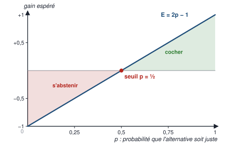
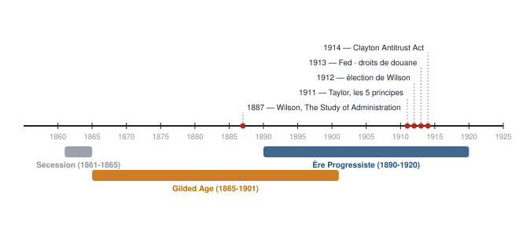
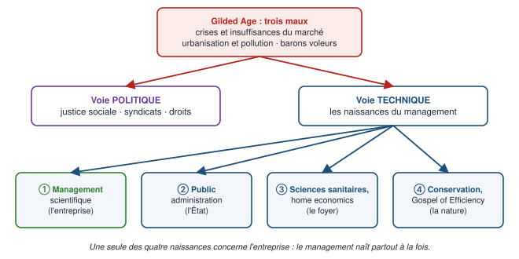
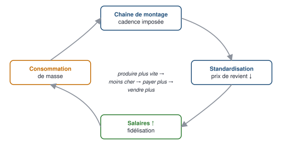
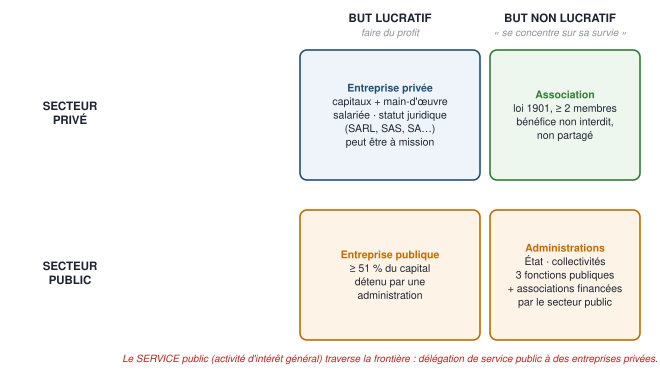

# 1 — Carte du chapitre

::: synthese Le chapitre en dix lignes
1. Le CM 1 a **deux moitiés** : une **conférence d'histoire** (États-Unis, 1890-1920) et un **répertoire de onze définitions**.
2. La conférence part d'un problème : l'**Âge doré** (1865-1901) enrichit l'Amérique mais produit **trois maux** — crises, pollution, « barons voleurs ».
3. Deux réponses possibles : la voie **politique** (syndicats, droits) et la voie **technique** — **le management**.
4. Le management **naît quatre fois à la fois** : dans l'usine (Taylor), dans l'État, dans le foyer, dans la gestion de la nature.
5. **Taylor** (1911) fonde le management scientifique ; **Ford** le transforme en système industriel.
6. En **1912-1914**, avec **Wilson** et **Brandeis**, le management devient un **programme de gouvernement**.
7. Conclusion : dès l'origine, le management **dépasse la finalité économique** — c'est **« une science de l'action non neutre »**.
8. Seconde moitié : **« Management = science de l'action qui s'applique au sein d'organisations »** — d'où onze notions pour décrire ces organisations.
9. Elles vont de l'**organisation** à la **société à mission** (loi Pacte, 2019), en passant par l'association, l'entreprise, l'innovation, la concurrence, le secteur public et les statuts.
10. L'examen est un **QCM où une mauvaise coche annule une bonne** : il récompense les **frontières exactes** entre notions voisines, et une **stratégie de coche** qui se démontre.
:::

**Les idées maîtresses à retenir absolument**

1. **Le management est né hors de l'entreprise autant qu'en elle** : trois naissances sur quatre concernent l'État, le foyer et la nature.
2. **Quatre principes de Taylor sur cinq portent sur les relations humaines**, un seul sur le rendement.
3. **Le management n'est pas neutre** : c'est un projet de société, pas un simple outil — et la société à mission, en 2019, prolonge cette idée.
4. **Organisation a deux sens** — l'action d'organiser et la chose organisée — et le management est l'action d'organiser des organisations.
5. **Les paires qui décident du QCM** : statut juridique / statuts de l'entreprise · secteur public / service public · invention / innovation · but non lucratif / interdiction du bénéfice · Taylor / Ford.
6. **La stratégie de coche** : cocher une alternative si et seulement si on l'estime juste à plus de 50 %.

**Prérequis** — aucun. Les repères d'histoire américaine, le vocabulaire juridique (responsabilité
limitée, capital social) et les sigles sont **tous enseignés dans ce document**.

::: marche Le lien avec la finance, là où il est réel
- **La Réserve fédérale** (1913) est la banque centrale américaine : l'institution dont les décisions de taux font bouger tous les marchés que tu trades. Elle naît d'un **projet de management public** — organiser un système financier qui s'effondrait à chaque panique.
- **Le *Clayton Antitrust Act*** (1914) est l'ancêtre du droit de la concurrence qui décide encore aujourd'hui des fusions entre sociétés cotées.
- **La responsabilité limitée** d'un associé de SA ou de SAS fonctionne comme une position acheteuse sur une action : **la perte maximale est la mise**, le gain n'est pas plafonné.
- **La stratégie de coche du QCM est un calcul d'espérance de gain** — exactement celui d'un trade à risque/rendement 1:1 : on ne le prend que si la probabilité de gagner dépasse 50 %.
:::

**Pour plus tard** — le calcul d'espérance de la stratégie de coche sert tel quel au **TAGE MAGE**,
dont les QCM pénalisent les mauvaises réponses ; la Fed, l'antitrust et la gouvernance des
sociétés sont de la **culture financière** de base.

<!--saut-->

# 2 — Le cours reconstruit

> **Trois sections d'apprentissage.** Chacune se travaille en un cycle APPRENDRE de quatre
> pomodoros : **P1** lecture active · **P2** restitution de mémoire, cours fermé · **P3** cartes de
> la section (§ 4.2) · **P4** questions de niveau 1 de la section (§ 5).

## 2.1 — Le cours, son cadre et son évaluation (diapositives 1 à 21)

**À quoi sert cette section.** Les vingt et une premières diapositives présentent la matière :
qui l'enseigne, ce qu'elle vise, comment elle est découpée — et surtout **comment elle est notée**.
C'est le seul endroit du cours où l'on apprend les **règles du QCM final**, et ces règles valent à
elles seules deux points : elles se démontrent au § 2.1.7.

### 2.1.1 — Qui fait quoi à la faculté (diapositives 2 à 5)

Le support distingue deux chaînes, et les confondre fait perdre du temps :

| **Personnels administratifs** — la scolarité | **Enseignants-chercheurs et professionnels** — la pédagogie |
|---|---|
| Inscription · questions pratiques de la vie universitaire · **emplois du temps et salles** · prévenir des **changements affectant cours et examens** | **Dispenser les cours** · répondre aux questions **sur les contenus** · **prévoir les contenus des examens** · **délivrer les notes**, saisies dans l'application officielle de l'AMU en fin de semestre |

**Ta scolarité** (site d'Aix, Pauliane, **L1 Division A**) : **Virginie Bamas**. Les autres contacts
du support : L1 Division B, L1 AES Aix et L1 PARI 1 → Sandrine El Beze ; à Marseille, site
Colbert, L1 Division M, L1 EG et L1 LAS → Raoul Burgart ; L1 Division N, L1 AES, L1 PARI 1 et 2
→ Nathalie Tammaro ; sinon `https://feg.univ-amu.fr/fr/contact`.

**L'équipe pédagogique :** **Pr. Agulhon** (CM, Aix — **coordination CM**) · **Dr. Klüger** (CM,
Marseille — **coordination TD**) · **Dr. Trasciani** (IPEM, *International Program in Economics
and Management*, Aix) · en TD : M. Benamara, Dr. Coron, Dr. Fardeau, M. Lauret, Mme Maillot,
Mme Naimi, Mme Oddou. À la question *« pourquoi mes professeures ont-elles des parcours
différents ? »*, le support répond en trois mots : **enseignement · expérience professionnelle ·
recherche**.

### 2.1.2 — La recherche en gestion à la FEG (diapositive 6)

::: definition Les cinq laboratoires de la FEG
| Sigle | Nom |
|---|---|
| **AMSE** | **École d'économie d'Aix-Marseille** |
| **CERGAM** | **Centre d'études et de recherche en gestion** |
| **CRETLOG** | **Centre de recherche sur le transport et la logistique** |
| **LEST** | **Laboratoire d'économie et de sociologie du travail** |
| **SESSTIM** | **Science économique et sociale de la santé et traitement de l'information médicale** |
:::

**Les trois missions de la recherche en gestion / management :**
1. **Créer de la connaissance sur les organisations.**
2. **Soutenir les praticiens dans leurs activités professionnelles grâce aux méthodes scientifiques.**
3. **Faire acquérir des compétences actuelles aux étudiants pour s'insérer sur le marché du travail.**

**Le chiffre :** en France, **1 étudiant sur 5 étudie la gestion** (source : **FNEGE** — **Fondation
nationale pour l'enseignement de la gestion des entreprises** —, observatoire 2019-2020).

**Pourquoi c'est dans le cours.** La gestion est une **discipline de recherche**, pas un recueil de
recettes. C'est ce qui explique que le CM 1 consacre onze diapositives à l'histoire du management
avant d'énoncer la moindre définition.

### 2.1.3 — Le bonus parrainage (diapositive 7)

| Élément | Ce que dit le support |
|---|---|
| **Cadre** | Bonus **« Engagement »** d'Aix-Marseille Université |
| **Principe** | Met en relation des **parrains (L2 à M1)** et des **filleuls (L1 à L3)** pendant **un semestre** |
| **Gain** | Les **parrains** obtiennent **0,25 ou 0,5 point** sur leur **moyenne semestrielle**, selon leur implication et la **satisfaction du filleul** |
| **Preuves** | Questionnaires, et éventuellement preuves physiques (billets, photos) |
| **Trois objectifs** | Promouvoir l'**entraide** · accompagner vers l'**autonomie universitaire** · favoriser l'**intégration et la réussite** |
| **Accès** | Via **Ametice** : prendre connaissance des règles, **signer une charte** |

::: piege Ce que ce bonus veut dire pour toi
Le point est gagné par le **parrain**, pas par le filleul. **En L1, tu ne peux être que filleul** :
ce dispositif ne te rapporte aucun point cette année. Il pourra t'en rapporter **en L2**, comme
parrain — c'est-à-dire l'année où chaque dixième de moyenne comptera pour ton dossier EDHEC.
:::

### 2.1.4 — Objectifs, fonctions, méthode (diapositives 8 à 12)

::: definition Les quatre objectifs du cours
1. **Former un répertoire conceptuel autour des organisations :** ① soutenir les fonctions de
   l'organisation · ② en les fédérant autour d'un **objectif commun** · ③ tout en tenant compte de
   leur **diversité** · ④ et du **contexte des opérations** de l'organisation.
2. **Décrypter l'actualité des organisations publiques comme privées :** transformation digitale,
   crises, transition écologique.
3. **Appréhender le rôle du management d'un point de vue global** et comprendre l'articulation avec
   ses dimensions complémentaires : **sociales, juridiques, économiques, écologiques**.
4. **Connaître les spécialités de la gestion.**
:::

**« Répertoire conceptuel »** annonce exactement ce qu'est la seconde moitié du CM 1 : une **liste
de définitions** à constituer (§ 2.3).

::: definition Les quatorze grandes fonctions d'une organisation — dans l'ordre alphabétique du support
| 1 à 5 | 6 à 10 | 11 à 14 |
|---|---|---|
| **Achats** | **Juridique** | **Qualité, hygiène, sécurité, environnement** |
| **Commerce / Vente** | **Logistique** | **Ressources humaines** |
| **Communication** | **Maintenance** | **Stratégie** |
| **Comptabilité / Finance** | **Marketing** | **Systèmes d'information** |
| **Contrôle de gestion / Performance** | **Production / Opérationnel** | *(quatorze au total)* |

**Leur finalité commune, écrite au centre de la diapositive :** **« Travailler ensemble, de
manière durable et soutenable. »**
:::

**L'ordre est alphabétique, pas hiérarchique** : n'y cherche pas d'importance relative. Les deux
adjectifs de la finalité — *durable* et *soutenable* — annoncent la séance 10, **Management durable**.

::: definition La complémentarité CM / TD
| **En CM — grand-angle** | **En TD — zoom** |
|---|---|
| Représenter des paysages dans leur ensemble et construire un **panorama** : du **monde des organisations** · de la **socio-histoire des sciences de gestion** · des **théories du management** · des **aspects sociaux, juridiques, économiques, écologiques** | **Focus sur les détails et le fonctionnement pratique des spécialités** : l'**environnement de l'entreprise** · les **finances** · la **comptabilité** · le **management stratégique** · **RH et recrutements** · les **innovations** · les **théories des organisations** |
:::

**Ce que ça change pour toi, qui vas en TD et pas en CM :** le TD te donnera le **détail pratique**
— comptabilité, finance, recrutement — que le CM ne fait qu'évoquer. Les sujets de TD sont donc la
meilleure indication des exercices du **contrôle continu**, qui a lieu en TD.

::: definition L'« instant Wooclap » — les deux usages
**Wooclap** est l'outil de vote en amphithéâtre utilisé pendant le CM.

| **Interactions** | **Autoévaluation** |
|---|---|
| Le professeur pose une question à l'amphithéâtre · transmet des contenus supplémentaires · « je n'ai pas compris un point de cours » | Le professeur teste mes connaissances · je transpose mes connaissances d'une situation à l'autre · le professeur envoie des exercices à faire suite au cours |

La diapositive 12 annonce **« C'est parti pour un test ! »** — **le contenu du test n'est pas
reproduit dans le support.** Ces questions sont celles que l'enseignante juge centrales : si un
camarade peut te les transmettre, elles valent de l'or (demande inscrite dans `SOURCES.md`).
:::

### 2.1.5 — Le syllabus et la bibliographie (diapositives 13 à 20)

::: definition Les dix séances de CM
| № | Titre | Contenus principaux |
|:---:|---|---|
| **1** | **Introduction au management** | Présentation du cours · conférence inaugurale · diversité du monde des organisations · « Qui est-ce ? » des organisations |
| **2** | **Actionnaire, client, salarié ou public : qui doit être roi ?** | S'organiser pour satisfaire un besoin, contribuer à la société, pouvoir se financer, fidéliser ses collaborateurs · management et **pérennité** |
| **3** | **Management ou gestion ? De la mesure à la performance** | Définitions · **écrire et compter dans le grand livre** · performance et indicateurs · **chaîne de valeur** · étude de cas e-commerce |
| **4** | **Du manager au leader : faire agir un collectif** | Management × leadership · approches du leadership · **conflit et négociation** |
| **5** | **L'étude de cas en gestion** | Fonctions des organisations · introduction aux études de cas · cas « **Dan au pays des développeurs** » · débriefing |
| **6** | **Pouvoir et rapports sociaux dans l'organisation** | Pouvoir et domination · dirigeant et fonction administrative · modes d'organisation et de régulation du travail · **inégalités et homophilie** · manager de manière inclusive |
| **7** | **Organiser le travail : motivés, motivés…** | Fonctions · **rémunérations** · motivation et relation humaine · **sens et souffrance au travail** |
| **8** | **Réseaux et innovations** | Analyse de réseaux sociaux · innovation et création de valeur · structure des réseaux d'innovation · environnement contrainte ou levier |
| **9** | **Transformation digitale et management** | Management des systèmes d'information · nouvelles technologies · **technologies et vulnérabilités** · nouvelles règles, nouveaux jeux |
| **10** | **Management durable** | Chaînes de valeurs et dépendances · **pérennité dans un monde fragile** · transition écologique · **RSO** : associer durabilité et performance |
:::

Deux termes du syllabus que le support n'explique pas : **l'homophilie** est la **tendance à
fréquenter ses semblables** (même milieu, même école, même genre) — elle explique la reproduction
des inégalités dans les organisations ; la **RSO** est la **responsabilité sociale des
organisations**, la prise en compte volontaire des effets sociaux et environnementaux de l'activité.

::: definition Les cinq références essentielles
| Auteurs | Titre | Éditeur, année |
|---|---|---|
| **Calmé, Hamelin, Lafontaine, Ducroux, Gerbaud** | *Introduction à la gestion* | **Dunod, 2013** — 462 p., coll. Management Sup |
| **De Rozario, Pesqueux** | *Théorie des organisations* | **Pearson, 2018** |
| **Eynaud, Carvalho de França Filho** | *Solidarité et organisation : penser une autre gestion* | **Érès, 2019** |
| **Plane, J.-M.** | *Théories des organisations* | **Dunod, coll. Les Topos, 2017** |
| **Thévenet, M.** | *Le manager et les 40 valeurs* | **EMS Éditions, 2017** |
:::

Quatre des cinq sont accessibles gratuitement sur **Cairn** — la plateforme d'ouvrages et de revues
en sciences humaines et sociales à laquelle l'AMU est abonnée — avec tes identifiants : toutes sauf
De Rozario et Pesqueux. La diapositive 20 montre la fiche Cairn de Calmé *et al.* : le
**chapitre 1, « L'entreprise, définition, contours, finalités », occupe les pages 1 à 66**.

::: piege Une coquille de titre dans le support
La diapositive 13 annonce **« L1 "Principes du Management" — Syllabus de cours »**, alors que
l'intitulé officiel est **« Principes de gestion »** (diapositives 1, 3, 5, 8, 14 à 19, 21, 49). Si
un QCM propose les deux libellés : **l'intitulé exact de la matière est « Principes de gestion »**.
:::

### 2.1.6 — Les modalités d'évaluation (diapositive 21)

::: examen Ce que dit le support — ce n'est pas une hypothèse
| Épreuve | Ce que dit le support |
|---|---|
| **Contrôle continu (CC)** | **Examen écrit**, en séance de TD, à **mi-semestre** |
| **Contrôle terminal (CT)** | **QCM** — questionnaire à choix multiples |
| **Note finale** | $ \max\left(\text{CT}\ ;\ \tfrac{1}{3}\text{CC} + \tfrac{2}{3}\text{CT}\right) $ |
| **Crédits** | **6 ECTS** — BCC 1, comme Principes d'économie |

**Les trois règles du QCM :** ① **pas de points négatifs** ; ② mais **à l'intérieur d'une
question, une alternative incorrecte annule une bonne alternative** ; ③ **au moins 2 alternatives
correctes par question**. La durée et le nombre de questions ne sont pas donnés.
:::

::: formule La note finale de gestion
$$ \text{note} = \max\left(\text{CT}\ ;\ \tfrac{1}{3}\text{CC} + \tfrac{2}{3}\text{CT}\right) $$

**Terme par terme :** CT = note du contrôle terminal (le QCM) · CC = note du contrôle continu ·
$ \tfrac{1}{3}\text{CC} + \tfrac{2}{3}\text{CT} $ = moyenne pondérée où le CT pèse deux fois plus que
le CC · $ \max $ = on retient **la meilleure** des deux valeurs.
:::

::: demo Le CC ne compte que s'il est supérieur au CT
$$ \tfrac{1}{3}\text{CC} + \tfrac{2}{3}\text{CT} > \text{CT} \iff \tfrac{1}{3}\text{CC} > \tfrac{1}{3}\text{CT} \iff \text{CC} > \text{CT} $$

Et dans ce cas le gain vaut exactement :
$$ \tfrac{1}{3}\text{CC} + \tfrac{2}{3}\text{CT} - \text{CT} = \tfrac{1}{3}(\text{CC} - \text{CT}) $$
:::

::: exemple Trois cas chiffrés
- **CC = 18, CT = 12** → $ \max(12\ ;\ 6 + 8) = \mathbf{14} $ : le CC fait gagner $ (18-12)/3 = 2 $ points.
- **CC = 10, CT = 16** → $ \max(16\ ;\ 3{,}33 + 10{,}67) = \mathbf{16} $ : le CC est ignoré.
- **CC = 20, CT = 17** → $ \max(17\ ;\ 6{,}67 + 11{,}33) = \mathbf{18} $.
:::

**Les trois conséquences stratégiques :**
1. **Le CC ne peut jamais faire baisser la note** : c'est une option gratuite — il se prépare à fond.
2. **Le CT reste décisif** : un CC ne rattrape qu'un tiers de son écart au CT.
3. **Pour viser 18 :** un CT à 18 suffit ; un CC à 20 avec un CT à 17 donne aussi 18.

### 2.1.7 — La stratégie de coche : le calcul qui vaut deux points

**Pourquoi c'est ici.** Un QCM où une mauvaise coche annule une bonne ne se passe pas comme un QCM
ordinaire : **cocher « pour ne rien laisser » détruit des points déjà acquis.** Ce qui suit est la
lecture littérale des trois règles de la diapositive 21.

::: formule Le score d'une question
Sur une question, notons $ C $ le nombre d'alternatives **correctes cochées** et $ I $ le nombre
d'alternatives **incorrectes cochées** :

$$ \text{score} = \max(0\ ;\ C - I) $$

Le $ -I $ traduit « une alternative incorrecte annule une bonne » ; le $ \max(0\ ;\ \cdot) $
traduit « pas de points négatifs » : une question ne retire jamais de points à une autre.
:::

*(Si l'enseignante précise une autre mécanique — par exemple une normalisation sur le nombre de
bonnes réponses —, la conclusion ci-dessous reste vraie tant qu'une mauvaise coche coûte autant
qu'une bonne rapporte. À vérifier en TD.)*

::: formule L'espérance de gain d'une coche
Soit $ p $ la probabilité que l'alternative soit correcte. La cocher fait gagner 1 point avec la
probabilité $ p $ et perdre 1 point avec la probabilité $ 1-p $ :

$$ \mathbb{E}[\text{gain}] = p \times (+1) + (1-p) \times (-1) = 2p - 1 $$
:::

::: demo Le seuil des 50 %
$$ 2p - 1 > 0 \iff p > \tfrac{1}{2} $$

**Règle : coche une alternative si et seulement si tu l'estimes juste à plus de 50 %.** En
dessous, s'abstenir rapporte davantage ; à exactement 50 %, c'est indifférent. Comme les
alternatives se compensent **une pour une**, leurs contributions s'additionnent : **tu décides
alternative par alternative**, sans raisonner sur la question entière.
:::



::: marche L'analogie exacte : un trade à risque/rendement 1:1
Une coche est un trade qui gagne 1 ou perd 1. Son espérance est celle que tu calcules déjà sur tes
futures : **taux de réussite × gain − taux d'échec × perte**. Avec un ratio 1:1, un trade n'a
d'espérance positive que si le taux de réussite dépasse 50 %. **Tu ne prendrais pas un trade à
33 % de réussite et 1:1 de ratio : ne coche pas une alternative à 33 %.**
:::

::: exemple Le cas qui piège tout le monde
Une question a **5 alternatives**, A à E. Tu es **sûr** que A est juste et que C est fausse ; B, D
et E te sont inconnues. Comme il y a **au moins 2 bonnes réponses**, il en reste au moins une parmi
B, D, E.

**Réflexe courant :** « je coche les trois, j'en aurai forcément une ». **Calcul :** si exactement
une des trois est juste, $ C = 2 $ et $ I = 2 $ : score **0**. En ne cochant que A : score **1**.

**Chacune des trois vaut $ p = 1/3 $, sous le seuil** : on ne coche que A — et éventuellement
celle des trois pour laquelle on a un vrai argument.
:::

::: piege L'exception : quand ton solde sur la question est déjà nul
Si, sur une question, $ C - I $ est **déjà nul ou négatif**, une coche fausse de plus **ne coûte
rien** — le score est au plancher — alors qu'une coche juste peut le relever. Sur une question où
tu ne sais **rien du tout**, cocher tes deux meilleurs candidats est **gratuit en risque**. Sur une
question où tu as déjà des points sûrs, chaque coche incertaine met un point acquis en jeu.
**En une phrase : on ne devine que là où on n'a rien à perdre.**
:::

::: methode La procédure, question par question
1. **Lire les cinq alternatives avant d'en cocher une seule** : elles se comparent entre elles.
2. **Trier en trois tas** : sûre-juste · sûre-fausse · incertaine.
3. **Cocher toutes les sûres-justes.**
4. **Pour chaque incertaine : parierais-je à plus de 50 % ?** Oui → coche. Non → laisse.
5. **Vérifier le compte** : une seule coche ? Relis — il y en a **au moins deux** de justes.
6. **Ne jamais revenir sur une question résolue** en fin d'épreuve : la révision anxieuse ajoute des
   coches incertaines, donc détruit des points.
:::

::: methode Le minutage — valable quelle que soit la durée, qui n'est pas donnée
| Phase | Part du temps | Ce que tu fais |
|---|:---:|---|
| **Premier passage** | **60 %** | Uniquement les questions que tu sais ; les autres marquées d'une croix, rien coché |
| **Second passage** | **30 %** | Les questions marquées, avec la procédure ci-dessus |
| **Vérification** | **10 %** | Le **report** des réponses, et rien d'autre |

Le premier passage **sécurise tous les points gratuits** avant que la fatigue et le temps ne
deviennent des contraintes.
:::

::: methode Lire une alternative : les indices qui départagent autour de 50 %
| Indice | Ce qu'il suggère | Exemple tiré de ce cours |
|---|---|---|
| **Quantificateur absolu** — *toujours, jamais, uniquement, aucun, tous* | Plus souvent **faux** | « Une association n'a **jamais** le droit de réaliser un bénéfice » → **faux** |
| **Formulation nuancée** — *peut, notamment, éventuellement* | Plus souvent **vrai** | « Une association **peut** employer des salariés » → **vrai** |
| **Chiffre précis inhabituel** | Seuil déplacé : vérifier | « au moins **50 %** du capital » → **faux**, c'est **51 %** |
| **Deux notions voisines interverties** | Piège classique du chapitre | « Les **statuts de l'entreprise** sont une forme juridique » → **faux** |
| **Affirmation exacte, mauvais auteur** | Très fréquent en histoire | « **Ford** énonce les cinq principes » → **faux**, c'est **Taylor** |

**Ces indices ne remplacent jamais la connaissance** : ils ne servent que quand tu hésites.
:::

::: methode Le contrôle continu est un ÉCRIT : le gabarit de réponse
**Une définition :** la définition du cours **au mot près** · son attribution si elle existe (Manuel
d'Oslo, loi Pacte, Agulhon et Mueller) · **un exemple pris dans le cours**.

**« Qualifiez cette organisation » :** dérouler les notions dans l'ordre — organisation ? association
ou entreprise ? but lucratif ? statut juridique ? secteur public ? service public ? société à
mission ? — en justifiant **chaque** qualification par un élément de l'énoncé.

**Une question d'histoire :** situer dans le temps (période **et** date) · nommer les acteurs ·
exposer le mécanisme · **conclure sur la portée** : la non-neutralité du management.
:::

<!--saut-->

## 2.2 — La conférence inaugurale : la naissance du management (diapositives 22 à 33)

**À quoi sert cette section.** Le cours de management commence par une **conférence d'histoire**,
et ce n'est pas un détour : elle démontre la thèse de toute la matière — **le management n'est pas
une simple technique d'entreprise, c'est un projet de société, et il n'est pas neutre.** Chaque
nom et chaque date sont des pièces de cette démonstration ; les retenir en tant que pièces les rend
beaucoup plus faciles à mémoriser qu'une liste.

### 2.2.1 — Le titre, et les quatre raisons de faire de l'histoire (diapositives 22-23)

> **« De la naissance du management à l'Ère Progressiste (États-Unis, 1890 à 1920) »**

::: definition Pourquoi aborder l'histoire du management — les quatre raisons du support
1. **Connaître les origines** de cette discipline.
2. **Comprendre les sens associés, perdus et redécouverts** autour du management.
3. **Prendre conscience de la place du management au sein de la société.**
4. **Comprendre pourquoi les États-Unis** ont beaucoup d'influence sur la manière dont nous nous
   organisons encore aujourd'hui.
:::

::: definition L'Ère Progressiste — le terme que le support ne définit pas
**En une phrase :** la période (vers **1890-1920**) où l'Amérique cherche à réparer par la réforme
les dégâts de son industrialisation.

**Définition :** période de l'histoire des États-Unis, approximativement **1890-1920**, marquée par
un vaste mouvement de réformes qui prétend corriger par la **loi**, la **régulation** et
l'**expertise** les désordres de l'industrialisation rapide : concentration industrielle,
corruption politique, conditions de travail, hygiène urbaine. **« Progressiste » y désigne une
confiance dans la réforme méthodique et la compétence technique**, pas une position gauche-droite
au sens français — c'est exactement le terrain où le management va pousser.
:::

### 2.2.2 — Les repères : de l'indépendance à l'Âge doré (diapositive 24)

::: definition Les repères historiques du support
| Période | Événement | Contenu |
|---|---|---|
| **1775-1783** | **Guerre d'indépendance** | |
| — | **Conquête de l'Ouest** | Immigration et urbanisation du pays |
| **1861-1865** | **Guerre de Sécession** | |
| **1865-1901** | **Gilded Age** ou **Âge doré** | Expansion des chemins de fer · « laissez-faire » · **dépassement de l'Angleterre** |
| **1890-1920** | **Ère Progressiste** | Période de la conférence |
:::

**La trajectoire** : une nation qui se constitue (1775-1783), s'étend (l'Ouest), manque de se briser
(1861-1865), puis connaît une croissance industrielle sans précédent, qui la fait dépasser
l'Angleterre.



::: definition Le Gilded Age, ou Âge doré (1865-1901)
**En une phrase :** une prospérité **dorée en surface** — l'expression est une critique.

**Définition :** période de croissance industrielle américaine (**1865-1901**) : expansion des
chemins de fer, fortunes colossales, « laissez-faire », dépassement de l'Angleterre. L'expression
vient du roman de **Mark Twain et Charles Dudley Warner**, *The Gilded Age* (1873) : *gilded*
signifie **« doré en surface »**, et non *golden*, « en or massif ». Sous le vernis : corruption,
spéculation, misère ouvrière. *(L'origine littéraire n'est pas dans le support ; elle explique
pourquoi le terme est péjoratif.)*
:::

::: definition Le « laissez-faire »
**En une phrase :** l'État ne se mêle pas d'économie.

**Définition :** doctrine selon laquelle l'État doit **s'abstenir d'intervenir** dans l'économie,
les marchés s'ajustant seuls. C'est la politique dominante de l'Âge doré — et **c'est précisément
ce que l'Ère Progressiste remet en cause.** Cette opposition suffit à comprendre tout
l'enchaînement de la conférence.
:::

::: piege Les deux périodes se chevauchent
**Âge doré : 1865-1901. Ère Progressiste : 1890-1920.** Les deux se recouvrent de 1890 à 1901 : la
réaction progressiste commence avant la fin de l'Âge doré. Un QCM peut décaler une borne — les
quatre dates se savent exactement.
:::

### 2.2.3 — Le problème : rêve américain et exploitation (diapositive 25)

::: definition Les trois maux — Agulhon et Mueller, 2023b
1. **Crises économiques, insuffisances du marché.**
2. **Urbanisation et pollution.**
3. **Le péril des « barons voleurs » pour la concorde nationale.**
:::

*(La mention « 2023b » signifie qu'il existe un « 2023a » des mêmes auteurs, que le support ne cite
pas.)*

::: definition Les « barons voleurs » (*robber barons*)
**En une phrase :** les grands patrons de l'Âge doré, accusés de s'enrichir en écrasant ouvriers et
concurrents.

**Définition :** terme polémique désignant les **grands industriels et financiers** de la fin du
XIXᵉ siècle américain, accusés d'avoir bâti leur fortune par la **concentration monopolistique**, la
manipulation des prix et l'**influence sur le pouvoir politique**. Les deux caricatures du support
en donnent les deux versions : des **capitaines d'industrie exploitant la classe ouvrière**, et des
**élites asservissant le peuple** — salaires, taxes, récoltes — **au moyen de la législation, de la
guerre, des droits de douane et de monopoles**.
:::

::: synthese Pourquoi « péril pour la concorde nationale »
L'accusation n'est pas seulement morale, elle est **politique**. Si une poignée d'hommes capte la
richesse **et** les moyens de la loi, le **rêve américain** — chacun peut s'élever par son travail —
devient un mensonge, et avec lui la légitimité de tout l'édifice. Ce que les progressistes croient
menacé, c'est **la cohésion de la nation**.

**C'est ce mécanisme qui explique la conclusion (§ 2.2.10)** : si le problème est la cohésion
nationale, le management, présenté comme une solution, est d'emblée **un projet de société**.
:::

### 2.2.4 — Deux réponses : la politique et la technique (diapositive 26)

La diapositive pose la question : **« Contrecarrer les effets négatifs par la politique et/ou par
la technique ? »** — et le **« et/ou »** compte : les deux voies se rejoindront chez Wilson et
Brandeis (§ 2.2.8 et 2.2.9).

| La voie **politique** | La voie **technique** |
|---|---|
| **Revendications politiques et sociales :** justice économique et sociale · développement des **syndicats** · conquête de **nouveaux droits** | **Les naissances du management** |

**Repère iconographique :** la **marche pour le droit de vote des femmes de 1913** — elles
n'obtiendront le vote fédéral qu'en **1920**, borne de fin de l'Ère Progressiste.

::: definition Les quatre naissances du management — Agulhon et Mueller, 2023b, et 2024 pour la troisième
**① Le management scientifique.** L'application de la méthode expérimentale à l'organisation du
travail industriel : mesurer, décomposer, standardiser. C'est Taylor (§ 2.2.5). En français :
**organisation scientifique du travail (OST)**.

**② La *public administration*, ou management public.** L'idée qu'une administration d'État est une
**organisation** comme une autre, qui doit être dirigée avec méthode par des professionnels
compétents, et non distribuée en récompense politique. Texte fondateur : ***The Study of
Administration***, **Wilson, 1887** (§ 2.2.8).

**③ Les sciences sanitaires et la *home economics*, l'économie domestique.** Les mêmes principes
d'efficacité appliqués à la **santé publique** (hygiène, eau, épidémies) et au **foyer** —
organisation du travail domestique, nutrition, budget familial. Discipline largement portée par des
femmes, à une époque où les carrières industrielles leur sont fermées.

**④ La *conservation*, l'écologie, et le *Gospel of Efficiency*.** La *conservation* est la gestion
rationnelle des **ressources naturelles** — forêts, eau, sols — contre leur gaspillage. Le *Gospel
of Efficiency*, « l'évangile de l'efficacité », désigne la **croyance de l'époque en l'efficacité
comme valeur morale** : gaspiller n'est pas seulement coûteux, c'est mal.
:::



::: synthese Ce que cette liste démontre — la thèse du chapitre
**Sur les quatre naissances, une seule concerne l'entreprise privée.** Les trois autres portent sur
l'**État**, le **foyer** et la **nature**. Le management n'est donc pas né dans l'usine pour se
diffuser ensuite : **il naît simultanément partout**, comme une réponse générale à un même problème
— organiser rationnellement pour éviter le gaspillage et restaurer la concorde.
**Si un QCM demande ce que prouvent les quatre naissances, c'est cela.**
:::

::: piege La liste la plus piégeuse du chapitre
Un QCM proposera trois naissances plus un intrus. **Elles sont quatre**, et deux ne sont pas du
management d'entreprise : l'**économie domestique** et l'**écologie**.
:::

### 2.2.5 — Taylor et le management scientifique (diapositive 27)

**Le problème que Taylor résout.** Dans l'atelier de la fin du XIXᵉ siècle, la manière de travailler
est une affaire de **coutume** : chaque ouvrier a ses gestes, transmis par habitude, et le
contremaître n'a aucun moyen de savoir ce qu'une tâche **devrait** coûter en temps. Le support donne
les cinq principes sans exposer la méthode ; sans elle, ce sont cinq slogans.

::: definition Le management scientifique — la méthode de Frederick W. Taylor
**En une phrase :** traiter le travail comme un objet d'étude, mesuré et optimisé.

**La méthode, en quatre temps :**
1. **Décomposer** chaque tâche en opérations élémentaires.
2. **Chronométrer** chacune et mesurer les rendements.
3. En déduire **la meilleure façon de faire** — *the one best way* — et la **standardiser**.
4. **Séparer la conception de l'exécution** : un bureau des méthodes conçoit, l'ouvrier exécute.
:::

::: definition Les cinq principes du management scientifique — Taylor, 1911, au mot près
1. **Remplacer les règles empiriques par la science.**
2. **Obtenir l'harmonie dans l'action du groupe.**
3. **Parvenir à la coopération plutôt qu'à un individualisme chaotique.**
4. **Travailler pour un rendement maximum.**
5. **Développer tous les travailleurs dans toute la mesure possible pour leur propre prospérité et
   celle de leur entreprise.**
:::

| Principe | Ce qu'il vise réellement |
|---|---|
| **1. Science** | Substituer la **mesure** à la **coutume** : le geste fondateur |
| **2. Harmonie** | Réponse directe au **conflit social** de l'Âge doré |
| **3. Coopération** | Taylor prétend **supprimer le conflit** en le rendant sans objet |
| **4. Rendement** | Le seul principe purement productif des cinq |
| **5. Développement** | Promesse d'un **gain partagé** : la productivité doit enrichir l'ouvrier autant que le patron |

::: piege Ce que la lecture des cinq principes doit te faire remarquer
**Quatre principes sur cinq parlent de relations humaines — harmonie, coopération, développement,
prospérité partagée — et un seul de rendement.** L'image d'un Taylor obsédé par la cadence est
contredite par sa propre doctrine : c'est la preuve interne de la thèse de la conférence. **« 4 sur
5 »** est exactement le genre de détail qui départage deux alternatives.
:::

### 2.2.6 — Ford (diapositive 28)

::: definition Henry Ford, nouvelle figure du monde des affaires — les trois apports
1. **La chaîne de montage.**
2. **La standardisation de la production.**
3. **L'augmentation des salaires** : **fidélisation des ouvriers** et **encouragement de la
   consommation en masse**.

Repère culturel : ***Les Temps modernes*, Charlie Chaplin, 1936.**
:::

::: demo Pourquoi les trois apports tiennent ensemble
1. **La chaîne** amène la pièce à l'ouvrier plutôt que l'inverse : le temps mort disparaît, et **la
   cadence est imposée par la machine**, non négociée.
2. **La standardisation** est la condition de la chaîne : on ne produit en flux continu que des
   pièces **interchangeables**. D'où un prix de revient qui s'effondre.
3. **La hausse des salaires** résout les deux problèmes que les deux premiers créent : le travail à
   la chaîne est si pénible que les ouvriers démissionnent en masse — le salaire élevé **fidélise** ;
   et une production de masse exige une **consommation de masse** — il faut que les ouvriers
   puissent acheter ce qu'ils produisent.
:::



*Précision hors support :* cette hausse porte un nom, le ***five dollar day***, annoncé par Ford en
**janvier 1914** — le doublement du salaire journalier. Le support ne la date pas ; ne l'écris en
copie que si la question le demande.

**Le contrepoint** : *Les Temps modernes* (1936), où l'ouvrier est littéralement avalé par la
machine, est l'**envers** de la promesse du principe 5 de Taylor — et il prépare la question de la
diapositive 32 : **aliénation ou autonomisation ?**

### 2.2.7 — Le management entre en politique : l'élection de 1912 (diapositive 29)

| Élément | Ce qui s'est passé |
|---|---|
| **Le mécanisme** | **Dispersion des voix** entre **Républicains (Taft)** et **Progressistes (Roosevelt)** |
| **La conséquence** | Le candidat **démocrate**, **Woodrow Wilson**, est élu président en **1912** |
| **L'anecdote du support** | **Theodore Roosevelt** survit à une **tentative d'assassinat à Milwaukee en 1912** : la balle traverse le **manuscrit de son discours** |

::: demo Pourquoi la division a fait perdre les Républicains
1. **Theodore Roosevelt**, ancien président républicain, n'obtient pas l'investiture de son parti,
   qui la donne au président sortant **William Howard Taft**.
2. Roosevelt se présente alors **sous une bannière progressiste distincte**.
3. L'électorat républicain se **partage entre Taft et Roosevelt**.
4. Le **démocrate Woodrow Wilson** l'emporte avec un électorat resté uni.

**En une phrase : ce ne sont pas les idées progressistes qui perdent en 1912, c'est le parti
républicain qui se divise — et le vainqueur, Wilson, reprend une bonne partie de ces idées.**
:::

### 2.2.8 — Woodrow Wilson, figure de l'expansion du management (diapositive 30)

::: definition L'itinéraire de Wilson — les sept jalons du support
1. **Docteur de l'université Johns Hopkins** et **carrière académique**.
2. ***The Study of Administration*** — **1887**.
3. **Doyen de l'université de Princeton.**
4. **2020** — **Princeton retire le nom de Wilson** de son école de politique publique et d'études
   internationales.
5. **Gouverneur du New Jersey.**
6. **Président des États-Unis** (élu en 1912).
7. **Premières confrontations aux trusts.**
:::

::: definition *The Study of Administration* (1887)
**En une phrase :** l'article qui fait de l'administration publique une science à part entière.

**Définition :** Wilson y soutient que l'**administration publique** doit être étudiée comme une
**discipline propre**, distincte de la politique : les élus décident des orientations,
l'administration les exécute avec **efficacité et compétence technique**. C'est **le texte
fondateur de la *public administration***, la deuxième naissance du management — **c'est pour cela,
et pour cela seulement, que Wilson figure dans un cours de gestion.**
:::

::: definition Trust — la définition du support
**« Grandes entreprises aux positions dominantes sur plusieurs marchés proches. »**
:::

::: piege Le jalon de 2020, à ne pas passer sous silence
**En 2020, Princeton retire le nom de Wilson** de son école, en raison de ses positions
ségrégationnistes. Le support place ce fait **au milieu du parcours**, sans commentaire. Sa présence
est délibérée : elle prépare **« du moins une science de l'action non neutre »** — les fondateurs du
management ne sont pas des figures neutres, et la discipline en hérite.
:::

### 2.2.9 — Louis Brandeis et le temps des réformes (diapositive 31)

**Louis Brandeis**, juriste, **« grand lecteur de Taylor »**, influent dans le gouvernement Wilson
pour la **modernisation de l'économie via le management scientifique**. C'est le point où les deux
voies de la diapositive 26 se rejoignent : une doctrine née dans l'atelier devient un **programme de
gouvernement**.

::: definition Les trois réformes — nommées par le support, expliquées ici
| Année | Réforme | Ce qu'elle fait |
|:---:|---|---|
| **1913** | **Réforme de la réserve fédérale** | Crée une **banque centrale** pour les États-Unis, chargée d'émettre la monnaie et de prêter aux banques en cas de panique. Le pays n'en avait pas : chaque crise bancaire se propageait sans amortisseur. **Organiser le système financier**, c'est déjà du management appliqué à l'État |
| **1913** | **Réforme des droits de douane** et des prélèvements sur les **produits manufacturés et semi-manufacturés** | Les droits élevés protégeaient les grandes entreprises américaines de la concurrence étrangère : les abaisser, c'est **rouvrir la concurrence** contre les positions dominantes |
| **1914** | **Le *Clayton Antitrust Act*** — un projet de loi pour **interdire les pratiques anticoncurrentielles** | Vise les ententes sur les prix, les discriminations tarifaires, les prises de participation destinées à réduire la concurrence |

**Les trois visent la même cible** : le pouvoir des **trusts**, donc les **barons voleurs** de la
diapositive 25. **La boucle de la conférence se referme ici.**
:::

Et une quatrième contribution, d'une autre nature : **« implication dans le débat public et
diffusion des idées managériales »**. Le management se répand aussi par la **conversation publique**.

### 2.2.10 — Ce que la conférence établit (diapositives 32-33)

::: definition La conclusion de la conférence — quatre affirmations, à restituer telles quelles
1. **Dès ses origines, le management est vu comme un dispositif dépassant la seule finalité
   économique.**
2. **Il est vu comme un levier ayant pour objectif de favoriser la cohésion autour du rêve
   américain.**
3. **Aliénation ou autonomisation ?**
4. **Du moins une science de l'action non neutre — dont l'héritage reste.**
:::

::: synthese La démonstration, en une chaîne
1. L'Âge doré produit des **maux** qui menacent la **concorde nationale** (§ 2.2.3).
2. Deux voies : **politique** et **technique** (§ 2.2.4).
3. La voie technique donne **quatre naissances simultanées**, dont **trois hors de l'entreprise**.
4. Taylor : **quatre principes sur cinq** portent sur l'harmonie sociale (§ 2.2.5).
5. Ford : la productivité **finance le salaire et crée le marché** (§ 2.2.6).
6. 1912-1914 : la doctrine devient **un programme de gouvernement** (§ 2.2.7 à 2.2.9).

**Donc** le management dépasse **la seule finalité économique** et vise la **cohésion autour du rêve
américain**.
:::

::: piege « Aliénation ou autonomisation ? » — la question que le cours laisse ouverte
| **Aliénation** | **Autonomisation** |
|---|---|
| La chaîne impose sa cadence ; conception et exécution sont séparées ; *Les Temps modernes* | Les salaires montent, la consommation de masse devient possible, le principe 5 de Taylor promet la prospérité de l'ouvrier |

**Le support ne tranche pas, et il ne faut pas trancher.** La seule réponse que le cours assume est
la quatrième ligne : **« du moins une science de l'action non neutre »** — le management **produit
des effets sociaux, quels qu'ils soient**. Répondre « aliénation » ou « autonomisation » à une
question ouverte serait une faute ; **la bonne réponse est la non-neutralité.**
:::

La diapositive 33 est une pause de 15 minutes, sans contenu.

<!--saut-->

## 2.3 — La diversité du monde des organisations : les onze notions (diapositives 34 à 49)

**À quoi sert cette section.** La seconde moitié du CM change de nature : on passe d'une
démonstration historique à un **répertoire de définitions**. Le support l'annonce ainsi :

::: definition La définition du management — à savoir mot pour mot
**« Management = science de l'action qui s'applique au sein d'organisations. »** Et le support
ajoute : **« Univers hétérogène qui nécessite de maîtriser quelques définitions. »**
:::

**Le mot clé est *hétérogène*.** Les onze notions montrent qu'« organisation » ne veut pas dire
« entreprise », et que les frontières sont moins nettes qu'il n'y paraît : une association peut
faire des bénéfices, une entreprise privée peut assurer un service public, une société peut se
donner une mission. **C'est sur ces frontières que le QCM est construit.**



### 2.3.1 — Organisation (diapositive 35)

::: definition Organisation
**En une phrase :** à la fois l'action d'organiser, et le groupe organisé qui en résulte.

**Définition du support (entrée de dictionnaire) :**
**A.** En parlant d'un corps, d'un être ; correspond à *organiser*.
**1.** **Action d'organiser** (quelque chose), de s'organiser ; **résultat de cette action**.
**2.** Souvent dans un contexte administratif : **a)** **mode selon lequel un ensemble est
structuré** (en vue de résultats, d'actions déterminés) ; **b)** par métonymie : **ensemble
structuré (de services, de personnes) formant une association ou une institution ayant des buts
déterminés**.

**Organiser :** « Doter quelque chose d'une certaine structure ; combiner les éléments d'un ensemble
d'une certaine manière. »
:::

**Les six dimensions citées par le support :** **structure · objectifs · ressources · processus ·
contexte · réseaux.**

::: synthese Pourquoi cette double définition commande tout le cours
| Sens **1** — l'**action** | Sens **2 b)** — la **chose** |
|---|---|
| « Action d'organiser, de s'organiser ; résultat de cette action » | « Ensemble structuré… formant une association ou une institution ayant des buts déterminés » |
| Un **verbe** : *organiser* | Un **nom** : *une* organisation |

Le management, **« science de l'action »**, porte sur le premier sens ; les entreprises, associations
et administrations relèvent du second. **Le management est donc l'action d'organiser des
organisations.** Les six dimensions sont les six prises de cette action, et elles annoncent les dix
séances : structure (séance 6), objectifs (2), ressources (7), processus (3), contexte (9 et 10),
réseaux (8).
:::

### 2.3.2 — Association (diapositive 36)

::: definition Association
**En une phrase :** des personnes qui s'unissent volontairement pour un projet commun, sans
chercher à s'enrichir.

**Définition du support :**
**[A]** **Groupement qui réunit des personnes désirant partager des activités ou réaliser un projet
commun.**
**[B]** Une structure dotée de **trois caractéristiques** :
1. **L'organisation et les règles de fonctionnement sont déterminées par les membres** et regroupées
   dans les **« statuts »**.
2. **Les membres s'engagent à mettre en commun leurs connaissances ou leur activité, de façon
   volontaire.**
3. **Les membres ne cherchent pas à faire des bénéfices**, mais seulement à prendre part à une
   activité sociale — **la réalisation d'un bénéfice n'est cependant pas interdite**.

**Composition :** au **minimum 2 membres** dans les associations **loi 1901**, et éventuellement des
**bénévoles** ou des **salariés**.
:::

**La loi 1901** est la loi du **1ᵉʳ juillet 1901** relative au contrat d'association, qui régit la
quasi-totalité des associations françaises. Une association **peut employer** des salariés.

::: piege La phrase que la moitié de la promotion retiendra à l'envers
Une association **peut** réaliser un bénéfice. Ce qu'elle ne peut pas faire, c'est le **distribuer**
à ses membres : il est réinvesti dans l'objet de l'association. **Ce n'est pas le bénéfice qui est
interdit, c'est son partage.** L'alternative « une association n'a pas le droit de faire de
bénéfices » est **fausse**, et le support le dit explicitement.
:::

### 2.3.3 — But lucratif et entreprise (diapositives 37-38)

::: definition But lucratif et but non lucratif
**En une phrase :** chercher à gagner de l'argent, ou chercher à durer pour accomplir une mission.

| **À but lucratif** | **À but non lucratif** |
|---|---|
| Activité **économique ou commerciale** dont le **principal objectif est de faire du profit** | **Se concentre sur sa survie** |
| Objectif : **gagner plus d'argent qu'elle n'en dépense** | Peut concrétiser des projets entrant dans le **champ d'action prévu dans ses statuts** grâce à une **activité économique** |
:::

::: piege « Se concentre sur sa survie » — la formule à ne pas mal lire
Cela ne veut pas dire qu'une telle organisation est fragile : son critère de réussite n'est pas le
**profit** mais la **pérennité de son action** — **durer assez longtemps pour accomplir son objet**.
C'est le fil repris en séance 2 (pérennité) et en séance 10 (pérennité dans un monde fragile).
:::

::: definition Entreprise
**En une phrase :** du capital et des salariés réunis pour produire ou vendre.

**Définition du support :**
**A.1.** **Action d'entreprendre** quelque chose ; ce que quelqu'un entreprend.
**B. Économie — 1.** **Mise en œuvre de capitaux et d'une main-d'œuvre salariée en vue d'une
production ou de services déterminés.**
**2.** Par métonymie : **unité économique combinant des capitaux et une main-d'œuvre salariée en vue
de la production de biens, ou de leur commercialisation. Synonyme de firme.**

**Entreprendre :** « Mettre à exécution un projet nécessitant de **longs efforts**, la **réunion de
moyens**, une **coordination**. »
:::

**Ce qu'un QCM peut isoler :** **« capitaux et main-d'œuvre salariée »** — les **deux**, pas l'un ou
l'autre — et **« synonyme de firme »**. Et la frontière avec l'association : mise en commun
**volontaire** d'activité d'un côté, **capital + salariés** de l'autre.

### 2.3.4 — Innovation (diapositive 39)

::: definition Innovation — Manuel d'Oslo (OCDE)
**En une phrase :** une nouveauté réellement mise en œuvre — sur un marché ou dans l'organisation.

**Définition du support :** **« Mise en œuvre d'un produit (bien ou service) ou d'un procédé nouveau
ou sensiblement amélioré, d'une nouvelle méthode de commercialisation ou d'une nouvelle méthode
organisationnelle dans les pratiques de l'entreprise, l'organisation du lieu de travail ou les
relations extérieures. »**

**Les quatre types :** 1. **Produit** · 2. **Procédé** · 3. **Organisationnelle / managériale** ·
4. **Sociale**.
:::

**OCDE** = **Organisation de coopération et de développement économiques**. Le **Manuel d'Oslo** est
sa référence méthodologique pour **définir et mesurer l'innovation** : c'est de lui que viennent les
statistiques comparables d'un pays à l'autre.

::: piege La distinction qui tombe à coup sûr — et deux erreurs classiques
**« L'invention est une découverte nouvelle, tandis que l'innovation ajoute la notion de marché
pour créer un succès commercial. »** **Invention → nouveauté. Innovation → nouveauté + marché.**

- **Croire qu'innover, c'est inventer** : faux, l'innovation suppose la mise en œuvre et le marché.
- **Croire qu'innover, c'est technologique** : faux, **réorganiser un service est une innovation**
  (méthode organisationnelle).
- **Le 4ᵉ type, « sociale », ne figure pas dans la phrase citée** : c'est le support qui l'ajoute.
  Les quatre types du cours sont bien **produit · procédé · organisationnelle/managériale · sociale**.
:::

Le support renvoie cette notion au **TD 7** : elle sera approfondie, et elle compte.

### 2.3.5 — Concurrence, coopération, coopétition (diapositives 40 à 42)

::: definition Concurrence
**En une phrase :** des entreprises qui se battent pour les mêmes clients.

**Définition du support :** **« La concurrence est la rivalité entre plusieurs agents économiques
pour acquérir des parts de marché sur un même marché, en vendant des biens identiques ou
similaires. »** **« La concurrence est ainsi une compétition entre des producteurs, d'ordinaire des
entreprises, pour capter la demande émanant des consommateurs. »**

**Les deux conditions pour agir en concurrent :** 1. **disposer de la liberté d'entreprendre** ;
2. **disposer de la possibilité d'offrir ou de demander une ressource rare et excluable**.

**La politique de la concurrence** vise à **assurer le maintien de conditions permettant la
concurrence sur les marchés**.
:::

::: definition Excluable — le mot que le support emploie sans le définir
**En une phrase :** un bien est excluable si l'on peut empêcher celui qui n'a pas payé d'en profiter.

Une place de cinéma est excluable ; l'éclairage public ne l'est pas. **Pourquoi la condition est
dans la définition :** on ne peut se disputer la vente d'un bien que si l'on peut **en réserver
l'usage à celui qui l'achète** — sinon il n'y a pas de marché à disputer.
:::

Les deux conditions sont donc l'une **juridique** — la liberté d'entreprendre — et l'autre
**économique** — une ressource **rare et excluable**.

::: definition Coopération — les quatre sens du support
1. **Action de participer à une œuvre commune** (collaboration).
2. **Apporter sa coopération à une entreprise** (aide, concours).
3. **Politique d'entente et d'échanges** culturels, économiques ou scientifiques.
4. **Système économique par lequel des personnes intéressées à un but commun s'associent et se
   répartissent le profit en fonction de leur part d'activité** → la **coopérative**.
:::

::: definition Coopétition
**En une phrase :** être concurrents et partenaires en même temps.

**Définition du support :** **« Alternance de rapports de compétition et de coopération entre 2
entités ou plus. »**
:::

::: exemple Danone, Nestlé Waters, PepsiCo — pourquoi c'est de la coopétition
**Danone** et **Nestlé Waters** s'associent en **2017** à l'américain **Origin Materials** pour
concevoir des **bouteilles en plastique issu de matériaux 100 % biosourcés** (à base de **fibres
cellulosiques**) ; **PepsiCo** les rejoint **un an plus tard** ; ils construisent en **Ontario
(Canada)** une **usine de démonstration, un prototype**, capable de produire **18 000 tonnes** de ce
plastique.

**Le mécanisme :** ces groupes sont **concurrents directs** sur les boissons. La recherche est trop
coûteuse et risquée pour un seul, et la bouteille ne fait perdre à personne son avantage : on se
bat sur la boisson, pas sur l'emballage. **On coopère en amont pour continuer à se concurrencer en
aval.**
:::

::: marche La même chose sur les marchés
Deux banques concurrentes montent ensemble un **syndicat de placement** pour introduire une société
en Bourse : elles partagent le risque de l'opération, puis se battent à nouveau pour les clients.
C'est de la coopétition.
:::

### 2.3.6 — Secteur public et service public (diapositive 43)

::: definition Secteur public
**En une phrase :** l'ensemble des organisations contrôlées par la puissance publique.

**Définition du support :** **« Le secteur public se définit comme l'ensemble des activités
économiques et sociales gérées par des structures publiques. »** Il comprend :
1. **Les administrations publiques de l'État et des collectivités territoriales** (**3 fonctions
   publiques**).
2. **Les entreprises dont au moins 51 % du capital social est détenu par une administration
   publique.**
3. **Les associations qui dépendent du secteur public pour leur financement.**
:::

**Les trois fonctions publiques**, que le support cite sans les nommer : la **fonction publique
d'État**, la **fonction publique territoriale** (communes, départements, régions) et la **fonction
publique hospitalière**.

::: definition Service public
**En une phrase :** une activité d'intérêt général — qui peut être assurée par un opérateur privé.

**Définition du support :** **« Le service public désigne une activité d'intérêt général. »**
« Certaines fonctions considérées comme relevant du service public peuvent être assurées par le
secteur privé, généralement par **délégation de service public** » — exemples : **distribution et
traitement des eaux, collecte des déchets**.
:::

::: definition Délégation de service public
Contrat par lequel une personne publique **confie à un opérateur — souvent privé — la gestion d'un
service public**, en le rémunérant substantiellement sur les résultats de l'exploitation. C'est ce
qui rend possible la dissociation : l'activité reste d'intérêt général, l'opérateur est privé.
:::

::: piege Secteur public ≠ service public — et le seuil de 51 %
Le **secteur** est une **catégorie d'organisations** ; le **service** est une **nature d'activité**.
Une entreprise privée peut rendre un service public sans appartenir au secteur public.
**Le seuil : au moins 51 % du capital** — le **contrôle majoritaire**. Un QCM proposera 50 %, 49 % ou
« une participation » : **le support dit au moins 51 %.**
:::

### 2.3.7 — Statuts juridiques et statuts de l'entreprise (diapositives 44-45)

::: definition Statut juridique
**En une phrase :** la forme légale choisie pour l'entreprise (SARL, SAS, SA…).

**Définition du support :** **« Forme juridique revêtue par une entreprise. »** Il **« indique le
cadre juridique dans lequel elle naît, évolue et interagit avec ses partenaires »**.
**Caractéristiques propres :** structure de l'entreprise · **responsabilité de l'entrepreneur et des
associés** · forme de fonctionnement. **Conséquences** dans les domaines **comptable, fiscal,
social, commercial**.
:::

**Le support liste quatorze sigles sans en développer aucun** — c'est l'ellipse la plus lourde du CM.

| Sigle | Développé | Responsabilité des associés |
|---|---|---|
| **Microentreprise** | Régime fiscal et social simplifié d'une entreprise individuelle | Entrepreneur seul — un **régime**, pas une société |
| **EI** | **Entreprise individuelle** | Entrepreneur seul, sans création de société |
| **EURL** | **Entreprise unipersonnelle à responsabilité limitée** | **Limitée aux apports** |
| **SARL** | **Société à responsabilité limitée** | **Limitée aux apports** |
| **SASU** | **Société par actions simplifiée unipersonnelle** | **Limitée aux apports** |
| **SAS** | **Société par actions simplifiée** | **Limitée aux apports** |
| **SNC** | **Société en nom collectif** | **Indéfinie et solidaire** |
| **SA** | **Société anonyme** | **Limitée aux apports** |
| **SCS** | **Société en commandite simple** | **Commandités** : indéfinie et solidaire · **commanditaires** : limitée à l'apport |
| **SCA** | **Société en commandite par actions** | *idem* |
| **SCI** | **Société civile immobilière** | Société civile : indéfinie, **à proportion des parts**, non solidaire |
| **SCP** | **Société civile professionnelle** | *idem* |
| **SCOP** | **Société coopérative et participative** | Les **salariés sont les associés majoritaires** ; prend la forme d'une SARL, SAS ou SA |
| **SEL** | **Société d'exercice libéral** | Permet aux **professions libérales réglementées** d'exercer en société |

*(La colonne « responsabilité » est reconstruite : le support ne donne que la liste. Les règles
évoluent avec la législation — retiens le principe, la distinction limitée / indéfinie.)*

::: definition Responsabilité limitée, responsabilité indéfinie
**Limitée :** l'associé ne peut perdre **que ce qu'il a apporté** ; les créanciers ne peuvent pas
saisir son patrimoine personnel. **Indéfinie :** l'associé répond des dettes de la société **sur son
patrimoine personnel** ; elle est **solidaire** lorsqu'un créancier peut réclamer la totalité de la
dette à **un seul** associé, à charge pour lui de se retourner contre les autres.
:::

::: marche Responsabilité limitée = perte maximale connue
L'actionnaire d'une SA ne peut pas perdre plus que le prix de ses actions : c'est une position
acheteuse sans effet de levier, **perte bornée à la mise, gain non plafonné**. L'associé de SNC, lui,
est dans la situation d'un vendeur d'option non couvert : **perte non bornée**.
:::

::: definition Statuts de l'entreprise
**En une phrase :** le contrat fondateur de la société, qui fixe toutes ses règles.

**Définition du support :** **« Un contrat écrit et signé des associés, qui recense toutes les
particularités d'une société et les règles qui s'y appliquent. »**

**Les huit éléments, dans l'ordre du support :** 1. **statut juridique** · 2. **dénomination
sociale** — le **nom** · 3. **objet social** — la **mission** · 4. **règles de fonctionnement**,
dont celles liées au statut juridique · 5. **durée de vie** · 6. **siège social** · 7. **apports des
associés** · 8. **montant du capital social**.
:::

**Trois rubriques nommées sans définition :** la **dénomination sociale** est le **nom officiel**,
celui des actes ; l'**objet social** décrit les **activités que la société est autorisée à exercer** ;
le **siège social** est l'**adresse officielle**, qui détermine notamment le tribunal compétent.

::: definition Capital social
**« Somme apportée par les associés ou les actionnaires dans une société. »** **Minimum : 1 €**,
**sauf pour les SA et les SCA : 37 000 €.**
:::

::: piege La confusion que le support signale lui-même
**« Attention : le statut juridique ne doit pas être confondu avec les statuts de l'entreprise ! »**
**Statut juridique** = **la forme** (SARL, SAS…), **une** des huit rubriques. **Statuts de
l'entreprise** = **le contrat** qui contient cette forme **et sept autres rubriques**.
Et deux autres lignes de partage : **microentreprise ≠ société** (c'est un régime) ; **1 € sauf SA et
SCA : 37 000 €** — les deux formes qui font **appel à des actionnaires**.
:::

### 2.3.8 — La société à mission (diapositive 46)

::: definition La loi Pacte (2019)
**Loi relative à la croissance et la transformation des entreprises.** Avant elle, **le droit
français ne reconnaissait pas la notion d'intérêt social ou environnemental** dans la définition de
l'entreprise : une société était réputée constituée dans l'intérêt de ses associés. La loi crée la
qualité de **société à mission**.
:::

::: definition Société à mission
**En une phrase :** une société qui inscrit dans ses statuts une mission sociale ou
environnementale, contrôlée de l'extérieur.

**Les quatre conditions du support :**
- **L'entreprise affirme publiquement sa raison d'être** et **un ou plusieurs objectifs sociaux et
  environnementaux** qu'elle doit poursuivre dans le cadre de son activité — sa **mission**.
- **La mission est inscrite dans les statuts de l'entreprise.**
- **Son exécution est vérifiée par un organisme tiers indépendant.**
- **L'entreprise rend des comptes sur sa mission**, et **ses objectifs financiers doivent préserver
  l'exécution de cette mission**.
:::

::: piege L'avertissement du support, mot pour mot
**« Attention : il ne s'agit pas d'un statut juridique ! »** C'est une **qualité** que peut revêtir
une société, **quelle que soit sa forme juridique**.
:::

::: synthese Pourquoi la société à mission clôt le CM 1
La dernière condition est la plus forte : **« les objectifs financiers doivent préserver
l'exécution de cette mission »** — la rentabilité devient une **contrainte** au service de la
mission, non l'objectif. **C'est la thèse de la conférence, transposée en 2019** : le management
comme « dispositif dépassant la seule finalité économique ». Le CM 1 boucle sur lui-même — et ouvre
la séance 2 : si l'entreprise poursuit autre chose que le profit, **à qui doit-elle rendre des
comptes ?**
:::

### 2.3.9 — « Qui est-ce ? » des organisations, et clôture (diapositives 47 à 49)

**Les règles du jeu (d. 47) :** une entité est **affichée et/ou décrite**, il faut **lui associer les
concepts définis précédemment dans le temps imparti** ; les **recherches sur l'entité sont
autorisées**, le travail **seul ou en équipe** aussi. **Les entités elles-mêmes ne sont pas
reproduites dans le support.**

::: methode Ce que ce jeu t'annonce de l'examen
L'exercice consiste à **qualifier une organisation réelle** à l'aide des onze notions : association
ou entreprise ? but lucratif ? quel statut ? secteur public ? service public ? société à mission ?
**C'est exactement ce qu'un QCM — ou le CC écrit — peut faire avec une organisation donnée en
énoncé.** Le niveau 2 du § 5 et la question C2 du niveau 3 sont construits sur ce principe.
:::

Les diapositives 48 (« Avez-vous des questions ? ») et 49 (remerciements, rendez-vous au CM suivant)
ne contiennent pas de contenu examinable.

<!--saut-->

# 3 — Points de vigilance

> **Relu avant chaque examen blanc et la veille de l'épreuve.** Sur un QCM à alternatives
> compensées, c'est cette section qui transforme un 15 en 18 : les frontières exactes entre
> notions voisines, là où l'examen construit ses pièges.

## 3.1 — Les dix paires à ne jamais confondre

| № | Ne pas confondre | Le critère qui tranche |
|:---:|---|---|
| **1** | **Statut juridique** / **statuts de l'entreprise** | Le premier est **une forme** (SARL, SAS) ; le second est **le contrat** qui la contient, avec sept autres rubriques |
| **2** | **Société à mission** / **statut juridique** | La société à mission est une **qualité**, **pas un statut juridique** |
| **3** | **Secteur public** / **service public** | Une **catégorie d'organisations** / une **nature d'activité d'intérêt général** |
| **4** | **Invention** / **innovation** | La seconde **ajoute la notion de marché** et le succès commercial |
| **5** | **But non lucratif** / **interdiction de faire des bénéfices** | Une association **ne cherche pas** le bénéfice, mais **le réaliser n'est pas interdit** ; seul son partage l'est |
| **6** | **Concurrence** / **coopération** / **coopétition** | Rivalité / œuvre commune / **alternance des deux** |
| **7** | **Association** / **entreprise** | Mise en commun **volontaire** de connaissances ou d'activité / **capitaux et main-d'œuvre salariée** |
| **8** | **Taft** / **Roosevelt** / **Wilson** en 1912 | **Républicain** / **Progressiste** / **Démocrate élu** |
| **9** | **Taylor** / **Ford** | **5 principes** du management scientifique (1911) / **3 apports** industriels |
| **10** | **Brandeis** / **Wilson** | Brandeis **inspire** les réformes, lecteur de Taylor ; Wilson **gouverne** et les met en œuvre |


## 3.2 — Les trois anomalies du support

| № | Ce que dit le support | Ce qui est exact | Conduite en examen |
|:---:|---|---|---|
| **P1** | Diapositive 13 : **« L1 "Principes du Management" — Syllabus de cours »** | L'intitulé officiel de la matière est **« Principes de gestion »** (d. 1, 3, 5, 8, 14-19, 21, 49) | Retiens **« Principes de gestion »** |
| **P2** | Diapositive 44 : la liste des statuts juridiques mentionne **SARL deux fois** — « EURL, **SARL**, SASU, SAS, **SARL**, SNC… » | Doublon manifeste | Sans conséquence, mais ne compte pas deux formes différentes |
| **P3** | Le support cite **« Agulhon et Mueller, 2023b »** | La lettre **« b »** implique un **2023a** des mêmes auteurs, que le support ne cite pas | Cite la référence telle qu'elle est donnée |

## 3.3 — Les erreurs d'attribution, terrain naturel du QCM

La conférence aligne six noms et onze dates. C'est là que le QCM piège. Le tableau ci-dessous
est à relire la veille.

| Ce qui est vrai | L'inversion attendue |
|---|---|
| **Taylor** : les 5 principes du management scientifique, **1911** | Les attribuer à **Ford** |
| **Ford** : chaîne de montage, standardisation, hausse des salaires | Les attribuer à **Taylor** |
| **Wilson** : *The Study of Administration*, **1887** | L'attribuer à **Brandeis** ou à **Roosevelt** |
| **Brandeis** : **lecteur de Taylor**, inspire les réformes | En faire l'auteur des réformes, ou un président |
| **Taft** : candidat **républicain** en 1912 | En faire le progressiste |
| **Roosevelt** : candidat **progressiste**, attentat de **Milwaukee** | En faire le vainqueur de 1912 |
| **Wilson** : candidat **démocrate**, **élu** en 1912 | En faire un républicain |
| **Réserve fédérale** et **droits de douane** : **1913** | Les dater de 1914 |
| ***Clayton Antitrust Act*** : **1914** | Le dater de 1913 |
| **Gilded Age** : **1865-1901** | Le confondre avec l'**Ère Progressiste, 1890-1920** |
| **Loi Pacte** : **2019** | La confondre avec **2020**, année du retrait du nom de Wilson à Princeton |
| **Manuel d'Oslo** : **OCDE** | L'attribuer à l'ONU ou à l'Union européenne |
| **Princeton retire le nom de Wilson** : **2020** | La confondre avec la loi Pacte |

## 3.4 — Les alternatives fausses les plus probables

Chacune est une phrase qu'un QCM peut écrire telle quelle. **Toutes sont fausses**, et tu dois
savoir dire pourquoi en une ligne.

1. « Une association n'a pas le droit de réaliser un bénéfice. » → **Le bénéfice n'est pas
   interdit ; seul son partage entre membres l'est.**
2. « La société à mission est un statut juridique. » → **Le support écrit « attention, il ne
   s'agit pas d'un statut juridique ».**
3. « Les statuts de l'entreprise désignent sa forme juridique. » → **Le statut juridique est
   l'une des huit rubriques des statuts.**
4. « Toute entreprise assurant un service public relève du secteur public. » → **Faux :
   délégation de service public.**
5. « Le capital social minimum est de 37 000 €. » → **1 €, sauf SA et SCA.**
6. « Une entreprise est publique dès qu'une administration détient une part de son capital. »
   → **Au moins 51 %.**
7. « Innover, c'est inventer. » → **L'innovation ajoute la notion de marché.**
8. « L'innovation est toujours technologique. » → **Elle peut être organisationnelle,
   managériale ou sociale.**
9. « Taylor consacre ses principes au rendement. » → **Un seul des cinq ; quatre portent sur
   les relations humaines.**
10. « Le management est une science neutre. » → **« Du moins une science de l'action non
    neutre ! »**
11. « Le management naît dans l'entreprise privée. » → **Quatre naissances, dont trois hors de
    l'entreprise.**
12. « La coopétition exclut la concurrence. » → **C'est une alternance des deux.**
13. « Le QCM applique des points négatifs. » → **Il n'en applique pas ; mais une alternative
    incorrecte annule une bonne.**
14. « Le contrôle continu peut faire baisser la note finale. » → **Jamais : règle du maximum.**
15. « Roosevelt remporte l'élection de 1912. » → **C'est Wilson, par dispersion des voix
    républicaines.**

## 3.5 — Les douze points volés : ce qu'une copie à 18 a de plus qu'une copie à 14


1. **Quatre principes de Taylor sur cinq portent sur les relations humaines**, un seul sur le
   rendement — c'est la preuve interne de la thèse du cours.
2. **Trois des quatre naissances du management sont hors de l'entreprise** : État, foyer,
   nature.
3. **Le *Gospel of Efficiency* fait de l'efficacité une valeur morale**, pas seulement
   économique : gaspiller n'est pas coûteux, c'est mal.
4. **Le Gilded Age est un terme péjoratif** — « doré en surface », d'après le roman de Twain
   et Warner (1873).
5. **Les trois réformes de Brandeis visent une seule cible** : le pouvoir des trusts, donc les
   barons voleurs de la diapositive 25. La conférence boucle sur elle-même.
6. **Le retrait du nom de Wilson à Princeton en 2020 n'est pas une anecdote** : il illustre la
   non-neutralité du management et de ses fondateurs.
7. **Les trois apports de Ford forment une boucle** : produire vite → produire moins cher →
   payer plus → garder les ouvriers et créer le marché.
8. **« Organisation » a deux sens — l'action et la chose** — et le management est l'action
   d'organiser des organisations.
9. **La clause décisive de la société à mission** : « les objectifs financiers doivent
   préserver l'exécution de cette mission » — la rentabilité devient une contrainte.
10. **La société à mission prolonge exactement la thèse de la conférence**, un siècle plus
    tard et par un autre moyen : le contrat au lieu de la loi.
11. **La coopétition de Danone et Nestlé Waters s'explique par la place dans la chaîne** : on
    coopère en amont, sur la matière première, pour se concurrencer en aval, sur la boisson.
12. **La stratégie de coche a une valeur chiffrée** : cocher au-delà de 50 % de confiance,
    s'abstenir en dessous, deviner seulement quand le solde de la question est déjà nul.

## 3.6 — Les cinq fautes qui coûtent le plus cher

::: piege À relire la veille
1. **Cocher une alternative de plus « pour maximiser ses chances ».** Sur ce barème, c'est la
   première cause de points perdus : une mauvaise coche **annule une bonne acquise**.
2. **Ne cocher qu'une seule alternative.** Il y en a **au moins deux** de correctes : tu te
   prives mécaniquement.
3. **Intervertir Taylor et Ford**, ou Taft, Roosevelt et Wilson.
4. **Confondre statut juridique et statuts de l'entreprise**, ou secteur public et service
   public.
5. **Trancher entre aliénation et autonomisation.** Le cours laisse la question ouverte ; la
   seule réponse assumée est la **non-neutralité**.
:::

<!--saut-->

<!--saut-->

# 4 — Ancrage mémoriel

## 4.1 — Fiche de synthèse

| Bloc | À savoir par cœur |
|---|---|
| **Définition** | **« Management = science de l'action qui s'applique au sein d'organisations »** · **« du moins une science de l'action non neutre ! »** |
| **Évaluation** | CC écrit en TD, mi-semestre · CT = QCM · note = **max(CT ; ⅓ CC + ⅔ CT)** · pas de points négatifs, **une mauvaise alternative annule une bonne**, **≥ 2 bonnes** par question · **cocher ⟺ p > ½** |
| **Repères** | Indépendance **1775-1783** · Sécession **1861-1865** · **Gilded Age 1865-1901** (chemins de fer, laissez-faire, dépasse l'Angleterre) · **Ère Progressiste 1890-1920** |
| **3 maux** (Agulhon et Mueller 2023b) | Crises et insuffisances du marché · urbanisation et pollution · **barons voleurs** contre la concorde nationale |
| **2 voies** | **Politique** : justice sociale, syndicats, droits (marche des femmes 1913) · **Technique** : le management |
| **4 naissances** | ① management **scientifique** · ② ***public administration*** · ③ sciences **sanitaires** et ***home economics*** · ④ ***conservation*** et ***Gospel of Efficiency*** — **3 sur 4 hors de l'entreprise** |
| **Taylor 1911** | **S**cience · **H**armonie · **C**oopération · **R**endement · **D**éveloppement — **4 sur 5** portent sur l'humain |
| **Ford** | Chaîne de montage · standardisation · **hausse des salaires** (fidéliser, consommer) · *Les Temps modernes* 1936 |
| **1912** | Taft **R** / Roosevelt **P** (attentat de **Milwaukee**) → dispersion → **Wilson D** élu |
| **Wilson** | Johns Hopkins · ***The Study of Administration* 1887** · doyen de Princeton · **2020** nom retiré · gouverneur du New Jersey · président · trusts |
| **Brandeis** | Lecteur de Taylor · **1913** Fed · **1913** douanes · **1914** *Clayton Antitrust Act* · débat public |
| **Conclusion** | Dépasse la finalité économique · cohésion autour du rêve américain · **aliénation ou autonomisation ?** · **science de l'action non neutre** |
| **Les 11 notions** | Organisation (action / chose ; 6 dimensions) · association (loi 1901, **≥ 2 membres**, bénéfice non interdit) · but lucratif / non lucratif (« survie ») · entreprise (capitaux **+** salariés, = firme) · innovation (Oslo, OCDE ; produit, procédé, organisationnelle, **sociale** ; + marché) · concurrence (liberté d'entreprendre + ressource **rare et excluable**) · coopération (4 sens) · coopétition (alternance ; Danone-Nestlé-PepsiCo, Origin Materials, 2017, Ontario, **18 000 t**) · secteur public (3 fonctions publiques, **≥ 51 %**, associations financées) · service public (intérêt général ; délégation) · statut juridique (forme ; 14 sigles) · statuts (**8 rubriques**) · capital (**1 €**, SA et SCA **37 000 €**) · société à mission (loi **Pacte 2019**, **pas un statut**) |
| **Cadre** | 14 fonctions, finalité « travailler ensemble, de manière durable et soutenable » · 10 séances · 5 labos (AMSE, CERGAM, CRETLOG, LEST, SESSTIM) · 1 étudiant sur 5 (FNEGE) · bonus parrainage 0,25-0,5 pt **pour le parrain** |

## 4.2 — Cartes de révision

> **88 cartes**, exportées dans `Gestion/Anki/Gestion_Ch01_Introduction_au_management.csv`.
> P3 de chaque cycle APPRENDRE : les cartes de la section étudiée ; RÉVISER : les cartes dues.
> Répondre **à voix haute ou par écrit avant** de retourner la carte.


> **Protocole.** Cache la réponse, formule la tienne **à voix haute ou par écrit**, puis
> compare. Note ✔ ou ✖. À la révision suivante, tu ne reprends que les ✖ — Anki le fait pour toi.

### Le management et son histoire

::: carte
Donne la définition du management retenue par le cours.
--
**« Management = science de l'action qui s'applique au sein d'organisations. »** Et, en
conclusion de la conférence : **« du moins une science de l'action non neutre ! »**
:::

::: carte
Quelles sont les quatre raisons d'aborder l'histoire du management ?
--
**① Connaître les origines** de la discipline · **② comprendre les sens associés, perdus et
redécouverts** autour du management · **③ prendre conscience de la place du management au sein
de la société** · **④ comprendre pourquoi les États-Unis** ont tant d'influence sur la manière
dont nous nous organisons encore aujourd'hui.
:::

::: carte
Titre exact et bornes de la conférence inaugurale ?
--
**« De la naissance du management à l'Ère Progressiste (États-Unis, 1890 à 1920) »**.
:::

::: carte
Donne les quatre repères historiques américains, avec leurs dates.
--
**Guerre d'indépendance 1775-1783** · **conquête de l'Ouest** (immigration et urbanisation) ·
**guerre de Sécession 1861-1865** · **Gilded Age ou Âge doré 1865-1901**.
:::

::: carte
Que contient le Gilded Age, selon le support ?
--
**Expansion des chemins de fer** · **« laissez-faire »** · **dépassement de l'Angleterre**.
:::

::: carte
D'où vient l'expression « Gilded Age », et pourquoi est-elle péjorative ?
--
Du roman de **Mark Twain et Charles Dudley Warner**, *The Gilded Age* (1873). *Gilded*
signifie **« doré en surface »** et non « en or » : sous le vernis de prospérité, la
corruption et la misère. *(Origine hors support, ajoutée pour comprendre le terme.)*
:::

::: carte
Qu'est-ce que l'Ère Progressiste ?
--
Période des États-Unis, **1890-1920**, marquée par un mouvement de réformes prétendant
corriger par la **loi**, la **régulation** et l'**expertise** les désordres de
l'industrialisation. « Progressiste » y désigne la **confiance dans la réforme méthodique et
la compétence technique**.
:::

::: carte
Que signifie « laissez-faire », et quel rôle joue cette doctrine dans le cours ?
--
L'État doit **s'abstenir d'intervenir** dans l'économie. C'est la politique dominante du
**Gilded Age** — et **exactement ce que l'Ère Progressiste remet en cause**.
:::

::: carte
Cite les trois maux du « rêve américain et exploitation », et leur référence.
--
**① Crises économiques, insuffisances du marché · ② urbanisation et pollution · ③ le péril des
« barons voleurs » pour la concorde nationale.** Référence : **Agulhon et Mueller, 2023b**.
:::

::: carte
Qui sont les « barons voleurs », d'après les deux caricatures du support ?
--
Des **capitaines d'industrie exploitant la classe ouvrière**, et des **élites asservissant le
peuple** — salaires, taxes, récoltes — **au moyen de la législation, de la guerre, des droits
de douane et de monopoles**.
:::

::: carte
Quelle question structure la conférence, et quelles sont les deux voies ?
--
**« Contrecarrer les effets négatifs par la politique et/ou par la technique ? »** Voie
**politique** : revendications politiques et sociales. Voie **technique** : les naissances du
management.
:::

::: carte
Quelles sont les trois revendications politiques et sociales, et l'illustration retenue ?
--
**Justice économique et sociale · développement des syndicats · conquête de nouveaux droits.**
Illustration : la **marche pour le droit de vote des femmes de 1913**.
:::

::: carte
Cite les quatre naissances du management.
--
**① Le management scientifique · ② la *public administration* (management public) · ③ les
sciences sanitaires et la *home economics* (économie domestique) · ④ la *conservation*
(écologie) et le *Gospel of Efficiency* (recherche d'efficacité).**
:::

::: carte
Qu'est-ce que la *public administration* ? Quel est son texte fondateur ?
--
L'idée qu'une **administration d'État est une organisation** qui doit être dirigée avec
méthode et par des professionnels compétents. Texte fondateur : ***The Study of
Administration*, Woodrow Wilson, 1887**.
:::

::: carte
Qu'est-ce que la *home economics*, et quelle référence le support lui associe ?
--
L'**économie domestique** : application des principes d'efficacité au **foyer** — organisation
du travail domestique, nutrition, budget — et aux **sciences sanitaires**. Référence :
**Agulhon et Mueller, 2024**.
:::

::: carte
Qu'est-ce que la *conservation* et le *Gospel of Efficiency* ?
--
La **conservation** est la gestion rationnelle des **ressources naturelles** — forêts, eau,
sols — contre leur gaspillage. Le ***Gospel of Efficiency***, « l'évangile de l'efficacité »,
est la croyance de l'époque en l'**efficacité comme valeur morale**.
:::

::: carte
Que démontre la liste des quatre naissances ?
--
Qu'**une seule concerne l'entreprise privée** : les trois autres portent sur l'**État**, le
**foyer** et la **nature**. Le management ne naît pas dans l'usine pour se diffuser ensuite —
**il naît simultanément partout**, comme réponse générale au gaspillage et à la perte de
concorde.
:::

::: carte
Énonce les cinq principes du management scientifique de Taylor, et leur date.
--
**1911.** ① **Remplacer les règles empiriques par la science.** ② **Obtenir l'harmonie dans
l'action du groupe.** ③ **Parvenir à la coopération plutôt qu'à un individualisme chaotique.**
④ **Travailler pour un rendement maximum.** ⑤ **Développer tous les travailleurs dans toute la
mesure possible pour leur propre prospérité et celle de leur entreprise.**
:::

::: carte
Quelle remarque décisive peut-on faire sur la composition des cinq principes de Taylor ?
--
**Quatre sur cinq portent sur les relations humaines** — harmonie, coopération, développement,
prospérité partagée — **et un seul sur le rendement**. C'est ce qui fonde l'affirmation que
le management dépasse dès l'origine la seule finalité économique.
:::

::: carte
En quoi consiste concrètement la méthode de Taylor ?
--
**① Décomposer** chaque tâche en opérations élémentaires · **② chronométrer** et mesurer les
rendements · **③ en déduire la meilleure façon de faire (*one best way*) et la standardiser**
· **④ séparer la conception de l'exécution**. En français : l'**organisation scientifique du
travail (OST)**.
:::

::: carte
Cite les trois apports de Henry Ford.
--
**① La chaîne de montage · ② la standardisation de la production · ③ l'augmentation des
salaires**, qui sert à la **fidélisation des ouvriers** et à l'**encouragement de la
consommation en masse**.
:::

::: carte
Pourquoi les trois apports de Ford forment-ils un système ?
--
La chaîne impose la cadence ; la standardisation la rend possible ; le salaire élevé résout
les deux problèmes créés — il **retient** les ouvriers que la pénibilité fait fuir, et
**crée le marché** qu'une production de masse exige.
:::

::: carte
Quel contrepoint culturel le support associe-t-il à Ford ?
--
***Les Temps modernes*, Charlie Chaplin, 1936** — l'ouvrier avalé par la machine, envers de
la promesse taylorienne.
:::

::: carte
Explique le mécanisme de l'élection de 1912.
--
**Dispersion des voix** entre **Républicains (Taft)** et **Progressistes (Roosevelt)** :
l'électorat républicain se partage, et le candidat **démocrate Woodrow Wilson** est élu
président en **1912**.
:::

::: carte
Quelle anecdote le support retient-il sur Theodore Roosevelt ?
--
Il survit à une **tentative d'assassinat à Milwaukee en 1912** : la **balle traverse le
manuscrit de son discours politique**.
:::

::: carte
Donne les sept jalons de l'itinéraire de Woodrow Wilson.
--
**① Docteur de Johns Hopkins**, carrière académique · **② *The Study of Administration*
(1887)** · **③ doyen de Princeton** · **④ 2020 : Princeton retire son nom** de l'école de
politique publique et d'études internationales · **⑤ gouverneur du New Jersey** · **⑥ président
élu en 1912** · **⑦ premières confrontations aux trusts**.
:::

::: carte
Définis un trust, selon le support.
--
**« Grandes entreprises aux positions dominantes sur plusieurs marchés proches. »**
:::

::: carte
Qui est Louis Brandeis, et quel est son rôle ?
--
Juriste, **grand lecteur de Taylor**, influent dans le gouvernement Wilson pour la
**modernisation de l'économie via le management scientifique**. Il s'implique aussi dans le
**débat public** et la **diffusion des idées managériales**.
:::

::: carte
Cite les trois réformes du « temps des réformes », avec leurs dates.
--
**1913 — réforme de la réserve fédérale** · **1913 — réforme des droits de douane** et des
prélèvements sur les produits **manufacturés et semi-manufacturés** · **1914 — *Clayton
Antitrust Act***, projet de loi pour **interdire les pratiques anticoncurrentielles**.
:::

::: carte
Quelle est la cible commune des trois réformes de Brandeis ?
--
**Le pouvoir des trusts**, c'est-à-dire les « barons voleurs » de la diapositive 25 : la
conférence boucle sur elle-même.
:::

::: carte
Énonce les quatre affirmations de conclusion de la conférence.
--
**① Dès ses origines, le management est vu comme un dispositif dépassant la seule finalité
économique. ② Il est vu comme un levier ayant pour objectif de favoriser la cohésion autour du
rêve américain. ③ Aliénation ou autonomisation ? ④ Du moins une science de l'action non
neutre — dont l'héritage reste.**
:::

::: carte
Le cours tranche-t-il entre aliénation et autonomisation ?
--
**Non.** La seule réponse qu'il assume est **la non-neutralité** : le management produit des
effets sociaux quels qu'ils soient, et ne peut donc pas être jugé comme un simple outil.
Trancher serait une faute.
:::

### Les onze notions

::: carte
Donne les deux sens du mot « organisation », et ce qu'ils impliquent.
--
**L'action** d'organiser et son résultat · et, par métonymie, **l'ensemble structuré** de
services ou de personnes formant une association ou une institution ayant des buts
déterminés. Implication : **le management est l'action d'organiser des organisations.**
:::

::: carte
Cite les six dimensions de l'organisation données par le support.
--
**Structure · objectifs · ressources · processus · contexte · réseaux.**
:::

::: carte
Donne les trois caractéristiques d'une association.
--
**① L'organisation et les règles de fonctionnement sont déterminées par les membres** et
regroupées dans les « statuts » · **② les membres mettent en commun leurs connaissances ou
leur activité, de façon volontaire** · **③ les membres ne cherchent pas à faire des
bénéfices**, mais à prendre part à une activité sociale.
:::

::: carte
Une association a-t-elle le droit de réaliser un bénéfice ?
--
**Oui.** Le support le dit explicitement : « la réalisation d'un bénéfice n'est cependant pas
interdite ». Ce qui est interdit, c'est de le **distribuer** aux membres. **Alternative de QCM
garantie.**
:::

::: carte
Combien de membres au minimum dans une association loi 1901 ? Qui d'autre peut-elle
compter ?
--
**Au minimum 2 membres**, et éventuellement des **bénévoles** ou des **salariés** — une
association peut donc employer.
:::

::: carte
Oppose but lucratif et but non lucratif.
--
**Lucratif :** activité économique ou commerciale dont le **principal objectif est de faire du
profit** — gagner plus qu'elle ne dépense. **Non lucratif :** l'organisation **se concentre sur
sa survie**, et peut concrétiser des projets relevant de ses statuts grâce à une activité
économique.
:::

::: carte
Donne la définition économique de l'entreprise, et son synonyme.
--
**« Mise en œuvre de capitaux et d'une main-d'œuvre salariée en vue d'une production ou de
services déterminés »** ; par métonymie, l'**unité économique** qui les combine. **Synonyme :
firme.**
:::

::: carte
Que signifie « entreprendre », selon le support ?
--
**« Mettre à exécution un projet nécessitant de longs efforts, la réunion de moyens, une
coordination. »**
:::

::: carte
Donne la définition de l'innovation et sa source.
--
**Manuel d'Oslo (OCDE) :** « Mise en œuvre d'un produit (bien ou service) ou d'un procédé
nouveau ou sensiblement amélioré, d'une nouvelle méthode de commercialisation ou d'une
nouvelle méthode organisationnelle dans les pratiques de l'entreprise, l'organisation du lieu
de travail ou les relations extérieures. »
:::

::: carte
Cite les quatre types d'innovation.
--
**① Produit · ② procédé · ③ organisationnelle / managériale · ④ sociale.**
:::

::: carte
Quelle est la différence entre invention et innovation ?
--
**« L'invention est une découverte nouvelle, tandis que l'innovation ajoute la notion de
marché pour créer un succès commercial. »** Invention → nouveauté. Innovation → nouveauté
**+ marché**.
:::

::: carte
Que signifie OCDE, et qu'est-ce que le Manuel d'Oslo ?
--
**Organisation de coopération et de développement économiques.** Le **Manuel d'Oslo** est sa
référence méthodologique internationale pour **définir et mesurer l'innovation**.
:::

::: carte
Donne la définition de la concurrence.
--
**« La rivalité entre plusieurs agents économiques pour acquérir des parts de marché sur un
même marché, en vendant des biens identiques ou similaires »** ; **« une compétition entre des
producteurs, d'ordinaire des entreprises, pour capter la demande émanant des consommateurs »**.
:::

::: carte
Quelles sont les deux conditions pour agir en concurrent ?
--
**① Disposer de la liberté d'entreprendre** · **② disposer de la possibilité d'offrir ou de
demander une ressource rare et excluable.**
:::

::: carte
Que signifie « excluable », et pourquoi la condition figure-t-elle dans la définition ?
--
Un bien est **excluable** quand on peut **empêcher celui qui n'a pas payé de le consommer**.
Sans cela, il n'y a **pas de marché à disputer** : on ne peut se concurrencer que si l'on peut
réserver l'usage du bien à l'acheteur.
:::

::: carte
Cite les quatre sens de « coopération » donnés par le support.
--
**① Action de participer à une œuvre commune** (collaboration) · **② apporter sa coopération à
une entreprise** (aide, concours) · **③ politique d'entente et d'échanges** culturels,
économiques ou scientifiques · **④ système économique où des personnes intéressées à un but
commun s'associent et se répartissent le profit en fonction de leur part d'activité** → la
**coopérative**.
:::

::: carte
Définis la coopétition.
--
**« Alternance de rapports de compétition et de coopération entre 2 entités ou plus. »**
:::

::: carte
Détaille l'exemple Danone / Nestlé Waters.
--
En **2017**, Danone et Nestlé Waters s'associent à l'américain **Origin Materials** pour des
**bouteilles en plastique 100 % biosourcé** (fibres cellulosiques) ; **PepsiCo** les rejoint
**un an plus tard** ; ils construisent en **Ontario (Canada)** une **usine de démonstration**
de **18 000 tonnes**.
:::

::: carte
Pourquoi cet exemple illustre-t-il la coopétition et non la coopération ?
--
Parce que les trois groupes sont des **concurrents directs** : ils coopèrent **en amont** sur
la matière première, là où le risque est trop élevé pour un seul, pour continuer à se
**concurrencer en aval** sur la boisson.
:::

::: carte
Quelles sont les trois composantes du secteur public ?
--
**① Les administrations publiques de l'État et des collectivités territoriales** (3 fonctions
publiques) · **② les entreprises dont au moins 51 % du capital social est détenu par une
administration publique** · **③ les associations qui dépendent du secteur public pour leur
financement.**
:::

::: carte
Quelles sont les trois fonctions publiques ?
--
La fonction publique **d'État**, la fonction publique **territoriale** (communes,
départements, régions) et la fonction publique **hospitalière**.
:::

::: carte
Distingue secteur public et service public.
--
**Secteur public :** une **catégorie d'organisations** — « l'ensemble des activités
économiques et sociales gérées par des structures publiques ». **Service public :** une
**nature d'activité** — « une activité d'intérêt général ». Une entreprise privée peut rendre
un service public.
:::

::: carte
Qu'est-ce que la délégation de service public ? Deux exemples.
--
Un contrat par lequel une personne publique **confie à un opérateur, souvent privé, la gestion
d'un service public**. Exemples du support : **distribution et traitement des eaux**,
**collecte des déchets**.
:::

::: carte
Définis le statut juridique et cite ses conséquences.
--
**« Forme juridique revêtue par une entreprise »**, qui **« indique le cadre juridique dans
lequel elle naît, évolue et interagit avec ses partenaires »**. Conséquences : **comptables,
fiscales, sociales, commerciales**.
:::

::: carte
Développe : EI, EURL, SARL, SASU, SAS.
--
**Entreprise individuelle · Entreprise unipersonnelle à responsabilité limitée · Société à
responsabilité limitée · Société par actions simplifiée unipersonnelle · Société par actions
simplifiée.**
:::

::: carte
Développe : SNC, SA, SCS, SCA.
--
**Société en nom collectif · Société anonyme · Société en commandite simple · Société en
commandite par actions.**
:::

::: carte
Développe : SCI, SCP, SCOP, SEL.
--
**Société civile immobilière · Société civile professionnelle · Société coopérative et
participative · Société d'exercice libéral.**
:::

::: carte
Qu'est-ce que la responsabilité limitée ? Et la responsabilité indéfinie et solidaire ?
--
**Limitée :** l'associé ne peut perdre **que son apport**. **Indéfinie :** il répond des dettes
**sur son patrimoine personnel** ; **solidaire** signifie qu'un créancier peut réclamer la
**totalité** de la dette à **un seul** associé.
:::

::: carte
Cite les huit rubriques des statuts de l'entreprise.
--
**① Statut juridique · ② dénomination sociale (nom) · ③ objet social (mission) · ④ règles de
fonctionnement · ⑤ durée de vie · ⑥ siège social · ⑦ apports des associés · ⑧ montant du
capital social.**
:::

::: carte
Qu'est-ce que le capital social ? Quel est son minimum ?
--
**« Somme apportée par les associés ou les actionnaires dans une société. »** Minimum **1 €**,
**sauf pour les SA et les SCA : 37 000 €**.
:::

::: carte
Statut juridique ou statuts de l'entreprise : quelle différence ?
--
Le **statut juridique** est **la forme** (SARL, SAS…), **une** des huit rubriques. Les
**statuts de l'entreprise** sont **le contrat écrit et signé des associés** qui contient cette
forme **et sept autres rubriques**. Le support met lui-même un « attention ».
:::

::: carte
Que change la loi Pacte (2019) ?
--
**Avant elle, la définition de l'entreprise en droit français ne reconnaissait pas la notion
d'intérêt social ou environnemental.** Elle crée la qualité de **société à mission**.
:::

::: carte
Quelles sont les quatre conditions de la qualité de société à mission ?
--
**① L'entreprise affirme publiquement sa raison d'être et un ou plusieurs objectifs sociaux et
environnementaux** · **② la mission est inscrite dans les statuts** · **③ son exécution est
vérifiée par un organisme tiers indépendant** · **④ l'entreprise rend des comptes, et ses
objectifs financiers doivent préserver l'exécution de la mission.**
:::

::: carte
La société à mission est-elle un statut juridique ?
--
**Non.** Le support l'écrit explicitement : « attention, il ne s'agit pas d'un statut
juridique ». C'est une **qualité** que peut revêtir une société, quelle que soit sa forme.
:::

### Le cours et son cadre

::: carte
Cite les quatorze grandes fonctions de l'organisation.
--
**Achats · Commerce/Vente · Communication · Comptabilité/Finance · Contrôle de
gestion/Performance · Juridique · Logistique · Maintenance · Marketing ·
Production/Opérationnel · Qualité, hygiène, sécurité, environnement · Ressources humaines ·
Stratégie · Systèmes d'information.**
:::

::: carte
Quelle est la finalité commune des quatorze fonctions, mot pour mot ?
--
**« Travailler ensemble, de manière durable et soutenable. »**
:::

::: carte
Quels sont les quatre objectifs du cours ?
--
**① Former un répertoire conceptuel autour des organisations** · **② décrypter l'actualité des
organisations publiques comme privées** · **③ appréhender le rôle du management d'un point de
vue global**, articulé à ses dimensions sociales, juridiques, économiques, écologiques ·
**④ connaître les spécialités de la gestion.**
:::

::: carte
En quoi consiste le premier objectif du cours, en quatre points ?
--
**① Soutenir les fonctions de l'organisation · ② en les fédérant autour d'un objectif commun ·
③ tout en tenant compte de leur diversité · ④ et du contexte des opérations de
l'organisation.**
:::

::: carte
Oppose le CM et le TD selon le support.
--
**CM = grand-angle** : représenter des paysages dans leur ensemble, construire un **panorama**
du monde des organisations, de la socio-histoire des sciences de gestion, des théories du
management, des aspects sociaux, juridiques, économiques, écologiques. **TD = zoom** : focus
sur les **détails et le fonctionnement pratique** des spécialités.
:::

::: carte
Cite les titres des séances 1 à 5 du CM.
--
**1.** Introduction au management · **2.** Actionnaire, client, salarié ou public : qui doit
être roi ? · **3.** Management ou gestion ? De la mesure à la performance · **4.** Du manager
au leader : faire agir un collectif · **5.** L'étude de cas en gestion.
:::

::: carte
Cite les titres des séances 6 à 10 du CM.
--
**6.** Pouvoir et rapports sociaux dans l'organisation · **7.** Organiser le travail : motivés,
motivés… · **8.** Réseaux et innovations · **9.** Transformation digitale et management ·
**10.** Management durable.
:::

::: carte
Que signifie RSO, et dans quelle séance apparaît ce sigle ?
--
**Responsabilité sociale des organisations**, séance **10 — Management durable** : « RSO :
associer durabilité et performance ».
:::

::: carte
Cite les cinq laboratoires de recherche de la FEG.
--
**AMSE** (École d'économie d'Aix-Marseille) · **CERGAM** (Centre d'études et de recherche en
gestion) · **CRETLOG** (Centre de recherche sur le transport et la logistique) · **LEST**
(Laboratoire d'économie et de sociologie du travail) · **SESSTIM** (Science économique et
sociale de la santé et traitement de l'information médicale).
:::

::: carte
Quelles sont les trois missions de la recherche en gestion ?
--
**① Créer de la connaissance sur les organisations · ② soutenir les praticiens dans leurs
activités professionnelles grâce aux méthodes scientifiques · ③ faire acquérir des compétences
actuelles aux étudiants pour s'insérer sur le marché du travail.**
:::

::: carte
Quel chiffre le support donne-t-il sur les étudiants en gestion, et d'après quelle source ?
--
**En France, 1 étudiant sur 5 étudie la gestion** — source **FNEGE** (Fondation nationale pour
l'enseignement de la gestion des entreprises), observatoire 2019-2020.
:::

::: carte
Cite les cinq références bibliographiques essentielles.
--
**Calmé et al.**, *Introduction à la gestion*, Dunod, **2013** · **De Rozario et Pesqueux**,
*Théorie des organisations*, Pearson, **2018** · **Eynaud et Carvalho de França Filho**,
*Solidarité et organisation : penser une autre gestion*, Érès, **2019** · **Plane**, *Théories
des organisations*, Dunod, Les Topos, **2017** · **Thévenet**, *Le manager et les 40 valeurs*,
EMS Éditions, **2017**.
:::

::: carte
Que sait-on de l'ouvrage de Calmé et al. d'après la diapositive 20 ?
--
*Introduction à la gestion*, **Dunod, 2013**, **462 pages**, collection **Management Sup**,
disponible sur **Cairn** via l'AMU ; son **chapitre 1, « L'entreprise, définition, contours,
finalités », occupe les pages 1 à 66**.
:::

::: carte
Comment fonctionne le bonus parrainage, et que rapporte-t-il ?
--
Il met en relation des **parrains (L2 à M1)** et des **filleuls (L1 à L3)** pendant **un
semestre**. Les **parrains** obtiennent **0,25 ou 0,5 point** sur leur **moyenne
semestrielle**, selon leur implication et la **satisfaction du filleul**.
:::

::: carte
Quels sont les trois objectifs du bonus parrainage, et comment s'y engage-t-on ?
--
**Promouvoir l'entraide · accompagner vers l'autonomie universitaire · favoriser l'intégration
et la réussite.** Engagement **via Ametice** : prendre connaissance des règles et **signer une
charte**.
:::

::: carte
À quoi sert Wooclap, selon le support ?
--
Deux usages. **Interactions :** le professeur pose une question à l'amphithéâtre, transmet des
contenus supplémentaires, recueille les points non compris. **Autoévaluation :** le professeur
teste les connaissances, l'étudiant transpose ses connaissances d'une situation à l'autre, le
professeur envoie des exercices après le cours.
:::

::: carte
Qui s'occupe de prévoir les contenus des examens : la scolarité ou les enseignants ?
--
**Les enseignants-chercheurs et les professionnels.** La scolarité gère inscriptions, emplois
du temps, salles et changements. Les enseignants dispensent les cours, répondent sur les
contenus, **prévoient les contenus des examens** et délivrent les notes.
:::

### Les modalités et la stratégie

::: carte
Quelles sont les deux épreuves, et la formule de la note finale ?
--
**CC : examen écrit en séance de TD, à mi-semestre. CT : QCM.**
$ \text{note} = \max\left(\text{CT}\ ;\ \tfrac{1}{3}\text{CC} + \tfrac{2}{3}\text{CT}\right) $
:::

::: carte
À quelle condition le contrôle continu améliore-t-il la note ?
--
**Seulement si $ \text{CC} > \text{CT} $**, et le gain vaut alors exactement
$ \tfrac{1}{3}(\text{CC} - \text{CT}) $.
:::

::: carte
Énonce les trois règles du QCM.
--
**① Pas de points négatifs. ② À l'intérieur d'une question, une alternative incorrecte annule
une bonne alternative. ③ Il y a au moins 2 alternatives correctes par question.**
:::

::: carte
À partir de quelle probabilité faut-il cocher une alternative ? Démontre-le.
--
$ \mathbb{E}[\text{gain}] = p(+1) + (1-p)(-1) = 2p-1 $, positif **si et seulement si
$ p > 1/2 $**. **On coche au-delà de 50 % de confiance, pas en dessous.**
:::

::: carte
Sur une question où tu ne sais rien du tout, faut-il cocher ?
--
**Oui.** Le $ \max(0\ ;\ C-I) $ fait que ton score est déjà au plancher : une coche fausse ne
coûte rien, une coche juste rapporte. **On ne devine que là où on n'a rien à perdre.**
:::

<!--saut-->

## 4.3 — Moyens mnémotechniques

| Ce qu'il faut retenir | Le moyen |
|---|---|
| Les 5 principes de Taylor, dans l'ordre | **« SHCRD »** — **S**cience, **H**armonie, **C**oopération, **R**endement, **D**éveloppement. Et **« 4 humains, 1 machine »** : seul le R parle de rendement |
| Les 4 naissances | **« Usine, État, Maison, Nature »** — **U-É-M-N** — une seule dans l'usine |
| Les 3 apports de Ford | **« Chaîne, Standard, Salaire »** — les trois **S/C** de la boucle : produire vite, pas cher, et vendre |
| 1912 | **« Taft-Roosevelt se tapent, Wilson ramasse »** — R et P divisés, D élu |
| Les 3 réformes de Brandeis | **« 13-13-14 »** — Fed 1913, douanes 1913, Clayton 1914 |
| Âge doré / Ère Progressiste | **« 65-01, 90-20 »** — deux périodes qui se chevauchent de 1890 à 1901 |
| Les 8 rubriques des statuts | **« Si Des Ours Rusés Dorment Sous Les Arbres »** — **S**tatut juridique, **D**énomination, **O**bjet, **R**ègles, **D**urée, **S**iège, **L**es apports (des associés), **A**rgent du capital |
| Capital minimum | **« 1 euro, sauf les deux qui appellent des actionnaires »** — SA et SCA, 37 000 € |
| Secteur public | **« 3 fonctions, 51 %, et les associations sous perfusion »** |
| Coopétition | **« Ensemble sur la bouteille, rivaux sur la boisson »** |

## 4.4 — Le schéma qui relie tout


```
  GILDED AGE 1865-1901 ── 3 maux ──┐
                                    ├── voie politique : syndicats, droits (1913 : vote des femmes)
                                    └── voie TECHNIQUE = LE MANAGEMENT, né 4 fois
                                           ① Taylor 1911 (usine) ──► Ford (chaîne, standard, salaires)
                                           ② public administration (Wilson 1887)
                                           ③ santé et foyer   ④ nature, efficacité morale
                                                    │
                        1912 Wilson élu ── Brandeis ─► 1913 Fed · 1913 douanes · 1914 Clayton
                                                    │
                     THÈSE : le management dépasse l'économie — science de l'action NON NEUTRE
                                                    │
     « Management = science de l'action au sein d'ORGANISATIONS » ──► les 11 notions
     organisation · association · but lucratif · entreprise · innovation · concurrence ·
     coopération/coopétition · secteur/service public · statut juridique · statuts ·
     SOCIÉTÉ À MISSION (Pacte 2019) = la thèse de 1912, écrite dans le droit de 2019
```


<!--saut-->

# 5 — Entraînement

> **Niveau 1** : à la fin de chaque cycle APPRENDRE (P4), les questions de la section étudiée.
> **Niveaux 2 à 4** : pomodoros S'ENTRAÎNER, document fermé, chronomètre, correction au barème,
> chaque erreur classée — **mémoire**, **confusion** ou **stratégie de coche**.

## Niveau 1 — Questions de cours

### Section 2.1 — Le cadre et l'évaluation

::: examen Six questions *(10 minutes)*
1. Écris la formule de la note finale de gestion, et démontre que le CC ne compte que s'il dépasse le CT.
2. CC = 16 et CT = 13 : quelle note finale ? Et CC = 12, CT = 15 ?
3. Énonce les trois règles du QCM terminal.
4. Démontre le seuil au-delà duquel il faut cocher une alternative incertaine.
5. Quelle est la finalité commune des quatorze fonctions d'une organisation ?
6. Qui gagne des points avec le bonus parrainage, et combien ?
:::

::: correction Corrigé
1. $ \max(\text{CT}\ ;\ \tfrac{1}{3}\text{CC} + \tfrac{2}{3}\text{CT}) $ ; $ \tfrac{1}{3}\text{CC} + \tfrac{2}{3}\text{CT} > \text{CT} \iff \text{CC} > \text{CT} $.
2. $ \max(13\ ;\ 5{,}33 + 8{,}67) = \mathbf{14} $ · $ \max(15\ ;\ 4 + 10) = \mathbf{15} $ (le CC est ignoré).
3. Pas de points négatifs · une alternative incorrecte annule une bonne · au moins 2 alternatives correctes par question.
4. $ \mathbb{E} = p - (1-p) = 2p - 1 > 0 \iff p > \tfrac{1}{2} $.
5. **« Travailler ensemble, de manière durable et soutenable. »**
6. Le **parrain** (L2 à M1) : **0,25 ou 0,5 point** sur sa moyenne semestrielle. Pas le filleul.
:::

### Section 2.2 — La conférence inaugurale

::: examen Huit questions *(12 minutes)*
1. Donne le titre exact de la conférence inaugurale.
2. Cite les trois maux de l'Âge doré, avec la référence.
3. Cite les quatre naissances du management, et dis ce qu'elles prouvent.
4. Cite les cinq principes de Taylor dans l'ordre. Combien portent sur les relations humaines ?
5. Explique pourquoi les trois apports de Ford forment un système.
6. Pourquoi Wilson est-il élu en 1912 ?
7. Pourquoi Wilson figure-t-il dans un cours de gestion ?
8. Cite les trois réformes de 1913-1914 et leur cible commune.
:::

::: correction Corrigé
1. **« De la naissance du management à l'Ère Progressiste (États-Unis, 1890 à 1920) »**.
2. Crises économiques et insuffisances du marché · urbanisation et pollution · péril des barons voleurs pour la concorde nationale — **Agulhon et Mueller, 2023b**.
3. Management scientifique · *public administration* · sciences sanitaires et *home economics* · *conservation* et *Gospel of Efficiency* — **le management naît partout à la fois, trois fois sur quatre hors de l'entreprise**.
4. Science · harmonie · coopération · rendement · développement — **4 sur 5**.
5. La chaîne impose la cadence, la standardisation la rend possible et fait baisser les coûts, la hausse des salaires fidélise des ouvriers épuisés et crée la consommation de masse qui absorbe la production.
6. **Dispersion des voix républicaines** entre Taft (républicain) et Roosevelt (progressiste).
7. Pour ***The Study of Administration* (1887)**, texte fondateur de la *public administration*.
8. Réserve fédérale (1913) · droits de douane (1913) · *Clayton Antitrust Act* (1914) — **le pouvoir des trusts**.
:::

### Section 2.3 — Les onze notions

::: examen Huit questions *(12 minutes)*
1. Donne les deux sens du mot « organisation » et les six dimensions citées.
2. Quelles sont les trois caractéristiques d'une association ? Une association peut-elle faire un bénéfice ?
3. Définis l'innovation selon le Manuel d'Oslo et cite les quatre types.
4. Quelles sont les deux conditions pour agir en concurrent ? Que veut dire « excluable » ?
5. Qu'est-ce que la coopétition ? Donne l'exemple du cours avec ses chiffres.
6. Qu'est-ce qui distingue le secteur public du service public ?
7. Cite les huit rubriques des statuts de l'entreprise.
8. Quelles sont les quatre conditions de la société à mission, et est-ce un statut juridique ?
:::

::: correction Corrigé
1. L'**action** d'organiser et son résultat · l'**ensemble structuré** ayant des buts déterminés — structure, objectifs, ressources, processus, contexte, réseaux.
2. Règles fixées par les membres dans les statuts · mise en commun volontaire · pas de recherche de bénéfice — **oui, le bénéfice n'est pas interdit ; seul son partage l'est**.
3. « Mise en œuvre d'un produit (bien ou service) ou d'un procédé nouveau ou sensiblement amélioré, d'une nouvelle méthode de commercialisation ou d'une nouvelle méthode organisationnelle… » — produit, procédé, organisationnelle/managériale, sociale.
4. Liberté d'entreprendre · ressource rare et excluable — **excluable : on peut empêcher celui qui n'a pas payé d'en profiter**.
5. Alternance de compétition et de coopération entre 2 entités ou plus — Danone et Nestlé Waters avec Origin Materials (**2017**), PepsiCo un an plus tard, usine de démonstration en **Ontario**, **18 000 tonnes**.
6. **Catégorie d'organisations** (administrations, entreprises à **≥ 51 %** publiques, associations financées) / **nature d'activité** d'intérêt général, qui peut être déléguée au privé.
7. Statut juridique · dénomination sociale · objet social · règles de fonctionnement · durée de vie · siège social · apports des associés · montant du capital social.
8. Raison d'être et objectifs sociaux et environnementaux affirmés · mission inscrite dans les statuts · exécution vérifiée par un organisme tiers indépendant · reddition de comptes, les objectifs financiers devant préserver la mission — **non, ce n'est pas un statut juridique**.
:::


## Niveau 2 — Exercices types d'examen : QCM d'entraînement *(12 questions, 20 minutes)*

> **Protocole.** Chronomètre, document fermé. Applique la procédure du § 2.1.7.
> **Note chaque question $ \max(0\ ;\ C - I) $** et additionne : c'est ton score réel.
> **Seuil : 90 % du maximum.** Le maximum de cette série est de **31 points**.

**B1.** Le management, selon le cours :
**A.** est une science de l'action · **B.** s'applique exclusivement aux entreprises privées ·
**C.** s'applique au sein d'organisations · **D.** est présenté comme une science neutre ·
**E.** est vu dès ses origines comme dépassant la seule finalité économique.

::: correction Corrigé B1 — bonnes réponses : A, C, E *(3 points)*
| | | Pourquoi |
|:---:|:---:|---|
| **A** | **V** | « Science de l'action » — formule exacte du support |
| B | F | Le support dit « au sein d'organisations » ; trois des quatre naissances sont hors entreprise privée |
| **C** | **V** | Formule exacte |
| D | F | **« Du moins une science de l'action non neutre ! »** — c'est l'inverse |
| **E** | **V** | Première affirmation de la conclusion de la conférence (§ 2.2.10) |
:::

**B2.** Parmi les naissances du management identifiées par la conférence :
**A.** le management scientifique · **B.** la comptabilité en partie double · **C.** la
*public administration* · **D.** les sciences sanitaires et la *home economics* · **E.** la
*conservation* et le *Gospel of Efficiency*.

::: correction Corrigé B2 — bonnes réponses : A, C, D, E *(4 points)*
Les **quatre** naissances sont A, C, D et E. **B est l'intrus** : la comptabilité en partie
double n'est jamais citée dans ce cours. **Le piège classique consiste à n'en cocher que deux
ou trois** — elles sont quatre, et deux d'entre elles sont hors de l'entreprise.
:::

**B3.** Frederick W. Taylor :
**A.** énonce cinq principes du management scientifique en 1911 · **B.** invente la chaîne de
montage · **C.** propose de remplacer les règles empiriques par la science · **D.** est lu par
Louis Brandeis · **E.** consacre la majorité de ses principes au rendement.

::: correction Corrigé B3 — bonnes réponses : A, C, D *(3 points)*
| | | Pourquoi |
|:---:|:---:|---|
| **A** | **V** | 1911, cinq principes |
| B | F | **La chaîne de montage est de Ford** — attribution croisée, le piège le plus fréquent |
| **C** | **V** | Principe 1 |
| **D** | **V** | Brandeis est « grand lecteur de Taylor » |
| E | F | **Un seul principe sur cinq** porte sur le rendement ; quatre portent sur les relations humaines |
:::

**B4.** Henry Ford :
**A.** standardise la production · **B.** augmente les salaires pour fidéliser les ouvriers ·
**C.** augmente les salaires pour encourager la consommation de masse · **D.** est le premier
président progressiste des États-Unis · **E.** est associé par le support au film *Les Temps
modernes* de Charlie Chaplin (1936).

::: correction Corrigé B4 — bonnes réponses : A, B, C, E *(4 points)*
**D est faux** : Ford est un industriel, pas un président. Les deux justifications de la
hausse des salaires — **fidélisation** et **consommation de masse** — sont **toutes deux**
dans le support : n'en cocher qu'une coûte un point.
:::

**B5.** À propos de l'élection présidentielle de 1912 :
**A.** Taft est le candidat républicain · **B.** Roosevelt se présente comme progressiste ·
**C.** Wilson est le candidat démocrate élu · **D.** la dispersion des voix profite aux
républicains · **E.** Roosevelt survit à une tentative d'assassinat à Milwaukee.

::: correction Corrigé B5 — bonnes réponses : A, B, C, E *(4 points)*
**D est faux, et c'est l'inversion attendue** : la dispersion des voix entre Taft et
Roosevelt **coûte** l'élection aux républicains et **profite au démocrate Wilson**. La balle
de l'attentat de Milwaukee traverse le manuscrit du discours de Roosevelt.
:::

**B6.** Le « temps des réformes » du gouvernement Wilson comprend :
**A.** la réforme de la réserve fédérale en 1913 · **B.** le *Clayton Antitrust Act* en 1914 ·
**C.** la réforme des droits de douane en 1913 · **D.** la création de la Sécurité sociale ·
**E.** l'interdiction des pratiques anticoncurrentielles.

::: correction Corrigé B6 — bonnes réponses : A, B, C, E *(4 points)*
**D est l'intrus** : aucune Sécurité sociale n'est mentionnée dans ce cours. **E est vrai** :
c'est l'objet même du *Clayton Antitrust Act*, et le support le formule ainsi. Attention aux
dates : **1913** pour les deux premières réformes, **1914** pour le Clayton Act.
:::

**B7.** Une association loi 1901 :
**A.** compte au minimum deux membres · **B.** n'a pas le droit de réaliser un bénéfice ·
**C.** peut employer des salariés · **D.** voit ses règles de fonctionnement déterminées par
ses membres · **E.** regroupe ces règles dans des statuts.

::: correction Corrigé B7 — bonnes réponses : A, C, D, E *(4 points)*
**B est faux, et c'est l'alternative qui fera chuter la moitié de la promotion.** Le support
écrit : « les membres ne cherchent pas à faire des bénéfices, **mais la réalisation d'un
bénéfice n'est cependant pas interdite** ». Ce qui est interdit, c'est le **partage** du
bénéfice entre les membres.
:::

**B8.** L'innovation, selon le Manuel d'Oslo :
**A.** peut être un procédé nouveau ou sensiblement amélioré · **B.** est synonyme
d'invention · **C.** peut porter sur une méthode organisationnelle · **D.** peut être sociale ·
**E.** suppose toujours une technologie nouvelle.

::: correction Corrigé B8 — bonnes réponses : A, C, D *(3 points)*
| | | Pourquoi |
|:---:|:---:|---|
| **A** | **V** | Dans la définition citée |
| B | F | « L'invention est une découverte nouvelle, **tandis que** l'innovation ajoute la notion de marché » |
| **C** | **V** | « Nouvelle méthode organisationnelle dans les pratiques de l'entreprise » |
| **D** | **V** | Quatrième type retenu par le cours |
| E | F | Le quantificateur **« toujours »** suffit à l'invalider : une innovation organisationnelle ou sociale n'a rien de technologique |
:::

**B9.** Relèvent du secteur public :
**A.** les administrations de l'État et des collectivités territoriales · **B.** toute
entreprise détenue à 30 % par une administration publique · **C.** les entreprises dont au
moins 51 % du capital social est détenu par une administration publique · **D.** les
associations qui dépendent du secteur public pour leur financement · **E.** toute entreprise
assurant un service public.

::: correction Corrigé B9 — bonnes réponses : A, C, D *(3 points)*
**B est faux** : le seuil est **au moins 51 %**, c'est-à-dire le contrôle majoritaire.
**E est faux** : c'est la confusion **secteur public / service public**. Une entreprise privée
peut assurer un service public par **délégation de service public** — eau, déchets — sans
appartenir au secteur public.
:::

**B10.** À propos des statuts :
**A.** le statut juridique et les statuts de l'entreprise sont deux choses différentes ·
**B.** les statuts de l'entreprise sont un contrat écrit et signé des associés · **C.** le
capital social minimum est de 37 000 € pour toutes les sociétés · **D.** l'objet social
correspond à la mission de la société · **E.** la dénomination sociale est le nom de la
société.

::: correction Corrigé B10 — bonnes réponses : A, B, D, E *(4 points)*
**C est faux** : le minimum est de **1 €**, **sauf pour les SA et les SCA**, où il est de
**37 000 €**. Le piège consiste à généraliser l'exception. **A est vrai et le support met
lui-même un « attention »** sur cette distinction.
:::

**B11.** La qualité de société à mission :
**A.** a été rendue possible par la loi Pacte de 2019 · **B.** est un statut juridique ·
**C.** suppose l'inscription de la mission dans les statuts de l'entreprise · **D.** est
vérifiée par un organisme tiers indépendant · **E.** implique que les objectifs financiers
préservent l'exécution de la mission.

::: correction Corrigé B11 — bonnes réponses : A, C, D, E *(4 points)*
**B est faux, et le support l'écrit en toutes lettres** : « attention, il ne s'agit pas d'un
statut juridique ! ». C'est une **qualité** que peut revêtir une société quelle que soit sa
forme. Les quatre autres alternatives sont les quatre conditions du dispositif.
:::

**B12.** Danone, Nestlé Waters, PepsiCo et Origin Materials :
**A.** illustrent la coopétition · **B.** illustrent la concurrence pure · **C.** ont conçu
un plastique 100 % biosourcé · **D.** ont construit une usine de démonstration en Ontario ·
**E.** ont produit 18 000 tonnes de plastique biosourcé dès 2017.

::: correction Corrigé B12 — bonnes réponses : A, C, D *(3 points)*
**B est faux** : il y a bien concurrence, mais **alternée avec de la coopération** — c'est la
définition de la coopétition. **E est faux sur deux points** : les 18 000 tonnes sont la
**capacité** de l'usine, pas une production réalisée, et l'usine est postérieure à 2017,
année de l'association initiale (PepsiCo rejoint le projet **un an plus tard**).
:::

::: examen Report du niveau 2
| Question | Max | Obtenu | | Question | Max | Obtenu |
|:---:|:---:|:---:|---|:---:|:---:|:---:|
| B1 | 3 | …… | | B7 | 4 | …… |
| B2 | 4 | …… | | B8 | 3 | …… |
| B3 | 3 | …… | | B9 | 3 | …… |
| B4 | 4 | …… | | B10 | 4 | …… |
| B5 | 4 | …… | | B11 | 4 | …… |
| B6 | 4 | …… | | B12 | 3 | …… |
| | | | | **Total** | **31** | **……** |

**Décision.** **≥ 28/31 (90 %)** : le chapitre est acquis sur ce format, passe au niveau 3.
**22 à 27** : reprends dans le cours les seuls points où tu as perdu, puis refais la série à J+1.
**< 22** : les définitions ne sont pas sues. Reprends les cartes du § 4.2 et la fiche du § 4.1 en entier avant tout autre travail.
:::

<!--saut-->


## Niveau 3 — Réflexion, cas transversaux, questions pièges *(pour le contrôle continu écrit)*

> Le CC est un **examen écrit**, pas un QCM : il faut **produire** la réponse. Une demi-page
> par question, document fermé, gabarit de réponse écrite du § 2.1.7.

### C1 — Pourquoi peut-on dire que le management naît en dehors de l'entreprise autant qu'à l'intérieur ?

::: correction Corrigé C1 — copie de major
« La conférence inaugurale du cours identifie **quatre naissances simultanées du management**
pendant l'Ère Progressiste américaine (1890-1920), d'après Agulhon et Mueller (2023b) : le
**management scientifique**, la ***public administration*** ou management public, les
**sciences sanitaires et la *home economics*** — l'économie domestique — et la
***conservation***, c'est-à-dire l'écologie, associée au ***Gospel of Efficiency***.

**Une seule de ces quatre naissances concerne l'entreprise privée.** Le management
scientifique, formulé par Taylor en 1911, s'applique à l'atelier industriel. Mais la *public
administration*, dont le texte fondateur est *The Study of Administration* de Woodrow Wilson
(1887), porte sur l'**État** : elle pose qu'une administration est une organisation à diriger
avec méthode et par des professionnels. La *home economics* porte sur le **foyer** :
organisation rationnelle du travail domestique, nutrition, budget, hygiène. La *conservation*
porte sur la **nature** : gestion rationnelle des forêts, de l'eau et des sols.

**Ces quatre naissances répondent au même problème.** Le Gilded Age (1865-1901) a produit,
sous le vernis de la prospérité, trois maux que le cours nomme : crises économiques et
insuffisances du marché, urbanisation et pollution, et le péril des « barons voleurs » pour
la **concorde nationale**. Face à ces maux, deux voies s'ouvrent — « contrecarrer les effets
négatifs par la politique et/ou par la technique ? ». La voie politique donne les syndicats et
la conquête de nouveaux droits ; la voie technique donne le management, sous ses quatre
formes, comme méthode générale pour **éviter le gaspillage et restaurer la cohésion**.

**Conséquence.** Le management n'est pas une technique d'entreprise qui se serait ensuite
étendue à d'autres domaines : il est d'emblée une **science de l'action** applicable à toute
organisation — ce que confirme sa définition dans le cours. Et il est d'emblée un **projet de
société** : le support conclut que « dès ses origines, le management est vu comme un
dispositif dépassant la seule finalité économique » et comme « un levier ayant pour objectif
de favoriser la cohésion autour du rêve américain ».

**Ce qui interdit de le tenir pour un outil neutre.** La question « aliénation ou
autonomisation ? » reste ouverte — la chaîne de montage et *Les Temps modernes* d'un côté, la
hausse des salaires et le cinquième principe de Taylor de l'autre. La seule réponse que le
cours assume est qu'il s'agit « du moins d'une **science de l'action non neutre** », dont
l'héritage subsiste. »
:::

### C2 — Qualifiez une organisation de votre choix à l'aide des notions du cours.

::: correction Corrigé C2 — méthode et copie de major
**La méthode :** dérouler les onze notions dans l'ordre, en justifiant **chaque**
qualification par un fait. C'est le jeu « Qui est-ce ? » de la diapositive 47.

**Exemple traité : une SCOP de réparation de vélos employant douze salariés.**

« **① Organisation ?** Oui, aux deux sens du terme : un ensemble structuré de personnes ayant
des buts déterminés, et le résultat d'une action d'organiser. On y retrouve les six dimensions
citées par le cours : structure, objectifs, ressources, processus, contexte, réseaux.

**② Association ou entreprise ?** **Entreprise** : elle met en œuvre des **capitaux** et une
**main-d'œuvre salariée** en vue d'une production de services déterminés. Ce n'est pas une
association, car ses membres ne se bornent pas à mettre en commun des connaissances de façon
volontaire dans un but non lucratif.

**③ But lucratif ?** **Oui**, au sens du cours : son activité économique vise à gagner plus
d'argent qu'elle n'en dépense. Mais la répartition du profit obéit à la logique
**coopérative** définie par le cours — « des personnes intéressées à un but commun s'associent
et se répartissent le profit en fonction de leur part d'activité ».

**④ Statut juridique ?** **SCOP**, société coopérative et participative, dont les salariés
sont les associés majoritaires ; elle prend concrètement la forme d'une SARL, d'une SAS ou
d'une SA. Ce statut emporte des conséquences comptables, fiscales, sociales et commerciales.

**⑤ Statuts de l'entreprise ?** Distincts du statut juridique : c'est le contrat écrit et
signé des associés, qui contient le statut juridique, la dénomination sociale, l'objet social,
les règles de fonctionnement, la durée de vie, le siège social, les apports et le capital
social.

**⑥ Secteur public ?** **Non** : aucune administration publique n'en détient 51 % du capital.
Elle pourrait cependant assurer un **service public** — activité d'intérêt général — si une
collectivité lui déléguait, par exemple, un atelier de réparation municipal.

**⑦ Société à mission ?** **Seulement si** elle affirme publiquement sa raison d'être et des
objectifs sociaux ou environnementaux inscrits dans ses statuts, et fait vérifier leur
exécution par un organisme tiers indépendant. Cette qualité, ouverte par la loi Pacte de 2019,
**n'est pas un statut juridique**.

**⑧ Innovation, concurrence, coopération ?** Elle innove si elle met en œuvre un produit, un
procédé, une méthode organisationnelle ou une méthode sociale nouveaux ou sensiblement
améliorés ; le simple fait d'avoir une idée neuve ne suffirait pas, l'innovation « ajoute la
notion de marché ». Elle est en **concurrence** avec les autres réparateurs, dès lors qu'elle
dispose de la liberté d'entreprendre et offre une ressource rare et excluable. Elle pourrait
entrer en **coopétition** en mutualisant avec eux un approvisionnement en pièces détachées
tout en continuant à les concurrencer sur le service. »
:::

### C3 — En quoi la société à mission prolonge-t-elle la thèse de la conférence inaugurale ?

::: correction Corrigé C3 — copie de major
« La conférence inaugurale conclut que « dès ses origines, le management est vu comme un
dispositif **dépassant la seule finalité économique** », et qu'il est « un levier ayant pour
objectif de favoriser la **cohésion autour du rêve américain** ». Taylor en donne la preuve
dans sa propre doctrine : sur ses cinq principes de 1911, **quatre portent sur l'harmonie,
la coopération, le développement des travailleurs et leur prospérité**, et un seul sur le
rendement.

**Le droit français a longtemps ignoré cette dimension.** Le cours le dit explicitement :
**avant la loi Pacte de 2019, la définition de l'entreprise en droit français ne
reconnaissait pas la notion d'intérêt social ou environnemental.** L'entreprise y était
réputée constituée dans l'intérêt de ses associés — c'est-à-dire réduite à sa finalité
économique, exactement ce que la conférence présente comme un appauvrissement du projet
initial.

**La qualité de société à mission rétablit la dimension perdue**, et elle le fait par un
dispositif en quatre pièces : l'entreprise **affirme publiquement sa raison d'être** et un ou
plusieurs **objectifs sociaux et environnementaux** ; cette mission est **inscrite dans les
statuts** ; son exécution est **vérifiée par un organisme tiers indépendant** ; l'entreprise
**rend des comptes**, et — c'est la clause la plus forte — **ses objectifs financiers doivent
préserver l'exécution de cette mission**. La rentabilité devient une contrainte au service de
la mission, et non plus l'objectif.

**Le rapprochement est donc exact et vérifiable.** Ce que la conférence identifie comme le
sens originel du management — un dispositif de cohésion sociale autant qu'un outil de
production — est précisément ce que le droit français réintroduit en 2019. Cela donne son sens
à la deuxième raison d'étudier l'histoire du management énoncée par le cours : « comprendre
les sens associés, **perdus et redécouverts** autour du management ».

**Une réserve, qui montre qu'on ne se contente pas de rapprocher.** La société à mission reste
une **qualité facultative**, choisie par l'entreprise et contrôlée par un tiers privé, là où
les progressistes américains passaient par la **loi** — réserve fédérale, droits de douane,
*Clayton Antitrust Act*. La continuité porte sur l'idée ; le moyen, lui, a changé de nature. »
:::

<!--saut-->


## Niveau 4 — Sujet au format de l'examen : QCM de 25 questions *(40 minutes)*

::: methode Conditions de passation
Chronomètre sur **40 minutes**, aucun document, aucune interruption. Applique la procédure du
§ 2.1.7 : premier passage sur les questions sûres (24 min), second passage sur les
questions marquées (12 min), vérification du report (4 min).

**Barème :** chaque question vaut $ \max(0\ ;\ C-I) $, où $ C $ et $ I $ sont les nombres
d'alternatives correctes et incorrectes cochées. **Maximum : 78 points.**
**Conversion :** $ \text{note} = 20 \times \text{score brut} / 78 $, au dixième. **18/20 exige 71 points**
($ 71 \times 20/78 = 18{,}2 $ ; 70 points donnent 17,9).

| Score brut | Sur 20 | Décision |
|:---:|:---:|---|
| **75 à 78** | 19,2 à 20 | Objectif atteint. Garde uniquement la révision de la veille. |
| **71 à 74** | 18,2 à 19,0 | Objectif atteint. Relis la section 3. |
| **59 à 70** | 15,1 à 17,9 | Reprends dans le cours les seuls points perdus, refais le niveau 2 à J+2. |
| **39 à 58** | 10,0 à 14,9 | Les définitions sont sues à moitié : cartes du § 4.2 en entier, puis refais cette simulation à J+5. |
| **< 39** | < 10 | Défaut de **mémorisation**, pas de compréhension : les cartes du § 4.2 et la fiche du § 4.1, rien d'autre, pendant trois séances. |

Le barème réel du CT n'est pas donné par le support.
:::

::: piege Analyse tes erreurs par type, pas par question
Après correction, classe chaque point perdu dans l'une des trois colonnes. Le traitement
diffère.

| Type d'erreur | Symptôme | Traitement |
|---|---|---|
| **Mémoire** | Tu ne connaissais pas l'information | Les cartes du § 4.2 sur ce point, trois passages espacés |
| **Confusion** | Tu connaissais les deux notions mais les as interverties | Section 3 — c'est un problème de **frontière**, pas de contenu |
| **Stratégie** | Tu savais, mais tu as coché une alternative de trop, ou pas assez | § 2.1.7 — c'est le plus rapide à corriger, et souvent le plus coûteux |
:::

<!--saut-->


<!--saut-->

# 6 — Auto-évaluation

> **Si tu ne sais pas répondre à ces questions sans regarder, tu ne maîtrises pas encore le
> chapitre.** À faire à la fin de la révision J+7, sur feuille blanche.

| № | Question | Seuil |
|:---:|---|---|
| **1** | Je restitue la définition du management et la formule de clôture, **au mot près** | 100 % |
| **2** | Je calcule ma note finale pour n'importe quel couple (CC, CT) et je démontre la règle du max | 100 % |
| **3** | Je démontre le seuil de 50 % et j'applique l'exception du solde nul | 100 % |
| **4** | Je trace la frise 1865-1920 avec les deux périodes et les cinq dates de 1887 à 1914 | 100 % |
| **5** | Je cite les **4 naissances**, les **5 principes** de Taylor, les **3 apports** de Ford, les **3 réformes**, dans l'ordre | 100 % |
| **6** | J'explique en trois phrases pourquoi le management « dépasse la seule finalité économique » | sans hésiter |
| **7** | Je donne les **onze notions** avec, pour chacune, la définition du support et le piège associé | 11 / 11 |
| **8** | Je développe les **quatorze sigles** juridiques et je sais lesquels sont à responsabilité limitée | 14 / 14 |
| **9** | Je tranche les **dix paires** de la section 3.1 sans hésiter | 10 / 10 |
| **10** | Je qualifie une organisation réelle — une banque mutualiste, une ONG, La Poste — avec les onze notions | justifié |
| **11** | Niveau 2 : au moins **28 points sur 31** | ≥ 90 % |
| **12** | Niveau 4 : **au moins 71 points sur 78**, soit 18,2/20 | ≥ 18/20 |

**Protocole si un seuil n'est pas atteint :** une carte ratée deux fois de suite est un défaut de
**compréhension**, pas de mémoire → relire la sous-section du § 2 concernée, puis restitution
Feynman ; une erreur de **confusion** → section 3.1 ; une erreur de **stratégie** → § 2.1.7.

# 7 — Révision en marchant

> Hors pomodoros. Pose-toi la question à voix haute, réponds en une phrase, puis vérifie la
> réponse. Une réponse hésitante = la question revient le lendemain.

1. **Définition du management ?** → « Science de l'action qui s'applique au sein d'organisations. »
2. **Et la formule de clôture ?** → « Du moins une science de l'action non neutre ! »
3. **Note finale de gestion ?** → Max du CT et de un tiers CC plus deux tiers CT.
4. **Quand le CC compte-t-il ?** → Seulement s'il est supérieur au CT ; il rapporte un tiers de l'écart.
5. **Quand cocher une alternative incertaine ?** → Si je l'estime juste à plus de 50 %.
6. **Quand deviner est-il gratuit ?** → Quand mon solde sur la question est déjà nul.
7. **Dates du Gilded Age et de l'Ère Progressiste ?** → 1865-1901 et 1890-1920.
8. **Pourquoi « doré » et non « d'or » ?** → Doré en surface : le terme est une critique, d'après Twain et Warner.
9. **Les trois maux ?** → Crises et insuffisances du marché, urbanisation et pollution, barons voleurs.
10. **Qui sont les barons voleurs ?** → Les grands industriels et financiers accusés de monopoles et d'acheter la loi.
11. **Les deux voies ?** → Politique — syndicats, droits — et technique — le management.
12. **Les quatre naissances ?** → Management scientifique, public administration, sciences sanitaires et home economics, conservation et Gospel of Efficiency.
13. **Ce qu'elles prouvent ?** → Le management naît partout à la fois ; trois fois sur quatre hors de l'entreprise.
14. **Les cinq principes de Taylor ?** → Science, harmonie, coopération, rendement, développement.
15. **La méthode de Taylor ?** → Décomposer, chronométrer, standardiser la meilleure façon, séparer conception et exécution.
16. **Les trois apports de Ford et leur logique ?** → Chaîne, standardisation, salaires : produire vite, pas cher, et créer ses propres clients.
17. **Qui gagne en 1912, et pourquoi ?** → Wilson, démocrate, grâce à la division Taft-Roosevelt.
18. **Le texte de Wilson de 1887 ?** → The Study of Administration, fondateur de la public administration.
19. **Qu'arrive-t-il en 2020 ?** → Princeton retire le nom de Wilson de son école.
20. **Qui est Brandeis ?** → Un juriste lecteur de Taylor, qui inspire les réformes de Wilson.
21. **Les trois réformes et leurs dates ?** → Fed 1913, droits de douane 1913, Clayton Antitrust Act 1914.
22. **Aliénation ou autonomisation ?** → Le cours ne tranche pas : la réponse est la non-neutralité.
23. **Les deux sens d'organisation ?** → L'action d'organiser, et l'ensemble structuré qui en résulte.
24. **Une association peut-elle faire un bénéfice ?** → Oui ; elle ne peut pas le partager entre ses membres.
25. **Invention ou innovation ?** → L'innovation ajoute le marché.
26. **Excluable ?** → On peut empêcher celui qui n'a pas payé d'en profiter.
27. **Coopétition, exemple ?** → Danone et Nestlé Waters avec Origin Materials, 2017, puis PepsiCo, 18 000 tonnes en Ontario.
28. **Seuil du secteur public ?** → Au moins 51 % du capital détenu par une administration.
29. **Secteur ou service public ?** → Une catégorie d'organisations, ou une activité d'intérêt général qu'on peut déléguer.
30. **Statut juridique ou statuts ?** → La forme, ou le contrat à huit rubriques qui la contient.
31. **Capital minimum ?** → 1 euro, sauf SA et SCA : 37 000 euros.
32. **La société à mission est-elle un statut ?** → Non : une qualité, créée par la loi Pacte de 2019.


<!--saut-->

# Annexe A — Glossaire du chapitre

| Terme | En une phrase | Définition académique |
|---|---|---|
| **Management** | Organiser l'action collective dans une organisation | « Science de l'action qui s'applique au sein d'organisations » — et « du moins une science de l'action non neutre » |
| **Ère Progressiste** | La période où l'Amérique répare par la réforme les dégâts de son industrialisation | Période des États-Unis (≈ 1890-1920) de réformes par la loi, la régulation et l'expertise |
| **Gilded Age (Âge doré)** | Une prospérité dorée en surface | Période de croissance industrielle américaine (1865-1901) : chemins de fer, laissez-faire, dépassement de l'Angleterre |
| **Laissez-faire** | L'État ne se mêle pas d'économie | Doctrine selon laquelle l'État doit s'abstenir d'intervenir dans l'économie |
| **Barons voleurs** | Les grands patrons accusés d'exploiter et d'acheter la loi | Industriels et financiers de la fin du XIXᵉ siècle accusés de concentration monopolistique et d'influence sur le pouvoir politique |
| **Management scientifique** | Mesurer le travail pour trouver la meilleure façon de faire | Doctrine de Taylor (1911) : décomposition, chronométrage, standardisation, séparation conception-exécution ; cinq principes |
| **OST** | Le nom français du taylorisme | Organisation scientifique du travail |
| ***Public administration*** | Diriger l'État comme une organisation, par des professionnels | Management public, fondé par *The Study of Administration* (Wilson, 1887) |
| ***Home economics*** | Organiser rationnellement le foyer | Économie domestique : principes d'efficacité appliqués au travail domestique, à la nutrition, au budget |
| ***Conservation*** | Ne pas gaspiller les ressources naturelles | Gestion rationnelle des forêts, de l'eau et des sols |
| ***Gospel of Efficiency*** | L'efficacité vue comme une vertu | Croyance de l'Ère Progressiste en l'efficacité comme valeur morale |
| **Trust** | Un géant qui domine plusieurs marchés | « Grandes entreprises aux positions dominantes sur plusieurs marchés proches » |
| **Réserve fédérale** | La banque centrale américaine | Institution créée en 1913 pour émettre la monnaie et prêter aux banques en cas de panique |
| ***Clayton Antitrust Act*** | La loi américaine contre les pratiques anticoncurrentielles | Loi de 1914 interdisant ententes, discriminations tarifaires et prises de participation anticoncurrentielles |
| **Organisation** | L'action d'organiser, et le groupe organisé | Action d'organiser et son résultat ; ensemble structuré de services ou de personnes ayant des buts déterminés |
| **Association** | Des personnes réunies volontairement pour un projet, sans chercher à s'enrichir | Groupement de personnes (≥ 2, loi 1901) aux règles fixées par les membres, mettant en commun connaissances ou activité, sans recherche de bénéfice — le bénéfice n'étant pas interdit |
| **But lucratif** | Chercher à gagner plus qu'on ne dépense | Activité économique ou commerciale dont le principal objectif est de faire du profit |
| **But non lucratif** | Chercher à durer pour accomplir sa mission | Organisation qui « se concentre sur sa survie » et réalise les projets prévus par ses statuts |
| **Entreprise** | Du capital et des salariés réunis pour produire ou vendre | Unité économique combinant des capitaux et une main-d'œuvre salariée en vue de produire ou commercialiser ; synonyme de firme |
| **Innovation** | Une nouveauté mise en œuvre, qui rencontre un marché | Mise en œuvre d'un produit, procédé, méthode de commercialisation ou méthode organisationnelle nouveau ou sensiblement amélioré (Manuel d'Oslo, OCDE) |
| **Invention** | Une découverte nouvelle | Découverte sans la dimension de marché que suppose l'innovation |
| **OCDE** | Le club des économies développées | Organisation de coopération et de développement économiques, auteur du Manuel d'Oslo |
| **Concurrence** | Se battre pour les mêmes clients | Rivalité entre agents économiques pour acquérir des parts d'un même marché en vendant des biens identiques ou similaires |
| **Excluable** | On peut empêcher celui qui n'a pas payé d'en profiter | Propriété d'un bien dont l'usage peut être réservé à celui qui l'acquiert |
| **Coopération** | Travailler ensemble à une œuvre commune | Participation à une œuvre commune ; aide ; politique d'entente ; système coopératif de répartition du profit |
| **Coopétition** | Être concurrents et partenaires à la fois | Alternance de rapports de compétition et de coopération entre deux entités ou plus |
| **Secteur public** | Les organisations contrôlées par la puissance publique | Administrations de l'État et des collectivités, entreprises à ≥ 51 % publiques, associations financées par le secteur public |
| **Service public** | Une activité d'intérêt général | Activité d'intérêt général, qui peut être assurée par un opérateur privé |
| **Délégation de service public** | Confier un service public à un opérateur privé | Contrat par lequel une personne publique confie la gestion d'un service public à un opérateur rémunéré sur l'exploitation |
| **Statut juridique** | La forme légale de l'entreprise | Forme juridique revêtue par une entreprise, qui fixe sa structure, la responsabilité des associés et son fonctionnement |
| **Statuts de l'entreprise** | Le contrat fondateur de la société | Contrat écrit et signé des associés recensant les particularités de la société — huit rubriques |
| **Responsabilité limitée** | On ne peut perdre que ce qu'on a apporté | Responsabilité de l'associé limitée au montant de ses apports |
| **Responsabilité indéfinie et solidaire** | On répond des dettes sur ses biens personnels, et pour le tout | Responsabilité de l'associé sur son patrimoine personnel, chacun pouvant être poursuivi pour la totalité de la dette |
| **Capital social** | L'argent apporté par les associés | Somme apportée par les associés ou actionnaires ; minimum 1 €, sauf SA et SCA : 37 000 € |
| **Loi Pacte** | La loi de 2019 qui permet aux entreprises d'avoir une mission | Loi relative à la croissance et la transformation des entreprises (2019), créant la qualité de société à mission |
| **Société à mission** | Une société qui inscrit une mission sociale ou environnementale dans ses statuts | Qualité (non un statut juridique) : raison d'être et objectifs affirmés, inscrits dans les statuts, vérifiés par un tiers indépendant, préservés par les objectifs financiers |
| **Homophilie** | Fréquenter ses semblables | Tendance des individus à s'associer à ceux qui leur ressemblent |
| **RSO** | Assumer ses effets sociaux et environnementaux | Responsabilité sociale des organisations |
| **Cairn** | La bibliothèque en ligne de l'université | Plateforme d'ouvrages et de revues en sciences humaines et sociales accessible avec les identifiants AMU |


# Annexe B — Tableau de couverture du support

> Une ligne par diapositive du support « CM 1 Principes de gestion », **49 diapositives, aucun
> numéro manquant** — la preuve, vérifiable en deux minutes, qu'aucun élément n'est laissé de côté.
> **✔** traité intégralement · **⚠** support muet, elliptique ou fautif : reconstruit à l'endroit
> indiqué · **✖** donnée manquante, demande formulée dans `SOURCES.md`.

| № | Élément du support | État | Où c'est traité |
|:---:|---|:---:|---|
| **1** | Page de titre — *L1 : Principes de gestion, CM 1 : Introduction au management* | **✔** | § 2.1 |
| **2** | Bienvenue à la FEG, pour votre 1ᵉʳ cours magistral en gestion | **✔** | § 2.1 |
| **3** | Qui fait quoi : personnels administratifs et enseignants-chercheurs | **✔** | § 2.1.1 |
| **4** | Contacts de scolarité par site et par division | **✔** | § 2.1.1 |
| **5** | L'équipe pédagogique · « pourquoi des parcours différents ? » | **✔** | § 2.1.1 |
| **6** | La recherche à la FEG — 5 laboratoires, 3 missions, 1 étudiant sur 5 | **⚠** | § 2.1.2 — sigle **FNEGE** non explicité : développé ici |
| **7** | Le dispositif du bonus parrainage | **✔** | § 2.1.3 |
| **8** | Objectifs du cours — quatre objectifs | **✔** | § 2.1.4 |
| **9** | Les grandes fonctions au sein d'une organisation — quatorze | **⚠** | § 2.1.4 — liste donnée sans commentaire : ordre alphabétique et finalité commune explicités |
| **10** | La complémentarité CM-TD — grand-angle et zoom | **✔** | § 2.1.4 |
| **11** | L'instant Wooclap — interactions et autoévaluation | **✔** | § 2.1.4 |
| **12** | « C'est parti pour un test ! » | **⚠** | § 2.1.4 — le contenu du test n'est pas reproduit dans le support — demandé dans `SOURCES.md` |
| **13** | Titre — *L1 « Principes du Management », syllabus de cours* | **⚠** | § 2.1.5, § 3.2 — intitulé fautif de la matière : signalé en § 3.2, **P1** |
| **14** | CM — séances 1 et 2 | **✔** | § 2.1.5 |
| **15** | CM — séances 3 et 4 | **✔** | § 2.1.5 |
| **16** | CM — séances 5 et 6 | **✔** | § 2.1.5 |
| **17** | CM — séances 7 et 8 | **✔** | § 2.1.5 |
| **18** | CM — séances 9 et 10 | **⚠** | § 2.1.5 — sigle **RSO** non explicité : développé ici |
| **19** | Ressources bibliographiques essentielles — cinq références | **✔** | § 2.1.5 |
| **20** | Capture d'écran Cairn de l'ouvrage de Calmé *et al.* | **⚠** | § 2.1.5 — image non commentée : lue ici (462 p., coll. Management Sup, chap. 1 p. 1-66) ; **Cairn** expliqué |
| **21** | Modalités d'évaluation CM + TD — CC, CT, règle du maximum | **⚠** | § 2.1.6, § 2.1.7 — durée et nombre de questions du CT non donnés ; mécanique de notation formalisée ici — demandé dans `SOURCES.md` |
| **22** | Titre — conférence inaugurale, États-Unis 1890-1920 | **✔** | § 2.2.1 |
| **23** | Pourquoi aborder l'histoire du management — quatre raisons | **✔** | § 2.2.1 |
| **24** | Quelques repères historiques sur les États-Unis | **⚠** | § 2.2.2 — **Gilded Age**, **laissez-faire** et **Ère Progressiste** employés sans définition : définis ici |
| **25** | Rêve américain et exploitation — trois maux, deux caricatures | **⚠** | § 2.2.3 — caricatures réduites à deux légendes ; **« barons voleurs »** non défini : reconstruit ici |
| **26** | Politique et/ou technique · les quatre naissances du management | **⚠** | § 2.2.4 — les quatre naissances sont **nommées, aucune n'est expliquée** : les quatre reconstruites ici |
| **27** | Taylor et les cinq principes du management scientifique (1911) | **⚠** | § 2.2.5 — les principes sont donnés, **la méthode de Taylor n'est jamais exposée** : reconstruite ici |
| **28** | Henry Ford — chaîne, standardisation, salaires · *Les Temps modernes* | **⚠** | § 2.2.6 — trois apports listés **sans le mécanisme qui les relie** : démontré ici |
| **29** | Le management dans l'arène politique — l'élection de 1912 | **⚠** | § 2.2.7 — la **dispersion des voix** est affirmée, non expliquée : démontrée ici |
| **30** | Woodrow Wilson — itinéraire d'une figure emblématique | **⚠** | § 2.2.8 — *The Study of Administration* cité **sans son contenu** ; jalon 2020 **sans commentaire** : les deux reconstruits |
| **31** | Louis Brandeis, lecteur de Taylor — le temps des réformes | **⚠** | § 2.2.9 — trois réformes **nommées, aucune expliquée** : les trois reconstruites ici |
| **32** | Management et société harmonieuse — conclusion de la conférence | **✔** | § 2.2.10 |
| **33** | Pause — 15 minutes | **✔** | § 2.2.10 — sans contenu |
| **34** | De la diversité du monde des organisations — définition du management et liste des notions | **✔** | § 2.3 |
| **35** | 1. Organisation | **⚠** | § 2.3.1 — entrée lexicographique brute : la **dualité action / chose** et les six dimensions sont commentées ici |
| **36** | 2. Association | **✔** | § 2.3.2 |
| **37** | 3. But lucratif | **⚠** | § 2.3.3 — « se concentre sur sa survie » non expliqué : éclairci ici |
| **38** | 4. Entreprise | **✔** | § 2.3.3 |
| **39** | 5. Innovation — Manuel d'Oslo, quatre types, invention ≠ innovation | **⚠** | § 2.3.4 — **OCDE** et **Manuel d'Oslo** non explicités ; le 4ᵉ type ne figure pas dans la citation : signalé |
| **40** | 6. Concurrence | **⚠** | § 2.3.5 — le mot **« excluable »** est employé sans définition : défini ici |
| **41** | 7. Coopération et coopétition | **✔** | § 2.3.5 |
| **42** | Exemple Danone, Nestlé Waters, PepsiCo et Origin Materials | **⚠** | § 2.3.5 — exemple donné **sans être rattaché** à la coopétition ni commenté : le mécanisme est explicité |
| **43** | 8. Secteur public et service public | **⚠** | § 2.3.6 — **« 3 fonctions publiques »** et **délégation de service public** non explicités : les deux reconstruits |
| **44** | 9. Statuts juridiques | **⚠** | § 2.3.7, § 3.2 — **quatorze sigles non développés**, aucun critère de distinction : sigles développés et responsabilité reconstruite ; doublon SARL signalé en § 3.2, **P2** |
| **45** | 10. Statuts de l'entreprise | **⚠** | § 2.3.7 — **dénomination, objet et siège social** nommés sans définition : définis ici |
| **46** | 11. Société à mission | **⚠** | § 2.3.8 — la **loi Pacte** n'est pas expliquée : reconstruite ici |
| **47** | « Qui est-ce ? » des organisations — règles du jeu | **⚠** | § 2.3.9, niveau 3 (C2) — le jeu est annoncé, **les entités ne sont pas reproduites** : méthode reconstruite — demandé dans `SOURCES.md` |
| **48** | « Avez-vous des questions ? » | **✔** | § 2.3.9 — sans contenu examinable |
| **49** | Page de clôture — remerciements, rendez-vous au prochain CM | **✔** | § 2.3.9 |

::: synthese Bilan de couverture
**49 diapositives, 0 trou — 24 ✔, 25 ⚠, 0 ✖.** Plus d'une diapositive sur deux était muette ou elliptique : la conférence procède par noms et par dates sans expliquer les notions qu'elle convoque, et les onze définitions sont recopiées de sources externes sans commentaire. Les **25 ⚠ sont autant de reconstructions de la parole de l'enseignante.** Les demandes qui amélioreraient encore ce cours — questions Wooclap de la diapositive 12, entités du jeu « Qui est-ce ? », durée et nombre de questions du CT, un sujet de CC d'une année précédente — sont inscrites dans `SOURCES.md`.
:::
