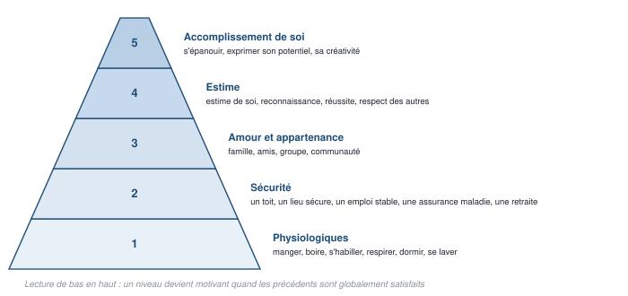
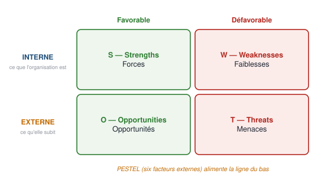
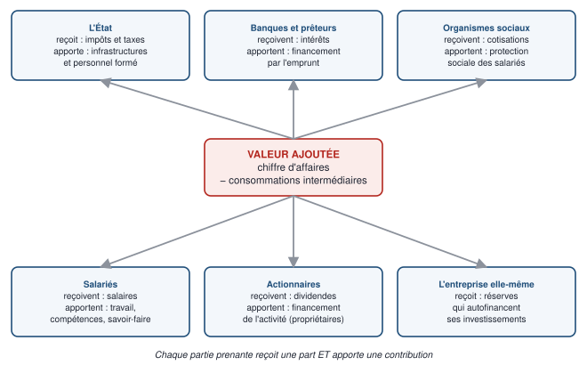
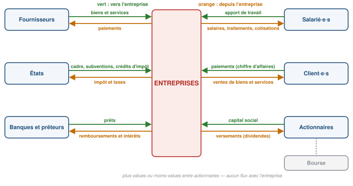
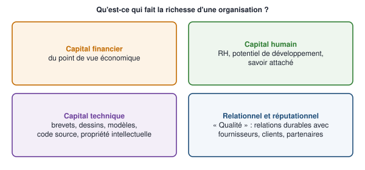
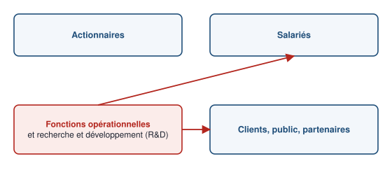

# 1 — Carte du chapitre

::: synthese Le chapitre en dix lignes
1. Une question structure tout le CM : **« Client, actionnaire, salarié ou public : qui doit être roi ? »** — autrement dit, au service de qui une organisation travaille-t-elle ?
2. **Roi n° 1, le client.** On s'organise pour satisfaire un **besoin** : humain en **B2C** (la **pyramide de Maslow**), organisationnel en **B2B** (quatre ressources, dont les ressources **VRIN**).
3. La spécialité qui étudie les besoins est le **marketing** : conquête raisonnée d'un marché, quatre objets promus, trois spécialités, deux outils — **PESTEL** et **SWOT**. L'actif le plus précieux d'une entreprise : **son marché**.
4. **Roi n° 2, l'actionnaire.** Le profit **assure la pérennité** et attire les investisseurs ; on le mesure par le **ROI** et le **taux de rotation du capital**.
5. La **valeur ajoutée** (chiffre d'affaires − consommations intermédiaires) se partage entre **six parties prenantes**, qui toutes **reçoivent** et **apportent** ; son partage fait débat (Oxfam, Afep : 63 % aux salariés, 5 % aux actionnaires).
6. Le **circuit économique** montre l'entreprise comme un **nœud de flux réciproques** — et la Bourse, à part, qui n'échange rien avec elle.
7. **Roi n° 3, le salarié.** **Vineet Nayar** : *les employés d'abord, les clients ensuite* ; la **GRH** dépasse la gestion du personnel ; des employés heureux font de meilleurs résultats.
8. **Roi n° 4, le public.** Le **service public** et ses trois principes ; **Dewey** : le public **ne préexiste pas**, il se forme autour des conséquences indirectes — d'où la **RSE** ; le **management public**.
9. **La pérennité** : durer pour garantir stabilité, adaptation et création de valeur ; **quatre capitaux**, **six raisons**, et toutes les parties prenantes.
10. **La réponse : il n'y a pas de roi.** Associer **durabilité et performance organisationnelle** — « une nécessité planétaire », renvoyée au CM 10.
:::

**Les idées maîtresses à retenir absolument**

1. **À chaque roi sa spécialité** : client → marketing · actionnaire → indicateurs financiers et partage de la valeur ajoutée · salarié → GRH · public → management public.
2. **Tout événement est une expérience, l'inverse est faux.**
3. **PESTEL = externe ; SWOT = interne (forces, faiblesses) + externe (opportunités, menaces)** ; les deux « E » de PESTEL : économique puis écologique.
4. **VA = CA − consommations intermédiaires**, partagée entre **six** parties prenantes — l'entreprise elle-même comprise.
5. **Le public ne préexiste pas** : l'organisation le fabrique par ses conséquences indirectes.
6. **Aucun roi** : la finalité est la **pérennité**, qui suppose de créer de la valeur pour toutes les parties prenantes à la fois.

**Prérequis** — le CM 1 (Gestion Ch01) : le **secteur public** et le **service public** (§ 2.3.6),
l'**innovation** (§ 2.3.4), les **modalités d'évaluation** et la **stratégie de coche** (§ 2.1.6
et § 2.1.7). Tout le reste — chiffre d'affaires, dividendes, réserves, cotisations,
pragmatisme… — est **enseigné ici**.

::: marche Le lien avec la finance, là où il est réel
- **Rentabilité et rotation du capital** sont les deux premières briques de l'analyse financière : la rentabilité du capital se décompose en **marge** (résultat ÷ ventes) × **rotation** (ventes ÷ capital) — la décomposition dite de **DuPont**, que tu retrouveras en finance d'entreprise.
- **Dividendes, réserves, capital social** : c'est la **politique de distribution** d'une entreprise cotée, qu'un analyste lit à chaque publication de résultats.
- **La Bourse n'échange rien avec l'entreprise** une fois les titres émis : ce que tu gagnes en tradant une action vient de ta contrepartie, pas de la société — c'est le **marché secondaire**.
- **Les ressources VRIN** sont la grille de l'avantage concurrentiel durable, que les gérants cherchent pour justifier une valorisation élevée (le « *moat* » des investisseurs).
:::

**Pour plus tard** — la valeur ajoutée, le partage de la valeur et les indicateurs de
rentabilité reviennent en **économie** (comptabilité nationale) et en **finance d'entreprise** ;
la lecture de chiffres et de sources contradictoires est au cœur des épreuves de **culture
générale et d'argumentation** des concours de masters.

<!--saut-->

# 2 — Le cours reconstruit

> **Trois sections d'apprentissage.** Chacune se travaille en un cycle APPRENDRE de quatre
> pomodoros : **P1** lecture active · **P2** restitution de mémoire, cours fermé · **P3** cartes de
> la section (§ 4.2) · **P4** questions de niveau 1 de la section (§ 5).

## 2.1 — La question, et le premier roi : le client (diapositives 1 à 18)

**À quoi sert cette section.** Elle pose la question du CM — **au service de qui une organisation travaille-t-elle ?** — puis examine le premier candidat : le **client**. Pour le servir, il faut comprendre son **besoin** (Maslow, les quatre ressources) ; la spécialité qui s'en charge est le **marketing**, avec ses objets, ses trois spécialités et ses deux outils. **C'est la section la plus dense en listes : chaque liste est une question de QCM.**

### 2.1.1 — Le cadre de la séance (diapositives 1 à 5)

Le CM 2 s'ouvre sur un rappel des **objectifs du cours** (identiques à ceux du CM 1), une
**autoévaluation Wooclap** — code d'événement **UIACLQ** —, et le **rappel du syllabus**.
Un ajout mérite d'être noté : là où le CM 1 annonçait « connaître les spécialités de la
gestion » sans les nommer, le CM 2 les liste — ce sont les **neuf spécialités du management**,
ci-dessous. Elles structurent tout le semestre, et chacune reviendra dans une séance.

::: definition Les neuf spécialités du management (diapositive 2)
**Comptabilité · contrôle et audit · finance · marketing · gestion des ressources humaines ·
gestion de production et logistique · gestion des systèmes d'information · gestion juridique
et fiscale · management stratégique.**
:::

::: examen L'épreuve — même matière, même épreuve que le CM 1
| Épreuve | Ce que dit le support (CM 1, diapositive 21) |
|---|---|
| **Contrôle continu (CC)** | **Examen écrit**, en séance de TD, à **mi-semestre** |
| **Contrôle terminal (CT)** | **QCM** |
| **Note finale** | $ \max\left(\text{CT}\ ;\ \tfrac{1}{3}\text{CC} + \tfrac{2}{3}\text{CT}\right) $ — le CC ne compte **que s'il est supérieur au CT** |
| **Crédits** | **6 ECTS** — BCC 1 |

**Les trois règles du QCM :** ① pas de points négatifs · ② à l'intérieur d'une question, **une
alternative incorrecte annule une bonne alternative** · ③ **au moins 2 alternatives correctes**
par question. Démonstration de la règle de coche — cocher si et seulement si on est sûr à plus de
50 % — : Gestion Ch01, § 2.1.7 ; rappel au § 5 de ce document.
:::

::: piege Ce que ce chapitre a de particulier
Le CM 1 était un **répertoire de définitions** : des listes, des dates, des noms. Le CM 2 est
une **architecture** : une question — *qui doit être roi ?* — quatre candidats, une réponse.

Conséquence pour le QCM : les alternatives ne porteront pas seulement sur « qu'est-ce que
X ? », mais sur **« à quel roi se rattache X ? »**. Confondre le marketing (roi client) avec
la GRH (roi salarié), ou le service public (roi public) avec le management public (la
discipline), coûtera plus de points que d'oublier une date. **Ce cours est donc organisé par
roi**, et le tableau du § 2.1.2 est la carte mentale de tout le chapitre.
:::

### 2.1.2 — La question et les quatre rois (diapositives 6 et 7)

::: definition La question et les quatre candidats
**« Client, actionnaire, salarié ou public : qui doit être roi ? »**

| № | Le roi candidat | La section | La spécialité de gestion qui lui correspond |
|:---:|---|---|---|
| **1** | **Le client** | Le besoin client | **Le marketing** |
| **2** | **L'actionnaire** | La recherche de profit | La **finance** et le partage de la **valeur ajoutée** |
| **3** | **Le salarié** | Le travail comme bonheur | La **gestion des ressources humaines (GRH)** |
| **4** | **Le public** | Donner à la société | Le **management public** |

**Et la réponse du cours : aucun.** La diapositive 46 retourne la question — **« Et s'il n'y
avait pas de roi à satisfaire ? »** — et lui substitue un objectif : **associer durabilité et
performance organisationnelle**, « une nécessité planétaire », renvoyée au **CM 10**.

L'objectif réel de l'organisation n'est donc pas de servir un roi mais de **se pérenniser**,
ce qui suppose de travailler avec **toutes** les parties prenantes à la fois.
:::

*(Précision de lecture : le support nomme la spécialité de trois rois — le **marketing** pour
le client (diapositives 11-12), la **GRH** pour le salarié (diapositive 30), le **management
public** pour le public (diapositive 39). Pour l'actionnaire, il ne nomme aucune spécialité : la
section présente des **indicateurs financiers** et le **partage de la valeur ajoutée**, ce qui
relève de la **finance** et de la **comptabilité** — deux des neuf spécialités de la
diapositive 2. C'est une déduction, pas une citation.)*

::: definition Ce que la métaphore du roi demande réellement
Elle pose la question de la **finalité** d'une organisation : **au service de qui
travaille-t-elle ?** Chaque candidat correspond à une réponse défendue quelque part, et
chacun a sa **spécialité de gestion** qui en fait sa raison d'être professionnelle.

C'est pour cela que la structure du cours n'est pas arbitraire : **chaque roi est
l'incarnation d'un métier de la gestion**, et le désigner roi reviendrait à dire que ce métier
commande tous les autres. La réponse du cours (§ 2.3.6) est qu'aucun ne commande.
:::

### 2.1.3 — Les deux marchés : B2C et B2B (diapositives 8 à 10)

| | **B2C — *Business to Customer*** | **B2B — *Business to Business*** |
|---|---|---|
| On s'organise pour satisfaire | un **besoin humain** | un **besoin organisationnel** |
| L'outil du cours | La **pyramide de Maslow** | Les **quatre ressources** |

::: definition Les deux sigles, que le support n'explique pas
**B2C — *Business to Customer*** : l'organisation vend à des **particuliers**, des personnes
physiques. Le besoin à satisfaire est un **besoin humain**.

**B2B — *Business to Business*** : l'organisation vend à **d'autres organisations**. Le
besoin à satisfaire est un **besoin organisationnel** — une organisation n'a ni faim ni
besoin d'estime, elle a besoin de **ressources** pour fonctionner.
:::

**La pyramide des besoins selon Maslow** (diapositive 8) — **de la base au sommet**, l'ordre est exigible :

| № | Besoin | Contenu donné par le support |
|:---:|---|---|
| **5** | **Accomplissement de soi** | S'épanouir, exprimer son potentiel, sa créativité, réaliser ses désirs |
| **4** | **Estime** | Estime de soi, reconnaissance, réussite, respect des autres |
| **3** | **Amour et appartenance** | Famille, amis, appartenance à un groupe ou une communauté |
| **2** | **Sécurité** | Un toit, une chambre, un lieu sécure, un emploi stable, une assurance maladie, une retraite |
| **1** | **Physiologiques** | Manger, boire, s'habiller, respirer, dormir, se laver |

**Moyen de retenir, de bas en haut — PSAEA :** **P**hysiologiques · **S**écurité ·
**A**ppartenance · **E**stime · **A**ccomplissement.



::: definition Maslow, et ce que sa pyramide affirme vraiment
La pyramide est affichée sans commentaire par le support. Elle représente la théorie
d'**Abraham Maslow**, psychologue américain (*A Theory of Human Motivation*, **1943**).

**Sa thèse :** les besoins humains sont **hiérarchisés**. Un besoin d'un niveau supérieur ne
devient **motivant** que lorsque les besoins des niveaux inférieurs sont **globalement
satisfaits**. On ne cherche pas la reconnaissance sociale quand on n'a pas mangé.

**Ce que cela apporte au marketing :** l'outil permet de **situer une offre** sur l'échelle
des besoins, et donc de choisir l'argument de vente. Une assurance parle à la **sécurité**,
un club de sport à l'**appartenance**, une montre de luxe à l'**estime**, une formation à
l'**accomplissement de soi**. Un même bien peut d'ailleurs être vendu à plusieurs niveaux.

*(La date, le nom complet de Maslow et cette lecture ne figurent pas dans le support : ils
sont ajoutés pour que la pyramide soit utilisable. Retiens les cinq niveaux et leur ordre,
qui sont, eux, dans le support.)*
:::

::: piege La limite de la pyramide, à connaître pour ne pas la sur-vendre
La hiérarchie stricte n'est pas confirmée empiriquement : des personnes en situation de
grande précarité poursuivent des besoins d'estime ou d'accomplissement, et l'ordre varie
selon les cultures. La pyramide est un **outil de classement commode**, pas une loi. Si une
alternative de QCM affirme qu'« un besoin supérieur ne peut jamais apparaître avant la
satisfaction complète des besoins inférieurs », le mot **jamais** doit t'alerter.
:::

**Les quatre ressources du besoin organisationnel** (diapositives 9 et 10) :

| № | Ressource | Contenu |
|:---:|---|---|
| **1** | **Ressources humaines** | **Compétences · leadership · talents · connaissances** |
| **2** | **Ressources financières** | **Capitaux · trésorerie · investissement** |
| **3** | **Ressources matérielles** | **Infrastructures** : bureaux, réseau informatique · **Équipements** : machines, ordinateurs |
| **4** | **Ressources stratégiques** | Les **ressources VRIN** |

::: definition Les ressources VRIN — ce que dit le support
**De Valeur · Rares · Inimitables · Non substituables.**

Le support en donne deux familles d'exemples :
- **Matières premières, accès au marché, autorisation d'exploitation**
- **Partenariats à haute valeur ajoutée** : **chaîne d'approvisionnement**, **R&D**
:::

**Les quatre ressources du B2B** se lisent comme un inventaire de ce qui manque à une
organisation pour fonctionner : des **gens**, de l'**argent**, des **choses**, et un
**avantage**.

::: definition Les ressources VRIN — pourquoi ces quatre critères
Une ressource ne procure un **avantage durable** que si elle est :
- **de Valeur** — elle permet de saisir une opportunité ou de neutraliser une menace ;
- **Rare** — si tous les concurrents l'ont, elle ne distingue personne ;
- **Inimitable** — un concurrent ne peut pas la reproduire à coût raisonnable ;
- **Non substituable** — il n'existe pas d'autre ressource qui rende le même service.

**Les quatre conditions sont cumulatives** : une ressource de valeur mais imitable procure un
avantage **temporaire**, le temps que les concurrents copient. C'est exactement pourquoi le
support cite l'**autorisation d'exploitation** (inimitable par construction : elle est
délivrée par une autorité) et la **R&D** (coûteuse à rattraper).

*(Les quatre critères sont dans le support ; leur explication, non. Ils proviennent du courant
dit de l'approche par les ressources, en stratégie.)*
:::

### 2.1.4 — Le marketing : définition, objets, marché (diapositives 11 à 16)

La diapositive 11 pose la question — *quelle est la spécialité des sciences de gestion qui se
focalise sur l'étude des besoins ?* — et la diapositive 12 répond : **le marketing**.

::: definition À savoir mot pour mot
**« Le marketing est une activité, un ensemble d'institutions et de processus visant à
promouvoir une offre. Il a pour objectif la conquête raisonnée d'un marché réalisée par un
produit ou un service qui satisfait les consommateurs visés en leur apportant la valeur
attendue. »**

**Sources d'inspiration de cette définition :** l'**American Marketing Association (2013)**
et **Vernette (2016)**.
:::

::: demo La définition du marketing, disséquée
« Le marketing est **une activité, un ensemble d'institutions et de processus** visant à
**promouvoir une offre**. Il a pour objectif **la conquête raisonnée d'un marché** réalisée
par un produit ou un service qui **satisfait les consommateurs visés** en leur apportant **la
valeur attendue**. »

1. **« Une activité, un ensemble d'institutions et de processus »** — le marketing n'est pas
   un service dans un organigramme, c'est une **fonction transversale**.
2. **« Promouvoir une offre »** — le verbe est large : il ne dit pas *vendre*. On promeut
   aussi un service public ou une association.
3. **« La conquête raisonnée d'un marché »** — *raisonnée*, c'est-à-dire **fondée sur une
   analyse**, non sur l'intuition. C'est ce qui justifie le marketing d'études.
4. **« Satisfait les consommateurs visés »** — *visés* : on ne s'adresse pas à tout le monde,
   d'où le **choix des marchés cibles** du marketing stratégique.
5. **« En leur apportant la valeur attendue »** — le critère de réussite est du côté du
   **client**, pas du vendeur.
:::

**Ce que le marketing promeut — les quatre objets** (diapositives 13 à 15) :

| № | Objet | Ce que le support en dit |
|:---:|---|---|
| **1** | **Les biens** | Ils constituent **l'essentiel de la production** et font l'objet des plus grands efforts marketing. Grâce à Internet, les individus peuvent promouvoir et vendre des produits **neufs et d'occasion**, qui tendent parfois à devenir des **produits d'appel**. |
| **2** | **Les services** | Une proportion **croissante** de l'activité économique. **En France, plus de 75 % du PIB et 70 % des emplois.** Ils intègrent des activités diverses et de nombreuses **professions libérales**. |
| **3** | **Les expériences** | En **« orchestrant »** divers biens et services, on peut **créer, mettre en scène et commercialiser** des expériences. Exemples : **parcs d'attraction**, promotion des **services publics et associatifs** pour les citoyens d'un territoire. |
| **4** | **Les événements** | **Éphémères** : Jeux Olympiques, salons professionnels, concerts. Les produire et les gérer dans les moindres détails **constitue un métier**. |

**Deux phrases à ne pas perdre :**
- **« La plupart des offres combinent à la fois des biens et des services. »**
- **« Les événements cherchent à développer une expérience pour le consommateur, mais toutes
  les expériences ne sont pas des événements. »** → **événement ⊂ expérience**, jamais
  l'inverse.

::: definition Le capital-marque
**« La marque a pour objectif de symboliser cette expérience : le capital-marque est la
valeur qu'une marque ajoute aux produits et services. »**

Illustration du support : la **collection collaborative Christian Lacroix et Regatta Great
Outdoors (2023)**.
:::

**Les quatre objets promus** forment une échelle de complexité croissante : un **bien**
est un objet ; un **service** est une prestation ; une **expérience** est une **orchestration**
de biens et de services ; un **événement** est une expérience **éphémère** et produite.

::: definition Le produit d'appel
Produit vendu à prix très bas, voire à perte, pour **attirer le client** et lui faire acheter
autre chose. Le support signale qu'Internet fait parfois glisser des **produits neufs et
d'occasion** vers ce statut.
:::

**Le marketing et l'étude des besoins** (diapositive 16) :

::: definition L'actif le plus précieux
**Question du support :** quel est l'actif le plus précieux d'une entreprise, **le plus
difficile à constituer, à augmenter et à remplacer** ?
**Réponse : son marché !**
:::

Trois conséquences, à restituer :

1. **« Le marketing se caractérise donc par le souci de connaître le public pour mieux s'y
   adapter et pour agir sur lui efficacement. »**
2. **« Il cherche aussi à développer des stratégies pour influencer et transformer les
   marchés. »**
3. **Point d'attention du support :** **« La création continue de besoins génère des modèles
   de consommation qui contribuent à l'épuisement des ressources de la planète. »**

::: synthese « L'actif le plus précieux d'une entreprise, c'est son marché »
La formule est forte et mérite d'être comprise. Une usine se rachète, un brevet s'acquiert,
un salarié se recrute. **Un marché — c'est-à-dire un ensemble de clients qui connaissent
l'offre, lui font confiance et reviennent — ne s'achète pas.** Il se construit lentement et
se perd vite.

C'est ce qui justifie les deux ambitions que le support attribue au marketing : **« connaître
le public pour mieux s'y adapter »**, mais aussi **« agir sur lui efficacement »** et
**« développer des stratégies pour influencer et transformer les marchés »**. Le marketing ne
se contente donc pas de constater une demande : **il la façonne.**

**Et c'est exactement ce que le point d'attention du support vient limiter :** « la création
continue de besoins génère des modèles de consommation qui contribuent à l'épuisement des
ressources de la planète ». La critique est placée par le cours lui-même, au milieu de la
présentation du roi client. **La reprendre en copie montre qu'on a lu la diapositive
entière.**
:::

### 2.1.5 — Les trois spécialités du marketing, PESTEL et SWOT (diapositives 17 et 18)

**Les trois spécialités du marketing** (diapositive 17) :

| Spécialité | Ce qu'elle recouvre | Position dans le temps |
|---|---|---|
| **Marketing d'études** | **Analyse du marché dans toutes ses dimensions** et **mesure des résultats des actions engagées** | En amont **et** en aval |
| **Marketing stratégique** | Les fonctions qui **précèdent la production et la mise en vente** : choix des **marchés cibles**, **positionnement**, stratégie de **marque**, stratégies **produit / prix / distribution / communication et promotion**, stratégie **relationnelle** | **Avant** |
| **Marketing opérationnel** | Les opérations **postérieures à la production** : campagnes de **publicité et de promotion**, **action des vendeurs**, **distribution**, **services après-vente** | **Après** |

Les trois spécialités se distinguent par leur **position par rapport à la production** :
le **marketing d'études** analyse, le **stratégique** décide **avant**, l'**opérationnel**
exécute **après**. Le support précise qu'elles étaient **autrefois englobées avec la vente**,
quand la préoccupation principale était la production — c'est-à-dire quand il suffisait de
produire pour vendre.

Les deux outils du marketing d'études sont donnés en sigles, sans une ligne d'explication.

::: formule PESTEL — les six facteurs de l'environnement externe
**P** — **P**olitique · **E** — **É**conomique · **S** — **S**ocioéconomique ·
**T** — **T**echnologique · **E** — **É**cologique · **L** — **L**egal *(juridique)*
:::

::: formule SWOT — la matrice interne / externe
**S** — *Strengths*, les **Forces** · **W** — *Weaknesses*, les **Faiblesses** ·
**O** — *Opportunities*, les **Opportunités** · **T** — *Threats*, les **Menaces**
:::

::: piege La distinction qui tombera
**PESTEL ne regarde que l'extérieur** — six facteurs d'environnement, sur lesquels
l'organisation n'a pas de prise. **SWOT croise l'intérieur et l'extérieur** : forces et
faiblesses sont **internes**, opportunités et menaces sont **externes**.

Le support renvoie ces deux outils au **TD 1**.
:::

::: definition PESTEL — analyser l'environnement externe
Grille qui balaie **six familles de facteurs** que l'organisation **subit** et ne contrôle
pas. Pour chacune, on se demande : *qu'est-ce qui, là, peut changer la donne ?*

| Lettre | Facteur | Exemples de questions |
|:---:|---|---|
| **P** | **Politique** | Stabilité du gouvernement, politique fiscale, commerce extérieur |
| **E** | **Économique** | Croissance, inflation, taux d'intérêt, pouvoir d'achat |
| **S** | **Socioéconomique** | Démographie, niveaux de revenu, modes de vie, éducation |
| **T** | **Technologique** | Innovations, obsolescence, dépenses de R&D du secteur |
| **E** | **Écologique** | Ressources, climat, réglementation environnementale |
| **L** | ***Legal*** — juridique | Droit du travail, normes, protection du consommateur |

**Les deux « E » sont différents** : le premier est **économique**, le second **écologique**.
C'est le piège classique.
:::

::: definition SWOT — croiser l'interne et l'externe
Matrice à **quatre cases**, qui croise deux axes : **interne / externe**, et
**favorable / défavorable**.

| | **Favorable** | **Défavorable** |
|---|---|---|
| **Interne** — ce que l'organisation **est** | **S** — *Strengths*, **Forces** | **W** — *Weaknesses*, **Faiblesses** |
| **Externe** — ce que l'organisation **subit** | **O** — *Opportunities*, **Opportunités** | **T** — *Threats*, **Menaces** |

**L'articulation avec PESTEL :** PESTEL **alimente** la moitié externe du SWOT. On balaie les
six facteurs, et chaque constat devient soit une **opportunité**, soit une **menace**.
:::



<!--saut-->

## 2.2 — Le deuxième et le troisième roi : l'actionnaire et le salarié (diapositives 19 à 32)

**À quoi sert cette section.** Elle examine le roi **actionnaire** — pourquoi chercher le profit, comment le mesurer, comment se partage la **valeur ajoutée** et où circule l'argent — puis le roi **salarié** — l'inversion de Nayar, la **GRH**, et ce que produit une culture axée sur les employés. **C'est la section des formules et des chiffres** : la valeur ajoutée, la rotation du capital, le ROI, 63 % et 5 %, 88 %, × 5, + 6 points.

### 2.2.1 — Pourquoi chercher le profit (diapositives 19 et 20)

1. **Elle assure la pérennité de l'entreprise** en **couvrant les coûts opérationnels** et en
   **réinvestissant dans la croissance future**.
2. **Elle est nécessaire pour attirer de nouveaux investisseurs et actionnaires.**

Le support renvoie cette section au **TD 2**.

Les deux raisons sont **de nature différente**, et le QCM peut jouer là-dessus : la
première est **interne** — le profit **finance** la survie et la croissance ; la seconde est
**externe** — le profit **attire** des capitaux du dehors.

::: piege Le profit n'est pas présenté comme une fin
Relis la formulation du support : « assure **la pérennité** de l'entreprise ». Le profit y est
un **moyen** au service de la durée, pas l'objectif ultime. C'est cohérent avec la réponse
finale du chapitre (§ 2.3.6), et c'est ce qui permet au cours de traiter l'actionnaire comme
**un** roi candidat parmi quatre, et non comme le roi légitime.
:::

### 2.2.2 — Les deux indicateurs : rotation du capital et ROI (diapositives 20 et 21)

::: formule Le taux de rotation du capital — formule et exemple du support
$$ \text{ratio de rotation du capital} = \frac{\text{ventes nettes}}{\text{capital moyen utilisé}} $$

**Exemple du cours.** Une entreprise manufacturière réalise un **chiffre d'affaires net de
1 000 000 €** et un **capital moyen utilisé de 500 000 €**.
$$ \frac{1\,000\,000}{500\,000} = 2 $$
**Lecture :** l'entreprise **génère 2 € de ventes pour chaque euro de capital employé**.
:::

**Le ROI — *Return On Investment*, ou taux de rentabilité :** « désigne la **rentabilité d'un
capital investi** dans le cadre d'une entreprise ». *(Le support n'en donne pas la formule ;
elle est reconstruite ci-dessous.)*

**Ce que permet le ratio de rotation**, mot pour mot : l'entreprise peut **« évaluer son
efficacité opérationnelle et prendre des décisions éclairées pour l'améliorer, ou rechercher
les causes en cas de baisse »** — exemples donnés : **mauvaise organisation** ou **canaux de
distribution inadéquats**. « En comprenant et en améliorant la rotation du capital, les
entreprises peuvent améliorer leurs performances financières et générer une croissance
durable, ce qui peut **augmenter la valeur ajoutée** ».

Le **taux de rotation du capital** est entièrement donné par le support, formule et exemple
compris. Le **ROI**, lui, est nommé et décrit — « la rentabilité d'un capital investi »
— **sans formule**.

::: formule Le ROI, reconstruit
Le principe : **rapporter ce que l'investissement a rapporté à ce qu'il a coûté.**

$$ \text{ROI} = \frac{\text{gain de l'investissement} - \text{coût de l'investissement}}{\text{coût de l'investissement}} $$

**Exemple.** Une machine coûte **80 000 €** et dégage **100 000 €** de gains sur sa durée de
vie. $ \text{ROI} = (100\,000 - 80\,000)/80\,000 = 0{,}25 $, soit **+ 25 %**.

*(Cette formule est une reconstruction : elle ne figure pas dans le support. Si l'enseignante
en donne une autre en TD, c'est la sienne qui fait foi. Le principe — un **résultat rapporté
au capital engagé**, exprimé en pourcentage — ne change pas.)*
:::

::: piege Rotation du capital et ROI ne mesurent pas la même chose
**La rotation** mesure l'**activité** : combien d'euros de ventes par euro de capital. Elle
peut être élevée avec une marge nulle.
**Le ROI** mesure la **rentabilité** : combien d'euros gagnés par euro engagé.

Une grande surface a une rotation très élevée et des marges faibles ; un joaillier a
l'inverse. **Les deux peuvent avoir le même ROI.**
:::

::: demo Pourquoi la grande surface et le joaillier peuvent avoir la même rentabilité
La rentabilité du capital se décompose en deux facteurs — une identité, vraie par construction :

$$ \frac{\text{résultat}}{\text{capital}} = \frac{\text{résultat}}{\text{ventes}} \times \frac{\text{ventes}}{\text{capital}} $$

*Pas à pas :* on multiplie et on divise par les ventes, qui se simplifient. Le premier facteur est
la **marge** (ce que chaque euro de ventes laisse en résultat), le second est la **rotation du
capital** du support.

**Exemple chiffré.** Grande surface : marge 2 %, rotation 5 → rentabilité $ 0{,}02 \times 5 = 10\ \% $.
Joaillier : marge 20 %, rotation 0,5 → rentabilité $ 0{,}20 \times 0{,}5 = 10\ \% $.
**Deux modèles opposés, la même rentabilité.**

*(Cette décomposition n'est pas dans le support : elle explique pourquoi rotation et rentabilité
sont deux grandeurs distinctes. Elle porte en finance le nom de décomposition de DuPont.)*
:::

### 2.2.3 — La valeur ajoutée et ses six parties prenantes (diapositives 22 à 25)

::: formule La valeur ajoutée
$$ \text{Valeur ajoutée} = \text{Chiffre d'affaires} - \text{Consommations intermédiaires} $$

« Une organisation, et notamment une entreprise, **crée de la valeur ajoutée par son
activité**. »
:::

::: definition Les consommations intermédiaires
Les **biens et services achetés à d'autres** et **détruits ou transformés** dans le processus
de production : matières premières, énergie, fournitures, services sous-traités. Elles
s'opposent aux **investissements**, qui durent au-delà d'un cycle de production.
:::

::: demo Pourquoi soustraire les consommations intermédiaires
1. Un boulanger achète **100 €** de farine et vend **300 €** de pain.
2. Son chiffre d'affaires est de **300 €** — mais il n'a pas créé 300 € de richesse : les
   100 € de farine avaient déjà été créés par le meunier.
3. **La richesse qu'il a réellement ajoutée est de $ 300 - 100 = 200 $ €.**
4. Si l'on additionnait les chiffres d'affaires de toute l'économie, on compterait la farine
   deux fois — chez le meunier puis chez le boulanger. **La valeur ajoutée est précisément la
   grandeur qui évite ce double comptage.**

C'est aussi ce qui fait de la VA la grandeur **à partager** : elle est exactement ce que
l'activité a créé, et rien d'autre.
:::

**Les six parties prenantes — ce qu'elles reçoivent, ce qu'elles apportent** (diapositives 24 et 25). C'est le tableau le plus examinable du chapitre : chaque case est une alternative de QCM.

| № | Partie prenante | **Reçoit** une part de la VA sous forme de… | **Apporte** à la VA… |
|:---:|---|---|---|
| **1** | **L'État** | **Impôts et taxes** | Des **infrastructures** (routes, hôpitaux…) et du **personnel formé** |
| **2** | **Les banques et prêteurs** | **Intérêts** | Le financement d'une partie des **investissements via l'emprunt** |
| **3** | **Les organismes sociaux** | **Cotisations sociales** ou **charges sociales** — Sécurité sociale, France Travail | L'existence d'une **protection sociale pour les salariés** |
| **4** | **Les salariés** *(la masse salariale)* | **Salaires** | Leur **force de travail, compétences et savoir-faire** |
| **5** | **Les actionnaires** *(les dividendes)* | **Dividendes** | Le **financement de l'activité** — ce sont les **propriétaires** de l'entreprise |
| **6** | **L'entreprise elle-même** | **Réserves** | Elles permettent d'**autofinancer les investissements** |

**Moyen de retenir — les six bénéficiaires par leur forme de rémunération :** impôts ·
intérêts · cotisations · salaires · dividendes · réserves.



::: definition Les trois formes de rémunération que le support ne définit pas
**Cotisations sociales** (ou charges sociales) : prélèvements assis sur les salaires et
versés aux organismes sociaux, qui financent en retour la protection sociale des salariés —
maladie, retraite, chômage, famille.

**Dividendes** : part du bénéfice distribuée aux actionnaires, en rémunération du capital
qu'ils ont apporté. Le support distingue les dividendes **ordinaires** des dividendes
**exceptionnels** (d. 27).

**Réserves** : part du bénéfice **conservée par l'entreprise** au lieu d'être distribuée.
Elles permettent l'**autofinancement** des investissements — c'est-à-dire investir sans
emprunter ni faire appel à de nouveaux actionnaires.
:::

::: synthese Ce que le tableau des six parties prenantes démontre
Chaque ligne a **deux colonnes** : ce que la partie prenante **reçoit** et ce qu'elle
**apporte**. Ce n'est pas un ornement de présentation, c'est l'argument du cours.

**Aucune des six n'est un simple bénéficiaire.** L'État prélève des impôts, mais fournit les
routes, les hôpitaux et le personnel formé sans lesquels l'entreprise ne pourrait pas
produire. Les organismes sociaux prélèvent des cotisations, mais fournissent la protection
sociale qui rend le salariat possible. Les actionnaires touchent des dividendes, mais ont
financé l'activité.

**Donc : aucune des six ne peut prétendre au titre de roi, puisque toutes les six ont
contribué.** Le tableau de la diapositive 24-25 est déjà la réponse de la diapositive 46.
:::

### 2.2.4 — Le partage de la valeur ajoutée et ses débats (diapositive 26)

| Source | Ce qu'elle dit |
|---|---|
| **Oxfam France** | Deux rapports publiés en **avril et juin 2023**, analysant le partage de la valeur dans les **100 plus grandes entreprises françaises cotées en bourse, entre 2011 et 2021** — inégalités salariales, part des richesses versées aux actionnaires. Titre du rapport repris en diapositive 27 : **« CAC 40 : des profits sans lendemain »**. |
| **Le Point**, Marc Vignaud, **16 juillet 2019** | *« Salariés ou actionnaires, qui profite le plus des grandes entreprises ? »* — **l'Afep montre que les plus grands groupes distribuent 63 % de leur valeur ajoutée à leurs salariés, contre 5 % pour leurs actionnaires.** |

**Afep** = **Association française des entreprises privées**.

::: piege Le calcul qui vaut un point
$ 63\ \% + 5\ \% = 68\ \% $. **Les 32 % restants ne disparaissent pas** : ils vont, dans le modèle
du cours, aux **quatre autres parties prenantes** du tableau du § 2.2.3 — l'État (impôts et taxes), les organismes
sociaux (cotisations), les banques (intérêts) et l'entreprise elle-même (réserves).
:::

**Le débat sur le partage** met deux sources en regard. **Oxfam France** — organisation
non gouvernementale de lutte contre la pauvreté — publie deux rapports en **2023** sur les
**100 plus grandes entreprises françaises cotées**, sur **2011-2021**, et met en cause la part
versée aux actionnaires. **Le Point** cite l'**Afep** pour un tout autre chiffrage : **63 %
de la VA aux salariés contre 5 % aux actionnaires**.

::: piege Les deux sources ne se contredisent pas nécessairement
Elles ne mesurent pas la même chose sur le même périmètre : **100 plus grandes entreprises
cotées** d'un côté, **plus grands groupes** membres de l'Afep de l'autre ; une **évolution sur
dix ans** d'un côté, une **répartition à une date** de l'autre ; et le **dénominateur** peut
être la valeur ajoutée, le bénéfice ou le chiffre d'affaires selon les cas.

**C'est la leçon de méthode du chapitre :** un pourcentage de partage ne veut rien dire tant
qu'on n'a pas dit **part de quoi, sur quel périmètre, sur quelle période**. Le support met
délibérément les deux côte à côte sous le titre « **et ses débats** ».
:::

### 2.2.5 — Le circuit économique (diapositive 27)

Source : **rapport Oxfam France, *CAC 40 : des profits sans lendemain***. Renvoyé au **TD 1**. Le support affiche le schéma **sans une ligne de commentaire** : il est redessiné ici, puis lu.



**Les treize flux, dans les deux sens** — douze entre l'entreprise et ses six partenaires, plus celui de la Bourse entre actionnaires ; chacun est une alternative possible :

| Partenaire | **Vers l'entreprise** | **Depuis l'entreprise** |
|---|---|---|
| **États** | **Apport d'un cadre pour opérer** (infrastructures, éducation, santé, sécurité…) · **subventions et crédits d'impôts** | **Impôt et taxes** |
| **Fournisseurs** | **Apport de biens et services** | **Paiements** |
| **Client·e·s** | **Paiements** *(chiffre d'affaires)* | **Ventes de biens et services** |
| **Salarié·e·s** | **Apport de travail** | **Salaires, traitements, cotisations** |
| **Actionnaires** | **Capital social** | **Versements** *(dividendes ordinaires et exceptionnels)* |
| **Banques et prêteurs** | **Prêts** | **Remboursements et intérêts** |
| **Bourse** | *Aucun flux avec l'entreprise* | **Plus-value ou moins-value** entre actionnaires |

**Trois lectures à retenir.**

::: synthese Ce que le circuit montre
**① Chaque flèche a sa réciproque.** Il n'existe pas un seul flux à sens unique : à chaque
ressource reçue correspond une contrepartie versée. L'entreprise est un **nœud**, pas une
source.

**② L'État apparaît deux fois, dans les deux sens.** Il prélève l'**impôt et les taxes**,
mais il verse des **subventions et crédits d'impôts** et fournit un **cadre pour opérer** —
infrastructures, éducation, santé, sécurité. Réduire l'État à un prélèvement, c'est ne lire
qu'une moitié du schéma.

**③ La Bourse est à part.** Elle n'échange rien avec l'entreprise : elle relie les
**actionnaires entre eux**, par des **plus-values ou moins-values**. L'argent d'une
plus-value boursière **ne vient pas de l'entreprise** — il vient de l'acheteur du titre.
C'est le point que presque personne ne voit, et il vaut un point en copie.
:::

### 2.2.6 — Le troisième roi : « les employés d'abord » (diapositives 28 et 29)

::: definition La référence, exigible en entier
**Vineet Nayar (2018), *Les employés d'abord. Les clients ensuite. Comment renverser les
règles du management*, Diateino.**

Il s'agit de l'**expérience d'un directeur général au sein de la société tech HCL** pour
**renverser la pyramide du pouvoir** et **mettre les employés au centre**.
:::

::: synthese Pourquoi le titre de Nayar est une provocation calculée
Le marketing (§ 2.1.3 à 2.1.5) affirme que l'actif le plus précieux est **le marché**, donc le client.
**Vineet Nayar** inverse : *Les employés d'abord. Les clients ensuite.* Le sous-titre est
explicite — *Comment renverser les règles du management*.

**L'argument, tel que le cours le déploie ensuite :** ce ne sont pas les dirigeants qui
créent de la valeur pour le client, ce sont les salariés en contact avec lui. Si l'on veut
servir le client, il faut donc d'abord servir ceux qui le servent — d'où l'expression
**« renverser la pyramide du pouvoir »** : le management cesse de commander le terrain pour
se mettre à son service.

Ce n'est pas un plaidoyer moral : la diapositive 31 en donne la justification **économique**
— captation et rétention des talents, limitation du turn-over, productivité accrue, meilleurs
résultats commerciaux.
:::

::: definition Le turn-over
Taux de **rotation du personnel** : la proportion de salariés qui quittent l'organisation sur
une période donnée. Un turn-over élevé coûte cher — recrutement, formation, perte de
savoir-faire, désorganisation des équipes. **À ne pas confondre avec le taux de rotation du
capital du § 2.2.2**, qui porte sur les ventes et non sur les personnes.
:::

### 2.2.7 — La gestion des ressources humaines (diapositive 30)

::: definition
**« La gestion des ressources humaines (ou GRH) correspond à l'ensemble des systèmes mis en
place pour organiser et développer les ressources humaines, c'est-à-dire les individus qui
travaillent au sein d'une organisation. »**
:::

::: piege GRH ≠ gestion du personnel
**« Alors que la gestion du personnel se concentre [sur] les aspects purement
administratifs, la GRH est plus globale. »**

La GRH : ① **s'attache à gérer et administrer tout ce qui est en lien avec le personnel** ·
② **comprend également les dimensions d'écoute, d'accompagnement et de conseil**
indispensables pour manager des personnes.

**Exemple donné :** les politiques de **QVCT — Qualité de Vie et des Conditions de Travail**.
:::

La distinction GRH / gestion du personnel est **la** question de cours de cette section. La
gestion du personnel **administre** — contrats, paie, congés, obligations légales. La GRH
**administre aussi**, mais y ajoute **l'écoute, l'accompagnement et le conseil**, c'est-à-dire
tout ce qui relève du **développement** des personnes et non de leur seule gestion.

**QVCT** = **Qualité de Vie et des Conditions de Travail**. L'exemple est bien choisi : une
politique de QVCT n'est exigée par aucune obligation administrative — elle relève du choix de
management.

### 2.2.8 — Une culture axée sur les employés, et Great Place to Work (diapositives 31 et 32)

**« Une culture axée sur les employés donne la priorité au bien-être et au développement des
employés. »** La construire **« exige un véritable engagement du management et des RH »** pour
favoriser un environnement **transparent et positif** où les employés se sentent **en
confiance, valorisés et motivés**.

**« La recherche montre que les employés heureux conduisent à » — les quatre résultats :**

1. **Captation et rétention des talents**
2. **Limitation du turn-over**
3. **Une productivité accrue**
4. **De meilleurs résultats commerciaux : amélioration de la relation client**

Et la conclusion du support : **« cette culture est essentielle dans le paysage concurrentiel
des entreprises d'aujourd'hui. »**

**Great Place to Work** est un organisme qui **certifie** les entreprises sur la qualité de
leur environnement de travail et publie des **palmarès**. Les trois chiffres sont ses
arguments commerciaux, et le support les présente comme tels — « ex. : le classement ».

| Chiffre | Ce qu'il mesure |
|---:|---|
| **88 %** | des **candidats préfèrent postuler** à une entreprise **certifiée Great Place To Work** |
| **× 5** | **plus de chances de retenir ses collaborateurs** avec une **stratégie QVT** |
| **+ 6 points** | de **profitabilité en plus** pour les entreprises **labellisées Great Place To Work** |

*QVT — qualité de vie au travail : l'appellation antérieure de la QVCT (§ 2.2.7), que le support emploie encore ici.*

::: piege Ce que ces chiffres prouvent, et ce qu'ils ne prouvent pas
Les trois chiffres émanent de **l'organisme qui vend la certification** : ce ne sont pas des
résultats de recherche indépendants. Le support le laisse voir en écrivant « **Ex :** le
classement Great Place to Work », après avoir écrit une diapositive plus tôt « **la recherche
montre que** ».

Plus important : **+6 points de profitabilité** est une **corrélation**, pas une causalité
établie. Il est au moins aussi plausible que les entreprises déjà profitables aient les moyens
d'investir dans la qualité de vie au travail. **Le noter en copie est exactement le réflexe
attendu d'un étudiant de licence** — et c'est le même réflexe que le cours d'économie exige.
:::

<!--saut-->

## 2.3 — Le quatrième roi, la pérennité, et la réponse du cours (diapositives 33 à 50)

**À quoi sert cette section.** Elle examine le dernier candidat, le **public** — le service public, la thèse de **Dewey**, le management public —, puis déplace la question : ce qui compte n'est pas de servir un roi, c'est de **durer**. Elle se clôt sur la **réponse du chapitre** — il n'y a pas de roi — et sur un exercice pratique au format du contrôle continu.

### 2.3.1 — Le service public (diapositives 33 à 35)

La définition est la même qu'au CM 1 (Gestion Ch01, § 2.3.6) : une **activité d'intérêt général**, qui peut être prise
en charge par le secteur public **ou assurée par le secteur privé**. Le CM 2 ajoute les
**trois principes de fonctionnement**, absents du CM 1 et présents uniquement dans l'image de
la diapositive 34.

::: definition
**« Activité d'intérêt général qui peut être prise en charge directement par un organisme du
secteur public ou assurée par le secteur privé. »**
:::

::: definition Les trois principes de fonctionnement
1. **Continuité** du service public
2. **Égalité de tous** devant le service public
3. **Adaptabilité** aux besoins des usagers
:::

**Au niveau européen :** « **L'Union européenne parle de "services d'intérêt général" et de
"services d'intérêt économique général"** » — **SIG** et **SIEG**.

::: definition Les trois principes, expliqués
**① Continuité.** Le service ne peut pas s'interrompre : un hôpital, l'état civil ou la
distribution d'eau fonctionnent sans rupture. C'est ce principe qui justifie l'encadrement du
droit de grève dans certains services.

**② Égalité de tous devant le service public.** Mêmes conditions d'accès et de tarif pour des
usagers placés dans une situation identique.

**③ Adaptabilité aux besoins des usagers.** Le service doit **évoluer** quand les besoins ou
les techniques évoluent : l'usager n'a pas de droit acquis au maintien d'un service en l'état.

*(Ces trois principes sont traditionnellement appelés « lois du service public ». Le support
ne leur donne pas ce nom : retiens les trois mots — continuité, égalité, adaptabilité.)*
:::

**Le vocabulaire européen.** L'Union européenne ne dit pas « service public » : elle parle de
**services d'intérêt général (SIG)** et de **services d'intérêt économique général (SIEG)**.
La nuance tient à la nature marchande de l'activité — les seconds sont fournis contre
rémunération et relèvent donc aussi du droit de la concurrence.

**Les quatre champs d'action du service public** (diapositive 35) :

1. **Ordre et régulation**
2. **Protection sociale et sanitaire**
3. **Éducation et culture**
4. **Économie**

Ce qu'ils recouvrent, dans l'ordre de la matrice : **ordre et
régulation** (police, justice, normes), **protection sociale et sanitaire**, **éducation et
culture**, **économie**.

### 2.3.2 — Dewey : *Le public et ses problèmes* (diapositives 36 à 38)

::: definition La référence
**John Dewey**, ***The Public and Its Problems***, **ouvrage de 1927 — « fin de l'Ère
Progressiste »**. **Philosophe pragmatiste.**
:::

**Les cinq propositions à restituer :**

1. **Le public** est **un acteur central dans la démocratie**, mais il est **confronté à la
   fragmentation, la complexité et au manque de communication**.
2. **Sa reconnaissance et son organisation dépendent de trois choses : la communication · la
   discussion · l'éducation.**
3. **Dewey prône une participation active des citoyens dans les processus démocratiques**,
   pour **revitaliser le public et renforcer la démocratie**.
4. **Définition du public :** **« groupe de personnes concernées par les conséquences
   indirectes des actions d'individus ou de groupes, notamment celles qui nécessitent une
   régulation ou une intervention. »**
5. **Définition de l'État :** **« une réponse aux besoins du public pour réguler ces
   conséquences et protéger les intérêts communs. »**

::: piege La thèse qui fera la différence
**« Le public ne préexiste pas. Il se forme lorsque des gens se rendent compte qu'ils
partagent des intérêts communs affectés par des actions extérieures. »**

Et le support ajoute : cette thèse **« converge avec la notion de partie prenante et de
Responsabilité Sociétale des Entreprises (RSE) »**.
:::

::: definition Le pragmatisme
Courant philosophique américain de la fin du XIXᵉ et du début du XXᵉ siècle, pour lequel la
valeur d'une idée se mesure à ses **conséquences pratiques** : une théorie vaut par ce qu'elle
permet de faire, non par sa cohérence formelle. **John Dewey** en est l'une des grandes
figures, avec Charles S. Peirce et William James.

*(Le support écrit « philosophe pragmatiste » sans expliquer le terme.)*
:::

::: synthese La thèse de Dewey, et pourquoi elle est dans un cours de gestion
**Le raisonnement, en quatre temps :**

1. Toute action a des **conséquences directes**, qui ne concernent que ceux qui y prennent
   part, et des **conséquences indirectes**, qui touchent des tiers n'ayant rien demandé.
2. **Le public, c'est exactement l'ensemble de ces tiers** : « groupe de personnes concernées
   par les conséquences indirectes des actions d'individus ou de groupes ».
3. **Le public ne préexiste donc pas.** Il n'existe pas un « public » permanent : il **se
   forme** quand des gens **se rendent compte** qu'ils partagent des intérêts communs affectés
   par des actions extérieures. Une usine qui pollue une rivière **fabrique** le public des
   riverains.
4. **L'État est une réponse à ce besoin** : il existe pour **réguler ces conséquences** et
   **protéger les intérêts communs**.

**Le lien avec la gestion, que le support pose en une ligne :** cette définition
**« converge avec la notion de partie prenante et de RSE »**. En effet — une **partie
prenante** est un agent **affecté par** une décision de l'organisation ou capable de
l'influencer. C'est mot pour mot la structure du public de Dewey, transposée de la politique
à l'entreprise.

**Conséquence, et c'est l'argument du roi n° 4 :** si l'entreprise produit des conséquences
indirectes sur des tiers, alors ces tiers ont une **prétention légitime** à ce qu'elle en
réponde. Le public n'est pas un roi extérieur qu'on choisirait de servir : il est
**constitué par l'activité même** de l'organisation.
:::

::: definition RSE — Responsabilité sociétale des entreprises
Prise en compte volontaire, par une entreprise, des **conséquences sociales et
environnementales de son activité**, au-delà de ses seules obligations légales.

**Ne pas confondre avec RSO**, *responsabilité sociale des organisations*, sigle employé au
CM 1 dans le programme de la séance 10 (Gestion Ch01, § 2.1.5). Les deux notions sont voisines ; les sigles diffèrent
par le mot **entreprises** / **organisations**.
:::

**Les trois conditions d'organisation du public** — **communication, discussion, éducation** —
ne sont pas une liste accessoire : ce sont les trois moyens par lesquels des gens dispersés
prennent conscience d'un intérêt commun. Elles répondent terme à terme aux trois maux que
Dewey diagnostique : **le manque de communication**, **la fragmentation**, **la complexité**.

### 2.3.3 — Le management public (diapositive 39)

::: definition Les quatre propositions du support
1. **« Le management public est l'ensemble des pratiques, des méthodes et des processus
   utilisés pour diriger, organiser et contrôler les activités des organisations publiques. »**
2. **« Son objectif principal est d'assurer la bonne gestion des ressources publiques pour
   répondre efficacement aux besoins des citoyens et atteindre les objectifs de politique
   publique définis par les autorités compétentes. »**
3. **« Il représente un champ d'études pour l'amélioration de la performance des organisations
   publiques. »**
4. **« Il contribue à la modernisation et la relégitimation des organisations publiques après
   plusieurs décennies de remise en question de leur efficacité par les approches
   néo-libérales. »**
:::

Les quatre propositions sont à restituer telles quelles. La quatrième demande une
explication que le support ne donne pas.

::: definition « Plusieurs décennies de remise en question par les approches néo-libérales »
À partir des années 1980, un courant de pensée et de réforme soutient que les organisations
publiques sont **inefficaces par nature** — absence de concurrence, absence de sanction de
l'échec, bureaucratie — et qu'il faut leur appliquer les **méthodes de l'entreprise privée** :
mise en concurrence, indicateurs de performance, contractualisation, privatisation de certains
services.

**Ce que le support affirme en réponse :** le management public **« contribue à la
modernisation et la relégitimation »** des organisations publiques. Le mot **relégitimation**
est le plus important de la phrase : il suppose que leur légitimité avait été **perdue**, et
que le management public sert à la **reconquérir** — non en imitant le privé, mais en
démontrant sa propre performance.

*(Le nom usuel de ce courant de réforme n'est pas donné par le support ; retiens
« approches néo-libérales », l'expression employée par le cours.)*
:::

::: piege Service public, secteur public, management public
Trois expressions voisines, trois natures différentes. **Service public** = une **activité**
d'intérêt général. **Secteur public** = une **catégorie d'organisations** (Gestion Ch01, § 2.3.6). **Management
public** = une **discipline de gestion**, l'ensemble des pratiques pour diriger les
organisations publiques. Un QCM les fera permuter.
:::

### 2.3.4 — Pérenniser : définition, quatre capitaux, six raisons (diapositives 40 à 44)

::: definition
**« Pérenniser une organisation signifie assurer sa durabilité et sa continuité dans le
temps »**, pour :
1. **Garantir sa stabilité**
2. **Son adaptation aux changements**
3. **Et sa capacité à continuer de créer de la valeur sur le long terme**

Source : *Revue française de gestion*, 2009.
:::

**Témoignage du support :** **Oscars 2024, prix « Entreprise pérenne » — Les Craquelins de
Saint-Malo.**

::: piege Stabilité et adaptation ne s'opposent pas ici
La formule paraît contradictoire — être stable **et** s'adapter. Elle ne l'est pas :
**c'est l'organisation qui dure, pas sa forme.** Une entreprise qui ne changerait rien
disparaîtrait au premier retournement de marché ; c'est en se transformant qu'elle se
maintient. Le témoignage retenu par le support le montre : **Les Craquelins de Saint-Malo**,
primés aux **Oscars 2024** dans la catégorie **Entreprise pérenne**, sont une maison ancienne
qui a duré, non une maison figée.
:::

**Les quatre capitaux qui font la richesse d'une organisation** (diapositive 42) :

| Capital | Contenu donné par le support |
|---|---|
| **Financier** | **Du point de vue économique** |
| **Humain** | **Ressources humaines, potentiel de développement et savoir attaché** |
| **Technique** | **Brevets, dessins, modèles, code source, propriété intellectuelle** |
| **Relationnel et réputationnel** | **Relations durables avec les fournisseurs, clients, autres partenaires** |

*(Dans la matrice du support, le quadrant « relationnel et réputationnel » est étiqueté
**Qualité**.)*



La question posée est : **qu'est-ce qui fait la richesse d'une organisation ?** La réponse en
quatre capitaux déplace le regard.

::: synthese Pourquoi cette matrice compte
**Le bilan comptable ne mesure bien qu'un des quatre capitaux : le capital financier.** Les
compétences des salariés et la réputation n'y sont pas inscrites ; les brevets, logiciels ou
marques n'y figurent que lorsqu'ils ont été achetés, et rarement pour leur valeur réelle. Ce sont
pourtant ces trois capitaux — **humain**, **technique**, **relationnel et réputationnel** — qui
font la différence sur la durée.

C'est ce qui relie cette diapositive à tout le reste du chapitre : le **capital humain**
renvoie au roi salarié (§ 2.2.6 à 2.2.8), le **capital relationnel** au roi client et au public
(§ 2.1.3 à 2.1.5, § 2.3.1 à 2.3.3), le **capital technique** à l'innovation (Gestion Ch01, § 2.3.4), et le **capital financier**
au roi actionnaire (§ 2.2.1 à 2.2.5). **Les quatre rois sont les quatre capitaux.** Aucun ne peut être
sacrifié sans appauvrir l'organisation.
:::

**Les six raisons de pérenniser une organisation** (diapositives 43 et 44) :

| № | Raison | Détail |
|:---:|---|---|
| **1** | **Assurer la stabilité économique** | Maintenir ses activités **même en cas de fluctuations du marché** · faire preuve de **résilience face aux crises**, voire en tirer profit → **protéger les emplois, les investissements, les activités et savoirs**, et **continuer à générer des profits à l'avenir** |
| **2** | **Construire une réputation solide** | Une organisation qui dure est **vue comme fiable et pérenne** ; cette réputation **attire de nouveaux clients, partenaires et investisseurs** |
| **3** | **S'adapter par l'innovation** | Faire face aux **changements technologiques**, aux **nouvelles tendances de consommation** et aux **évolutions réglementaires**, via les formes d'innovation du **CM 1** (Gestion Ch01, § 2.3.4) · proposer un bien ou un service **compétitif** |
| **4** | **Garder un impact positif sur la société** | L'organisation **participe à un écosystème** sur un **territoire** · elle peut **soutenir des causes et des communautés** |
| **5** | **Préserver les connaissances et le savoir-faire** | **Conserver et transmettre** connaissances, compétences et savoir-faire · **la gestion de la connaissance est essentielle pour l'amélioration continue comme pour l'innovation** |
| **6** | **Créer de la valeur pour les parties prenantes** | Actionnaires, employés, clients, publics et autres : **profits, stabilité des salariés, satisfaction des clients et du public, engagement local, réponse à de nouvelles aspirations de la société** |

Ce qui compte, c'est de voir qu'elles **ne sont pas de même
nature** : les trois premières sont **économiques** — stabilité, réputation, innovation ; les
trois suivantes sont **sociales et cognitives** — impact sur la société, préservation des
savoirs, valeur pour les parties prenantes.

::: piege Trois finalités ou six raisons ?
La diapositive 41 donne **trois** finalités ; les diapositives 43-44 donnent **six**
raisons. Ce ne sont pas les mêmes listes et le QCM peut les mélanger.

**Les trois** définissent ce que *pérenniser* **signifie**. **Les six** disent **pourquoi on
le cherche**. Apprends-les séparément.
:::

### 2.3.5 — Avec qui travailler pour pérenniser (diapositive 45)

Quatre cases, dans la matrice de la diapositive 45 :

| **Actionnaires** | **Salariés** |
|---|---|
| **Fonctions opérationnelles** et **Recherche et développement (R&D)** | **Clients, public, partenaires** |

**La flèche du schéma part du bloc « fonctions opérationnelles et R&D » vers les salariés et
vers les clients, public et partenaires** : c'est par elles que l'organisation agit.



La matrice reprend **trois des quatre rois** — actionnaires, salariés, clients/public/
partenaires — et ajoute, au centre, ce par quoi l'organisation agit : les **fonctions
opérationnelles** et la **R&D**.

**Lecture :** l'organisation ne « satisfait » pas ses parties prenantes par un discours, mais
par **ce qu'elle fait** — ses opérations et sa recherche. C'est la transition vers la
diapositive 46.

### 2.3.6 — La réponse : il n'y a pas de roi (diapositive 46)

::: definition La diapositive 46, mot pour mot
**« Et s'il n'y avait pas de roi à satisfaire ? »**
**« Associer durabilité et performance organisationnelle. »**
**« Une nécessité planétaire. »** → renvoi au **CM 10**.
:::

**En une phrase de copie :** *le cours refuse de désigner un roi, parce que la finalité d'une
organisation n'est de servir aucune de ses parties prenantes en particulier, mais d'assurer
sa propre pérennité — ce qui exige de créer de la valeur pour toutes à la fois.*

::: synthese La démonstration du chapitre, en une chaîne
1. **Quatre rois candidats**, chacun porté par une spécialité de gestion (§ 2.1.2).
2. Chacun a de **bonnes raisons** : le client est l'actif le plus précieux (§ 2.1.3 à 2.1.5), le profit
   assure la pérennité (§ 2.2.1 à 2.2.5), les employés heureux font les clients satisfaits (§ 2.2.6 à 2.2.8), le
   public est constitué par l'activité même de l'organisation (§ 2.3.1 à 2.3.3).
3. **Le tableau des six parties prenantes de la valeur ajoutée montre qu'aucune n'est un
   simple bénéficiaire** : toutes apportent autant qu'elles reçoivent (§ 2.2.3).
4. **Les quatre capitaux montrent qu'aucun des quatre ne peut être sacrifié** sans appauvrir
   l'organisation (§ 2.3.4).
5. **Donc la question « qui doit être roi ? » est mal posée.** La diapositive 46 la remplace :
   **« Et s'il n'y avait pas de roi à satisfaire ? »** — l'objectif est d'**associer
   durabilité et performance organisationnelle**, « une nécessité planétaire », renvoyée au
   **CM 10**.
:::

::: piege Comment répondre si la question tombe telle quelle
**Ne choisis pas de roi.** Une copie qui répond « le client » ou « l'actionnaire » a manqué
la thèse du cours. La réponse attendue est en trois temps : ① exposer les quatre candidats et
leurs arguments · ② montrer que chacun **apporte** autant qu'il reçoit, tableau de la valeur
ajoutée à l'appui · ③ conclure que la finalité est la **pérennité**, laquelle suppose de
créer de la valeur **pour toutes les parties prenantes à la fois**.
:::

### 2.3.7 — L'exercice pratique : Sayna (diapositives 47 à 50)

Le CM se termine par une **étude de cas** : **« Sayna : une aventure entrepreneuriale »**. Le
déroulé annoncé par le support est précis : **ouvrir Wooclap et lire les questions** · **voir
la vidéo (12 min 22)** · **rédaction des réponses sur Wooclap (10 minutes)**.

::: methode Ce que cet exercice t'indique sur le contrôle continu
Le format — une vidéo sur une organisation réelle, des questions, une rédaction courte — est
exactement celui d'un **examen écrit de TD**. Le niveau 3 du § 5 est construit sur ce
principe : on te donne une organisation, tu la qualifies avec les notions du chapitre.

**Ni les questions Wooclap ni le contenu de la vidéo ne figurent dans le support** : je ne les
inventerai pas. La demande correspondante est dans `SOURCES.md`.
:::

La diapositive 50 clôt le cours — remerciements et renvoi au CM suivant.

<!--saut-->

# 3 — Points de vigilance

> **Relu avant chaque examen blanc et la veille de l'épreuve.** Les paires qui décident du QCM,
> les alternatives fausses les plus probables, les attributions croisées, et ce qui fait passer
> de 14 à 18.

## 3.1 — Les douze paires à ne jamais confondre

| № | Ne pas confondre | Le critère qui tranche |
|:---:|---|---|
| **1** | **B2C** / **B2B** | Besoin **humain** (Maslow) / besoin **organisationnel** (les quatre ressources) |
| **2** | **Expérience** / **événement** | **Tout événement est une expérience, l'inverse est faux** |
| **3** | **Marketing stratégique** / **opérationnel** | **Avant** la production et la mise en vente / **après** |
| **4** | **PESTEL** / **SWOT** | Six facteurs **externes** / matrice **interne (SW) et externe (OT)** |
| **5** | **Valeur ajoutée** / **chiffre d'affaires** | VA = CA **moins les consommations intermédiaires** |
| **6** | **Dividendes** / **réserves** | Versés aux **actionnaires** / conservés par **l'entreprise elle-même** |
| **7** | **Cotisations sociales** / **impôts et taxes** | Aux **organismes sociaux** / à l'**État** |
| **8** | **GRH** / **gestion du personnel** | **Globale**, avec écoute, accompagnement, conseil / **purement administrative** |
| **9** | **Secteur public** / **service public** | Une **catégorie d'organisations** / une **activité d'intérêt général** |
| **10** | **Service public** / **management public** | L'**activité** / la **discipline de gestion** qui dirige les organisations publiques |
| **11** | **RSE** / **RSO** | Responsabilité **sociétale des entreprises** (CM 2) / responsabilité **sociale des organisations** (CM 1, séance 10) |
| **12** | **Les 3 finalités** de la pérennité / **les 6 raisons** de pérenniser | La **définition** en trois points / les **motifs** en six points |

## 3.2 — Les alternatives fausses les plus probables

Chacune est une phrase qu'un QCM peut écrire telle quelle. **Toutes sont fausses**, et tu dois
savoir dire pourquoi en une ligne.

1. « Le cours désigne le client comme le roi. » → **Il ne désigne aucun roi** : la
   diapositive 46 retourne la question.
2. « La valeur ajoutée est supérieure au chiffre d'affaires. » → **Toujours inférieure** :
   on lui retranche les consommations intermédiaires.
3. « Les salariés perçoivent des dividendes. » → **Des salaires.** Les dividendes vont aux
   **actionnaires**.
4. « Les organismes sociaux perçoivent des impôts. » → **Des cotisations sociales.** Les
   impôts vont à l'**État**.
5. « Les parties prenantes de la valeur ajoutée sont cinq. » → **Six** — on oublie toujours
   **l'entreprise elle-même**, qui perçoit des **réserves**.
6. « La Bourse verse des dividendes à l'entreprise. » → **Elle relie les actionnaires entre
   eux** par des plus-values ou moins-values.
7. « Le second E de PESTEL est économique. » → **Écologique.** Le premier est économique.
8. « Dans SWOT, les faiblesses sont externes. » → **Internes**, comme les forces.
9. « Toute expérience est un événement. » → **L'inverse** : tout événement est une expérience.
10. « Maslow place la sécurité au-dessus de l'estime. » → **En dessous** : physiologiques,
    sécurité, appartenance, estime, accomplissement.
11. « Les ressources stratégiques doivent être imitables. » → **Inimitables.**
12. « La GRH se limite aux aspects administratifs. » → **C'est la gestion du personnel.**
13. « Le public préexiste aux actions qui l'affectent. » → **Il ne préexiste pas** : il se
    forme quand des gens prennent conscience d'intérêts communs affectés de l'extérieur.
14. « Le service public ne peut être assuré que par le secteur public. » → **Ou par le secteur
    privé**, le support le dit dans la définition.
15. « Le taux de rotation du capital mesure la rentabilité. » → **L'activité.** La rentabilité,
    c'est le **ROI**.
16. « Le profit est la finalité ultime de l'organisation selon le cours. » → **Il assure la
    pérennité** : c'est un **moyen**.
17. « Vineet Nayar est un philosophe pragmatiste. » → **C'est Dewey.** Nayar est un
    **directeur général de HCL**.
18. « Le marketing opérationnel choisit les marchés cibles. » → **C'est le marketing
    stratégique** : le choix des cibles **précède** la production.

## 3.3 — Les attributions à ne pas croiser

| Ce qui est vrai | L'inversion attendue |
|---|---|
| **Maslow** : la pyramide des besoins, cinq niveaux | L'attribuer à Dewey ou à Nayar |
| **John Dewey** : *The Public and Its Problems*, **1927**, philosophe pragmatiste | L'attribuer à Maslow ou à Nayar |
| **Vineet Nayar** : *Les employés d'abord. Les clients ensuite*, **2018**, Diateino, DG de **HCL** | Le dater de 1927, ou le dire philosophe |
| **American Marketing Association (2013)** et **Vernette (2016)** : la définition du marketing | Les intervertir avec l'OCDE et le Manuel d'Oslo (CM 1, Gestion Ch01 § 2.3.4) |
| **Afep** : les **63 % / 5 %**, via *Le Point*, **16 juillet 2019** | Attribuer ces chiffres à Oxfam |
| **Oxfam France** : deux rapports **2023**, 100 plus grandes entreprises cotées, **2011-2021** | Leur attribuer les 63 % / 5 % |
| ***Revue française de gestion*, 2009** : la définition de la pérennité | La dater de 2023 |
| **Oscars 2024, Entreprise pérenne** : **Les Craquelins de Saint-Malo** | Confondre l'année avec 2023 |
| **Great Place to Work** : **88 % · × 5 · + 6 pts** | Déplacer un des trois chiffres |

## 3.4 — Les douze points volés : ce qu'une copie à 18 a de plus qu'une copie à 14

1. **Les quatre rois sont les quatre capitaux** : humain → salarié, relationnel → client et
   public, financier → actionnaire, technique → innovation. Aucun ne peut être sacrifié.
2. **Le tableau des six parties prenantes est déjà la réponse de la diapositive 46** : chacune
   a une colonne « apporte », donc aucune n'est un simple bénéficiaire.
3. **$ 63\ \% + 5\ \% = 68\ \% $ : il reste 32 %** pour l'État, les organismes sociaux, les
   banques et les réserves.
4. **Oxfam et l'Afep ne se contredisent pas nécessairement** : périmètres, horizons et
   dénominateurs différents. Un pourcentage de partage n'a de sens qu'avec ses trois
   coordonnées.
5. **La Bourse n'échange rien avec l'entreprise** : une plus-value vient de l'acheteur du
   titre.
6. **La valeur ajoutée évite le double comptage** — la farine comptée chez le meunier puis
   chez le boulanger.
7. **Rotation du capital ≠ ROI** : activité contre rentabilité. Grande surface contre
   joaillier.
8. **Les trois chiffres de Great Place to Work viennent de l'organisme qui vend la
   certification**, et les +6 points sont une **corrélation**.
9. **Le point d'attention sur le marketing est dans le support**, pas ajouté par toi : « la
   création continue de besoins contribue à l'épuisement des ressources de la planète ».
10. **Le public de Dewey est constitué par l'activité même de l'organisation** : une
    entreprise ne choisit pas ses parties prenantes, elle les fabrique.
11. **« Relégitimation » suppose une légitimité perdue** : le management public sert à la
    reconquérir face aux approches néo-libérales.
12. **Trois finalités ≠ six raisons** : la définition contre les motifs.

## 3.5 — Les cinq fautes qui coûtent le plus cher

::: piege À relire la veille
1. **Désigner un roi.** Le cours n'en désigne aucun : la réponse est la **pérennité**.
2. **Oublier l'entreprise elle-même** parmi les six parties prenantes de la valeur ajoutée.
3. **Intervertir les deux E de PESTEL** ou les quatre cases de SWOT.
4. **Cocher une alternative de plus « pour maximiser ses chances ».** Elle **annule une bonne
   coche** : au-delà de 50 % de confiance seulement.
5. **Ne cocher qu'une seule alternative.** Il y en a **au moins deux** de correctes.
:::

## 3.6 — Les chiffres, noms et dates à savoir

| Chiffre ou repère | Ce qu'il désigne |
|---|---|
| **5** | Les niveaux de la pyramide de Maslow |
| **4** | Les ressources du besoin organisationnel · les objets promus par le marketing · les champs d'action du service public · les capitaux · les résultats d'une culture employés |
| **3** | Les spécialités du marketing · les principes du service public · les finalités de la pérennité · les conditions d'organisation du public chez Dewey |
| **6** | Les parties prenantes de la valeur ajoutée · les facteurs PESTEL · les raisons de pérenniser |
| **75 % / 70 %** | Part des **services** dans le **PIB** français / dans les **emplois** |
| **1 000 000 € / 500 000 € / 2** | L'exemple du taux de rotation du capital |
| **63 % / 5 %** | Part de la VA distribuée aux **salariés** / aux **actionnaires** (Afep, *Le Point*, 16 juillet 2019) |
| **88 % / × 5 / + 6 pts** | Les trois chiffres **Great Place to Work** |
| **2013 / 2016** | American Marketing Association / Vernette — sources de la définition du marketing |
| **2018** | **Vineet Nayar**, *Les employés d'abord. Les clients ensuite*, Diateino |
| **1927** | **John Dewey**, *The Public and Its Problems* |
| **2023** | Les deux rapports **Oxfam France** (avril et juin) · la collection **Christian Lacroix × Regatta** |
| **2011-2021** | La période analysée par Oxfam |
| **2009** | *Revue française de gestion*, source de la définition de la pérennité |
| **2024** | Oscars, prix Entreprise pérenne — **Les Craquelins de Saint-Malo** |
| **HCL** | L'entreprise tech de Vineet Nayar |
| **Afep** | Association française des entreprises privées |

<!--saut-->

# 4 — Ancrage mémoriel

## 4.1 — Fiche de synthèse

| Bloc | À savoir par cœur |
|---|---|
| **Examen** | CT **QCM** (pas de points négatifs · une fausse annule une bonne · ≥ 2 bonnes par question) · CC écrit en TD à mi-semestre · note = $ \max(\text{CT} ; \tfrac{1}{3}\text{CC} + \tfrac{2}{3}\text{CT}) $ · 6 ECTS · **cocher si p > 50 %** |
| **La question** | **« Client, actionnaire, salarié ou public : qui doit être roi ? »** · client → **marketing** · actionnaire → indicateurs financiers et **partage de la VA** · salarié → **GRH** · public → **management public** · réponse : **aucun** — pérennité, « associer durabilité et performance organisationnelle », CM 10 |
| **Besoins** | **B2C** (*Business to Customer*) : besoin **humain** → **Maslow** : physiologiques · sécurité · appartenance · estime · accomplissement (**PSAEA**, de bas en haut) · **B2B** : besoin **organisationnel** → ressources **humaines** (compétences, leadership, talents, connaissances) · **financières** (capitaux, trésorerie, investissement) · **matérielles** (infrastructures, équipements) · **stratégiques** = **VRIN** (valeur, rares, inimitables, non substituables) |
| **Marketing** | « Activité, ensemble d'institutions et de processus visant à **promouvoir une offre** … **conquête raisonnée d'un marché** … consommateurs **visés** … **valeur attendue** » (**AMA 2013**, **Vernette 2016**) · 4 objets : **biens · services** (> 75 % du PIB, 70 % des emplois) **· expériences · événements** (événement ⊂ expérience) · capital-marque (Lacroix × Regatta, 2023) · actif le plus précieux : **le marché** · point d'attention : épuisement des ressources |
| **Spécialités** | **Études** (amont et aval) · **stratégique** (avant : cibles, positionnement, marque, 4 P, relationnel) · **opérationnel** (après : publicité, vendeurs, distribution, SAV) · autrefois englobées avec la vente · **PESTEL** : politique, **économique**, socioéconomique, technologique, **écologique**, legal — externe · **SWOT** : S, W internes ; O, T externes · TD 1 |
| **Actionnaire** | Profit : **pérennité** (coûts opérationnels, réinvestissement) + **attirer les investisseurs** · TD 2 · **rotation** = ventes nettes / capital moyen utilisé (1 000 000 / 500 000 = **2** € par € de capital) · **ROI** = rentabilité d'un capital investi (formule reconstruite) · rentabilité = marge × rotation |
| **Valeur ajoutée** | **VA = CA − consommations intermédiaires** · 6 parties prenantes : **État** (impôts et taxes / infrastructures, personnel formé) · **banques** (intérêts / emprunt) · **organismes sociaux** (cotisations / protection sociale) · **salariés** (salaires / travail) · **actionnaires** (dividendes / financement) · **entreprise** (réserves / autofinancement) |
| **Débats** | **Oxfam France** 2023 (avril, juin), 100 plus grandes cotées, **2011-2021**, « CAC 40 : des profits sans lendemain » · **Le Point**, Marc Vignaud, **16 juillet 2019** : **Afep** — **63 %** aux salariés, **5 %** aux actionnaires → 32 % aux quatre autres · circuit : chaque flux a sa réciproque, **la Bourse n'échange rien avec l'entreprise** |
| **Salarié** | **Vineet Nayar (2018)**, *Les employés d'abord. Les clients ensuite*, Diateino, DG de **HCL** : renverser la pyramide du pouvoir · **GRH** ⊃ gestion du personnel (écoute, accompagnement, conseil ; **QVCT**) · 4 résultats : talents · turn-over limité · productivité · résultats commerciaux · **GPTW** : **88 %** · **× 5** · **+ 6 points** (corrélation) |
| **Public** | **Service public** : activité d'intérêt général, public **ou privé** · **continuité, égalité, adaptabilité** · UE : **SIG, SIEG** · 4 champs : ordre et régulation · protection sociale et sanitaire · éducation et culture · économie · **Dewey**, *The Public and Its Problems*, **1927**, pragmatiste : public = concernés par les **conséquences indirectes** ; **ne préexiste pas** ; communication, discussion, éducation ; État = réponse aux besoins du public · converge avec **partie prenante** et **RSE** · **management public** : pratiques pour diriger les organisations publiques ; **relégitimation** après les approches néo-libérales |
| **Pérennité** | « Assurer sa **durabilité et sa continuité** dans le temps » → **stabilité · adaptation · valeur sur le long terme** (*RFG*, 2009) · Craquelins de Saint-Malo, Oscars 2024 · **4 capitaux** : financier · humain · technique · relationnel et réputationnel (« Qualité ») · **6 raisons** : stabilité économique · réputation · innovation · impact sur la société · savoir-faire · valeur pour les parties prenantes · matrice : actionnaires, salariés, clients-public-partenaires, **fonctions opérationnelles et R&D** |

## 4.2 — Cartes de révision

> **85 cartes**, exportées dans `Gestion/Anki/Gestion_Ch02_Qui_doit_etre_roi.csv`. Les règles du
> QCM et la stratégie de coche sont dans le paquet de Gestion Ch01.
> P3 de chaque cycle APPRENDRE : les cartes de la section étudiée ; RÉVISER : les cartes dues.
> **Protocole.** Cache la réponse. Formule la tienne **à voix haute ou par écrit** — la
> reformuler dans sa tête ne compte pas. Puis compare. Note ✔ ou ✖. À la révision suivante, tu ne
> reprends que les ✖ — Anki le fait pour toi.


### Section 2.1 — La question, et le roi client

::: carte
Quelle est la question du CM 2, et quels sont les quatre candidats ?
--
**« Client, actionnaire, salarié ou public : qui doit être roi ? »** Les quatre sections :
**① le besoin client · ② la recherche de profit · ③ le travail comme bonheur · ④ donner à la
société.**
:::

::: carte
À quelle spécialité de gestion correspond chacun des quatre rois ?
--
**Client → le marketing** · **actionnaire → la finance et le partage de la valeur ajoutée** *(spécialité non nommée par le support : déduction)* ·
**salarié → la GRH** · **public → le management public**.
:::

::: carte
Quelle est la réponse du cours à la question « qui doit être roi ? » ?
--
**Aucun.** La diapositive 46 retourne la question — **« Et s'il n'y avait pas de roi à
satisfaire ? »** — et lui substitue un objectif : **associer durabilité et performance
organisationnelle**, « une nécessité planétaire », renvoyée au **CM 10**.
:::

::: carte
Cite les neuf spécialités du management données par le CM 2.
--
**Comptabilité · contrôle et audit · finance · marketing · gestion des ressources humaines ·
gestion de production et logistique · gestion des systèmes d'information · gestion juridique
et fiscale · management stratégique.**
:::

::: carte
Que signifient B2C et B2B, et quel besoin chacun vise-t-il ?
--
**B2C = *Business to Customer***, on vend à des particuliers → **besoin humain** (Maslow).
**B2B = *Business to Business***, on vend à des organisations → **besoin organisationnel**
(les quatre ressources).
:::

::: carte
Cite les cinq niveaux de la pyramide de Maslow, de la base au sommet.
--
**① Physiologiques · ② sécurité · ③ amour et appartenance · ④ estime · ⑤ accomplissement de
soi.**
:::

::: carte
Que contient le niveau « sécurité » chez Maslow, d'après le support ?
--
**Un toit, une chambre, un lieu sécure, un emploi stable, une assurance maladie, une
retraite.**
:::

::: carte
Que contient le niveau « accomplissement de soi » ?
--
**S'épanouir, exprimer son potentiel, sa créativité, réaliser ses désirs.**
:::

::: carte
Cite les quatre ressources du besoin organisationnel.
--
**① Ressources humaines · ② ressources financières · ③ ressources matérielles · ④ ressources
stratégiques.**
:::

::: carte
Détaille les ressources humaines et financières du B2B.
--
**Humaines : compétences, leadership, talents, connaissances.** **Financières : capitaux,
trésorerie, investissement.**
:::

::: carte
Détaille les ressources matérielles du B2B.
--
**Infrastructures** : bureaux, réseau informatique. **Équipements** : machines, ordinateurs.
:::

::: carte
Que signifie VRIN, et quels exemples le support en donne-t-il ?
--
**De Valeur, Rares, Inimitables, Non substituables.** Exemples : **matières premières, accès
au marché, autorisation d'exploitation** ; **partenariats à haute valeur ajoutée** — chaîne
d'approvisionnement, R&D.
:::

::: carte
Pourquoi les quatre critères VRIN sont-ils cumulatifs ?
--
Parce qu'une ressource de valeur mais **imitable** ne procure qu'un avantage **temporaire**,
le temps que les concurrents la copient. Il faut les quatre pour un avantage **durable**.
:::

::: carte
Donne la définition du marketing et ses deux sources.
--
**« Le marketing est une activité, un ensemble d'institutions et de processus visant à
promouvoir une offre. Il a pour objectif la conquête raisonnée d'un marché réalisée par un
produit ou un service qui satisfait les consommateurs visés en leur apportant la valeur
attendue. »** Sources : **American Marketing Association (2013)** et **Vernette (2016)**.
:::

::: carte
Cite les quatre objets que le marketing promeut.
--
**① Les biens · ② les services · ③ les expériences · ④ les événements.**
:::

::: carte
Quelle part de l'économie française les services représentent-ils ?
--
**Plus de 75 % du PIB et 70 % des emplois.**
:::

::: carte
Quelle est la relation entre expérience et événement ?
--
**« Les événements cherchent à développer une expérience pour le consommateur, mais toutes
les expériences ne sont pas des événements. »** → **événement ⊂ expérience.**
:::

::: carte
Qu'est-ce que le capital-marque ?
--
**« La valeur qu'une marque ajoute aux produits et services. »** La marque a pour objectif de
**symboliser l'expérience**. Illustration : la collection **Christian Lacroix × Regatta Great
Outdoors (2023)**.
:::

::: carte
Quel est l'actif le plus précieux d'une entreprise, et pourquoi ?
--
**Son marché** — « le plus difficile à constituer, à augmenter et à remplacer ».
:::

::: carte
Quelles sont les deux ambitions du marketing à l'égard du public ?
--
**Connaître le public pour mieux s'y adapter et pour agir sur lui efficacement** · et
**développer des stratégies pour influencer et transformer les marchés**.
:::

::: carte
Quel point d'attention le support place-t-il au milieu de la section marketing ?
--
**« La création continue de besoins génère des modèles de consommation qui contribuent à
l'épuisement des ressources de la planète. »**
:::

::: carte
Cite les trois spécialités du marketing, et ce qui les distingue.
--
**Marketing d'études** (analyse du marché et mesure des résultats) · **marketing stratégique**
(ce qui **précède** la production et la mise en vente) · **marketing opérationnel** (ce qui est
**postérieur** à la production).
:::

::: carte
Que recouvre le marketing stratégique ?
--
**Choix des marchés cibles, positionnement, stratégie de marque, stratégies produit / prix /
distribution / communication et promotion, stratégie relationnelle.**
:::

::: carte
Que recouvre le marketing opérationnel ?
--
**Campagnes de publicité et de promotion, action des vendeurs, distribution et services
après-vente.**
:::

::: carte
Développe PESTEL.
--
**P**olitique · **É**conomique · **S**ocioéconomique · **T**echnologique · **É**cologique ·
**L**egal (juridique). **Six facteurs, tous externes.**
:::

::: carte
Développe SWOT et dis quelles cases sont internes.
--
***Strengths*** (Forces) · ***Weaknesses*** (Faiblesses) · ***Opportunities*** (Opportunités) ·
***Threats*** (Menaces). **S et W sont internes**, **O et T sont externes**.
:::

::: carte
Comment PESTEL et SWOT s'articulent-ils ?
--
**PESTEL alimente la moitié externe du SWOT** : chaque constat des six facteurs devient soit
une **opportunité**, soit une **menace**.
:::

### Section 2.2 — L'actionnaire et le salarié

::: carte
Pourquoi cherche-t-on le profit ? Deux raisons.
--
**① Il assure la pérennité de l'entreprise** en couvrant les **coûts opérationnels** et en
**réinvestissant dans la croissance future** · **② il est nécessaire pour attirer de nouveaux
investisseurs et actionnaires.**
:::

::: carte
Donne la formule du taux de rotation du capital et l'exemple du cours.
--
$ \dfrac{\text{ventes nettes}}{\text{capital moyen utilisé}} $. Exemple : CA net
**1 000 000 €**, capital moyen utilisé **500 000 €** → **ratio de 2**, soit **2 € de ventes
pour chaque euro de capital employé**.
:::

::: carte
Que permet le ratio de rotation du capital, selon le support ?
--
**Évaluer son efficacité opérationnelle et prendre des décisions éclairées pour l'améliorer,
ou rechercher les causes en cas de baisse** — exemples : **mauvaise organisation** ou **canaux
de distribution inadéquats**.
:::

::: carte
Que signifie ROI, et que désigne-t-il ?
--
***Return On Investment***, ou **taux de rentabilité** : il **« désigne la rentabilité d'un
capital investi dans le cadre d'une entreprise »**.
:::

::: carte
Rotation du capital et ROI mesurent-ils la même chose ?
--
**Non.** La **rotation** mesure l'**activité** (euros de ventes par euro de capital) ; le
**ROI** mesure la **rentabilité** (euros gagnés par euro engagé). Une grande surface a une
forte rotation et des marges faibles ; un joaillier l'inverse.
:::

::: carte
Décompose la rentabilité du capital en deux facteurs, et dis pourquoi une grande surface et un joaillier peuvent avoir la même rentabilité.
--
$ \dfrac{\text{résultat}}{\text{capital}} = \dfrac{\text{résultat}}{\text{ventes}} \times \dfrac{\text{ventes}}{\text{capital}} $ :
**marge × rotation**. Grande surface : 2 % × 5 = 10 % ; joaillier : 20 % × 0,5 = 10 %.
:::

::: carte
Donne la formule de la valeur ajoutée.
--
$ \text{VA} = \text{Chiffre d'affaires} - \text{Consommations intermédiaires} $.
:::

::: carte
Que sont les consommations intermédiaires, et pourquoi les soustraire ?
--
Les **biens et services achetés à d'autres et détruits ou transformés** dans la production.
On les soustrait pour **éviter le double comptage** : la farine du boulanger a déjà été
comptée chez le meunier.
:::

::: carte
Cite les six parties prenantes de la valeur ajoutée.
--
**① L'État · ② les banques et prêteurs · ③ les organismes sociaux · ④ les salariés · ⑤ les
actionnaires · ⑥ l'entreprise elle-même.**
:::

::: carte
Sous quelle forme chacune des six perçoit-elle une part de la VA ?
--
État → **impôts et taxes** · banques → **intérêts** · organismes sociaux → **cotisations ou
charges sociales** · salariés → **salaires** · actionnaires → **dividendes** · l'entreprise →
**réserves**.
:::

::: carte
Qu'apporte l'État à la valeur ajoutée ?
--
**Des infrastructures** (routes, hôpitaux…) **et du personnel formé**.
:::

::: carte
Qu'apportent les organismes sociaux, et lesquels le support cite-t-il ?
--
**L'existence d'une protection sociale pour les salariés.** Le support cite la **Sécurité
sociale** et **France Travail**.
:::

::: carte
À quoi servent les réserves ?
--
Elles permettent d'**autofinancer les investissements de l'entreprise** — investir sans
emprunter ni faire appel à de nouveaux actionnaires.
:::

::: carte
Que dit Le Point du 16 juillet 2019, et d'après quelle source ?
--
**L'Afep** — Association française des entreprises privées — **montre que les plus grands
groupes distribuent 63 % de leur valeur ajoutée à leurs salariés, contre 5 % pour leurs
actionnaires.** Article de **Marc Vignaud**.
:::

::: carte
Où vont les 32 % restants ?
--
Aux **quatre autres parties prenantes** : l'**État** (impôts et taxes), les **organismes
sociaux** (cotisations), les **banques** (intérêts) et **l'entreprise elle-même** (réserves).
:::

::: carte
Que contiennent les rapports Oxfam France cités par le support ?
--
Deux rapports d'**avril et juin 2023** analysant **le partage de la valeur dans les 100 plus
grandes entreprises françaises cotées en bourse, entre 2011 et 2021** — inégalités salariales,
part des richesses versées aux actionnaires. Titre repris : **« CAC 40 : des profits sans
lendemain »**.
:::

::: carte
Dans le circuit économique, que reçoit l'entreprise de l'État et que lui verse-t-elle ?
--
Elle **reçoit** un **apport d'un cadre pour opérer** (infrastructures, éducation, santé,
sécurité) et des **subventions et crédits d'impôts**. Elle **verse** l'**impôt et les taxes**.
:::

::: carte
Dans le circuit économique, quels sont les deux flux avec les actionnaires ?
--
Les actionnaires apportent le **capital social** ; l'entreprise leur verse des **versements —
dividendes ordinaires et exceptionnels**.
:::

::: carte
Quels sont les deux flux avec les banques et prêteurs ?
--
Elles apportent des **prêts** ; l'entreprise verse des **remboursements et intérêts**.
:::

::: carte
Quelle est la place de la Bourse dans le circuit économique ?
--
Elle **n'échange rien avec l'entreprise** : elle relie les **actionnaires entre eux** par des
**plus-values ou moins-values**. L'argent d'une plus-value vient de **l'acheteur du titre**,
pas de l'entreprise.
:::

::: carte
Donne la référence complète du mouvement « les employés d'abord ».
--
**Vineet Nayar (2018), *Les employés d'abord. Les clients ensuite. Comment renverser les
règles du management*, Diateino.** Expérience d'un **directeur général de la société tech
HCL** pour **renverser la pyramide du pouvoir** et mettre les employés au centre.
:::

::: carte
Donne la définition de la GRH.
--
**« L'ensemble des systèmes mis en place pour organiser et développer les ressources
humaines, c'est-à-dire les individus qui travaillent au sein d'une organisation. »**
:::

::: carte
En quoi la GRH diffère-t-elle de la gestion du personnel ?
--
**« Alors que la gestion du personnel se concentre [sur] les aspects purement administratifs,
la GRH est plus globale »** : elle y ajoute les dimensions d'**écoute, d'accompagnement et de
conseil** indispensables pour manager des personnes. Exemple : les politiques de **QVCT**.
:::

::: carte
Que signifie QVCT ?
--
**Qualité de Vie et des Conditions de Travail.**
:::

::: carte
Que signifient QVT et QVCT ?
--
**QVT** : qualité de vie au travail — l'appellation antérieure. **QVCT** : qualité de vie **et des
conditions** de travail — l'exemple de politique de GRH donné par le support.
:::

::: carte
Quels sont les quatre résultats d'une culture axée sur les employés ?
--
**① Captation et rétention des talents · ② limitation du turn-over · ③ une productivité
accrue · ④ de meilleurs résultats commerciaux : amélioration de la relation client.**
:::

::: carte
Qu'est-ce que le turn-over ? Ne pas confondre avec quoi ?
--
Le **taux de rotation du personnel** : la proportion de salariés qui quittent l'organisation
sur une période. **Ne pas confondre avec le taux de rotation du capital**, qui porte sur les
ventes.
:::

::: carte
Cite les trois chiffres de Great Place to Work.
--
**88 %** des candidats préfèrent postuler à une entreprise certifiée · **5 fois** plus de
chances de retenir ses collaborateurs avec une **stratégie QVT** · **+6 points** de
profitabilité pour les entreprises labellisées.
:::

::: carte
Quelle réserve faut-il émettre sur les chiffres de Great Place to Work ?
--
Ils émanent de **l'organisme qui vend la certification**, et **+6 points de profitabilité est
une corrélation, pas une causalité** : les entreprises déjà profitables ont davantage les
moyens d'investir dans la qualité de vie au travail.
:::

### Section 2.3 — Le public, la pérennité, la réponse

::: carte
Donne la définition du service public.
--
**« Activité d'intérêt général qui peut être prise en charge directement par un organisme du
secteur public ou assurée par le secteur privé. »**
:::

::: carte
Cite les trois principes de fonctionnement du service public.
--
**① Continuité** du service public · **② égalité de tous** devant le service public ·
**③ adaptabilité** aux besoins des usagers.
:::

::: carte
Comment l'Union européenne nomme-t-elle le service public ?
--
Elle parle de **« services d'intérêt général » (SIG)** et de **« services d'intérêt économique
général » (SIEG)**.
:::

::: carte
Cite les quatre champs d'action du service public.
--
**Ordre et régulation · protection sociale et sanitaire · éducation et culture · économie.**
:::

::: carte
Qui est l'auteur du *Public et ses problèmes*, en quelle année, et quel courant ?
--
**John Dewey**, ***The Public and Its Problems***, **1927** — « fin de l'Ère Progressiste ».
**Philosophe pragmatiste.**
:::

::: carte
Qu'est-ce que le pragmatisme ?
--
Courant philosophique américain pour lequel **la valeur d'une idée se mesure à ses
conséquences pratiques**. Figures : Peirce, James, **Dewey**.
:::

::: carte
Donne la définition du public chez Dewey.
--
**« Groupe de personnes concernées par les conséquences indirectes des actions d'individus ou
de groupes, notamment celles qui nécessitent une régulation ou une intervention. »**
:::

::: carte
Donne la définition de l'État chez Dewey.
--
**« Une réponse aux besoins du public pour réguler ces conséquences et protéger les intérêts
communs. »**
:::

::: carte
Le public préexiste-t-il ? Justifie.
--
**Non.** **« Il se forme lorsque des gens se rendent compte qu'ils partagent des intérêts
communs affectés par des actions extérieures. »** Une usine qui pollue une rivière fabrique
le public des riverains.
:::

::: carte
Avec quelles notions de gestion la thèse de Dewey converge-t-elle ?
--
Avec la notion de **partie prenante** et de **RSE — Responsabilité Sociétale des Entreprises**.
:::

::: carte
À quoi le public est-il confronté, et de quoi dépendent sa reconnaissance et son
organisation ?
--
Il est confronté à **la fragmentation, la complexité et au manque de communication**. Sa
reconnaissance et son organisation dépendent de **la communication, la discussion et
l'éducation**.
:::

::: carte
Que prône Dewey, et dans quel but ?
--
**Une participation active des citoyens dans les processus démocratiques**, pour
**revitaliser le public et renforcer la démocratie**.
:::

::: carte
Donne la définition du management public.
--
**« L'ensemble des pratiques, des méthodes et des processus utilisés pour diriger, organiser
et contrôler les activités des organisations publiques. »**
:::

::: carte
Quel est l'objectif principal du management public ?
--
**« Assurer la bonne gestion des ressources publiques pour répondre efficacement aux besoins
des citoyens et atteindre les objectifs de politique publique définis par les autorités
compétentes. »**
:::

::: carte
À quoi le management public contribue-t-il, et après quoi ?
--
À la **modernisation et la relégitimation des organisations publiques**, **après plusieurs
décennies de remise en question de leur efficacité par les approches néo-libérales**.
:::

::: carte
Distingue service public, secteur public et management public.
--
**Service public** = une **activité** d'intérêt général. **Secteur public** = une **catégorie
d'organisations** (CM 1). **Management public** = une **discipline de gestion**.
:::

::: carte
Que signifie pérenniser une organisation, et pour quelles trois finalités ?
--
**« Assurer sa durabilité et sa continuité dans le temps »**, pour **① garantir sa
stabilité**, **② son adaptation aux changements**, **③ sa capacité à continuer de créer de la
valeur sur le long terme**. Source : *Revue française de gestion*, 2009.
:::

::: carte
Quel témoignage le support retient-il sur la pérennité ?
--
Les **Oscars 2024**, prix **Entreprise pérenne** — **Les Craquelins de Saint-Malo**.
:::

::: carte
Cite les quatre capitaux qui font la richesse d'une organisation.
--
**Financier · humain · technique · relationnel et réputationnel** (quadrant étiqueté
**Qualité** dans la matrice).
:::

::: carte
Que contient le capital technique ? Et le capital relationnel ?
--
**Technique : brevets, dessins, modèles, code source, propriété intellectuelle.**
**Relationnel et réputationnel : relations durables avec les fournisseurs, clients, autres
partenaires.**
:::

::: carte
Que contient le capital humain ?
--
**Ressources humaines, potentiel de développement et savoir attaché.**
:::

::: carte
Cite les six raisons de pérenniser une organisation.
--
**① Assurer la stabilité économique · ② construire une réputation solide · ③ s'adapter par
l'innovation · ④ garder un impact positif sur la société · ⑤ préserver les connaissances et
le savoir-faire · ⑥ créer de la valeur pour les parties prenantes.**
:::

::: carte
Que protège la stabilité économique, d'après le support ?
--
**Les emplois · les investissements · les activités et savoirs** — et elle permet de
**continuer à générer des profits à l'avenir**.
:::

::: carte
Pourquoi préserver les connaissances et le savoir-faire ?
--
Parce que **« la gestion de la connaissance est essentielle pour l'amélioration continue comme
pour l'innovation »**.
:::

::: carte
Quelles sont les quatre cases de la matrice des parties prenantes avec lesquelles travailler ?
--
**Actionnaires · salariés · clients, public, partenaires** · et, au centre, les **fonctions
opérationnelles** et la **recherche et développement (R&D)**.
:::

::: carte
Quel capital le bilan comptable mesure-t-il bien, et pourquoi les trois autres y figurent-ils mal ?
--
**Le capital financier.** Les compétences et la réputation n'y sont pas inscrites ; brevets,
logiciels ou marques n'y figurent que s'ils ont été achetés, et rarement pour leur valeur réelle.
:::

::: carte
Quel est le lien entre les quatre capitaux et les quatre rois ?
--
**Les quatre rois sont les quatre capitaux** : capital humain → salarié · capital relationnel
→ client et public · capital financier → actionnaire · capital technique → l'innovation du
CM 1 (Gestion Ch01). Aucun ne peut être sacrifié sans appauvrir l'organisation.
:::

::: carte
Quelle est l'annonce finale de la diapositive 46 ?
--
**« Et s'il n'y avait pas de roi à satisfaire ? Associer durabilité et performance
organisationnelle. Une nécessité planétaire. »** → renvoi au **CM 10**.
:::

::: carte
Quel est l'exercice pratique qui clôt le CM 2 ?
--
**« Sayna : une aventure entrepreneuriale »** — ouvrir **Wooclap** et lire les questions, voir
la **vidéo (12 min 22)**, puis **rédiger les réponses sur Wooclap en 10 minutes**.
:::


## 4.3 — Moyens mnémotechniques

| Ce qu'il faut retenir | Le moyen |
|---|---|
| Les quatre rois dans l'ordre | **« CASP »** — **C**lient, **A**ctionnaire, **S**alarié, **P**ublic : l'ordre du cours et des sections |
| Maslow de bas en haut | **« PSAEA »** — **P**hysiologiques, **S**écurité, **A**ppartenance, **E**stime, **A**ccomplissement : « **P**our **S**urvivre, **A**ppartenir, **E**xister, s'**A**ccomplir » |
| Les quatre ressources B2B | **« Des gens, de l'argent, des choses, un avantage »** — humaines, financières, matérielles, stratégiques |
| VRIN | **« Vraiment Rare, Impossible à copier, Nulle part ailleurs »** — valeur, rare, inimitable, non substituable |
| Expérience / événement | **« Tout concert est une expérience ; tout parc d'attraction n'est pas un concert »** |
| Les trois spécialités du marketing | **« J'étudie, je décide, j'exécute »** — études, stratégique (avant), opérationnel (après) |
| PESTEL | **« Pas Encore Sûr, Tout Évolue Lentement »** — les six lettres dans l'ordre ; pour les deux E : **« l'argent avant la planète »** — économique d'abord, écologique ensuite |
| SWOT | **« Ce que je suis / ce que je subis »** — S et W internes, O et T externes |
| Les six parties prenantes de la VA | **« Impôts, intérêts, cotisations, salaires, dividendes, réserves »** — l'État, les banques, les organismes sociaux, les salariés, les actionnaires, l'entreprise ; **l'oubliée : l'entreprise elle-même** |
| 63 / 5 | **« 63 pour ceux qui travaillent, 5 pour ceux qui possèdent, 32 pour les autres »** |
| Great Place to Work | **« 88, fois 5, plus 6 »** — candidats, rétention, profitabilité |
| Les trois principes du service public | **« CEA »** — **C**ontinuité, **É**galité, **A**daptabilité — comme le sigle du CEA |
| Dewey | **« Pas de public sans conséquence »** — le public naît des conséquences indirectes ; **1927**, pragmatiste |
| Les trois conditions du public | **« CDE »** — **C**ommunication, **D**iscussion, **É**ducation |
| Les quatre capitaux | **« FHTR »** — **F**inancier, **H**umain, **T**echnique, **R**elationnel : « **F**aire **H**onneur **T**oujours **R**apporte » |
| La réponse | **« Pas de roi, une durée »** — la pérennité remplace la royauté |

## 4.4 — Le schéma qui relie tout

```
            « CLIENT, ACTIONNAIRE, SALARIÉ OU PUBLIC : QUI DOIT ÊTRE ROI ? »
                                     │
   ┌────────────────┬───────────────┴───────────────┬────────────────────┐
   ▼                ▼                               ▼                    ▼
 CLIENT         ACTIONNAIRE                       SALARIÉ              PUBLIC
 besoin B2C     profit = pérennité +              Nayar : les          service public
 (Maslow) /     investisseurs                     employés d'abord     (continuité, égalité,
 B2B (VRIN)     rotation · ROI                    GRH ⊃ personnel      adaptabilité)
 MARKETING      VA = CA − CI → 6 parties          QVCT · GPTW          Dewey : le public
 4 objets       prenantes (reçoivent ET           88 % · ×5 · +6       ne préexiste pas → RSE
 3 spécialités  apportent) · 63 % / 5 %                                MANAGEMENT PUBLIC
 PESTEL · SWOT  circuit : la Bourse à part
   └────────────────┴───────────────┬───────────────┴────────────────────┘
                                     ▼
          PÉRENNITÉ : durabilité et continuité → stabilité · adaptation · valeur
          4 capitaux (financier · humain · technique · relationnel) = les 4 rois
          6 raisons · travailler avec TOUTES les parties prenantes
                                     ▼
          « ET S'IL N'Y AVAIT PAS DE ROI À SATISFAIRE ? »
          associer durabilité et performance organisationnelle — CM 10
```


<!--saut-->

# 5 — Entraînement

> **Niveau 1** : à la fin de chaque cycle APPRENDRE (P4), les questions de la section étudiée.
> **Niveaux 2 à 4** : pomodoros S'ENTRAÎNER, document fermé, chronomètre, correction au barème,
> chaque erreur classée — **connaissance**, **méthode** ou **inattention**.

## Méthode de l'épreuve — coche, minutage, lecture des alternatives, calculs, contrôle continu

> À consulter avant les niveaux 2 à 4, puis la veille. Sur ce barème, elle vaut environ deux points.

### La stratégie de coche

::: methode Le barème, formalisé — démonstration complète : Gestion Ch01, § 2.1.7
Sur une question, $ C $ = alternatives **correctes cochées**, $ I $ = alternatives
**incorrectes cochées**.

$$ \text{score de la question} = \max(0\ ;\ C - I) $$

Le $ \max $ traduit « pas de points négatifs », le $ -I $ traduit « une alternative incorrecte
annule une bonne alternative ». Au moins **2** alternatives sont correctes par question.
:::

::: demo Le seuil des 50 %
Soit $ p $ la probabilité qu'une alternative soit correcte. La cocher fait gagner 1 point avec
la probabilité $ p $ et en perdre 1 avec la probabilité $ 1-p $ :

$$ \mathbb{E}[\text{gain}] = p(+1) + (1-p)(-1) = 2p - 1 \qquad\text{positif} \iff p > \tfrac{1}{2} $$

**Coche si et seulement si tu es sûr à plus de 50 %.** Les contributions s'additionnant une
pour une, tu décides **alternative par alternative**, jamais « en bloc ».

**L'exception du plancher.** Si ton solde $ C - I $ sur une question est **déjà nul**, une
coche fausse de plus ne coûte rien. Sur une question où tu ne sais rien, cocher tes deux
meilleurs candidats est donc **gratuit en risque**. **On ne devine que là où on n'a rien à
perdre.**
:::

**La procédure, sur chaque question :** ① lire **toutes** les alternatives avant d'en cocher
une · ② trier en sûres-correctes, sûres-fausses, incertaines · ③ cocher les sûres-correctes ·
④ pour chaque incertaine, « est-ce que je parierais à plus de 50 % ? » · ⑤ si tu n'as coché
**qu'une seule** alternative, relis : il y en a **au moins deux** de correctes · ⑥ ne jamais
revenir « au cas où » sur une question résolue.

### Le minutage

La durée du CT n'est pas donnée par le support. La règle est indépendante de la durée :
**premier passage 60 %** du temps — uniquement les questions sûres, les autres marquées d'une
croix sans rien cocher ; **second passage 30 %** — les questions marquées, procédure de coche ci-dessus ;
**vérification 10 %** — le report des réponses, et rien d'autre.

### Lire une alternative de QCM

Ces indices **départagent** autour de 50 %, ils ne remplacent jamais la connaissance.

| Indice | Ce qu'il suggère | Exemple de ce chapitre |
|---|---|---|
| **Quantificateur absolu** — *toujours, jamais, uniquement, tous* | Plus souvent **faux** | « Toute expérience est un événement » → **faux** : l'inclusion est dans l'autre sens |
| **Formulation nuancée** — *peut, notamment, en général* | Plus souvent **vrai** | « Un service public **peut** être assuré par le secteur privé » → **vrai** |
| **Chiffre déplacé** | À vérifier contre le § 3.6 | « 65 % de la VA aux salariés » → **faux**, le chiffre est **63 %** |
| **Deux rois intervertis** | Le piège propre à ce CM | « Le marketing est la spécialité qui correspond au roi salarié » → **faux**, c'est la **GRH** |
| **Une définition exacte attribuée au mauvais auteur** | Fréquent | « Maslow, *The Public and Its Problems* » → **faux**, c'est **Dewey** |
| **Une liste tronquée ou allongée** | Très fréquent ici | Les parties prenantes de la VA sont **six**, pas cinq : ne pas oublier **l'entreprise elle-même** |

### Les calculs du chapitre

::: methode Les quatre formules exigibles
**1. Valeur ajoutée** — $ \text{VA} = \text{Chiffre d'affaires} - \text{Consommations intermédiaires} $

**2. Taux de rotation du capital** —
$ \dfrac{\text{ventes nettes}}{\text{capital moyen utilisé}} $ · *lecture : euros de ventes par euro de capital employé*

**3. ROI** *(reconstruit, § 2.2.2)* —
$ \dfrac{\text{gain} - \text{coût de l'investissement}}{\text{coût de l'investissement}} $

**4. Part d'une partie prenante dans la VA** —
$ \dfrac{\text{montant versé à la partie prenante}}{\text{VA totale}} \times 100 $
:::

::: piege Les quatre fautes de calcul qui coûtent des points
- **Confondre chiffre d'affaires et valeur ajoutée.** La VA est **toujours inférieure** au CA.
- **Oublier l'unité.** « 2 » ne veut rien dire ; « 2 € de ventes par euro de capital employé »
  est une réponse.
- **Interpréter une rotation comme une rentabilité.** Voir le piège du § 2.2.2.
- **Faire la somme des parts et s'arrêter à 68 %.** 63 % + 5 % laissent 32 % aux **quatre
  autres** parties prenantes : le dire est un point.
:::

### Le contrôle continu : gabarit de réponse écrite

::: methode Trois gabarits, selon la question posée
**« Définissez X. »** → la définition du cours au mot près · l'attribution si elle existe
(Maslow, AMA 2013, Nayar 2018, Dewey 1927, Oxfam, Afep) · **un exemple pris dans le cours**.

**« Qui doit être roi ? » ou une question de synthèse** → les quatre candidats avec leur
spécialité · le tableau des six parties prenantes de la valeur ajoutée · **conclusion : aucun
roi, la finalité est la pérennité** (§ 2.3.6).

**« Analysez cette organisation »** → dérouler la grille : quel roi sert-elle en priorité ?
quelles parties prenantes de la VA ? quels capitaux mobilise-t-elle ? est-elle pérenne, et
par quel mécanisme des six raisons de pérenniser (§ 2.3.4) ? C'est le format de l'exercice Sayna.
:::

<!--saut-->

## Niveau 1 — Questions de cours

### Section 2.1 — La question, et le roi client

::: examen Sept questions *(12 minutes)*
1. Énonce la question du CM 2, les quatre rois dans l'ordre, et la spécialité associée à chacun. Laquelle n'est pas nommée par le support ?
2. Que signifient B2C et B2B, et quel outil le cours associe-t-il à chacun ?
3. Cite les cinq niveaux de la pyramide de Maslow, de la base au sommet. Quelle est la thèse de Maslow, et sa limite ?
4. Cite les quatre ressources du besoin organisationnel, avec leur contenu. Que signifie VRIN, et pourquoi les quatre critères sont-ils cumulatifs ?
5. Donne la définition du marketing mot pour mot, avec ses deux sources, et les quatre objets qu'il promeut.
6. Quel est l'actif le plus précieux d'une entreprise selon le support, et quel point d'attention le cours place-t-il au milieu de la section ?
7. Cite les trois spécialités du marketing et ce qui les distingue ; développe PESTEL et SWOT et dis ce qui est interne ou externe.
:::

::: correction Corrigé
1. **« Client, actionnaire, salarié ou public : qui doit être roi ? »** Client → marketing · actionnaire → indicateurs financiers et partage de la valeur ajoutée (**spécialité non nommée** : finance, par déduction) · salarié → GRH · public → management public.
2. **B2C** — *Business to Customer* : on vend à des particuliers, besoin **humain**, **pyramide de Maslow**. **B2B** — *Business to Business* : on vend à des organisations, besoin **organisationnel**, **quatre ressources**.
3. Physiologiques · sécurité · amour et appartenance · estime · accomplissement de soi. Thèse : un besoin supérieur ne devient motivant que lorsque les inférieurs sont globalement satisfaits. Limite : hiérarchie non confirmée empiriquement — outil de classement, pas une loi.
4. Humaines (compétences, leadership, talents, connaissances) · financières (capitaux, trésorerie, investissement) · matérielles (infrastructures, équipements) · stratégiques (VRIN). **De Valeur, Rares, Inimitables, Non substituables** ; une seule condition manquante rend l'avantage temporaire ou nul.
5. « Le marketing est une activité, un ensemble d'institutions et de processus visant à promouvoir une offre. Il a pour objectif la conquête raisonnée d'un marché réalisée par un produit ou un service qui satisfait les consommateurs visés en leur apportant la valeur attendue. » — **AMA (2013)**, **Vernette (2016)**. Biens · services · expériences · événements.
6. **Son marché** — le plus difficile à constituer, à augmenter et à remplacer. Point d'attention : « la création continue de besoins génère des modèles de consommation qui contribuent à l'épuisement des ressources de la planète ».
7. **Études** (analyse, en amont et en aval) · **stratégique** (avant la production : cibles, positionnement…) · **opérationnel** (après : publicité, vendeurs, distribution, SAV). PESTEL : politique, économique, socioéconomique, technologique, écologique, legal — **tout externe**. SWOT : forces et faiblesses **internes**, opportunités et menaces **externes**.
:::

### Section 2.2 — L'actionnaire et le salarié

::: examen Sept questions *(12 minutes)*
1. Donne les deux raisons de rechercher le profit. En quoi sont-elles de nature différente ?
2. Donne la formule du taux de rotation du capital, applique-la à l'exemple du cours et lis le résultat. Que mesure-t-il, et que mesure le ROI ?
3. Définis la valeur ajoutée et les consommations intermédiaires. Pourquoi soustraire les secondes ?
4. Cite les six parties prenantes de la valeur ajoutée, ce que chacune reçoit et ce qu'elle apporte.
5. Que disent *Le Point* et Oxfam sur le partage de la valeur ajoutée ? Pourquoi ne se contredisent-ils pas nécessairement ?
6. Dans le circuit économique, quels sont les deux flux entre l'entreprise et l'État, et quelle est la place de la Bourse ?
7. Donne la référence de Nayar, la définition de la GRH et ce qui la distingue de la gestion du personnel, puis les quatre résultats d'une culture axée sur les employés et les trois chiffres de Great Place to Work.
:::

::: correction Corrigé
1. Il **assure la pérennité** (couvrir les coûts opérationnels, réinvestir dans la croissance) — raison **interne** ; il est **nécessaire pour attirer de nouveaux investisseurs et actionnaires** — raison **externe**.
2. Ventes nettes ÷ capital moyen utilisé = $ 1\,000\,000 / 500\,000 = 2 $ : **2 € de ventes par euro de capital employé**. La rotation mesure l'**activité** ; le ROI, la **rentabilité** d'un capital investi.
3. **VA = CA − consommations intermédiaires** ; les CI sont les biens et services achetés à d'autres et détruits ou transformés dans la production. On les soustrait parce qu'elles ont été créées par d'autres : sinon on compterait deux fois la même richesse.
4. État : impôts et taxes / infrastructures, personnel formé · banques et prêteurs : intérêts / financement par l'emprunt · organismes sociaux : cotisations sociales / protection sociale · salariés : salaires / travail, compétences · actionnaires : dividendes / financement, propriétaires · entreprise elle-même : réserves / autofinancement.
5. *Le Point* (16 juillet 2019) cite l'**Afep** : **63 %** de la VA aux salariés, **5 %** aux actionnaires. **Oxfam France** (avril et juin 2023) : les 100 plus grandes entreprises cotées, 2011-2021, met en cause la part versée aux actionnaires. Périmètres, périodes et dénominateurs différents.
6. Vers l'entreprise : **un cadre pour opérer, des subventions et crédits d'impôts** ; depuis l'entreprise : **l'impôt et les taxes**. La **Bourse** n'échange rien avec l'entreprise : plus-values ou moins-values **entre actionnaires**.
7. **Vineet Nayar (2018)**, *Les employés d'abord. Les clients ensuite. Comment renverser les règles du management*, Diateino — DG de HCL. GRH : « ensemble des systèmes mis en place pour organiser et développer les ressources humaines » ; plus globale que la gestion du personnel, purement administrative : écoute, accompagnement, conseil (QVCT). Talents captés et retenus · turn-over limité · productivité · meilleurs résultats commerciaux. **88 %** · **× 5** · **+ 6 points**.
:::

### Section 2.3 — Le public, la pérennité, la réponse

::: examen Sept questions *(12 minutes)*
1. Donne la définition du service public, ses trois principes, le vocabulaire de l'Union européenne et ses quatre champs d'action.
2. Donne la référence de Dewey, sa définition du public et de l'État. Pourquoi le public « ne préexiste-t-il pas » ?
3. Avec quelles notions de gestion la thèse de Dewey converge-t-elle, et pourquoi ?
4. Donne la définition du management public et ce à quoi il contribue. Distingue service public, secteur public et management public.
5. Que signifie pérenniser, pour quelles trois finalités ? Cite les quatre capitaux et les six raisons de pérenniser.
6. Avec quelles parties prenantes l'organisation doit-elle travailler pour se pérenniser, et par quoi agit-elle ?
7. Quelle est la réponse du cours à la question « qui doit être roi ? », et comment la démontrer en trois temps ?
:::

::: correction Corrigé
1. « Activité d'intérêt général qui peut être prise en charge directement par un organisme du secteur public ou assurée par le secteur privé. » **Continuité, égalité de tous, adaptabilité** · UE : **SIG** et **SIEG** · ordre et régulation, protection sociale et sanitaire, éducation et culture, économie.
2. **John Dewey**, *The Public and Its Problems*, **1927**, philosophe pragmatiste. Public : « groupe de personnes concernées par les conséquences indirectes des actions d'individus ou de groupes » ; État : « une réponse aux besoins du public pour réguler ces conséquences et protéger les intérêts communs ». Le public **se forme** quand des gens se rendent compte que des actions extérieures affectent leurs intérêts communs.
3. **Partie prenante** et **RSE** : une partie prenante est affectée par les décisions de l'organisation — la structure même du public de Dewey ; l'organisation doit donc répondre des conséquences qu'elle produit.
4. « L'ensemble des pratiques, des méthodes et des processus utilisés pour diriger, organiser et contrôler les activités des organisations publiques » ; il contribue à la **modernisation et la relégitimation** des organisations publiques après des décennies de remise en question par les approches néo-libérales. Service public = **activité** ; secteur public = **catégorie d'organisations** ; management public = **discipline de gestion**.
5. « Assurer sa durabilité et sa continuité dans le temps » pour garantir sa **stabilité**, son **adaptation** aux changements, sa capacité à **créer de la valeur sur le long terme**. Capitaux : financier, humain, technique, relationnel et réputationnel. Raisons : stabilité économique, réputation, innovation, impact positif sur la société, connaissances et savoir-faire, valeur pour les parties prenantes.
6. Actionnaires, salariés, clients-public-partenaires ; elle agit par ses **fonctions opérationnelles** et sa **R&D**.
7. **Aucun roi** : « associer durabilité et performance organisationnelle ». ① Les quatre candidats et leurs arguments · ② chacun apporte autant qu'il reçoit (tableau de la VA) · ③ la finalité est la **pérennité**, qui suppose de créer de la valeur pour toutes les parties prenantes.
:::

## Niveau 2 — QCM d'entraînement *(12 questions, 20 minutes)*

> **Protocole.** Chronomètre, document fermé, procédure de coche de la méthode ci-dessus. Note
> chaque question $ \max(0\ ;\ C-I) $. **Maximum : 46 points. Seuil : 42 (90 %).**

**B1.** La pyramide de Maslow :
A. comporte cinq niveaux · B. place la sécurité au-dessus de l'estime · C. place
l'accomplissement de soi au sommet · D. sert à situer une offre B2B · E. place les besoins
physiologiques à la base.

::: correction Corrigé B1 — bonnes réponses : A, C, E *(3 points)*
**B est faux** : l'ordre est physiologiques, **sécurité**, appartenance, **estime**,
accomplissement — la sécurité est **en dessous** de l'estime. **D est faux** : Maslow sert au
**B2C**, le besoin **humain** ; le B2B relève des quatre ressources.
:::

**B2.** Les ressources stratégiques d'une organisation :
A. sont dites VRIN · B. doivent être rares · C. doivent être imitables · D. incluent les
autorisations d'exploitation · E. incluent la trésorerie.

::: correction Corrigé B2 — bonnes réponses : A, B, D *(3 points)*
**C est l'inversion attendue** : elles doivent être **inimitables**. **E est faux** : la
trésorerie relève des **ressources financières**, pas stratégiques.
:::

**B3.** Le marketing, selon la définition du cours :
A. vise à promouvoir une offre · B. a pour objectif la conquête raisonnée d'un marché ·
C. s'adresse à tous les consommateurs sans distinction · D. doit apporter aux consommateurs
la valeur attendue · E. s'inspire de l'American Marketing Association (2013).

::: correction Corrigé B3 — bonnes réponses : A, B, D, E *(4 points)*
**C est faux** : la définition dit « les consommateurs **visés** » — d'où le **choix des
marchés cibles** du marketing stratégique.
:::

**B4.** Parmi les objets que le marketing promeut :
A. les biens · B. les services · C. les expériences · D. les événements · E. les capitaux.

::: correction Corrigé B4 — bonnes réponses : A, B, C, D *(4 points)*
**Les quatre objets sont A, B, C et D. E est l'intrus.** Le piège consiste à n'en cocher que
deux ou trois : **la liste en compte quatre**.
:::

**B5.** À propos de PESTEL et SWOT :
A. PESTEL comporte six facteurs · B. le second E de PESTEL désigne l'économique · C. dans
SWOT, les forces et faiblesses sont internes · D. dans SWOT, les opportunités et menaces sont
externes · E. PESTEL alimente la moitié externe du SWOT.

::: correction Corrigé B5 — bonnes réponses : A, C, D, E *(4 points)*
**B est faux** : le **premier** E est **économique**, le **second** est **écologique**. C'est
le piège le plus prévisible de tout le chapitre.
:::

**B6.** La valeur ajoutée :
A. s'obtient en déduisant les consommations intermédiaires du chiffre d'affaires · B. est
toujours supérieure au chiffre d'affaires · C. est partagée entre six parties prenantes ·
D. est perçue en partie par l'entreprise elle-même sous forme de réserves · E. évite le
double comptage de la production.

::: correction Corrigé B6 — bonnes réponses : A, C, D, E *(4 points)*
**B est faux et c'est une faute lourde** : la VA est **toujours inférieure** au chiffre
d'affaires, puisqu'on lui retranche les consommations intermédiaires.
:::

**B7.** Les parties prenantes de la valeur ajoutée comprennent :
A. l'État, qui perçoit des impôts et taxes · B. les banques, qui perçoivent des intérêts ·
C. les organismes sociaux, qui perçoivent des dividendes · D. les salariés, qui perçoivent des
salaires · E. l'entreprise elle-même, qui perçoit des réserves.

::: correction Corrigé B7 — bonnes réponses : A, B, D, E *(4 points)*
**C intervertit deux formes de rémunération** : les organismes sociaux perçoivent des
**cotisations sociales** ; les **dividendes** vont aux **actionnaires**.
:::

**B8.** D'après *Le Point* du 16 juillet 2019, citant l'Afep :
A. les plus grands groupes distribuent 63 % de leur valeur ajoutée à leurs salariés ·
B. ils en distribuent 5 % à leurs actionnaires · C. dans le modèle du cours, les 32 % restants
vont à l'État, aux organismes sociaux, aux banques et aux réserves · D. la totalité de la valeur ajoutée est
partagée entre salariés et actionnaires · E. Afep signifie Association française des
entreprises privées.

::: correction Corrigé B8 — bonnes réponses : A, B, C, E *(4 points)*
**D est faux** : $ 63 + 5 = 68\ \% $, il reste **32 %** pour les quatre autres parties
prenantes. Voir cette soustraction est ce qui distingue une copie à 18.
:::

**B9.** Le circuit économique du rapport Oxfam :
A. montre que l'État verse des subventions et crédits d'impôts aux entreprises · B. montre que
l'entreprise verse l'impôt et les taxes à l'État · C. place la Bourse en relation directe
d'échange avec l'entreprise · D. fait apporter le capital social par les actionnaires ·
E. fait apporter les prêts par les banques et prêteurs.

::: correction Corrigé B9 — bonnes réponses : A, B, D, E *(4 points)*
**C est faux, et c'est la subtilité du schéma** : la Bourse relie les **actionnaires entre
eux** par des **plus-values ou moins-values**. L'argent d'une plus-value vient de l'acheteur
du titre, **pas de l'entreprise**.
:::

**B10.** La gestion des ressources humaines :
A. est plus globale que la gestion du personnel · B. se limite aux aspects administratifs ·
C. comprend les dimensions d'écoute, d'accompagnement et de conseil · D. a pour exemple les
politiques de QVCT · E. organise et développe les individus qui travaillent dans
l'organisation.

::: correction Corrigé B10 — bonnes réponses : A, C, D, E *(4 points)*
**B décrit la gestion du personnel, pas la GRH.** C'est l'inversion attendue : le support
oppose explicitement les deux.
:::

**B11.** John Dewey :
A. est un philosophe pragmatiste · B. publie *The Public and Its Problems* en 1927 · C. définit
le public comme un groupe concerné par les conséquences indirectes des actions d'autrui ·
D. soutient que le public préexiste à toute action · E. prône une participation active des
citoyens.

::: correction Corrigé B11 — bonnes réponses : A, B, C, E *(4 points)*
**D est l'exacte inversion de la thèse** : « le public **ne préexiste pas**, il se forme
lorsque des gens se rendent compte qu'ils partagent des intérêts communs affectés par des
actions extérieures ».
:::

**B12.** Le service public :
A. est une activité d'intérêt général · B. ne peut être assuré que par le secteur public ·
C. obéit aux principes de continuité, d'égalité et d'adaptabilité · D. est désigné par l'Union
européenne comme « services d'intérêt général » · E. couvre quatre champs d'action, dont
l'éducation et la culture.

::: correction Corrigé B12 — bonnes réponses : A, C, D, E *(4 points)*
**B est faux** : la définition précise « **ou assurée par le secteur privé** ». Le
quantificateur « ne… que » suffit à alerter.
:::

::: examen Report du niveau 2
| Q | Max | Obtenu | · | Q | Max | Obtenu |
|:---:|:---:|:---:|---|:---:|:---:|:---:|
| B1 | 3 | …… | | B7 | 4 | …… |
| B2 | 3 | …… | | B8 | 4 | …… |
| B3 | 4 | …… | | B9 | 4 | …… |
| B4 | 4 | …… | | B10 | 4 | …… |
| B5 | 4 | …… | | B11 | 4 | …… |
| B6 | 4 | …… | | B12 | 4 | …… |
| | | | | **Total** | **46** | **……** |

**Décision.** **≥ 42 (90 %)** : passe au niveau 3. **32 à 41** : reprends dans le cours les seuls
points perdus, refais ce niveau à J+1. **< 32** : les listes ne sont pas sues — reprends les
cartes du § 4.2 et la fiche du § 4.1 en entier.
:::

<!--saut-->

## Niveau 3 — Réflexion, sujets de contrôle continu *(questions rédigées, 30 à 45 minutes chacune)*

### C1 — Client, actionnaire, salarié ou public : qui doit être roi ?

::: correction Corrigé C1 — copie de major
« La question suppose qu'une organisation aurait une partie prenante prioritaire, à laquelle
les autres seraient subordonnées. Le cours examine successivement quatre candidats, puis
récuse la question elle-même.

**Le client.** Le marketing soutient que l'actif le plus précieux d'une entreprise est **son
marché**, « le plus difficile à constituer, à augmenter et à remplacer ». Une organisation
s'organise d'abord pour **satisfaire un besoin** — humain en B2C, que la pyramide de Maslow
classe en cinq niveaux ; organisationnel en B2B, où il s'agit de ressources humaines,
financières, matérielles et stratégiques. Le marketing, défini comme la « conquête raisonnée
d'un marché », se donne pour objectif d'apporter au consommateur **la valeur attendue**.

**L'actionnaire.** La recherche de profit n'est pas une fin en soi dans le cours : elle
**assure la pérennité** de l'entreprise en couvrant les coûts opérationnels et en
réinvestissant dans la croissance, et elle est **nécessaire pour attirer de nouveaux
investisseurs**. Le ROI et le taux de rotation du capital en mesurent les résultats.

**Le salarié.** Vineet Nayar (*Les employés d'abord. Les clients ensuite*, 2018) inverse
l'ordre reçu, à partir de son expérience de directeur général chez HCL : il faut **renverser
la pyramide du pouvoir**. L'argument n'est pas moral mais économique — une culture axée sur
les employés produit la captation et la rétention des talents, la limitation du turn-over, une
productivité accrue et de meilleurs résultats commerciaux.

**Le public.** Dewey, dans *Le public et ses problèmes* (1927), définit le public comme le
groupe des personnes concernées par les **conséquences indirectes** des actions d'autrui, et
soutient qu'il **ne préexiste pas** : il se forme quand des gens prennent conscience
d'intérêts communs affectés de l'extérieur. Le support note que cette thèse converge avec les
notions de **partie prenante** et de **RSE** : si l'organisation produit des conséquences sur
des tiers, ces tiers ont une prétention légitime à ce qu'elle en réponde.

**Ce qui interdit de trancher.** Le tableau du partage de la valeur ajoutée le montre en une
page : **aucune des six parties prenantes n'est un simple bénéficiaire**. L'État perçoit des
impôts et des taxes, mais fournit les infrastructures et le personnel formé ; les organismes
sociaux perçoivent des cotisations, mais fournissent la protection sociale ; les banques
perçoivent des intérêts, mais financent les investissements ; les salariés perçoivent des
salaires, mais apportent leur force de travail et leur savoir-faire ; les actionnaires
perçoivent des dividendes, mais ont financé l'activité ; l'entreprise conserve des réserves,
qui autofinancent ses investissements. **Toutes apportent autant qu'elles reçoivent.**

La matrice des quatre capitaux dit la même chose sous un autre angle : la richesse d'une
organisation est **financière, humaine, technique, relationnelle et réputationnelle**, et l'on
ne peut sacrifier aucun de ces capitaux sans l'appauvrir.

**Conclusion.** Le cours substitue donc à la question une autre : **"Et s'il n'y avait pas de
roi à satisfaire ?"** La finalité d'une organisation n'est de servir aucune partie prenante en
particulier, mais d'assurer sa propre **pérennité** — sa durabilité et sa continuité dans le
temps, pour garantir sa stabilité, son adaptation aux changements et sa capacité à continuer
de créer de la valeur sur le long terme. Ce qui suppose précisément de créer de la valeur
**pour toutes ses parties prenantes à la fois**. Le cours renvoie au CM 10 le programme qui en
découle : **associer durabilité et performance organisationnelle**, "une nécessité
planétaire". »
:::

### C2 — Qu'est-ce que la valeur ajoutée, et pourquoi son partage fait-il débat ?

::: correction Corrigé C2 — copie de major
« **La valeur ajoutée est ce qu'une organisation crée réellement par son activité.** Elle
s'obtient en **déduisant les consommations intermédiaires du chiffre d'affaires** — c'est-à-dire
en retranchant les biens et services achetés à d'autres et détruits ou transformés dans la
production.

**Pourquoi cette soustraction.** Un boulanger qui achète 100 € de farine et vend 300 € de
pain n'a pas créé 300 € de richesse : les 100 € de farine avaient déjà été créés par le
meunier. Sa valeur ajoutée est de 200 €. Si l'on additionnait les chiffres d'affaires de
toute l'économie, on compterait la farine deux fois. La valeur ajoutée est exactement la
grandeur qui **évite ce double comptage** — et c'est pour cela qu'elle est la grandeur
pertinente à partager : elle est ce que l'activité a créé, et rien de plus.

**Six parties prenantes s'en partagent le produit**, et chacune y apporte une contrepartie.
L'État perçoit les impôts et taxes, et fournit les infrastructures et le personnel formé. Les
banques et prêteurs perçoivent des intérêts, et financent une partie des investissements par
l'emprunt. Les organismes sociaux — Sécurité sociale, France Travail — perçoivent les
cotisations sociales, et assurent la protection sociale des salariés. Les salariés perçoivent
les salaires, et apportent leur force de travail, leurs compétences et leur savoir-faire. Les
actionnaires perçoivent les dividendes, et financent l'activité en tant que propriétaires.
L'entreprise enfin conserve des réserves, qui lui permettent d'autofinancer ses
investissements.

**Le débat porte sur les proportions.** Le cours met deux sources en regard. *Le Point* du
16 juillet 2019 cite l'Afep : les plus grands groupes distribueraient **63 % de leur valeur
ajoutée à leurs salariés contre 5 % à leurs actionnaires** — les 32 % restants revenant aux
quatre autres parties prenantes. Oxfam France publie en avril et juin 2023 deux rapports sur
**le partage de la valeur dans les 100 plus grandes entreprises françaises cotées entre 2011
et 2021**, et met en cause les inégalités salariales et la part des richesses versées aux
actionnaires.

**Les deux sources ne se contredisent pas nécessairement.** Elles ne portent ni sur le même
périmètre — plus grands groupes de l'Afep d'un côté, cent premières capitalisations de
l'autre —, ni sur le même horizon — une répartition à une date contre une évolution sur dix
ans —, ni forcément sur le même dénominateur. **C'est la leçon de méthode : un pourcentage de
partage ne signifie rien tant qu'on n'a pas dit part de quoi, sur quel périmètre et sur quelle
période.** Le support l'indique lui-même en intitulant la diapositive "le partage de la valeur
ajoutée **et ses débats**". »
:::

### C3 — En quoi la pensée de Dewey éclaire-t-elle le management contemporain ?

::: correction Corrigé C3 — copie de major
« John Dewey, philosophe pragmatiste américain, publie *The Public and Its Problems* en
**1927**, à la fin de l'Ère Progressiste. Son objet est politique, non managérial — et c'est
pourtant l'un des textes que le cours retient pour penser l'organisation.

**Sa thèse.** Toute action produit des **conséquences directes**, qui ne concernent que ceux
qui y prennent part, et des **conséquences indirectes**, qui touchent des tiers n'ayant rien
demandé. **Le public est précisément l'ensemble de ces tiers** : "un groupe de personnes
concernées par les conséquences indirectes des actions d'individus ou de groupes, notamment
celles qui nécessitent une régulation ou une intervention". L'**État**, dès lors, n'est pas
une institution donnée : il est "une réponse aux besoins du public pour réguler ces
conséquences et protéger les intérêts communs".

**Le point décisif est que le public ne préexiste pas.** Il se forme lorsque des gens se
rendent compte qu'ils partagent des intérêts communs affectés par des actions extérieures.
Une usine qui pollue une rivière ne rencontre pas un public de riverains : elle le
**fabrique**. C'est pourquoi la reconnaissance et l'organisation du public dépendent de la
**communication**, de la **discussion** et de l'**éducation** — les trois remèdes aux trois
maux que Dewey diagnostique : le manque de communication, la fragmentation et la complexité.
D'où l'appel à une **participation active des citoyens** pour revitaliser le public et
renforcer la démocratie.

**Le transfert à la gestion.** Le support le formule en une ligne : cette analyse "converge
avec la notion de partie prenante et de Responsabilité Sociétale des Entreprises". Une partie
prenante est en effet un agent **affecté par** une décision de l'organisation ou capable de
l'influencer : c'est la structure exacte du public de Dewey, transposée de la politique à
l'entreprise. Et la conséquence est du même ordre : si une organisation produit des effets
indirects sur des tiers, ceux-ci ont une prétention légitime à ce qu'elle en réponde. C'est le
fondement théorique de la RSE, et l'argument le plus solide en faveur du quatrième roi.

**Ce que cela change pour le management.** L'organisation ne choisit pas ses parties prenantes
comme on choisit des clients : **elle les constitue par son activité même**. Une entreprise
qui décide de "ne pas s'occuper" de son impact environnemental ne supprime pas le public
qu'elle a créé — elle refuse seulement de lui répondre. C'est aussi ce qui donne sa portée au
management public, présenté par le cours comme contribuant à la "modernisation et la
relégitimation des organisations publiques" : la légitimité d'une organisation se gagne
auprès de ceux qui subissent ses conséquences, non auprès de ses seuls propriétaires. »
:::

<!--saut-->

## Niveau 4 — Sujet au format de l'examen : QCM de 25 questions *(40 minutes)*

::: methode Conditions de passation
Chronomètre sur **40 minutes**, aucun document. Procédure de coche et minutage de la méthode
ci-dessus : premier passage 24 min, second passage 12 min, vérification 4 min. **Barème :**
$ \max(0\ ;\ C-I) $ par question. **Maximum : 95 points. Seuil : 86 points, soit 18/20 après
conversion.**

*La durée réelle du CT et son nombre de questions ne sont pas donnés par le support : les
valeurs retenues sont un calibrage de travail, annoncé comme tel.*
:::

### Sujet

**D1.** Les quatre rois candidats du CM 2 sont :
A. le client · B. l'actionnaire · C. le fournisseur · D. le salarié · E. le public.

**D2.** Les spécialités de gestion associées aux rois par le support :
A. client → marketing · B. salarié → GRH · C. public → management public · D. actionnaire →
marketing · E. salarié → gestion du personnel.

**D3.** La pyramide de Maslow, de la base au sommet :
A. physiologiques, sécurité, appartenance, estime, accomplissement · B. sécurité,
physiologiques, estime, appartenance, accomplissement · C. comporte cinq niveaux · D. sert à
analyser un besoin humain · E. sert à analyser un besoin organisationnel.

**D4.** Les besoins organisationnels (B2B) se répartissent en ressources :
A. humaines · B. financières · C. matérielles · D. stratégiques · E. réglementaires.

**D5.** Les ressources VRIN sont :
A. de valeur · B. rares · C. reproductibles · D. inimitables · E. non substituables.

**D6.** Ce que le marketing promeut :
A. les biens · B. les services · C. les expériences · D. les événements · E. les dividendes.

**D7.** Les services :
A. représentent plus de 75 % du PIB en France · B. représentent 70 % des emplois en France ·
C. représentent 50 % du PIB en France · D. sont une proportion croissante de l'activité
économique · E. intègrent de nombreuses professions libérales.

**D8.** À propos des expériences et des événements :
A. les parcs d'attraction sont des expériences · B. les événements sont éphémères · C. toute
expérience est un événement · D. les Jeux Olympiques sont cités comme événement · E. la marque
a pour objectif de symboliser l'expérience.

**D9.** Le capital-marque :
A. est la valeur qu'une marque ajoute aux produits et services · B. est le chiffre d'affaires
diminué des consommations intermédiaires · C. est illustré par la collection Christian Lacroix
× Regatta · D. se rattache à la marque, qui a pour objectif de symboliser l'expérience ·
E. est une consommation intermédiaire.

**D10.** Les trois spécialités du marketing :
A. marketing d'études · B. marketing stratégique · C. marketing opérationnel · D. marketing
comptable · E. étaient autrefois englobées avec la vente.

**D11.** Le marketing stratégique recouvre :
A. le choix des marchés cibles · B. le positionnement · C. les campagnes de publicité ·
D. la stratégie de marque · E. les services après-vente.

**D12.** PESTEL :
A. comporte six facteurs · B. inclut un facteur écologique · C. inclut un facteur légal ·
D. analyse l'environnement interne de l'organisation · E. alimente la moitié externe du SWOT.

**D13.** Dans la matrice SWOT :
A. les forces sont internes · B. les faiblesses sont externes · C. les opportunités sont
externes · D. les menaces sont externes · E. *Threats* signifie menaces.

**D14.** La recherche de profit :
A. assure la pérennité de l'entreprise · B. permet de couvrir les coûts opérationnels ·
C. permet de réinvestir dans la croissance future · D. est présentée par le cours comme la
finalité ultime de l'organisation · E. est nécessaire pour attirer de nouveaux investisseurs.

**D15.** Une entreprise réalise 1 000 000 € de ventes nettes pour 500 000 € de capital moyen
utilisé :
A. son ratio de rotation du capital vaut 2 · B. elle génère 2 € de ventes par euro de capital
employé · C. son ratio de rotation vaut 0,5 · D. ce ratio mesure son efficacité opérationnelle
· E. ce ratio mesure sa rentabilité.

**D16.** La valeur ajoutée :
A. égale le chiffre d'affaires moins les consommations intermédiaires · B. est supérieure au
chiffre d'affaires · C. évite le double comptage de la production · D. est créée par
l'activité de l'organisation · E. est partagée entre six parties prenantes.

**D17.** Les formes sous lesquelles les parties prenantes perçoivent la valeur ajoutée :
A. l'État, des impôts et taxes · B. les banques, des intérêts · C. les salariés, des
dividendes · D. les actionnaires, des dividendes · E. l'entreprise elle-même, des réserves.

**D18.** Ce que les parties prenantes apportent à la valeur ajoutée :
A. l'État, des infrastructures et du personnel formé · B. les organismes sociaux, une
protection sociale pour les salariés · C. les salariés, leur force de travail et leur
savoir-faire · D. les actionnaires, le financement de l'activité · E. les banques, des
subventions.

**D19.** Dans le circuit économique du rapport Oxfam :
A. les clients versent des paiements constituant le chiffre d'affaires · B. les fournisseurs
apportent des biens et services · C. la Bourse verse des dividendes à l'entreprise · D. les
actionnaires apportent le capital social · E. l'État verse des subventions et crédits
d'impôts.

**D20.** Vineet Nayar :
A. a écrit *Les employés d'abord. Les clients ensuite* · B. publie cet ouvrage en 2018 ·
C. était directeur général de la société HCL · D. propose de renverser la pyramide du pouvoir
· E. est un philosophe pragmatiste.

**D21.** La GRH :
A. organise et développe les individus qui travaillent dans l'organisation · B. se limite aux
aspects administratifs · C. est plus globale que la gestion du personnel · D. comprend
l'écoute, l'accompagnement et le conseil · E. a pour exemple les politiques de QVCT.

**D22.** Une culture axée sur les employés conduit, selon le support, à :
A. la captation et la rétention des talents · B. la limitation du turn-over · C. une
productivité accrue · D. de meilleurs résultats commerciaux · E. la suppression de la
hiérarchie.

**D23.** Le service public :
A. est une activité d'intérêt général · B. obéit au principe de continuité · C. obéit au
principe d'égalité de tous · D. obéit au principe d'adaptabilité aux besoins des usagers ·
E. ne peut jamais être assuré par le secteur privé.

**D24.** John Dewey soutient que :
A. le public est confronté à la fragmentation et à la complexité · B. le public préexiste aux
actions qui l'affectent · C. l'organisation du public dépend de la communication, de la
discussion et de l'éducation · D. l'État est une réponse aux besoins du public · E. sa thèse
converge avec la notion de partie prenante et de RSE.

**D25.** Pérenniser une organisation :
A. signifie assurer sa durabilité et sa continuité dans le temps · B. vise à garantir sa
stabilité · C. vise son adaptation aux changements · D. vise sa capacité à créer de la valeur
sur le long terme · E. suppose de désigner une partie prenante prioritaire.

<!--saut-->

### Corrigé et barème

| № | Bonnes réponses | Max | Le point qui piège |
|:---:|---|:---:|---|
| **D1** | A, B, D, E | 4 | **C** : le fournisseur n'est **pas** l'un des quatre rois, même s'il figure dans le circuit économique |
| **D2** | A, B, C | 3 | **D** : le marketing est la spécialité du roi **client** ; **E** : la spécialité du roi salarié est la **GRH**, qui dépasse la gestion du personnel |
| **D3** | A, C, D | 3 | **B** mélange l'ordre ; **E** confond B2C et B2B |
| **D4** | A, B, C, D | 4 | **E** est l'intrus : il n'y a pas de « ressources réglementaires » |
| **D5** | A, B, D, E | 4 | **C** est l'inversion : elles doivent être **inimitables** |
| **D6** | A, B, C, D | 4 | **E** : les dividendes ne sont pas un objet promu par le marketing |
| **D7** | A, B, D, E | 4 | **C** : le support dit **plus de 75 %**, pas 50 % |
| **D8** | A, B, D, E | 4 | **C** inverse l'inclusion : **toutes les expériences ne sont pas des événements** |
| **D9** | A, C, D | 3 | **B** définit la **valeur ajoutée** ; **E** : une consommation intermédiaire est un bien ou service **acheté et détruit** dans la production |
| **D10** | A, B, C, E | 4 | **D** n'existe pas ; **E** est vrai, le support le précise |
| **D11** | A, B, D | 3 | **C** et **E** relèvent du marketing **opérationnel** — postérieur à la production |
| **D12** | A, B, C, E | 4 | **D** : PESTEL n'analyse que l'**externe** |
| **D13** | A, C, D, E | 4 | **B** : les faiblesses sont **internes** |
| **D14** | A, B, C, E | 4 | **D** : le cours en fait un **moyen** de la pérennité, pas la finalité ultime |
| **D15** | A, B, D | 3 | **C** inverse la division ; **E** confond rotation (activité) et ROI (rentabilité) |
| **D16** | A, C, D, E | 4 | **B** : la VA est **toujours inférieure** au chiffre d'affaires |
| **D17** | A, B, D, E | 4 | **C** : les salariés perçoivent des **salaires**, pas des dividendes |
| **D18** | A, B, C, D | 4 | **E** : les banques apportent le **financement par l'emprunt** ; les subventions viennent de l'**État** |
| **D19** | A, B, D, E | 4 | **C** : la Bourse ne verse rien à l'entreprise — elle relie les **actionnaires entre eux** |
| **D20** | A, B, C, D | 4 | **E** : le philosophe pragmatiste est **Dewey** |
| **D21** | A, C, D, E | 4 | **B** décrit la **gestion du personnel** |
| **D22** | A, B, C, D | 4 | **E** n'est pas dans le support : « renverser la pyramide » n'est pas « supprimer la hiérarchie » |
| **D23** | A, B, C, D | 4 | **E** : la définition dit « **ou assurée par le secteur privé** » |
| **D24** | A, C, D, E | 4 | **B** est l'exacte inversion : **le public ne préexiste pas** |
| **D25** | A, B, C, D | 4 | **E** : c'est précisément ce que le cours refuse — **il n'y a pas de roi** |

::: examen Grille de report et conversion
**Total obtenu : …… / 95.**

| Score brut | Sur 20 | Décision |
|:---:|:---:|---|
| **91 à 95** | 19,2 à 20 | Objectif atteint. Garde uniquement la révision de la veille. |
| **86 à 90** | 18,1 à 18,9 | Objectif atteint. Relis la section 3 et les paires du § 3.1. |
| **72 à 85** | 15,2 à 17,9 | Reprends dans le cours les points perdus, refais le niveau 2 à J+2. |
| **48 à 71** | 10,1 à 14,9 | Les listes sont sues à moitié : cartes du § 4.2 et fiche du § 4.1 en entier, simulation à J+5. |
| **< 48** | < 10 | Défaut de **mémorisation** : les cartes et la fiche, rien d'autre, trois séances. |

**Conversion :** $ \text{note} = 20 \times \dfrac{\text{score brut}}{95} $, arrondie. Le
barème réel du CT n'est pas donné par le support.
:::

<!--saut-->

<!--saut-->

# 6 — Auto-évaluation

> **Si tu ne sais pas répondre à ces questions sans regarder, tu ne maîtrises pas encore le
> chapitre.** À faire à la fin de la révision J+7, sur feuille blanche.

| № | Question | Seuil |
|:---:|---|---|
| **1** | Je restitue au mot près les définitions du marketing, de la GRH, du service public, du public et de l'État selon Dewey, du management public, de la pérennité | 100 % |
| **2** | Je dessine de mémoire la pyramide de Maslow et la matrice SWOT, avec toutes leurs étiquettes | 2 / 2 |
| **3** | Je restitue toutes les listes : 4 ressources, VRIN, 4 objets, 3 spécialités, PESTEL, 3 principes, 4 champs, 4 capitaux, 6 raisons, 4 résultats | 100 % |
| **4** | Je remplis de mémoire le tableau des six parties prenantes : ce que chacune **reçoit** et ce qu'elle **apporte** | 12 / 12 cases |
| **5** | Je redessine le circuit économique avec ses treize flux | 13 / 13 |
| **6** | Je calcule une valeur ajoutée, un taux de rotation et un ROI, avec leur lecture | 3 / 3 |
| **7** | Je rattache immédiatement n'importe quelle notion du chapitre à son roi | 20 / 20 |
| **8** | Je cite toutes les attributions : Maslow, AMA 2013, Vernette 2016, Nayar 2018, Dewey 1927, Oxfam 2023, Afep via *Le Point* 2019, *RFG* 2009, Oscars 2024 | 100 % |
| **9** | Je rédige en une page « qui doit être roi ? » selon le gabarit en trois temps | structure complète |
| **10** | Je dis pourquoi les chiffres de Great Place to Work et le partage Oxfam / Afep appellent une réserve de méthode | sans hésiter |
| **11** | Niveau 2 : **au moins 42 points sur 46** | ≥ 90 % |
| **12** | Niveau 4 : **au moins 86 points sur 95**, soit 18/20 | ≥ 18 |

**Protocole si un seuil n'est pas atteint :** une carte ratée deux fois de suite est un défaut de
**compréhension**, pas de mémoire → relire la sous-section du § 2 concernée, puis restitution
Feynman ; une confusion → § 3.1 et § 3.3 ; une alternative mal jugée → méthode de l'épreuve, § 5.

# 7 — Révision en marchant

> Hors pomodoros. Question à voix haute, réponse en une phrase, puis vérification. Une réponse
> hésitante revient le lendemain.

1. **La question du CM 2 ?** → Client, actionnaire, salarié ou public : qui doit être roi ?
2. **La réponse ?** → Aucun roi : associer durabilité et performance organisationnelle.
3. **Le roi du marketing ?** → Le client.
4. **Le roi de la GRH ?** → Le salarié.
5. **Le roi du management public ?** → Le public.
6. **B2C ou B2B ?** → Besoin humain avec Maslow, ou besoin organisationnel avec les quatre ressources.
7. **Maslow de bas en haut ?** → Physiologiques, sécurité, appartenance, estime, accomplissement.
8. **VRIN ?** → De valeur, rares, inimitables, non substituables.
9. **Les quatre ressources B2B ?** → Humaines, financières, matérielles, stratégiques.
10. **Les deux sources de la définition du marketing ?** → American Marketing Association 2013 et Vernette 2016.
11. **Les quatre objets du marketing ?** → Biens, services, expériences, événements.
12. **Part des services en France ?** → Plus de 75 % du PIB et 70 % des emplois.
13. **Expérience ou événement ?** → Tout événement est une expérience, l'inverse est faux.
14. **L'actif le plus précieux ?** → Le marché.
15. **Les trois spécialités du marketing ?** → Études, stratégique avant, opérationnel après.
16. **Les deux E de PESTEL ?** → Économique, puis écologique.
17. **SWOT, l'interne ?** → Les forces et les faiblesses.
18. **Pourquoi le profit ?** → La pérennité, et attirer les investisseurs.
19. **La rotation du capital ?** → Ventes nettes sur capital moyen utilisé : deux euros de ventes par euro dans l'exemple.
20. **Rotation ou ROI ?** → L'activité, ou la rentabilité.
21. **La valeur ajoutée ?** → Chiffre d'affaires moins consommations intermédiaires.
22. **Les six parties prenantes ?** → État, banques, organismes sociaux, salariés, actionnaires, l'entreprise elle-même.
23. **Ce que reçoit l'entreprise elle-même ?** → Des réserves, qui autofinancent ses investissements.
24. **63 et 5 ?** → Afep, via Le Point du 16 juillet 2019 : salariés et actionnaires.
25. **La Bourse dans le circuit ?** → Elle relie les actionnaires entre eux, rien avec l'entreprise.
26. **Nayar ?** → Les employés d'abord, les clients ensuite, 2018, directeur général de HCL.
27. **GRH ou gestion du personnel ?** → Globale avec écoute et conseil, ou purement administrative.
28. **Great Place to Work ?** → 88 %, fois 5, plus 6 points — une corrélation.
29. **Les trois principes du service public ?** → Continuité, égalité, adaptabilité.
30. **Dewey ?** → The Public and Its Problems, 1927, philosophe pragmatiste.
31. **Le public selon Dewey ?** → Ceux que touchent les conséquences indirectes ; il ne préexiste pas.
32. **Avec quoi Dewey converge-t-il ?** → La notion de partie prenante et la RSE.
33. **Relégitimation ?** → Reconquérir une légitimité perdue face aux approches néo-libérales.
34. **Pérenniser ?** → Assurer sa durabilité et sa continuité : stabilité, adaptation, valeur à long terme.
35. **Les quatre capitaux ?** → Financier, humain, technique, relationnel et réputationnel.
36. **Trois finalités ou six raisons ?** → La définition, ou les motifs.

<!--saut-->

# Annexe A — Glossaire du chapitre

| Terme | En une phrase | Définition académique |
|---|---|---|
| **Partie prenante** | Tous ceux que l'organisation touche ou qui peuvent la toucher | Agent affecté par les décisions d'une organisation ou capable de les influencer |
| **B2C** | Vendre à des particuliers | *Business to Customer* : relation commerciale entre une organisation et des consommateurs, personnes physiques, visant un besoin humain |
| **B2B** | Vendre à d'autres organisations | *Business to Business* : relation commerciale entre organisations, visant un besoin organisationnel |
| **Pyramide de Maslow** | Les besoins humains rangés du plus vital au plus élevé | Hiérarchie de cinq niveaux de besoins — physiologiques, sécurité, appartenance, estime, accomplissement de soi — proposée par Abraham Maslow (1943) |
| **Ressources VRIN** | Ce qu'un concurrent ne peut ni avoir ni copier | Ressources stratégiques de valeur, rares, inimitables et non substituables, sources d'un avantage concurrentiel durable |
| **Marketing** | L'art de conquérir un marché en satisfaisant des clients visés | « Activité, ensemble d'institutions et de processus visant à promouvoir une offre », pour la conquête raisonnée d'un marché (AMA 2013, Vernette 2016) |
| **Produit d'appel** | Un article pas cher qui fait venir le client | Produit vendu à prix très bas, voire à perte, pour attirer une clientèle qui achètera d'autres produits |
| **Capital-marque** | Ce que la marque fait gagner en plus | « La valeur qu'une marque ajoute aux produits et services » |
| **Marketing d'études** | Analyser le marché et mesurer les résultats | Spécialité du marketing consacrée à l'analyse du marché dans toutes ses dimensions et à la mesure des résultats des actions engagées |
| **Marketing stratégique** | Décider avant de produire | Fonctions précédant la production et la mise en vente : cibles, positionnement, marque, produit, prix, distribution, communication, relation |
| **Marketing opérationnel** | Agir après avoir produit | Opérations postérieures à la production : publicité et promotion, action des vendeurs, distribution, services après-vente |
| **PESTEL** | Les six familles de facteurs extérieurs | Grille d'analyse de l'environnement externe : politique, économique, socioéconomique, technologique, écologique, légal |
| **SWOT** | Forces et faiblesses, opportunités et menaces | Matrice croisant le diagnostic interne (*Strengths, Weaknesses*) et externe (*Opportunities, Threats*) |
| **Profit** | Ce qui reste quand on a tout payé | Excédent des produits sur les charges ; présenté par le cours comme moyen de la pérennité et d'attraction des investisseurs |
| **Taux de rotation du capital** | Combien d'euros de ventes par euro de capital | Ventes nettes ÷ capital moyen utilisé ; indicateur d'efficacité opérationnelle |
| **ROI** | Ce que rapporte un investissement, rapporté à ce qu'il coûte | *Return On Investment* : rentabilité d'un capital investi, (gain − coût) ÷ coût |
| **Valeur ajoutée** | La richesse vraiment créée par l'entreprise | Chiffre d'affaires diminué des consommations intermédiaires |
| **Chiffre d'affaires** | Le total des ventes | Montant des ventes de biens et services réalisées sur une période |
| **Consommations intermédiaires** | Ce qu'on achète pour le transformer ou le consommer en produisant | Biens et services achetés à d'autres et détruits ou transformés dans le processus de production |
| **Cotisations sociales** | Ce qui finance la protection sociale sur les salaires | Prélèvements assis sur les rémunérations, versés aux organismes sociaux ; synonyme : charges sociales |
| **Dividendes** | La part du bénéfice versée aux actionnaires | Rémunération du capital apporté par les actionnaires, ordinaire ou exceptionnelle |
| **Réserves** | Le bénéfice gardé dans l'entreprise | Part du bénéfice non distribuée, permettant l'autofinancement des investissements |
| **Autofinancement** | Investir avec son propre argent | Financement des investissements par les ressources dégagées par l'activité, sans emprunt ni nouvel apport |
| **Capital social** | L'argent apporté par les propriétaires | Montant des apports des associés ou actionnaires à la constitution ou lors d'augmentations de capital |
| **Afep** | Le club des grandes entreprises privées | Association française des entreprises privées |
| **Plus-value** | Ce qu'on gagne en revendant plus cher | Différence positive entre le prix de cession et le prix d'acquisition d'un titre |
| **Turn-over** | La part des salariés qui partent | Taux de rotation du personnel : proportion de salariés quittant l'organisation sur une période |
| **GRH** | Organiser et faire grandir les personnes | « Ensemble des systèmes mis en place pour organiser et développer les ressources humaines » ; plus globale que la gestion du personnel |
| **Gestion du personnel** | L'administration des salariés | Gestion des seuls aspects administratifs du personnel : contrats, paie, congés, obligations légales |
| **QVCT** | Le bien-être et les conditions de travail | Qualité de vie et des conditions de travail ; appellation antérieure : QVT |
| **Service public** | Une activité d'intérêt général | « Activité d'intérêt général qui peut être prise en charge directement par un organisme du secteur public ou assurée par le secteur privé » |
| **SIG / SIEG** | Les mots européens du service public | Services d'intérêt général / services d'intérêt économique général, ces derniers fournis contre rémunération |
| **Pragmatisme** | Une idée vaut par ce qu'elle permet de faire | Courant philosophique américain mesurant la valeur d'une idée à ses conséquences pratiques (Peirce, James, Dewey) |
| **Public (Dewey)** | Ceux qui subissent les effets indirects d'actions d'autrui | « Groupe de personnes concernées par les conséquences indirectes des actions d'individus ou de groupes » |
| **État (Dewey)** | La réponse organisée aux besoins du public | « Une réponse aux besoins du public pour réguler ces conséquences et protéger les intérêts communs » |
| **RSE** | Assumer les conséquences sociales et écologiques de son activité | Responsabilité sociétale des entreprises : prise en compte volontaire des impacts sociaux et environnementaux au-delà des obligations légales |
| **Management public** | La gestion appliquée aux organisations publiques | « Ensemble des pratiques, des méthodes et des processus utilisés pour diriger, organiser et contrôler les activités des organisations publiques » |
| **Relégitimation** | Retrouver une légitimité perdue | Reconquête, par la démonstration de sa performance, de la légitimité d'une organisation contestée |
| **Pérennité** | Durer | « Assurer sa durabilité et sa continuité dans le temps » : stabilité, adaptation, création de valeur à long terme |
| **Capital humain** | Ce que valent les personnes de l'organisation | Ressources humaines, potentiel de développement et savoir attaché |
| **Capital technique** | Les savoir-faire protégés | Brevets, dessins, modèles, code source, propriété intellectuelle |
| **Capital relationnel et réputationnel** | La confiance des partenaires | Relations durables avec les fournisseurs, clients et autres partenaires ; étiqueté « Qualité » |
| **R&D** | Chercher et mettre au point du nouveau | Recherche et développement : activités de création de connaissances et de leur application à de nouveaux produits ou procédés |

<!--saut-->

# Annexe B — Tableau de couverture du support

> Une ligne par diapositive du support « CM 2 : Qui doit être roi ? », **50 diapositives, aucun
> numéro manquant**. **✔** traité intégralement · **⚠** support muet, elliptique ou en image :
> reconstruit à l'endroit indiqué · **✖** donnée manquante, demande formulée dans `SOURCES.md`.

| № | Élément du support | État | Où c'est traité |
|:---:|---|:---:|---|
| **1** | Page de titre — *L1 : Principes de gestion, CM 2 : Qui doit être roi ?* | **✔** | § 2.1.1 |
| **2** | Objectifs du cours, et **les neuf spécialités du management** | **✔** | § 2.1.1 |
| **3** | Rappel du syllabus — séances 1 et 2 | **✔** | § 2.1.1 |
| **4** | « Avez-vous des questions sur le CM précédent ? » | **✔** | § 2.1.1 |
| **5** | 1ʳᵉ autoévaluation — QR code Wooclap, code d'événement **UIACLQ** | **✖** | § 2.1.1 — les questions de l'autoévaluation Wooclap (code UIACLQ) ne sont pas dans le support — demande dans `SOURCES.md` |
| **6** | Titre de séance — *Client, actionnaire, salarié ou public : qui doit être roi ?* | **✔** | § 2.1.2 |
| **7** | Qui doit être roi ? — les quatre candidats et les quatre sections | **✔** | § 2.1.2 |
| **8** | B2C — la **pyramide des besoins selon Maslow** | **⚠** | § 2.1.3 (pyramide redessinée) — pyramide **affichée sans un mot de commentaire**, Maslow n'est pas présenté, sa thèse n'est pas exposée : reconstruites |
| **9** | B2B — ressources **humaines** et **financières** | **⚠** | § 2.1.3 — les sigles **B2C** et **B2B** ne sont jamais explicités : développés ici |
| **10** | B2B — ressources **matérielles** et **stratégiques**, les ressources **VRIN** | **⚠** | § 2.1.3 — les quatre critères sont donnés **sans explication** : le caractère cumulatif est démontré |
| **11** | Question — quelle spécialité se focalise sur l'étude des besoins ? | **✔** | § 2.1.4 |
| **12** | Le marketing — définition, **AMA 2013** et **Vernette 2016** | **✔** | § 2.1.4 |
| **13** | Ce que le marketing promeut — **les biens**, **les services** | **⚠** | § 2.1.4 — « **produit d'appel** » employé sans définition : défini ici |
| **14** | Ce que le marketing promeut — **les expériences**, le **capital-marque** | **✔** | § 2.1.4 |
| **15** | Ce que le marketing promeut — **les événements** | **✔** | § 2.1.4 |
| **16** | L'actif le plus précieux d'une entreprise : **son marché** | **⚠** | § 2.1.4 — affirmation posée **sans justification** : démontrée ici |
| **17** | Les trois spécialités du marketing · **PESTEL** · **SWOT** | **⚠** | § 2.1.5 (matrice SWOT redessinée) — les deux grilles sont données **lettre par lettre, sans une ligne d'explication** : entièrement reconstruites, avec leur articulation |
| **18** | Marketing **stratégique** et marketing **opérationnel** | **✔** | § 2.1.5 |
| **19** | Rappel du plan — 2. La recherche de profit | **✔** | § 2.2.1 |
| **20** | La recherche de profit : pourquoi ? · **ROI** · taux de rotation du capital | **⚠** | § 2.2.1, § 2.2.2 — le **ROI est nommé sans formule** : reconstruite et illustrée |
| **21** | Taux de rotation du capital — exemple chiffré complet | **✔** | § 2.2.2 |
| **22** | Pause — 15 minutes | **✔** | — — pause, sans contenu |
| **23** | La valeur ajoutée et son partage — la formule | **⚠** | § 2.2.3 — « **consommations intermédiaires** » non défini et la **raison de la soustraction** non donnée : les deux reconstruites |
| **24** | Parties prenantes de la VA — **État**, **banques**, **organismes sociaux** | **⚠** | § 2.2.3 (schéma du partage) — les **cotisations sociales** ne sont pas définies |
| **25** | Parties prenantes de la VA — **salariés**, **actionnaires**, **entreprise** | **⚠** | § 2.2.3 — **dividendes** et **réserves** ne sont pas définis |
| **26** | Le partage de la VA et ses débats — **Oxfam France**, ***Le Point* / Afep** | **⚠** | § 2.2.4 — deux captures d'écran **sans commentaire** ; **Afep** non explicité ; les deux sources **non articulées** : tout est repris ici |
| **27** | **Le circuit économique** — schéma du rapport Oxfam | **⚠** | § 2.2.5 (schéma redessiné) — schéma **sans aucun commentaire** : redessiné, **les treize flux tabulés**, le rôle de la Bourse explicité |
| **28** | Rappel du plan — 3. Le travail comme bonheur | **✔** | § 2.2.6 |
| **29** | Les employés d'abord — **Vineet Nayar (2018)**, **HCL** | **⚠** | § 2.2.6 — la thèse est **citée, non exposée** : reconstruite |
| **30** | Contribution des sciences de gestion — la **GRH** | **✔** | § 2.2.7 |
| **31** | Une culture axée sur les employés — les quatre résultats | **⚠** | § 2.2.8, § 2.2.6 (turn-over) — « **turn-over** » employé sans définition : défini, et distingué du taux de rotation du capital |
| **32** | Exemple — le classement **Great Place to Work** | **⚠** | § 2.2.8 — capture d'écran **sans commentaire** ; la nature de la source n'est pas discutée : réserve ajoutée |
| **33** | Rappel du plan — 4. Donner à la société | **✔** | § 2.3.1 |
| **34** | Le **service public** — définition, **trois principes**, vocabulaire de l'**UE** | **⚠** | § 2.3.1 — les **trois principes ne figurent que dans l'image** et ne sont pas expliqués ; **SIG** et **SIEG** non explicités |
| **35** | **Champs d'action du service public** — les quatre cases | **✔** | § 2.3.1 |
| **36** | *The Public and Its Problems* — **John Dewey, 1927** | **⚠** | § 2.3.2 — « **philosophe pragmatiste** » employé sans définition du courant : défini ici |
| **37** | Le public et ses problèmes — **communication, discussion, éducation** | **✔** | § 2.3.2 |
| **38** | Définitions du **public** et de l'**État** · convergence avec **partie prenante** et **RSE** | **⚠** | § 2.3.2 — **RSE** citée en sigle sans définition ; le **lien avec la notion de partie prenante est posé sans être démontré** : les deux reconstruits |
| **39** | Contribution des sciences de gestion — le **management public** | **⚠** | § 2.3.3 — « **approches néo-libérales** » et « **relégitimation** » employés sans explication : reconstruites |
| **40** | Titre — Maintenir son activité : un objectif primordial | **✔** | § 2.3.4 |
| **41** | Pourquoi pérenniser ? — définition, trois finalités, **Les Craquelins de Saint-Malo** | **✔** | § 2.3.4 |
| **42** | Qu'est-ce qui fait la richesse d'une organisation ? — les **quatre capitaux** | **⚠** | § 2.3.4 (matrice redessinée) — matrice **sans commentaire** : sa portée — le bilan ne mesure bien que le capital financier — est reconstruite |
| **43** | Pourquoi pérenniser ? — stabilité économique, réputation, innovation | **✔** | § 2.3.4 |
| **44** | Pourquoi pérenniser ? — société, savoir-faire, parties prenantes | **✔** | § 2.3.4 |
| **45** | Quelles parties prenantes pour pérenniser ? — la matrice | **⚠** | § 2.3.5 (matrice redessinée) — matrice **sans commentaire**, rôle de la flèche non explicité : lue ici |
| **46** | **Et s'il n'y avait pas de roi à satisfaire ?** — renvoi au CM 10 | **✔** | § 2.3.6 |
| **47** | Titre — Exercice pratique | **✔** | § 2.3.7 |
| **48** | **Sayna** — consignes : Wooclap, vidéo de 12 min 22, rédaction en 10 minutes | **✖** | § 2.3.7 — les questions Wooclap de l'exercice Sayna ne sont pas dans le support — demande dans `SOURCES.md` |
| **49** | **Sayna** — lien vers la vidéo | **✖** | § 2.3.7 — le contenu de la vidéo Sayna (12 min 22) n'est pas transcrit — demande dans `SOURCES.md` |
| **50** | Page de clôture — remerciements, rendez-vous au prochain CM | **✔** | § 2.3.7 |

::: synthese Bilan de couverture
**50 diapositives, 0 trou — 26 ✔, 21 ⚠, 3 ✖.** Les ⚠ sont surtout des **schémas et des captures d'écran affichés sans commentaire** — la pyramide de Maslow, les grilles PESTEL et SWOT, le circuit économique, la matrice des capitaux, la matrice des parties prenantes, Great Place to Work, les trois principes du service public — et des termes employés sans définition : B2C, B2B, produit d'appel, consommations intermédiaires, cotisations, dividendes, réserves, turn-over, pragmatisme, RSE, relégitimation. **Tout a été lu, redessiné quand c'était un schéma, et reconstruit.** Les trois ✖ ne sont pas des manques du document : les questions Wooclap et la vidéo Sayna ne figurent pas dans le support ; la demande est inscrite dans `SOURCES.md`.
:::
