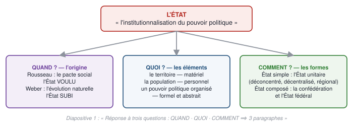
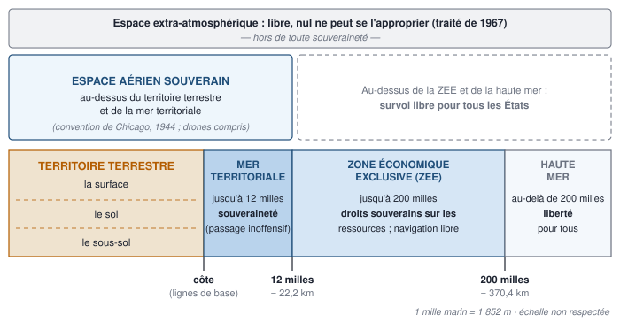
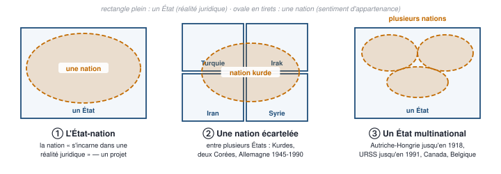
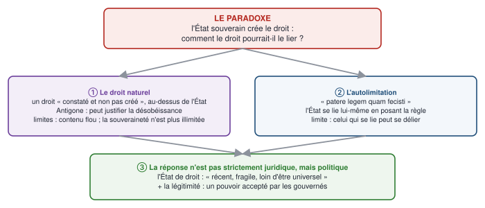
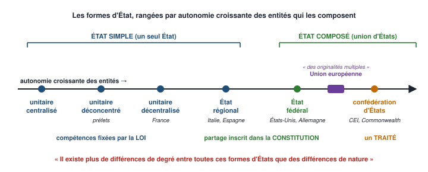
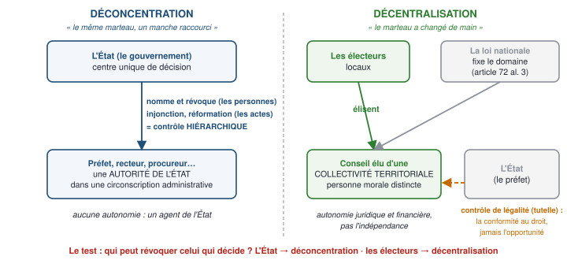
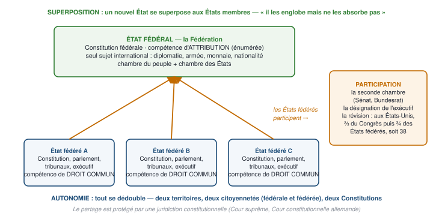
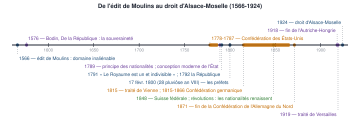
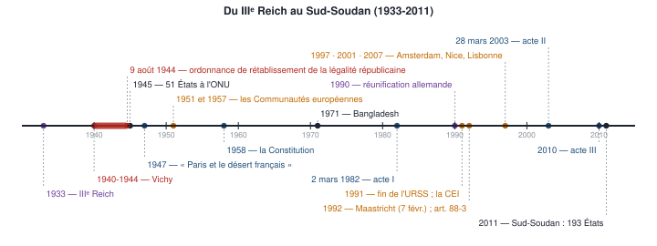

# 1 — Carte du chapitre

::: synthese Le chapitre en dix lignes
1. L'État est **« l'institutionnalisation du pouvoir politique »**, la forme habituelle de son organisation dans les sociétés développées — une **forme historique**, pas une nécessité : des sociétés ont vécu sans État.
2. Le chapitre répond à **trois questions** (diapositive 1) : **QUAND** — d'où vient l'État ? **QUOI** — de quoi est-il fait ? **COMMENT** — comment s'organise-t-il ?
3. **QUAND** : deux théories. Le **pacte social** de **Rousseau** — l'État **voulu**, critiqué comme abstrait et exigeant l'unanimité ; l'**évolution naturelle** de **Weber** — l'État **subi**, né de la guerre, critiqué parce qu'il nie les regroupements volontaires.
4. **QUOI** : trois éléments constitutifs — le **territoire** (matériel), la **population** (personnel), un **pouvoir politique organisé et souverain** (formel et abstrait).
5. La population n'est pas la **nation** : deux conceptions de la nation (**allemande** objective, **française** subjective — le « vouloir-vivre collectif » de **Renan**), l'**État-nation**, le **principe des nationalités**, et des nations et des États qui ne coïncident pas.
6. La **souveraineté** (**Bodin, 1576**) : une autorité exclusive, **suprême, indivisible, perpétuelle**, extérieure et intérieure, avec **quatre marques** ; et le paradoxe : **comment soumettre au droit celui qui le crée ?** — droit naturel, autolimitation, **État de droit**.
7. Le pouvoir de l'État est une **contrainte** (le monopole de la force organisée) qui doit être **légitime** ; et l'État est une **personne morale**, distincte de ceux qui le gouvernent.
8. **COMMENT** : l'**État unitaire** — un seul centre de décision, une seule catégorie de lois — tempéré par la **déconcentration** (des agents nommés) et la **décentralisation** (des collectivités élues, personnes morales), jusqu'à l'**État régional**.
9. L'**État composé** : la **confédération** naît d'un **traité** entre États qui restent souverains ; l'**État fédéral** naît d'une **Constitution** qui crée un État nouveau — trois principes : **superposition, autonomie, participation**. L'**Union européenne** est entre les deux.
10. La phrase qui conclut tout : **« il existe plus de différences de degré entre toutes ces formes d'États que des différences de nature »**.
:::



**Les idées maîtresses à retenir absolument**

1. **Trois éléments, trois qualificatifs** : territoire **matériel**, population **personnel**, pouvoir **formel et abstrait** — dans cet ordre, du concret à l'abstrait.
2. **La nation est un sentiment, l'État une réalité juridique** : ils ne coïncident que dans le projet de l'État-nation.
3. **La souveraineté ne se partage pas vers le haut** : aucun pouvoir au-dessus de l'État, sauf les limitations **librement acceptées** — c'est la **compétence de sa compétence**.
4. **Légalité ≠ légitimité** : Vichy, 1940-1944, légal sans être légitime.
5. **Le test de la décentralisation : qui peut révoquer celui qui décide ?** L'État → déconcentration ; les électeurs → décentralisation.
6. **Traité ou Constitution** : tout ce qui distingue la confédération de la fédération découle de l'acte fondateur.
7. **Une collectivité décentralisée administre, un État fédéré légifère** — elle n'a pas la compétence de ses compétences.

**Prérequis** — aucun. Les notions juridiques dont le chapitre a besoin — **personne morale**,
**traité**, **Constitution**, **loi et règlement**, **ratification**, **apatride**, **droit positif**
— sont **définies ici** au moment où elles servent, et reprises au glossaire (annexe A).

::: marche Le lien avec la finance, là où il est réel
- **Battre monnaie est une marque de souveraineté** (Bodin) : une monnaie commune — l'euro — est une **limitation de souveraineté librement acceptée**, exactement l'exemple du polycopié. C'est pourquoi la politique monétaire de la zone euro ne relève plus des États membres.
- **Le risque souverain** : un État peut emprunter et **engager sa responsabilité** parce qu'il est une **personne morale** permanente — « le roi est mort, vive le Roi » : la dette d'un gouvernement engage le suivant. C'est ce qui rend une obligation d'État négociable sur des décennies.
- **Fédéral ou unitaire, la question est aussi financière** : aux États-Unis, chaque État fédéré lève ses propres impôts et émet sa propre dette, notée séparément de celle de l'État fédéral ; en France, une collectivité décentralisée dispose d'une autonomie financière, mais sous contrôle de légalité.
- **La légitimité est une variable de marché** : un changement de régime perçu comme illégitime se lit d'abord dans les écarts de taux et le change.
:::

**Pour plus tard** — les définitions de l'État, de la souveraineté et des formes d'État sont le
socle de tout le **droit constitutionnel** du semestre et de la culture générale attendue aux
concours d'admission parallèle : savoir distinguer **fédéral / unitaire / confédéral** et
**légalité / légitimité** se demande à l'oral comme à l'écrit.

<!--saut-->

# 2 — Le cours reconstruit

> **Cinq sections d'apprentissage.** Chacune se travaille en un cycle APPRENDRE de quatre
> pomodoros : **P1** lecture active · **P2** restitution de mémoire, cours fermé · **P3** cartes de
> la section (§ 4.2) · **P4** questions de niveau 1 de la section (§ 5).

::: definition Les deux supports de ce chapitre, et pourquoi il faut les deux
| | Le **polycopié** | Les **diapositives** |
|---|---|---|
| Auteur / origine | **Michel Verpeaux**, *Droit constitutionnel 1 : Théorie générale de l'État — Histoire constitutionnelle de la France*, **Leçon 1 : L'État et le pouvoir politique**, **UNJF** (Université numérique juridique francophone) | Support de cours, **10 diapositives**, signées **S.H.** |
| Volume | 16 pages rédigées, denses | 10 diapositives, souvent réduites à des mots-clés |
| Plan | **Section 1** éléments constitutifs · **Section 2** formes d'États | **# 1** l'origine de l'État · **# 2** éléments constitutifs · **# 3** formes d'organisation |

**Les diapositives ajoutent une section entière que le polycopié ne traite pas** : l'**origine de
l'État** (§ 2.1.3 et 2.1.4). **Le polycopié fournit tout le contenu que les diapositives réduisent à
des mots-clés** — la diapositive 6 écrit « la souveraineté : un pouvoir suprême, indivisible,
perpétuel », sept mots ; le polycopié y consacre deux pages. **Et les deux sources divergent sur deux
points**, arbitrés au § 3.1 — dont l'un, deux ou trois principes du fédéralisme, peut décider d'une
question entière.
:::

| Question de la diapositive 1 | Contenu | Où |
|---|---|---|
| **QUAND** — d'où vient l'État ? | Les deux théories de l'origine | Diapositives seules ➔ § 2.1.3 et 2.1.4 |
| **QUOI** — de quoi est-il fait ? | Territoire, population, pouvoir politique souverain | Les deux sources ➔ § 2.2 et 2.3 |
| **COMMENT** — comment s'organise-t-il ? | État unitaire, confédération, État fédéral | Les deux sources ➔ § 2.4 et 2.5 |

## 2.1 — L'État : définition, histoire et origine (diapositives 1 à 4 · polycopié p. 1 et 2)

**À quoi sert cette section.** Elle répond à deux questions préalables : **qu'appelle-t-on « État » ?** — un mot à trois sens, dont un seul intéresse le droit — et **QUAND, d'où vient-il ?** — deux théories que seules les diapositives exposent. C'est la partie la plus « culture générale » du chapitre, et celle qui se perd le plus facilement : **un tiers des diapositives, absent du polycopié**.

### 2.1.1 — Ce qu'est l'État : deux formules, une étymologie, trois sens (diapositive 1 · polycopié p. 2)

::: definition Les deux formules d'ouverture, à connaître
**« L'État est la forme habituelle, dans les sociétés dites développées, de l'organisation
du pouvoir politique. Il est le cadre à l'intérieur duquel naissent et se développent les
règles constitutionnelles. »**

Et, plus court : **l'État est « l'institutionnalisation du pouvoir politique »**.
:::

**Étymologie :** du latin ***stare***, **« se tenir debout »**.

**Les trois sens du mot « état », dans l'ordre historique :**

| № | Sens | Illustration du support |
|:---:|---|---|
| **1** | Une **manière d'être** — l'apparence d'un être ou d'une situation | « Je suis dans tous mes états », « l'état de mes finances est calamiteux » |
| **2** | Une manière d'être **avec un statut juridique particulier**, visant un **groupe** | Les **États généraux**, le **Tiers-État** (Moyen Âge, Temps modernes) |
| **3** | **La manifestation du pouvoir politique**, et ceux qui l'exercent — **avec une majuscule** | « Chef de l'État », « représentant de l'État » |

::: piege La rupture de l'État moderne
Sous l'Ancien Régime, **Louis XIV** pouvait proclamer **« L'État, c'est moi »**, assimilant sa
personne et le pouvoir. **« L'État moderne a perdu cette identification physique ou
matérielle »** : il a besoin de **symboles extérieurs** pour exister. C'est ce que fondera la
théorie de la personnalité morale (§ 2.3.5).
:::

Le polycopié ouvre sur une difficulté : **« le mot "État" a en réalité plusieurs sens, ce qui
complique sa définition »**. D'où le détour par l'étymologie et par les trois sens ci-dessus.
Ce détour n'est pas de l'érudition : il explique pourquoi la même phrase peut dire deux
choses.

::: piege Le même mot désigne l'ensemble et un élément de l'ensemble
Le polycopié le signale comme une **« difficulté de langage préjudiciable à la bonne
compréhension »** : le troisième élément constitutif — le pouvoir politique organisé (§ 2.2.1) — est
souvent appelé **« l'État »**, alors que l'État au sens large désigne **les trois éléments
réunis**.

**En clair :** « l'État a augmenté les impôts » emploie le sens **étroit** — le pouvoir
politique central. « La France est un État » emploie le sens **large** — territoire,
population, souveraineté. **Savoir dire de quel sens on parle est, en droit, la marque d'un
étudiant sérieux.**
:::

### 2.1.2 — L'État dans l'histoire : né, effondré, ressuscité (polycopié p. 2)

| Fait | Détail |
|---|---|
| **51 États** | Membres de l'**ONU en 1945** |
| **193 États** | À l'heure actuelle |
| **Le Sud-Soudan, depuis 2011** | **Dernier État membre**, après la proclamation de son indépendance d'avec le Soudan |
| **Naissance** | Dans la **Rome antique**, à la suite des « cités » antiques |
| **Effondrement** | Après les **invasions**, et **malgré Charlemagne** |
| **Résurrection** | À la **Renaissance**, aux **XVIᵉ et XVIIᵉ siècles** |
| **Disparition annoncée** | Par la **théorie socialiste et marxiste** : l'État est « le symbole de l'oppression d'une classe sur une autre » et ne devait plus exister dans une société sans classes |

**Et le constat du support :** *« Même si la disparition de l'État n'est pas vraiment à l'ordre
du jour, l'histoire montre que des sociétés ont pu vivre sans État. »*

Deux affirmations du polycopié méritent d'être retenues ensemble, parce qu'elles se répondent :

- **« L'État est une forme historique et contingente qui correspond à un certain degré de
  développement de la civilisation occidentale. »**
- **« L'histoire montre que des sociétés ont pu vivre sans État. »**

::: synthese Pourquoi ces deux phrases ouvrent le chapitre
Elles posent que l'État **n'est pas la seule manière d'organiser le pouvoir politique**, mais
**la forme habituelle dans les sociétés développées**. Tout le chapitre se déploie à partir
de là : si l'État n'est pas une nécessité, alors il faut expliquer **d'où il vient** (la
section QUAND), **de quoi il est fait** (QUOI), et **sous quelles formes il peut s'organiser**
(COMMENT).

Sa trajectoire historique — naissance à Rome, effondrement après les invasions, résurrection
à la Renaissance aux XVIᵉ et XVIIᵉ siècles — le confirme : **l'État a déjà disparu une fois.**
Et la **théorie socialiste et marxiste** le vouait à disparaître de nouveau, comme « symbole
de l'oppression d'une classe sur une autre » dans une société sans classes.
:::

### 2.1.3 — QUAND · La théorie contractualiste : le pacte social (diapositives 2 et 3)

::: piege Cette section n'existe que dans les diapositives
Le polycopié **ne traite pas l'origine de l'État**. Il commence directement par les éléments
constitutifs. **Réviser le seul polycopié, c'est arriver à l'examen sans un tiers du
chapitre** — et sans les deux seuls auteurs que la diapositive 2 présente comme « les deux
théories principales » des « explications philosophiques ».
:::

::: definition Source : diapositive 3 — absent du polycopié
**Auteur : Jean-Jacques Rousseau.**

- **Fondé sur un accord de volonté** pour **protéger les intérêts de chacun**.
- **Association des individus par un pacte** pour constituer un État.
- **La formule de Rousseau, à citer :** **« chacun s'unissant à tous, n'obéissant pourtant
  qu'à lui-même et reste aussi libre qu'auparavant »**.

**La critique, donnée par le support :** **« le contrat est abstrait et implique
l'unanimité »**.
:::

Ce que les six lignes de la diapositive 3 supposent connu :

::: definition Le contrat social, reconstruit
L'idée contractualiste part d'une question : **pourquoi un individu libre accepterait-il
d'obéir ?** La réponse est qu'il y **consent**, en échange d'une protection. Les individus
passent donc un **pacte** — un accord de volontés — par lequel ils **constituent** un pouvoir
politique chargé de **protéger les intérêts de chacun**.

**Le tour de force de Rousseau** tient dans la formule citée par le support : **« chacun
s'unissant à tous, n'obéissant pourtant qu'à lui-même et reste aussi libre qu'auparavant »**.
Autrement dit : si je participe à la formation de la règle commune, alors **obéir à cette
règle, c'est m'obéir à moi-même** — je n'aliène pas ma liberté, je la transforme.
:::

::: piege La critique tient en deux mots, et il faut savoir les développer
Le support écrit : **« le contrat est abstrait et implique l'unanimité »**.

**Abstrait :** ce pacte n'a **jamais été signé**. Aucune archive, aucune date, aucun
signataire. C'est une **fiction** destinée à **justifier** l'obéissance, non un fait
historique — ce qui la rend invérifiable.

**Il implique l'unanimité :** pour qu'un contrat engage, il faut que **chacun** y ait
consenti. Or une société compte des opposants, et surtout ceux qui **naissent après** le
pacte et n'ont rien signé. **Pourquoi seraient-ils liés ?** C'est l'objection classique, et
c'est elle qui ouvre la porte à la seconde théorie.
:::

::: definition La phrase exacte de Rousseau, et d'où elle vient
La formule de la diapositive est une citation abrégée. Le texte exact est dans ***Du contrat
social*** (**1762**), **livre I, chapitre 6** : **« Trouver une forme d'association qui défende et
protège de toute la force commune la personne et les biens de chaque associé, et par laquelle chacun
s'unissant à tous n'obéisse pourtant qu'à lui-même et reste aussi libre qu'auparavant. »** Rousseau
ajoute : *« Tel est le problème fondamental dont le contrat social donne la solution. »* *(précision hors support, exacte — utile en copie)*

**Le mot à retenir est « problème »** : le contrat social n'est pas un récit des origines, c'est la
**solution d'un problème** — comment concilier l'obéissance et la liberté. C'est exactement ce qui
fonde la critique « le contrat est abstrait » : il répond à une question de **légitimité**, non à une
question d'**histoire**.
:::

### 2.1.4 — QUAND · La théorie de l'évolution naturelle (diapositive 4)

::: definition Source : diapositive 4 — absent du polycopié
**Auteur : Max Weber.**

- **Fondé sur un constat : l'évolution de la société.**
- **Plusieurs types de sociétés humaines à l'origine**, qui se sont **transformées pour
  répondre aux menaces (guerres)** et **permettre la paix** au sein de celles-ci.
- **« L'État est vu comme le résultat d'un long processus de compétition, de centralisation
  et de différenciation des fonctions sociales. »**

**La critique, donnée par le support :** elle **« nie les regroupements volontaires (cultures,
origines) »** et **met en avant la guerre**.
:::

::: definition Ce que « évolution naturelle » veut dire ici
La théorie ne part pas d'une **justification** mais d'un **constat**. Elle ne demande pas
*pourquoi devrait-on obéir ?* mais *comment les États sont-ils apparus en fait ?*

**Le mécanisme, tel que la diapositive 4 le décrit :** il existait à l'origine **plusieurs
types de sociétés humaines** ; elles se sont **transformées pour répondre aux menaces —
les guerres — et permettre la paix en leur sein**. L'État est le produit de ce tri : **« un
long processus de compétition, de centralisation et de différenciation des fonctions
sociales »**.

**Les trois mots du mécanisme :**
- **compétition** — les unités politiques se font la guerre ; celles qui survivent sont celles
  qui savent lever des armées et des impôts ;
- **centralisation** — pour lever armées et impôts, il faut concentrer le pouvoir ;
- **différenciation des fonctions sociales** — administrer un pouvoir centralisé exige des
  fonctions spécialisées : percepteurs, juges, soldats, scribes.
:::

::: piege La critique, développée
Le support écrit qu'elle **« nie les regroupements volontaires (cultures, origines) »** et
qu'elle **met en avant la guerre**.

**Elle nie les regroupements volontaires :** si l'État naît de la compétition militaire, alors
le fait que des gens partagent une langue, une culture ou une histoire ne compte pour rien —
or c'est précisément ce que la conception française de la nation (§ 2.2.3) met au premier plan.

**Elle met en avant la guerre :** l'État y est fondé sur la **violence**, non sur le
consentement. Ce qui est l'inverse exact du pacte social.

**Le point de contact entre les deux supports, que personne ne fera :** le polycopié, sans
jamais citer Weber, écrit que l'État **« possède le monopole de la force organisée »** (§ 2.3.4).
**C'est la définition wébérienne même de l'État.** Le faire remarquer relie les deux sources
en une phrase et montre que tu les as lues toutes les deux.
:::

::: definition La définition de Weber que le polycopié reprend sans le nommer
Dans *Le Savant et le Politique* (conférence de **1919**), **Max Weber** définit l'État comme **« la
communauté humaine qui, dans les limites d'un territoire déterminé, revendique avec succès pour son
propre compte le monopole de la violence physique légitime »**. *(précision hors support, exacte — utile en copie)*

**Les trois éléments constitutifs y sont déjà** : une **communauté humaine** (la population), un
**territoire déterminé**, et un **monopole** — le pouvoir politique. Et le mot **« légitime »**
annonce la **légitimité** du § 2.3.4 : pour Weber, la force de l'État n'est pas une force brute,
c'est une force **reconnue**.
:::

::: piege Les deux théories s'opposent terme à terme
| | **Contractualiste (Rousseau)** | **Évolution naturelle (Weber)** |
|---|---|---|
| Fondement | Un **accord de volonté** | Un **constat** sur l'évolution des sociétés |
| Moteur | La **volonté** des individus | La **guerre**, la compétition |
| L'État est | **Voulu** | **Subi**, résultat d'un processus |
| Critique | **Abstrait**, exige l'**unanimité** | **Nie les regroupements volontaires** |
:::

::: synthese Comment répondre si l'on te demande laquelle est vraie
**Ne tranche pas.** Le support présente deux théories, chacune avec sa critique : c'est le
signe qu'il attend une **comparaison**, pas un choix.

La réponse attendue : les deux théories **ne répondent pas à la même question**. Le
contractualisme cherche à **fonder la légitimité** du pouvoir — pourquoi l'obéissance est-elle
due ? L'évolution naturelle cherche à **expliquer l'apparition** de l'État — comment est-il né
en fait ? **Une question normative et une question positive.** Elles ne sont donc pas
concurrentes mais complémentaires, et chacune échoue là où l'autre réussit : le pacte est
invérifiable, l'évolution ne justifie rien.
:::

<!--saut-->

## 2.2 — Le territoire et la population (diapositive 5 · polycopié p. 3 à 6)

**À quoi sert cette section.** Elle ouvre la question **QUOI** : de quoi un État est-il fait ? Trois éléments constitutifs, dont elle traite les deux premiers — le **territoire**, élément matériel, et la **population**, élément personnel. Le cœur de la section est une distinction que presque tout le monde rate : **la population n'est pas la nation**, et **la nation n'est pas l'État**.

### 2.2.1 — Les trois éléments constitutifs (diapositive 5 · polycopié p. 3)

::: definition La formule du polycopié, à restituer
**« Le droit international et le droit constitutionnel définissent l'État par trois éléments
constitutifs que sont un territoire, une population et une organisation politique qui exerce
l'autorité de façon souveraine, c'est-à-dire qui n'est pas obligée de tenir compte d'autres
règles que les siennes, sinon celles du droit international. »**
:::

| № | Élément | Qualification du support |
|:---:|---|---|
| **1** | **Le territoire** | **Élément matériel** |
| **2** | **La population** | **Élément personnel** — la diapositive 5 ajoute : **« refus des apatrides »** |
| **3** | **Un pouvoir politique organisé** | **Élément formel et abstrait** |

::: piege L'État a un sens large et un sens étroit
**Sens large :** les **trois éléments** réunis.
**Sens étroit :** le seul **pouvoir politique central**, opposé aux **collectivités
territoriales**, ou synonyme de **« gouvernement »** dans les relations diplomatiques.
**Troisième opposition, plus récente :** l'État comme **puissance publique**, opposé à la
**« société civile »** — individus, groupements de droit privé, corps intermédiaires,
entreprises, « partenaires sociaux ».
:::

::: definition Pourquoi le territoire est dit « élément matériel »
Parce qu'il est le seul des trois à être **physique**, mesurable, cartographiable. La
population est un **groupe humain** — un élément **personnel**. La souveraineté est un
**pouvoir** — un élément **formel et abstrait**. Ces trois qualificatifs ne sont pas
décoratifs : ils classent les trois éléments **par degré d'abstraction croissant**, et cet
ordre est l'ordre même du plan.
:::

### 2.2.2 — Le territoire, élément matériel (polycopié p. 3 et 4)

::: definition
**« Le territoire est la partie de l'espace géographique qui "appartient" à l'État, qui
relève de cet État. C'est l'espace sur lequel l'autorité politique va exercer son pouvoir. »**
**Sans territoire, le pouvoir de l'État ne peut s'exercer.** Cet espace est délimité par des
**frontières**.
:::

**Les trois configurations particulières, avec leurs exemples :**

| Cas | Exemples du support |
|---|---|
| **Discontinuité** — plusieurs entités séparées | Les **archipels** · la **France** avec les départements et collectivités d'**outre-mer** · les **États-Unis** avec l'**Alaska** et **Hawaï** · le **Pakistan**, dont les deux parties étaient séparées avant la création du **Bangladesh en 1971** |
| **Enclavement** | **Saint-Marin**, le **Vatican** · le **Haut-Karabagh**, enclavé en **Azerbaïdjan**, dont la communauté internationale **ne reconnaît pas l'indépendance** · **Kaliningrad**, enclave russe entre **Pologne et Lituanie** |
| **Taille indifférente** | **Micro-États** : Monaco, Saint-Marin, Liechtenstein · **États gigantesques** : Russie, Canada, Chine. **Monaco est le plus petit État de l'ONU avec 2,5 km²** ; **la Cité du Vatican, non membre de l'ONU, compte 700 habitants** |

::: piege L'intangibilité du territoire, et l'exception française
Face au danger des revendications territoriales, **« beaucoup de constitutionnalistes posent
le principe de son intangibilité et interdisent aux pouvoirs publics de consentir à des
abandons de territoire »**.

**Ce n'est pas le cas de la France :** l'**article 53 alinéa 3 de la Constitution de 1958**
prévoit la possibilité de **cession**, mais aussi d'**adjonction**, de territoires.
:::

::: definition L'article 53 alinéa 3, à citer avec son texte
**« Nulle cession, nul échange, nulle adjonction de territoire n'est valable sans le consentement des
populations intéressées. »** *(précision hors support, exacte — utile en copie)*

**Lecture juridique.** L'article **n'interdit pas** de modifier le territoire : il en fixe la
**condition** — le **consentement des populations intéressées**. C'est pourquoi la France n'applique
pas le principe d'**intangibilité** ; et c'est le lien avec le **droit des peuples à disposer
d'eux-mêmes** du § 2.2.4.
:::

::: piege Deux exemples du support à mettre à jour
- **Le Haut-Karabagh** : depuis l'offensive azerbaïdjanaise de **septembre 2023**, la république
  autoproclamée a été **dissoute (1ᵉʳ janvier 2024)** et la quasi-totalité de sa population arménienne
  a quitté la région. **L'exemple est devenu historique** : écris « le Haut-Karabagh, enclavé en
  Azerbaïdjan, dont l'indépendance proclamée n'a jamais été reconnue ». *(précision hors support, exacte — utile en copie)*
- **Monaco** : le support donne **2,5 km²** ; la superficie officielle est d'**environ 2 km²**. En
  copie, l'idée compte plus que le chiffre : **le plus petit État membre de l'ONU**. *(précision hors support, exacte — utile en copie)*
:::

::: synthese La question que le support pose sans y répondre
**« Un État sans territoire en est-il encore un ? »** Le polycopié cite **« pendant longtemps
le problème palestinien »** et les **"États" en exil à la suite d'une guerre**.

**Le raisonnement à tenir :** si le territoire est *« l'espace sur lequel l'autorité politique
va exercer son pouvoir »*, alors sans territoire, **il n'y a rien sur quoi exercer le
pouvoir** — l'élément manque, et la qualification d'État devient contestée. C'est exactement
pourquoi la reconnaissance internationale de tels « États » fait débat, comme pour le
**Haut-Karabagh**, dont la communauté internationale ne reconnaît pas l'indépendance.

Le support répond aussi indirectement par les cas limites : **ni la discontinuité, ni
l'enclavement, ni la petitesse n'empêchent d'être un État** — Monaco fait 2,5 km² et siège à
l'ONU. **Ce n'est donc pas la forme du territoire qui compte, c'est son existence.**
:::

**Le territoire maritime et aérien — les chiffres exacts** (polycopié p. 4)

**Sur le plan juridique, le territoire ne comprend pas seulement la surface, mais aussi le
sol et le sous-sol.**

| Zone | Étendue | Statut |
|---|---|---|
| **Mer territoriale** | **12 milles marins** | Compétences **identiques** à celles exercées sur le territoire terrestre |
| **Zone économique exclusive** (ou mer patrimoniale) | **188 milles marins** de plus — elle englobe le **plateau continental** | **Droits souverains économiques** : exploration et exploitation des ressources ; navigation et survol libres |
| **Total** | **Jusqu'à 200 milles nautiques** depuis la côte — soit $ 12 + 188 $ | **Plafond** de la zone économique exclusive |
| **Haute mer** | Au-delà | **Ouverte à tous les États**, riverains ou non, en vertu du **principe de liberté**, notamment de navigation |
| **Espace aérien** | L'atmosphère au-dessus du territoire terrestre **et** de la mer territoriale | Souverain — au-delà, survol libre |
| **Espace extra-atmosphérique** | — | **Exclu — il reste libre** |

**La conversion à connaître : 1 mille marin = 1 852 mètres.** Le polycopié précise que, pour
la France, les 188 milles représentent **348 km**.

**Et la raison du régime maritime, donnée par le support :** *« l'exploitation de la mer prime
sur les considérations liées à la navigation, pour des raisons économiques telles que la
pêche, le pétrole et autres richesses sous-marines »*.

::: piege Trois précisions de droit de la mer que le cours précédent donnait mal
Le régime est fixé par la **Convention des Nations unies sur le droit de la mer**, signée à **Montego
Bay** le **10 décembre 1982**. *(précision hors support, exacte — utile en copie)*

1. **200 milles est un plafond, pas un minimum.** La ZEE s'étend **« jusqu'à »** 200 milles marins
   mesurés depuis la côte (les lignes de base). La version précédente de ce cours parlait d'« étendue
   **minimale** » : c'est faux — écris « **jusqu'à 200 milles** ».
2. **Dans la ZEE, l'État a des droits souverains économiques, pas la souveraineté pleine.** Il y est
   seul à explorer et exploiter les ressources — pêche, pétrole — mais **les autres États y naviguent
   et la survolent librement**. D'où le nom de **« mer patrimoniale »** : une richesse, non un
   territoire.
3. **L'espace aérien souverain s'arrête avec la mer territoriale**, à 12 milles : au-dessus de la ZEE,
   le **survol est libre**. « L'atmosphère au-dessus de l'espace maritime » vise donc la **mer
   territoriale**.
:::



::: definition Le plateau continental et la zone économique exclusive
Le **plateau continental** est le prolongement immergé du continent : une plate-forme de
faible profondeur, avant le talus qui plonge vers les grands fonds. C'est là que se
concentrent la **pêche**, le **pétrole** et « autres richesses sous-marines ».

La **zone économique exclusive** est la bande de mer sur laquelle l'État riverain détient des
droits économiques exclusifs. Le support la nomme aussi **mer patrimoniale** — le mot
*patrimoine* dit bien ce dont il s'agit : une **richesse**, non un territoire de souveraineté
pleine.

**D'où la phrase du support :** *« l'exploitation de la mer prime sur les considérations liées
à la navigation, pour des raisons économiques »*. Le droit de la mer s'est construit autour de
l'**exploitation**, pas autour du passage.
:::

::: exemple Le calcul à savoir refaire
**Combien de kilomètres représentent les 200 milles marins de souveraineté maritime ?**

1. **1 mille marin = 1 852 m** (donnée du support).
2. $ 200 \times 1\,852 = 370\,400 $ m, soit **370,4 km**.
3. Vérification avec le chiffre du support : les **188 milles** de la seule zone économique
   exclusive valent $ 188 \times 1\,852 = 348\,176 $ m, soit **environ 348 km** — ce qui
   correspond au chiffre annoncé.
4. Et $ 12 + 188 = 200 $ : les deux zones s'additionnent bien.
:::

### 2.2.3 — La population et la nation : deux conceptions (diapositive 5 · polycopié p. 4 et 5)

::: definition Population et nation
**Population :** **« un groupe humain, d'individus sédentaires, rattachés à un État »**.

**Nation :** **« un groupement humain dans lequel les individus se sentent unis les uns aux
autres par des liens à la fois matériels et spirituels, et qui se conçoivent (ou se
perçoivent) comme différents des individus qui composent les autres groupements
nationaux »**.
:::

**La population a longtemps été confondue avec la nation** — et le polycopié consacre
plusieurs pages à montrer qu'elles ne se confondent pas.

::: definition Le mot que la diapositive 5 emploie sans l'expliquer : « refus des apatrides »
Un **apatride** est une personne qu'**aucun État ne reconnaît comme son ressortissant** : elle
n'a **aucune nationalité**.

**Ce que « refus des apatrides » signifie ici :** l'élément « population » d'un État suppose
des individus **rattachés** à cet État par un lien juridique — la nationalité. Un État ne peut
donc pas être constitué d'apatrides : ce serait un groupe humain sans lien juridique avec lui.
Le droit international voit d'ailleurs dans l'apatridie une situation à **réduire**, parce
qu'elle prive la personne de la protection d'un État.
:::

::: definition Conception allemande — objective
**« La nation est le résultat d'éléments objectifs et subit l'influence du déterminisme. »**

**En font partie :** la **géographie** — d'où l'idée de **frontières naturelles** — la
**langue** — tous les germanophones seraient englobés dans la nation, y compris dans les
**Sudètes**, en **Belgique** ou en **Alsace** — la **religion**, l'**idéologie** et même la
**race**.

**Son apogée :** sous le **IIIᵉ Reich, à partir de 1933**. La nation s'identifie alors à la
race et conduit à **l'élimination, par l'exode ou par la mort, de tous les non-nationaux**.
Le support ajoute que **les génocides anciens ou modernes relèvent aussi de cette vision**, et
cite le **conflit yougoslave de 1991** et la **« purification ethnique »**.
:::

::: definition Conception française — subjective
**Inspirée par les travaux de Fustel de Coulanges et de Renan.** Elle fait entrer, **à côté
des éléments objectifs**, la **volonté de vivre ensemble** — **« un vouloir-vivre
collectif »** selon **Renan**.

**Les facteurs :** des **souvenirs communs**, bons ou mauvais — guerres, victoires sportives,
fête nationale, hymne national · la **communauté d'intérêts économiques** · le **sentiment de
parenté spirituelle** — se sentir français, suisse ou américain, le **salut au drapeau**.

**Et une portée dans le temps :** *« la nation dépasse aussi les individus vivants, et elle
unit les générations passées et celles à venir. La nation se rapproche alors de la patrie. »*
:::

::: piege L'avertissement que le support place lui-même
*« Ce "sentiment national" se construit souvent par rapport à d'autres groupes, par un
sentiment de différences avec d'autres groupes ou nations, ce qui peut conduire à
l'exclusion. L'unité nationale se fait souvent contre les autres nations. Il peut aussi de
cette manière être facteur de guerres. »*

**Et la phrase qui ouvre la section :** ces deux conceptions **« furent d'une certaine façon à
l'origine des guerres des XIXᵉ et XXᵉ siècles »**.
:::

::: piege Les deux conceptions, et ce qu'elles produisent
| | **Allemande — objective** | **Française — subjective** |
|---|---|---|
| Critère | Ce que l'on **est** : géographie, langue, religion, idéologie, race | Ce que l'on **veut** : le **« vouloir-vivre collectif »** de Renan |
| Déterminisme | **Oui** — on naît d'une nation | **Non** — on y adhère |
| Conséquence logique | Tous les germanophones appartiennent à la nation allemande, **où qu'ils vivent** — Sudètes, Belgique, Alsace | La nation se forge par des **souvenirs communs**, une **communauté d'intérêts économiques**, un **sentiment de parenté spirituelle** |
| Dérive citée par le support | **IIIᵉ Reich à partir de 1933** : la nation s'identifie à la race, et conduit à **l'élimination des non-nationaux** ; les **génocides** ; la **« purification ethnique »** en ex-Yougoslavie, **1991** | Le support ne lui attribue pas de dérive propre — mais il note que **l'unité nationale se fait souvent contre les autres nations** et peut être **facteur de guerres** |

**La conception française n'est pas « meilleure » : elle est plus inclusive** — on peut
devenir français —, mais elle repose sur un sentiment qui, lui aussi, **se construit par
différence** avec les autres.
:::

::: definition Renan, la source de la conception française
**Ernest Renan**, ***Qu'est-ce qu'une nation ?***, conférence prononcée à la **Sorbonne** le **11 mars
1882** : **« L'existence d'une nation est (pardonnez-moi cette métaphore) un plébiscite de tous les
jours. »** *(précision hors support, exacte — utile en copie)*

**Le contexte explique tout** : en 1882, l'**Alsace et la Moselle** sont allemandes depuis 1871. La
conception allemande les rattache à l'Allemagne par la **langue** ; la conception française les
rattache à la France par la **volonté** de leurs habitants. **Les deux conceptions sont nées d'un
conflit de territoire** — c'est le sens de la phrase du support : elles furent « à l'origine des
guerres des XIXᵉ et XXᵉ siècles ».
:::

### 2.2.4 — L'État-nation, le principe des nationalités et le droit des peuples (polycopié p. 5 et 6)

::: synthese Pourquoi le polycopié consacre trois pages à la nation
Parce que **la confusion entre État et nation est la plus lourde du chapitre**, et qu'elle a
des conséquences historiques que le support n'hésite pas à nommer : les deux conceptions de la
nation **« furent d'une certaine façon à l'origine des guerres des XIXᵉ et XXᵉ siècles »**.

**La chaîne du raisonnement :**
1. La **nation** est d'abord un **sentiment** — se sentir unis, et différents des autres.
2. Deux façons de définir ce sentiment : par des **critères objectifs** (conception allemande)
   ou en y ajoutant la **volonté** (conception française).
3. L'**État-nation** naît quand on décide que cette nation **doit s'incarner dans une réalité
   juridique** : l'État.
4. Le **principe des nationalités** en tire la règle : **toute nation a droit à devenir un
   État**.
5. Mais **les frontières des nations et celles des États ne coïncident pas** — d'où les
   nations écartelées et les États multinationaux, et d'où les guerres.
:::

**Le concept d'État-nation** naît de l'assimilation de l'État et de la nation, « parce que
cette nation doit s'incarner dans une **réalité juridique** ».

| Ordre d'apparition | Exemples du support |
|---|---|
| **La nation précède l'État** | En Europe : l'**État italien** et l'**État allemand** ont suivi l'émergence de la nation |
| **L'État précède la nation** | En **France** : « c'est lui qui a progressivement forgé la nation, autour des **Rois de France** puis de la **République** » · de même dans les **États africains nés de la décolonisation**, qui ont dû créer une « nationalité » à partir de **frontières imposées par le colonisateur** |

**Une nation écartelée entre plusieurs États :** l'**Allemagne de 1945 à 1990** (RDA et RFA) ·
les **deux Corées** · la **nation kurde**, éclatée entre **Turquie, Irak, Iran et Syrie** ·
les **minorités hongroises** en Roumanie et Slovaquie · la **nation basque**, partagée entre
Espagne et France.

**Un État regroupant plusieurs nations — États bi ou multinationaux :** l'**Empire
austro-hongrois jusqu'en 1918** · la **Tchécoslovaquie jusqu'en 1992** · l'**URSS jusqu'en
1991** · et, « de façon moins radicale », le **Canada** et la **Belgique** contemporaine.

::: piege Une date à corriger : la Tchécoslovaquie
La version précédente de ce cours écrivait « la **Tchécoslovaquie jusqu'en 1991** ». **C'est faux** :
la Tchécoslovaquie a été dissoute le **31 décembre 1992** — la République tchèque et la Slovaquie
existent depuis le **1ᵉʳ janvier 1993**. **Pour l'URSS, 1991 est exact** (dissolution en décembre
1991, et création de la **CEI** le même mois, § 2.5.1). *Si le polycopié lui-même écrit 1991 pour la
Tchécoslovaquie, c'est une erreur du support : vérifie la page 6 et écris 1992.*
:::



::: exemple Le cas français, à connaître par cœur
**En Europe, les nations ont souvent précédé l'État** : l'État italien et l'État allemand ont
suivi l'émergence des nations italienne et allemande.

**En France, c'est l'inverse :** *« il est fréquent de dire que l'État a précédé la nation.
C'est lui qui a progressivement forgé la nation, autour des Rois de France puis de la
République. »*

**Et le support ajoute un troisième cas :** les **États africains nés de la décolonisation**,
qui ont dû **créer une « nationalité » à partir de frontières imposées par le colonisateur** —
ni la nation avant l'État, ni l'État qui forge patiemment une nation, mais un État hérité qui
doit fabriquer une nation dans des frontières qu'il n'a pas choisies.
:::

::: definition Le principe des nationalités
**« Toute nation a droit à devenir un État. »** Développé **à partir de la Révolution
française**, il rejoint l'idée de **souveraineté nationale**.
:::

**Sa trajectoire historique, en quatre dates :**

| Date | Événement |
|:---:|---|
| **À partir de 1789** | Naissance du principe · **Napoléon** contribue à le propager dans ses conquêtes |
| **1815** | **Traité de Vienne** — le principe est **combattu** par les vainqueurs de la **Sainte-Alliance** |
| **1848** | Il **renaît** avec les révolutions de cette époque |
| **1919** | Le **traité de Versailles** le développe en **Europe centrale et orientale** : **« la carte de l'Europe est refaite sur cette base »** |

::: definition Sa forme moderne : le droit des peuples à disposer d'eux-mêmes
Inscrit dans la **Charte de l'ONU, article 1ᵉʳ, paragraphe 2**, et dans le **Préambule de la
Constitution française de 1958, alinéa 2** — **« ce qui peut entraîner une modification
possible du territoire national »**.

**Il a joué un grand rôle dans le mouvement de décolonisation de l'après-Seconde Guerre
mondiale, sous la forme du droit à l'autodétermination.**
:::

### 2.2.5 — Nationalité, citoyenneté, étrangers (polycopié p. 6)

::: definition
**« La nationalité unit l'État aux personnes, avec en général comme conséquence la
citoyenneté, c'est-à-dire le droit de participer à la vie politique de l'État. »**
:::

::: piege La dérogation de l'article 88-3
L'**article 88-3 de la Constitution**, **inséré en 1992**, **dissocie la nationalité et la
citoyenneté** pour les **élections locales — municipales**, en instituant le concept de
**citoyenneté de l'Union européenne**. Il **se présente comme une dérogation à l'article 3**,
qui affirme le lien entre nationalité et citoyenneté.
:::

**Le texte de l'article 88-3, à connaître dans sa substance** : sous réserve de réciprocité, **« le
droit de vote et d'éligibilité aux élections municipales peut être accordé aux seuls citoyens de
l'Union résidant en France »** ; ces citoyens **ne peuvent exercer les fonctions de maire ou
d'adjoint, ni participer à la désignation des électeurs sénatoriaux et à l'élection des sénateurs**.
*(précision hors support, exacte — utile en copie)* **La réserve dit tout** : le maire est aussi agent de l'État (§ 2.4.4) et les sénateurs
participent à la souveraineté nationale — ces fonctions restent liées à la **nationalité**.

**Les étrangers.** La population d'un État comprend aussi des étrangers : l'État a à
« administrer » des non-nationaux, **« qui sont précisément des administrés et non des
citoyens »**, mais qui ont **certains droits** — le **droit de saisir une juridiction**, par
exemple si on leur refuse la qualité de réfugié, ou le **droit de se faire soigner**.

**La conclusion du polycopié :** **« L'État ne se confond donc pas totalement avec la nation,
ni même avec ses nationaux. »**

<!--saut-->

## 2.3 — Le pouvoir politique organisé : souveraineté, droit, légitimité, personnalité morale (diapositives 6 et 7 · polycopié p. 6 à 9)

**À quoi sert cette section.** Elle traite le troisième élément constitutif, le plus abstrait : **le pouvoir politique organisé**. Deux caractéristiques juridiques le définissent — il est **souverain**, et l'État qui l'exerce est une **personne morale**. Entre les deux, le problème le plus difficile et le plus rentable du chapitre : **comment un pouvoir souverain, qui crée le droit, peut-il y être soumis ?**

### 2.3.1 — Les deux caractéristiques juridiques, et la souveraineté selon Bodin (diapositive 6 · polycopié p. 6 et 7)

1. **Le pouvoir exercé dans l'État est souverain**, aussi bien à l'égard des autres États
   qu'à l'intérieur du territoire → **la souveraineté** (§ 2.3.1 à 2.3.3).
2. **L'État est assimilé à une personne juridique**, par la **théorie de la personnalité
   morale** (§ 2.3.5).

::: definition
**« Sur la population de ce territoire, l'État doit exercer une autorité politique exclusive,
appelée souveraineté. »** Elle **« implique la négation de toute entrave, de toute
subordination à l'égard d'autres États, en dehors des limitations librement acceptées »**.

**Diapositive 6 :** la souveraineté est **« une puissance publique / le pouvoir politique »**,
**« un pouvoir spécifique distinct des autres formes de pouvoir »**.
:::

::: definition Jean Bodin, 1576
**Jean Bodin** dégage la souveraineté de l'État en **1576**, dans ***De la République***
— titre complet : *Les Six Livres de la République*.

**Pour Bodin, souveraineté signifie indépendance absolue** : **« l'État souverain est
affranchi de tout autre pouvoir »**.

**L'enjeu historique :** protéger l'indépendance de la **Couronne française** vis-à-vis du
**Saint-Siège** et du **Saint-Empire romain germanique**.

**La limite de cette définition, que le support signale :** elle est **« essentiellement
négative »**, sous la forme d'une **souveraineté-indépendance**, car elle **se définit par
rapport à d'autres souverains**.
:::

::: demo Pourquoi Bodin écrit en 1576, et pourquoi cela compte
1. Au XVIᵉ siècle, le roi de France est pris entre deux prétentions extérieures : celle du
   **Saint-Siège**, qui revendique une autorité spirituelle et temporelle sur les princes
   chrétiens, et celle du **Saint-Empire romain germanique**, héritier de l'idée d'empire
   universel.
2. **Bodin forge la souveraineté pour trancher** : l'État souverain est **« affranchi de tout
   autre pouvoir »**. Personne, au-dessus de lui, ne commande.
3. **D'où le caractère de la définition, que le support souligne** : elle est
   **« essentiellement négative »**. Elle ne dit pas ce que le souverain **peut faire**, elle
   dit qu'**aucun autre ne lui commande**. C'est une **souveraineté-indépendance**, définie
   par rapport à d'autres souverains.
4. **Et c'est pourquoi Bodin ajoute les quatre marques** (§ 2.3.2) : faire la loi, rendre la
   justice, battre monnaie, lever une armée. Elles donnent un **contenu positif** à ce qui
   n'était qu'une négation.
:::

### 2.3.2 — Caractères, plans, marques et titulaires de la souveraineté (diapositives 6 et 7 · polycopié p. 7)

::: piege Une divergence entre les deux supports — à trancher
| **Diapositive 6** | **Polycopié (Bodin)** |
|---|---|
| Un pouvoir **suprême** | Une souveraineté **absolue** |
| Un pouvoir **indivisible** | **Indivisible** |
| Un pouvoir **perpétuel** | **Perpétuelle** |

**Deux caractères sur trois sont identiques.** Le premier diffère : **suprême** dans les
diapositives, **absolue** chez Bodin selon le polycopié.

**Conduite à tenir :** restitue **« suprême, indivisible, perpétuel »** si l'on te demande les
caractères de la souveraineté — c'est la formulation du cours oral. Ajoute que **Bodin la
qualifiait d'"absolue, perpétuelle et indivisible"** : tu montres que tu as lu les deux
sources, et les deux formulations disent la même chose — un pouvoir qu'aucun autre ne
surpasse.
:::

**Les deux plans** (diapositive 6 et polycopié) :

| Plan | Nom donné par le polycopié |
|---|---|
| **Interne** | **Souveraineté intérieure**, ou souveraineté **dans l'État** |
| **Externe** | **Souveraineté extérieure**, ou souveraineté **de l'État** |

**La formule de Rousseau qui vaut dans les deux cas**, citée par le polycopié
(*Lettres écrites de la montagne*) : **« Il est de l'essence de la puissance souveraine de ne
pouvoir être limitée : elle peut tout ou elle n'est rien. »**

**Et la formule du juriste allemand Jellinek :** l'État dispose de la **« compétence de sa
compétence »** — il détermine lui-même l'étendue de ses propres compétences.

::: piege Les deux plans, et l'erreur de vocabulaire à éviter
| Plan | Nom du polycopié | Contre qui elle s'exerce |
|---|---|---|
| **Externe** | Souveraineté **de** l'État | **Les autres États** : aucune subordination |
| **Interne** | Souveraineté **dans** l'État | **À l'intérieur** : aucun pouvoir concurrent sur le territoire |

**La préposition change tout** : souveraineté **de** l'État = vers l'extérieur ; souveraineté
**dans** l'État = vers l'intérieur. Les intervertir en copie est une faute visible.
:::

::: definition Les limitations librement acceptées
La souveraineté **« implique la négation de toute entrave, de toute subordination à l'égard
d'autres États, en dehors des limitations librement acceptées »**.

**L'exemple du support :** les **limitations de souveraineté dans le cadre de l'Union
européenne**, du fait notamment de la **politique monétaire commune**.

**Et la distinction qu'il impose :** cette acceptation volontaire **« se distingue de la
situation des protectorats qui existaient du temps de la colonisation »**. Dans un
protectorat, la limitation est **subie** ; dans l'Union, elle est **consentie**. C'est la même
perte de compétence, ce n'est pas le même statut juridique.
:::

::: definition La « compétence de sa compétence » — Jellinek
La formule signifie que **l'État détermine lui-même l'étendue de ses propres compétences** :
personne au-dessus de lui ne lui assigne son domaine d'action.

**C'est le critère qui reviendra deux fois dans le chapitre :**
- les **collectivités décentralisées ne l'ont pas** (§ 2.4.4) : la loi détermine leur domaine ;
- **l'État fédéré, lui, participe** à la définition des compétences par la Constitution
  fédérale qu'il contribue à réviser (§ 2.5.5).

**Ce seul critère suffit à distinguer une collectivité décentralisée d'un État fédéré.**
:::

::: definition Les signes extérieurs que l'État est seul à détenir
1. **Le droit de faire la loi**
2. **Le droit de rendre la justice**
3. **Le droit de battre monnaie**
4. **Le droit de lever une armée**
:::

**Et la conséquence normative :** **« La souveraineté comprend donc le pouvoir d'édicter des
règles de droit, ou normes juridiques, sans se soucier d'autres règles juridiques qui seraient
extérieures ou supérieures. L'État rédige ainsi la Constitution, les lois. »**

**Les titulaires de la souveraineté** (diapositive 7 — absent du polycopié)

::: definition Les trois titulaires, expliqués — la diapositive 7 ne donne que trois mots
La classification compte **combien de personnes détiennent le pouvoir souverain**. Elle remonte à
l'Antiquité grecque — le « débat perse » d'**Hérodote**, puis **Platon** et **Aristote**. *(précision hors support, exacte — utile en copie)*

| Titulaire | Étymologie grecque | Le pouvoir appartient à… | Exemple |
|---|---|---|---|
| **Monarchie** | *monos* « seul » + *arkhein* « commander » | **Un seul** | Louis XIV — « L'État, c'est moi » (§ 2.1.1) |
| **Oligarchie** | *oligoi* « peu nombreux » | **Quelques-uns** | Un gouvernement réservé à une caste, une fortune ou un parti |
| **Démocratie** | *dêmos* « le peuple » + *kratos* « le pouvoir » | **Tous** | Le peuple souverain, directement ou par ses représentants |

**Ne confonds pas titulaire et forme de l'État.** Le titulaire répond à *qui détient la
souveraineté ?* ; la forme d'État (§ 2.4 et 2.5) répond à *comment le pouvoir se répartit-il sur le
territoire ?* Une monarchie peut être unitaire, une démocratie fédérale.
:::

### 2.3.3 — L'État peut-il être soumis au droit ? (polycopié p. 7)

**Le problème, posé par le polycopié :** *« Comment l'État ou le pouvoir politique peut-il
être soumis au droit puisque c'est lui qui l'a créé ? »*

::: definition La théorie du droit naturel, ou jusnaturalisme
**Elle s'oppose au droit positif.** Elle considère qu'il existerait **un droit préexistant,
constaté et non pas créé, en dehors des lois de l'État, fondé sur la raison et idéal, et qui
s'impose à l'État, quel qu'il soit, où qu'il soit et à n'importe quelle époque**.

**L'illustration du support :** le **mythe d'Antigone**, qui oppose les **lois justes et les
lois injustes** — *« le droit naturel peut justifier la désobéissance s'il y a des lois
injustes »*. Et : **« Pour Aristote, la Nature est la Raison »**, qu'il est facile, sur le
terrain métaphysique, de remplacer par **Dieu**.

**Les deux difficultés signalées :** il est **difficile de cerner le contenu** de ce droit
naturel · et **s'il existe un droit naturel, la souveraineté n'est plus illimitée**.
:::

::: definition La théorie de l'autolimitation
**« L'État consent à se lier lui-même en posant la règle »**, en application de l'adage latin
***« patere legem quam fecisti »*** — **« respecte la règle que tu as faite »**.

**Les deux objections signalées :** la question des **garanties face à l'État** · et
**« l'autolimitation est-elle éternelle, et peut-on dépendre du seul bon vouloir de
l'État ? »**
:::

::: definition L'État de droit
**« Une formule traduite de l'allemand »**, qui **« impose que l'État soit lui-même soumis au
droit »**. Le support en souligne la fragilité : **« c'est une évolution récente, fragile, qui
est loin d'être universelle »**.
:::

::: demo Le paradoxe, posé proprement
1. L'État est **souverain** : il édicte les règles de droit **sans se soucier d'autres règles
   qui seraient extérieures ou supérieures**.
2. Donc **le droit vient de l'État**.
3. Or, si le droit vient de l'État, **comment le droit pourrait-il contraindre l'État ?** Il
   suffirait à l'État de changer la règle.
4. **« Une conception absolue de la souveraineté conduit à penser que l'État, souverain, ne
   peut être soumis à des règles qu'il a lui-même créées. »**

**Deux doctrines ont été avancées pour combattre cette conclusion.**
:::

::: definition Droit naturel et droit positif — la distinction préalable
**Droit positif :** le droit **posé**, effectivement en vigueur à un moment et dans un lieu
donnés — la Constitution, les lois, les règlements.

**Droit naturel :** un droit **préexistant, constaté et non pas créé**, « fondé sur la raison
et idéal », qui **s'impose à l'État, quel qu'il soit, où qu'il soit et à n'importe quelle
époque ».

**La première doctrine consiste donc à dire : il existe un droit au-dessus de l'État.**
Si ce droit existe, l'État n'est plus le créateur exclusif du droit — et le paradoxe se
dissout. **Mais, comme le note le support, « s'il y a un droit naturel, la souveraineté n'est
plus illimitée ».**
:::

::: exemple Antigone — pourquoi le support choisit ce mythe
Dans la tragédie de **Sophocle** (Vᵉ siècle av. J.-C.), Créon, roi de Thèbes, interdit par un édit d'ensevelir Polynice. Antigone enterre son frère et
invoque des **lois non écrites**, antérieures et supérieures à l'édit du roi.

**Le mythe met en scène exactement le conflit** : d'un côté le **droit positif** — l'édit,
régulièrement pris par l'autorité compétente ; de l'autre le **droit naturel** — des lois
« justes » que nul n'a édictées. Et il en tire la conséquence pratique que le support
souligne : **« le droit naturel peut justifier la désobéissance s'il y a des lois injustes »**.
:::

::: definition L'autolimitation, et son point faible
**« L'État consent à se lier lui-même en posant la règle »** — *patere legem quam fecisti*,
« respecte la règle que tu as faite ».

**L'avantage :** on n'a besoin d'aucun droit supérieur. L'État reste la source unique du
droit, et se soumet par sa propre décision.

**Le point faible, que le support formule en deux questions :** *« Cette théorie pose la
question des garanties face à l'État. L'autolimitation est-elle en outre éternelle, et peut-on
dépendre du seul bon vouloir de l'État ? »* Autrement dit : **celui qui se lie lui-même peut
se délier lui-même.** Il n'y a pas de garantie.

**Et la réponse honnête du support :** *« Les réponses ne sont pas strictement juridiques et
elles sont sûrement politiques. »* C'est **l'État de droit** qui répond — « une évolution
récente, fragile, qui est loin d'être universelle ».
:::



### 2.3.4 — La contrainte et la légitimité (polycopié p. 8)

::: definition Le monopole de la force organisée
L'État **« possède le monopole de la force organisée »** pour faire respecter ses décisions
**et** les règles que les citoyens ont créées entre eux. *« Afin de faire respecter les
contrats, les particuliers doivent s'adresser à l'État et ne pas avoir recours à la force
privée, car **il n'y a pas de droit de se faire justice à soi-même**. »*
:::

::: definition La légitimité
**« Ce pouvoir de contrainte doit être accepté par les gouvernés. »** *« Il faut que la volonté
du pouvoir soit unie à la confiance des gouvernés. »*

**C'est une notion abstraite, qui repose sur l'idée de consensus et de croyance** : si le
pouvoir est pensé comme légitime, il est accepté, ainsi que ses lois. **Sans consentement, le
pouvoir politique se confond avec le règne de la force.**
:::

::: piege Légitimité et légalité : l'exemple de Vichy
*« Lorsque cette croyance disparaît, le fossé peut se creuser entre la légitimité et la
légalité. »* **Le régime de Vichy, entre 1940 et 1944, a illustré cette dissociation.** Il a
fallu l'**ordonnance du 9 août 1944 sur le rétablissement de la légalité républicaine** pour
retrouver une adéquation entre légalité et légitimité.

**C'est l'exemple le plus rentable du chapitre** : il est daté, nommé, et il illustre une
distinction conceptuelle en une phrase.
:::

**La naissance de cette théorie politique :** au **Moyen Âge**, développée au **XVIᵉ siècle**,
épanouie au **XVIIIᵉ**, avec les **révolutions anglaise du XVIIᵉ siècle et française de 1789**.

**Dans les sociétés anciennes**, la légitimité se confond avec le **charisme** ; de manière
plus moderne, elle est **« synonyme d'un certain nombre de valeurs communes qui constituent la
charpente de l'ordre social »**.

::: synthese Légitimité et légalité — la distinction la plus rentable du chapitre
**Légalité :** la conformité au **droit en vigueur**. C'est une question **technique** : un
acte est légal ou il ne l'est pas.
**Légitimité :** l'**acceptation** du pouvoir par les gouvernés. C'est une question de
**croyance** : *« si le pouvoir est pensé comme légitime, il est accepté, ainsi que ses lois,
considérées comme légitimes et justes »*.

**Les deux se séparent, et l'exemple du support est daté et nommé.** Le **régime de Vichy,
entre 1940 et 1944**, disposait d'une apparence de légalité et avait perdu la légitimité. Il
a fallu l'**ordonnance du 9 août 1944 sur le rétablissement de la légalité républicaine** pour
que les deux se rejoignent — le titre même de l'ordonnance dit qu'il fallait **rétablir** la
légalité, donc qu'elle avait été rompue.

**Et la conséquence que le support tire :** *« Sans consentement, le pouvoir politique se
confond avec le règne de la force. »* La légitimité n'est pas un supplément d'âme : c'est ce
qui distingue un État d'une bande armée.
:::

### 2.3.5 — L'État, personne morale (polycopié p. 8 et 9)

::: definition
**« L'État — au sens de puissance publique — est présenté comme une organisation dotée de la
personnalité morale. »** C'est **« une entité abstraite, distincte de la personne de ceux qui
parlent en son nom »**.

**La personnalité morale est conçue pour donner une existence juridique et une capacité
juridique à des groupements d'individus qui poursuivent un but identique.** Elle existe en
**droit privé** (sociétés, associations) et en **droit public** (l'État, les collectivités
territoriales, les établissements publics).
:::

**Les cinq conséquences pratiques, à connaître :**

1. **L'État est engagé par ses décisions, quels que soient les hommes au pouvoir** — d'où la
   formule d'Ancien Régime **« Le roi est mort, vive le Roi »**.
2. **« Les gouvernants ne sont pas propriétaires de leurs fonctions, ils en sont titulaires,
   ou investis »** — d'où l'expression **« locataire de l'Élysée »**.
3. **Le patrimoine des gouvernants est distinct du patrimoine de l'État.**
4. **L'État peut posséder des biens, contracter, engager sa responsabilité**, comme une
   personne physique, et **être engagé en justice**.
5. **Elle explique la permanence de la puissance publique**, par-delà les individus et les
   élections.

::: piege La conception patrimoniale, à laquelle la personnalité morale s'oppose
**Héritée de la féodalité** : les attributions publiques étaient considérées comme une
**propriété susceptible d'être vendue**, selon le système de la **vénalité des offices** — il
en subsiste des traces pour certaines professions, comme les **notaires**.

Sous l'Ancien Régime, **les biens publics du roi se confondaient avec les choses publiques**
(routes, fleuves navigables), et **le Trésor public se confondait avec la cassette du
souverain**.

**La parade historique :** la règle de l'**inaliénabilité du domaine du royaume**, posée en
**1566 par l'édit de Moulins**. **La conception moderne, elle, remonte à 1789.**
:::

::: demo Pourquoi cette abstraction est utile — le raisonnement en quatre temps
1. **Un État dure plus longtemps que ceux qui le dirigent.** Un contrat signé par un
   gouvernement engage le suivant.
2. Pour expliquer cela, il faut que l'engagement ait été pris par **quelqu'un d'autre** que la
   personne physique du signataire.
3. **La personnalité morale fournit ce « quelqu'un d'autre »** : une **entité abstraite,
   distincte de la personne de ceux qui parlent en son nom**, capable de posséder, de
   contracter, d'engager sa responsabilité et d'être attraite en justice.
4. **D'où les cinq conséquences ci-dessus** — et la formule d'Ancien Régime qui les résume
   toutes : **« Le roi est mort, vive le Roi »**. Le roi physique meurt ; la fonction, elle, ne
   s'interrompt pas une seconde.
:::

::: synthese Pourquoi l'édit de Moulins anticipe la personnalité morale
**La parade est antérieure à 1789** : l'**édit de Moulins de 1566** pose l'**inaliénabilité du
domaine du royaume**, précisément pour distinguer **les biens du royaume utiles à la collectivité**
des **biens privés du monarque**. C'est déjà, en germe, la distinction entre la personne du
gouvernant et la personne morale de l'État.

**Et l'expression « locataire de l'Élysée »**, que le support note comme un abus de langage, dit la
bonne idée : **une occupation temporaire** d'une fonction qui appartient à l'État, non à son titulaire.
:::

<!--saut-->

## 2.4 — L'État unitaire : indivisibilité, déconcentration, décentralisation, État régional (diapositives 8 et 10 · polycopié p. 10 à 12)

**À quoi sert cette section.** Elle ouvre la question **COMMENT** : sous quelles formes l'État s'organise-t-il ? Elle traite la forme **simple**, l'**État unitaire** — celle de la France — et les deux techniques qui l'aménagent sans le détruire : la **déconcentration** et la **décentralisation**. C'est **la distinction la plus fréquemment demandée du chapitre**.

### 2.4.1 — La classification des formes d'État (diapositive 8 · polycopié p. 10)

::: definition La classification juridique du polycopié
**« Sur le plan juridique, il existe deux formes d'États : sont distingués l'État simple
comme la France, et l'État composé, qui suppose une union ou un groupement d'États, ou État
fédéral, comme les États-Unis, l'Allemagne et la Suisse. »**

**Et l'avertissement :** **« Il y a aussi, entre ces deux extrêmes, quantité de situations
intermédiaires. »** La diapositive 8 le dit autrement : **« de nombreuses variantes », « deux
formes se dégagent »**.
:::

| | **État simple** ou **unitaire** | **État composé** |
|---|---|---|
| Exemples | France, Chine, Portugal, Algérie, Royaume-Uni, Pologne | États-Unis, Allemagne, Suisse |
| Deux sous-formes de l'État composé | — | La **Confédération d'États** · l'**État fédéral** ou **fédération** |



### 2.4.2 — L'État unitaire : définition et indivisibilité (diapositive 10 · polycopié p. 10)

::: definition
**« Il se caractérise par l'unité du pouvoir politique, avec un seul centre de décisions
politiques. Il n'y a qu'un seul État. »**

**« Sur le plan juridique, il n'existe qu'une seule catégorie de lois, issues de l'État et qui
s'appliquent sur l'ensemble du territoire. »** Cette unité n'empêche pas des règles locales —
**arrêtés préfectoraux ou municipaux** : **« la loi est nationale, les autres règles de droit
sont locales »**.
:::

**La règle de subordination des normes locales :** elles **« ne peuvent être édictées qu'en
application et en conformité avec les normes nationales préalables »**, et **seulement si la
loi nationale détermine les matières dans lesquelles elles peuvent intervenir**. La loi
organise aussi **le contrôle exercé sur ces actes locaux**.

::: definition Les quatre unités de l'indivisibilité
**« Tous les citoyens sont soumis au même pouvoir (unité de constitution), aux mêmes lois
(unité de législation), au même gouvernement (unité de gouvernement) et aux mêmes
tribunaux. »**
:::

**Les fondements constitutionnels, avec leurs dates :**

| Texte | Formule |
|---|---|
| **Article 1ᵉʳ de la Constitution de 1958** | **« La France est une République indivisible »** — texte complet ci-dessous |
| **À partir de 1792**, date de la proclamation de la République | La proclamation se retrouve dans les constitutions antérieures, **« afin de lutter contre les ennemis de la Révolution, accusés de fédéralisme »** |
| **Article 1ᵉʳ du Titre II de la Constitution du 3 septembre 1791** | **« Le Royaume est un et indivisible »** — le caractère n'est donc **pas propre à la République** |

**L'exception à connaître :** il existe un **droit d'Alsace-Moselle**, depuis la **loi du
1ᵉʳ juin 1924**, qui **reprend des éléments du droit allemand**.

**Le texte complet de l'article 1ᵉʳ, alinéa 1** : **« La France est une République indivisible,
laïque, démocratique et sociale. »** Depuis la révision du **28 mars 2003**, il ajoute : **« Son
organisation est décentralisée. »** *(précision hors support, exacte — utile en copie)* Les deux phrases se tiennent : la décentralisation
est constitutionnelle, **mais dans une République indivisible** — c'est tout le § 2.4.4.

::: synthese Ce que « un seul centre de décisions politiques » implique vraiment
La définition tient en une phrase : **unité du pouvoir politique, un seul centre de décisions
politiques, un seul État**. Mais elle a une conséquence juridique précise qu'il faut savoir
énoncer : **« il n'existe qu'une seule catégorie de lois »**.

**Cela ne veut pas dire qu'il n'existe qu'une seule règle sur tout le territoire.** Il y a des
**arrêtés préfectoraux et municipaux**. Mais ces règles locales sont **subordonnées** : elles
ne peuvent être prises qu'**en application et en conformité** avec la loi nationale, et
**seulement dans les matières que la loi leur ouvre**.

**La formule à retenir :** **« la loi est nationale, les autres règles de droit sont
locales »**. Un État unitaire tolère des **règlements** locaux ; il ne tolère pas des **lois**
locales.
:::

::: piege L'indivisibilité n'est pas républicaine
On croit souvent que l'indivisibilité vient de la République. Le support démontre l'inverse en
deux citations :
- **Article 1ᵉʳ de la Constitution de 1958** : « la France est une République **indivisible** ».
- **Article 1ᵉʳ du Titre II de la Constitution du 3 septembre 1791** : « Le **Royaume** est un
  et **indivisible** ».

**La seconde est monarchique et antérieure.** Le support conclut : *« ce caractère n'est pas
propre à la République »*.

**Et il donne la raison historique de l'insistance républicaine** : l'affirmation se retrouve
dans les constitutions **à partir de 1792**, date de la proclamation de la République,
**« afin de lutter contre les ennemis de la Révolution, accusés de fédéralisme »**. En France,
le mot « fédéralisme » a longtemps été une **accusation**.
:::

### 2.4.3 — Centralisation et déconcentration (polycopié p. 10 et 11)

::: demo Pourquoi la centralisation totale est impossible
1. **L'État unitaire est « presque naturellement centralisé »** : le support le montre par la
   construction de l'État monarchique absolutiste, les Jacobins, les préfets de Napoléon, et
   même le **chemin de fer en étoile depuis Paris**.
2. **Mais « cette centralisation à l'extrême n'est guère réalisable en dehors des
   micro-États ».** Physiquement, un ministre ne peut pas décider de tout, partout.
3. **Première réponse : découper.** L'État se divise en **circonscriptions administratives**,
   « simples découpages territoriaux, ne serait-ce que pour mieux exécuter les ordres venus
   d'en haut » — départements, arrondissements, communes, avec préfets, sous-préfets et maires.
4. **Deuxième réponse : déléguer le pouvoir de décision.** C'est la **déconcentration**.
5. **Troisième réponse, d'une autre nature : reconnaître des personnes juridiques
   distinctes.** C'est la **décentralisation**.
:::

::: definition La déconcentration
**« Un aménagement territorial du pouvoir de décision à l'intérieur de l'État. Les
attributions de l'État sont réparties entre des autorités de l'État, nommées par lui, dans
des circonscriptions administratives de l'État. »**

**La formule d'Odilon Barrot**, homme politique du milieu du XIXᵉ siècle, **à citer** :
**« c'est toujours le même marteau qui frappe, mais on en a raccourci le manche »**.
:::

**Le contrôle hiérarchique, qui définit la déconcentration**, s'exerce :
- **sur les actes**, par un **pouvoir d'injonction** et un **pouvoir de réformation** ;
- **sur les personnes**, car la déconcentration permet la **nomination et la révocation** des
  autorités subordonnées.

**Les autorités déconcentrées, à citer :** les **préfets** · les **directeurs départementaux
ou régionaux des services déconcentrés de l'État** · les **recteurs d'académie** · les
**maires** · les **procureurs généraux et de la République**.
**« La déconcentration est parfois présentée comme une spécificité française. »**

**L'histoire de la centralisation française, en quatre repères :**

| Repère | Contenu |
|---|---|
| L'**État monarchique absolutiste** | Avec le **nivellement des particularismes locaux** |
| La **Convention** et les **Jacobins** | « dont le nom est devenu synonyme de centralisateurs » |
| **Napoléon Bonaparte** | Crée les **préfets** par la **loi du 28 pluviôse an VIII (17 février 1800)** |
| Le **chemin de fer en étoile depuis Paris** | Illustre la même tendance |

**Les deux formules critiques, à citer :** un géographe parle en **1947** de **« Paris et le
désert français »** ; **Lamennais**, au XIXᵉ siècle, de **« l'apoplexie du centre et de la
paralysie des extrémités »**.

**Le géographe de 1947 que le support ne nomme pas** est **Jean-François Gravier**, auteur de
***Paris et le désert français***. *(précision hors support, exacte — utile en copie)* Tu peux le citer : le nom et la date valent le point.

### 2.4.4 — La décentralisation (polycopié p. 11 et 12)

::: definition
**« La décentralisation est la reconnaissance de collectivités, ou d'entités administratives,
distinctes de l'État pris en tant que personne morale, dotées elles aussi de la personnalité
morale, agissant selon un principe d'autonomie, qui est différent du contrôle
hiérarchique. »**

**La personnalité morale leur donne une autonomie juridique et financière.**
:::

**Les trois limites, décisives pour l'examen :**

1. **Elles ne sont là que pour créer et gérer des services publics, faire œuvre
   d'administration, et non édicter des lois.**
2. **Elles n'ont pas la compétence de leurs compétences** : elles ne peuvent pas déterminer
   elles-mêmes leur domaine d'action. **Article 72 alinéa 3** : les collectivités
   territoriales s'administrent librement **« dans les conditions prévues par la loi »**.
3. **Elles bénéficient d'une autonomie et non d'une indépendance**, car elles font l'objet
   d'un contrôle appelé **tutelle** ou **contrôle de légalité**.

**Les trois actes de la décentralisation :**

| Acte | Texte | Contenu |
|:---:|---|---|
| **I** | **Loi du 2 mars 1982** | Suppression de la tutelle, élection des organes exécutifs, répartition des compétences, fonction publique territoriale |
| **II** | **Révision de la Constitution du 28 mars 2003** | Non détaillé par le support — encadré ci-dessous |
| **III** | **Réforme des collectivités territoriales de 2010** | **« Présentée par les uns comme un acte III de la décentralisation, par les autres comme l'acte I d'une re-centralisation »** |

::: piege Le point que presque personne ne fait
**Les collectivités décentralisées et les circonscriptions déconcentrées peuvent avoir le même
cadre géographique et porter le même nom** — **communes, départements, régions**. Le polycopié
le dit : **« c'est là une des difficultés de l'organisation administrative française »**.

Une **commune** est donc à la fois une **circonscription administrative de l'État** (où le
maire agit comme agent de l'État, pour l'état civil ou la police — c'est pourquoi le support le cite
parmi les autorités déconcentrées) et une **collectivité territoriale décentralisée** (où le
conseil municipal décide librement).
:::

**Les critiques et la défense, que le support donne des deux côtés :**

| **Contre la décentralisation** | **Pour la centralisation** |
|---|---|
| Les **notables locaux** · le **développement de la corruption** · le **gaspillage** · l'**augmentation des disparités** entre collectivités riches et pauvres | Elle **« garantirait l'anonymat du pouvoir et l'égalité de traitement »** |

::: definition L'article 72 alinéa 3, avec son texte
**« Dans les conditions prévues par la loi, ces collectivités s'administrent librement par des
conseils élus et disposent d'un pouvoir réglementaire pour l'exercice de leurs compétences. »**
*(précision hors support, exacte — utile en copie)*

**Trois mots décident de toute la matière** : **« dans les conditions prévues par la loi »** — le
domaine vient de la loi, pas de la collectivité (pas de compétence de sa compétence) ; **« conseils
élus »** — ce sont les électeurs qui choisissent, d'où le test de révocation ; **« pouvoir
réglementaire »** — un pouvoir de faire des **règlements**, pas des **lois**.
:::

::: definition Ce que contiennent les actes II et III — la case vide du tableau
Le support donne la date de l'acte II sans son contenu. *(précision hors support, exacte — utile en copie)*

- **Acte II — loi constitutionnelle du 28 mars 2003** : l'article 1ᵉʳ affirme que l'organisation de
  la République **« est décentralisée »** ; les **régions** entrent dans la Constitution ; les
  collectivités reçoivent un **droit à l'expérimentation**, le **référendum local** et un principe
  d'**autonomie financière**.
- **Acte III — loi du 16 décembre 2010** de réforme des collectivités territoriales : elle crée
  notamment les **métropoles**. **Attention** : beaucoup d'auteurs réservent le nom d'« acte III »
  aux lois de **2014 et 2015** (lois MAPTAM et NOTRe). Le support enregistre lui-même la controverse —
  « acte III » pour les uns, « acte I d'une re-centralisation » pour les autres : **en copie, suis le
  support et signale le débat**.
:::

::: piege Le critère qui sépare déconcentration et décentralisation
| | **Déconcentration** | **Décentralisation** |
|---|---|---|
| Qui décide | Des **autorités de l'État**, **nommées par lui** | Des **collectivités distinctes de l'État**, dotées de la **personnalité morale** |
| Qui les choisit | L'État — il peut les **nommer et les révoquer** | Les **électeurs** locaux |
| Quel contrôle | **Contrôle hiérarchique** : **injonction** et **réformation** sur les actes, nomination et révocation sur les personnes | **Tutelle**, ou **contrôle de légalité** — pas de pouvoir d'injonction |
| Autonomie | **Aucune** : ce sont des agents de l'État | **Juridique et financière**, du fait de la personnalité morale |
| La formule | **« c'est toujours le même marteau qui frappe, mais on en a raccourci le manche »** (Odilon Barrot) | Le marteau a changé de main |

**Le test infaillible :** demande-toi **qui peut révoquer celui qui décide**. Si c'est l'État,
c'est de la **déconcentration**. Si ce sont les électeurs, c'est de la **décentralisation**.
:::



::: definition Tutelle et contrôle de légalité
Le **contrôle de légalité** vérifie seulement que l'acte de la collectivité est **conforme au
droit** — il ne juge pas de son **opportunité**. C'est ce qui distingue la tutelle du contrôle
hiérarchique : un supérieur hiérarchique peut réformer une décision parce qu'il la trouve
**inopportune** ; l'autorité de tutelle ne le peut pas.

Le support signale que ce contrôle **« a connu une évolution, par la loi du 2 mars 1982 »** —
l'**acte I** de la décentralisation, qui a notamment supprimé la tutelle *a priori*.
:::

::: synthese Les trois limites de la décentralisation, à savoir énoncer
Elles décident de toutes les comparaisons avec le fédéralisme (§ 2.5.6).

1. **Les collectivités administrent, elles ne légifèrent pas.** *« Ces entités administratives
   ne sont là que pour créer et gérer des services publics, faire œuvre d'administration, et
   non édicter des lois. »*
2. **Elles n'ont pas la compétence de leurs compétences.** L'**article 72 alinéa 3** : elles
   s'administrent librement **« dans les conditions prévues par la loi »**. C'est la loi
   nationale qui fixe leur domaine — elles ne le fixent pas elles-mêmes.
3. **Elles ont une autonomie, non une indépendance**, parce qu'elles restent soumises à un
   contrôle.

**Ces trois limites tiennent en une phrase :** dans un État unitaire décentralisé, **la
collectivité décide de la manière, jamais du domaine**.
:::

::: piege « Tutelle » ou « contrôle de légalité » : pourquoi le support emploie les deux mots
Le support écrit à la fois que la loi de 1982 a **supprimé la tutelle** et que les collectivités font
l'objet d'un contrôle **« appelé tutelle ou contrôle de légalité »**. Il n'y a pas de contradiction :
*(précision hors support, exacte — utile en copie)*

- **Avant 1982**, la **tutelle *a priori*** : le préfet approuvait les actes **avant** qu'ils
  s'appliquent, et pouvait juger de leur **opportunité**.
- **Depuis la loi du 2 mars 1982**, le **contrôle de légalité *a posteriori*** : les actes
  s'appliquent dès leur publication et leur transmission au préfet ; s'il les estime **illégaux**, le
  préfet les **défère au tribunal administratif**, et **seul le juge peut les annuler**.

**En copie** : « la tutelle *a priori* a été remplacée en 1982 par un **contrôle de légalité** » —
et, si tu emploies le mot « tutelle » au sens large du support, dis que ce contrôle **ne porte jamais
sur l'opportunité**.
:::

### 2.4.5 — L'État régional (polycopié p. 12 · diapositive 10)

::: definition
**« Il y a parfois des situations intermédiaires entre l'État unitaire et l'État fédéral : on
parle souvent de l'État régional ou même parfois d'État autonomique. »**

**Exemples :** l'**Italie** et l'**Espagne**.

**Sa marque :** le **partage des compétences se fait dans la Constitution**, et celle-ci
**autorise ces collectivités à s'organiser partiellement et à définir leur mode de
fonctionnement**.
:::

::: piege La phrase à retenir absolument
**« La situation est alors très proche de celle de l'État fédéral, et il existe plus de
différences de degré entre toutes ces formes d'États que des différences de nature, selon
l'existence d'une plus ou moins grande autonomie. »**

**Le support ajoute :** *« l'autonomie donnée à certaines parties du territoire français
outre-mer éloigne la France du strict modèle unitaire »*.

La diapositive 10 nomme ce mouvement **« la transformation vers l'État régional »**.
:::

::: synthese Pourquoi l'État régional brouille la frontière
Dans un État unitaire décentralisé classique, **c'est la loi** qui fixe les compétences des
collectivités. Dans l'**État régional** — Italie, Espagne —, **c'est la Constitution** qui
opère le partage, et **elle autorise les régions à s'organiser partiellement et à définir leur
mode de fonctionnement**.

**Ce déplacement change la nature de la garantie.** Une compétence donnée par la **loi** peut
être reprise par une **loi** ordinaire. Une compétence inscrite dans la **Constitution** exige
une **révision constitutionnelle**. La région se rapproche donc, sur ce point précis, de
l'État fédéré.

**D'où la phrase décisive du support**, qu'il faut savoir citer : *« il existe plus de
différences de degré entre toutes ces formes d'États que des différences de nature, selon
l'existence d'une plus ou moins grande autonomie »*.

**Et la conséquence pour la France :** *« l'autonomie donnée à certaines parties du territoire
français outre-mer éloigne la France du strict modèle unitaire »*. La diapositive 10 parle
d'ailleurs d'une **« transformation vers l'État régional »**.
:::

<!--saut-->

## 2.5 — L'État composé : confédération, Union européenne, État fédéral (diapositive 9 · polycopié p. 12 à 16)

**À quoi sert cette section.** Elle traite la forme **composée** — plusieurs États réunis — sous ses deux variantes : la **confédération**, qui naît d'un **traité**, et l'**État fédéral**, qui naît d'une **Constitution**, avec entre les deux le cas inclassable de l'**Union européenne**. Elle se termine par la comparaison qui tombe le plus souvent : **État fédéré contre collectivité décentralisée**.

### 2.5.1 — La confédération d'États (polycopié p. 12 et 13)

::: definition
**« La confédération est une association d'États par un traité international. »**
:::

| Caractère | Contenu |
|---|---|
| **Acte fondateur** | **Un traité international** |
| **Organe central** | Le traité **peut** en créer un, qui exercera des **compétences communes et énumérées dans le traité**, généralement composé de **représentants des États nommés par leurs États respectifs** |
| **Décisions** | **En général à l'unanimité**, pour respecter l'autonomie de chacun — parfois à la majorité |
| **Applicabilité** | Les décisions **ne sont pas directement applicables** dans l'ordre interne : elles nécessitent la **ratification** |
| **Domaines** | En règle générale les compétences **diplomatiques ou militaires** |
| **Souveraineté** | Les États **conservent, à titre principal, leur souveraineté et leur existence internationale** |
| **Retrait** | **Un membre peut en principe se retirer** — à la différence de l'État fédéral |

**L'enjeu historique du retrait :** *« ce fut l'enjeu majeur de la guerre de Sécession entre
les Confédérés et les Nordistes, assimilés à des fédéralistes ou partisans du pouvoir
central »*.

**Les exemples, avec leurs dates :**

| Confédération | Période |
|---|---|
| **Confédération des États-Unis de l'Amérique du Nord** | **1778 à 1787** selon le support, pendant la guerre d'Indépendance, avant la transformation en État fédéral |
| **Confédération helvétique** | Avant la transformation en **État fédéral en 1848** — « mais qui a gardé cette dénomination désormais trompeuse » |
| **Confédération germanique** | **1815 à 1866**, englobant l'Autriche, puis **Confédération de l'Allemagne du Nord jusqu'en 1871**, avant la naissance de l'État fédéral |
| **Commonwealth** | Rassemble les liens historiques entre le Royaume-Uni et ses anciennes possessions, **« mais les liens sont très distendus »** |
| **CEI** — Communauté des États indépendants | Les ex-républiques soviétiques, **sauf les États baltes**, **depuis 1991** |

::: piege Les deux formules à retenir sur la confédération
**« Souvent la Confédération est une étape vers une intégration plus poussée, le
fédéralisme. Les confédérations ne sont pas faites pour durer, et l'on dit parfois que la
fédération est une confédération qui a réussi. »**

**Mais** : **« il existe aussi des Confédérations de dislocation comme la CEI »** — la
confédération peut donc être une étape vers **plus** de liens **ou vers moins**.
:::

**Une précision de dates** : le support situe la confédération américaine de **1778 à 1787**. Les
*Articles de la Confédération* ont été adoptés par le Congrès en **novembre 1777** et ne sont entrés en
vigueur qu'en **1781** ; la Constitution fédérale est **signée en 1787** (en vigueur en 1789). *(précision hors support, exacte — utile en copie)*
**En copie, garde les dates du support**, en sachant que 1787 est la date de la Constitution qui
fait passer de la confédération à la fédération.

::: demo Pourquoi tous les caractères de la confédération découlent du mot « traité »
**« La confédération est une association d'États par un traité international. »** Tout le
reste s'en déduit :

1. **Un traité est un accord entre États souverains** → les États membres **conservent leur
   souveraineté** et leur **existence internationale**.
2. **Un traité n'engage que ceux qui y consentent** → les décisions sont prises **en général à
   l'unanimité**.
3. **Un traité ne crée pas de droit interne** → les décisions **ne sont pas directement
   applicables** et exigent une **ratification**.
4. **On peut dénoncer un traité** → **un membre peut en principe se retirer**.
5. **Un traité ne crée pas d'État nouveau** → la confédération est une **structure
   interétatique**, non un État.

**Compare avec le fédéralisme, qui naît d'une Constitution**, et les cinq caractères
s'inversent un à un (§ 2.5.3). **C'est la démonstration la plus élégante du chapitre, et elle
vaut une question entière.**
:::

::: exemple Pourquoi « la fédération est une confédération qui a réussi »
Trois des exemples du support sont des **confédérations devenues fédérations** :
- les **États-Unis** : confédération de **1778 à 1787**, puis État fédéral ;
- la **Suisse** : confédération jusqu'en **1848**, puis État fédéral — **et elle a gardé le
  nom**, « désormais trompeur » : la *Confédération helvétique* est juridiquement une
  fédération ;
- l'**Allemagne** : Confédération germanique **1815-1866**, puis Confédération de l'Allemagne
  du Nord **jusqu'en 1871**, puis État fédéral.

**Mais le support refuse d'en faire une loi** : *« il existe aussi des Confédérations de
dislocation comme la CEI »*. La **CEI**, créée en **1991** pour les ex-républiques soviétiques
sauf les États baltes, n'est pas une étape vers l'union : c'est une étape vers la séparation.
**La confédération peut donc mener vers plus de liens ou vers moins.**
:::

### 2.5.2 — Le cas de l'Union européenne (polycopié p. 13)

Le polycopié la traite comme **« proche de la Confédération »**, mais présentant **« des
originalités multiples »**.

**Les traités, à connaître avec leurs dates :**

| Année | Traité |
|:---:|---|
| **1951 et 1957** | Les **Communautés européennes** |
| **1992** | **Traité de Maastricht**, signé le **7 février 1992** → l'**Union européenne** |
| **1997** | **Amsterdam** |
| **2001** | **Nice** |
| **2007** | **Lisbonne** |

**Les deux originalités qui l'éloignent d'une confédération classique :**

1. **Les compétences mises en commun étaient au départ essentiellement économiques**, et non
   politiques ni militaires.
2. **Le droit de l'Union prime sur le droit interne et est directement applicable aux
   États membres, sans ratification, comme dans un État fédéral.** Pour certaines règles, les
   États doivent **transposer**. **Les règles de droit communautaire priment sur les règles
   nationales, y compris les lois. Seule la Constitution échappe (provisoirement ?) à cette
   primauté**, sous réserve, en France, des **articles 88-1 et suivants**.

::: piege Le cas de l'Union européenne — ni l'un ni l'autre
Le support la dit **« proche de la Confédération »**, mais avec **« des originalités
multiples »**, et deux d'entre elles la rapprochent de la **fédération** :

| Caractère confédéral | Caractère fédéral |
|---|---|
| Elle naît de **traités**, non d'une Constitution | Son droit **prime sur le droit interne** |
| Les compétences initiales étaient **essentiellement économiques**, non politiques ni militaires | Son droit est **directement applicable sans ratification** |

**La formule à retenir :** *« Seule la Constitution échappe (provisoirement ?) à cette
primauté »* — et le point d'interrogation est du support. En France, la réserve tient aux
**articles 88-1 et suivants**.
:::

### 2.5.3 — L'État fédéral : définition et construction à deux étages (polycopié p. 13 et 14)

::: definition
**« L'État fédéral est une union d'États, au sens du droit constitutionnel, au sein de
laquelle un nouvel État se superpose à ces États. Des États souverains acceptent d'abandonner
des compétences pour former un nouvel État : il y a donc création d'un État supplémentaire. »**

**« Ce fédéralisme naît par une Constitution, à la différence de la Confédération qui naît
d'un Traité. »**

**« Cet État fédéral est le seul qui subsiste au niveau international. Lui seul peut
entretenir des relations internationales. »**
:::

**La construction à deux étages :**

| Niveau | Contenu |
|---|---|
| **Premier niveau** | Les **États membres** ou **États fédérés**, qui **« ont gardé les apparences (et la réalité) d'un État avec une Constitution, un Parlement, des tribunaux »** |
| **Niveau supérieur** | Le **nouvel État**, ou **État fédéral**, ou **Fédération**, qui **« englobe les États fédérés mais ne les absorbe pas »**. **« C'est une synthèse de l'État unitaire et de la Confédération. »** |

**Les noms des entités fédérées, selon les pays :** **provinces** au Canada · **cantons** en
Suisse · **Länder** en Allemagne et en Autriche · **régions** en Belgique · **États** en
Australie, en Inde et aux États-Unis.

::: piege Le piège de vocabulaire, signalé par le support
**« L'emploi du même mot pour désigner les entités fédérées et l'entité fédérale est source
de confusions. »** Aux États-Unis, **le mot *State* est réservé aux États fédérés** ; la
fédération est désignée par le pluriel **« les États-Unis »**. On parle aussi de **« l'État
libre de Bavière »**.
:::

**La devise à citer :** celle des États-Unis, ***« E pluribus unum »***, que le support traduit
par **« Unité dans la diversité »**.

::: demo La construction à deux étages, expliquée
1. **Au départ, des États souverains** — autant d'États que de futurs membres.
2. Ils **acceptent d'abandonner des compétences** et adoptent une **Constitution commune**.
3. **Un État nouveau apparaît** : la fédération. Le support insiste — **« il y a donc création
   d'un État supplémentaire »**.
4. **Les anciens États ne disparaissent pas** : ils gardent « les apparences (et la réalité)
   d'un État avec une Constitution, un Parlement, des tribunaux ».
5. **Mais un seul subsiste au niveau international** : *« lui seul peut entretenir des
   relations internationales »*.

**D'où la formule du support : « C'est une synthèse de l'État unitaire et de la
Confédération. »** De l'État unitaire, la fédération prend l'**unité vers l'extérieur** ; de la
confédération, elle prend la **pluralité à l'intérieur**. La devise américaine le dit mieux
que n'importe quelle définition : ***E pluribus unum***, **« unité dans la diversité »**.
:::



### 2.5.4 — Trois principes ou deux ? Superposition et autonomie (diapositive 9 · polycopié p. 14 et 15)

::: piege La divergence la plus importante entre les deux supports
| **Diapositive 9** | **Polycopié** |
|---|---|
| **Trois principes** : **superposition · autonomie · participation** | **Deux principes**, **« systématisés par le juriste Georges Scelle »** : **autonomie · participation** |

| Principe | Dans les diapositives | Dans le polycopié |
|---|---|---|
| **Superposition** | Nommé (d. 9) | **Décrit sans être nommé** : « un nouvel État **se superpose** à ces États », « une construction à deux étages » |
| **Autonomie** | Nommé | Nommé, et attribué à **Georges Scelle** |
| **Participation** | Nommé | Nommé, et attribué à **Georges Scelle** |

**Comment trancher — et c'est exactement ce que le correcteur attend.** Les deux sources ne se
contredisent pas : **le polycopié décrit le principe de superposition sans le nommer.** Il
écrit en effet que l'État fédéral est une union **« au sein de laquelle un nouvel État se
superpose à ces États »**, et parle d'une **« construction à deux étages »**.

**Conduite à tenir :** annonce **trois principes** — c'est la formulation du cours oral, et
c'est la présentation classique en droit constitutionnel français. Précise que les **deux
derniers ont été systématisés par Georges Scelle**, et que le **premier, la superposition,
découle de la définition même de l'État fédéral**. Tu réconcilies les deux sources en une
phrase.
:::

**① Le principe de superposition**

**Deux ordres juridiques se superposent sur le même territoire :** celui de l'**État fédéral**
et celui de chaque **État fédéré**. Le fédéral **englobe sans absorber**, et **la Constitution
fédérale crée un nouvel ordre juridique et politique**.

**② Le principe d'autonomie**

::: definition La règle du dédoublement
**« Puisque l'État fédéral est un État composé d'États, doivent se retrouver aux deux niveaux
les trois éléments de l'État que sont le territoire, la population et une Constitution. »**

- **Deux territoires** — « le territoire fédéral est la somme des territoires fédérés ».
- **Deux populations** — « chaque individu se dédouble en **citoyen fédéral** et en **citoyen
  fédéré** ».
- **Deux pouvoirs politiques organisés par deux Constitutions.**
:::

::: definition Le partage des compétences
| | Attribuée à | Interprétation |
|---|---|---|
| **Compétence générale**, ou **de droit commun** | Le niveau **fédéré** | **Large** : le fédéré est compétent pour **toutes les matières sauf celles réservées au fédéral** |
| **Compétence d'exception**, ou **d'attribution** | Le niveau **fédéral** | **Restrictive** : elle consiste en une **énumération** |

**Pourquoi la compétence générale va aux États fédérés, et pas l'inverse.** Parce que **les États
fédérés préexistent** : ils étaient souverains et n'ont **abandonné** que ce qu'ils ont accepté
d'abandonner. Ce qui n'a pas été explicitement cédé **leur reste**. La compétence fédérale est donc,
par construction, une **liste** — et elle **s'interprète restrictivement**.
:::

**C'est ce dédoublement qui oblige à partager les compétences**, faute de quoi les deux niveaux se
marcheraient dessus. **Les trois cas particuliers à citer :**

| Pays | Particularité |
|---|---|
| **États-Unis, Suisse** | Le cas type : **compétence de droit commun aux États fédérés**, l'État fédéral se contente de certaines attributions |
| **Canada** | **L'inverse** : ce sont les **provinces** qui ont les **compétences résiduelles** — **« d'où la permanence du problème québécois »** |
| **Allemagne** | **Trois listes** (**articles 70 et suivants**) : compétence **exclusive de la Fédération (Bund)** · compétence **exclusive des Länder** · compétence **partagée ou concurrente**, où les Länder légifèrent mais où la Fédération peut le faire s'il apparaît un besoin de législation fédérale, en application du **principe de subsidiarité** |

**Le contenu des compétences :** la distinction se fait entre **compétences externes** et
**compétences internes**, **les premières étant réservées à l'État fédéral** — domaines
**diplomatique, militaire, économique, monétaire, citoyenneté et nationalité**.

**Les deux exceptions du support :** le **Québec** a signé directement avec la France un accord
dénommé **« entente »**, et dispose à Paris d'une **délégation générale jouissant d'un statut
diplomatique** · du temps de l'**URSS**, l'**Ukraine** bénéficiait d'un **siège à l'ONU**.

**L'auto-organisation interne des États membres :** **une Constitution par État**, un
**parlement** (le *Congrès de l'État* aux États-Unis) et un **exécutif**. Le **gouverneur**
d'un État américain est l'équivalent local et élu du président ; le **ministre-président** de
chaque Land est l'équivalent du **chancelier fédéral**. Chaque État possède son **drapeau** et
son **hymne** — exemple : la Bavière.

**Et les conséquences concrètes, que le support cite :** *« il est plus facile de divorcer à
Las Vegas (Nevada) qu'ailleurs, la peine capitale ne s'applique pas de la même manière,
l'avortement est admis ou aboli dans certains États »*.

::: piege La comparaison décisive : État fédéré ≠ collectivité décentralisée
**« L'État fédéré est donc a priori très différent de la collectivité décentralisée, pour
laquelle l'autonomie n'est qu'administrative. »**

Et le support ajoute une précision que presque personne ne retient : **« chacun de ces États
fédérés est lui-même un État unitaire avec ses collectivités décentralisées »**, sur lesquelles
il exerce un contrôle qui **ressemble à la tutelle**.
:::

**La protection du partage :** elle se fait **par la voie juridictionnelle**, par une
**juridiction constitutionnelle** — la **Cour suprême** aux États-Unis, la **Cour
constitutionnelle allemande**. Le support note qu'elles **« contribuent en pratique à renforcer
le centralisme juridique, et donc politique »**.

::: definition Le principe de subsidiarité
Nommé par le support à propos de l'Allemagne, sans être défini. **Règle selon laquelle une
compétence exercée en commun doit être exercée au niveau le plus bas possible, le niveau
supérieur n'intervenant que si l'objectif ne peut être mieux atteint à l'échelon inférieur.**

**Dans le cas allemand :** sur la liste des compétences concurrentes, **les Länder légifèrent**,
et la **Fédération n'intervient que « s'il apparaît un besoin de législation fédérale »**.
:::

### 2.5.5 — Le principe de participation (polycopié p. 15 et 16)

::: definition
**« Les États fédérés sont associés à l'organisation de l'État fédéral ainsi qu'à la révision
de la Constitution fédérale, ce qui est logique puisque l'État fédéral résulte au départ d'un
accord volontaire entre les États membres. »**
:::

**Il se manifeste de trois façons :**

**① La seconde chambre.** **« Il existe dans tout État fédéral une seconde chambre où siègent
des représentants des États membres »**, afin qu'ils soient représentés **au même titre que la
population**, représentée dans la première chambre.

| Pays | Chambre des **États** | Chambre du **peuple** |
|---|---|---|
| **États-Unis** | **Sénat** | **Chambre des représentants** |
| **Allemagne (RFA)** | **Bundesrat** | **Bundestag** |

- **Le Sénat américain** participe à l'**œuvre législative et budgétaire**, mais aussi à
  certaines attributions de l'exécutif : **ratification des traités** et **confirmation des
  nominations** à des emplois fédéraux — « ministres » fédéraux, membres de la Cour suprême.
- **La Loi fondamentale allemande** prévoit que le **Bundesrat est composé de membres des
  gouvernements des Länder** (article 51) ; par son intermédiaire, **« les Länder participent à
  la législation et à l'administration de la fédération »** (article 50).

**La représentation peut être égalitaire ou pondérée :**

| Type | Exemple du support |
|---|---|
| **Égalitaire** | Le **Sénat américain** — nombre identique par État |
| **Intermédiaire** | La **Suisse**, **article 150 de la Constitution de 1999** : *« les cantons d'Obwald, de Nidwald, de Bâle-Ville, de Bâle-Campagne, d'Appenzell Rhodes-Extérieures et d'Appenzell Rhodes-Intérieures élisent chacun un député ; les autres cantons élisent chacun deux députés »* |
| **Pondérée** | La **RFA** — selon la taille ou la démographie |

::: piege Deux articles à ne pas croiser
**La composition du Bundesrat est à l'article 51 de la Loi fondamentale, pas à l'article 50.**
L'**article 50** dit **à quoi il sert** : « par l'intermédiaire du Bundesrat, les Länder participent à
la législation et à l'administration de la Fédération » ; l'**article 51** dit **qui y siège** : des
**membres des gouvernements des Länder**, qui les nomment et les révoquent, chaque Land disposant de
**3 à 6 voix selon sa population** — d'où la représentation **pondérée**. *(précision hors support, exacte — utile en copie)* La version
précédente de ce cours attribuait la composition à l'article 50.
:::

**Les chiffres qui rendent les trois types concrets** *(précision hors support, exacte — utile en copie)* :

| Type | Chambre | Le calcul |
|---|---|---|
| **Égalitaire** | **Sénat américain** | **2 sénateurs par État** × 50 États = **100 sénateurs**, quelle que soit la population |
| **Intermédiaire** | **Conseil des États suisse** (article 150) | **20 cantons** × 2 + **6 cantons** × 1 = 40 + 6 = **46 députés** |
| **Pondérée** | **Bundesrat allemand** (article 51) | **3 à 6 voix par Land**, selon le nombre d'habitants |

**Et l'élection présidentielle américaine** : **538 grands électeurs**, répartis par État ; il faut en
réunir **270**, la majorité absolue ($ 538 / 2 + 1 = 270 $). C'est le « mécanisme de décompte des mandats
électoraux par État » du support. *(précision hors support, exacte — utile en copie)* **Et les 38 États de l'article V** : les trois quarts de
50 font $ 37{,}5 $, il faut donc **38** ratifications — on arrondit toujours **au-dessus**.

**② La désignation de l'exécutif fédéral.** **« C'est le cas de l'élection du président des
États-Unis, qui n'est pas élu au suffrage universel direct, mais avec un mécanisme de décompte
des mandats électoraux par État. »**

**③ La modification de la Constitution fédérale — « la garantie majeure ».** Elle **suppose
l'approbation des États membres** : *« le "contrat" initial ne peut être modifié sans l'accord
de tous ou d'une majorité qualifiée, des deux tiers ou des trois quarts des États fédérés »*.

::: definition L'exemple américain, à savoir chiffré
**Un amendement à la Constitution des États-Unis ne peut être adopté que s'il est :**
1. **adopté à la majorité des deux tiers des chambres du Congrès**, où siègent des
   représentants des États, **et**
2. **ratifié par au moins les trois quarts des « législatures » ou Congrès fédérés,
   c'est-à-dire 38.**

**La justification donnée par le support :** *« Il y a donc des difficultés sérieuses pour
réviser la Constitution, mais ces contraintes sont volontaires, afin de protéger l'équilibre
entre la Fédération et les États fédérés. »*
:::

::: synthese Le principe de participation : pourquoi une seconde chambre
**Le raisonnement du support :** l'État fédéral résulte au départ d'un **accord volontaire
entre les États membres**. Il serait donc incohérent qu'il puisse se gouverner et surtout se
**réviser** sans eux.

**D'où deux représentations parallèles :**
- la **population** est représentée dans la **première chambre** — Chambre des représentants,
  Bundestag ;
- les **États membres** le sont dans la **seconde** — Sénat, Bundesrat.

**Le Bundesrat pousse la logique plus loin que le Sénat américain :** l'**article 51 de la Loi
fondamentale** prévoit qu'il est composé de **membres des gouvernements des Länder** — ce ne
sont pas des élus du peuple fédéré, ce sont les **exécutifs des Länder eux-mêmes**.
:::

### 2.5.6 — La comparaison finale : État fédéré contre collectivité décentralisée

::: piege La comparaison finale, à savoir faire dans les deux sens
**État fédéré contre collectivité décentralisée** — c'est la question de synthèse la plus
probable du chapitre.

| | **État fédéré** | **Collectivité décentralisée** |
|---|---|---|
| Nature de l'autonomie | **Politique** | **Administrative** seulement |
| Peut-il légiférer ? | **Oui** — il a un parlement et une Constitution | **Non** — il administre |
| Compétence de ses compétences | **Participe** à sa définition, par la Constitution fédérale qu'il contribue à réviser | **Non** — « dans les conditions prévues par la loi » |
| Contrôle subi | Aucun contrôle hiérarchique ; le partage est protégé par une **juridiction constitutionnelle** | **Tutelle** ou **contrôle de légalité** |
| Source de son statut | La **Constitution fédérale** | La **loi** |

**Et la précision que presque personne ne fera :** *« chacun de ces États fédérés est
lui-même un État unitaire avec ses collectivités décentralisées »*, sur lesquelles il exerce
un contrôle **qui ressemble à la tutelle**. Les deux modèles ne s'excluent donc pas — ils
s'emboîtent.
:::

<!--saut-->

# 3 — Points de vigilance

> **Relu avant chaque examen blanc et la veille de l'épreuve.** Les divergences entre les deux
> supports et ce qu'il faut écrire, les anomalies et les erreurs corrigées, les confusions qui
> coûtent une question entière, et ce qui fait passer de 14 à 18.

## 3.1 — Les divergences entre les deux supports

Les deux sources ne se contredisent jamais frontalement, mais elles divergent sur deux points
et l'une des deux omet des pans entiers. **Connaître ces écarts, c'est pouvoir répondre juste
quelle que soit la source à laquelle le correcteur se réfère.**

| № | Les diapositives disent | Le polycopié dit | Ce qu'il faut écrire |
|:---:|---|---|---|
| **D1** | Le fédéralisme repose sur **trois principes** : **superposition**, autonomie, participation | **Deux principes**, systématisés par **Georges Scelle** : autonomie, participation | **Trois** — en précisant que **Scelle a systématisé les deux derniers** et que **la superposition découle de la définition** de l'État fédéral, que le polycopié décrit sans la nommer |
| **D2** | La souveraineté est un pouvoir **suprême**, indivisible, perpétuel | Pour Bodin, elle est **absolue**, perpétuelle, indivisible | **Suprême, indivisible, perpétuel** — la formulation du cours — en ajoutant que **Bodin la disait « absolue »**. Les deux disent la même chose |
| **D3** | Traitent **l'origine de l'État** (Rousseau, Weber) | **N'en parle pas du tout** | **Les diapositives font foi** : c'est un tiers du chapitre |
| **D4** | Donnent les **titulaires de la souveraineté** : monarchie, oligarchie, démocratie | N'en parle pas | **Les diapositives font foi** |
| **D5** | Réduisent la souveraineté à sept mots | Deux pages : Bodin, marques, compétence de sa compétence, jusnaturalisme, autolimitation | **Le polycopié fait foi** pour tout le contenu |

## 3.2 — Les anomalies des supports, et les erreurs corrigées

| № | Ce que le support écrit | Ce qui est exact |
|:---:|---|---|
| **P1** | Annonce une **Section III** : « La République française… a été longtemps le prototype de l'État unitaire (Section III) » | **Cette section n'existe ni dans la table des matières, ni dans les seize pages.** Le document s'arrête au milieu du fédéralisme |
| **P2** | Le Pakistan avait ses deux parties séparées par **« 16 00 km »** | **Coquille de frappe** pour **1 600 km** |
| **P3** | 188 milles marins = **« 348 173 m »** | $ 188 \times 1\,852 = 348\,176 $ m. **Écart de 3 mètres** — coquille sans conséquence, mais si l'on te demande le calcul, pose-le |
| **P4** | Bodin, ***De la République*** | Titre complet : ***Les Six Livres de la République***. La forme abrégée du support est d'usage courant |
| **P5** | « Un géographe a pu ainsi parler en 1947 de "Paris et le désert français" » | **Le géographe n'est pas nommé** par le support : c'est **Jean-François Gravier** — tu peux le citer |
| **P6** | La **Tchécoslovaquie** « jusqu'en 1991 » *(à vérifier p. 6 : date reprise par la version précédente de ce cours)* | Dissoute le **31 décembre 1992** ; la République tchèque et la Slovaquie existent depuis le **1ᵉʳ janvier 1993**. Pour l'**URSS**, 1991 est exact |
| **P7** | **Monaco**, « plus petit État de l'ONU avec **2,5 km²** » | Superficie officielle d'**environ 2 km²**. L'idée est juste — le plus petit État membre de l'ONU —, le chiffre est large |
| **P8** | Le **Haut-Karabagh**, enclave dont l'indépendance n'est pas reconnue | **Exemple devenu historique** : la république autoproclamée a été dissoute au **1ᵉʳ janvier 2024**, après l'offensive azerbaïdjanaise de septembre 2023 |
| **P9** | La confédération américaine de **1778 à 1787** | *Articles de la Confédération* adoptés en **1777**, en vigueur en **1781** ; Constitution fédérale signée en **1787**. **Garde les dates du support**, en sachant ce qu'elles recouvrent |

::: piege La Section III annoncée et absente — P1 en détail
La page 2 du polycopié annonce **trois sections** : *« L'État se définit par des éléments
(Section I). Il peut revêtir aussi des formes particulières et diverses (Section II). **La
République française, tant dans l'histoire que sous la Constitution de 1958, a été longtemps le
prototype de l'État unitaire (Section III).** »* **Cette Section III n'existe ni dans la table des
matières, ni dans les seize pages fournies** : le document s'arrête au milieu du fédéralisme, à la
modification de la Constitution fédérale.

**Ce que ce cours ne fait pas :** inventer son contenu. **Ce qui est certain :** tout ce que le
polycopié dit de la France comme État unitaire est traité au § 2.4 — l'article 1ᵉʳ de la
Constitution de 1958, l'indivisibilité depuis 1791 et 1792, la centralisation napoléonienne, la
déconcentration, les trois actes de la décentralisation, le droit d'Alsace-Moselle, l'outre-mer.
**La demande de la Section III est inscrite dans `SOURCES.md`.**
:::

**Ce que la version précédente de ce cours disait de faux — si tu l'as lue, corrige ta mémoire :**

| № | La version précédente écrivait | Ce qui est exact | Où c'est traité |
|:---:|---|---|---|
| **E1** | La Tchécoslovaquie « jusqu'en 1991 », et une « dislocation de la Tchécoslovaquie et de l'URSS en 1991 » rangée à la date de Maastricht | Tchécoslovaquie : **31 décembre 1992** ; URSS : **décembre 1991** | § 2.2.4, § 3.6 |
| **E2** | 200 milles : l'« étendue **minimale** » de la souveraineté maritime | 200 milles est le **plafond** de la zone économique exclusive | § 2.2.2 |
| **E3** | ZEE : « souveraineté étendue » | **Droits souverains économiques** ; navigation et survol libres | § 2.2.2 |
| **E4** | Espace aérien souverain au-dessus de « l'espace maritime » | Au-dessus de la **mer territoriale** seulement | § 2.2.2 |
| **E5** | Composition du Bundesrat : « article 50 » de la Loi fondamentale | **Article 51** ; l'article 50 fixe son rôle | § 2.5.5 |
| **E6** | Simulation « 2 heures » découpée en 15 + 45 + 30 + 35 + 15 minutes | Cette somme fait **140 minutes** ; le minutage est recalculé sur 120 | § 5, niveau 4 |

## 3.3 — Les dix comparaisons à ne jamais rater

| № | Ne pas confondre | Le critère qui tranche |
|:---:|---|---|
| **1** | **Confédération** / **État fédéral** | Naît d'un **traité** / naît d'une **Constitution**. Retrait **possible** / **refusé**. Décisions à **ratifier** / **directement applicables**. Les États membres gardent leur **souveraineté internationale** / **seul le fédéral** la détient |
| **2** | **Déconcentration** / **décentralisation** | Autorités **nommées** par l'État, **contrôle hiérarchique** / entités **élues**, dotées de la **personnalité morale**, **autonomie** et contrôle de **légalité**. *Marteau au manche raccourci* / autre main. **Test : qui révoque ?** |
| **3** | **État fédéré** / **collectivité décentralisée** | Le fédéré a une **Constitution, un parlement, des tribunaux** et **légifère** ; autonomie **politique** / la collectivité **administre** seulement, autonomie **administrative**, **pas de compétence de ses compétences** |
| **4** | **Nation** / **État** / **population** | Un **sentiment** d'appartenance / une **réalité juridique** à trois éléments / un groupe humain sédentaire **rattaché** à un État |
| **5** | **Conception allemande** / **française** de la nation | **Objective** et déterministe — ce qu'on **est** / **subjective**, le **« vouloir-vivre collectif »** de Renan — ce qu'on **veut** |
| **6** | **Légalité** / **légitimité** | La conformité au **droit en vigueur** / l'**acceptation** par les gouvernés. **Vichy 1940-1944** les dissocie |
| **7** | **Souveraineté de l'État** / **dans l'État** | **Extérieure**, face aux autres États / **intérieure**, sur le territoire |
| **8** | **Droit naturel** / **droit positif** | **Constaté, non créé**, supérieur à l'État / **posé** par l'État, en vigueur |
| **9** | **Compétence de droit commun** / **d'attribution** | Au **fédéré**, interprétation **large** / au **fédéral**, **énumérée**, interprétation **restrictive** |
| **10** | **Circonscription administrative** / **collectivité territoriale** | Un **découpage** de l'État, sans personnalité / une **personne morale** distincte, élue — et elles portent parfois le **même nom** |


## 3.4 — Les quinze points volés : ce qu'une copie à 18 écrit et qu'une copie à 14 n'écrit pas

1. **Le polycopié ne traite pas l'origine de l'État** : un tiers du chapitre n'existe que dans
   les diapositives.
2. **Trois principes du fédéralisme, dont deux systématisés par Scelle** — la réconciliation
   des deux sources en une phrase.
3. **La définition de Bodin est « essentiellement négative »** : une souveraineté-indépendance,
   définie par rapport à d'autres souverains.
4. **L'indivisibilité n'est pas républicaine** : la Constitution monarchique du 3 septembre
   1791 disait déjà « le Royaume est un et indivisible ».
5. **En France, « fédéralisme » fut une accusation** : l'indivisibilité est affirmée à partir
   de 1792 « contre les ennemis de la Révolution, accusés de fédéralisme ».
6. **Le maire est à la fois autorité déconcentrée et exécutif d'une collectivité
   décentralisée** — « une des difficultés de l'organisation administrative française ».
7. **La compétence de sa compétence (Jellinek) est le critère unique** qui sépare la
   collectivité décentralisée de l'État fédéré.
8. **Le polycopié donne la définition wébérienne de l'État sans citer Weber** : « il possède
   le monopole de la force organisée ».
9. **La CEI est une confédération de dislocation** : la confédération ne mène pas toujours au
   fédéralisme.
10. **La Confédération helvétique est juridiquement une fédération depuis 1848** — « une
    dénomination désormais trompeuse ».
11. **Le Bundesrat est composé des membres des gouvernements des Länder** (article 51), et non
    d'élus du peuple fédéré : il va plus loin que le Sénat américain.
12. **Chaque État fédéré est lui-même un État unitaire** avec ses collectivités décentralisées
    et un contrôle « qui ressemble à la tutelle ».
13. **Les juridictions constitutionnelles renforcent en pratique le centralisme** — le
    polycopié le dit, alors même qu'elles protègent le fédéralisme.
14. **Le Québec a signé une « entente » directement avec la France** et dispose à Paris d'une
    délégation générale à statut diplomatique — exception au monopole fédéral des compétences
    externes.
15. **L'édit de Moulins de 1566 anticipe la personnalité morale** : l'inaliénabilité du domaine
    du royaume distingue déjà les biens de la collectivité de ceux du monarque.

## 3.5 — Les cinq fautes qui coûtent le plus cher

::: piege À relire la veille
1. **Intervertir déconcentration et décentralisation.** Le test : **qui peut révoquer celui
   qui décide ?**
2. **Dire qu'une collectivité décentralisée « fait des lois ».** Elle **administre**. Une seule
   catégorie de lois existe dans un État unitaire.
3. **Confondre nation, population et État.** Trois notions, trois définitions distinctes.
4. **Citer un auteur sans son apport ni sa date.** « Bodin » seul ne vaut rien ; **« Jean
   Bodin, en 1576, dans *De la République* »** vaut le point.
5. **Trancher entre les deux théories de l'origine.** Elles ne répondent pas à la même
   question : l'une fonde, l'autre explique.
:::

## 3.6 — Les dates, les chiffres et les auteurs à savoir

> **En droit, une date exacte vaut un point, une date approximative n'en vaut aucun.** Les deux
> frises se redessinent de mémoire la veille de l'épreuve.





| Date | Événement |
|:---:|---|
| **1566** | **Édit de Moulins** — inaliénabilité du domaine du royaume |
| **1576** | **Jean Bodin**, *De la République* — la souveraineté |
| **1762** | **Rousseau**, *Du contrat social* — le pacte social |
| **1778-1787** | Confédération des États-Unis d'Amérique du Nord |
| **1789** | Naissance du **principe des nationalités** · conception moderne de l'État |
| **3 septembre 1791** | Constitution — « Le Royaume est un et indivisible » |
| **1792** | Proclamation de la République — l'indivisibilité affirmée contre le « fédéralisme » |
| **17 février 1800** (28 pluviôse an VIII) | **Napoléon crée les préfets** |
| **1815** | **Traité de Vienne** — la Sainte-Alliance combat le principe des nationalités |
| **1815-1866** | **Confédération germanique** |
| **1848** | La Suisse devient un **État fédéral** · les révolutions font renaître le principe des nationalités |
| **1871** | Fin de la Confédération de l'Allemagne du Nord |
| **1882** (11 mars) | **Renan**, *Qu'est-ce qu'une nation ?* |
| **1918** | Fin de l'**Empire austro-hongrois** |
| **1919** | **Traité de Versailles** — la carte de l'Europe refaite sur le principe des nationalités |
| **1924** (loi du 1ᵉʳ juin) | **Droit d'Alsace-Moselle** |
| **1933** | Apogée de la conception allemande de la nation sous le **IIIᵉ Reich** |
| **1940-1944** | **Vichy** — dissociation de la légalité et de la légitimité |
| **9 août 1944** | **Ordonnance sur le rétablissement de la légalité républicaine** |
| **1945** | **51 États** à l'ONU · début de la partition allemande |
| **1947** | **« Paris et le désert français »** |
| **1951 et 1957** | Traités fondateurs des Communautés européennes |
| **1958** | Constitution — **article 1ᵉʳ** (République indivisible), **article 53 al. 3** (cession de territoire), **Préambule al. 2** (droit des peuples) |
| **1971** | Création du **Bangladesh** |
| **1982** (loi du 2 mars) | **Acte I** de la décentralisation |
| **1990** | Réunification allemande |
| **1991** | Conflit **yougoslave** · dissolution de l'**URSS** (décembre) et création de la **CEI** |
| **7 février 1992** | **Traité de Maastricht** · **article 88-3** inséré dans la Constitution (1992) |
| **31 décembre 1992** | Dissolution de la **Tchécoslovaquie** |
| **1997 · 2001 · 2007** | **Amsterdam · Nice · Lisbonne** |
| **28 mars 2003** | **Acte II** de la décentralisation |
| **2010** | **Acte III** — ou « acte I d'une re-centralisation » |
| **2011** | **Sud-Soudan**, dernier État membre de l'ONU — **193 États** |

| Chiffre | Ce qu'il mesure |
|---:|---|
| **3** | Éléments constitutifs de l'État · sens du mot « état » · caractères de la souveraineté · titulaires de la souveraineté · principes du fédéralisme (diapositives) · actes de la décentralisation |
| **4** | Marques de souveraineté selon Bodin · unités de l'indivisibilité |
| **12 / 188 / 200** | Milles marins : mer territoriale / ZEE au-delà / **plafond** de la ZEE depuis la côte |
| **1 852 m** | Un mille marin — 200 milles = **370,4 km**, 188 milles ≈ **348 km** |
| **2,5 km² / 700 habitants** | Monaco, plus petit État de l'ONU (superficie officielle : environ 2 km²) / la Cité du Vatican, non membre |
| **2/3 et 3/4 — soit 38** | Majorités requises pour un amendement à la Constitution des États-Unis |
| **100 / 46 / 3 à 6** | Sénat américain / Conseil des États suisse / voix d'un Land au Bundesrat |
| **538 / 270** | Grands électeurs américains / majorité absolue |

| Auteur | Apport | Formule exacte |
|---|---|---|
| Auteur | Apport | Formule exacte |
|---|---|---|
| **Jean-Jacques Rousseau** | Le **pacte social** (*Du contrat social*, 1762) ; la souveraineté illimitée | « chacun s'unissant à tous, n'obéissant pourtant qu'à lui-même et reste aussi libre qu'auparavant » · « elle peut tout ou elle n'est rien » (*Lettres écrites de la montagne*) |
| **Max Weber** | La **théorie de l'évolution naturelle** ; le monopole de la violence physique légitime (1919) | L'État, « résultat d'un long processus de compétition, de centralisation et de différenciation des fonctions sociales » |
| **Jean Bodin** (1576) | La **souveraineté** et ses **quatre marques** | Souveraineté = **indépendance absolue** |
| **Jellinek** | La **« compétence de sa compétence »** | — |
| **Aristote** | Le droit naturel | « la Nature est la Raison » |
| **Fustel de Coulanges** et **Renan** | La conception **française** de la nation (Renan, *Qu'est-ce qu'une nation ?*, 1882) | **« un vouloir-vivre collectif »** · « un plébiscite de tous les jours » |
| **Odilon Barrot** | La **déconcentration** | « c'est toujours le même marteau qui frappe, mais on en a raccourci le manche » |
| **Lamennais** | La **centralisation** française | « l'apoplexie du centre et de la paralysie des extrémités » |
| **Jean-François Gravier** (1947) | La critique de la centralisation — nom absent du support | « Paris et le désert français » |
| **Georges Scelle** | La **systématisation** des principes du fédéralisme | — |
| **Louis XIV** | La conception patrimoniale de l'État | « L'État, c'est moi » |
| **Michel Verpeaux** | L'auteur du polycopié | — |
| Adages et devises | — | ***patere legem quam fecisti*** · ***E pluribus unum*** · « Le roi est mort, vive le Roi » · « la fédération est une confédération qui a réussi » |


<!--saut-->

# 4 — Ancrage mémoriel

## 4.1 — Fiche de synthèse

| Bloc | À savoir par cœur |
|---|---|
| **Examen** | Format **non communiqué** — hypothèse : écrit, questions de cours + qualification + question développée, sans document · unité « Environnement des organisations », 6 ECTS avec l'Introduction au droit · deux sources : polycopié **Verpeaux** (UNJF, 16 p.) + **10 diapositives** (S.H.) |
| **L'État** | **« L'institutionnalisation du pouvoir politique »** · *stare*, se tenir debout · 3 sens : manière d'être · statut d'un groupe (Tiers-État) · **pouvoir politique** · Louis XIV « L'État, c'est moi » → l'État moderne a besoin de **symboles** · forme **historique et contingente** : Rome → invasions → Renaissance · ONU : **51 (1945) → 193** (Sud-Soudan, **2011**) |
| **QUAND** | **Rousseau** — pacte social, accord de volonté, « chacun s'unissant à tous… aussi libre qu'auparavant » (*Du contrat social*, 1762) — critique : **abstrait, unanimité** · **Weber** — évolution naturelle, guerres, **compétition, centralisation, différenciation** — critique : **nie les regroupements volontaires, met en avant la guerre** · l'une **fonde**, l'autre **explique** |
| **QUOI** | **Territoire** (matériel) · **population** (personnel, « refus des apatrides ») · **pouvoir politique organisé souverain** (formel et abstrait) · sens **large** (les trois) / **étroit** (pouvoir central, gouvernement) / puissance publique ≠ **société civile** |
| **Territoire** | Discontinu (Pakistan/Bangladesh 1971), enclavé (Saint-Marin, Kaliningrad), toute taille (Monaco) · **art. 53 al. 3** : cession, échange, adjonction avec **consentement des populations** · mer territoriale **12** · ZEE **188**, **jusqu'à 200** milles (droits économiques) · **1 mille = 1 852 m** · aérien souverain · extra-atmosphérique **libre** |
| **Nation** | Population : « groupe humain, d'individus sédentaires, rattachés à un État » · nation : **sentiment** d'unité et de différence · **allemande objective** (langue, race — 1933) / **française subjective** (**Renan**, « vouloir-vivre collectif », 1882) · **État-nation** · « toute nation a droit à devenir un État » : **1789 · 1815 Vienne · 1848 · 1919 Versailles** · droit des peuples : **Charte ONU art. 1 § 2**, **Préambule 1958 al. 2** · **art. 88-3** (1992) : citoyenneté européenne, municipales |
| **Souveraineté** | **Bodin 1576**, *De la République* : indépendance absolue, définition **négative** · **suprême** (d. 6) / **absolue** (Bodin), **indivisible, perpétuelle** · **extérieure = de l'État** / **intérieure = dans l'État** · 4 marques : **loi, justice, monnaie, armée** · **Jellinek** : compétence de sa compétence · titulaires : **un seul, quelques-uns, tous** |
| **Droit** | Paradoxe : l'État crée le droit · **droit naturel** (Antigone, Aristote) · **autolimitation** (*patere legem quam fecisti*) · **État de droit** : récent, fragile, pas universel · **monopole de la force organisée** · **légitimité** = acceptation · **Vichy 1940-1944**, ordonnance du **9 août 1944** |
| **Personne morale** | Entité abstraite distincte des gouvernants · « le roi est mort, vive le Roi » · titulaires, non propriétaires (« locataire de l'Élysée ») · contre la conception **patrimoniale** (vénalité des offices) · **édit de Moulins 1566** · conception moderne **1789** |
| **Unitaire** | Un seul centre, **une seule catégorie de lois** · 4 unités : constitution, législation, gouvernement, tribunaux · **art. 1ᵉʳ 1958** / **3 sept. 1791** « le Royaume est un et indivisible » / **1792** · Alsace-Moselle, **loi du 1ᵉʳ juin 1924** |
| **Déconc. / décentr.** | **Déconcentration** : agents **nommés**, contrôle **hiérarchique** (injonction, réformation, nomination, révocation) — **Odilon Barrot**, le marteau · préfets : **28 pluviôse an VIII = 17 févr. 1800** · **Décentralisation** : collectivités **élues**, **personnes morales**, autonomie ; 3 limites : administrent · **art. 72 al. 3** · contrôle de légalité · actes **1982 · 2003 · 2010** · test : **qui révoque ?** · État **régional** (Italie, Espagne) |
| **Composé** | **Confédération** = **traité** : souveraineté gardée, unanimité, ratification, retrait (Sécession) · USA 1778-1787, Suisse → 1848, germanique 1815-1866, CEI 1991 · **UE** : traités mais primauté et effet direct · **Fédéral** = **Constitution**, État supplémentaire, seul international, *E pluribus unum* · **superposition, autonomie, participation** (Scelle : les deux dernières) · droit commun au **fédéré** (sauf Canada ; Allemagne 3 listes) · Sénat / Bundesrat (**art. 51**) · amendement **⅔ puis ¾ = 38** |
| **La phrase** | **« Plus de différences de degré que de nature »** entre toutes les formes d'États |

## 4.2 — Cartes de révision

> **128 cartes**, exportées dans `Institutions_politiques/Anki/Institutions_politiques_Ch01_L_Etat.csv`.
> P3 de chaque cycle APPRENDRE : les cartes de la section étudiée ; RÉVISER : les cartes dues.
> **Protocole.** Cache la réponse. Formule la tienne **à voix haute ou par écrit** — la
> reformuler dans sa tête ne compte pas. Puis compare. Note ✔ ou ✖. À la révision suivante, tu ne
> reprends que les ✖ — Anki le fait pour toi. **En droit, la réponse est juste quand les mots
> sont justes** : une définition approximative est une carte ratée.


### Section 2.1 — L'État : définition, histoire et origine

::: carte
Donne la définition de l'État qui ouvre le chapitre.
--
**« L'État est la forme habituelle, dans les sociétés dites développées, de l'organisation du
pouvoir politique. Il est le cadre à l'intérieur duquel naissent et se développent les règles
constitutionnelles. »** Plus court : **« l'institutionnalisation du pouvoir politique »**.
:::

::: carte
D'où vient étymologiquement le mot « État » ?
--
Du latin ***stare***, **« se tenir debout »**.
:::

::: carte
Cite les trois sens du mot « état », avec un exemple pour chacun.
--
**① Une manière d'être** — « je suis dans tous mes états ». **② Une manière d'être avec un
statut juridique visant un groupe** — les **États généraux**, le **Tiers-État**. **③ La
manifestation du pouvoir politique et ceux qui l'exercent**, avec majuscule — « chef de
l'État ».
:::

::: carte
Quelle formule illustre la conception ancienne de l'État, et qu'a perdu l'État moderne ?
--
**Louis XIV : « L'État, c'est moi »**, assimilant sa personne et le pouvoir. **« L'État
moderne a perdu cette identification physique ou matérielle »** : il a besoin de **symboles
extérieurs** pour exister.
:::

::: carte
Combien d'États à l'ONU en 1945 et aujourd'hui ? Quel est le dernier entré ?
--
**51 en 1945**, **193 aujourd'hui**. Le dernier est le **Sud-Soudan, depuis 2011**, après la
proclamation de son indépendance d'avec le Soudan.
:::

::: carte
Retrace l'histoire de l'État selon le polycopié.
--
Né dans la **Rome antique**, à la suite des cités antiques · **effondré** après les
**invasions**, et **malgré Charlemagne** · **ressuscité** à la **Renaissance**, aux **XVIᵉ et
XVIIᵉ siècles**.
:::

::: carte
Quelle théorie vouait l'État à la disparition, et pourquoi ?
--
La **théorie socialiste et marxiste** : l'État est **« le symbole de l'oppression d'une classe
sur une autre »** et ne devait plus exister dans une **société sans classes**.
:::

::: carte
Quelles sont les trois questions auxquelles le chapitre répond ?
--
**QUAND** (l'origine de l'État) · **QUOI** (les éléments constitutifs) · **COMMENT** (les
formes d'organisation) — **« ⟹ 3 paragraphes »**.
:::

::: carte
Expose la théorie contractualiste de l'origine de l'État.
--
**Auteur : Jean-Jacques Rousseau.** Fondée sur un **accord de volonté pour protéger les
intérêts de chacun** : les individus s'associent **par un pacte** pour constituer un État.
Formule : **« chacun s'unissant à tous, n'obéissant pourtant qu'à lui-même et reste aussi
libre qu'auparavant »**.
:::

::: carte
Quelle est la critique de la théorie contractualiste ?
--
**« Le contrat est abstrait et implique l'unanimité. »** Abstrait : il n'a jamais été signé,
c'est une fiction. Unanimité : il faudrait que chacun y ait consenti, y compris ceux qui
naissent après.
:::

::: carte
Expose la théorie de l'évolution naturelle.
--
**Auteur : Max Weber.** Fondée sur un **constat : l'évolution de la société**. Plusieurs types
de sociétés humaines se sont **transformées pour répondre aux menaces (guerres)** et
**permettre la paix**. L'État est **« le résultat d'un long processus de compétition, de
centralisation et de différenciation des fonctions sociales »**.
:::

::: carte
Quelle est la critique de la théorie de l'évolution naturelle ?
--
Elle **« nie les regroupements volontaires (cultures, origines) »** et **met en avant la
guerre**.
:::

::: carte
Les deux théories de l'origine se contredisent-elles ?
--
**Non : elles ne répondent pas à la même question.** Le contractualisme **fonde la
légitimité** du pouvoir ; l'évolution naturelle **explique son apparition**. Une question
normative, une question positive.
:::

::: carte
Pourquoi le polycopié dit-il que l'État est « une forme historique et contingente » ?
--
Parce qu'il correspond à **« un certain degré de développement de la civilisation occidentale »** et
que **« des sociétés ont pu vivre sans État »** : il n'est pas une nécessité — il est né, a disparu,
et a ressuscité.
:::

::: carte
« L'État a augmenté les impôts » et « la France est un État » : quel sens du mot « État » chaque phrase emploie-t-elle ?
--
La première, le sens **étroit** — le pouvoir politique central. La seconde, le sens **large** —
territoire, population et souveraineté réunis. Le polycopié y voit une **« difficulté de langage
préjudiciable à la bonne compréhension »**.
:::

::: carte
D'où vient exactement la formule de Rousseau, et quel mot en donne le sens ?
--
***Du contrat social*** (**1762**), livre I, chapitre 6 : « trouver une forme d'association […] par
laquelle chacun s'unissant à tous n'obéisse pourtant qu'à lui-même et reste aussi libre
qu'auparavant ». Le mot clé : **« problème »** — le contrat est la **solution d'un problème de
légitimité**, non un récit historique.
:::

::: carte
Quelle définition de l'État le polycopié reprend-il à Weber sans le nommer ?
--
L'État **« possède le monopole de la force organisée »**. Chez **Weber** (*Le Savant et le
Politique*, 1919) : la communauté humaine qui, sur un territoire déterminé, revendique avec succès
**le monopole de la violence physique légitime** — les trois éléments constitutifs y sont déjà.
:::

### Section 2.2 — Le territoire et la population

::: carte
Cite les trois éléments constitutifs de l'État et leur qualification.
--
**① Le territoire — élément matériel · ② la population — élément personnel · ③ un pouvoir
politique organisé — élément formel et abstrait.**
:::

::: carte
Distingue le sens large et le sens étroit du mot « État ».
--
**Sens large :** les **trois éléments** réunis. **Sens étroit :** le seul **pouvoir politique
central**, opposé aux **collectivités territoriales**, ou synonyme de **« gouvernement »**.
Troisième opposition : l'État comme **puissance publique**, face à la **société civile**.
:::

::: carte
Donne la définition du territoire.
--
**« La partie de l'espace géographique qui "appartient" à l'État, qui relève de cet État.
C'est l'espace sur lequel l'autorité politique va exercer son pouvoir. »** Il est délimité par
des **frontières**.
:::

::: carte
Cite trois exemples de territoires discontinus.
--
Les **archipels** · la **France** avec l'outre-mer · les **États-Unis** avec l'**Alaska** et
**Hawaï** · le **Pakistan** avant la création du **Bangladesh en 1971**.
:::

::: carte
Cite trois exemples d'enclavement.
--
**Saint-Marin** et le **Vatican**, enclavés en totalité · le **Haut-Karabagh**, enclavé en
**Azerbaïdjan**, dont l'indépendance **n'est pas reconnue** par la communauté internationale ·
**Kaliningrad**, enclave russe entre **Pologne et Lituanie**.
:::

::: carte
La taille d'un État importe-t-elle ? Donne les deux chiffres du support.
--
**Non.** **Monaco est le plus petit État de l'ONU avec 2,5 km²** (superficie officielle : environ 2 km²) ; la **Cité du Vatican**, qui
**n'est pas membre de l'ONU**, compte **700 habitants**.
:::

::: carte
Qu'est-ce que le principe d'intangibilité du territoire, et la France le respecte-t-elle ?
--
Beaucoup de constitutionnalistes **interdisent aux pouvoirs publics de consentir à des
abandons de territoire**. **Ce n'est pas le cas de la France** : l'**article 53 alinéa 3 de la
Constitution de 1958** prévoit la possibilité de **cession** et d'**adjonction**.
:::

::: carte
Donne l'étendue de la mer territoriale, de la ZEE et du total, en milles marins.
--
**Mer territoriale : 12 milles.** **Zone économique exclusive : 188 milles**, englobant le
**plateau continental**. **Plafond : 200 milles nautiques** depuis la côte. Au-delà s'étend la **haute mer**,
ouverte à tous en vertu du **principe de liberté**.
:::

::: carte
Combien vaut un mille marin, et combien font 188 milles ?
--
**1 852 mètres.** $ 188 \times 1\,852 = 348\,176 $ m, soit **environ 348 km**.
:::

::: carte
Que comprend le territoire au sens juridique, et qu'en est-il exclu ?
--
Il comprend la **surface**, le **sol** et le **sous-sol**, l'espace **maritime** et l'espace
**aérien** au-dessus du territoire terrestre et de la **mer territoriale**. **En est exclu l'espace
extra-atmosphérique, qui reste libre.**
:::

::: carte
Donne la définition de la population, et celle de la nation.
--
**Population :** « un groupe humain, d'individus sédentaires, rattachés à un État ».
**Nation :** « un groupement humain dans lequel les individus se sentent unis les uns aux
autres par des liens à la fois matériels et spirituels, et qui se conçoivent comme différents
des individus qui composent les autres groupements nationaux ».
:::

::: carte
Que signifie « refus des apatrides » ?
--
Un **apatride** est une personne qu'**aucun État ne reconnaît comme son ressortissant**. La
population d'un État suppose des individus **rattachés juridiquement** à lui : un État ne peut
donc être constitué d'apatrides.
:::

::: carte
Expose la conception allemande de la nation.
--
Elle est **objective** : la nation résulte d'**éléments objectifs** et subit l'influence du
**déterminisme** — **géographie** (frontières naturelles), **langue**, **religion**,
**idéologie**, **race**. Apogée sous le **IIIᵉ Reich à partir de 1933**.
:::

::: carte
Expose la conception française de la nation, et sa source.
--
Elle est **subjective** : inspirée de **Fustel de Coulanges** et **Renan**, elle ajoute aux
éléments objectifs la **volonté de vivre ensemble**, **« un vouloir-vivre collectif »** selon
Renan. Facteurs : souvenirs communs, communauté d'intérêts économiques, sentiment de parenté
spirituelle.
:::

::: carte
Quelle portée temporelle le support donne-t-il à la nation ?
--
**« La nation dépasse aussi les individus vivants, et elle unit les générations passées et
celles à venir. La nation se rapproche alors de la patrie. »**
:::

::: carte
Quel avertissement le support donne-t-il sur le sentiment national ?
--
Il **« se construit souvent par rapport à d'autres groupes, par un sentiment de différences,
ce qui peut conduire à l'exclusion. L'unité nationale se fait souvent contre les autres
nations »** et peut être **facteur de guerres**.
:::

::: carte
Nation avant l'État, État avant la nation : donne les trois cas du support.
--
**La nation précède l'État** : Italie, Allemagne. **L'État précède la nation** : la **France**,
« autour des Rois de France puis de la République ». **Un État hérité doit fabriquer une nation** :
les États africains nés de la décolonisation, dans des **frontières imposées par le colonisateur**.
:::

::: carte
Cite trois nations écartelées entre plusieurs États.
--
L'**Allemagne de 1945 à 1990** (RDA / RFA) · les **deux Corées** · la **nation kurde** entre
**Turquie, Irak, Iran et Syrie** · les **minorités hongroises** en Roumanie et Slovaquie · la
**nation basque** entre Espagne et France.
:::

::: carte
Cite trois États multinationaux.
--
L'**Empire austro-hongrois jusqu'en 1918** · la **Tchécoslovaquie jusqu'en 1992** · l'**URSS
jusqu'en 1991** · et, de façon moins radicale, le **Canada** et la **Belgique**.
:::

::: carte
Énonce le principe des nationalités et sa trajectoire en quatre dates.
--
**« Toute nation a droit à devenir un État »**, développé à partir de la **Révolution
française**. **1815** : combattu au traité de **Vienne** par la **Sainte-Alliance** · **1848** :
renaît avec les révolutions · **1919** : le **traité de Versailles** le développe, « la carte
de l'Europe est refaite sur cette base ».
:::

::: carte
Quelle est la forme moderne du principe des nationalités, et où est-elle inscrite ?
--
Le **droit des peuples à disposer d'eux-mêmes**, inscrit dans la **Charte de l'ONU, article
1ᵉʳ paragraphe 2**, et dans le **Préambule de la Constitution française de 1958, alinéa 2**. Il
a joué un grand rôle dans la **décolonisation**, sous la forme du **droit à
l'autodétermination**.
:::

::: carte
Quel lien la nationalité crée-t-elle, et quelle exception la Constitution prévoit-elle ?
--
La nationalité unit l'État aux personnes, avec pour conséquence la **citoyenneté**, « le droit
de participer à la vie politique de l'État ». L'**article 88-3**, **inséré en 1992**, la
**dissocie** pour les **élections municipales**, en instituant la **citoyenneté de l'Union
européenne** — **dérogation à l'article 3**.
:::

::: carte
Quels droits ont les étrangers dans la population d'un État ?
--
Ce sont **« des administrés et non des citoyens »**, mais ils ont certains droits : le **droit
de saisir une juridiction** — par exemple si on leur refuse la qualité de réfugié — et le
**droit de se faire soigner**.
:::

::: carte
Cite le texte de l'article 53 alinéa 3 de la Constitution, et ce qu'il implique.
--
**« Nulle cession, nul échange, nulle adjonction de territoire n'est valable sans le consentement
des populations intéressées. »** Il **autorise** la modification du territoire, sous condition :
la France n'applique pas le principe d'**intangibilité**.
:::

::: carte
200 milles : minimum ou maximum ? Et quels droits l'État a-t-il dans la ZEE ?
--
**Un maximum** : la ZEE s'étend **jusqu'à** 200 milles de la côte. L'État y a des **droits
souverains économiques** — exploration et exploitation des ressources — mais la **navigation et le
survol restent libres**. D'où le nom de « mer patrimoniale ».
:::

::: carte
Un État sans territoire en est-il encore un ?
--
**Sa qualité d'État est contestée** : sans territoire, il n'y a rien sur quoi exercer le pouvoir.
Le support cite le problème palestinien et les « États » en exil. **Ce n'est pas la forme du
territoire qui compte** — discontinu, enclavé ou minuscule —, **c'est son existence**.
:::

::: carte
Renan : quel texte, quelle date, quelle formule ?
--
***Qu'est-ce qu'une nation ?***, conférence à la Sorbonne du **11 mars 1882** : « l'existence d'une
nation est […] **un plébiscite de tous les jours** ». Le support retient : **« un vouloir-vivre
collectif »**.
:::

::: carte
Quelles fonctions l'article 88-3 ferme-t-il aux citoyens de l'Union, et pourquoi ?
--
Ils peuvent voter et être élus aux **municipales**, mais **ni être maire ou adjoint, ni participer à
l'élection des sénateurs**. Ces fonctions touchent à la **souveraineté nationale** — le maire est
aussi agent de l'État — et restent liées à la **nationalité**.
:::

### Section 2.3 — Le pouvoir politique organisé

::: carte
Donne la définition de la souveraineté.
--
**« Sur la population de ce territoire, l'État doit exercer une autorité politique exclusive,
appelée souveraineté. »** Elle implique **« la négation de toute entrave, de toute
subordination à l'égard d'autres États, en dehors des limitations librement acceptées »**.
:::

::: carte
Qui dégage la souveraineté, quand, dans quel ouvrage, et pour quel enjeu ?
--
**Jean Bodin**, en **1576**, dans ***De la République***. Enjeu : protéger l'indépendance de
la **Couronne française** vis-à-vis du **Saint-Siège** et du **Saint-Empire romain
germanique**. Souveraineté = **indépendance absolue**.
:::

::: carte
Pourquoi la définition de Bodin est-elle dite « essentiellement négative » ?
--
Parce qu'elle prend la forme d'une **souveraineté-indépendance** : elle ne dit pas ce que le
souverain peut faire, elle dit qu'**aucun autre ne lui commande** — **elle se définit par
rapport à d'autres souverains**.
:::

::: carte
Cite les trois caractères de la souveraineté, dans les deux formulations.
--
**Diapositive 6 :** un pouvoir **suprême**, **indivisible**, **perpétuel**. **Polycopié
(Bodin) :** **absolue**, **perpétuelle** et **indivisible**. Deux caractères sur trois sont
identiques ; le premier diffère.
:::

::: carte
Distingue les deux plans de la souveraineté, avec le nom exact.
--
**Souveraineté extérieure**, ou **de l'État** : face aux autres États. **Souveraineté
intérieure**, ou **dans l'État** : à l'intérieur du territoire. **La préposition change tout.**
:::

::: carte
Cite les quatre marques de souveraineté selon Bodin.
--
**Le droit de faire la loi · de rendre la justice · de battre monnaie · de lever une armée.**
:::

::: carte
Que signifie la « compétence de sa compétence », et de qui vient la formule ?
--
L'État **détermine lui-même l'étendue de ses propres compétences**. Formule du juriste
allemand **Jellinek**.
:::

::: carte
Donne la formule de Rousseau sur la puissance souveraine, et sa source.
--
**« Il est de l'essence de la puissance souveraine de ne pouvoir être limitée : elle peut tout
ou elle n'est rien »** — *Lettres écrites de la montagne*.
:::

::: carte
Cite les trois titulaires possibles de la souveraineté.
--
**Monarchie** (un seul) · **oligarchie** (quelques-uns) · **démocratie** (tous).
:::

::: carte
Quel exemple de limitation librement acceptée le support donne-t-il, et à quoi l'oppose-t-il ?
--
Les **limitations de souveraineté dans le cadre de l'Union européenne**, du fait notamment de
la **politique monétaire commune**. Cette acceptation volontaire **se distingue des
protectorats** du temps de la colonisation, où la limitation était **subie**.
:::

::: carte
Énonce le paradoxe de la soumission de l'État au droit.
--
**« Comment l'État ou le pouvoir politique peut-il être soumis au droit puisque c'est lui qui
l'a créé ? »** Une conception absolue de la souveraineté conduit à penser qu'il **ne peut être
soumis à des règles qu'il a lui-même créées**.
:::

::: carte
Expose la théorie du droit naturel, et sa difficulté.
--
Il existerait **« un droit préexistant, constaté et non pas créé, en dehors des lois de
l'État, fondé sur la raison et idéal, et qui s'impose à l'État, quel qu'il soit, où qu'il soit
et à n'importe quelle époque »**. Difficultés : **cerner son contenu** ; et **« s'il y a un
droit naturel, la souveraineté n'est plus illimitée »**.
:::

::: carte
Quel mythe illustre le droit naturel, et que permet-il de justifier ?
--
Le mythe d'**Antigone**, qui oppose **les lois justes et les lois injustes**. **« Le droit
naturel peut justifier la désobéissance s'il y a des lois injustes. »** Pour **Aristote**, « la
Nature est la Raison ».
:::

::: carte
Expose la théorie de l'autolimitation, avec son adage, et son point faible.
--
**« L'État consent à se lier lui-même en posant la règle »** — ***patere legem quam fecisti***,
« respecte la règle que tu as faite ». Point faible : **la question des garanties**, et
**« l'autolimitation est-elle éternelle, et peut-on dépendre du seul bon vouloir de
l'État ? »**
:::

::: carte
Qu'est-ce que l'État de droit, et que dit le support de sa solidité ?
--
**« Une formule traduite de l'allemand »** qui **« impose que l'État soit lui-même soumis au
droit »**. C'est **« une évolution récente, fragile, qui est loin d'être universelle »**.
:::

::: carte
Que possède l'État en matière de contrainte, et quelle conséquence pour les particuliers ?
--
Le **monopole de la force organisée**. Conséquence : pour faire respecter un contrat, **les
particuliers doivent s'adresser à l'État**, car **« il n'y a pas de droit de se faire justice
à soi-même »**.
:::

::: carte
Définis la légitimité, et distingue-la de la légalité.
--
**Légitimité :** l'**acceptation** du pouvoir par les gouvernés — « une notion abstraite qui
repose sur l'idée de consensus et de croyance ». **Légalité :** la conformité au **droit en
vigueur**. **« Sans consentement, le pouvoir politique se confond avec le règne de la
force. »**
:::

::: carte
Quel exemple historique illustre la dissociation de la légalité et de la légitimité ?
--
Le **régime de Vichy, entre 1940 et 1944**. Il a fallu l'**ordonnance du 9 août 1944 sur le
rétablissement de la légalité républicaine** pour retrouver l'adéquation.
:::

::: carte
Donne la définition de la personnalité morale de l'État.
--
L'État est **« une organisation dotée de la personnalité morale »**, **« une entité abstraite,
distincte de la personne de ceux qui parlent en son nom »**. Elle donne **une existence et une
capacité juridiques** à des groupements d'individus poursuivant un but identique.
:::

::: carte
Cite trois conséquences pratiques de la personnalité morale de l'État.
--
**L'État est engagé par ses décisions quels que soient les hommes au pouvoir** — « le roi est
mort, vive le Roi » · **les gouvernants ne sont pas propriétaires de leurs fonctions, ils en
sont titulaires** — « locataire de l'Élysée » · **le patrimoine des gouvernants est distinct de
celui de l'État** · l'État peut **posséder, contracter, engager sa responsabilité, être
engagé en justice**.
:::

::: carte
À quelle conception la personnalité morale s'oppose-t-elle, et quel texte de 1566 la combat ?
--
À la **conception patrimoniale**, héritée de la féodalité, où les charges publiques étaient
une **propriété vendable** — la **vénalité des offices**. L'**édit de Moulins de 1566** pose
l'**inaliénabilité du domaine du royaume**.
:::

::: carte
Titulaire de la souveraineté ou forme d'État : quelle différence ?
--
Le **titulaire** répond à *qui détient la souveraineté ?* — un seul, quelques-uns, tous. La **forme
d'État** répond à *comment le pouvoir se répartit-il sur le territoire ?* — unitaire, fédéral,
confédéral. **Une monarchie peut être unitaire, une démocratie fédérale.**
:::

::: carte
Distingue droit positif et droit naturel.
--
**Droit positif** : le droit **posé**, effectivement en vigueur à un moment et dans un lieu donnés.
**Droit naturel** : un droit **constaté et non pas créé**, fondé sur la raison, qui s'imposerait à
tout État, en tout lieu et à toute époque.
:::

### Section 2.4 — L'État unitaire

::: carte
Quelles sont les deux formes juridiques d'États, avec un exemple de chaque ?
--
L'**État simple** ou **unitaire**, comme la **France** ; l'**État composé**, « qui suppose une
union ou un groupement d'États », comme les **États-Unis, l'Allemagne, la Suisse**. « Il y a
aussi, entre ces deux extrêmes, quantité de situations intermédiaires. »
:::

::: carte
Donne la définition de l'État unitaire et sa conséquence juridique.
--
**« Unité du pouvoir politique, avec un seul centre de décisions politiques. Il n'y a qu'un
seul État. »** Conséquence : **« il n'existe qu'une seule catégorie de lois »**, qui
s'appliquent sur tout le territoire. **« La loi est nationale, les autres règles de droit sont
locales. »**
:::

::: carte
Cite les quatre unités de l'indivisibilité.
--
Tous les citoyens sont soumis **au même pouvoir (unité de constitution)**, **aux mêmes lois
(unité de législation)**, **au même gouvernement (unité de gouvernement)** et **aux mêmes
tribunaux**.
:::

::: carte
L'indivisibilité est-elle propre à la République ? Prouve-le.
--
**Non.** L'**article 1ᵉʳ du Titre II de la Constitution du 3 septembre 1791** disposait :
**« Le Royaume est un et indivisible »** — texte **monarchique et antérieur** à l'article 1ᵉʳ
de la Constitution de 1958.
:::

::: carte
Pourquoi l'indivisibilité est-elle affirmée à partir de 1792 ?
--
**« Afin de lutter contre les ennemis de la Révolution, accusés de fédéralisme. »** En France,
« fédéralisme » a longtemps été une accusation.
:::

::: carte
Quelle exception au droit unique existe en France, et depuis quand ?
--
Le **droit d'Alsace-Moselle**, depuis la **loi du 1ᵉʳ juin 1924**, qui **reprend des éléments
du droit allemand**.
:::

::: carte
Cite quatre États unitaires autres que la France.
--
La **Chine**, le **Portugal**, l'**Algérie**, le **Royaume-Uni**, la **Pologne**.
:::

::: carte
Donne la définition de la déconcentration.
--
**« Un aménagement territorial du pouvoir de décision à l'intérieur de l'État. Les
attributions de l'État sont réparties entre des autorités de l'État, nommées par lui, dans des
circonscriptions administratives de l'État. »**
:::

::: carte
Donne la formule d'Odilon Barrot sur la déconcentration.
--
**« C'est toujours le même marteau qui frappe, mais on en a raccourci le manche. »**
:::

::: carte
Comment s'exerce le contrôle hiérarchique sur une autorité déconcentrée ?
--
**Sur les actes** : par un **pouvoir d'injonction** et un **pouvoir de réformation**.
**Sur les personnes** : par la **nomination** et la **révocation**.
:::

::: carte
Cite cinq autorités déconcentrées.
--
Les **préfets** · les **directeurs départementaux ou régionaux des services déconcentrés** ·
les **recteurs d'académie** · les **maires** · les **procureurs généraux et de la République**.
:::

::: carte
Qui crée les préfets, et par quel texte daté ?
--
**Napoléon Bonaparte**, par la **loi du 28 pluviôse an VIII**, soit le **17 février 1800**.
:::

::: carte
Cite les deux formules critiques de la centralisation française.
--
**« Paris et le désert français »** — le géographe **Jean-François Gravier**, en **1947** (nom absent du support). Et **Lamennais**, au XIXᵉ
siècle : **« l'apoplexie du centre et de la paralysie des extrémités »**.
:::

::: carte
Donne la définition de la décentralisation.
--
**« La reconnaissance de collectivités, ou d'entités administratives, distinctes de l'État
pris en tant que personne morale, dotées elles aussi de la personnalité morale, agissant selon
un principe d'autonomie, qui est différent du contrôle hiérarchique. »** Elle leur donne une
**autonomie juridique et financière**.
:::

::: carte
Cite les trois limites des collectivités décentralisées.
--
**① Elles administrent, elles ne légifèrent pas.** **② Elles n'ont pas la compétence de leurs
compétences** — article 72 al. 3 : elles s'administrent librement **« dans les conditions
prévues par la loi »**. **③ Elles ont une autonomie, non une indépendance** : elles subissent
une **tutelle** ou **contrôle de légalité**.
:::

::: carte
Cite les trois actes de la décentralisation avec leurs textes.
--
**Acte I : loi du 2 mars 1982** · **Acte II : révision constitutionnelle du 28 mars 2003** ·
**Acte III : réforme des collectivités territoriales de 2010** — « présentée par les uns comme
un acte III, par les autres comme l'acte I d'une re-centralisation ».
:::

::: carte
Le test infaillible pour distinguer déconcentration et décentralisation ?
--
**Qui peut révoquer celui qui décide ?** Si c'est **l'État** → **déconcentration**. Si ce sont
les **électeurs** → **décentralisation**.
:::

::: carte
Quelles critiques le support adresse-t-il à la décentralisation, et que garantirait la
centralisation ?
--
**Critiques :** les **notables locaux**, le **développement de la corruption**, le
**gaspillage**, l'**augmentation des disparités** entre collectivités riches et pauvres.
**La centralisation garantirait « l'anonymat du pouvoir et l'égalité de traitement ».**
:::

::: carte
Qu'est-ce que l'État régional, et quels exemples ?
--
Une **situation intermédiaire entre l'État unitaire et l'État fédéral**, dite aussi **État
autonomique** : l'**Italie** et l'**Espagne**. Le **partage des compétences se fait dans la
Constitution**, qui autorise ces collectivités à **s'organiser partiellement**.
:::

::: carte
Quelle phrase du support résume la relation entre toutes les formes d'États ?
--
**« Il existe plus de différences de degré entre toutes ces formes d'États que des différences
de nature, selon l'existence d'une plus ou moins grande autonomie. »**
:::

::: carte
Cite l'article 1ᵉʳ, alinéa 1, de la Constitution de 1958, et la phrase ajoutée en 2003.
--
**« La France est une République indivisible, laïque, démocratique et sociale. »** Depuis le
**28 mars 2003** : **« Son organisation est décentralisée. »**
:::

::: carte
Cite l'article 72 alinéa 3 et ses trois mots décisifs.
--
**« Dans les conditions prévues par la loi, ces collectivités s'administrent librement par des
conseils élus et disposent d'un pouvoir réglementaire pour l'exercice de leurs compétences. »**
**« Dans les conditions prévues par la loi »** (pas de compétence de sa compétence), **« élus »**,
**« réglementaire »** (des règlements, pas des lois).
:::

::: carte
Tutelle a priori et contrôle de légalité : quelle différence, et depuis quand ?
--
**Avant 1982**, la tutelle *a priori* : le préfet approuvait les actes avant leur application, y
compris sur leur opportunité. **Depuis la loi du 2 mars 1982**, le contrôle de légalité *a
posteriori* : le préfet défère au tribunal administratif les actes qu'il juge **illégaux**, et
**seul le juge annule**.
:::

::: carte
Que contient l'acte II de la décentralisation (28 mars 2003) ?
--
Une révision constitutionnelle : **« son organisation est décentralisée »** à l'article 1ᵉʳ, les
**régions** dans la Constitution, le **droit à l'expérimentation**, le **référendum local** et
l'**autonomie financière** des collectivités.
:::

::: carte
Pourquoi le maire est-il à la fois autorité déconcentrée et autorité décentralisée ?
--
Il agit comme **agent de l'État** pour l'état civil ou la police — autorité **déconcentrée** — et il
est l'**exécutif élu** d'une collectivité territoriale — autorité **décentralisée**. Commune,
département et région désignent à la fois une circonscription et une collectivité : **« une des
difficultés de l'organisation administrative française »**.
:::

::: carte
Pourquoi une compétence inscrite dans la Constitution protège-t-elle mieux qu'une compétence donnée par la loi ?
--
Une compétence donnée par la **loi** peut être reprise par une **loi** ordinaire ; une compétence
inscrite dans la **Constitution** exige une **révision constitutionnelle**. C'est ce qui rapproche
l'**État régional** de l'État fédéral.
:::

### Section 2.5 — L'État composé

::: carte
Donne la définition de la confédération.
--
**« La confédération est une association d'États par un traité international. »**
:::

::: carte
Cite quatre caractères de la confédération.
--
Décisions **en général à l'unanimité** · décisions **non directement applicables**, nécessitant
la **ratification** · les États **conservent leur souveraineté et leur existence
internationale** · **un membre peut en principe se retirer**. Domaines : **diplomatique ou
militaire**.
:::

::: carte
Quel événement historique illustre l'enjeu du retrait ?
--
**La guerre de Sécession**, « enjeu majeur entre les Confédérés et les Nordistes, assimilés à
des fédéralistes ou partisans du pouvoir central ».
:::

::: carte
Cite trois confédérations historiques avec leurs dates.
--
**Confédération des États-Unis d'Amérique du Nord, 1778-1787** · **Confédération helvétique**
avant **1848** · **Confédération germanique, 1815-1866**, puis **Confédération de l'Allemagne
du Nord jusqu'en 1871**.
:::

::: carte
Cite deux confédérations contemporaines.
--
Le **Commonwealth**, « mais les liens sont très distendus » · la **CEI**, qui rassemble les
ex-républiques soviétiques **sauf les États baltes**, **depuis 1991**.
:::

::: carte
La confédération mène-t-elle toujours au fédéralisme ?
--
**Non.** « Souvent la Confédération est une étape vers une intégration plus poussée » — *« la
fédération est une confédération qui a réussi »* — **mais il existe aussi des confédérations
de dislocation comme la CEI**.
:::

::: carte
Pourquoi l'Union européenne n'est-elle ni tout à fait une confédération ni une fédération ?
--
**Confédérale :** elle naît de **traités** ; ses compétences initiales étaient
**essentiellement économiques**. **Fédérale :** son droit **prime sur le droit interne** et est
**directement applicable sans ratification**. **« Seule la Constitution échappe
(provisoirement ?) à cette primauté »**, sous réserve des **articles 88-1 et suivants**.
:::

::: carte
Cite les traités européens avec leurs dates.
--
Communautés : **1951 et 1957** · **Maastricht, signé le 7 février 1992** · **Amsterdam 1997**
· **Nice 2001** · **Lisbonne 2007**.
:::

::: carte
Donne la définition de l'État fédéral.
--
**« Une union d'États, au sens du droit constitutionnel, au sein de laquelle un nouvel État se
superpose à ces États. Des États souverains acceptent d'abandonner des compétences pour former
un nouvel État : il y a donc création d'un État supplémentaire. »**
:::

::: carte
Quelle différence d'acte fondateur entre confédération et fédération ?
--
**« Ce fédéralisme naît par une Constitution, à la différence de la Confédération qui naît
d'un Traité. »**
:::

::: carte
Qui, de l'État fédéral ou des États fédérés, entretient des relations internationales ?
--
**L'État fédéral seul.** « Cet État fédéral est le seul qui subsiste au niveau international.
Lui seul peut entretenir des relations internationales. »
:::

::: carte
Comment s'appellent les entités fédérées selon les pays ?
--
**Provinces** au Canada · **cantons** en Suisse · **Länder** en Allemagne et en Autriche ·
**régions** en Belgique · **États** en Australie, en Inde et aux États-Unis.
:::

::: carte
Quelle est la devise des États-Unis, et comment le support la traduit-il ?
--
***E pluribus unum***, **« Unité dans la diversité »**.
:::

::: carte
Combien de principes organisent le fédéralisme, selon chaque source ?
--
**Trois** selon la diapositive 9 — **superposition, autonomie, participation**. **Deux** selon
le polycopié, **systématisés par Georges Scelle** — **autonomie, participation**. Le
polycopié **décrit la superposition sans la nommer**.
:::

::: carte
Énonce le principe d'autonomie et la règle du dédoublement.
--
Les **trois éléments de l'État** doivent se retrouver **aux deux niveaux** : **deux
territoires** — le fédéral est la somme des fédérés · **deux populations** — chacun est
**citoyen fédéral et citoyen fédéré** · **deux Constitutions**.
:::

::: carte
Comment se partagent les compétences dans un État fédéral ?
--
**Compétence générale ou de droit commun au niveau fédéré**, d'interprétation **large** ·
**compétence d'exception ou d'attribution au niveau fédéral**, **énumérée** et d'interprétation
**restrictive**.
:::

::: carte
Cite les deux exceptions au partage classique des compétences.
--
Le **Canada**, où ce sont les **provinces** qui ont les compétences **résiduelles** — « d'où
la permanence du problème québécois » · l'**Allemagne**, avec **trois listes** (**articles 70
et suivants**) : exclusive du **Bund**, exclusive des **Länder**, et **concurrente**, régie par
le **principe de subsidiarité**.
:::

::: carte
Quelles compétences sont réservées à l'État fédéral ?
--
Les **compétences externes** : **diplomatique, militaire, économique, monétaire, citoyenneté
et nationalité**.
:::

::: carte
Cite les deux exceptions à ce monopole des compétences externes.
--
Le **Québec** a signé directement avec la France un accord dénommé **« entente »** et dispose
à Paris d'une **délégation générale avec statut diplomatique** · du temps de l'**URSS**,
l'**Ukraine** bénéficiait d'un **siège à l'ONU**.
:::

::: carte
En quoi l'État fédéré diffère-t-il de la collectivité décentralisée ?
--
**« L'État fédéré est a priori très différent de la collectivité décentralisée, pour laquelle
l'autonomie n'est qu'administrative. »** Le fédéré a une **Constitution, un parlement, des
tribunaux**, et il **légifère**.
:::

::: carte
Qui protège le partage des compétences dans un État fédéral ?
--
Une **juridiction constitutionnelle** : la **Cour suprême** aux États-Unis, la **Cour
constitutionnelle allemande**. Le support note qu'elles **« contribuent en pratique à renforcer
le centralisme juridique, et donc politique »**.
:::

::: carte
Énonce le principe de participation.
--
**« Les États fédérés sont associés à l'organisation de l'État fédéral ainsi qu'à la révision
de la Constitution fédérale, ce qui est logique puisque l'État fédéral résulte au départ d'un
accord volontaire entre les États membres. »**
:::

::: carte
Comment s'appellent les deux chambres aux États-Unis et en Allemagne ?
--
**États-Unis : Sénat** (chambre des États) et **Chambre des représentants** (chambre du
peuple). **Allemagne : Bundesrat** (chambre des États) et **Bundestag** (chambre du peuple).
:::

::: carte
À quoi participe le Sénat américain, au-delà de la loi ?
--
À l'œuvre **législative et budgétaire**, mais aussi à certaines attributions de l'exécutif :
la **ratification des traités** et la **confirmation des nominations** à des emplois fédéraux
— « ministres » fédéraux, membres de la Cour suprême.
:::

::: carte
De qui le Bundesrat est-il composé, et selon quel article ?
--
De **membres des gouvernements des Länder**, selon l'**article 51 de la Loi fondamentale
allemande**. L'**article 50** en fixe le rôle : « les Länder participent à la législation et à
l'administration de la fédération ».
:::

::: carte
La représentation à la seconde chambre est-elle toujours égalitaire ?
--
**Non.** **Égalitaire** aux États-Unis. **Intermédiaire** en Suisse : l'**article 150 de la
Constitution de 1999** donne **un député** à six cantons (Obwald, Nidwald, Bâle-Ville,
Bâle-Campagne, Appenzell Rhodes-Extérieures et Rhodes-Intérieures) et **deux** aux autres.
**Pondérée** en RFA, selon la taille ou la démographie.
:::

::: carte
Comment les États membres participent-ils à la désignation de l'exécutif fédéral américain ?
--
Le président **n'est pas élu au suffrage universel direct**, mais **« avec un mécanisme de
décompte des mandats électoraux par État »**.
:::

::: carte
Quelles conditions pour amender la Constitution des États-Unis ?
--
Une adoption à la **majorité des deux tiers des chambres du Congrès**, puis une **ratification
par au moins les trois quarts des « législatures » ou Congrès fédérés, c'est-à-dire 38**.
:::

::: carte
Pourquoi la révision d'une Constitution fédérale est-elle volontairement difficile ?
--
Parce qu'elle est **« la garantie majeure »** des États membres : « ces contraintes sont
volontaires, afin de **protéger l'équilibre entre la Fédération et les États fédérés** ».
:::

::: carte
Déduis les cinq caractères de la confédération du seul mot « traité ».
--
Un traité lie des **souverains** → ils gardent leur souveraineté · il n'engage que ceux qui
consentent → **unanimité** · il ne crée pas de droit interne → **ratification** · il se dénonce →
**retrait** possible · il ne crée pas d'État → structure **interétatique**. **La fédération, née
d'une Constitution, les inverse un à un.**
:::

::: carte
Définis le principe de subsidiarité, et donne son application allemande.
--
Une compétence partagée s'exerce **au niveau le plus bas possible** ; le niveau supérieur
n'intervient que si l'objectif ne peut être mieux atteint en dessous. En Allemagne : sur les
compétences **concurrentes**, les **Länder** légifèrent, la Fédération n'intervient **« s'il
apparaît un besoin de législation fédérale »**.
:::

::: carte
100 sénateurs, 46 députés, 3 à 6 voix : de quoi s'agit-il ?
--
Des trois types de représentation des États membres : **égalitaire** — 2 sénateurs × 50 États =
**100** ; **intermédiaire** — Conseil des États suisse, 20 cantons × 2 + 6 × 1 = **46** (article
150) ; **pondérée** — Bundesrat, **3 à 6 voix par Land** selon sa population (article 51).
:::

::: carte
Pourquoi l'État fédéral est-il « une synthèse de l'État unitaire et de la Confédération » ?
--
De l'**État unitaire**, il prend l'**unité vers l'extérieur** — un seul sujet international ; de la
**confédération**, la **pluralité à l'intérieur** — des États membres qui gardent Constitution,
parlement et tribunaux. ***E pluribus unum***.
:::

::: carte
Un État fédéré peut-il être lui-même un État unitaire ?
--
**Oui** : « chacun de ces États fédérés est lui-même un **État unitaire avec ses collectivités
décentralisées** », sur lesquelles il exerce un contrôle qui **ressemble à la tutelle**. Les deux
modèles **s'emboîtent**.
:::


## 4.3 — Moyens mnémotechniques

| Ce qu'il faut retenir | Le moyen |
|---|---|
| Le plan du chapitre | **« Quand, quoi, comment »** — l'origine, les éléments, les formes : la diapositive 1 elle-même |
| Rousseau / Weber | **« R comme Raison de l'obéissance, W comme War »** — Rousseau **fonde** (pourquoi obéir ?), Weber **explique** par la guerre (comment est-il né ?) |
| Les critiques | **« Le contrat, personne ne l'a signé ; la guerre, personne ne l'a voulue »** — abstrait et unanime / nie les regroupements volontaires |
| Les trois éléments et leurs qualificatifs | **« Terre, gens, pouvoir — matériel, personnel, formel »** : du plus concret au plus abstrait, dans l'ordre du plan |
| Les zones maritimes | **« 12 + 188 = 200 »** — et **« 1 852 »**, l'année de naissance à retenir pour le mille marin |
| Allemande / française | **« Ce qu'on est / ce qu'on veut »** — la langue et la race, ou le vouloir-vivre ; Renan, **« un plébiscite de tous les jours »** |
| Le principe des nationalités | **« 89, 15, 48, 19 »** — né, combattu à Vienne, renaît, triomphe à Versailles |
| Les caractères de la souveraineté | **« SIP »** — **S**uprême, **I**ndivisible, **P**erpétuel (Bodin : **A**bsolue à la place de suprême) |
| Les quatre marques de Bodin | **« Loi, juge, sou, soldat »** — faire la loi, rendre la justice, battre monnaie, lever une armée |
| De / dans l'État | **« DE = dehors, DANS = dedans »** — extérieure, intérieure |
| Les titulaires | **« Un, quelques-uns, tous »** — monarchie, oligarchie, démocratie |
| L'autolimitation | ***Patere legem quam fecisti*** — **« Tu l'as faite, tu la subis »** |
| Légalité / légitimité | **« Légal = la loi ; légitime = la foi »** — la conformité, ou la croyance ; Vichy les sépare |
| Les quatre unités de l'indivisibilité | **« Un pouvoir, une loi, un gouvernement, un juge »** |
| Déconcentration / décentralisation | **« Le préfet est nommé, le maire est élu »** — puis le test : **qui révoque ?** Et Barrot : **même marteau, manche raccourci** |
| Les trois limites de la décentralisation | **« Administrer, pas légiférer ; la loi fixe le domaine ; autonomie, pas indépendance »** — la collectivité décide **de la manière, jamais du domaine** |
| Les actes de la décentralisation | **« 82, 03, 10 »** — Defferre, la Constitution, les métropoles |
| Confédération / fédération | **« Traité = on peut partir ; Constitution = on reste »** — tout le reste découle de l'acte fondateur |
| Les trois principes | **« SAP »** — **S**uperposition, **A**utonomie, **P**articipation ; **Scelle** a systématisé **A** et **P** |
| Le partage des compétences | **« Ce qui n'a pas été donné est gardé »** — droit commun aux États fédérés, liste au fédéral |
| La révision américaine | **« Deux tiers, trois quarts, trente-huit »** |
| La conclusion universelle | **« Degré, pas nature »** |

## 4.4 — Le schéma qui relie tout

```
 L'ÉTAT = « l'institutionnalisation du pouvoir politique » — forme historique
 │
 ├─ QUAND ?   Rousseau : le pacte social, l'État VOULU — abstrait, unanimité
 │            Weber : l'évolution naturelle, l'État SUBI — nie le volontaire
 │            → l'une FONDE la légitimité, l'autre EXPLIQUE l'apparition
 │
 ├─ QUOI ?    territoire ─ matériel : 12 / 188 / jusqu'à 200 milles, art. 53
 │            population ─ personnel : ≠ nation (allemande / française)
 │                → État-nation, nationalités, droit des peuples, art. 88-3
 │            pouvoir ──── formel : SOUVERAINETÉ (Bodin, 1576)
 │                suprême, indivisible, perpétuelle · de / dans · 4 marques
 │                compétence de sa compétence (Jellinek)
 │                soumis au droit ? naturel · autolimitation → État de droit
 │                contrainte + LÉGITIMITÉ (Vichy) · PERSONNE MORALE (1566)
 │
 └─ COMMENT ? ÉTAT SIMPLE — unitaire : 1 centre, 1 catégorie de lois
              ├ déconcentration : agents NOMMÉS, contrôle hiérarchique
              ├ décentralisation : conseils ÉLUS, personne morale, art. 72
              └ État régional : partage inscrit dans la Constitution
              ÉTAT COMPOSÉ
              ├ confédération = TRAITÉ : souverains, ratification, retrait
              ├ ····· Union européenne : traités, mais primauté ·····
              └ fédération = CONSTITUTION : superposition, autonomie,
                participation (Scelle)

   Toute comparaison se conclut : plus de différences de DEGRÉ que de NATURE
```


<!--saut-->

# 5 — Entraînement

> **Niveau 1** : à la fin de chaque cycle APPRENDRE (P4), les questions de la section étudiée.
> **Niveaux 2 à 4** : pomodoros S'ENTRAÎNER, document fermé, chronomètre, correction au barème,
> chaque erreur classée — **connaissance**, **méthode** ou **inattention**.

## Méthode de l'épreuve — format, minutage, gabarits, citations

> À consulter avant les niveaux 2 à 4, puis la veille. En droit, **la structure de la réponse vaut
> autant que son contenu** : une même connaissance mal ordonnée perd la moitié de ses points.

### Le format de l'épreuve

::: piege Le format n'est donné par aucun des deux supports — hypothèse explicite
Ni le polycopié ni les diapositives ne précisent la nature, la durée ou le barème de
l'épreuve. **Ce cours ne l'invente pas.** Voici l'hypothèse retenue, et la raison :

**Hypothèse : épreuve écrite, questions de cours et/ou dissertation courte, sans document.**

**Pourquoi.** Institutions politiques appartient à l'unité **« Environnement des
organisations » (6 ECTS, BCC 2)**, avec Introduction au droit. Le support est un cours de
**droit constitutionnel** rédigé — pas un recueil d'exercices chiffrés. Un chapitre bâti sur
des **définitions, des distinctions et des exemples** se contrôle par des questions de cours
et des comparaisons rédigées, non par un QCM de calcul.

**Ce que cette hypothèse change, et ce qu'elle ne change pas.** Elle ne change **rien** au
cours (§ 2) : les définitions, dates et distinctions se savent dans tous les cas. Elle détermine
seulement la forme des niveaux 2 à 4, construits sur trois exercices types :
**définir**, **distinguer deux notions voisines**, **rédiger une réponse structurée**.

**La demande est inscrite dans `SOURCES.md`.** Avec le format réel, les niveaux 2 et 4 sont
recalibrés en une passe.
:::

### Le minutage

::: piege La durée n'est pas donnée — règle indépendante de la durée
| Phase | Part du temps | Ce que tu fais |
|---|:---:|---|
| **Lecture et plan** | **15 %** | Lire tout le sujet · repérer le barème · **écrire le plan au brouillon**, en deux ou trois parties |
| **Rédaction** | **75 %** | Dans l'ordre du rendement : définitions d'abord, développements ensuite |
| **Relecture** | **10 %** | Les **dates**, les **numéros d'article**, les **noms propres** — c'est là que se perdent les points bêtes |

**La règle qui vaut pour toute épreuve écrite :** si le barème est sur 20 et le temps utile de
$ T $ minutes, chaque point vaut $ T/20 $ minutes. Une question à 4 points ne mérite pas plus
d'un cinquième du temps, quel que soit ton enthousiasme.
:::

### Gabarit 1 : « Définissez… » ou « Qu'est-ce que… ? »

**Quatre lignes, toujours dans cet ordre.**

1. **La définition**, dans la formulation du cours, au mot près.
2. **L'attribution** s'il y en a une : auteur, texte, article, date.
3. **Un exemple** tiré du support.
4. **La notion voisine dont il faut la distinguer**, en une demi-phrase.

::: correction Exemple appliqué — « Qu'est-ce que la déconcentration ? »
« La déconcentration est **un aménagement territorial du pouvoir de décision à l'intérieur de
l'État : les attributions de l'État sont réparties entre des autorités de l'État, nommées par
lui, dans des circonscriptions administratives de l'État**. **Odilon Barrot** en a donné la
formule : *"c'est toujours le même marteau qui frappe, mais on en a raccourci le manche"*.
Les **préfets**, les **recteurs d'académie** ou les **procureurs de la République** sont des
autorités déconcentrées. Elle se distingue de la **décentralisation** en ce que l'autorité
déconcentrée reste soumise à un **contrôle hiérarchique** — pouvoir d'injonction et de
réformation, nomination et révocation — alors que la collectivité décentralisée, dotée de la
**personnalité morale**, n'est soumise qu'à une **tutelle**. »

**Quatre lignes, quatre sources de points :** définition exacte, citation attribuée, exemples,
distinction.
:::

### Gabarit 2 : « Distinguez X et Y »

**C'est la question la plus probable de ce chapitre** — il est bâti sur les dix comparaisons
du § 3.3. Jamais définir X puis Y : **opposer terme à terme**.

1. **Une phrase** qui annonce le **critère** de distinction.
2. **Un tableau** ou **des phrases parallèles** construites sur le même patron.
3. **Une phrase** qui dit **pourquoi** la distinction compte, ou qui la **nuance**.

::: correction Exemple appliqué — « Distinguez la confédération et l'État fédéral »
« Le critère de distinction est l'**acte fondateur** : la confédération naît d'un **traité
international**, l'État fédéral d'une **Constitution**. Tous les autres caractères en
découlent.

| | **Confédération** | **État fédéral** |
|---|---|---|
| Acte fondateur | Un **traité international** | Une **Constitution** |
| Création d'un État nouveau | **Non** — une structure interétatique | **Oui** — « création d'un État supplémentaire » |
| Souveraineté internationale | **Conservée** par chaque État membre | **Seul l'État fédéral** la détient |
| Décisions | **En général à l'unanimité**, et **non directement applicables** : ratification | **Directement applicables** |
| Retrait | **Possible** en principe | **Refusé** |

L'enjeu du retrait n'est pas théorique : ce fut **l'enjeu majeur de la guerre de Sécession
entre les Confédérés et les Nordistes**, ces derniers assimilés à des fédéralistes.

La distinction doit toutefois être nuancée, car le passage de l'une à l'autre est historique :
les **États-Unis** furent une confédération de **1778 à 1787**, la **Suisse** jusqu'en
**1848**, d'où la formule selon laquelle *"la fédération est une confédération qui a réussi"*.
Mais l'inverse existe aussi, avec les **confédérations de dislocation** telles que la **CEI**,
créée en **1991**. »
:::

### Gabarit 3 : la question développée ou la dissertation courte

**Quatre temps, et le plan s'écrit au brouillon avant la première phrase.**

| Temps | Contenu | Longueur |
|---|---|---|
| **1. Définir et délimiter** | Définir les termes du sujet · annoncer ce qu'on traite et ce qu'on écarte | 3-5 lignes |
| **2. Première partie** | Le premier versant, avec **définitions, exemples datés, citations** | ⅓ du développement |
| **3. Seconde partie** | Le versant opposé ou complémentaire | ⅓ du développement |
| **4. Conclure en nuançant** | Ce que la distinction **ne recouvre pas** — degrés plutôt que natures | 3-5 lignes |

::: methode Les trois plans qui marchent sur ce chapitre
**Plan comparatif** — *Distinguez X et Y.* **I.** Ce qui les oppose · **II.** Ce qui les
rapproche, ou ce qui nuance l'opposition.

**Plan notionnel** — *Qu'est-ce que la souveraineté ?* **I.** La notion (définition, auteur,
caractères) · **II.** Ses limites (limitations acceptées, doctrines de soumission au droit).

**Plan chronologique** — *L'évolution de l'État unitaire français.* **I.** La centralisation
(monarchie, Jacobins, préfets de l'an VIII) · **II.** Son tempérament (déconcentration, puis
les trois actes de la décentralisation, 1982, 2003, 2010).

**Dans les trois cas, la conclusion est la même phrase, et elle vient du support :**
*« il existe plus de différences de degré entre toutes ces formes d'États que des différences
de nature »*.
:::

### Citer correctement : ce qui rapporte, ce qui coûte

::: piege Les quatre règles de citation en droit
1. **Un article se cite avec son numéro et son texte.** Pas « la Constitution dit que la
   France est indivisible », mais **« l'article 1ᵉʳ de la Constitution de 1958 dispose que
   "la France est une République indivisible" »**.
2. **Une loi se cite avec sa date complète.** **« La loi du 2 mars 1982 »**, pas « la loi de
   1982 ».
3. **Un auteur se cite avec son apport, pas seul.** « Bodin » ne vaut rien ; **« Jean Bodin,
   en 1576, dans *De la République* »** vaut le point.
4. **Une citation entre guillemets doit être exacte.** Si tu n'es pas sûr des mots, **reformule
   sans guillemets** : une citation fausse entre guillemets coûte plus qu'une paraphrase juste.
:::

**Le vocabulaire juridique qui fait la différence :** un texte **dispose** (il ne « dit » pas)
· une règle **s'applique** · une autorité **est compétente** · un acte est **conforme** ou
**contraire** · une compétence est **exclusive**, **concurrente** ou **résiduelle** · un
contrôle est **hiérarchique** ou **de tutelle**.

### Les phrases qui rapportent

| Situation | La phrase |
|---|---|
| Il faut conclure une comparaison de formes d'États | « Il existe plus de **différences de degré** entre ces formes d'États que des **différences de nature**, selon l'existence d'une plus ou moins grande autonomie. » |
| On te demande si l'État est soumis au droit | « La question n'est pas strictement juridique : elle est politique. L'**État de droit** est une évolution **récente, fragile, et loin d'être universelle**. » |
| On te demande de distinguer légalité et légitimité | « Le régime de **Vichy, entre 1940 et 1944**, a illustré cette dissociation ; il a fallu l'**ordonnance du 9 août 1944 sur le rétablissement de la légalité républicaine** pour la résorber. » |
| Il faut justifier qu'une collectivité n'est pas un État | « Elle n'a pas la **compétence de ses compétences** : elle s'administre librement **"dans les conditions prévues par la loi"**, selon l'**article 72 alinéa 3**. » |
| On t'interroge sur l'indivisibilité française | « Ce caractère n'est pas propre à la République : l'**article 1ᵉʳ du Titre II de la Constitution du 3 septembre 1791** disposait déjà que *"le Royaume est un et indivisible"*. » |
| Il faut nuancer une théorie de l'origine de l'État | « Les deux théories ne répondent pas à la même question : l'une **fonde la légitimité** du pouvoir, l'autre **explique son apparition**. » |
| On te demande la souveraineté selon Bodin | « Sa définition est **essentiellement négative** : une **souveraineté-indépendance**, définie par rapport à d'autres souverains. » |
| Il faut citer les principes du fédéralisme | « Trois principes : **superposition, autonomie, participation** — les deux derniers ayant été systématisés par **Georges Scelle**. » |

## Niveau 1 — Questions de cours

### Section 2.1 — L'État : définition, histoire et origine

::: examen Six questions *(10 minutes)*
1. Donne les deux formules qui définissent l'État, et son étymologie.
2. Cite les trois sens du mot « état » avec un exemple chacun. Lequel intéresse le droit constitutionnel ?
3. Pourquoi dit-on que l'État est une « forme historique et contingente » ? Donne sa trajectoire en trois temps.
4. Expose la théorie contractualiste : auteur, fondement, formule, critique.
5. Expose la théorie de l'évolution naturelle : auteur, fondement, mécanisme, critique.
6. Laquelle des deux théories est la bonne ?
:::

::: correction Corrigé
1. **« L'État est la forme habituelle, dans les sociétés dites développées, de l'organisation du pouvoir politique. Il est le cadre à l'intérieur duquel naissent et se développent les règles constitutionnelles. »** Plus court : **« l'institutionnalisation du pouvoir politique »**. Étymologie : le latin ***stare***, « se tenir debout ».
2. **① Une manière d'être** — « je suis dans tous mes états » · **② une manière d'être avec un statut juridique visant un groupe** — les États généraux, le Tiers-État · **③ la manifestation du pouvoir politique et ceux qui l'exercent**, avec une majuscule — « chef de l'État ». **Le troisième.**
3. Parce qu'elle correspond à « un certain degré de développement de la civilisation occidentale » et que « des sociétés ont pu vivre sans État ». **Née** dans la Rome antique, **effondrée** après les invasions malgré Charlemagne, **ressuscitée** à la Renaissance, aux XVIᵉ et XVIIᵉ siècles.
4. **Rousseau.** Un **accord de volonté** pour protéger les intérêts de chacun : les individus s'associent par un **pacte**. « Chacun s'unissant à tous, n'obéissant pourtant qu'à lui-même et reste aussi libre qu'auparavant » (*Du contrat social*, 1762). Critique : **« le contrat est abstrait et implique l'unanimité »**.
5. **Weber.** Un **constat** : l'évolution des sociétés, transformées pour répondre aux **menaces (guerres)** et permettre la paix. L'État, « résultat d'un long processus de **compétition**, de **centralisation** et de **différenciation des fonctions sociales** ». Critique : il **« nie les regroupements volontaires (cultures, origines) »** et **met en avant la guerre**.
6. **Aucune ne l'emporte** : elles ne répondent pas à la même question. Le contractualisme **fonde la légitimité** (question normative), l'évolution naturelle **explique l'apparition** (question positive).
:::

### Section 2.2 — Le territoire et la population

::: examen Sept questions *(12 minutes)*
1. Récite la formule du polycopié sur les trois éléments constitutifs, et donne la qualification de chacun.
2. Distingue le sens large et le sens étroit du mot « État », et la troisième opposition.
3. Définis le territoire. La discontinuité, l'enclavement ou la petitesse empêchent-ils d'être un État ? Un exemple chacun.
4. Donne les zones maritimes avec leur étendue et leur régime, et convertis 200 milles en kilomètres.
5. Définis la population et la nation. Que signifie « refus des apatrides » ?
6. Oppose les deux conceptions de la nation.
7. Énonce le principe des nationalités, sa trajectoire en quatre dates, et sa forme moderne avec ses deux sources.
:::

::: correction Corrigé
1. **« Le droit international et le droit constitutionnel définissent l'État par trois éléments constitutifs que sont un territoire, une population et une organisation politique qui exerce l'autorité de façon souveraine, c'est-à-dire qui n'est pas obligée de tenir compte d'autres règles que les siennes, sinon celles du droit international. »** Territoire **matériel**, population **personnel**, pouvoir **formel et abstrait**.
2. **Large** : les trois éléments réunis. **Étroit** : le pouvoir politique central, opposé aux collectivités territoriales, ou synonyme de « gouvernement ». **Troisième** : l'État puissance publique face à la **société civile**.
3. « La partie de l'espace géographique qui "appartient" à l'État […], l'espace sur lequel l'autorité politique va exercer son pouvoir », délimité par des frontières. **Non** : discontinuité — la France et l'outre-mer ; enclavement — Saint-Marin ; petitesse — Monaco, le plus petit État membre de l'ONU.
4. **Mer territoriale : 12 milles**, compétences identiques à la terre · **ZEE : 188 milles de plus, jusqu'à 200 milles**, droits souverains économiques, navigation libre · **haute mer** : liberté · **espace aérien** souverain au-dessus de la terre et de la mer territoriale · **extra-atmosphérique** : libre. $ 200 \times 1\,852 = 370\,400 $ m, soit **370,4 km**.
5. **Population** : « un groupe humain, d'individus sédentaires, rattachés à un État ». **Nation** : « un groupement humain dans lequel les individus se sentent unis […] par des liens à la fois matériels et spirituels, et qui se conçoivent comme différents » des autres. **Apatride** : personne qu'aucun État ne reconnaît comme son ressortissant ; la population suppose un rattachement juridique.
6. **Allemande — objective** : géographie, langue, religion, idéologie, race ; déterministe ; apogée sous le IIIᵉ Reich à partir de 1933. **Française — subjective** : Fustel de Coulanges et **Renan**, le **« vouloir-vivre collectif »** — souvenirs communs, intérêts économiques, parenté spirituelle.
7. **« Toute nation a droit à devenir un État. »** Né **à partir de 1789** · combattu au traité de **Vienne, 1815** · renaît en **1848** · le traité de **Versailles, 1919**, refait la carte de l'Europe. Forme moderne : le **droit des peuples à disposer d'eux-mêmes** — **Charte de l'ONU, article 1ᵉʳ § 2** ; **Préambule de 1958, alinéa 2**.
:::

### Section 2.3 — Le pouvoir politique organisé

::: examen Sept questions *(12 minutes)*
1. Quelles sont les deux caractéristiques juridiques du pouvoir politique organisé ?
2. Définis la souveraineté. Qui l'a dégagée, quand, dans quel ouvrage, pour quel enjeu ? Pourquoi sa définition est-elle « négative » ?
3. Donne les trois caractères dans les deux formulations, les deux plans avec leur nom exact, et les quatre marques.
4. Que signifie « la compétence de sa compétence » ? De qui vient la formule ? À quoi servira-t-elle dans le chapitre ?
5. Pose le paradoxe de la soumission de l'État au droit, puis expose les deux doctrines avec leur point faible.
6. Distingue légalité et légitimité, avec l'exemple daté du support.
7. Qu'est-ce que la personnalité morale de l'État ? Cite quatre conséquences et la conception à laquelle elle s'oppose.
:::

::: correction Corrigé
1. **Le pouvoir est souverain**, à l'égard des autres États comme à l'intérieur ; **l'État est une personne juridique** — la personnalité morale.
2. **« Sur la population de ce territoire, l'État doit exercer une autorité politique exclusive, appelée souveraineté »** — la négation de toute subordination, hors limitations librement acceptées. **Jean Bodin, 1576, *De la République*** ; protéger la Couronne française du **Saint-Siège** et du **Saint-Empire romain germanique**. Négative : une **souveraineté-indépendance**, définie par rapport à d'autres souverains.
3. Diapositive 6 : **suprême, indivisible, perpétuel** ; Bodin : **absolue**, perpétuelle, indivisible. Souveraineté **extérieure, de l'État** / **intérieure, dans l'État**. Faire la **loi**, rendre la **justice**, battre **monnaie**, lever une **armée**.
4. L'État **détermine lui-même l'étendue de ses propres compétences** — **Jellinek**. Elle sépare la collectivité décentralisée (qui ne l'a pas) de l'État fédéré (qui participe à la définition des compétences).
5. L'État crée le droit : comment le droit pourrait-il le lier ? **Droit naturel** : un droit « constaté et non pas créé », au-dessus de l'État — Antigone ; point faible : contenu difficile à cerner, et la souveraineté n'est plus illimitée. **Autolimitation** : *patere legem quam fecisti* ; point faible : pas de garantie — celui qui se lie peut se délier. Réponse : politique — l'**État de droit**, « récent, fragile, loin d'être universel ».
6. **Légalité** : conformité au droit en vigueur. **Légitimité** : acceptation du pouvoir par les gouvernés, fondée sur le consensus et la croyance. **Vichy, 1940-1944**, puis l'**ordonnance du 9 août 1944** sur le rétablissement de la légalité républicaine.
7. « Une entité abstraite, distincte de la personne de ceux qui parlent en son nom. » L'État est engagé quels que soient les gouvernants (« le roi est mort, vive le Roi ») · les gouvernants sont **titulaires**, non propriétaires, de leurs fonctions · patrimoines distincts · il possède, contracte, engage sa responsabilité, est attrait en justice · permanence de la puissance publique. Elle s'oppose à la **conception patrimoniale** (vénalité des offices) ; édit de **Moulins, 1566**.
:::

### Section 2.4 — L'État unitaire

::: examen Sept questions *(12 minutes)*
1. Donne la classification juridique des formes d'État, avec des exemples.
2. Définis l'État unitaire et sa conséquence juridique. Cite les quatre unités de l'indivisibilité.
3. Prouve que l'indivisibilité n'est pas propre à la République, et dis pourquoi on l'affirme à partir de 1792.
4. Définis la déconcentration, donne la formule d'Odilon Barrot et les deux formes du contrôle hiérarchique.
5. Définis la décentralisation et énonce ses trois limites, avec l'article qui fonde la deuxième.
6. Donne le test infaillible pour distinguer déconcentration et décentralisation, et la difficulté française.
7. Qu'est-ce que l'État régional, et quelle phrase du support en tire la leçon ?
:::

::: correction Corrigé
1. **État simple** ou **unitaire** — France, Chine, Portugal, Algérie, Royaume-Uni, Pologne ; **État composé**, union d'États — **confédération** ou **État fédéral** (États-Unis, Allemagne, Suisse). « Entre ces deux extrêmes, quantité de situations intermédiaires. »
2. **« L'unité du pouvoir politique, avec un seul centre de décisions politiques. Il n'y a qu'un seul État. »** **Une seule catégorie de lois** : « la loi est nationale, les autres règles de droit sont locales ». Même pouvoir (unité de **constitution**), mêmes lois (de **législation**), même gouvernement (de **gouvernement**), mêmes **tribunaux**.
3. **Article 1ᵉʳ du Titre II de la Constitution du 3 septembre 1791** : « Le **Royaume** est un et indivisible » — texte monarchique. À partir de 1792, « afin de lutter contre les ennemis de la Révolution, accusés de **fédéralisme** ».
4. « Un aménagement territorial du pouvoir de décision à l'intérieur de l'État : les attributions de l'État sont réparties entre des **autorités de l'État, nommées par lui**, dans des **circonscriptions administratives** de l'État. » **« C'est toujours le même marteau qui frappe, mais on en a raccourci le manche. »** Sur les **actes** : injonction, réformation ; sur les **personnes** : nomination, révocation.
5. « La reconnaissance de collectivités distinctes de l'État, dotées de la **personnalité morale**, agissant selon un principe d'**autonomie** » — juridique et financière. ① Elles **administrent**, ne légifèrent pas ; ② pas de **compétence de leurs compétences** — **article 72 alinéa 3**, « dans les conditions prévues par la loi » ; ③ **autonomie, non indépendance** : contrôle de légalité.
6. **Qui peut révoquer celui qui décide ?** L'État → déconcentration ; les électeurs → décentralisation. Commune, département, région désignent **à la fois** une circonscription et une collectivité : le **maire** est agent de l'État et exécutif élu.
7. Une situation intermédiaire (Italie, Espagne) où **le partage des compétences est inscrit dans la Constitution**. **« Il existe plus de différences de degré entre toutes ces formes d'États que des différences de nature, selon l'existence d'une plus ou moins grande autonomie. »**
:::

### Section 2.5 — L'État composé

::: examen Sept questions *(12 minutes)*
1. Définis la confédération et déduis ses caractères de son acte fondateur.
2. Cite trois confédérations historiques datées et deux contemporaines. La confédération mène-t-elle toujours à la fédération ?
3. Pourquoi l'Union européenne n'est-elle ni une confédération classique ni une fédération ?
4. Définis l'État fédéral, et décris sa construction à deux étages.
5. Deux ou trois principes du fédéralisme ? Donne la réponse qui réconcilie les deux sources.
6. Énonce le principe d'autonomie : le dédoublement, le partage des compétences et ses deux exceptions.
7. Énonce le principe de participation et ses trois manifestations, avec les chiffres américains.
:::

::: correction Corrigé
1. **« Une association d'États par un traité international. »** Un traité lie des souverains → ils **gardent leur souveraineté** et leur existence internationale ; n'engage que ceux qui consentent → **unanimité** en général ; ne crée pas de droit interne → **ratification** nécessaire ; se dénonce → **retrait** possible ; ne crée pas d'État → structure **interétatique**.
2. **États-Unis 1778-1787**, **Suisse jusqu'en 1848**, **Confédération germanique 1815-1866** (puis Allemagne du Nord jusqu'en 1871) ; **Commonwealth**, **CEI depuis 1991**. **Non** : « la fédération est une confédération qui a réussi », mais la CEI est une **confédération de dislocation**.
3. **Confédérale** : née de **traités** (1951, 1957, Maastricht 7 février 1992, Amsterdam 1997, Nice 2001, Lisbonne 2007), compétences d'abord **économiques**. **Fédérale** : son droit **prime** sur le droit interne et est **directement applicable sans ratification**. Seule la Constitution échappe « (provisoirement ?) » à la primauté — articles 88-1 et suivants.
4. **« Une union d'États […] au sein de laquelle un nouvel État se superpose à ces États »** ; « il y a donc création d'un État supplémentaire » ; il naît d'une **Constitution**. Premier étage : les **États fédérés** (Constitution, parlement, tribunaux) ; étage supérieur : l'**État fédéral**, qui « englobe les États fédérés mais ne les absorbe pas », seul sujet international.
5. **Trois** — superposition, autonomie, participation (diapositive 9) ; **les deux derniers ont été systématisés par Georges Scelle** (polycopié), et **la superposition découle de la définition même** de l'État fédéral.
6. Les trois éléments de l'État se retrouvent **aux deux niveaux** : deux territoires, deux citoyennetés, deux Constitutions. Compétence **de droit commun** au fédéré (interprétation large), **d'attribution** au fédéral (énumérée, restrictive). Exceptions : le **Canada** (compétences résiduelles aux provinces) ; l'**Allemagne** (trois listes, articles 70 et suivants, subsidiarité).
7. Les États fédérés sont associés à l'organisation de l'État fédéral et à la révision de sa Constitution. ① **Seconde chambre** — Sénat (2 par État, 100), Bundesrat ; ② **désignation de l'exécutif** — décompte des mandats par État ; ③ **révision** — **⅔ du Congrès** puis **¾ des États, soit 38**.
:::

## Niveau 2 — Qualification *(6 cas, 25 minutes — noté sur 12)*

> **Protocole.** Chronomètre, document fermé. Pour chaque situation : **nommer** la notion,
> **citer** sa définition, **justifier** par les éléments de l'énoncé, **écarter** la notion voisine.
> **Barème par cas, 2 points** : qualification exacte **0,5** · définition citée **0,5** · deux
> justifications tirées de l'énoncé **0,75** · une notion voisine écartée **0,25**.
> **Total : 12 points. Seuil : 11 (≥ 90 %).**

### B1
*Un pays A et un pays B signent un accord international créant un organe commun chargé de
leur défense. Les décisions de cet organe doivent être ratifiées par chaque pays pour
s'appliquer chez lui. Chacun conserve son siège à l'ONU. Le pays B envisage de quitter
l'accord.*

::: correction Corrigé B1
**Il s'agit d'une confédération d'États** — « une association d'États par un traité
international ».

**Quatre indices, tous présents dans l'énoncé :** ① l'acte fondateur est un **accord
international**, c'est-à-dire un traité, et non une Constitution ; ② les décisions
**nécessitent une ratification** et ne sont donc pas directement applicables ; ③ chaque État
conserve son **existence internationale** — le siège à l'ONU ; ④ le **retrait est envisageable**,
ce qui est « en principe » possible dans une confédération et **refusé** dans un État fédéral.

**Le domaine — la défense — le confirme** : les compétences mises en commun dans une
confédération sont « en règle générale diplomatiques ou militaires ».
:::

### B2
*Dans le pays C, une Constitution fédérale existe. Chaque entité membre possède son propre
parlement, sa propre Constitution et ses propres tribunaux. Les règles sur le divorce diffèrent
d'une entité à l'autre. Seul le pouvoir central signe les traités.*

::: correction Corrigé B2
**Il s'agit d'un État fédéral.** L'acte fondateur est une **Constitution**, et non un traité :
c'est le critère premier.

**Le principe d'autonomie est vérifié** : les entités ont **leur Constitution, leur parlement,
leurs tribunaux**, et elles **légifèrent** — la différence des règles sur le divorce le
prouve, et le support donne exactement cet exemple (« il est plus facile de divorcer à Las
Vegas qu'ailleurs »). **Ces entités sont donc des États fédérés, et non des collectivités
décentralisées**, dont l'autonomie n'est qu'administrative.

**Les compétences externes sont réservées au niveau fédéral** — « lui seul peut entretenir des
relations internationales ». C'est la marque du **principe de superposition** : un nouvel État
se superpose aux États membres et **absorbe leur souveraineté internationale sans absorber
leur existence interne**.
:::

### B3
*Dans le pays D, le représentant de l'État dans chaque région est nommé par le gouvernement,
dispose d'un pouvoir de décision propre, et peut être révoqué à tout moment par ce même
gouvernement, qui peut aussi réformer ses décisions.*

::: correction Corrigé B3
**Il s'agit de déconcentration**, et non de décentralisation.

**La définition s'applique mot pour mot :** « les attributions de l'État sont réparties entre
des **autorités de l'État, nommées par lui**, dans des circonscriptions administratives de
l'État ».

**Les deux indices décisifs** sont les formes du **contrôle hiérarchique** : le pouvoir de
**réformation** des actes, et le pouvoir de **révocation** des personnes. Une collectivité
décentralisée n'y est pas soumise : elle n'est soumise qu'à une **tutelle**, ou **contrôle de
légalité**, qui vérifie la conformité au droit sans juger de l'opportunité.

**On peut citer Odilon Barrot :** « c'est toujours le même marteau qui frappe, mais on en a
raccourci le manche ». Le pays D reste un **État unitaire**.
:::

### B4
*Dans le pays E, des conseils régionaux élus au suffrage universel gèrent des services publics
locaux. Ils disposent d'un budget propre et de la personnalité morale. La loi nationale
détermine les matières dans lesquelles ils peuvent intervenir, et un représentant de l'État
vérifie la légalité de leurs délibérations.*

::: correction Corrigé B4
**Il s'agit de décentralisation, dans un État unitaire.**

**La définition est vérifiée :** ce sont des **entités distinctes de l'État, dotées de la
personnalité morale**, qui leur confère une **autonomie juridique et financière**. Elles sont
**élues**, et non nommées — le test infaillible : seuls les électeurs peuvent les renouveler.

**Les trois limites de la décentralisation sont présentes :** ① elles **gèrent des services
publics** et n'édictent pas de lois ; ② elles **n'ont pas la compétence de leurs compétences**,
puisque « la loi nationale détermine les matières dans lesquelles elles peuvent intervenir » —
c'est l'**article 72 alinéa 3** : elles s'administrent librement « dans les conditions prévues
par la loi » ; ③ elles subissent un **contrôle de légalité**, donc une **autonomie et non une
indépendance**.

**Ce ne sont donc pas des États fédérés**, malgré l'apparence : il n'existe qu'une seule
catégorie de lois.
:::

### B5
*Le gouvernement du pays F, arrivé au pouvoir par un coup d'État, fait adopter des lois selon
les formes prévues par la Constitution. La population refuse massivement de s'y soumettre et
conteste au gouvernement le droit de gouverner.*

::: correction Corrigé B5
**Il s'agit d'une dissociation entre légalité et légitimité.**

**La légalité** est la conformité au **droit en vigueur** : les lois du pays F ont été adoptées
« selon les formes prévues par la Constitution », elles sont donc **formellement légales**.

**La légitimité** est l'**acceptation du pouvoir par les gouvernés** : « une notion abstraite
qui repose sur l'idée de **consensus** et de **croyance** ». Elle fait ici défaut, puisque la
population conteste au gouvernement le droit de gouverner.

**La conséquence que tire le support :** « sans consentement, le pouvoir politique se confond
avec le règne de la force ». Et il faut que « la volonté du pouvoir soit unie à la confiance
des gouvernés ».

**L'exemple historique à citer :** le **régime de Vichy, entre 1940 et 1944**, a illustré cette
dissociation ; il a fallu l'**ordonnance du 9 août 1944 sur le rétablissement de la légalité
républicaine** pour la résorber.
:::

### B6
*Un groupe humain, réparti sur le territoire de quatre États différents, partage une langue,
une histoire et le sentiment d'être distinct de ses voisins. Il ne dispose d'aucun territoire
propre ni d'aucune organisation politique souveraine.*

::: correction Corrigé B6
**Il s'agit d'une nation sans État** — et le support donne exactement cet exemple : **la nation
kurde, éclatée entre la Turquie, l'Irak, l'Iran et la Syrie**.

**La nation est bien constituée**, au sens de la définition : « un groupement humain dans
lequel les individus se sentent unis les uns aux autres par des liens à la fois matériels et
spirituels, et qui se conçoivent comme différents des individus qui composent les autres
groupements nationaux ». La langue et l'histoire relèvent de la **conception objective**, dite
allemande ; le sentiment d'être distinct relève de la **conception subjective**, dite
française, celle du **« vouloir-vivre collectif »** de Renan.

**Mais ce n'est pas un État** : il manque **deux des trois éléments constitutifs** — le
**territoire** et un **pouvoir politique organisé exerçant l'autorité de façon souveraine**.

**Le débat que cela ouvre :** le **principe des nationalités**, développé à partir de la
Révolution française, selon lequel **« toute nation a droit à devenir un État »**, et sa forme
moderne, le **droit des peuples à disposer d'eux-mêmes**, inscrit à l'**article 1ᵉʳ
paragraphe 2 de la Charte de l'ONU** et au **Préambule de la Constitution de 1958, alinéa 2**.
:::

::: examen Report du niveau 2
| Cas | B1 | B2 | B3 | B4 | B5 | B6 | **Total** |
|---|:---:|:---:|:---:|:---:|:---:|:---:|:---:|
| **Maximum** | 2 | 2 | 2 | 2 | 2 | 2 | **12** |
| **Obtenu** | … | … | … | … | … | … | **……** |

**Décision.** **≥ 11** : passe au niveau 3. **8 à 10,5** : reprends dans le cours les définitions et
les critères des cas ratés, refais ce niveau à J+1. **< 8** : les définitions ne sont pas sues —
reprends les cartes du § 4.2 et la fiche du § 4.1 avant toute autre chose.
:::

<!--saut-->

## Niveau 3 — Questions développées *(30 minutes chacune — notées sur 6)*

> Une page, document fermé, gabarit 3 de la méthode (question développée). **Grille, sur 6** :
> définitions exactes des termes du sujet **1** · problématique et plan annoncé **0,5** ·
> développement — arguments, exemples datés, articles et auteurs cités **3** · conclusion nuancée
> **1** · langue juridique et citations exactes **0,5**. **Seuil : 16,5 sur 18, aucune question
> sous 5.**

### C1 — L'État peut-il être soumis au droit ?

::: correction Corrigé C1 — copie de major
« **La question est paradoxale**, et le support la pose en ces termes : *"Comment l'État ou le
pouvoir politique peut-il être soumis au droit puisque c'est lui qui l'a créé ?"* La
souveraineté comprend en effet **"le pouvoir d'édicter des règles de droit sans se soucier
d'autres règles juridiques qui seraient extérieures ou supérieures"**. Si le droit procède
tout entier de l'État, il suffirait à celui-ci de changer la règle pour s'en affranchir : une
conception absolue de la souveraineté conduit donc à penser que **l'État ne peut être soumis à
des règles qu'il a lui-même créées**.

**I. Deux doctrines ont été avancées pour combattre cette conclusion.**

**La théorie du droit naturel**, ou jusnaturalisme, s'oppose au droit positif. Elle considère
qu'il existerait **"un droit préexistant, constaté et non pas créé, en dehors des lois de
l'État, fondé sur la raison et idéal, et qui s'impose à l'État, quel qu'il soit, où qu'il soit
et à n'importe quelle époque"**. Le mythe d'**Antigone** l'illustre, en opposant les lois
justes aux lois injustes : **le droit naturel peut justifier la désobéissance**. Pour
**Aristote**, « la Nature est la Raison », qu'il est facile, sur le terrain métaphysique, de
remplacer par Dieu. Mais la doctrine se heurte à deux difficultés que le support signale : il
est **difficile de cerner le contenu** de ce droit naturel, et **s'il en existe un, la
souveraineté n'est plus illimitée** — on résout le paradoxe en supprimant l'une de ses
prémisses.

**La théorie de l'autolimitation** procède autrement : **"l'État consent à se lier lui-même en
posant la règle"**, en application de l'adage *patere legem quam fecisti*, « respecte la règle
que tu as faite ». L'avantage est qu'elle n'exige aucun droit supérieur : l'État demeure la
source unique du droit et se soumet par sa propre décision. Mais elle pose, comme le relève le
support, **"la question des garanties face à l'État"** : *"L'autolimitation est-elle éternelle,
et peut-on dépendre du seul bon vouloir de l'État ?"* Celui qui se lie lui-même peut se délier
lui-même.

**II. La réponse n'est pas strictement juridique.**

Le support le dit expressément : **"les réponses ne sont pas strictement juridiques et elles
sont sûrement politiques"**. Ce qui soumet effectivement l'État au droit n'est pas une
démonstration mais une **évolution des sociétés** vers « moins d'absolutisme et d'arbitraire ».
Cette évolution porte un nom, traduit de l'allemand : **l'État de droit**, qui impose que
l'État soit lui-même soumis au droit.

Encore faut-il mesurer ce que cette réponse a de fragile. Le support ne la présente pas comme
un acquis : **"c'est une évolution récente, fragile, qui est loin d'être universelle"**. Deux
mécanismes l'appuient néanmoins en pratique. D'une part, les **limitations librement
acceptées** : un État peut consentir à des restrictions de souveraineté, comme dans le cadre
de l'Union européenne du fait de la politique monétaire commune — acceptation volontaire qui
se distingue des protectorats de l'époque coloniale, où la limitation était subie. D'autre
part, la **légitimité** : le pouvoir de contrainte de l'État, qui repose sur le **monopole de
la force organisée**, **"doit être accepté par les gouvernés"**. Un État qui s'affranchirait
de tout droit perdrait cette acceptation, et **"sans consentement, le pouvoir politique se
confond avec le règne de la force"**. Le régime de **Vichy, entre 1940 et 1944**, a illustré
cette dissociation entre légalité et légitimité.

**Conclusion.** L'État peut être soumis au droit, mais **non par une contrainte purement
juridique** : rien, dans l'ordre du droit, n'oblige le créateur de la règle à s'y plier. Ce
qui l'y contraint relève de l'histoire et de la politique — l'acceptation des gouvernés, les
engagements consentis, et la construction lente de ce que l'on appelle l'État de droit. »
:::

### C2 — Confédération et État fédéral : une différence de nature ou de degré ?

::: correction Corrigé C2 — copie de major
« La confédération est **"une association d'États par un traité international"** ; l'État
fédéral est **"une union d'États au sein de laquelle un nouvel État se superpose à ces
États"**. Le sujet demande si la distinction est tranchée, ou si elle admet des degrés.

**I. Une différence de nature, qui tient tout entière à l'acte fondateur.**

**Le fédéralisme naît par une Constitution, à la différence de la Confédération qui naît d'un
traité.** Tous les autres caractères en découlent mécaniquement.

Un traité est un accord entre États souverains : ceux-ci **conservent donc leur souveraineté
et leur existence internationale**. Un traité n'engage que ceux qui y consentent : les
décisions sont **en général prises à l'unanimité**. Un traité ne crée pas de droit interne :
les décisions **ne sont pas directement applicables** et exigent une **ratification**. Un
traité peut être dénoncé : **un membre peut en principe se retirer** — et ce fut, rappelle le
support, **l'enjeu majeur de la guerre de Sécession**. Enfin, un traité ne crée pas d'État
nouveau : la confédération est une **structure interétatique**.

L'État fédéral inverse chacun de ces cinq caractères. Il y a **"création d'un État
supplémentaire"** ; **seul l'État fédéral subsiste au niveau international** et peut entretenir
des relations internationales ; le droit fédéral s'applique directement ; le retrait est
refusé. **La différence est donc bien, à ce stade, une différence de nature** : dans un cas il
n'existe pas d'État nouveau, dans l'autre il en existe un.

**II. Mais l'histoire et les cas intermédiaires imposent de raisonner en degrés.**

D'abord, **le passage de l'une à l'autre est un fait historique récurrent**. Les États-Unis
furent une confédération de **1778 à 1787**, la Suisse jusqu'en **1848** — et elle a conservé
le nom de *Confédération helvétique*, « désormais trompeur ». L'Allemagne a connu la
Confédération germanique de **1815 à 1866**, puis celle de l'Allemagne du Nord jusqu'en
**1871**. D'où la formule que cite le support : **"la fédération est une confédération qui a
réussi"**. Si l'une se transforme en l'autre sans rupture, la frontière est moins nette qu'il
n'y paraît. Le support prend d'ailleurs soin de rappeler qu'il existe aussi des
**"confédérations de dislocation comme la CEI"**, créée en 1991 : le mouvement n'est pas à sens
unique.

Ensuite, **l'Union européenne échappe à la classification**. Le support la dit « proche de la
Confédération », mais lui reconnaît « des originalités multiples ». Elle naît de **traités** —
1951, 1957, Maastricht signé le **7 février 1992**, Amsterdam, Nice, Lisbonne — ce qui est
confédéral ; mais **son droit prime sur le droit interne et est directement applicable sans
ratification, comme dans un État fédéral**. Seule la Constitution échappe **"(provisoirement ?)
à cette primauté"**, le point d'interrogation étant du support lui-même.

Enfin, la même observation vaut du côté de l'État unitaire, avec l'**État régional** ou
**autonomique** — l'Italie, l'Espagne — où le partage des compétences est inscrit dans la
Constitution, ce qui rend la situation « très proche de celle de l'État fédéral ».

**Conclusion.** La distinction est de nature dans ses critères, et de degré dans ses
réalisations. C'est exactement ce que formule le support : **"il existe plus de différences de
degré entre toutes ces formes d'États que des différences de nature, selon l'existence d'une
plus ou moins grande autonomie"**. Le critère de l'acte fondateur reste décisif pour qualifier
un cas donné ; mais il ne dit rien de la trajectoire, et c'est la trajectoire qui explique
qu'aucune classification ne soit stable. »
:::

### C3 — La France est-elle encore un État unitaire ?

::: correction Corrigé C3 — copie de major
« L'État unitaire **"se caractérise par l'unité du pouvoir politique, avec un seul centre de
décisions politiques"**, et **"il n'existe qu'une seule catégorie de lois"**. La France en a
longtemps été présentée comme le prototype. La question est de savoir si les évolutions des
quarante dernières années l'en ont écartée.

**I. L'unité demeure affirmée et juridiquement garantie.**

L'**article 1ᵉʳ de la Constitution de 1958** dispose que **"la France est une République
indivisible"**. Cette proclamation n'est d'ailleurs ni récente ni propre à la République : on
la retrouve dans les constitutions **à partir de 1792**, « afin de lutter contre les ennemis de
la Révolution, accusés de fédéralisme », et déjà à l'**article 1ᵉʳ du Titre II de la
Constitution du 3 septembre 1791**, selon lequel **"le Royaume est un et indivisible"**.

Cette indivisibilité a un contenu précis : **tous les citoyens sont soumis au même pouvoir —
unité de constitution —, aux mêmes lois — unité de législation —, au même gouvernement — unité
de gouvernement — et aux mêmes tribunaux**. Les règles locales existent — arrêtés préfectoraux
ou municipaux — mais elles sont subordonnées : **"la loi est nationale, les autres règles de
droit sont locales"**, et elles ne peuvent être édictées qu'en application et en conformité
avec les normes nationales préalables.

La France est par ailleurs historiquement centralisée : l'État monarchique absolutiste et le
nivellement des particularismes locaux, les Jacobins « dont le nom est devenu synonyme de
centralisateurs », les préfets créés par Napoléon par la **loi du 28 pluviôse an VIII, soit le
17 février 1800**, et jusqu'au chemin de fer en étoile depuis Paris.

**II. Mais l'unité a été tempérée, d'abord par la déconcentration, puis par la
décentralisation.**

La **déconcentration** ne l'entame pas : elle répartit les attributions **entre des autorités
de l'État, nommées par lui**, soumises à un **contrôle hiérarchique** — injonction, réformation,
nomination, révocation. Selon la formule d'**Odilon Barrot**, *"c'est toujours le même marteau
qui frappe, mais on en a raccourci le manche"*. Le support la présente d'ailleurs comme
**"parfois une spécificité française"**.

La **décentralisation**, elle, va plus loin : elle reconnaît des **collectivités distinctes de
l'État, dotées de la personnalité morale**, donc d'une **autonomie juridique et financière**,
et soumises non à un contrôle hiérarchique mais à une **tutelle**. Elle s'est faite en trois
temps : la **loi du 2 mars 1982**, acte I, qui a notamment supprimé la tutelle et fait élire
les exécutifs ; la **révision constitutionnelle du 28 mars 2003**, acte II ; et la **réforme
des collectivités territoriales de 2010**, « présentée par les uns comme un acte III de la
décentralisation, par les autres comme l'acte I d'une re-centralisation ».

**III. La limite n'est cependant pas franchie — mais elle s'approche.**

Trois bornes maintiennent la France dans le modèle unitaire. Les collectivités **administrent
et ne légifèrent pas** : elles sont là « pour créer et gérer des services publics, faire œuvre
d'administration, et non édicter des lois ». Elles **n'ont pas la compétence de leurs
compétences** : l'**article 72 alinéa 3** précise qu'elles s'administrent librement **"dans les
conditions prévues par la loi"**. Elles disposent enfin d'une **autonomie et non d'une
indépendance**, puisqu'elles restent soumises au contrôle de légalité.

Deux éléments nuancent toutefois le constat. Le support relève que **"l'autonomie donnée à
certaines parties du territoire français outre-mer éloigne la France du strict modèle
unitaire"**. Et il existe une exception ancienne à l'unité de législation : le **droit
d'Alsace-Moselle**, maintenu depuis la **loi du 1ᵉʳ juin 1924**, qui reprend des éléments du
droit allemand.

**Conclusion.** La France demeure un État unitaire, car aucune collectivité n'y légifère ni ne
détermine son propre domaine de compétence. Mais elle n'est plus le prototype de l'État
unitaire centralisé, et la diapositive 10 évoque une **"transformation vers l'État
régional"**. La réponse doit donc épouser la formule du support : entre ces formes d'États,
**"il existe plus de différences de degré que des différences de nature"**. »
:::

## Niveau 4 — Sujet au format supposé de l'examen *(2 heures, noté sur 20)*

::: methode Conditions de passation
Chronomètre sur **2 heures**, aucun document, aucune interruption. Correction appliquée sans
complaisance au barème. **Seuil : 18/20.**

**Minutage — la règle 15 % · 75 % · 10 % de la méthode :** **18 min** de lecture et de plan ·
**90 min** de rédaction, soit $ 90 / 20 = 4{,}5 $ min par point : **36 min** pour la partie 1
(8 points), **27 min** pour la partie 2 (6 points), **27 min** pour la partie 3 (6 points) ·
**12 min** de relecture des dates, articles et noms propres. $ 18 + 36 + 27 + 27 + 12 = 120 $ min.

*Le format et la durée réels de l'épreuve ne sont donnés par aucun des deux supports : ce
calibrage est une hypothèse, annoncée comme telle dans la méthode de l'épreuve.*
:::

### Sujet

**Partie 1 — Questions de cours *(8 points)***

**1.** Quels sont les trois éléments constitutifs de l'État ? Définissez chacun d'eux et
précisez sa qualification. *(2 points)*

**2.** Qu'est-ce que la souveraineté ? Qui l'a dégagée, quand, et quelles en sont les marques ?
*(2 points)*

**3.** Distinguez la déconcentration et la décentralisation. *(2 points)*

**4.** Exposez les deux théories de l'origine de l'État et leurs critiques respectives.
*(2 points)*

**Partie 2 — Qualification *(6 points)***

Qualifiez juridiquement chacune des trois situations suivantes, en citant la définition
applicable et en la justifiant par les éléments de l'énoncé. *(2 points chacune)*

**a.** *Le pays X est composé de six entités dotées chacune d'un parlement et d'une
Constitution. Une Constitution commune répartit les compétences : les entités sont compétentes
pour tout ce qui n'est pas expressément attribué au niveau central. Seul le niveau central
signe les traités. Une seconde chambre représente les entités.*

**b.** *Dans le pays Y, le chef de l'exécutif local est élu par la population de sa région ;
sa collectivité dispose de la personnalité morale et d'un budget propre ; la loi nationale
fixe les domaines dans lesquels elle peut intervenir, et ses délibérations sont soumises à un
contrôle de légalité.*

**c.** *Quinze États signent un traité créant un organe commun pour coordonner leur politique
douanière. Chaque décision doit être ratifiée par les parlements nationaux. Deux États
annoncent leur retrait.*

**Partie 3 — Question développée *(6 points)***

**La nation et l'État se confondent-ils ?**

<!--saut-->

### Barème détaillé et corrigé « copie de major »

::: correction Partie 1, question 1 *(2 points)*
**Barème :** les trois éléments nommés **0,75** (0,25 chacun) · leurs trois qualifications
**0,75** · une définition correcte de chacun **0,5**.

**Copie :** « Le droit international et le droit constitutionnel définissent l'État par trois
éléments constitutifs.

**Le territoire**, **élément matériel**, est *"la partie de l'espace géographique qui
appartient à l'État, qui relève de cet État ; l'espace sur lequel l'autorité politique va
exercer son pouvoir"*. Il est délimité par des frontières et comprend, outre la surface, le
sol, le sous-sol, l'espace maritime et l'espace aérien.

**La population**, **élément personnel**, est *"un groupe humain, d'individus sédentaires,
rattachés à un État"*. Elle ne se confond pas avec la nation, et comprend aussi des étrangers,
qui sont des administrés et non des citoyens.

**Un pouvoir politique organisé**, **élément formel et abstrait**, est une organisation qui
*"exerce l'autorité de façon souveraine, c'est-à-dire qui n'est pas obligée de tenir compte
d'autres règles que les siennes, sinon celles du droit international"*. »

**Ce qui ferait perdre des points :** oublier les trois qualificatifs — matériel, personnel,
formel et abstrait — qui sont précisément ce que l'énoncé demande ; confondre population et
nation.
:::

::: correction Partie 1, question 2 *(2 points)*
**Barème :** définition **0,5** · Bodin, 1576, *De la République* **0,5** · les quatre marques
**0,75** · une précision supplémentaire (caractères, deux plans, ou caractère négatif de la
définition) **0,25**.

**Copie :** « La souveraineté est *"l'autorité politique exclusive"* que l'État exerce sur la
population de son territoire. Elle *"implique la négation de toute entrave, de toute
subordination à l'égard d'autres États, en dehors des limitations librement acceptées"*.

Elle a été dégagée par **Jean Bodin, en 1576, dans *De la République***, pour qui souveraineté
signifie **indépendance absolue** : il s'agissait de protéger l'indépendance de la Couronne
française vis-à-vis du Saint-Siège et du Saint-Empire romain germanique. Cette définition est
**essentiellement négative**, sous la forme d'une souveraineté-indépendance, puisqu'elle se
définit par rapport à d'autres souverains.

Bodin lui reconnaît **quatre marques**, signes extérieurs que l'État est seul à détenir : le
**droit de faire la loi**, de **rendre la justice**, de **battre monnaie** et de **lever une
armée**.

Elle se caractérise enfin comme un pouvoir **suprême, indivisible et perpétuel** — Bodin la
qualifiait d'*absolue, perpétuelle et indivisible* —, et s'exerce sur **deux plans** : la
souveraineté **extérieure**, ou de l'État, et la souveraineté **intérieure**, ou dans
l'État. »

**Ce qui distingue une copie à 2/2 :** les quatre marques, citées toutes les quatre ; et la
remarque sur le caractère **négatif** de la définition.
:::

::: correction Partie 1, question 3 *(2 points)*
**Barème :** annonce du critère **0,25** · définition de la déconcentration **0,5** ·
définition de la décentralisation **0,5** · deux différences développées **0,5** · une citation
ou un exemple **0,25**.

**Copie :** « Le critère de distinction est la **nature de l'autorité qui décide et du contrôle
qu'elle subit**.

La **déconcentration** est *"un aménagement territorial du pouvoir de décision à l'intérieur
de l'État : les attributions de l'État sont réparties entre des autorités de l'État, nommées
par lui, dans des circonscriptions administratives de l'État"*. Odilon Barrot en a donné la
formule : *"c'est toujours le même marteau qui frappe, mais on en a raccourci le manche"*. Les
préfets, les recteurs d'académie, les procureurs de la République en sont des exemples.

La **décentralisation** est *"la reconnaissance de collectivités, ou d'entités administratives,
distinctes de l'État pris en tant que personne morale, dotées elles aussi de la personnalité
morale, agissant selon un principe d'autonomie"*. Celle-ci leur donne une **autonomie
juridique et financière**.

Deux différences les séparent. **Le mode de désignation** : les autorités déconcentrées sont
**nommées et révocables** par l'État, les organes décentralisés sont **élus**. **Le contrôle** :
les premières subissent un **contrôle hiérarchique**, avec pouvoir d'injonction et de
réformation sur les actes, les secondes une **tutelle**, ou contrôle de légalité, qui vérifie
la conformité au droit sans juger de l'opportunité.

Ni l'une ni l'autre ne remet en cause le caractère unitaire de l'État : les collectivités
décentralisées **administrent et ne légifèrent pas**, et n'ont pas **la compétence de leurs
compétences**, l'article 72 alinéa 3 précisant qu'elles s'administrent librement *"dans les
conditions prévues par la loi"*. »
:::

::: correction Partie 1, question 4 *(2 points)*
**Barème :** théorie contractualiste, auteur et contenu **0,5** · sa critique **0,25** ·
théorie de l'évolution naturelle, auteur et contenu **0,5** · sa critique **0,25** · une phrase
de mise en perspective **0,5**.

**Copie :** « **La théorie contractualiste**, ou du **pacte social**, est associée à
**Jean-Jacques Rousseau**. Elle est fondée sur un **accord de volonté pour protéger les
intérêts de chacun** : les individus s'associent par un pacte pour constituer un État. Selon
Rousseau, *"chacun s'unissant à tous, n'obéissant pourtant qu'à lui-même et reste aussi libre
qu'auparavant"* : obéir à la règle commune que l'on a contribué à former, c'est s'obéir à
soi-même. **Sa critique : le contrat est abstrait et implique l'unanimité** — il n'a jamais été
signé, et il faudrait que chacun y ait consenti, y compris ceux qui naissent après lui.

**La théorie de l'évolution naturelle** est associée à **Max Weber**. Elle est fondée non sur
une justification mais sur un **constat : l'évolution de la société**. Plusieurs types de
sociétés humaines se sont transformées **pour répondre aux menaces — les guerres — et permettre
la paix en leur sein**. L'État est ainsi *"le résultat d'un long processus de compétition, de
centralisation et de différenciation des fonctions sociales"*. **Sa critique : elle nie les
regroupements volontaires — cultures, origines — et met en avant la guerre.**

**Les deux théories ne se contredisent pas** : elles ne répondent pas à la même question. Le
contractualisme cherche à **fonder la légitimité** du pouvoir ; l'évolution naturelle cherche à
**expliquer l'apparition** de l'État. Chacune échoue là où l'autre réussit — le pacte est
invérifiable, l'évolution ne justifie rien. »

**Ce qui ferait perdre des points :** intervertir Rousseau et Weber ; omettre l'une des deux
critiques, qui figurent explicitement dans le support.
:::

::: correction Partie 2 *(6 points — 2 par cas)*
**Barème par cas :** qualification exacte **0,5** · définition citée **0,5** · deux
justifications tirées de l'énoncé **0,75** · une notion voisine écartée **0,25**.

**a. État fédéral.** *"Une union d'États au sein de laquelle un nouvel État se superpose à ces
États."* Justifications : les entités ont **leur parlement et leur Constitution** — principe
d'**autonomie**, avec dédoublement des trois éléments ; la **compétence de droit commun leur
est réservée** et le niveau central ne dispose que d'une **compétence d'attribution** ; une
**seconde chambre** les représente — principe de **participation** ; et **seul le niveau
central signe les traités**, ce qui est la marque du principe de **superposition**. **Ce ne
sont pas des collectivités décentralisées**, puisqu'elles légifèrent.

**b. Collectivité décentralisée, dans un État unitaire.** *"La reconnaissance de collectivités
distinctes de l'État, dotées de la personnalité morale, agissant selon un principe
d'autonomie."* Justifications : l'exécutif est **élu**, non nommé, ce qui exclut la
**déconcentration** ; la collectivité a la **personnalité morale** et un **budget propre**,
donc une autonomie juridique et financière ; mais **la loi nationale fixe ses domaines
d'intervention**, donc elle **n'a pas la compétence de ses compétences** — article 72 alinéa 3
— et elle subit un **contrôle de légalité**, donc une autonomie et **non une indépendance**.
**Ce n'est pas un État fédéré** : elle administre, elle ne légifère pas.

**c. Confédération d'États.** *"Une association d'États par un traité international."*
Justifications : l'acte fondateur est un **traité**, et non une Constitution ; les décisions
**nécessitent une ratification** et ne sont donc pas directement applicables ; le **retrait est
possible**, ce qui est refusé dans un État fédéral — ce fut l'enjeu majeur de la guerre de
Sécession. Le domaine douanier relève bien des compétences que les États acceptent de mettre
en commun tout en conservant leur souveraineté.
:::

::: correction Partie 3 *(6 points)* — « La nation et l'État se confondent-ils ? »
**Barème :** définitions des deux notions **1** · les deux conceptions de la nation **1** · le
concept d'État-nation et le principe des nationalités **1** · les cas de non-coïncidence, avec
exemples datés **1,5** · la réponse nuancée **1** · qualité de la structure et de la langue
**0,5**.

**Plan attendu.** **I. Une tendance historique à la confusion** — la population a longtemps été
confondue avec la nation · les deux conceptions, allemande objective et française subjective
(Fustel de Coulanges, Renan, le *"vouloir-vivre collectif"*) · le concept d'**État-nation**,
parce que la nation *"doit s'incarner dans une réalité juridique"* · le **principe des
nationalités** depuis la Révolution française, combattu à **Vienne en 1815**, renaissant en
**1848**, consacré à **Versailles en 1919** où *"la carte de l'Europe est refaite sur cette
base"*, puis transformé en **droit des peuples à disposer d'eux-mêmes** — Charte de l'ONU,
article 1ᵉʳ § 2, et Préambule de la Constitution de 1958, alinéa 2.

**II. Mais une non-coïncidence constante** — l'ordre d'apparition varie : la nation précède
l'État en Italie et en Allemagne, **l'État précède la nation en France**, *"c'est lui qui a
progressivement forgé la nation, autour des Rois de France puis de la République"*, et les
États africains issus de la décolonisation ont dû créer une nationalité dans des frontières
imposées · une **nation peut être écartelée** entre plusieurs États : l'Allemagne de 1945 à
1990, les deux Corées, la nation kurde entre Turquie, Irak, Iran et Syrie, les minorités
hongroises, la nation basque · un **État peut regrouper plusieurs nations** : l'Empire
austro-hongrois jusqu'en 1918, la Tchécoslovaquie jusqu'en 1992 et l'URSS jusqu'en 1991, le Canada et la
Belgique.

**Conclusion attendue.** *"L'État ne se confond donc pas totalement avec la nation, ni même
avec ses nationaux."* La nation est un **sentiment d'appartenance** ; l'État est une
**réalité juridique définie par trois éléments**. Leur superposition est un **projet
politique** — celui de l'État-nation — et non une donnée : c'est précisément parce qu'elle
échoue souvent qu'elle a été, comme le note le support, **facteur de guerres**.

**Ce qui distingue une copie à 6/6 :** au moins **quatre exemples datés** dans la seconde
partie, et la citation exacte de la conclusion du support.
:::

::: examen Grille de report
| Partie | Points | Obtenus |
|---|:---:|:---:|
| P1 Q1 — les trois éléments constitutifs | 2 | …… |
| P1 Q2 — la souveraineté | 2 | …… |
| P1 Q3 — déconcentration / décentralisation | 2 | …… |
| P1 Q4 — les deux théories de l'origine | 2 | …… |
| P2 a — qualification | 2 | …… |
| P2 b — qualification | 2 | …… |
| P2 c — qualification | 2 | …… |
| P3 — question développée | 6 | …… |
| **Total** | **20** | **……** |

**Décision.** **≥ 18/20** : le chapitre est acquis ; garde seulement la révision de la veille.
**14 à 17,5** : reprends dans le cours les définitions et les exemples datés manqués, puis refais
la partie ratée à J+3. **< 14** : les définitions ne sont pas sues — c'est un défaut de
**mémorisation**, pas de compréhension ; reprends les cartes du § 4.2 et la fiche du § 4.1 en
entier avant toute autre chose.
:::

<!--saut-->

# 6 — Auto-évaluation

> **Si tu ne sais pas répondre à ces questions sans regarder, tu ne maîtrises pas encore le
> chapitre.** À faire à la fin de la révision J+7, sur feuille blanche.

| № | Question | Seuil |
|:---:|---|---|
| **1** | Je restitue **au mot près** les définitions de l'État, du territoire, de la population, de la nation, de la souveraineté, de la déconcentration, de la décentralisation, de la confédération et de l'État fédéral | 9 / 9 |
| **2** | J'expose les deux théories de l'origine — auteur, fondement, formule, critique — et je dis pourquoi elles ne se contredisent pas | 100 % |
| **3** | Je donne les trois éléments constitutifs avec leur qualificatif, les zones maritimes avec leurs chiffres, et je convertis 200 milles en kilomètres | sans erreur |
| **4** | J'oppose les deux conceptions de la nation et je cite six cas où nation et État ne coïncident pas, datés | 6 / 6 |
| **5** | Je donne Bodin (date, ouvrage, enjeu), les trois caractères dans les deux formulations, les deux plans, les quatre marques, Jellinek, les trois titulaires | 100 % |
| **6** | Je pose le paradoxe de la soumission au droit, les deux doctrines, leur point faible, et la réponse du support | 4 temps |
| **7** | Je distingue légalité et légitimité avec l'exemple daté, et je donne quatre conséquences de la personnalité morale | 100 % |
| **8** | Je distingue déconcentration et décentralisation en tableau — qui décide, qui choisit, quel contrôle, quelle autonomie, quelle formule — et je cite l'article 72 alinéa 3 | 5 lignes |
| **9** | Je déduis les cinq caractères de la confédération du mot « traité », puis je les inverse pour l'État fédéral | 5 / 5 |
| **10** | Je redessine de mémoire l'échelle des formes d'État (§ 2.4.1) et le schéma des deux étages fédéraux (§ 2.5.3) | 2 / 2 |
| **11** | Je cite toutes les dates de la frise du § 3.6 avec leur événement | ≥ 90 % |
| **12** | Niveau 2 : **au moins 11 points sur 12** | ≥ 90 % |
| **13** | Niveau 3 : **au moins 16,5 sur 18**, aucune question sous 5 sur 6 | ≥ 90 % |
| **14** | Niveau 4 : **au moins 18/20** au barème | ≥ 18 |

**Protocole si un seuil n'est pas atteint :** une carte ratée deux fois de suite est un défaut de
**compréhension**, pas de mémoire → relire la sous-section du § 2 concernée, puis restitution
Feynman ; une confusion → § 3.3 ; une date ou un article faux → § 3.6 ; une copie mal construite →
méthode de l'épreuve, § 5.

# 7 — Révision en marchant

> Hors pomodoros. Question à voix haute, réponse en une phrase, puis vérification. Une réponse
> hésitante revient le lendemain.

1. **L'État en quatre mots ?** → L'institutionnalisation du pouvoir politique.
2. **L'étymologie ?** → Stare, se tenir debout.
3. **Les trois questions du chapitre ?** → Quand, quoi, comment.
4. **Combien d'États à l'ONU ?** → 51 en 1945, 193 aujourd'hui ; le dernier est le Sud-Soudan, en 2011.
5. **Rousseau ?** → Le pacte social : l'État voulu, par un accord de volonté.
6. **Sa critique ?** → Le contrat est abstrait et implique l'unanimité.
7. **Weber ?** → L'évolution naturelle : l'État né de la compétition, de la centralisation et de la différenciation des fonctions sociales.
8. **Sa critique ?** → Elle nie les regroupements volontaires et met en avant la guerre.
9. **Laquelle est vraie ?** → Aucune ne l'emporte : l'une fonde, l'autre explique.
10. **Les trois éléments constitutifs ?** → Territoire matériel, population personnel, pouvoir politique organisé formel et abstrait.
11. **12, 188, 200 ?** → Mer territoriale, zone économique exclusive, et le plafond de la zone, en milles marins.
12. **Un mille marin ?** → 1 852 mètres.
13. **L'article 53 alinéa 3 ?** → Pas de cession, d'échange ni d'adjonction de territoire sans le consentement des populations intéressées.
14. **Population ou nation ?** → Un groupe rattaché juridiquement à un État, ou un sentiment d'unité et de différence.
15. **Allemande ou française ?** → Ce qu'on est, ou ce qu'on veut : le vouloir-vivre collectif de Renan.
16. **Le principe des nationalités ?** → Toute nation a droit à devenir un État.
17. **Sa forme moderne ?** → Le droit des peuples à disposer d'eux-mêmes : Charte de l'ONU article premier, Préambule de 1958 alinéa 2.
18. **L'article 88-3 ?** → Il dissocie nationalité et citoyenneté pour les municipales : la citoyenneté européenne.
19. **Bodin ?** → 1576, De la République : la souveraineté, indépendance absolue.
20. **Pourquoi négative ?** → Elle se définit par rapport à d'autres souverains.
21. **Les trois caractères ?** → Suprême, indivisible, perpétuel ; Bodin disait absolue.
22. **De ou dans l'État ?** → Extérieure, ou intérieure.
23. **Les quatre marques ?** → Faire la loi, rendre la justice, battre monnaie, lever une armée.
24. **Jellinek ?** → La compétence de sa compétence.
25. **Les titulaires ?** → Un seul, quelques-uns, tous.
26. **Le paradoxe ?** → Comment soumettre au droit celui qui le crée ?
27. **Les deux doctrines ?** → Le droit naturel, et l'autolimitation.
28. **La réponse ?** → Politique : l'État de droit, récent, fragile, loin d'être universel.
29. **Légalité ou légitimité ?** → La conformité au droit, ou l'acceptation par les gouvernés ; Vichy les a séparées.
30. **Le 9 août 1944 ?** → L'ordonnance sur le rétablissement de la légalité républicaine.
31. **La personnalité morale ?** → Une entité abstraite, distincte de ceux qui parlent en son nom.
32. **Le roi est mort ?** → Vive le Roi : la fonction survit à la personne.
33. **1566 ?** → L'édit de Moulins : l'inaliénabilité du domaine du royaume.
34. **L'État unitaire ?** → Un seul centre de décision, une seule catégorie de lois.
35. **L'indivisibilité avant la République ?** → La Constitution du 3 septembre 1791 : le Royaume est un et indivisible.
36. **Barrot ?** → C'est toujours le même marteau qui frappe, mais on en a raccourci le manche.
37. **Les préfets ?** → Loi du 28 pluviôse an VIII, 17 février 1800.
38. **Le test ?** → Qui peut révoquer celui qui décide ?
39. **Les trois limites de la décentralisation ?** → Elle administre, elle n'a pas la compétence de ses compétences, elle est autonome sans être indépendante.
40. **Les trois actes ?** → 1982, 2003, 2010.
41. **L'État régional ?** → Un partage des compétences inscrit dans la Constitution : Italie, Espagne.
42. **Confédération ?** → Une association d'États par un traité international.
43. **Pourquoi le retrait compte ?** → C'était l'enjeu de la guerre de Sécession.
44. **La CEI ?** → Une confédération de dislocation, depuis 1991.
45. **L'Union européenne ?** → Née de traités, mais son droit prime et s'applique directement.
46. **État fédéral ?** → Une union d'États au sein de laquelle un nouvel État se superpose, créé par une Constitution.
47. **Les trois principes ?** → Superposition, autonomie, participation ; Scelle a systématisé les deux derniers.
48. **La compétence de droit commun ?** → Aux États fédérés, sauf au Canada.
49. **Le Bundesrat ?** → Des membres des gouvernements des Länder, article 51.
50. **Amender la Constitution américaine ?** → Deux tiers du Congrès, puis trois quarts des États, soit 38.
51. **Fédéré ou collectivité ?** → L'un légifère, l'autre administre.
52. **La phrase finale ?** → Plus de différences de degré que de nature.

<!--saut-->

# Annexe A — Glossaire du chapitre

| Terme | En une phrase | Définition académique |
|---|---|---|
| **État** | Le pouvoir politique devenu une institution | « La forme habituelle, dans les sociétés dites développées, de l'organisation du pouvoir politique » ; « l'institutionnalisation du pouvoir politique » ; défini par trois éléments constitutifs |
| **État (sens large)** | Le territoire, la population et le pouvoir réunis | L'État défini par ses trois éléments constitutifs |
| **État (sens étroit)** | Le pouvoir politique central | Le pouvoir central, opposé aux collectivités territoriales, ou synonyme de « gouvernement » dans les relations diplomatiques |
| **Société civile** | Tout ce qui n'est pas la puissance publique | Les individus, groupements de droit privé, corps intermédiaires, entreprises et partenaires sociaux, opposés à l'État puissance publique |
| **Contractualisme** | L'État naît d'un accord entre individus | Théorie de l'origine de l'État fondée sur un pacte social, accord de volonté par lequel les individus s'associent pour protéger les intérêts de chacun (Rousseau) |
| **Évolution naturelle** | L'État naît de la guerre et de la compétition | Théorie selon laquelle l'État est le résultat d'un long processus de compétition, de centralisation et de différenciation des fonctions sociales (Weber) |
| **Territoire** | L'espace où l'État commande | « La partie de l'espace géographique qui "appartient" à l'État […], l'espace sur lequel l'autorité politique va exercer son pouvoir », délimité par des frontières ; élément matériel |
| **Intangibilité du territoire** | Interdiction de céder du territoire | Principe constitutionnel interdisant aux pouvoirs publics de consentir à des abandons de territoire ; non retenu en France (article 53 alinéa 3) |
| **Mer territoriale** | La bande de mer traitée comme la terre | Espace maritime de 12 milles marins sur lequel l'État exerce des compétences identiques à celles exercées sur le territoire terrestre |
| **Zone économique exclusive** | La mer dont l'État exploite seul les richesses | Zone de 188 milles au-delà de la mer territoriale, jusqu'à 200 milles de la côte, où l'État riverain détient des droits souverains d'exploration et d'exploitation ; dite mer patrimoniale |
| **Plateau continental** | Le prolongement du continent sous la mer | Plate-forme immergée de faible profondeur prolongeant le continent jusqu'au talus, dont l'État riverain exploite le sol et le sous-sol |
| **Haute mer** | La mer qui n'appartient à personne | Espace maritime au-delà des zones nationales, ouvert à tous les États en vertu du principe de liberté, notamment de navigation |
| **Mille marin** | L'unité de distance en mer | Unité de longueur valant 1 852 mètres |
| **Population** | Les personnes rattachées à un État | « Un groupe humain, d'individus sédentaires, rattachés à un État » ; élément personnel |
| **Apatride** | Une personne sans nationalité | Personne qu'aucun État ne reconnaît comme son ressortissant |
| **Nation** | Un sentiment d'appartenance commune | « Un groupement humain dans lequel les individus se sentent unis les uns aux autres par des liens à la fois matériels et spirituels, et qui se conçoivent comme différents » des autres groupements nationaux |
| **Conception objective de la nation** | La nation, c'est ce qu'on est | Conception dite allemande : la nation résulte d'éléments objectifs — géographie, langue, religion, idéologie, race — et subit le déterminisme |
| **Conception subjective de la nation** | La nation, c'est ce qu'on veut | Conception dite française (Fustel de Coulanges, Renan) : à côté des éléments objectifs, la volonté de vivre ensemble, le « vouloir-vivre collectif » |
| **État-nation** | Un État qui coïncide avec une nation | Assimilation de l'État et de la nation, la nation devant s'incarner dans une réalité juridique |
| **Principe des nationalités** | Chaque nation doit avoir son État | Principe né de la Révolution française selon lequel « toute nation a droit à devenir un État » |
| **Droit des peuples à disposer d'eux-mêmes** | Un peuple choisit son destin politique | Forme moderne du principe des nationalités, inscrite à l'article 1ᵉʳ § 2 de la Charte de l'ONU et à l'alinéa 2 du Préambule de 1958 ; droit à l'autodétermination |
| **Nationalité** | Le lien juridique entre une personne et un État | Lien qui unit l'État aux personnes, avec en général pour conséquence la citoyenneté |
| **Citoyenneté** | Le droit de participer à la vie politique | Droit de participer à la vie politique de l'État, en principe lié à la nationalité (article 3) ; dissocié pour les élections municipales par l'article 88-3 |
| **Souveraineté** | Personne ne commande au-dessus de l'État | Autorité politique exclusive exercée par l'État sur la population de son territoire, impliquant la négation de toute subordination à l'égard d'autres États, hors limitations librement acceptées |
| **Souveraineté extérieure** | L'indépendance face aux autres États | Souveraineté **de** l'État, qui exclut toute subordination à un autre État |
| **Souveraineté intérieure** | Aucun pouvoir concurrent sur le territoire | Souveraineté **dans** l'État, qui exclut tout pouvoir concurrent à l'intérieur du territoire |
| **Marques de souveraineté** | Les signes que seul l'État détient | Selon Bodin : le droit de faire la loi, de rendre la justice, de battre monnaie, de lever une armée |
| **Compétence de sa compétence** | Fixer soi-même son domaine d'action | Pouvoir de déterminer soi-même l'étendue de ses propres compétences (Jellinek) ; propre à l'État souverain |
| **Droit positif** | Le droit en vigueur, posé par l'État | Ensemble des règles effectivement en vigueur à un moment et dans un lieu donnés |
| **Droit naturel** | Un droit juste au-dessus des lois | Droit « préexistant, constaté et non pas créé », fondé sur la raison et idéal, qui s'imposerait à tout État ; jusnaturalisme |
| **Autolimitation** | L'État se lie lui-même | Doctrine selon laquelle « l'État consent à se lier lui-même en posant la règle » — *patere legem quam fecisti* |
| **État de droit** | Un État lui-même soumis au droit | Formule traduite de l'allemand, qui impose que l'État soit lui-même soumis au droit ; évolution récente, fragile, loin d'être universelle |
| **Légalité** | La conformité à la loi | Conformité d'un acte ou d'un pouvoir au droit en vigueur |
| **Légitimité** | L'acceptation du pouvoir par les gouvernés | Notion abstraite reposant sur le consensus et la croyance : le pouvoir de contrainte doit être accepté par les gouvernés |
| **Personnalité morale** | Une existence juridique pour un groupement | Aptitude reconnue à un groupement poursuivant un but identique d'être titulaire de droits et d'obligations, distinct des personnes qui le composent ou parlent en son nom |
| **Conception patrimoniale** | Les charges publiques comme une propriété | Conception héritée de la féodalité où les attributions publiques pouvaient être vendues (vénalité des offices) |
| **État simple (unitaire)** | Un seul État, un seul centre de décision | « Unité du pouvoir politique, avec un seul centre de décisions politiques » ; une seule catégorie de lois sur tout le territoire |
| **État composé** | Une union d'États | Forme d'État supposant une union ou un groupement d'États : confédération ou État fédéral |
| **Indivisibilité** | Une seule République, les mêmes règles pour tous | Soumission de tous les citoyens au même pouvoir, aux mêmes lois, au même gouvernement et aux mêmes tribunaux (article 1ᵉʳ de 1958) |
| **Circonscription administrative** | Un découpage du territoire de l'État | Division territoriale dans laquelle une autorité de l'État exerce ses attributions ; sans personnalité morale |
| **Déconcentration** | L'État délègue à ses propres agents sur place | « Un aménagement territorial du pouvoir de décision à l'intérieur de l'État » : attributions réparties entre des autorités de l'État, nommées par lui, dans des circonscriptions administratives |
| **Contrôle hiérarchique** | Le chef commande à son subordonné | Contrôle sur les actes (injonction, réformation) et sur les personnes (nomination, révocation) |
| **Décentralisation** | Des collectivités élues s'administrent elles-mêmes | Reconnaissance de collectivités distinctes de l'État, dotées de la personnalité morale, agissant selon un principe d'autonomie |
| **Collectivité territoriale** | Une personne publique locale élue | Entité distincte de l'État, dotée de la personnalité morale, qui s'administre librement par des conseils élus dans les conditions prévues par la loi (article 72) |
| **Contrôle de légalité (tutelle)** | On vérifie la légalité, jamais l'opportunité | Contrôle exercé par l'État sur les actes des collectivités décentralisées, limité à leur conformité au droit ; depuis 1982, a posteriori et tranché par le juge |
| **État régional** | Un État unitaire aux régions très autonomes | Forme intermédiaire (Italie, Espagne) où le partage des compétences est inscrit dans la Constitution, qui autorise les régions à s'organiser partiellement ; dit aussi État autonomique |
| **Traité international** | Un accord entre États | Accord conclu entre États souverains, qui n'engage que ceux qui y consentent |
| **Ratification** | L'approbation qui rend un acte applicable | Acte par lequel un État approuve un traité ou une décision pour qu'il produise effet dans son ordre interne |
| **Confédération** | Des États souverains liés par un traité | « Une association d'États par un traité international » ; les États gardent leur souveraineté, peuvent se retirer, et les décisions exigent la ratification |
| **État fédéral** | Un État nouveau au-dessus d'États membres | « Une union d'États […] au sein de laquelle un nouvel État se superpose à ces États », créée par une Constitution |
| **État fédéré** | Un État membre d'une fédération | Entité de premier niveau qui garde une Constitution, un parlement, des tribunaux et la compétence de droit commun ; province, canton, Land, État |
| **Principe de superposition** | Deux ordres juridiques sur le même territoire | Principe selon lequel l'ordre juridique fédéral englobe sans les absorber les ordres juridiques fédérés |
| **Principe d'autonomie** | Chaque niveau a ses trois éléments | Principe selon lequel territoire, population et Constitution se retrouvent au niveau fédéral et au niveau fédéré, avec un partage des compétences |
| **Principe de participation** | Les États membres gouvernent la fédération | Association des États fédérés à l'organisation de l'État fédéral et à la révision de sa Constitution |
| **Compétence de droit commun** | Tout ce qui n'est pas réservé | Compétence générale, d'interprétation large, attribuée en principe aux États fédérés |
| **Compétence d'attribution** | Une liste de matières | Compétence d'exception, énumérée et d'interprétation restrictive, attribuée en principe à l'État fédéral |
| **Subsidiarité** | Décider au niveau le plus bas possible | Principe selon lequel une compétence partagée est exercée au niveau inférieur, le niveau supérieur n'intervenant que si l'objectif ne peut être mieux atteint à l'échelon inférieur |
| **Seconde chambre** | La chambre des États membres | Assemblée où siègent les représentants des États fédérés — Sénat américain, Bundesrat allemand |

<!--saut-->

# Annexe B — Tableau de couverture des deux supports

> Une ligne par page du polycopié (16 pages), puis par diapositive (10 diapositives), plus une ligne
> pour la Section III annoncée et absente — **27 lignes, aucun numéro manquant**. **✔** traité
> intégralement · **⚠** support muet, elliptique, fautif ou divergent : reconstruit à l'endroit
> indiqué · **✖** donnée manquante, demande formulée dans `SOURCES.md`.

| № | Élément du support | État | Où c'est traité |
|:---:|---|:---:|---|
| **1** | Polycopié p. 1 — Page de titre et **table des matières** — Sections 1 et 2 | **⚠** | § 2.1, § 3.2 (P1) — la table ne comporte **que deux sections**, alors que la page 2 en annonce trois |
| **2** | Polycopié p. 2 — Introduction : définition de l'État · étymologie · les trois sens · chiffres de l'ONU · histoire de l'État · annonce du plan | **⚠** | § 2.1.1, § 2.1.2, § 3.2 (P1) — **annonce une Section III** qui n'existe pas dans le document |
| **3** | Polycopié p. 3 — Les **trois éléments constitutifs** · sens large et sens étroit · **§1 le territoire** : définition, discontinuité, enclavement, taille | **✔** | § 2.2.1, § 2.2.2 |
| **4** | Polycopié p. 4 — Intangibilité et **article 53 al. 3** · territoire **maritime et aérien** · **§2 la population** : définition, nation, conception allemande | **⚠** | § 2.2.2, § 2.2.3, § 3.2 (P2, P3) — deux coquilles — « 16 00 km » et « 348 173 m » — recalculées ; le régime de la ZEE et le plafond de 200 milles précisés |
| **5** | Polycopié p. 5 — Conception **française** de la nation · l'**État-nation** · le **principe des nationalités** · le **droit des peuples** · nations écartelées | **✔** | § 2.2.3, § 2.2.4 |
| **6** | Polycopié p. 6 — États **multinationaux** · les **étrangers** · nationalité et citoyenneté, **article 88-3** · **§3 le pouvoir politique organisé** · **A. la souveraineté** | **⚠** | § 2.2.4, § 2.2.5, § 2.3.1 — la date de fin de la **Tchécoslovaquie** est à vérifier (P6) : dissolution le 31 décembre 1992 |
| **7** | Polycopié p. 7 — Limitations acceptées · **Jellinek** · les deux plans · **Rousseau** · **Bodin, 1576** · les **quatre marques** · **jusnaturalisme** et **autolimitation** · l'**État de droit** | **⚠** | § 2.3.1 à 2.3.3, § 3.1 (D2) — titre de Bodin abrégé ; « **absolue** » là où la diapositive 6 dit « **suprême** » — arbitré |
| **8** | Polycopié p. 8 — **Monopole de la force organisée** · la **légitimité** · **Vichy 1940-1944** · **ordonnance du 9 août 1944** · **B. l'État personne morale** | **✔** | § 2.3.4, § 2.3.5 |
| **9** | Polycopié p. 9 — Personnalité morale : **cinq conséquences** · conception **patrimoniale** · **vénalité des offices** · **édit de Moulins, 1566** | **✔** | § 2.3.5 |
| **10** | Polycopié p. 10 — **Section 2** : classification · **§1 A définition de l'État unitaire** · les quatre unités de l'**indivisibilité** · **B centralisation et déconcentration** | **✔** | § 2.4.1 à 2.4.3 |
| **11** | Polycopié p. 11 — Jacobins · **préfets, 28 pluviôse an VIII** · **« Paris et le désert français »** · **Lamennais** · la **déconcentration** · **Odilon Barrot** · **C la décentralisation** | **⚠** | § 2.4.3, § 2.4.4 — le géographe de 1947 n'est pas nommé : c'est **Jean-François Gravier** |
| **12** | Polycopié p. 12 — Les **trois actes** de la décentralisation · l'**État régional** · **§2 l'État composé** · **A la confédération** | **⚠** | § 2.4.4, § 2.4.5, § 2.5.1 — l'**acte II** n'est pas détaillé, et « tutelle » désigne deux contrôles successifs : les deux reconstruits |
| **13** | Polycopié p. 13 — Exemples de **confédérations** · l'**Union européenne** · *« la fédération est une confédération qui a réussi »* · **B 1. définition du fédéralisme** | **⚠** | § 2.5.1 à 2.5.3 — les dates de la **confédération américaine** simplifiées : précisées (P9) |
| **14** | Polycopié p. 14 — Construction **à deux étages** · ***E pluribus unum*** · **2. les principes : Georges Scelle** · **a) principe d'autonomie** · partage des compétences | **⚠** | § 2.5.3, § 2.5.4, § 3.1 (D1) — **deux principes** là où la diapositive 9 en annonce **trois** — arbitré |
| **15** | Polycopié p. 15 — Compétences **externes** et internes · **auto-organisation** · Québec, Ukraine · **protection juridictionnelle** · **b) principe de participation** · **seconde chambre** | **✔** | § 2.5.4, § 2.5.5 |
| **16** | Polycopié p. 16 — **Sénat** et **Bundesrat** · **article 50** de la Loi fondamentale · représentation égalitaire ou pondérée · **article 150** suisse · élection du président américain · **révision de la Constitution fédérale** | **⚠** | § 2.5.5 — le document **s'arrête ici**, au milieu du fédéralisme ; l'article de la composition du Bundesrat précisé (51) |
| **17** | Diapositive 1 — Titre : Partie 1, chapitre 1 · **les trois questions : QUAND, QUOI, COMMENT ⟹ 3 paragraphes** | **✔** | § 1 (plan redessiné), introduction du § 2 |
| **18** | Diapositive 2 — **# 1 : l'origine de l'État** — « explications philosophiques : 2 théories principales » | **✔** | § 2.1.3, § 2.1.4 |
| **19** | Diapositive 3 — **L'origine contractualiste / le pacte social** — **Rousseau** | **⚠** | § 2.1.3 — six lignes : le contrat social et sa critique reconstruits, citation exacte de Rousseau donnée |
| **20** | Diapositive 4 — **La théorie de l'évolution naturelle** — **Max Weber** | **⚠** | § 2.1.4 — absente du polycopié ; mécanisme reconstruit en trois temps, définition de Weber donnée |
| **21** | Diapositive 5 — **# 2 : les éléments constitutifs** — territoire, population (**« refus des apatrides »**), souveraineté | **⚠** | § 2.2.1, § 2.2.3 — « **refus des apatrides** » employé sans explication : *apatride* défini |
| **22** | Diapositive 6 — **La souveraineté (1)** : définition, **trois caractéristiques**, plans interne et externe | **⚠** | § 2.3.1, § 2.3.2 — sept mots pour deux pages de polycopié ; « suprême » diverge de « absolue » |
| **23** | Diapositive 7 — **La souveraineté (2)** : les **titulaires** — monarchie, oligarchie, démocratie | **⚠** | § 2.3.2 (tableau des titulaires) — **trois mots, aucune explication**, absent du polycopié : chacun est explicité |
| **24** | Diapositive 8 — **# 3 : les formes d'organisation** — « de nombreuses variantes », « deux formes se dégagent » | **✔** | § 2.4.1 (échelle des formes redessinée) |
| **25** | Diapositive 9 — **L'État fédéral** : **trois principes** — superposition, autonomie, participation — et « exemples d'États fédéraux » | **⚠** | § 2.5.3 à 2.5.5 (schéma fédéral) — trois principes contre deux dans le polycopié ; **les exemples annoncés ne sont pas lisibles** dans le support |
| **26** | Diapositive 10 — **L'État unitaire** : définition, exemples, **techniques** (déconcentration, décentralisation), **« la transformation vers l'État régional »** | **⚠** | § 2.4.2 à 2.4.5 — réduite à **quatre têtes de colonne sans contenu** : tout est repris du polycopié |
| **27** | Polycopié p. 2 — **Section III annoncée** — « La République française, tant dans l'histoire que sous la Constitution de 1958, a été longtemps le prototype de l'État unitaire » | **✖** | § 3.2 (P1) — annoncée en page 2, absente des seize pages — demande dans `SOURCES.md` |

::: synthese Bilan de couverture
**27 lignes, 0 trou — 9 ✔, 17 ⚠, 1 ✖.** Les deux supports sont **complémentaires et non redondants** : les diapositives donnent le plan et une section entière que le polycopié ignore — l'origine de l'État —, le polycopié donne tout le contenu que les diapositives réduisent à des mots-clés. Les ⚠ recouvrent deux divergences arbitrées (trois ou deux principes du fédéralisme, « suprême » ou « absolue »), deux coquilles recalculées, des termes employés sans définition (apatride, titulaires de la souveraineté), des passages elliptiques reconstruits (le contrat social, l'évolution naturelle, l'acte II, la tutelle) et quatre dates ou chiffres précisés. La seule ✖ est la **Section III**, annoncée et absente : la demande est inscrite dans `SOURCES.md`, avec la vérification des pages 6 et 16.
:::
