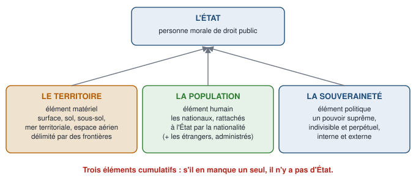
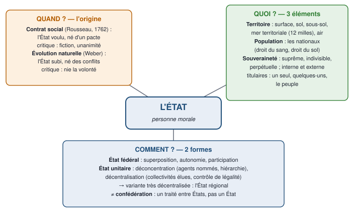

# 1 — Carte du chapitre

::: synthese Le chapitre en quelques lignes
Avant d'étudier comment le pouvoir politique est organisé — constitution, séparation des pouvoirs, Ve République —, le cours pose le **cadre** dans lequel il s'exerce : **l'État**. Le chapitre répond à trois questions, dans l'ordre du cours magistral :

1. **QUAND — d'où vient l'État ?** Deux théories : le **contrat social** (Rousseau) et l'**évolution naturelle** (Weber). Aucune ne l'emporte.
2. **QUOI — de quoi est-il fait ?** De **trois éléments cumulatifs** : un **territoire**, une **population**, la **souveraineté**. C'est une **personne morale**.
3. **COMMENT — comment s'organise-t-il ?** Sous **deux formes** : l'**État fédéral** et l'**État unitaire** — à ne pas confondre avec la **confédération**, qui n'est pas un État.
:::

**Ce qui tombe à l'examen** — le format de l'épreuve n'est pas encore connu (à demander en TD). Sur ce chapitre, les questions les plus probables : **définir** l'État, la souveraineté, la décentralisation, la déconcentration, l'État fédéral, la confédération ; **distinguer** État unitaire, État régional, État fédéral et confédération, ou déconcentration et décentralisation ; **présenter** les deux théories de l'origine de l'État, les trois caractères de la souveraineté, les trois principes du fédéralisme ; une **question de réflexion**, par exemple : « État unitaire et État fédéral : une différence de nature ou de degré ? ».

**Ce qu'il faut savoir par cœur**

| Quoi | Le contenu exact |
|---|---|
| La définition de l'État | Territoire + population + pouvoir politique souverain, **cumulatifs** ; une personne morale |
| Les deux théories de l'origine | **Contrat social** (Rousseau, *Du contrat social*, 1762) · **évolution naturelle** (Max Weber) — avec la critique de chacune |
| Les trois caractères de la souveraineté | **Suprême**, **indivisible**, **perpétuelle** (Bodin, 1576 : « absolue et perpétuelle ») · plan **interne** et plan **externe** |
| Les titulaires de la souveraineté | Un seul : **monarchie** · quelques-uns : **oligarchie** · le peuple : **démocratie** |
| Les trois principes du fédéralisme | **Superposition**, **autonomie**, **participation** |
| Les deux techniques de l'État unitaire | **Déconcentration** (agents de l'État, nommés, pouvoir hiérarchique) · **décentralisation** (collectivités élues, personnalité morale, contrôle de légalité) |
| Les chiffres | Mer territoriale : **12 milles** · ZEE : **jusqu'à 200 milles** · 1 mille marin = **1 852 m** |
| Les articles de la Constitution | **Art. 1er** (République indivisible, organisation décentralisée) · **art. 3** (souveraineté nationale, électeurs) · **art. 53 al. 3** (cession de territoire) · **art. 72 al. 3** (libre administration) · **art. 88-3** (vote des Européens aux municipales) |

# 2 — Le cours reconstruit

## 2.1 — Quand : qu'est-ce que l'État, et d'où vient-il ?

::: objectif À la fin de cette section, sans support, tu sais
- donner les trois sens du mot « État » et dire lequel est celui du cours ;
- réciter la définition de l'État et expliquer ce qu'est une personne morale ;
- exposer les deux théories de l'origine de l'État, avec leur auteur, leur mécanisme et leur critique.
:::

### Le mot « État » : trois sens, un seul pour ce cours

Le mot vient du latin *status*, « position, manière d'être », lui-même dérivé de *stare*, « se tenir debout ». Il a pris trois sens successifs :

| Sens | Ce que le mot désigne | Exemple |
|---|---|---|
| 1. Une **manière d'être** | La situation de quelqu'un ou de quelque chose | « être dans tous ses états » ; « l'état de mes finances » |
| 2. Un **groupe doté d'un statut juridique** | Sous l'Ancien Régime, chacun des trois ordres de la société | le clergé, la noblesse et le **tiers état**, réunis aux **États généraux** |
| 3. **L'État**, avec une majuscule | Le **pouvoir politique organisé** — le sens du cours | « chef de l'État », « représentant de l'État » |

Dans le troisième sens, le mot s'emploie encore de deux façons :

- **au sens large**, l'État est l'ensemble formé par ses trois éléments — un territoire, une population, un pouvoir : c'est la France, en tant qu'État ;
- **au sens étroit**, l'État n'est que le **pouvoir politique central** : on l'oppose alors aux **collectivités territoriales** (communes, départements, régions) ou à la **société civile** (particuliers, entreprises, associations) ; en diplomatie, on parle même du « Gouvernement français » pour désigner l'État.

::: piege Le même mot pour le tout et pour une partie
« L'État » désigne tantôt **l'ensemble** — territoire, population, pouvoir —, tantôt **un seul de ses éléments** — le pouvoir central. Dans une copie, précise le sens que tu emploies dès que la confusion est possible.
:::

### La définition de l'État

::: definition L'État
**En une phrase :** un pouvoir politique souverain qui s'exerce sur une population, à l'intérieur d'un territoire.

**Définition à connaître :** l'État est la réunion de **trois éléments cumulatifs** — un **territoire** délimité par des frontières, une **population** qui lui est rattachée par la nationalité, et un **pouvoir politique organisé qui s'exerce de façon souveraine** sur ce territoire et cette population. L'État est doté de la **personnalité morale**.
:::

**Cumulatifs** veut dire que les trois sont exigés en même temps : s'il en manque un seul, il n'y a pas d'État. Un peuple sans territoire n'est pas un État ; un territoire sans pouvoir souverain — une colonie, un protectorat — non plus.

::: examen Deux références qui font la différence
- La **théorie des trois éléments** est due au juriste allemand **Georg Jellinek** (*Théorie générale de l'État*, 1900).
- Le droit international reprend ces critères : selon la **convention de Montevideo** de **1933** (art. 1er), un État doit réunir une **population permanente**, un **territoire déterminé**, un **gouvernement** et la **capacité d'entrer en relations avec les autres États**.
:::

### L'État, personne morale

**Le problème à résoudre :** les gouvernants changent — élections, décès, révolutions. Il faut pourtant que l'État reste le même, tienne ses engagements et garde ses biens. La solution juridique : faire de l'État une **personne morale**.

::: definition Personne morale
**En une phrase :** un groupement que le droit traite comme une personne, distincte des individus qui le composent ou le dirigent.

**Définition à connaître :** une personne morale est une entité abstraite à laquelle le droit reconnaît une **existence juridique propre** : elle a des droits et des obligations, un patrimoine, peut contracter, agir en justice et voir sa responsabilité engagée. Il en existe en droit privé (sociétés, associations) et en droit public (l'**État**, les **collectivités territoriales**, les établissements publics).
:::

Ce que la personnalité morale explique :

1. **La continuité de l'État.** L'État est engagé par ses décisions — lois, traités, dettes, contrats — **quels que soient les gouvernants**. La formule de l'Ancien Régime le disait déjà : « **Le roi est mort, vive le roi !** » — le roi meurt, la royauté continue.
2. **Un patrimoine distinct de celui des gouvernants.** Les gouvernants ne sont pas **propriétaires** de leurs fonctions : ils en sont **titulaires**, pour un temps — appeler le président « le locataire de l'Élysée » est un abus de langage, mais l'idée est là. Dès **1566**, l'**édit de Moulins** pose l'**inaliénabilité du domaine de la Couronne** : les biens du royaume, utiles à tous, ne se confondent pas avec les biens privés du roi.
3. **La rupture avec la conception « patrimoniale »** héritée de la féodalité, où les fonctions publiques s'achetaient et se revendaient — la **vénalité des offices**. La conception moderne s'impose en **1789**.

::: marche L'État, comme une société anonyme
Le PDG change, la société demeure ; ses actifs ne sont pas ceux du PDG, et un contrat signé par l'ancien dirigeant engage toujours la société. Les gouvernants sont les dirigeants ; l'État est la société.
:::

### D'où vient l'État ? Deux explications philosophiques

L'État n'a pas toujours existé : des sociétés ont vécu sans lui, et sa forme moderne naît en Europe aux **XVIe et XVIIe siècles**. Il s'est depuis généralisé : l'ONU comptait **51** États membres à sa fondation, en 1945, et en compte **193** aujourd'hui — le dernier admis est le Soudan du Sud, en 2011. Pour expliquer l'apparition de l'État, le cours retient **deux théories principales**.

#### Théorie 1 — L'origine contractualiste : le pacte social

**L'idée :** des individus d'abord libres **décident** de s'associer. Par un **pacte** — un accord de volontés —, ils créent un pouvoir commun chargé de décider pour toute la collectivité, afin de **protéger les intérêts de chacun** : sa sécurité, ses biens, sa liberté. Chacun renonce à une part de sa liberté pour que le reste de ses libertés soit garanti. **L'État est voulu.**

**L'auteur à citer :** **Jean-Jacques Rousseau**, *Du contrat social* (**1762**). Le problème qu'il veut résoudre (livre I, chapitre 6) :

> « Trouver une forme d'association qui défende et protège de toute la force commune la personne et les biens de chaque associé, et par laquelle chacun s'unissant à tous n'obéisse pourtant qu'à lui-même et reste aussi libre qu'auparavant. »

**La critique (cours) :** ce contrat est **abstrait** — une fiction : aucun pacte réel n'a jamais été signé —, et il **suppose l'unanimité**, puisque chacun est censé l'avoir accepté ; or tout le monde ne sera jamais d'accord avec les mêmes règles.

::: examen Point bonus : les deux autres contractualistes
- **Thomas Hobbes**, *Léviathan* (**1651**) : pour sortir de l'état de nature, « guerre de tous contre tous », les individus abandonnent leurs droits à un souverain absolu.
- **John Locke**, *Second Traité du gouvernement civil* (**1690**) : les individus consentent à un gouvernement limité, chargé de protéger leur vie, leur liberté et leurs biens.
:::

#### Théorie 2 — L'évolution naturelle

**L'idée :** l'État n'est **pas décidé** ; il résulte d'une **lente évolution des sociétés**. De tout temps, les groupes humains se sont organisés, ont posé des règles et désigné des gouvernants, surtout pour **se protéger des menaces extérieures** — les guerres — et **maintenir la paix** en leur sein. L'État est le produit d'un long processus de **compétition** (les conflits armés), de **centralisation** (une force politique s'impose et accapare le pouvoir) et de **différenciation des fonctions sociales** (armée, justice, impôt, administration). **L'État est subi.**

**L'auteur à citer :** **Max Weber** (1864-1920), sociologue allemand, dont la définition de l'État est l'une des plus citées :

::: definition L'État selon Max Weber
L'État est une communauté humaine qui, dans les limites d'un territoire déterminé, revendique avec succès pour son propre compte le **« monopole de la violence physique légitime »** (*Le Savant et le Politique*, conférence de **1919**).
:::

**La critique (cours) :** cette théorie **nie les regroupements volontaires** — la culture, les origines, la volonté de vivre ensemble — et **met la guerre au premier plan**. Or, partout dans le monde, des peuples se battent pour ne pas être rattachés à d'autres et avoir leur propre État : l'**Ukraine**, les **Kurdes**, les conflits du **Moyen-Orient** (exemples donnés en cours).

| | Contrat social | Évolution naturelle |
|---|---|---|
| Auteur à citer | **Rousseau** (1762) — aussi Hobbes, Locke | **Max Weber** |
| L'État est… | **voulu** : né d'un pacte entre individus | **subi** : né de l'évolution et des conflits |
| Moteur | la volonté de protéger les intérêts de chacun | la compétition, la guerre, la centralisation |
| Critique | une fiction abstraite, qui suppose l'unanimité | nie la volonté de vivre ensemble, surestime la guerre |

::: examen La conclusion attendue
Les deux théories sont des **explications philosophiques** : **aucune des deux ne prime** (cours). Chacune éclaire une part de la réalité — la volonté des peuples d'un côté, le rôle de la force de l'autre.
:::

## 2.2 — Quoi : le territoire, la population, la souveraineté

::: objectif À la fin de cette section, sans support, tu sais
- décrire le territoire de l'État — terre, mer, air —, avec les chiffres 12, 200 et 1 852 ;
- définir la nationalité, le droit du sang, le droit du sol, l'apatridie, et distinguer nationalité, citoyenneté et nation ;
- définir la souveraineté, donner ses trois caractères, ses deux plans et ses trois titulaires possibles.
:::

### Le territoire, élément matériel

**À quoi il sert :** un pouvoir a besoin d'un espace où s'exercer. Le territoire fixe **où** s'appliquent les règles de l'État.

::: definition Territoire
**En une phrase :** l'espace qui « appartient » à l'État.

**Définition à connaître :** le territoire est la portion d'espace, **délimitée par des frontières**, sur laquelle l'État exerce sa souveraineté. Il comprend un espace **terrestre** — la surface, le sol et le sous-sol —, un espace **maritime** et un espace **aérien**.
:::

**L'espace maritime** est fixé par la **convention des Nations unies sur le droit de la mer**, dite de **Montego Bay** (**1982**) :

- la **mer territoriale**, jusqu'à **12 milles marins** des côtes : l'État y est **souverain** — eau, sol, sous-sol et air —, à une seule réserve : les navires étrangers y ont un **droit de passage inoffensif** ;
- la **zone économique exclusive (ZEE)**, **jusqu'à 200 milles** : l'État n'y a **pas la souveraineté**, seulement des **droits souverains économiques** — la pêche, l'exploitation du pétrole, du gaz et des autres ressources ; la navigation et le survol y restent libres pour tous ;
- au-delà de 200 milles, la **haute mer**, ouverte à tous les États, riverains ou non.

**L'espace aérien** est souverain **au-dessus du territoire terrestre et de la mer territoriale** (convention de **Chicago**, **1944**) : un avion — ou, exemple donné en cours, un **drone** — étranger qui le survole sans autorisation viole la souveraineté de l'État. Au-dessus de la ZEE et de la haute mer, le survol est libre. Plus haut, l'**espace extra-atmosphérique** échappe à toute souveraineté (traité de **1967**).

::: formule Convertir des milles marins en kilomètres
$$ \text{distance en km} = \text{distance en milles} \times 1,852 $$
Un **mille marin** mesure **1 852 mètres**, soit 1,852 km : on multiplie le nombre de milles par 1,852. Pour l'opération inverse, on divise les kilomètres par 1,852.
:::

::: exemple Les distances du droit de la mer, calculées
- **Mer territoriale** : 12 × 1,852 = **22,224 km**, soit environ **22 km**.
- **Limite de la ZEE** : 200 × 1,852 = **370,4 km**.
- **Largeur de la ZEE au-delà de la mer territoriale** : 200 − 12 = **188 milles**, soit 188 × 1,852 = **348,176 km**, environ **348 km**.
- **Vérification** : 22,224 + 348,176 = **370,4 km** — on retrouve bien la limite des 200 milles.
:::

::: piege 200 milles : un plafond, et pas de souveraineté
La ZEE s'étend « **jusqu'à** » 200 milles : c'est un **maximum**, pas une « étendue minimale » (erreur du polycopié). Et **la souveraineté s'arrête à 12 milles** : dans la ZEE, l'État n'a que des droits sur les ressources. De même, l'espace aérien souverain s'arrête au-dessus de la mer territoriale — pas au-dessus de la ZEE.
:::

**Quatre caractères du territoire, avec leurs exemples :**

| Caractère | Ce qu'il faut retenir | Exemples |
|---|---|---|
| **Pas de taille minimale** (cours) | Un micro-État est un État | **Monaco**, environ 2 km², plus petit État membre de l'ONU ; Saint-Marin ; le Liechtenstein ; le **Vatican**, 0,44 km², non membre de l'ONU — face à la Russie, au Canada, à la Chine |
| **Pas de continuité obligatoire** | Le territoire peut être morcelé | les archipels ; la **France** et ses outre-mer ; les **États-Unis**, avec l'Alaska et Hawaï. La discontinuité peut faire éclater l'État : les deux parties du **Pakistan**, distantes d'environ 1 600 km, se sont séparées en **1971** — naissance du **Bangladesh** |
| **Des enclaves possibles** | Un État, ou une partie d'État, peut être entouré par un autre | **Saint-Marin** et le **Vatican**, enclavés dans l'Italie ; **Kaliningrad**, territoire russe entre la Pologne et la Lituanie |
| **Des frontières en principe stables** | Beaucoup de constitutions interdisent de céder du territoire, source fréquente de guerres | La France l'admet sous condition : « Nulle cession, nul échange, nulle adjonction de territoire n'est valable sans le consentement des populations intéressées » (**art. 53 al. 3** de la Constitution) |

### La population, élément humain

**À quoi elle sert :** l'État gouverne des personnes. La population est le groupe humain sur lequel s'exerce son pouvoir, et dont il se réclame.

::: definition Population
**En une phrase :** les personnes rattachées à l'État.

**Définition à connaître :** la population de l'État est le groupe d'individus qui lui sont rattachés par un lien juridique, la **nationalité** : ses **nationaux**, qui forment le **peuple**. L'État gouverne aussi les **étrangers** présents sur son territoire : ce sont des **administrés**, pas des citoyens.
:::

**Pas de population minimale** (cours) : le Vatican compte moins de 1 000 habitants. **Les étrangers** ne font pas partie du peuple, mais l'État doit les administrer et leur reconnaît des droits : saisir un juge — par exemple si on leur refuse le statut de réfugié —, se faire soigner. L'État ne se confond donc ni avec la nation, ni même avec ses seuls nationaux.

#### La nationalité : chaque État fixe ses règles

::: definition Nationalité
**En une phrase :** le lien qui rattache une personne à un État.

**Définition à connaître :** la nationalité est le **lien juridique et politique** qui rattache une personne à un État déterminé, et dont découlent des droits et des obligations réciproques. **Chaque État est libre de définir les conditions d'attribution de sa nationalité** (cours).
:::

Deux critères, souvent combinés : le **droit du sang** (*jus sanguinis*) — l'enfant a la nationalité de ses parents, où qu'il naisse ; le **droit du sol** (*jus soli*) — l'enfant a la nationalité de l'État où il naît.

| État | Règle | À retenir |
|---|---|---|
| **France** | Les deux, combinés | **Droit du sang** : « Est français l'enfant dont l'un des parents au moins est français » (art. 18 du Code civil) · **double droit du sol** : est français l'enfant né en France d'un parent lui-même né en France (art. 19-3) · **droit du sol différé** : l'enfant né en France de parents étrangers devient français à sa majorité s'il y réside et y a résidé au moins cinq ans depuis l'âge de 11 ans (art. 21-7) |
| **États-Unis** | Avant tout le **droit du sol** | Toute personne née sur le sol américain est citoyenne (**14e amendement**, 1868). Un décret présidentiel de janvier 2025 visant à restreindre ce principe a été attaqué en justice : **vérifie où en est l'affaire avant de le citer** |
| **Japon** | Droit du sang, **pas de double nationalité** | La personne qui a deux nationalités doit en choisir une avant un âge fixé par la loi japonaise |

::: piege La « loterie » américaine ne donne pas la nationalité
Le tirage au sort des États-Unis (*Diversity Visa*) donne une **carte verte**, c'est-à-dire un droit de **résidence permanente** — pas la nationalité, qui ne s'obtient qu'ensuite, par naturalisation, en général après cinq ans de résidence. Et ne dis pas que les États-Unis appliquent « le droit du sang » comme règle de base : c'est le **droit du sol**.
:::

#### L'apatridie : ce que le droit international refuse

::: definition Apatride
**Définition à connaître :** un apatride est une personne « qu'aucun État ne considère comme son ressortissant par application de sa législation » (convention de New York de **1954**, art. 1er).
:::

Le droit international cherche à **éviter l'apatridie** — c'est le « **refus des apatrides** » du cours : « **Tout individu a droit à une nationalité** » (Déclaration universelle des droits de l'homme, **1948**, art. 15) ; les conventions de **1954** (statut des apatrides) et de **1961** (réduction des cas d'apatridie) l'organisent. Ces textes sont nés après la Seconde Guerre mondiale, en réaction aux déchéances massives de nationalité de l'entre-deux-guerres et de la guerre, notamment par le régime nazi. **Mais c'est un objectif, pas une réalité** : le Haut-Commissariat des Nations unies pour les réfugiés recense encore **plusieurs millions d'apatrides**.

#### Nationalité, citoyenneté, nation : trois notions à ne pas confondre

La **citoyenneté** est le **droit de participer à la vie politique** : voter, être élu. En principe, elle découle de la nationalité : « Sont électeurs […] tous les **nationaux** français majeurs des deux sexes, jouissant de leurs droits civils et politiques » (**art. 3** de la Constitution). **Exception** : depuis la révision de **1992** (traité de Maastricht), l'**art. 88-3** permet aux **citoyens de l'Union européenne** résidant en France de voter et d'être élus aux **élections municipales** — sans pouvoir devenir maire ou adjoint, ni participer à l'élection des sénateurs.

La **nation**, elle, est une notion politique et affective, pas un lien juridique :

::: definition Nation
**Définition à connaître :** la nation est un groupement humain dont les membres se sentent unis par des **liens à la fois matériels et spirituels**, et se conçoivent comme **différents** des membres des autres groupements nationaux.
:::

| | Conception **allemande** | Conception **française** |
|---|---|---|
| Nature | **Objective** : la nation résulte de données qui s'imposent aux individus | **Subjective** : la nation repose sur une **volonté** |
| Critères | la langue, la géographie (« frontières naturelles »), la religion, voire la « race » | la **volonté de vivre ensemble**, les souvenirs communs, les symboles partagés (fête nationale, hymne) |
| Auteurs, formules | — | **Ernest Renan**, *Qu'est-ce qu'une nation ?* (**1882**) : « **le désir de vivre ensemble** », « **un plébiscite de tous les jours** » ; aussi Fustel de Coulanges |
| Dérive | poussée à l'extrême, elle confond nation et « race » : le IIIe Reich ; la « purification ethnique » dans l'ex-Yougoslavie des années 1990 | — |

**Nation et État ne coïncident pas toujours :**

- En Europe, la **nation a souvent précédé l'État** : l'État italien (1861) et l'État allemand (1871) ont donné une forme politique à des nations existantes. En **France**, on dit au contraire que **l'État a précédé la nation** : il l'a forgée, autour des rois puis de la République.
- Le **principe des nationalités** — toute nation a droit à un État — naît avec la Révolution française, est combattu par les vainqueurs de Napoléon en 1815, puis inspire la nouvelle carte de l'Europe en 1919. Il devient le **droit des peuples à disposer d'eux-mêmes** : **Charte des Nations unies** (**1945**, art. 1er § 2), **Préambule de la Constitution de 1958** (alinéa 2, « libre détermination des peuples ») — le moteur de la **décolonisation**.
- **Une nation sur plusieurs États** : l'Allemagne partagée entre la RFA et la RDA de **1949 à 1990** ; les deux Corées ; les **Kurdes**, entre la Turquie, l'Irak, l'Iran et la Syrie.
- **Un État pour plusieurs nations** — un État multinational : l'Autriche-Hongrie jusqu'en 1918, l'URSS jusqu'en **décembre 1991**, la **Tchécoslovaquie** jusqu'au **31 décembre 1992** ; aujourd'hui, de façon moins radicale, la Belgique et le Canada.

### La souveraineté, élément politique

**Le problème qu'elle résout :** une commune, une entreprise, une association exercent aussi un pouvoir. Ce qui distingue l'État, c'est que son pouvoir est **souverain** : il n'y a **aucun pouvoir au-dessus de lui**.

::: definition Souveraineté
**En une phrase :** le pouvoir suprême de l'État, qui ne dépend d'aucun autre.

**Définition à connaître :** la souveraineté est le **pouvoir suprême de l'État** : un pouvoir spécifique, distinct de toutes les autres formes de pouvoir, qui donne naissance à une organisation juridique et politique dotée de la **contrainte**. Jean **Bodin**, qui l'a théorisée dans *Les Six Livres de la République* (**1576**), la définit comme « **la puissance absolue et perpétuelle d'une République** ».
:::

Bodin écrivait pour affirmer l'indépendance du roi de France face au pape et à l'empereur : l'État souverain n'a de compte à rendre à aucun autre pouvoir. Il énumère les « **marques de souveraineté** », les fonctions que seul l'État détient : **faire la loi, rendre la justice, battre monnaie, lever une armée** — les fonctions dites **régaliennes**.

**Ses trois caractères (cours) :**

| Caractère | Ce qu'il signifie |
|---|---|
| **Suprême** — Bodin dit « **absolue** » | L'État n'est soumis à **aucun pouvoir supérieur** : il n'a d'ordre à recevoir de personne |
| **Indivisible** | La souveraineté **ne se partage pas** : « Aucune section du peuple ni aucun individu ne peut s'en attribuer l'exercice » (art. 3 de la Constitution) |
| **Perpétuelle** | **L'écoulement du temps ne l'affecte pas** : les gouvernants passent, la souveraineté de l'État demeure |

**Ses deux plans (cours) :**

- **sur le plan interne** — la souveraineté *dans* l'État : le pouvoir de **fixer les règles de droit** — la Constitution, les lois — et d'**obliger à les respecter** par la contrainte. D'où la formule de **Weber** : l'État a le **monopole de la violence physique légitime** ; nul ne peut se faire justice à soi-même — même pour faire exécuter un contrat, on s'adresse au juge de l'État. Le juriste **Jellinek** parle de « **compétence de la compétence** » : l'État souverain fixe lui-même l'étendue de ses propres compétences ;
- **sur le plan externe** — la souveraineté *de* l'État : son **indépendance**. Chaque État étant souverain, **un État ne peut rien imposer à un autre** : c'est l'**égalité souveraine** des États (Charte des Nations unies, art. 2 § 1). Un État peut toutefois **accepter volontairement** des obligations, par un traité ou une convention internationale — par exemple en adhérant à l'**Union européenne** et à sa monnaie commune. Ces limitations **librement consenties** ne suppriment pas sa souveraineté, à la différence d'un protectorat de l'époque coloniale, imposé de l'extérieur.

**Ses titulaires (cours) :** qui détient la souveraineté ? Cela dépend des États.

| Titulaire | Régime | Le mot grec |
|---|---|---|
| **Une seule personne** | **Monarchie** | *monos*, « un seul » + *arkhein*, « commander » |
| **Un petit groupe** | **Oligarchie** | *oligoi*, « peu nombreux » + *arkhein* |
| **Le peuple** | **Démocratie** | *dêmos*, « peuple » + *kratos*, « pouvoir » |

En France, « La souveraineté nationale appartient au peuple qui l'exerce par ses représentants et par la voie du référendum » (**art. 3**) : c'est une **démocratie**.

::: piege « L'État n'obéit à aucune règle » : faux
Souverain ne veut pas dire hors du droit. L'État n'est soumis à **aucun pouvoir supérieur**, mais il est lié par les engagements qu'il a acceptés — les traités — et, dans un **État de droit**, par ses propres règles.
:::

**Comment un État souverain peut-il être soumis au droit, puisque c'est lui qui le crée ?** Trois réponses :

1. le **droit naturel** : il existerait un droit supérieur, fondé sur la raison, qui s'impose à tout État — c'est le mythe d'**Antigone**, qui désobéit à la loi du roi au nom de lois non écrites ;
2. l'**autolimitation**, théorie des juristes allemands Jhering et Jellinek : l'État accepte de se lier lui-même, selon l'adage « *patere legem quam ipse fecisti* » — « subis la loi que tu as toi-même faite » ;
3. l'**État de droit** (de l'allemand *Rechtsstaat*) : l'État est lui-même **soumis au droit**, sous le contrôle de juges — une conquête récente, fragile et loin d'être universelle.

Enfin, un pouvoir de contrainte doit être **accepté** par les gouvernés : c'est sa **légitimité** — la croyance dans son droit à commander —, distincte de sa **légalité** — sa conformité aux règles. Le régime de **Vichy** (1940-1944), issu du vote des pleins pouvoirs du 10 juillet 1940, a illustré le divorce entre les deux ; l'**ordonnance du 9 août 1944** a rétabli la légalité républicaine.

::: examen Point bonus : les trois types de légitimité selon Weber
**Traditionnelle** (on obéit parce qu'on a toujours obéi : le monarque héréditaire), **charismatique** (on obéit à un chef pour ses qualités exceptionnelles), **légale-rationnelle** (on obéit à des règles impersonnelles : l'État moderne).
:::

## 2.3 — Comment : l'État fédéral, l'État unitaire et la confédération

::: objectif À la fin de cette section, sans support, tu sais
- définir l'État fédéral, en donner des exemples et expliquer ses trois principes ;
- distinguer l'État fédéral de la confédération ;
- définir l'État unitaire, distinguer déconcentration et décentralisation, et situer l'État régional.
:::

« Il existe autant d'organisations que d'États » (cours), mais **deux grandes formes se dégagent** : l'**État fédéral** et l'**État unitaire**. Une troisième figure, la **confédération**, n'est pas un État : c'est une association d'États.

### L'État fédéral

::: definition État fédéral
**En une phrase :** un État composé d'États.

**Définition à connaître :** l'État fédéral est une **union d'États** — les **États fédérés** — au-dessus desquels une **Constitution** crée un **nouvel État**, l'État fédéral, qui les **englobe sans les absorber**. Seul l'État fédéral est souverain sur le plan international.
:::

**Exemples, et le nom des entités fédérées :**

| État fédéral | Entités fédérées |
|---|---|
| **États-Unis** | 50 **États** (*States*) |
| **Allemagne** | 16 **Länder** |
| **Suisse** | 26 **cantons** |
| **Canada** | 10 **provinces** et 3 territoires |
| **Autriche** | 9 **Länder** |
| **Belgique** | **régions** et **communautés** |
| **Australie**, **Inde** | **États** |

Le mot « État » désigne ainsi deux réalités, source de confusions : aux États-Unis, *State* désigne l'État fédéré, et la fédération s'appelle « les États-Unis ». Leur devise traditionnelle, *E pluribus unum* — littéralement « **de plusieurs, un** » —, résume l'idée fédérale.

**Les trois principes du fédéralisme (cours) :**

1. **La superposition** — deux étages d'États coexistent : l'État fédéral et les États fédérés, chacun avec sa **Constitution**, son **parlement**, son **gouvernement** et ses **tribunaux**. Chaque citoyen est à la fois citoyen de l'État fédéral et de son État fédéré. Aux États-Unis, le **gouverneur** élu de chaque État est l'équivalent local du président ; en Allemagne, le **ministre-président** de chaque Land, l'équivalent du chancelier.
2. **L'autonomie** — chaque étage exerce **librement** les compétences que lui attribue la Constitution fédérale. En général, l'État fédéral reçoit des **compétences d'attribution**, énumérées et interprétées strictement — relations extérieures, défense, monnaie, nationalité — ; les États fédérés gardent la **compétence de droit commun** : tout ce qui n'a pas été confié au fédéral (États-Unis : **10e amendement** ; Suisse : **art. 3** de la Constitution). Le **Canada** fait l'inverse : la compétence de droit commun y appartient au **Parlement fédéral**, les provinces n'ayant que des compétences énumérées (Loi constitutionnelle de **1867**). Conséquence (cours) : **la loi varie d'un État fédéré à l'autre** — divorcer est plus facile au Nevada qu'ailleurs, la peine de mort n'est pas appliquée partout, et depuis l'arrêt *Dobbs* de la Cour suprême (**2022**), chaque État américain fixe ses propres règles sur l'avortement. Une **juridiction constitutionnelle** arbitre les conflits de compétences : la Cour suprême des États-Unis, la Cour constitutionnelle fédérale allemande.
3. **La participation** — les États fédérés **participent** aux décisions de l'État fédéral, ce qui est logique puisqu'il est né de leur accord :
   - par une **seconde chambre** qui les représente, à côté d'une chambre qui représente la population : le **Sénat** américain — **2 sénateurs par État**, 100 au total, quelle que soit la population : représentation **égalitaire** ; le **Bundesrat** allemand, formé de membres des gouvernements des Länder, qui disposent de **3 à 6 voix** selon leur population : représentation **pondérée** (art. 51 de la Loi fondamentale) ; le **Conseil des États** suisse, presque égalitaire — deux sièges par canton, un seul pour chacun des six anciens demi-cantons, soit 20 × 2 + 6 × 1 = **46** sièges ;
   - par l'**élection de l'exécutif fédéral** : le président des États-Unis n'est pas élu au suffrage universel direct, mais par **538 grands électeurs** désignés **État par État** ; il lui en faut au moins **270**. Il peut donc être élu avec moins de voix que son adversaire à l'échelle du pays (cours) — ce fut le cas en **2000** et en **2016** ;
   - par la **révision de la Constitution fédérale**, qui exige l'accord des États : aux États-Unis, un amendement doit être voté aux **deux tiers** de chaque chambre du Congrès, puis ratifié par les **trois quarts des États**, soit **38 sur 50**.

::: exemple Deux chiffres recalculés
- **Majorité des grands électeurs** : 538 = 435 représentants + 100 sénateurs + 3 électeurs du district de Columbia. La majorité absolue est la moitié plus un : 538 ÷ 2 = 269, donc **270**.
- **Trois quarts des États** : 50 × 3 ÷ 4 = 37,5 ; il faut un nombre entier d'États au moins égal à 37,5, soit **38**.
:::

::: examen Trois principes, pas deux
Le polycopié n'en retient que deux — autonomie et participation, systématisés par le juriste Georges Scelle. Le cours en retient **trois** : **superposition, autonomie, participation**. C'est la présentation à donner.
:::

::: piege Trois erreurs du polycopié à ne pas reproduire
- Au **Canada**, ce ne sont pas les provinces qui ont la compétence résiduelle : c'est le **Parlement fédéral**.
- La composition du **Bundesrat** est fixée par l'**article 51** de la **Loi fondamentale** allemande — sa Constitution de 1949 —, non par l'« article 50 de la Loi fédérale » ; l'article 50 dit à quoi il sert : faire participer les Länder à la législation et à l'administration de la Fédération.
- *E pluribus unum* ne veut pas dire « unité dans la diversité » — « Unie dans la diversité » est la devise de l'**Union européenne** — mais « **de plusieurs, un** ».
:::

### La confédération : une association d'États, pas un État

::: definition Confédération
**En une phrase :** une alliance d'États souverains, fondée sur un traité.

**Définition à connaître :** la confédération est une **association d'États souverains**, créée par un **traité international**, qui confient à un **organe commun** — composé de représentants des États — l'exercice de certaines compétences, le plus souvent la diplomatie et la défense. Chaque État membre **conserve sa souveraineté** et son existence internationale.
:::

Ses traits : des décisions prises en principe à l'**unanimité** ; des décisions **non directement applicables** — chaque État doit les ratifier ou les appliquer lui-même ; un **droit de retrait** — un membre peut quitter la confédération. Dans un État fédéral, au contraire, la sécession est refusée : c'était l'enjeu de la **guerre de Sécession** américaine (**1861-1865**).

Exemples historiques : les **États-Unis**, régis par les Articles de la Confédération — adoptés en 1777, en vigueur de **1781** à **1789** —, jusqu'à l'entrée en vigueur de la Constitution fédérale rédigée en **1787** ; la **Suisse**, confédération jusqu'en **1848**, devenue un État fédéral tout en gardant le nom de « Confédération suisse » ; la **Confédération germanique** (**1815-1866**). D'où la formule : « **la fédération est une confédération qui a réussi** ».

| Critère | Confédération | État fédéral |
|---|---|---|
| Acte fondateur | un **traité** (droit international) | une **Constitution** (droit interne) |
| État nouveau ? | **non** : des États souverains associés | **oui** : un État au-dessus des États fédérés |
| Souveraineté internationale | chaque État membre la garde | seul l'État fédéral l'a |
| Décisions | unanimité ; appliquées par chaque État | majorité ; applicables directement aux citoyens |
| Retrait | **possible** | **impossible** (guerre de Sécession) |

::: examen L'Union européenne : une confédération ?
Elle en est **proche** : elle repose sur des **traités** — Rome (1957), Maastricht (1992), Lisbonne (2007) — et prévoit un **droit de retrait** (art. 50 du traité sur l'Union européenne), utilisé par le Royaume-Uni : le **Brexit**, effectif le **31 janvier 2020**. Mais elle a des traits **fédéraux** : son droit **prime** sur les lois nationales et s'applique **directement**, sans ratification. Jacques Delors la qualifiait d'« **objet politique non identifié** ».
:::

### L'État unitaire

::: definition État unitaire
**En une phrase :** un État avec un seul centre de pouvoir politique.

**Définition à connaître :** l'État unitaire ne comporte qu'**une seule organisation juridique et politique** sur tout son territoire — « **l'appareil d'État** » —, qui détient l'**ensemble des compétences**, sans concurrence d'aucune autre structure. Conséquence : **la même loi s'applique sur l'ensemble du territoire**.
:::

Exemples : la **France** — « La France est une République **indivisible** » (art. 1er de la Constitution) ; déjà en 1791, « Le Royaume est un et indivisible » —, le Royaume-Uni, le Portugal, la Pologne, la Chine, l'Algérie. **Cette unité connaît des nuances** : le **droit local d'Alsace-Moselle** (loi du 1er juin 1924) garde des règles héritées du droit allemand ; outre-mer, la loi peut être adaptée (art. 73) ou remplacée par un statut propre (art. 74 pour les collectivités d'outre-mer, titre XIII pour la Nouvelle-Calédonie).

**Le problème (cours) :** un pouvoir unique a du mal à **prendre en compte la diversité des territoires**. La centralisation totale n'est réaliste que dans un micro-État — « Paris et le désert français », écrivait le géographe **Jean-François Gravier** en 1947. **Deux techniques** atténuent cette concentration du pouvoir.

#### La déconcentration

::: definition Déconcentration
**En une phrase :** l'État confie du pouvoir de décision à ses propres agents, installés sur le territoire.

**Définition à connaître :** la déconcentration consiste, pour l'État, à confier des **pouvoirs de décision** à des **agents qu'il nomme** et qui le représentent dans des **circonscriptions administratives** (région, département, arrondissement) ; ces agents restent soumis au **pouvoir hiérarchique** du pouvoir central.
:::

- **Qui ?** Le **préfet** — « le représentant de l'État dans le département » (cours), créé par la loi du **28 pluviôse an VIII** (17 février 1800) —, le préfet de région, le **recteur** d'académie, les directeurs des services de l'État ; le **maire** aussi, lorsqu'il agit au nom de l'État (l'état civil, par exemple).
- **Le pouvoir hiérarchique** : le supérieur peut donner des **ordres** à l'agent, **annuler ou réformer** ses décisions, le **nommer, le muter ou le révoquer**.
- **La formule à citer** (Odilon Barrot, homme politique du XIXe siècle) : « **C'est toujours le même marteau qui frappe, mais on en a raccourci le manche.** » Le pouvoir reste celui de l'État ; il est seulement exercé plus près du terrain.

#### La décentralisation

::: definition Décentralisation
**En une phrase :** l'État transfère des compétences à des collectivités élues, qui les exercent elles-mêmes.

**Définition à connaître :** la décentralisation consiste, pour l'État, à **transférer des compétences** à des **collectivités territoriales** distinctes de lui, dotées de la **personnalité morale** et administrées par des **conseils élus** ; elles s'administrent librement « **dans les conditions prévues par la loi** » (art. 72 al. 3 de la Constitution), sous un simple **contrôle de légalité** exercé par le représentant de l'État.
:::

- **Qui ?** Les **communes** (l'urbanisme, les écoles), les **départements** (l'**action sociale** — exemple du cours), les **régions** (le développement économique, les lycées, les transports régionaux).
- **Autonomie, pas indépendance** : les collectivités **ne font pas la loi** — elles n'ont qu'un pouvoir réglementaire, pour appliquer les lois — et n'ont pas la « compétence de leur compétence » : c'est la loi qui fixe ce qu'elles peuvent faire. Le **préfet** contrôle la **légalité** de leurs actes (art. 72 al. 6). Depuis la loi du **2 mars 1982**, ce contrôle ne se fait plus a priori — c'était la « tutelle » : le préfet ne peut plus annuler lui-même un acte, il doit saisir le **juge administratif** (le « déféré préfectoral »).
- **Les grandes étapes** : **acte I** (lois Defferre, à partir de **1982**) ; **acte II** — la révision constitutionnelle du **28 mars 2003** inscrit à l'article 1er que l'organisation de la République « **est décentralisée** » ; les réformes des années 2010, présentées comme un acte III.

| | Déconcentration | Décentralisation |
|---|---|---|
| Qui reçoit le pouvoir ? | un **agent de l'État** : préfet, recteur | une **collectivité territoriale** : commune, département, région |
| Personnalité morale | **non** : c'est toujours l'État qui agit | **oui** : une personne morale distincte de l'État |
| Désignation | **nommé** par l'État | **élu** par les habitants |
| Contrôle | **pouvoir hiérarchique** : ordres, annulation, réformation | **contrôle de légalité** : conformité au droit seulement, sanctionnée par le juge |
| La formule | « le même marteau, le manche raccourci » | « autonomie, pas indépendance » |

::: marche Succursale ou filiale
La **déconcentration**, c'est une banque qui ouvre des **succursales** : le directeur d'agence est un salarié, nommé et dirigé par le siège, et l'agence n'a pas de personnalité juridique propre. La **décentralisation** ressemble plutôt à des **filiales** : chacune est une société distincte, dotée de la personnalité juridique et de ses propres organes, qui décide elle-même dans le cadre de ses statuts.
:::

::: piege Les mêmes noms pour deux choses
Le **département** et la **région** sont à la fois des **circonscriptions administratives de l'État** — dirigées par un préfet nommé : déconcentration — et des **collectivités territoriales** — administrées par un conseil élu : décentralisation. La **commune** aussi : le maire y agit tantôt comme autorité décentralisée, tantôt comme agent de l'État. C'est une difficulté propre à l'organisation française : demande-toi toujours quelle autorité agit, et au nom de qui.
:::

#### Une variante : l'État régional

Certains États unitaires sont allés si loin dans la décentralisation qu'ils forment une variante (cours) : l'**État régional**.

::: definition État régional
**Définition à connaître :** l'État régional est un **État unitaire** très décentralisé, dans lequel la **Constitution** reconnaît aux régions une large autonomie, **y compris un pouvoir législatif** dans certaines matières. Exemples : l'**Italie** (Constitution de 1947) et l'**Espagne** (Constitution de 1978, qui institue des « communautés autonomes »).
:::

**Il reste un État unitaire** : le principe d'unité — un seul appareil d'État — est conservé (cours). Les régions ne sont pas des États : elles n'ont ni souveraineté ni constitution propre, et la Constitution nationale peut être révisée sans leur accord.

::: examen Nature ou degré ? La question de réflexion classique
Entre toutes ces formes, les différences sont souvent de **degré** — plus ou moins d'autonomie locale — plutôt que de **nature** (le polycopié le souligne). Une différence de nature demeure pourtant : dans l'État fédéral, les entités sont des **États**, avec leur constitution, associés à la révision de la Constitution fédérale ; dans l'État régional, elles restent des collectivités d'un État unique. Le sujet est traité au niveau 4.
:::

# 3 — Pièges et points bonus

## Les confusions qui coûtent des points

| Ne confonds pas… | Ce qui est juste |
|---|---|
| **Confédération** et **État fédéral** | Traité, États souverains, retrait possible **contre** Constitution, État nouveau, sécession interdite |
| **Déconcentration** et **décentralisation** | Agent de l'État nommé, pouvoir hiérarchique **contre** collectivité élue, personnalité morale, contrôle de légalité |
| **État régional** et **État fédéral** | L'État régional reste **unitaire** : ses régions n'ont ni souveraineté ni constitution propre |
| **Nationalité**, **citoyenneté** et **nation** | Lien juridique avec l'État · droit de vote et d'éligibilité · sentiment d'appartenance |
| **Souveraineté** et **autonomie** | Aucun pouvoir au-dessus (l'État) **contre** liberté d'action dans le cadre fixé par un autre (collectivités, États fédérés) |
| **Mer territoriale** et **ZEE** | 12 milles, souveraineté **contre** jusqu'à 200 milles, droits économiques seulement |
| **Population** et **nationaux** | Le peuple constitutif, ce sont les nationaux ; les étrangers présents sont des administrés |
| **Légalité** et **légitimité** | Conformité aux règles **contre** acceptation par les gouvernés |
| **Suisse** et confédération | La Suisse est un **État fédéral** depuis 1848, malgré son nom de « Confédération suisse » |
| **Les deux « État »** | L'État fédéral et les États fédérés ; l'État au sens large et l'État au sens étroit |

## Si tu lis autre chose ailleurs : les erreurs des sources, corrigées

| On lit parfois… | Ce qui est exact |
|---|---|
| La Tchécoslovaquie, État multinational « jusqu'en 1991 » | Dissoute le **31 décembre 1992** ; c'est l'URSS qui disparaît en décembre 1991 |
| L'Allemagne partagée entre deux États « de 1945 à 1990 » | Deux États de **1949** à **1990** ; de 1945 à 1949, occupation en quatre zones |
| 200 milles, « étendue minimale » de la souveraineté maritime | Un **plafond**, et seulement pour des droits économiques : la souveraineté s'arrête à 12 milles |
| L'espace aérien « au-dessus de l'espace maritime » | Au-dessus de la **mer territoriale** seulement |
| Au Canada, les provinces ont « les compétences résiduelles » | La compétence résiduelle appartient au **Parlement fédéral** |
| Le Bundesrat, « article 50 de la Loi fédérale » | **Article 51** de la **Loi fondamentale** |
| La **C.E.I.**, « Confédération des États indépendants » | **Communauté** des États indépendants (1991) |
| *E pluribus unum*, « unité dans la diversité » | « **De plusieurs, un** » |
| Monaco, « 2,5 km² » | Environ **2 km²** |
| Rousseau : « chacun s'unissant à tous, n'obéissant pourtant qu'à lui-même » | « … **n'obéisse** pourtant qu'à lui-même » |
| Les trois éléments de l'État : « le territoire, la population et une Constitution » | Le troisième est la **souveraineté** — le pouvoir politique organisé |
| Les États-Unis appliquent « le droit du sang » | Leur règle de base est le **droit du sol** (14e amendement) |
| La loterie américaine donne « la nationalité » | Elle donne une **carte verte** (résidence) |
| Les collectivités exercent leurs compétences « en toute liberté » | « **Dans les conditions prévues par la loi** », sous contrôle de légalité |
| « L'État n'obéit à aucune règle » | Il n'a **aucun pouvoir au-dessus de lui**, mais il est lié par ses engagements et, dans un État de droit, par son droit |
| « Chaque individu est forcément rattaché à un État » | C'est un **droit** (DUDH, art. 15), pas une réalité : il existe **plusieurs millions d'apatrides** |
| Le Haut-Karabagh « réclame son rattachement à l'Arménie » | **Exemple dépassé** : la république autoproclamée a été dissoute après l'offensive azerbaïdjanaise de septembre 2023 |

## Ce que les correcteurs récompensent

- **Des définitions exactes**, données avant d'argumenter : État, souveraineté, décentralisation — celles des encadrés.
- **Les articles de la Constitution**, cités avec leur numéro : art. 1er, 3, 53 al. 3, 72 al. 3, 88-3.
- **Des auteurs datés** : Bodin (1576), Hobbes (1651), Locke (1690), Rousseau (1762), Renan (1882), Jellinek (1900), Weber (1919).
- **Des exemples précis et justes** : Monaco, le Pakistan de 1971, les Kurdes, le Bundesrat, les 538 grands électeurs, le Brexit.
- **La nuance** : la souveraineté limitée par des engagements librement consentis ; la différence de degré plutôt que de nature entre les formes d'État ; les exceptions à l'unité de la loi (Alsace-Moselle, outre-mer).
- **Les références qui font la différence** : la convention de Montevideo (1933) ; la définition de Weber ; « la fédération est une confédération qui a réussi » ; « un objet politique non identifié » ; la formule d'Odilon Barrot ; « Le roi est mort, vive le roi ! ».

# 4 — Ancrage mémoriel

## 4.1 — Fiche de synthèse

| | L'essentiel à savoir par cœur |
|---|---|
| **Définition** | Territoire + population + souveraineté, **cumulatifs** (Jellinek ; Montevideo, 1933) · une **personne morale** : continuité (« Le roi est mort, vive le roi ! »), patrimoine distinct (édit de Moulins, 1566) |
| **QUAND** | **Contrat social** — Rousseau, 1762 (aussi Hobbes 1651, Locke 1690) : l'État **voulu** ; critique : fiction, unanimité · **Évolution naturelle** — Weber : l'État **subi** (compétition, centralisation, différenciation) ; critique : nie la volonté de vivre ensemble · **aucune ne prime** |
| **Territoire** | Surface, sol, sous-sol · mer territoriale **12 milles** : souveraineté, passage inoffensif · ZEE **jusqu'à 200 milles** : droits économiques · air au-dessus de la terre et de la mer territoriale (drones) · 1 mille = **1 852 m** · ni taille minimale (Monaco) ni continuité (Pakistan, 1971) · **art. 53 al. 3** |
| **Population** | Les **nationaux** ; les étrangers = administrés · nationalité fixée librement par chaque État : **droit du sang**, **droit du sol** (France : les deux ; États-Unis : sol ; Japon : pas de double nationalité) · apatridie refusée (DUDH art. 15 ; 1954, 1961) · citoyenneté : **art. 3**, exception **art. 88-3** · nation : allemande **objective**, française **subjective** (Renan, 1882 : « plébiscite de tous les jours ») |
| **Souveraineté** | Pouvoir suprême (Bodin, 1576 : « absolue et perpétuelle ») · **Suprême, Indivisible, Perpétuelle** · **interne** : faire et imposer le droit (Weber : monopole de la violence physique légitime ; Jellinek : compétence de la compétence) · **externe** : indépendance, égalité ; limites librement consenties (UE) · titulaires : **monarchie, oligarchie, démocratie** |
| **État fédéral** | Un État d'États, créé par une **Constitution** · **Superposition, Autonomie, Participation** · Sénat américain (2 par État), Bundesrat (3 à 6 voix), 538 grands électeurs (270), révision : 2/3 + 3/4 des États (38) |
| **Confédération** | Un **traité** entre États souverains · unanimité · retrait possible · Suisse avant 1848 · l'UE en est proche (art. 50, Brexit) mais son droit prime et s'applique directement |
| **État unitaire** | Un seul appareil d'État, la même loi partout (**art. 1er** : indivisible) · **déconcentration** : agents nommés, pouvoir hiérarchique (préfets, 1800 ; Barrot) · **décentralisation** : collectivités élues, personnalité morale, **art. 72 al. 3**, contrôle de légalité (1982), acte II (2003) · **État régional** (Italie, Espagne) : reste unitaire |

## 4.2 — Cartes de révision

::: carte
Quelle est la définition de l'État ?
--
La réunion de trois éléments **cumulatifs** : un **territoire** délimité par des frontières, une **population** rattachée par la nationalité, un **pouvoir politique organisé** qui s'exerce de façon **souveraine**. L'État est une **personne morale**.
:::

::: carte
Que signifie « cumulatifs », pour les trois éléments de l'État ?
--
Les trois sont exigés ensemble : s'il en manque un seul, il n'y a pas d'État.
:::

::: carte
Quels sont les trois sens du mot « État » ?
--
1. Une manière d'être.
2. Un groupe doté d'un statut juridique (les trois états de l'Ancien Régime).
3. L'État, pouvoir politique organisé — le sens du cours.
:::

::: carte
L'État au sens large, l'État au sens étroit ?
--
**Large** : l'ensemble territoire + population + pouvoir. **Étroit** : le seul pouvoir politique central, opposé aux collectivités territoriales ou à la société civile.
:::

::: carte
Qui a formulé la théorie des trois éléments de l'État ? Quel texte international la reprend ?
--
**Georg Jellinek** (1900). La **convention de Montevideo** (1933) : population permanente, territoire déterminé, gouvernement, capacité d'entrer en relations avec les autres États.
:::

::: carte
Qu'est-ce qu'une personne morale ?
--
Une entité abstraite à laquelle le droit reconnaît une **existence juridique propre** — droits, obligations, patrimoine, capacité de contracter et d'agir en justice —, distincte de ses membres et de ses dirigeants.
:::

::: carte
Qu'explique la personnalité morale de l'État ?
--
Sa **continuité** : il est engagé quels que soient les gouvernants (« Le roi est mort, vive le roi ! »). Et la séparation de **son patrimoine** et de celui des gouvernants (édit de Moulins, 1566).
:::

::: carte
Qu'a posé l'édit de Moulins de 1566 ?
--
L'**inaliénabilité du domaine de la Couronne** : les biens du royaume ne se confondent pas avec les biens privés du roi.
:::

::: carte
La théorie contractualiste de l'origine de l'État : l'idée et l'auteur ?
--
Des individus **décident**, par un pacte, de créer un pouvoir commun qui protège les intérêts de chacun : l'État est **voulu**. **Rousseau**, *Du contrat social* (1762) — aussi Hobbes (1651) et Locke (1690).
:::

::: carte
La phrase exacte de Rousseau sur le contrat social (livre I, chapitre 6) ?
--
« Trouver une forme d'association qui défende et protège de toute la force commune la personne et les biens de chaque associé, et par laquelle chacun s'unissant à tous **n'obéisse** pourtant qu'à lui-même et reste aussi libre qu'auparavant. »
:::

::: carte
Les deux critiques de la théorie du contrat social ?
--
Le contrat est **abstrait** — une fiction, jamais signé — et il **suppose l'unanimité**.
:::

::: carte
La théorie de l'évolution naturelle : l'idée et l'auteur ?
--
L'État n'est pas décidé : il résulte d'une lente évolution des sociétés — **compétition** (guerres), **centralisation**, **différenciation des fonctions**. L'État est **subi**. **Max Weber**.
:::

::: carte
La critique de la théorie de l'évolution naturelle ?
--
Elle **nie les regroupements volontaires** — culture, origines, volonté de vivre ensemble — et **met la guerre au premier plan** ; or des peuples se battent pour avoir leur État : l'Ukraine, les Kurdes.
:::

::: carte
Laquelle des deux théories de l'origine de l'État l'emporte ?
--
**Aucune** : ce sont deux explications philosophiques.
:::

::: carte
La définition de l'État selon Max Weber ?
--
Une communauté humaine qui, sur un territoire déterminé, revendique avec succès le **monopole de la violence physique légitime** (*Le Savant et le Politique*, 1919).
:::

::: carte
La définition du territoire ?
--
La portion d'espace, **délimitée par des frontières**, sur laquelle l'État exerce sa souveraineté : espace **terrestre** (surface, sol, sous-sol), **maritime** et **aérien**.
:::

::: carte
La mer territoriale : largeur et régime ?
--
**Jusqu'à 12 milles marins** (environ 22 km) : **souveraineté** de l'État, sous réserve du **droit de passage inoffensif** des navires étrangers.
:::

::: carte
La zone économique exclusive : largeur et régime ?
--
**Jusqu'à 200 milles** (370,4 km) : **pas de souveraineté**, seulement des **droits souverains économiques** (pêche, ressources) ; navigation et survol libres.
:::

::: carte
Combien mesure un mille marin ? Comment convertir en kilomètres ?
--
**1 852 m**. Kilomètres = milles × 1,852 (par exemple 200 milles = 370,4 km).
:::

::: carte
Jusqu'où s'étend l'espace aérien souverain ?
--
Au-dessus du **territoire terrestre** et de la **mer territoriale** (convention de Chicago, 1944). Au-delà, survol libre ; l'espace extra-atmosphérique n'appartient à personne (traité de 1967).
:::

::: carte
Que dit l'article 53 alinéa 3 de la Constitution ?
--
« Nulle cession, nul échange, nulle adjonction de territoire n'est valable sans le **consentement des populations intéressées**. »
:::

::: carte
Faut-il une taille ou une population minimale pour être un État ?
--
**Non** : Monaco (environ 2 km²) est membre de l'ONU ; le Vatican compte moins de 1 000 habitants.
:::

::: carte
La définition de la population de l'État ?
--
Les individus rattachés à l'État par la **nationalité** — ses **nationaux**, le peuple. Les étrangers présents sont des **administrés**, pas des citoyens.
:::

::: carte
La définition de la nationalité ?
--
Le **lien juridique et politique** qui rattache une personne à un État, source de droits et d'obligations réciproques. **Chaque État en fixe librement les conditions.**
:::

::: carte
Droit du sang, droit du sol ?
--
**Droit du sang** : l'enfant a la nationalité de ses parents. **Droit du sol** : il a la nationalité du pays où il naît.
:::

::: carte
Quelle règle de nationalité en France ? Aux États-Unis ? Au Japon ?
--
**France** : les deux (droit du sang, art. 18 C. civ. ; double droit du sol, art. 19-3 ; droit du sol à la majorité, art. 21-7). **États-Unis** : avant tout le droit du sol (14e amendement). **Japon** : droit du sang, pas de double nationalité.
:::

::: carte
La loterie américaine donne-t-elle la nationalité ?
--
**Non** : une **carte verte**, c'est-à-dire la résidence permanente. La nationalité ne vient qu'ensuite, par naturalisation.
:::

::: carte
Qu'est-ce qu'un apatride ? Quel texte affirme le droit à une nationalité ?
--
Une personne **qu'aucun État ne considère comme son ressortissant** (convention de 1954). **DUDH, art. 15** : « Tout individu a droit à une nationalité. »
:::

::: carte
Nationalité et citoyenneté : la différence, et l'exception ?
--
La citoyenneté est le **droit de participer à la vie politique**, en principe réservé aux nationaux (**art. 3**). Exception : l'**art. 88-3** (1992) — les citoyens de l'UE votent et sont éligibles aux **municipales**.
:::

::: carte
La définition de la nation ?
--
Un groupement humain dont les membres se sentent unis par des **liens matériels et spirituels** et se conçoivent comme **différents** des autres groupements nationaux.
:::

::: carte
Les conceptions allemande et française de la nation ?
--
**Allemande** : **objective** — langue, géographie, religion, voire race. **Française** : **subjective** — la volonté de vivre ensemble ; Renan (1882) : « un plébiscite de tous les jours ».
:::

::: carte
Deux exemples d'une nation sur plusieurs États, deux d'États multinationaux ?
--
**Nation divisée** : les Kurdes (Turquie, Irak, Iran, Syrie) ; l'Allemagne de 1949 à 1990. **États multinationaux** : l'Autriche-Hongrie (jusqu'en 1918), la Tchécoslovaquie (jusqu'au 31 décembre 1992), l'URSS (1991).
:::

::: carte
La définition de la souveraineté ?
--
Le **pouvoir suprême de l'État**, distinct de tout autre, qui donne naissance à une organisation juridique et politique dotée de la **contrainte**. **Bodin** (1576) : « la puissance absolue et perpétuelle d'une République ».
:::

::: carte
Les trois caractères de la souveraineté ?
--
**Suprême** (Bodin dit « absolue »), **indivisible**, **perpétuelle**.
:::

::: carte
La souveraineté sur le plan interne ?
--
Le pouvoir de **fixer les règles de droit** et de les **faire respecter par la contrainte** — le monopole de la violence physique légitime ; la « compétence de la compétence » (Jellinek).
:::

::: carte
La souveraineté sur le plan externe ?
--
L'**indépendance** de l'État : aucun autre ne peut rien lui imposer (**égalité souveraine**). Il peut accepter **volontairement** des obligations : traités, Union européenne.
:::

::: carte
Les titulaires possibles de la souveraineté ?
--
**Un seul** : monarchie. **Un petit groupe** : oligarchie. **Le peuple** : démocratie.
:::

::: carte
Les marques de souveraineté selon Bodin ?
--
**Faire la loi, rendre la justice, battre monnaie, lever une armée** — les fonctions régaliennes.
:::

::: carte
Trois réponses à la question : comment soumettre l'État souverain au droit ?
--
Le **droit naturel** (Antigone) ; l'**autolimitation** (« *patere legem quam ipse fecisti* ») ; l'**État de droit**.
:::

::: carte
Les trois types de légitimité selon Weber ?
--
**Traditionnelle**, **charismatique**, **légale-rationnelle**.
:::

::: carte
La définition de l'État fédéral ?
--
Une **union d'États** — les États fédérés — au-dessus desquels une **Constitution** crée un **nouvel État**, qui les englobe sans les absorber ; seul souverain sur le plan international.
:::

::: carte
Les trois principes du fédéralisme ?
--
**Superposition**, **autonomie**, **participation**.
:::

::: carte
Le principe de superposition ?
--
Deux étages d'États coexistent, chacun avec sa **Constitution**, son parlement, son gouvernement, ses tribunaux ; chaque citoyen appartient aux deux.
:::

::: carte
Le principe d'autonomie ?
--
Chaque étage exerce **librement** ses compétences : en général, des compétences **d'attribution** pour le fédéral, la compétence **de droit commun** pour les fédérés (10e amendement) ; la loi varie d'un État à l'autre (*Dobbs*, 2022). Exception : le Canada, où la compétence de droit commun est fédérale.
:::

::: carte
Le principe de participation : ses trois manifestations ?
--
Une **seconde chambre** des États (Sénat américain : 2 par État ; Bundesrat : 3 à 6 voix) ; l'**élection de l'exécutif** fédéral (538 grands électeurs, 270 pour gagner) ; la **révision** de la Constitution fédérale (2/3 du Congrès, puis 3/4 des États, soit 38).
:::

::: carte
La définition de la confédération ?
--
Une **association d'États souverains**, créée par un **traité**, qui confient certaines compétences (diplomatie, défense) à un organe commun ; unanimité, décisions appliquées par chaque État, **retrait possible**.
:::

::: carte
Le critère décisif entre confédération et État fédéral ?
--
**Traité** — pas d'État nouveau, retrait possible — **contre Constitution** — un État nouveau, sécession interdite.
:::

::: carte
La Suisse est-elle une confédération ?
--
**Non** : un **État fédéral depuis 1848**, qui a gardé le nom de « Confédération suisse ».
:::

::: carte
L'Union européenne est-elle une confédération ?
--
Elle en est **proche** : des traités, un droit de retrait (art. 50 TUE, Brexit en 2020). Mais son droit **prime** et s'applique **directement** : un trait fédéral — « un objet politique non identifié » (Delors).
:::

::: carte
La définition de l'État unitaire ?
--
**Une seule organisation juridique et politique** — l'appareil d'État — qui détient toutes les compétences : **la même loi partout**. Exemple : la France (art. 1er : « République indivisible »).
:::

::: carte
La définition de la déconcentration ?
--
L'État confie des **pouvoirs de décision** à ses **propres agents, nommés**, dans des **circonscriptions administratives**, sous **pouvoir hiérarchique** : préfet, recteur.
:::

::: carte
La formule d'Odilon Barrot, et ce qu'elle illustre ?
--
« C'est toujours le même marteau qui frappe, mais on en a raccourci le manche » — la **déconcentration**.
:::

::: carte
La définition de la décentralisation ?
--
L'État **transfère des compétences** à des **collectivités territoriales** dotées de la **personnalité morale** et de **conseils élus**, qui s'administrent librement « dans les conditions prévues par la loi » (art. 72 al. 3), sous **contrôle de légalité**.
:::

::: carte
Qu'a changé la loi du 2 mars 1982 ?
--
Elle a supprimé la **tutelle a priori** : le préfet exerce un **contrôle de légalité** a posteriori et doit saisir le **juge administratif** pour faire annuler un acte.
:::

::: carte
Déconcentration contre décentralisation : les différences ?
--
Agent de l'État **contre** collectivité distincte ; **nommé contre élu** ; **pouvoir hiérarchique contre contrôle de légalité** ; pas de personnalité morale **contre** personnalité morale.
:::

::: carte
Qu'a inscrit la révision constitutionnelle du 28 mars 2003 ?
--
À l'article 1er : l'organisation de la République « **est décentralisée** » — l'acte II de la décentralisation.
:::

::: carte
Qu'est-ce que l'État régional ? Deux exemples ?
--
Un **État unitaire** très décentralisé, où la Constitution donne aux régions une large autonomie, **y compris législative** : l'**Italie**, l'**Espagne**. Il reste unitaire.
:::

## 4.3 — Moyens mnémotechniques

| Pour retenir… | Le moyen |
|---|---|
| Les trois éléments de l'État | **T-P-S** : **T**erritoire, **P**opulation, **S**ouveraineté — sans l'un des trois, pas d'État |
| Les trois caractères de la souveraineté | **S-I-P** : **S**uprême, **I**ndivisible, **P**erpétuelle |
| Les trois principes du fédéralisme | **S-A-P**, comme le logiciel de gestion SAP : **S**uperposition, **A**utonomie, **P**articipation |
| Les titulaires de la souveraineté | Le grec compte pour toi : ***mono*** = un seul, ***oligo*** = peu, ***dêmos*** = le peuple |
| Qui a dit quoi, et quand | Dans l'ordre chronologique : **B**odin 1576 · **H**obbes 1651 · **L**ocke 1690 · **R**ousseau 1762 · **R**enan 1882 · **W**eber 1919 |
| Le mille marin | **1 852 m** : comme **1852**, l'année du Second Empire, que tu retrouveras dans l'histoire des institutions |
| Mer territoriale et ZEE | **12 = souveraineté** (petit et total) ; **200 = ressources** (grand et partiel) |
| Déconcentration | Le **préfet** est **nommé** : le **même marteau**, un manche plus court |
| Décentralisation | Le conseil est **élu** : la collectivité tient **son propre marteau**, dans le cadre de la loi |
| Confédération et fédération | La **con**fédération se fonde sur une **con**vention — un traité — et on peut en sortir ; la fédération sur une **Constitution**, et on y reste |

## 4.4 — Le schéma qui relie tout

**Comment t'en servir :** à chaque révision, redessine ce schéma sur une feuille blanche, **de mémoire** : l'État au centre, les trois questions autour, puis tout ce que tu peux accrocher à chaque branche — auteurs, dates, articles, exemples. Compare ensuite avec le modèle et complète en couleur ce qui manquait.

# 5 — Entraînement

## Niveau 1 — Questions de cours

*Réponds par écrit, cours fermé, puis corrige avec les sections indiquées.*

1. Définissez l'État. Pourquoi ses éléments sont-ils dits cumulatifs ? (§ 2.1)
2. Qu'est-ce qu'une personne morale, et qu'apporte cette notion à l'État ? (§ 2.1)
3. Présentez la théorie du contrat social et sa critique. (§ 2.1)
4. Présentez la théorie de l'évolution naturelle et sa critique. (§ 2.1)
5. Décrivez les espaces maritime et aérien de l'État, avec leurs limites chiffrées. (§ 2.2)
6. Définissez la nationalité ; distinguez droit du sang et droit du sol. (§ 2.2)
7. Qu'est-ce qu'un apatride ? Que prévoit le droit international ? (§ 2.2)
8. Distinguez nationalité, citoyenneté et nation. (§ 2.2)
9. Définissez la souveraineté et donnez ses trois caractères. (§ 2.2)
10. Distinguez souveraineté interne et souveraineté externe. (§ 2.2)
11. Qui peut être titulaire de la souveraineté ? (§ 2.2)
12. Définissez l'État fédéral et présentez ses trois principes. (§ 2.3)
13. Définissez la confédération ; en quoi diffère-t-elle de l'État fédéral ? (§ 2.3)
14. Définissez l'État unitaire. (§ 2.3)
15. Distinguez déconcentration et décentralisation. (§ 2.3)
16. Qu'est-ce qu'un État régional ? (§ 2.3)

::: correction Ce que le correcteur attend dans chaque réponse
Une **définition exacte** — celle des encadrés « Définition à connaître » —, puis **les éléments clés** — les trois éléments, les trois caractères, les trois principes, les deux théories —, et **un exemple ou une référence** : un article, un auteur, un pays. Une réponse sans définition perd la moitié des points ; une réponse sans exemple plafonne.
:::

## Niveau 2 — Exercices types d'examen

### Exercice 1 — Déconcentration ou décentralisation ?

Qualifiez chaque situation, en justifiant.

- **a)** Le préfet de la Gironde interdit une manifestation.
- **b)** Le conseil départemental des Bouches-du-Rhône vote une aide sociale.
- **c)** Le recteur de l'académie d'Aix-Marseille organise les examens.
- **d)** Le conseil régional décide de rénover un lycée.
- **e)** Le maire célèbre un mariage et tient les registres de l'état civil.
- **f)** Le conseil municipal adopte le plan local d'urbanisme.
- **g)** Le préfet estime illégale une délibération du conseil municipal : peut-il l'annuler lui-même ?

::: correction Corrigé, étape par étape
**La méthode** : pose deux questions. **Qui décide ?** Un agent **nommé** par l'État, ou un organe **élu** par les habitants ? **Au nom de qui ?** De l'État, ou d'une collectivité dotée de la personnalité morale ?

- **a)** **Déconcentration** : le préfet est un agent nommé, qui agit au nom de l'État et reste soumis au pouvoir hiérarchique du ministre de l'Intérieur.
- **b)** **Décentralisation** : le conseil départemental est élu ; l'action sociale est une compétence transférée au département.
- **c)** **Déconcentration** : le recteur est nommé et représente l'État dans l'académie.
- **d)** **Décentralisation** : le conseil régional est élu ; les lycées relèvent de la région.
- **e)** **Déconcentration** : pour l'état civil, le maire agit **au nom de l'État**, comme son agent — c'est le piège de la commune.
- **f)** **Décentralisation** : le conseil municipal est élu ; l'urbanisme est une compétence de la commune.
- **g)** **Non.** Il n'exerce pas un pouvoir hiérarchique mais un **contrôle de légalité** : depuis la loi du **2 mars 1982**, il doit saisir le **tribunal administratif** — c'est le « déféré préfectoral » —, qui seul peut annuler la délibération.
:::

### Exercice 2 — Quelle forme d'État ?

Qualifiez chaque situation : État unitaire, État régional, État fédéral ou confédération.

- **a)** Plusieurs États sont liés par un traité ; leur organe commun décide à l'unanimité ; chacun peut se retirer.
- **b)** Les régions d'un État votent des lois dans les matières que leur attribue la Constitution nationale, mais elles n'ont pas de constitution propre.
- **c)** Les entités d'un État ont chacune leur constitution, et une seconde chambre les représente toutes à égalité.
- **d)** Une seule loi s'applique sur tout le territoire ; des préfets nommés représentent l'État dans les départements.
- **e)** La Suisse d'aujourd'hui.

::: correction Corrigé
- **a)** **Confédération** : traité, unanimité, droit de retrait — trois marqueurs confédéraux.
- **b)** **État régional** : pouvoir législatif régional attribué par la Constitution nationale, mais pas de constitution propre — ce n'est pas un État d'États (Italie, Espagne).
- **c)** **État fédéral** : superposition (une constitution par entité) et participation (seconde chambre égalitaire, comme le Sénat américain).
- **d)** **État unitaire déconcentré** : une seule loi, des agents nommés par l'État.
- **e)** **État fédéral** depuis 1848, malgré son nom officiel de « Confédération suisse ».
:::

### Exercice 3 — Calculs de droit de la mer

1 mille marin = 1 852 m. Répondez en montrant le calcul.

- **a)** Quelle est, en kilomètres, la largeur de la mer territoriale ?
- **b)** Un navire de pêche étranger pêche à 150 milles des côtes françaises. Dans quelle zone est-il ? Peut-il y pêcher librement ?
- **c)** Un drone étranger survole la mer à 30 km des côtes françaises. Viole-t-il l'espace aérien français ?
- **d)** Même question à 15 km des côtes.

::: correction Corrigé
- **a)** 12 × 1,852 = **22,224 km**, environ 22 km.
- **b)** 150 milles est compris entre 12 et 200 : le navire est dans la **ZEE**, à 150 × 1,852 = **277,8 km** des côtes. Il **ne peut pas pêcher librement** : la pêche relève des **droits souverains économiques** de la France, qui doit l'y autoriser.
- **c)** Conversion : 30 ÷ 1,852 ≈ **16,2 milles**, plus que 12 : le drone est au-dessus de la **ZEE**, où le **survol est libre**. Il **ne viole pas** l'espace aérien français.
- **d)** 15 ÷ 1,852 ≈ **8,1 milles**, moins que 12 : le drone est au-dessus de la **mer territoriale**, donc dans l'**espace aérien souverain** ; sans autorisation, il **viole** la souveraineté française.
:::

### Exercice 4 — Rédiger une définition complète

Définissez, en quelques lignes chacune : a) la souveraineté ; b) la décentralisation.

::: correction Corrigé type et barème (2 points par définition)
- **a)** « La souveraineté est le **pouvoir suprême de l'État** (0,5), distinct de toute autre forme de pouvoir et doté de la **contrainte** (0,5). Bodin la définit comme “la puissance absolue et perpétuelle d'une République” (0,5). Elle est **suprême, indivisible et perpétuelle**, et joue sur le plan **interne** — faire et imposer le droit — comme sur le plan **externe** — l'indépendance (0,5). »

- **b)** « La décentralisation consiste, pour l'État, à **transférer des compétences** à des **collectivités territoriales** (0,5) dotées de la **personnalité morale** et administrées par des **conseils élus** (0,5), qui s'administrent librement **dans les conditions prévues par la loi** — art. 72 al. 3 de la Constitution (0,5) —, sous un **contrôle de légalité** exercé par le préfet, a posteriori depuis la loi du 2 mars 1982 (0,5). »
:::

## Niveau 3 — Questions pièges et cas transversaux

*Vrai ou faux ? Justifie en deux lignes, puis vérifie.*

1. « La Suisse est une confédération. »
2. « L'Union européenne est un État fédéral. »
3. « Une région française peut voter une loi. »
4. « Le Vatican n'est pas un État, puisqu'il compte moins de 1 000 habitants. »
5. « En adhérant à l'Union européenne, la France a perdu sa souveraineté. »
6. « Les étrangers qui vivent en France font partie de sa population, au sens de l'élément constitutif de l'État. »
7. « Dans un État fédéral, un État fédéré peut faire sécession. »
8. « Le préfet exerce toujours un pouvoir hiérarchique sur le maire. »
9. « La mer territoriale s'étend jusqu'à 200 milles. »
10. « Pour Max Weber, l'État est né d'un contrat entre les individus. »

::: correction Corrigé
1. **Faux** : un État fédéral depuis 1848 ; seul le nom « Confédération suisse » est resté.
2. **Faux** : l'UE n'a pas de constitution — le traité constitutionnel de 2004 a été rejeté par référendum en France et aux Pays-Bas en 2005 —, ses États restent souverains et peuvent se retirer (art. 50, Brexit). Mais la primauté et l'effet direct de son droit sont des traits fédéraux : c'est une construction originale.
3. **Faux** : la France est un État unitaire ; ses régions n'ont qu'un pouvoir réglementaire. C'est l'État régional (Italie, Espagne) qui donne aux régions un pouvoir législatif.
4. **Faux** : il n'existe ni population ni taille minimales ; le Vatican réunit les trois éléments.
5. **Faux**, ou du moins **à nuancer** : il s'agit de limitations **librement consenties**, sur le plan externe ; la France peut se retirer (art. 50), ce qui montre qu'elle garde la « compétence de la compétence ».
6. **Faux** : l'élément « population », c'est le peuple des **nationaux** ; les étrangers sont soumis au pouvoir de l'État comme **administrés**, sans être citoyens.
7. **Faux** : la sécession est refusée dans un État fédéral (guerre de Sécession) ; le droit de retrait est la marque de la **confédération**.
8. **Faux** : quand le maire agit pour la commune, il n'est soumis qu'au **contrôle de légalité** ; il n'est soumis à l'autorité hiérarchique de l'État que lorsqu'il agit **comme agent de l'État** (état civil, par exemple).
9. **Faux** : 12 milles ; 200 milles est la limite **maximale** de la ZEE.
10. **Faux** : c'est Rousseau ; Weber est l'auteur associé à l'**évolution naturelle**.
:::

## Niveau 4 — Sujet au format de l'examen

::: objectif Le cadre
**Le format réel de l'épreuve n'est pas encore connu** : aucune annale ni modalité de contrôle n'a été reçue. Ce sujet suit le format le plus courant en première année — questions de cours, puis question de réflexion —, sans document. Il sera recalé sur les annales dès que tu les auras envoyées.

**En trois pomodoros** : **P1** la partie 1, cours fermé ; **P2** la partie 2 — introduction rédigée et plan détaillé ; **P3** la correction au barème, avec la copie de major. Les examens blancs, eux, se feront d'une traite, à la durée réelle de l'épreuve.
:::

**Partie 1 — Questions de cours (8 points)**

1. Définissez l'État et présentez ses éléments constitutifs. (3 points)
2. Distinguez déconcentration et décentralisation. (3 points)
3. Qu'est-ce qu'un apatride ? Que prévoit le droit international à son sujet ? (2 points)

**Partie 2 — Question de réflexion (12 points)**

« État unitaire et État fédéral : une différence de nature ou de degré ? »

::: correction Barème de la partie 1
1. **Définition** avec les trois éléments et le mot « cumulatifs » (1) · **territoire** : délimité par des frontières ; terre, mer territoriale de 12 milles, air (0,5) · **population** : les nationaux, liés par la nationalité ; les étrangers administrés (0,5) · **souveraineté** : pouvoir suprême, ses trois caractères (0,5) · une **référence** : Jellinek ou Montevideo, 1933 ; ou la personnalité morale (0,5).
2. **Deux définitions** exactes (1 + 1) · **trois critères de différence** : nommé ou élu ; pouvoir hiérarchique ou contrôle de légalité ; personnalité morale ou non (0,5) · **exemples et références** : préfet et Odilon Barrot ; art. 72 al. 3, loi du 2 mars 1982 (0,5).
3. **Définition** de la convention de 1954 (1) · **DUDH, art. 15**, conventions de 1954 et 1961, et la nuance : plusieurs millions d'apatrides aujourd'hui (1).
:::

::: correction Corrigé type de la partie 2 — une copie de major
**Introduction.** « Il existe autant d'organisations que d'États », et pourtant deux grandes formes se dégagent. L'**État unitaire** ne comporte qu'une seule organisation juridique et politique sur tout son territoire : la même loi s'y applique partout, comme en France, « République indivisible » (art. 1er de la Constitution). L'**État fédéral** est un État composé d'États : une Constitution crée, au-dessus d'États fédérés, un État nouveau qui les englobe sans les absorber, comme aux États-Unis ou en Allemagne. Tout semble les opposer ; pourtant, l'État unitaire se décentralise jusqu'à devenir, en Italie ou en Espagne, un État régional aux régions dotées d'un pouvoir législatif. **La différence entre les deux formes tient-elle à leur nature, ou seulement au degré d'autonomie reconnu aux entités locales ?** Si elle reste une différence de nature, qui tient au nombre d'États et au partage de la souveraineté (I), la pratique la réduit à une différence de degré (II).

**I. Une différence de nature : un État, ou un État fait d'États**

*A. La superposition : deux étages d'États contre un seul appareil d'État.* Dans l'État fédéral, chaque entité est un État, avec sa constitution, son parlement, son gouvernement et ses juges ; chaque citoyen appartient aux deux étages. L'État unitaire ne connaît qu'un appareil d'État : ses collectivités, même décentralisées, n'ont ni constitution ni souveraineté, et n'ont pas la « compétence de leur compétence ».

*B. La participation : les États fédérés font l'État fédéral.* Ils sont représentés dans une seconde chambre — le Sénat américain, à raison de deux sénateurs par État ; le Bundesrat allemand, de 3 à 6 voix par Land —, ils désignent l'exécutif — les 538 grands électeurs —, et la Constitution fédérale ne peut être révisée sans eux — les trois quarts des États, soit 38. Rien de tel dans l'État unitaire : la Constitution y est révisée sans l'accord des collectivités, qui ne s'administrent que « dans les conditions prévues par la loi » (art. 72 al. 3).

**II. Une différence de degré : un continuum de l'autonomie**

*A. L'État unitaire se rapproche du modèle fédéral.* Déconcentration, puis décentralisation — lois de 1982, révision du 28 mars 2003 : « son organisation est décentralisée » — donnent aux collectivités des compétences propres et des élus. L'État régional va plus loin : en Italie et en Espagne, la Constitution reconnaît aux régions un pouvoir législatif. La France elle-même connaît des exceptions à l'unité de la loi : Alsace-Moselle, outre-mer.

*B. L'État fédéral se rapproche du modèle unitaire.* Les juridictions constitutionnelles — la Cour suprême des États-Unis, la Cour constitutionnelle allemande — arbitrent les conflits de compétences, souvent au profit de l'État fédéral, ce qui renforce le centralisme juridique. Seul l'État fédéral est souverain sur le plan international, et la sécession est interdite : la guerre de Sécession l'a tranché.

**Conclusion.** La frontière de nature demeure — un seul État souverain d'un côté, un État d'États de l'autre, fondé sur la superposition et la participation —, mais la pratique rapproche les deux modèles, au point que les différences entre formes d'État sont souvent de degré plus que de nature. Seule la confédération, fondée sur un traité et ouverte au retrait, se situe de l'autre côté d'une frontière nette : elle n'est pas un État.
:::

::: correction Barème de la partie 2
**Introduction** : définitions des deux notions (1), problématique claire (1), annonce du plan (1) · **I** : superposition, exemples (2) ; participation, chiffres et références (2) · **II** : décentralisation, État régional, références (2) ; centralisation des fédérations, juridictions constitutionnelles (2) · **Conclusion** qui répond à la question (1).
:::

# 6 — Auto-évaluation

**Si tu ne sais pas répondre à ces questions sans regarder, tu ne maîtrises pas encore le chapitre.**

1. Récite la définition de l'État, mot pour mot.
2. Donne les trois sens du mot « État » et la différence entre sens large et sens étroit.
3. Cite la phrase de Rousseau sur le contrat social.
4. Donne l'auteur, l'idée et la critique de chacune des deux théories de l'origine de l'État.
5. Récite la définition de l'État selon Weber.
6. Dessine de mémoire la coupe terre-mer-air, avec les chiffres 12, 200 et 1 852.
7. Convertis 200 milles en kilomètres, et 30 km en milles.
8. Donne les règles de nationalité de la France, avec leurs articles.
9. Définis l'apatride et cite l'article 15 de la DUDH.
10. Explique l'exception de l'article 88-3.
11. Oppose les conceptions allemande et française de la nation, avec la formule de Renan.
12. Donne la définition de Bodin et les trois caractères de la souveraineté.
13. Explique les trois principes du fédéralisme, avec un exemple chiffré pour la participation.
14. Donne cinq différences entre confédération et État fédéral.
15. Oppose déconcentration et décentralisation sur quatre critères, avec la formule d'Odilon Barrot.
16. Explique pourquoi l'État régional reste un État unitaire.

# 7 — Révision en marchant

1. **Les trois éléments de l'État ?** → Territoire, population, souveraineté — cumulatifs.
2. **Pourquoi « cumulatifs » ?** → S'il en manque un seul, il n'y a pas d'État.
3. **L'État est une personne… ?** → Morale : il survit aux gouvernants et a son propre patrimoine.
4. **« Le roi est mort, vive le roi ! » illustre quoi ?** → La continuité de l'État, personne morale.
5. **L'édit de Moulins, 1566 ?** → L'inaliénabilité du domaine de la Couronne.
6. **Qui a écrit *Du contrat social*, et quand ?** → Rousseau, en 1762.
7. **Les deux critiques du contrat social ?** → Une fiction, qui suppose l'unanimité.
8. **L'auteur de l'évolution naturelle ?** → Max Weber.
9. **Sa critique ?** → Elle nie la volonté de vivre ensemble et surestime la guerre.
10. **Laquelle des deux théories prime ?** → Aucune.
11. **Le monopole de quoi, selon Weber ?** → De la violence physique légitime.
12. **Mer territoriale ?** → 12 milles, souveraineté, passage inoffensif.
13. **ZEE ?** → Jusqu'à 200 milles, droits économiques seulement.
14. **Un mille marin ?** → 1 852 mètres.
15. **Au-dessus de la ZEE, le survol est… ?** → Libre.
16. **Droit du sang ?** → La nationalité des parents.
17. **Droit du sol ?** → La nationalité du lieu de naissance.
18. **Les États-Unis, sang ou sol ?** → Sol, 14e amendement.
19. **Un apatride ?** → Personne qu'aucun État ne reconnaît comme son ressortissant.
20. **L'article 88-3 ?** → Les Européens votent aux municipales.
21. **Renan, la nation ?** → Un plébiscite de tous les jours.
22. **Bodin, la souveraineté ?** → La puissance absolue et perpétuelle d'une République.
23. **Les trois caractères de la souveraineté ?** → Suprême, indivisible, perpétuelle.
24. **Les trois titulaires ?** → Un seul, quelques-uns, le peuple : monarchie, oligarchie, démocratie.
25. **Les trois principes du fédéralisme ?** → Superposition, autonomie, participation.
26. **Combien de sénateurs par État américain ?** → Deux.
27. **Combien de grands électeurs pour gagner ?** → 270 sur 538.
28. **Combien d'États pour ratifier un amendement ?** → Trois quarts, soit 38.
29. **Confédération : traité ou Constitution ?** → Traité ; retrait possible.
30. **La Suisse est fédérale depuis… ?** → 1848.
31. **Déconcentration : nommé ou élu ?** → Nommé, sous pouvoir hiérarchique.
32. **Décentralisation : nommé ou élu ?** → Élu, sous contrôle de légalité.
33. **La formule d'Odilon Barrot ?** → Le même marteau frappe, on a raccourci le manche.
34. **La loi qui supprime la tutelle ?** → Celle du 2 mars 1982.
35. **L'État régional, deux exemples ?** → L'Italie et l'Espagne.

# Annexe A — Glossaire du chapitre

| Terme | En une phrase | Définition académique |
|---|---|---|
| État | Un pouvoir souverain sur une population et un territoire | Réunion de trois éléments cumulatifs — un territoire délimité par des frontières, une population rattachée par la nationalité, un pouvoir politique organisé qui s'exerce de façon souveraine ; personne morale de droit public |
| Personne morale | Un groupement que le droit traite comme une personne | Entité abstraite dotée d'une existence juridique propre : droits, obligations, patrimoine, capacité de contracter et d'agir en justice |
| Contrat social | L'État né d'un accord entre les individus | Théorie selon laquelle l'État résulte d'un pacte par lequel des individus libres créent un pouvoir commun pour protéger les intérêts de chacun (Rousseau, 1762) |
| Évolution naturelle (théorie de l') | L'État né de la lente évolution des sociétés | Théorie selon laquelle l'État résulte d'un processus de compétition, de centralisation et de différenciation des fonctions sociales, et non d'une décision (Weber) |
| Territoire | L'espace qui appartient à l'État | Portion d'espace délimitée par des frontières sur laquelle l'État exerce sa souveraineté : espace terrestre, maritime et aérien |
| Mer territoriale | La bande de mer où l'État est souverain | Espace maritime s'étendant jusqu'à 12 milles marins des lignes de base, soumis à la souveraineté de l'État riverain sous réserve du droit de passage inoffensif |
| Zone économique exclusive (ZEE) | La zone où l'État exploite seul les ressources | Espace maritime s'étendant jusqu'à 200 milles marins, où l'État riverain dispose de droits souverains sur les ressources, la navigation et le survol restant libres |
| Mille marin | L'unité de distance en mer | Unité de longueur égale à 1 852 mètres |
| Population | Les personnes rattachées à l'État | Ensemble des individus rattachés à l'État par le lien de nationalité — ses nationaux, le peuple |
| Nationalité | Le lien d'une personne avec un État | Lien juridique et politique rattachant une personne à un État déterminé, source de droits et d'obligations réciproques |
| Droit du sang | La nationalité des parents | Critère d'attribution de la nationalité fondé sur la filiation (*jus sanguinis*) |
| Droit du sol | La nationalité du lieu de naissance | Critère d'attribution de la nationalité fondé sur la naissance sur le territoire (*jus soli*) |
| Apatride | Une personne sans nationalité | Personne qu'aucun État ne considère comme son ressortissant par application de sa législation (convention de 1954) |
| Citoyenneté | Le droit de participer à la vie politique | Qualité conférant le droit de vote et d'éligibilité, en principe réservée aux nationaux (art. 3 de la Constitution) |
| Nation | Un peuple qui se sent uni | Groupement humain dont les membres se sentent unis par des liens matériels et spirituels et se conçoivent comme différents des autres groupements nationaux |
| Souveraineté | Le pouvoir suprême de l'État | Pouvoir suprême, indivisible et perpétuel de l'État, distinct de toute autre forme de pouvoir et doté de la contrainte, qui s'exerce sur le plan interne et sur le plan externe |
| Compétence de la compétence | Décider soi-même de ce qu'on peut faire | Capacité, propre à l'État souverain, de déterminer lui-même l'étendue de ses compétences (Jellinek) |
| Monarchie | Le pouvoir d'un seul | Régime dans lequel la souveraineté est détenue par une seule personne |
| Oligarchie | Le pouvoir de quelques-uns | Régime dans lequel la souveraineté est détenue par un petit groupe |
| Démocratie | Le pouvoir du peuple | Régime dans lequel la souveraineté appartient au peuple |
| État de droit | Un État soumis à son propre droit | État dans lequel les pouvoirs publics sont eux-mêmes soumis au droit, sous le contrôle de juges |
| Légitimité | L'acceptation du pouvoir | Qualité d'un pouvoir reconnu par les gouvernés comme ayant le droit de commander |
| Légalité | La conformité aux règles | Conformité d'un acte ou d'un pouvoir aux règles de droit en vigueur |
| État fédéral | Un État composé d'États | Union d'États fédérés au-dessus desquels une Constitution crée un État nouveau qui les englobe sans les absorber ; fondé sur la superposition, l'autonomie et la participation |
| État fédéré | Un État membre d'une fédération | Entité étatique dotée de sa propre constitution et de ses propres organes, intégrée dans un État fédéral (État américain, Land, canton, province) |
| Confédération | Une alliance d'États fondée sur un traité | Association d'États souverains, créée par un traité international, qui confient certaines compétences à un organe commun et conservent leur souveraineté et un droit de retrait |
| État unitaire | Un État avec un seul centre de pouvoir | État ne comportant qu'une seule organisation juridique et politique, qui détient l'ensemble des compétences sur tout le territoire |
| Déconcentration | Le pouvoir confié aux agents locaux de l'État | Technique par laquelle l'État confie des pouvoirs de décision à des agents qu'il nomme, placés à la tête de circonscriptions administratives et soumis au pouvoir hiérarchique |
| Décentralisation | Le pouvoir transféré à des collectivités élues | Technique par laquelle l'État transfère des compétences à des collectivités territoriales dotées de la personnalité morale et de conseils élus, soumises à un contrôle de légalité |
| Collectivité territoriale | Une commune, un département, une région | Personne morale de droit public, administrée par un conseil élu, qui s'administre librement dans les conditions prévues par la loi (art. 72 de la Constitution) |
| Circonscription administrative | Un découpage du territoire pour l'État | Division territoriale dans laquelle un agent de l'État exerce ses attributions (département, région, arrondissement), sans personnalité morale |
| Pouvoir hiérarchique | L'autorité d'un chef sur ses subordonnés | Pouvoir de donner des ordres, d'annuler ou de réformer les décisions d'un agent, et de le nommer, muter ou révoquer |
| Contrôle de légalité | La vérification que les actes respectent le droit | Contrôle exercé par le préfet sur les actes des collectivités territoriales, a posteriori, sanctionné par le juge administratif (loi du 2 mars 1982) |
| État régional | Un État unitaire très décentralisé | État unitaire dont la Constitution reconnaît aux régions une large autonomie, y compris un pouvoir législatif (Italie, Espagne) |

# Annexe B — Tableau de couverture des sources

*Chaque élément des trois sources : ✔ traité · ⚠ traité et corrigé · ✖ absent des sources.*

| № | Élément des sources | État | Où c'est traité |
|:---:|---|:---:|---|
| **1** | Diapo 1 — Partie 1, chapitre 1 ; réponse à trois questions : quand, quoi, comment, en trois paragraphes | **✔** | § 1 ; plan des § 2.1 à 2.3 |
| **2** | Diapo 2 — l'origine de l'État : deux théories principales | **✔** | § 2.1 |
| **3** | Diapo 3 — le pacte social : Rousseau, accord de volonté, association, citation, critique | **⚠** | § 2.1 — citation rétablie (« n'obéisse ») ; numérotation « Section 1 » ramenée aux paragraphes |
| **4** | Diapo 4 — l'évolution naturelle : Weber, compétition, centralisation, différenciation ; critique | **✔** | § 2.1 |
| **5** | Diapo 5 — trois éléments constitutifs ; « refus des apatrides » | **✔** | § 2.1, § 2.2 |
| **6** | Diapo 6 — souveraineté : définition, pouvoir spécifique, suprême, indivisible, perpétuel ; interne et externe | **✔** | § 2.2 |
| **7** | Diapo 7 — titulaires : monarchie, oligarchie, démocratie | **✔** | § 2.2 |
| **8** | Diapo 8 — formes d'organisation : de nombreuses variantes, deux formes | **✔** | § 2.3 |
| **9** | Diapo 9 — État fédéral : trois principes ; exemples d'États fédéraux | **✔** | § 2.3 |
| **10** | Diapo 10 — État unitaire : définition, exemples, déconcentration, décentralisation, État régional | **✔** | § 2.3 |
| **11** | Notes — le pacte social, la perte de liberté pour garder les autres, la critique de l'unanimité | **✔** | § 2.1 |
| **12** | Notes — l'évolution naturelle, les conflits armés ; exemples : Ukraine, Moyen-Orient, Kurdes ; « aucune ne prime » | **✔** | § 2.1 |
| **13** | Notes — territoire : maritime, terrestre, aérien ; les drones ; pas de limite minimale | **✔** | § 2.2 |
| **14** | Notes — population, nationalité définie librement ; droit du sol et du sang ; Japon ; tirage au sort américain | **⚠** | § 2.2 — États-Unis : droit du sol ; Japon : la personne binationale choisit ; loterie : carte verte |
| **15** | Notes — apatridie « interdite » ; « chaque individu est forcément attaché à un État » ; pas de minimum de population | **⚠** | § 2.2 — droit à une nationalité, plusieurs millions d'apatrides ; passage confus non repris |
| **16** | Notes — souveraineté : pouvoir suprême, contrainte, trois caractères, plan interne (formule de Weber, non notée), plan externe, traités, UE | **⚠** | § 2.2 — formule de Weber rétablie ; « n'obéit à aucune règle » nuancé |
| **17** | Notes — titulaires de la souveraineté | **✔** | § 2.2 |
| **18** | Notes — État fédéral : superposition, autonomie, participation ; deux sénateurs ; grands électeurs | **✔** | § 2.3 |
| **19** | Notes — État unitaire : appareil d'État, loi unique ; déconcentration (préfet) ; décentralisation ; État régional | **⚠** | § 2.3 — décentralisation « dans les conditions prévues par la loi », non « en toute liberté » |
| **20** | Polycopié p. 1 — plan : Section 1 éléments constitutifs, Section 2 formes d'États | **✔** | § 2.2, § 2.3 |
| **21** | Polycopié p. 2 — l'État dans le monde (51 puis 193 membres de l'ONU) ; histoire de l'État ; étymologie ; trois sens du mot | **✔** | § 2.1 |
| **22** | Polycopié p. 2 — Section III annoncée : la République française, prototype de l'État unitaire | **✖** | Absente du document : État unitaire français traité au § 2.3 à partir des autres sources |
| **23** | Polycopié p. 3 — définition par trois éléments ; sens large et sens étroit ; schéma des trois éléments | **✔** | § 2.1 |
| **24** | Polycopié p. 3-4 — territoire : discontinuité (Pakistan), enclaves (Haut-Karabagh, Kaliningrad), micro-États (Monaco, Vatican), intangibilité, art. 53 al. 3 | **⚠** | § 2.2 — « 16 00 km », Monaco « 2,5 km² », « Lichtenstein » corrigés ; Haut-Karabagh, exemple dépassé, non repris |
| **25** | Polycopié p. 4 — sol, sous-sol ; mer territoriale, ZEE, 188 milles, 200 milles ; espace aérien ; schéma du territoire | **⚠** | § 2.2 — « 348 173 m » → 348 176 m ; 200 milles : un plafond, sans souveraineté ; espace aérien au-dessus de la mer territoriale ; espace aérien ajouté au schéma |
| **26** | Polycopié p. 4-5 — nation : conceptions allemande et française, État-nation, principe des nationalités, droit des peuples | **⚠** | § 2.2 — Allemagne divisée de 1949, et non 1945, à 1990 ; formules exactes de Renan |
| **27** | Polycopié p. 6 — États multinationaux ; étrangers ; nationalité et citoyenneté ; art. 88-3 et art. 3 ; schéma de la population | **⚠** | § 2.2 — Tchécoslovaquie jusqu'en 1992 |
| **28** | Polycopié p. 6-7 — souveraineté : Jellinek, Rousseau, Bodin, marques de souveraineté, droit naturel, autolimitation, État de droit | **⚠** | § 2.2 — titres exacts des ouvrages de Rousseau et de Bodin |
| **29** | Polycopié p. 8 — contrainte organisée, légitimité, Vichy, ordonnance du 9 août 1944 | **✔** | § 2.2 |
| **30** | Polycopié p. 8-9 — l'État personne morale : continuité, patrimoine, vénalité des offices, édit de Moulins | **✔** | § 2.1 |
| **31** | Polycopié p. 10 — formes d'États ; État unitaire : définition, indivisibilité (1791, art. 1er), Alsace-Moselle, exemples | **⚠** | § 2.3 — loi du 1er juin 1924 |
| **32** | Polycopié p. 10-11 — centralisation, déconcentration : préfets de l'an VIII, Gravier, Odilon Barrot, pouvoir hiérarchique | **✔** | § 2.3 |
| **33** | Polycopié p. 11-12 — décentralisation : personnalité morale, art. 72 al. 3, tutelle, 1982, actes I, II, III ; État régional ; critiques | **✔** | § 2.3 |
| **34** | Polycopié p. 12-13 — État composé ; confédération : traité, unanimité, retrait ; exemples ; Commonwealth ; CEI ; Union européenne | **⚠** | § 2.3 — dates de la Confédération américaine ; CEI = Communauté ; Commonwealth, exemple discutable, non repris |
| **35** | Polycopié p. 13-14 — État fédéral : définition, deux étages, noms des entités, devise, schéma des principes | **⚠** | § 2.3 — *E pluribus unum* : « de plusieurs, un » ; trois principes (cours) au lieu de deux |
| **36** | Polycopié p. 14-15 — autonomie : trois éléments à chaque niveau, partage des compétences, États-Unis, Suisse, Canada, Allemagne ; compétences externes ; juridiction constitutionnelle | **⚠** | § 2.3 — troisième élément : la souveraineté, non « une Constitution » ; Canada et Allemagne corrigés |
| **37** | Polycopié p. 15-16 — participation : seconde chambre, Sénat, Bundesrat, Conseil des États suisse, élection présidentielle américaine | **⚠** | § 2.3 — Bundesrat : article 51 de la Loi fondamentale |
| **38** | Polycopié p. 16 — révision de la Constitution fédérale : deux tiers, trois quarts (38) | **✔** | § 2.3 — calcul refait : 37,5, donc 38 |
