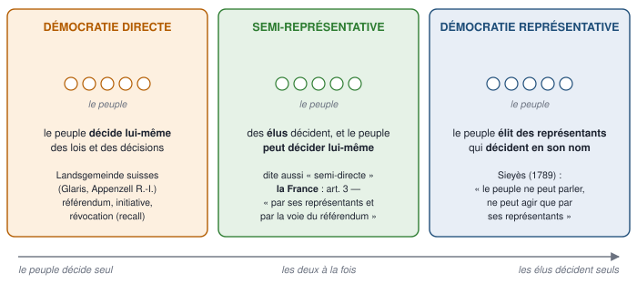
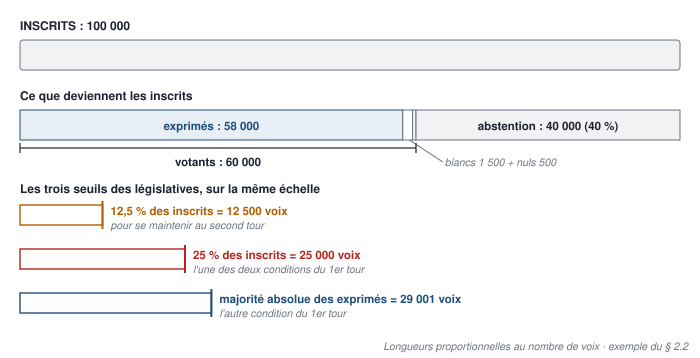
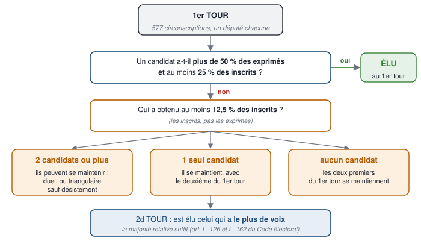
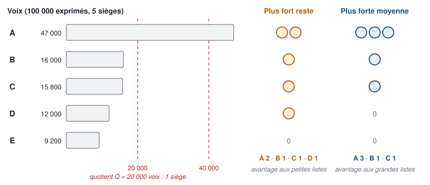
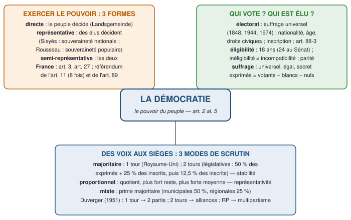

# 1 — Carte du chapitre

::: synthese Le chapitre en quelques lignes
Le chapitre 2 du cours magistral, « **L'organisation du pouvoir dans l'État** », étudie trois façons d'organiser le pouvoir : la **démocratie** (section 1 — ce cours), la **constitution** (section 2 — le cours n° 3) et la **séparation des pouvoirs** (section 3 — à venir). La démocratie, c'est le pouvoir du peuple. Elle pose deux questions, dans l'ordre du cours :

1. **Comment le peuple exerce-t-il le pouvoir ?** Sous **trois formes** : la démocratie **directe** — le peuple décide lui-même —, **représentative** — il élit des représentants qui décident —, et **semi-représentative**, ou semi-directe, qui combine les deux. La France est une démocratie semi-représentative : des élus, et le **référendum** (art. 3 et 11).
2. **Comment le peuple désigne-t-il ses gouvernants ?** Par l'**élection** : qui vote — l'**électorat** —, qui peut être élu — l'**éligibilité** —, comment on vote — un suffrage **universel, égal et secret** (art. 3) ; et comment les voix deviennent des sièges : le **mode de scrutin**, **majoritaire**, **proportionnel** ou **mixte**.
:::

**Ce qui tombe à l'examen** — le format de l'épreuve n'est pas encore connu (à demander en TD). Sur ce chapitre, les questions les plus probables : **définir** la démocratie, le référendum, le plébiscite, le mandat représentatif, le suffrage universel, la représentation proportionnelle ; **distinguer** les trois formes de démocratie, souveraineté nationale et souveraineté populaire, référendum et plébiscite, électorat et éligibilité ; **présenter** les conditions pour être électeur, les caractères du suffrage, les trois modes de scrutin et leurs effets ; un **exercice** — dire qui est élu au premier tour, qui passe au second, répartir des sièges à la proportionnelle ; une **question de réflexion**, par exemple : « Le choix du mode de scrutin est-il neutre ? » ou « La France est-elle une démocratie représentative ? ».

**Ce qu'il faut savoir par cœur**

| Quoi | Le contenu exact |
|---|---|
| La définition de la démocratie | Le pouvoir appartient au peuple · « **gouvernement du peuple, par le peuple et pour le peuple** » (**art. 2 al. 5** ; Lincoln, 1863) |
| Les trois formes | **Directe** · **représentative** · **semi-représentative** (ou semi-directe) |
| Les deux souverainetés | **Nationale** (Sieyès ; Constitution de 1791 : la nation, les représentants) · **populaire** (Rousseau ; Constitution de 1793 : le peuple, la démocratie directe) |
| Les articles | **Art. 1er al. 2** (parité) · **art. 2 al. 5** (le principe) · **art. 3** (souveraineté ; représentants et référendum ; suffrage universel, égal et secret ; électeurs) · **art. 7** (présidentielle) · **art. 11** (référendum législatif) · **art. 27** (« Tout mandat impératif est nul ») · **art. 88-3** (les Européens aux municipales) · **art. 89** (référendum constituant) |
| Les conditions pour voter | **Nationalité**, **âge** (18 ans, loi du 5 juillet 1974), **droits civils et politiques** — puis **inscription** sur une liste électorale |
| Les dates du suffrage | Suffrage universel masculin : **1848** · les femmes : **1944** · les 18 ans : **1974** |
| Les caractères du suffrage | **Universel, égal, secret** (art. 3 al. 3) — libre ; direct ou indirect |
| Les trois modes de scrutin | **Majoritaire** (1 ou 2 tours) · **proportionnel** (quotient, plus fort reste, plus forte moyenne) · **mixte** (prime majoritaire) |
| Les seuils des législatives | 1er tour : **plus de 50 % des exprimés** et **25 % des inscrits** · 2d tour : **12,5 % des inscrits** pour s'y maintenir · **577** circonscriptions, majorité absolue : **289** sièges |
| Les tendances de Duverger (1951) | Majoritaire à 1 tour → **bipartisme** · à 2 tours → **multipartisme et alliances** · proportionnelle → **multipartisme** |

# 2 — Le cours reconstruit

## 2.1 — La démocratie, ses trois formes et le cas français

::: objectif À la fin de cette section, sans support, tu sais
- définir la démocratie, citer l'article 2 et expliquer ses trois termes ;
- présenter les trois formes de démocratie, avec leurs techniques et leurs exemples ;
- opposer souveraineté nationale et souveraineté populaire, mandat représentatif et mandat impératif, référendum et plébiscite ;
- dire quelle forme de démocratie est la France, présenter le référendum de l'article 11 et son utilisation.
:::

### Qu'est-ce que la démocratie ?

Le mot vient du grec *dêmos*, « le peuple », et *kratos*, « le pouvoir ». Au chapitre 1, la démocratie était le troisième titulaire possible de la souveraineté — après un seul, la monarchie, et quelques-uns, l'oligarchie : **le peuple**. C'est la forme d'organisation du pouvoir de nombreux États (cours).

::: definition Démocratie
**En une phrase :** le régime dans lequel le pouvoir appartient au peuple.

**Définition à connaître :** la démocratie est le régime politique dans lequel la **souveraineté appartient au peuple**, qui l'exerce lui-même ou par des représentants qu'il élit. La Constitution de 1958 en pose le principe à l'**article 2, alinéa 5** : « **gouvernement du peuple, par le peuple et pour le peuple** ».
:::

La formule reprend celle d'**Abraham Lincoln** dans son **discours de Gettysburg**, le **19 novembre 1863**, en pleine guerre de Sécession. Ses trois termes disent trois choses :

- **du peuple** : le pouvoir **vient** du peuple — c'est sa source ;
- **par le peuple** : le peuple l'**exerce**, directement ou par ses élus ;
- **pour le peuple** : il est exercé **dans l'intérêt** de tous — c'est son but.

**La démocratie favorise la liberté et l'égalité** (cours) :

- **la liberté** : obéir à des règles que l'on a soi-même adoptées, directement ou par ses élus, c'est en quelque sorte n'obéir qu'à soi-même — le contraire de l'**autocratie**, où un seul impose sa loi. Choisir librement suppose aussi des libertés : d'opinion, de presse, d'association, de former des **partis politiques**, qui « concourent à l'expression du suffrage » (**art. 4**). Le **pluralisme** des idées est une condition de la démocratie : pour le Conseil constitutionnel, « le respect de ce pluralisme est une des conditions de la démocratie » (décision **86-217 DC** du **18 septembre 1986**) ;
- **l'égalité** : chaque citoyen pèse le même poids — une voix —, quels que soient sa fortune, son rang ou son savoir.

::: examen La formule de Churchill, exactement
La démocratie n'est pas parfaite ; elle vaut mieux que les autres régimes. Winston **Churchill**, à la **Chambre des communes**, le **11 novembre 1947** : la démocratie est « la pire forme de gouvernement, à l'exception de toutes celles qui ont été essayées ». On la cite souvent ainsi : « **le pire des régimes, à l'exception de tous les autres** ». Churchill lui-même la présentait comme un mot déjà dit (« *it has been said* »).
:::

::: examen Point bonus : la liberté des Anciens et celle des Modernes
Dans les cités grecques, la liberté consistait surtout à **participer au pouvoir** — voter les lois à l'assemblée ; à Athènes, au Ve siècle av. J.-C., seuls les citoyens votaient, sans les femmes, les esclaves ni les étrangers. Benjamin **Constant** a opposé cette « liberté des Anciens » à la « liberté des Modernes », qui est d'abord la jouissance paisible de la vie privée et des droits individuels (*De la liberté des Anciens comparée à celle des Modernes*, **1819**).
:::

### Les trois formes de la démocratie

Le cours distingue **trois formes principales**. Une seule question les sépare : **qui décide** — le peuple lui-même, ses représentants, ou les deux ?

#### La démocratie directe : le peuple décide lui-même

::: definition Démocratie directe
**En une phrase :** le peuple vote lui-même les lois et les décisions, sans intermédiaire.

**Définition à connaître :** la démocratie directe est la forme de démocratie dans laquelle le **peuple exerce lui-même le pouvoir**, sans représentation ni délégation : les citoyens adoptent eux-mêmes les lois et les décisions importantes.
:::

- **Son modèle** : l'assemblée des citoyens d'Athènes. Il en reste des **survivances en Suisse** : les **Landsgemeinde** — « assemblées du pays » — de deux cantons, **Glaris** et **Appenzell Rhodes-Intérieures**. Une fois par an, les citoyens se réunissent en plein air et votent à main levée les lois, le budget, les révisions de la constitution cantonale. Les femmes n'y votent que depuis **1971** à Glaris et **1990** en Appenzell Rhodes-Intérieures, où il a fallu une décision du Tribunal fédéral suisse.
- **Sa limite** : elle n'est praticable que dans une **petite communauté**. Dans un grand État, réunir des millions de citoyens pour débattre de chaque loi est impossible.

Un grand État peut pourtant emprunter à la démocratie directe **des techniques** :

| Technique | Ce que c'est | Exemples |
|---|---|---|
| **Référendum** | Le peuple **adopte ou rejette un texte**, par oui ou par non | France : art. 11 et 89 · Écosse, sur son indépendance (septembre 2014) · Royaume-Uni : la sortie de l'Union européenne (**23 juin 2016**) |
| **Initiative populaire** | Des citoyens, en nombre fixé, **proposent** un texte ou **demandent** un vote | Suisse : 100 000 signatures pour proposer une révision de la Constitution fédérale · Italie : le **référendum abrogatif**, qui peut supprimer une loi en vigueur à la demande de 500 000 électeurs |
| **Révocation populaire** | Les électeurs **mettent fin au mandat** d'un élu avant son terme | Le ***recall*** de certains États américains : le gouverneur de Californie a été révoqué en 2003 |

En France, à l'automne et l'hiver **2018-2019**, le mouvement des « **gilets jaunes** » a réclamé un **référendum d'initiative citoyenne** (RIC) et la révocation des élus : la Constitution ne prévoit ni l'un ni l'autre.

::: definition Référendum
**En une phrase :** un vote du peuple, par oui ou par non, sur un texte.

**Définition à connaître :** le référendum est la procédure par laquelle le **peuple est appelé à adopter ou à rejeter, par oui ou par non, un texte** — une loi, une révision de la constitution, l'autorisation de ratifier un traité. Il est **constituant** s'il porte sur la constitution, **législatif** s'il porte sur une loi.
:::

::: piege Référendum ou plébiscite ?
Le **plébiscite** a la forme d'un référendum, mais il porte en réalité sur **une personne** : le peuple est appelé à **approuver un homme**, sa politique ou son maintien au pouvoir, plus qu'un texte — et il n'a **pas de vrai choix**, car la réponse attendue est « oui ». Les régimes napoléoniens en ont fait leur instrument : ainsi le plébiscite des **20 et 21 décembre 1851**, qui approuve le coup d'État de Louis-Napoléon Bonaparte.

**Le critère : le peuple peut-il vraiment dire non ?** Les Français l'ont fait en **1946**, **1969** et **2005** : c'étaient de vrais référendums. Mais un référendum peut **tourner au plébiscite** quand le dirigeant engage son sort sur le résultat : le **27 avril 1969**, le « non » l'emporte ; le **général de Gaulle démissionne** le lendemain.
:::

#### La démocratie représentative : le peuple élit des représentants

::: definition Démocratie représentative
**En une phrase :** le peuple élit des représentants, qui décident en son nom.

**Définition à connaître :** la démocratie représentative est la forme de démocratie dans laquelle le peuple **confie l'exercice du pouvoir à des représentants qu'il élit**, et qui décident en son nom pendant la durée de leur mandat.
:::

**Pourquoi des représentants ?** Pour deux raisons :

1. **une raison pratique** : la démocratie directe est impossible dans un grand État, trop vaste et trop peuplé. Montesquieu le disait déjà : le peuple est « admirable pour choisir ceux à qui il doit confier quelque partie de son autorité », mais incapable de conduire lui-même les affaires (*De l'esprit des lois*, **1748**) ;
2. **une raison théorique** : pendant la Révolution française, la souveraineté a été attribuée à la **nation**, être **abstrait** — la collectivité des générations passées, présentes et futures —, qui ne peut s'exprimer que par des représentants. **Sieyès** : « Le peuple ne peut parler, ne peut agir que par ses représentants » (discours du **7 septembre 1789**).

::: definition Mandat représentatif et mandat impératif
**Le mandat représentatif :** l'élu représente **la nation tout entière**, pas seulement ses électeurs ; il **vote librement**, sans être lié par leurs instructions, et ne peut pas être révoqué avant la fin de son mandat.

**Le mandat impératif :** l'élu est tenu de suivre les **instructions** de ses électeurs, qui peuvent le **révoquer** s'il ne les respecte pas.

**En France, le mandat est représentatif** : « **Tout mandat impératif est nul.** Le droit de vote des membres du Parlement est personnel » (**art. 27** de la Constitution).
:::

Le mot « mandat » vient du droit civil — le mandant confie une mission au mandataire, qui doit suivre ses consignes —, mais en politique le mandataire, l'élu, **garde sa liberté de décision** (polycopié).

**Les deux conceptions de la souveraineté**, à connaître absolument :

| | Souveraineté **nationale** | Souveraineté **populaire** |
|---|---|---|
| Penseur | **Sieyès** (*Qu'est-ce que le tiers état ?*, 1789) | **Rousseau** (*Du contrat social*, 1762) |
| Titulaire | La **nation**, être abstrait et indivisible | Le **peuple** réel, somme des citoyens : chacun détient une part de la souveraineté — un dix-millième dans un État de dix mille citoyens, dit Rousseau |
| Forme de démocratie | **Représentative** : la nation ne peut s'exprimer que par ses représentants | **Directe** : « La souveraineté ne peut être représentée » (Rousseau, livre III, chapitre 15) |
| Mandat | **Représentatif** | **Impératif** |
| Droit de vote | Peut être **restreint** : voter est une **fonction**, confiée à ceux que la nation en juge dignes — d'où le suffrage **censitaire** | Forcément **universel** : voter est un **droit** de chaque citoyen |
| Texte | Constitution de **1791** | Constitution de **1793** (jamais appliquée) |

::: definition Suffrage censitaire
**Définition à connaître :** le suffrage censitaire réserve le droit de vote aux citoyens qui paient un **impôt** d'un montant minimal, le **cens**. Il a été pratiqué en France sous la Constitution de **1791**, sous le Directoire (**1795**) et sous les Chartes de **1814 à 1848**.
:::

Le suffrage universel s'impose ensuite, par étapes : les hommes en **1848**, les **femmes** en **1944**.

::: examen Point bonus : Rousseau contre la représentation
« Le peuple anglais pense être libre ; il se trompe fort, il ne l'est que durant l'élection des membres du Parlement ; sitôt qu'ils sont élus, il est esclave, il n'est rien » (Rousseau, *Du contrat social*, livre III, chapitre 15). La phrase résume la critique de la démocratie représentative par la souveraineté populaire.
:::

::: piege Régime représentatif ne veut pas dire démocratie
Un régime représentatif peut exister dans une **monarchie** comme dans une république, et avec un suffrage **censitaire** : les représentants ne sont alors élus que par une minorité fortunée. Il ne devient une **démocratie** représentative qu'avec le **suffrage universel**.
:::

#### La démocratie semi-représentative : les deux à la fois

::: definition Démocratie semi-représentative ou semi-directe
**En une phrase :** des représentants élus, mais le peuple peut aussi décider lui-même.

**Définition à connaître :** la démocratie semi-représentative — que le polycopié appelle **semi-directe** — **combine** la démocratie représentative et des **procédés de démocratie directe** : le pouvoir est exercé par des représentants élus, mais le peuple peut intervenir directement, surtout par le **référendum**, parfois par l'initiative populaire ou le référendum abrogatif.
:::

C'est aujourd'hui la forme la plus répandue : la Suisse — où les votations sont fréquentes —, l'Italie, la France.

::: examen Deux noms pour une même forme
Les diapositives disent démocratie « **semi-représentative** », le polycopié « **semi-directe** » : dans ce cours, les deux désignent la même forme mixte. Emploie le terme du cours et cite l'autre. Certains manuels réservent « semi-représentatif » au régime où les élus suivent de près l'opinion — par les partis, par la dissolution : si ton chargé de TD fait cette distinction, suis-la.
:::

### Le cas français : quelle forme de démocratie ?

**Une démocratie semi-représentative.** L'**article 3** en pose les deux composantes :

> « La souveraineté nationale appartient au peuple qui l'exerce par ses représentants et par la voie du référendum. » (art. 3, al. 1)

- **Par ses représentants** : le Président de la République, les députés, les sénateurs, les élus locaux — avec un **mandat représentatif** (art. 27).
- **Par la voie du référendum** : au niveau national, le référendum **législatif** de l'**article 11** et le référendum **constituant** de l'**article 89** ; au niveau local, le référendum local (**art. 72-1**, depuis 2003).

**L'article 3 fait la synthèse des deux souverainetés** : la souveraineté est « **nationale** », comme chez Sieyès, mais elle « appartient au **peuple** », comme chez Rousseau ; elle s'exerce par des représentants **et** par le référendum ; et « aucune section du peuple ni aucun individu ne peut s'en attribuer l'exercice » (al. 2).

::: examen La réponse attendue
La France est une démocratie **semi-représentative** : l'article 3 met sur le même plan les représentants et le référendum. En pratique, **la représentation domine** : le référendum reste l'exception, et le dernier référendum national date de **2005**.
:::

### Le référendum de l'article 11 et son utilisation

::: definition Le référendum de l'article 11
**Définition à connaître :** le référendum **législatif** de l'article 11 permet au **Président de la République** de soumettre au peuple un **projet de loi** portant sur l'**organisation des pouvoirs publics**, sur des **réformes relatives à la politique économique, sociale ou environnementale** de la nation et aux services publics qui y concourent, ou tendant à autoriser la **ratification d'un traité** qui, sans être contraire à la Constitution, aurait des incidences sur le fonctionnement des institutions.
:::

- **Qui le déclenche ?** Le **Président de la République**, sur **proposition du Gouvernement** pendant les sessions, ou sur **proposition conjointe des deux assemblées**. C'est un **pouvoir propre** : il décide sans contreseing (art. 19), et il reste libre de ne pas donner suite.
- **Son champ s'est élargi** : la politique économique et sociale en **1995**, l'environnement en **2008**.
- **Le référendum d'initiative partagée**, créé par la révision du **23 juillet 2008** (art. 11 al. 3) et applicable depuis le **1er janvier 2015** : l'initiative d'**un cinquième des membres du Parlement** — 185 sur 925 —, **soutenue par un dixième des électeurs inscrits** — environ 4,7 millions de personnes. Si les deux assemblées n'examinent pas la proposition dans les six mois, le Président la soumet au référendum. **Aucun n'a abouti** : sur la privatisation d'Aéroports de Paris, en 2019-2020, environ **1,09 million** de soutiens ont été recueillis.

**Son utilisation sous la Ve République** — huit référendums par l'article 11 :

| Date | Objet | Résultat |
|---|---|---|
| 8 janvier 1961 | Autodétermination de l'Algérie | Oui, 75 % |
| 8 avril 1962 | Accords d'Évian : l'indépendance de l'Algérie | Oui, 91 % |
| 28 octobre 1962 | Élection du Président au suffrage universel direct | Oui, 62 % |
| 27 avril 1969 | Régions et réforme du Sénat | **Non, 52 %** — de Gaulle démissionne |
| 23 avril 1972 | Élargissement des Communautés européennes | Oui, 68 % |
| 6 novembre 1988 | Avenir de la Nouvelle-Calédonie | Oui, 80 % — mais 63 % d'abstention |
| 20 septembre 1992 | Traité de Maastricht | Oui, 51 % |
| 29 mai 2005 | Traité établissant une Constitution pour l'Europe | **Non, 55 %** |

Un seul référendum a eu lieu par l'**article 89**, pour réviser la Constitution : le **quinquennat**, le **24 septembre 2000** — oui à 73 %, avec près de **70 %** d'abstention.

::: examen Ce que montrent ces dates
1. **Aucun référendum national depuis 2005** : la démocratie française est d'abord représentative.
2. **Le référendum peut devenir plébiscite** : de Gaulle liait son maintien au résultat, et il est parti après le « non » de 1969.
3. Les électeurs **répondent parfois à une autre question** que celle qui est posée — ils sanctionnent le pouvoir en place —, et l'**abstention** peut être massive : 63 % en 1988, 70 % en 2000.
4. L'article 11 a servi **à réviser la Constitution** en 1962, et à tenter de le faire en 1969 : un usage contesté, étudié dans le cours n° 3.
:::

## 2.2 — L'élection : qui vote, qui est élu, comment on vote

::: objectif À la fin de cette section, sans support, tu sais
- donner le principe du suffrage universel, son histoire, et les conditions pour être électeur et pour voter ;
- définir l'éligibilité, en donner les conditions, distinguer inéligibilité et incompatibilité, raconter l'histoire de la parité ;
- expliquer les caractères du suffrage — universel, égal, secret, libre, direct ou indirect ;
- lire un résultat d'élection : inscrits, votants, abstention, blancs et nuls, suffrages exprimés.
:::

Dans une démocratie, les gouvernants sont choisis par l'**élection** : c'est elle qui leur donne leur **légitimité**. Le cours l'étudie en deux points : **A. les modalités du vote** — cette section — et **B. les modes de scrutin** — les sections 2.3 et 2.4.

### Qui vote : l'électorat

::: definition Électorat et suffrage universel
**En une phrase :** l'électorat, c'est le droit de voter ; le suffrage est universel quand tous les citoyens adultes votent.

**Définition à connaître :** l'**électorat** est le droit de vote — ou l'ensemble de ceux qui le détiennent. Le **suffrage universel** est celui qui appartient à **tous les nationaux majeurs** jouissant de leurs droits civils et politiques, **sans condition** de fortune, d'instruction ou de sexe.
:::

**Le principe en démocratie** (cours) : le suffrage universel. « Sont électeurs, dans les conditions déterminées par la loi, tous les nationaux français majeurs des deux sexes, jouissant de leurs droits civils et politiques » (**art. 3, al. 4**).

**Une conquête par étapes** :

| Date | Étape |
|---|---|
| 1791, 1795, 1814-1848 | Suffrage **censitaire** : seuls votent ceux qui paient le cens |
| **1848** | Suffrage universel **masculin** (décret du 5 mars 1848) |
| **1944** | Les **femmes** deviennent électrices et éligibles (ordonnance du **21 avril 1944**) ; elles votent pour la première fois aux municipales du **29 avril 1945** |
| 1945 | Les **militaires** retrouvent le droit de vote, dont la loi les privait depuis 1872 — l'armée était « la Grande Muette » |
| **1974** | Le droit de vote passe de 21 à **18 ans** (loi du **5 juillet 1974**) |

**Les restrictions** (cours) — les **conditions de jouissance** du droit de vote, qui font d'une personne un **électeur**. Elles sont **cumulatives** :

**1. La nationalité.** Seuls les **nationaux** votent. Le Conseil constitutionnel l'a jugé à propos du traité de Maastricht : l'article 3 réserve aux Français le droit de vote et d'éligibilité aux élections liées à l'**exercice de la souveraineté nationale** — y compris les municipales, parce que les conseillers municipaux désignent les électeurs des sénateurs (décision **92-308 DC** du **9 avril 1992**). Pour ratifier le traité, il a fallu **réviser la Constitution** (**25 juin 1992**) et créer l'**article 88-3** :

> « Sous réserve de réciprocité et selon les modalités prévues par le Traité sur l'Union européenne signé le 7 février 1992, le droit de vote et d'éligibilité aux élections municipales peut être accordé aux seuls citoyens de l'Union résidant en France. Ces citoyens ne peuvent exercer les fonctions de maire ou d'adjoint ni participer à la désignation des électeurs sénatoriaux et à l'élection des sénateurs. »

**2. L'âge.** Être **majeur** : **18 ans** accomplis.

**3. La capacité** : **jouir de ses droits civils et politiques**. Un juge pénal peut **priver** un condamné du droit de vote, à titre de peine complémentaire et pour une durée limitée — dix ans au plus ; cette privation n'est jamais automatique. Les **majeurs sous tutelle** votent depuis la **loi du 23 mars 2019**.

**Les conditions d'exercice** — pour **voter réellement**, l'électeur doit être **inscrit sur une liste électorale** :

- l'inscription est **obligatoire** (art. L. 9 du Code électoral), mais **sans sanction** ;
- il y a **une liste par commune**, et il faut un **lien avec la commune** (art. L. 11) : y avoir son **domicile**, ou y **résider depuis six mois** au moins, ou y **payer un impôt local** pour la deuxième année — le propriétaire d'une résidence secondaire, par exemple —, ou y être fonctionnaire astreint à y résider ;
- les jeunes qui atteignent 18 ans sont **inscrits d'office** (loi du 10 novembre 1997) ;
- depuis le **1er janvier 2019** (loi du 1er août 2016), un **répertoire électoral unique**, tenu par l'**INSEE**, centralise les listes : on peut s'inscrire **toute l'année**, jusqu'au **sixième vendredi** avant un scrutin ; le **maire** statue sur les demandes, une **commission de contrôle** vérifie la régularité de la liste.

| Conditions de **jouissance** : être électeur | Conditions d'**exercice** : pouvoir voter |
|---|---|
| La **nationalité** française — exception : les citoyens de l'Union aux municipales (art. 88-3) | L'**inscription** sur une liste électorale |
| L'**âge** : 18 ans | Obligatoire, mais sans sanction |
| Les **droits civils et politiques** | Un **lien avec la commune** (art. L. 11) |

::: piege Deux passages dépassés du polycopié
- Les **majeurs sous tutelle** ne sont plus privés du droit de vote : l'article L. 5 du Code électoral, que cite le polycopié, a été **abrogé** par la loi du **23 mars 2019**.
- La liste n'est plus « révisée chaque année » par une commission administrative : depuis **2019**, le **répertoire électoral unique** permet de s'inscrire toute l'année, jusqu'au sixième vendredi avant le scrutin.
:::

### Qui peut être élu : l'éligibilité

::: definition Éligibilité
**En une phrase :** le droit d'être candidat et d'être élu.

**Définition à connaître :** l'éligibilité est l'**aptitude juridique à être élu** : elle suppose d'avoir la qualité d'électeur et de remplir les conditions propres à chaque élection — un âge minimal, l'absence d'inéligibilité.
:::

- **Être électeur** — et donc, en principe, Français : les citoyens de l'Union ne sont éligibles qu'au conseil municipal, sans pouvoir être maire ni adjoint (art. 88-3).
- **Avoir l'âge requis** : **18 ans** pour la plupart des mandats — Président de la République, député, conseiller municipal, départemental ou régional ; **24 ans** pour être **sénateur** (loi organique du 14 avril 2011).
- **Ne pas être inéligible** : certaines fonctions interdisent de se présenter là où on les exerce — un **préfet**, un **magistrat** ne peuvent pas être élus dans le ressort où ils exercent, pour qu'ils n'usent pas de leur position ; un juge pénal peut aussi prononcer une **peine d'inéligibilité**.

::: piege Inéligibilité ou incompatibilité ?
L'**inéligibilité** empêche d'**être élu** : l'élection est annulée. L'**incompatibilité** empêche seulement de **cumuler** deux fonctions **une fois élu** : l'élu doit choisir. Exemples d'incompatibilités : on ne peut être à la fois député et sénateur, ni **ministre et parlementaire** (**art. 23**) ; depuis **2017**, un parlementaire ne peut plus exercer une **fonction exécutive locale** — maire, adjoint, président ou vice-président d'un conseil départemental ou régional (loi organique du **14 février 2014** sur le non-cumul).
:::

**La parité** — le cours cite l'**article 1er, alinéa 2** : « **La loi favorise l'égal accès des femmes et des hommes aux mandats électoraux et fonctions électives**, ainsi qu'aux responsabilités professionnelles et sociales. » Son histoire est une question d'examen classique :

1. **1982 — la censure.** Une loi impose des listes municipales comportant au plus 75 % de candidats du même sexe. Le Conseil constitutionnel la **censure** : la qualité de citoyen ouvre à tous le droit de vote et d'éligibilité dans des conditions identiques, et répartir les candidats selon leur sexe **rompt cette égalité** (décision **82-146 DC** du **18 novembre 1982**). Il le redit en 1999 (décision **98-407 DC** du **14 janvier 1999**).
2. **1999 — la révision.** Pour surmonter cette jurisprudence, la **loi constitutionnelle du 8 juillet 1999** inscrit dans la Constitution que la loi « favorise l'égal accès des femmes et des hommes aux mandats électoraux et fonctions électives ».
3. **2000 — la loi.** La **loi du 6 juin 2000** impose des **listes paritaires** pour les scrutins de liste, et une **pénalité financière** aux partis qui ne présentent pas autant de femmes que d'hommes aux législatives.
4. **2008 — l'article 1er.** La révision du **23 juillet 2008** place le principe à l'**article 1er** et l'étend aux **responsabilités professionnelles et sociales**.
5. **2015 — le binôme.** Les conseillers départementaux sont élus par **binômes femme-homme**.

::: marche La parité, jusque dans les conseils d'administration
Pourquoi la révision de 2008 a-t-elle ajouté les « **responsabilités professionnelles et sociales** » ? Parce qu'en **2006**, le Conseil constitutionnel avait censuré une loi imposant une part de femmes dans les conseils d'administration des sociétés, faute de fondement constitutionnel. Une fois le principe inscrit à l'article 1er, la loi **Copé-Zimmermann** du 27 janvier **2011** a pu imposer **40 %** de femmes dans les conseils des grandes sociétés, cotées ou non : le même mécanisme — révision, puis loi — que pour les mandats électoraux en 1999-2000.
:::

### Comment on vote : les principes du suffrage

Les « principes à retenir » (cours) sont concrétisés par l'**article 3, alinéa 3** : « Le suffrage peut être **direct ou indirect** dans les conditions prévues par la Constitution. Il est **toujours universel, égal et secret**. »

| Principe | Ce qu'il signifie | Ce qu'il implique |
|---|---|---|
| **Universel** | Tous les nationaux majeurs votent | Ni cens, ni exclusion des femmes (1848, 1944) |
| **Égal** | « **Un homme, une voix** » : chaque électeur a une voix, qui pèse autant que les autres | Interdit le **vote plural** — plusieurs voix pour certains électeurs — et le **vote familial** ; impose des **circonscriptions** de population comparable |
| **Secret** | Nul ne doit savoir pour qui on vote | **Isoloir** obligatoire, enveloppe, urne : le secret protège la **liberté** du vote contre les pressions |
| **Libre** | On vote pour qui on veut, ou on ne vote pas | En France, voter est un **droit** et un **devoir civique**, **pas une obligation** |
| **Direct ou indirect** | **Direct** : les électeurs élisent eux-mêmes · **indirect** : ils élisent des élus, qui élisent à leur tour | **Direct** : le Président, les députés, les élus locaux · **indirect** : les **sénateurs**, élus par des **grands électeurs** — surtout des délégués des conseils municipaux |

**L'égalité et le découpage.** Si une circonscription compte deux fois plus d'habitants qu'une autre, la voix de ses électeurs pèse deux fois moins. Le Conseil constitutionnel contrôle donc le **découpage** des circonscriptions législatives — la population doit en être la base —, mais il ne censure qu'une **erreur manifeste** : il laisse une marge au législateur.

**La liberté : voter n'est pas obligatoire.** Le vote est obligatoire en **Belgique** et au **Luxembourg**. En France, seuls les **grands électeurs** des sénatoriales sont tenus de voter, sous peine d'**amende**. Conséquence : l'**abstention**, variable selon l'enjeu :

| Élection | Abstention |
|---|---|
| Présidentielle **2022** | **26,31 %** au 1er tour · **28,01 %** au 2d |
| Législatives **2024** | Environ **un tiers** des inscrits, à chaque tour |
| Européennes | **59,37 %** en **2009**, le record · 49,88 % en 2019 · 48,51 % en 2024 |
| Référendum sur le quinquennat, **2000** | **69,81 %** |

::: definition Vote blanc, vote nul, suffrages exprimés
Le **vote blanc** : une enveloppe vide ou un bulletin sans nom — le choix conscient de ne choisir personne. Le **vote nul** : un bulletin irrégulier — déchiré, annoté, plusieurs bulletins dans l'enveloppe —, souvent une erreur. Les **suffrages exprimés** sont les votes qui désignent un candidat ou une liste : **les votants, moins les blancs et les nuls**.
:::

Depuis la **loi du 21 février 2014**, les votes blancs sont **décomptés à part** et mentionnés dans les résultats — mais ils ne comptent **toujours pas** dans les suffrages exprimés. Leur poids peut être important : au référendum de **2000**, près de **2 millions** de bulletins blancs et nuls, soit environ **16 % des votants**.

::: formule Lire un résultat d'élection
$$ \text{votants} = \text{inscrits} - \text{abstentionnistes} $$
$$ \text{suffrages exprimés} = \text{votants} - \text{blancs} - \text{nuls} $$
$$ \text{taux d'abstention} = \frac{\text{abstentionnistes}}{\text{inscrits}} \times 100 $$
Les **inscrits** sont les électeurs inscrits sur les listes ; les **votants**, ceux qui ont voté ; les **exprimés**, ceux dont le bulletin désigne un candidat. Les pourcentages de voix se calculent **sur les exprimés** — mais les seuils de 25 % et de 12,5 % des législatives, **sur les inscrits**.
:::

::: exemple Un résultat, recalculé
Une circonscription compte **100 000 inscrits** ; **60 000** électeurs votent ; on dépouille **1 500** bulletins blancs et **500** nuls.
- **Abstentionnistes** : 100 000 − 60 000 = **40 000** ; taux d'abstention : 40 000 ÷ 100 000 × 100 = **40 %**.
- **Suffrages exprimés** : 60 000 − 1 500 − 500 = **58 000**.
- Un candidat qui recueille **30 000** voix obtient 30 000 ÷ 58 000 × 100 ≈ **51,7 %** des exprimés — mais seulement 30 000 ÷ 100 000 × 100 = **30 %** des inscrits.
- **Vérification** : 40 000 + 1 500 + 500 + 58 000 = **100 000** — on retrouve bien les inscrits.
:::

::: marche Toujours demander « sur quelle base ? »
Un rendement de 10 % ne veut rien dire tant qu'on ne sait pas s'il est calculé sur le capital investi ou sur la valeur de marché. De même, les 30 000 voix de l'exemple font **51,7 % des exprimés** mais **30 % des inscrits**. À l'examen, précise toujours la base de chaque pourcentage : c'est là que se cachent les pièges des seuils.
:::

## 2.3 — Le scrutin majoritaire

::: objectif À la fin de cette section, sans support, tu sais
- définir le mode de scrutin et distinguer scrutin uninominal ou de liste, à un ou à deux tours ;
- calculer une majorité absolue et la distinguer de la majorité relative ;
- expliquer le scrutin majoritaire à un tour et à deux tours, avec les règles des législatives et de la présidentielle ;
- présenter ses effets — avantages, inconvénients, tendances de Duverger — et leurs limites en 2022 et 2024.
:::

« **Le scrutin permet d'obtenir un résultat électoral** » (cours) : c'est la règle qui **transforme des voix en sièges**. Elle n'est pas neutre : le même vote peut donner des assemblées très différentes selon le mode de scrutin.

::: definition Mode de scrutin
**En une phrase :** la règle qui transforme les voix en sièges.

**Définition à connaître :** le mode de scrutin est l'ensemble des **règles qui déterminent comment les suffrages exprimés sont convertis en sièges** et comment les élus sont désignés. Le cours en distingue **trois** : le scrutin **majoritaire**, la **représentation proportionnelle** et le scrutin **mixte**.
:::

Pour chaque élection, le législateur choisit aussi :

- un scrutin **uninominal** — **un siège** par circonscription, on vote pour **un candidat** : il personnalise l'élection et lie l'élu à sa circonscription — ou **de liste** — **plusieurs sièges**, on vote pour **une liste** ;
- un scrutin à **un tour** ou à **deux tours** ;
- un scrutin **direct** ou **indirect** (section 2.2).

En France, ces choix sont faits par la **loi** (art. 34 de la Constitution) — sauf pour l'élection présidentielle, que la Constitution règle elle-même (**art. 7**). Ils peuvent donc changer sans révision de la Constitution : les législatives de **1986** ont eu lieu à la proportionnelle.

### Le principe : le premier emporte le siège

::: definition Scrutin majoritaire
**En une phrase :** le candidat, ou la liste, qui a le plus de voix emporte le siège ; les autres n'ont rien.

**Définition à connaître :** au scrutin majoritaire, **le siège est attribué au candidat — ou la liste — qui obtient la majorité des suffrages exprimés** ; les autres n'obtiennent aucun siège. Il se déroule en **un tour** ou en **deux tours**.
:::

::: definition Majorité absolue et majorité relative
La **majorité absolue** : **plus de la moitié** des suffrages exprimés. La **majorité relative** : **le plus grand nombre de voix**, même s'il n'atteint pas la moitié.
:::

::: formule Calculer une majorité absolue
$$ \text{majorité absolue} = \left\lfloor \frac{N}{2} \right\rfloor + 1 $$
*N* est le nombre de suffrages exprimés — ou de sièges. ⌊ ⌋ se lit « partie entière » : on prend la moitié de *N*, on retire les décimales, on ajoute 1. C'est **le premier nombre entier supérieur à la moitié**.
:::

::: exemple Deux majorités absolues, calculées
- **À l'Assemblée nationale, 577 sièges** : 577 ÷ 2 = 288,5 ; partie entière 288 ; 288 + 1 = **289** sièges. La formule « la moitié plus une voix », qu'on lit dans le polycopié, donnerait 288,5 + 1 = 289,5 : absurde.
- **Avec 44 000 suffrages exprimés** : 44 000 ÷ 2 = 22 000 ; 22 000 + 1 = **22 001** voix.
:::

### Le scrutin majoritaire à un tour

- **Le fonctionnement** : un seul vote ; le candidat arrivé **en tête** est élu, **même sans majorité absolue**. Les Britanniques l'appellent *first past the post* : « le premier à passer le poteau ».
- **Les exemples** : le **Royaume-Uni**, pour les 650 sièges de la Chambre des communes ; les **États-Unis**, pour la plupart des sièges de la Chambre des représentants (exemple de ton cours). Il **n'existe pas en France** pour les élections politiques.
- **Ses effets** : il est **brutal** — un candidat peut être élu avec 30 % des voix, face à 70 % de voix dispersées ; les électeurs votent « **utile** » pour l'un des deux grands candidats ; il favorise le **bipartisme** — au Royaume-Uni, conservateurs et travaillistes.

### Le scrutin majoritaire à deux tours

**Le principe** : pour être élu au **premier tour**, il faut la **majorité absolue** ; sinon, un **second tour** a lieu, où la **majorité relative** suffit. La formule classique : « **au premier tour, on choisit ; au second, on élimine** ». Au premier tour, l'électeur vote pour son candidat préféré, sans calcul — c'est « le vrai visage politique du pays » (polycopié) ; entre les deux tours, les candidats mal placés **se désistent** au profit d'un allié, et les partis négocient des **alliances**.

**Les règles des législatives** — **577 circonscriptions**, un député chacune : scrutin **uninominal majoritaire à deux tours** (art. L. 123 du Code électoral).

| Tour | Pour être élu | Pour se maintenir au second tour |
|---|---|---|
| **1er tour** | la **majorité absolue des suffrages exprimés** **et** un nombre de voix au moins égal à **25 % des électeurs inscrits** (art. L. 126) | — |
| **2d tour** | la **majorité relative** : le plus de voix | avoir obtenu au 1er tour au moins **12,5 % des électeurs inscrits** ; si un seul candidat atteint ce seuil, ou aucun, **les deux premiers** peuvent se maintenir (art. L. 162) |

Quand trois candidats dépassent 12,5 % des inscrits — ce qui arrive quand la participation est forte —, le second tour peut être une **triangulaire**, sauf désistement : en **2024**, plus de 200 candidats qualifiés se sont retirés entre les deux tours.

**Les règles de la présidentielle** (**art. 7** de la Constitution) : est élu au premier tour le candidat qui obtient la **majorité absolue des suffrages exprimés** ; sinon, un second tour a lieu **le quatorzième jour suivant**, entre les **deux** candidats arrivés en tête — après le retrait éventuel de candidats mieux placés. Avec deux candidats, le vainqueur a forcément la majorité absolue. Depuis la première élection au suffrage universel direct, en **1965**, **aucun** président n'a été élu dès le premier tour.

::: piege Trois seuils à ne pas confondre
- **Plus de 50 % des exprimés** : pour être élu au premier tour — et, aux législatives, **en plus**, **25 % des inscrits**. Avec une faible participation, un candidat peut avoir la majorité absolue des exprimés sans être élu.
- **12,5 % des inscrits**, et non des exprimés : pour se maintenir au second tour des législatives. Avec 60 % de votants, cela représente 12,5 ÷ 0,60 ≈ **20,8 % des exprimés** — s'il n'y a ni blanc ni nul.
- **Au second tour, aucun seuil** : le premier est élu.
:::

::: exemple Élu au premier tour ? Deux circonscriptions
**Circonscription 1** : 100 000 inscrits, 45 000 votants, 1 000 blancs et nuls, donc **44 000** exprimés. Le candidat A obtient **23 000** voix, soit 23 000 ÷ 44 000 ≈ **52,3 %** des exprimés : la majorité absolue (22 001). Mais 25 % des inscrits = **25 000** voix, et A n'en a que 23 000 : **pas élu au premier tour**.

**Circonscription 2** : 90 000 inscrits, 70 000 votants, 2 000 blancs et nuls, donc **68 000** exprimés. A obtient **36 000** voix : 36 000 ≥ 34 001, la majorité absolue, et 36 000 ≥ 90 000 × 25 ÷ 100 = 22 500. **Élu dès le premier tour.**
:::

### Les effets du scrutin majoritaire

Le cours et les notes en retiennent l'avantage et l'inconvénient :

1. **L'avantage : des majorités stables.** Le scrutin majoritaire **amplifie** la victoire — le parti ou la coalition en tête obtient une part des sièges bien supérieure à sa part des voix — et permet souvent une **majorité absolue** à l'Assemblée (289 sièges), ce qui **facilite la prise de décision** (notes). Combiné à la **bipolarisation** — deux camps qui s'allient au second tour —, il a assuré la **stabilité gouvernementale** de la Ve République, alors que les alliances instables de la IIIe République ne le permettaient pas (polycopié).
2. **L'inconvénient : un défaut de représentativité.** Les **petits partis** sont peu ou pas représentés ; le scrutin favorise les grandes formations (notes). L'exemple le plus parlant : le **Front national** obtient **35 sièges** en **1986**, élection à la proportionnelle, puis **un seul** en **1988**, au scrutin majoritaire, avec un score voisin, près de 10 % ; aucun en 1993. Ses successeurs ont percé depuis : 8 sièges en 2017, 89 en 2022, plus de 120 en 2024.

**Mais la stabilité n'est pas automatique** (notes). En **2022**, la coalition du Président n'obtient que 245 sièges, 44 de moins que la majorité absolue ; en **2024**, aucun bloc n'approche la majorité. Élue au scrutin majoritaire, l'Assemblée ressemble alors à une assemblée élue à la proportionnelle : il faut **chercher des coalitions**, ce dont la vie politique française n'a pas l'habitude. C'était déjà le cas, dans une moindre mesure, en **1988**.

::: examen Les trois tendances de Duverger
Le politiste Maurice **Duverger** (*Les Partis politiques*, **1951**) a formulé trois tendances, souvent appelées « lois de Duverger » :
1. le scrutin majoritaire **à un tour** tend au **bipartisme** — le Royaume-Uni, les États-Unis ;
2. le scrutin majoritaire **à deux tours** tend au **multipartisme tempéré par des alliances** — la Ve République, avec ses deux coalitions ;
3. la **représentation proportionnelle** tend au **multipartisme**, avec des partis indépendants les uns des autres.

Ce sont des **tendances**, pas des lois absolues : la France de 2024 a un scrutin à deux tours et une Assemblée éclatée.
:::

::: piege Le tableau inversé du polycopié
Page 9, le polycopié écrit sous le scrutin **à un tour** : « s'accommode du multipartisme, le premier tour restant ouvert à toutes les formations ». C'est l'inverse : la phrase décrit le scrutin **à deux tours** — son propre texte le dit page 8. Le scrutin à un tour, lui, pousse au **bipartisme**.
:::

## 2.4 — La représentation proportionnelle et le scrutin mixte

::: objectif À la fin de cette section, sans support, tu sais
- définir la représentation proportionnelle et expliquer son fonctionnement par listes ;
- répartir des sièges avec le quotient électoral, puis au plus fort reste et à la plus forte moyenne ;
- définir le scrutin mixte et calculer la prime majoritaire des municipales ;
- comparer les effets des trois modes de scrutin et dire lequel s'applique à chaque élection française.
:::

### La représentation proportionnelle

::: definition Représentation proportionnelle
**En une phrase :** chaque liste obtient un nombre de sièges proportionnel à ses voix.

**Définition à connaître :** la représentation proportionnelle est le mode de scrutin qui **attribue à chaque liste un nombre de sièges proportionnel au nombre de suffrages qu'elle a obtenus**. Elle fonctionne **par listes** : chaque liste présente autant de candidats que de sièges à pourvoir, et les sièges gagnés vont aux candidats **dans l'ordre de la liste**.
:::

**Le fonctionnement par liste** (cours). L'électeur ne vote pas pour une personne mais pour une **liste**, en général en **un seul tour**. La répartition se fait en deux étapes :

1. **Le quotient électoral** : on divise les suffrages exprimés par le nombre de sièges. C'est le « prix » d'un siège, en voix. Chaque liste reçoit autant de sièges qu'elle contient de fois ce quotient.
2. **Les sièges restants** : il en reste presque toujours quelques-uns. Deux méthodes pour les attribuer : le **plus fort reste** ou la **plus forte moyenne**.

::: formule Le quotient électoral
$$ Q = \frac{\text{suffrages exprimés}}{\text{nombre de sièges à pourvoir}} $$
Chaque liste reçoit d'abord la **partie entière** de (ses voix ÷ *Q*) : autant de sièges que de fois le quotient dans ses voix.
:::

::: formule Les deux méthodes pour les sièges restants
**Au plus fort reste**, on calcule pour chaque liste ce qui lui reste de voix :
$$ \text{reste} = \text{voix de la liste} - \text{sièges déjà obtenus} \times Q $$
Les sièges restants vont, un par un, aux listes qui ont **les plus forts restes**.

**À la plus forte moyenne**, on calcule pour chaque liste le nombre de voix par siège qu'elle aurait si on lui donnait un siège de plus :
$$ \text{moyenne} = \frac{\text{voix de la liste}}{\text{sièges déjà obtenus} + 1} $$
Le siège va à la liste qui a **la plus forte moyenne** ; on recommence pour chaque siège restant, en mettant à jour les sièges obtenus.
:::

::: exemple Cinq sièges, 100 000 voix : les deux méthodes
Cinq listes se disputent **5 sièges** ; **100 000** suffrages exprimés : A **47 000**, B **16 000**, C **15 800**, D **12 000**, E **9 200** — leur somme fait bien 100 000.

**Le quotient** : *Q* = 100 000 ÷ 5 = **20 000** voix. A : 47 000 ÷ 20 000 = 2,35, donc **2 sièges** ; B, C, D et E ont moins de 20 000 voix : **0**. Deux sièges attribués, **trois restent**.

**Au plus fort reste** — les restes : A 47 000 − 2 × 20 000 = **7 000** ; B **16 000** ; C **15 800** ; D **12 000** ; E **9 200**. Les trois plus forts : B, C et D. **Résultat : A 2, B 1, C 1, D 1, E 0.**

**À la plus forte moyenne** :
- 3e siège : A 47 000 ÷ 3 ≈ 15 666,7 ; B 16 000 ÷ 1 = **16 000** ; C 15 800 ; D 12 000 ; E 9 200 → **B** ;
- 4e siège : A 15 666,7 ; B 16 000 ÷ 2 = 8 000 ; C 15 800 ÷ 1 = **15 800** ; D 12 000 ; E 9 200 → **C** ;
- 5e siège : A **15 666,7** ; B 8 000 ; C 15 800 ÷ 2 = 7 900 ; D 12 000 ; E 9 200 → **A**.

**Résultat : A 3, B 1, C 1, D 0, E 0.**

**Vérification** : 2 + 1 + 1 + 1 = 5 et 3 + 1 + 1 = 5 sièges. Avec 47 % des voix, A obtient 2 sièges sur 5, soit 40 %, au plus fort reste — mais 3 sur 5, soit 60 %, à la plus forte moyenne.
:::

::: examen La leçon à retenir
Le **plus fort reste** avantage les **petites** listes — D obtient un siège avec 12 % des voix ; la **plus forte moyenne** avantage les **grandes** — A gagne un troisième siège. **Astuce de calcul** : à la plus forte moyenne, on peut sauter l'étape du quotient et attribuer tous les sièges un par un, à partir de zéro, à la plus forte moyenne : le résultat est toujours le même (c'est la méthode dite de d'Hondt). Vérifie ainsi : divise les voix de chaque liste par 1, 2, 3… — A : 47 000, 23 500, 15 666,7, 11 750 ; B : 16 000, 8 000 ; C : 15 800, 7 900 ; D : 12 000 ; E : 9 200. Les cinq plus grands nombres sont 47 000, 23 500, 16 000, 15 800 et 15 666,7 : A, A, B, C, A — soit A 3, B 1, C 1.
:::

**Le seuil.** Pour éviter l'émiettement de l'assemblée, les listes qui n'atteignent pas un **seuil** sont exclues de la répartition : en France, **5 % des suffrages exprimés** (européennes, municipales, régionales).

**Où l'applique-t-on en France ?** Aux **élections européennes** — une liste nationale, la plus forte moyenne, le seuil de 5 %, **81** sièges pour la France en 2024 ; aux **sénatoriales**, dans les départements qui élisent **trois sénateurs ou plus** ; aux législatives, **une seule fois** sous la Ve République, en **1986**.

**Ses effets** (cours et notes) :

1. **L'avantage : la représentativité.** Tous les partis qui ont des voix — au-dessus du seuil — ont des élus : l'assemblée est le **miroir** de l'opinion.
2. **L'inconvénient : des majorités difficiles.** Il faut des **alliances**, des **coalitions** entre partis, négociées **après** l'élection (notes) ; les petits partis, pivots des coalitions, pèsent plus que leur poids ; la **stabilité gouvernementale** en souffre — la IVe République, dont l'Assemblée était élue à la proportionnelle, a connu une forte instabilité. Et le lien entre l'élu et ses électeurs se relâche : on vote pour une liste, dont les partis fixent l'ordre.

### Le scrutin mixte

::: definition Scrutin mixte
**En une phrase :** un mélange de scrutin majoritaire et de proportionnelle.

**Définition à connaître :** le scrutin mixte **combine**, dans une même élection, le **scrutin majoritaire** et la **représentation proportionnelle** : une partie des sièges est attribuée selon une logique majoritaire, l'autre à la proportionnelle.
:::

**Les exemples** (cours) :

1. **Les élections municipales** (notes) — dans les communes de 1 000 habitants et plus, et dans toutes les communes depuis les élections de **mars 2026** (loi du 21 mai 2025 — **à confirmer en TD**) : un scrutin de liste à deux tours. La liste arrivée en tête — avec la majorité absolue au premier tour, ou le plus de voix au second — reçoit une **prime majoritaire** : **la moitié des sièges**. Les autres sièges sont répartis **à la proportionnelle**, à la plus forte moyenne, entre **toutes** les listes qui ont au moins **5 %** des exprimés — la liste gagnante comprise. Au second tour peuvent se présenter les listes qui ont eu au moins 10 % des exprimés.
2. **Les élections régionales** : le même mécanisme, avec une **prime de 25 %** des sièges.
3. **L'Allemagne**, pour le Bundestag : chaque électeur a **deux voix** — la première pour un député de circonscription, élu au scrutin majoritaire à un tour ; la seconde pour une liste de parti, qui détermine la répartition des sièges à la proportionnelle ; les partis sous **5 %** en sont en principe exclus.

::: formule La prime majoritaire des municipales
$$ \text{prime} = \frac{\text{sièges à pourvoir}}{2} $$
arrondie à l'**entier supérieur** quand il y a plus de quatre sièges à pourvoir.
$$ \text{sièges répartis à la proportionnelle} = \text{sièges à pourvoir} - \text{prime} $$
:::

::: exemple Une commune de 29 sièges
**4 000** suffrages exprimés au premier tour : liste A **2 100**, B **1 180**, C **470**, D **250** — la somme fait bien 4 000.
1. **La prime** : A obtient 2 100 ÷ 4 000 = **52,5 %** des exprimés, la majorité absolue : elle l'emporte dès le premier tour. Prime : 29 ÷ 2 = 14,5, arrondi à l'entier supérieur : **15 sièges** pour A.
2. **Les sièges restants** : 29 − 15 = **14**, répartis entre les listes qui ont au moins 5 % des exprimés, soit 4 000 × 5 ÷ 100 = **200** voix : A, B, C et D y ont droit.
3. **Le quotient** : 4 000 ÷ 14 ≈ **285,7**. A : 2 100 ÷ 285,7 ≈ 7,35, donc **7** ; B : 1 180 ÷ 285,7 ≈ 4,13, donc **4** ; C : 470 ÷ 285,7 ≈ 1,65, donc **1** ; D : 250 ÷ 285,7 ≈ 0,88, donc **0**. Sièges attribués : 7 + 4 + 1 + 0 = 12 ; **il en reste 2**.
4. **La plus forte moyenne** — 13e siège : A 2 100 ÷ 8 = **262,5** ; B 1 180 ÷ 5 = 236 ; C 470 ÷ 2 = 235 ; D 250 ÷ 1 = 250 → **A**. 14e siège : A 2 100 ÷ 9 ≈ 233,3 ; B 236 ; C 235 ; D **250** → **D**.
5. **Le résultat** : A 15 + 8 = **23** sièges ; B **4** ; C **1** ; D **1**. Vérification : 23 + 4 + 1 + 1 = **29**.

Avec 52,5 % des voix, A obtient 23 ÷ 29 ≈ **79 %** des sièges : une majorité solide pour gouverner la commune, et les trois autres listes sont représentées.
:::

**Ses effets** (notes) : l'**avantage**, une **meilleure représentation** — l'opposition a des élus — **tout en étant certain d'obtenir une majorité** ; le **défaut**, la **surreprésentation** de la liste arrivée en tête.

### Quel mode de scrutin pour quelle élection ?

| Élection | Mode de scrutin | À retenir |
|---|---|---|
| **Présidentielle** | Majoritaire **uninominal à deux tours**, direct | **Art. 7** de la Constitution ; second tour entre les deux premiers, quatorze jours après |
| **Législatives** | Majoritaire **uninominal à deux tours**, direct | 577 circonscriptions ; 1er tour : majorité absolue et 25 % des inscrits ; 2d tour : 12,5 % des inscrits pour s'y maintenir ; proportionnelle une seule fois sous la Ve République, en **1986** |
| **Sénatoriales** | **Indirect** : majoritaire à deux tours dans les départements qui élisent 1 ou 2 sénateurs, proportionnelle à partir de 3 | 348 sénateurs, renouvelés par moitié tous les trois ans, élus par des grands électeurs |
| **Européennes** | **Proportionnelle**, plus forte moyenne, liste nationale | Seuil de 5 % ; 81 sièges pour la France (2024) ; **pas** le scrutin majoritaire, contrairement à ce qu'écrit le polycopié |
| **Régionales** | **Mixte** : proportionnelle avec une prime de 25 % des sièges, deux tours | Seuil de 5 % pour avoir des sièges |
| **Départementales** | Majoritaire à deux tours, **binominal** : un binôme femme-homme par canton | Depuis 2015 ; 12,5 % des inscrits pour le second tour |
| **Municipales** | **Mixte** : liste à deux tours, prime de la moitié des sièges | Communes de 1 000 habitants et plus ; toutes les communes depuis 2026 (**à confirmer en TD**) |

**Les trois modes de scrutin, comparés :**

| | Majoritaire | Proportionnel | Mixte |
|---|---|---|---|
| Principe | Le premier emporte le siège | Des sièges proportionnels aux voix | Une part majoritaire, une part proportionnelle |
| Avantage | Des majorités stables ; un lien entre l'élu et sa circonscription | La représentativité : un miroir de l'opinion | La représentation **et** une majorité assurée |
| Inconvénient | Les petits partis écrasés ; une assemblée déformée | Des majorités difficiles, des coalitions, l'instabilité | La surreprésentation du vainqueur |
| Système de partis (Duverger) | 1 tour : bipartisme · 2 tours : multipartisme et alliances | Multipartisme | Selon le dosage |
| En France | Présidentielle, législatives, départementales, une partie des sénatoriales | Européennes, une partie des sénatoriales | Municipales, régionales |

::: marche Trois façons de partager un résultat
Le **scrutin majoritaire**, c'est une vente aux enchères : **le plus offrant rafle le lot**, les autres repartent les mains vides. La **proportionnelle**, c'est un dividende : chaque actionnaire reçoit **en proportion de ses actions**. Le **scrutin mixte**, c'est comme des actions à **droit de vote double** : le vainqueur reçoit une **prime** qui lui assure le contrôle, mais les autres gardent leur quote-part.
:::

# 3 — Pièges et points bonus

## Les confusions qui coûtent des points

| Ne confonds pas… | Ce qui est juste |
|---|---|
| **Référendum** et **plébiscite** | Un vote sur un texte, où le « non » est possible **contre** un vote sur un homme, sans vrai choix |
| **Démocratie directe** et **semi-représentative** | Le peuple décide seul **contre** des élus, plus le référendum — c'est la France |
| **Semi-représentative** et **semi-directe** | Deux noms pour la même forme mixte (diapositives et polycopié) |
| **Souveraineté nationale** et **populaire** | La nation abstraite, les représentants, le mandat représentatif, le vote-fonction (Sieyès, 1791) **contre** le peuple réel, la démocratie directe, le mandat impératif, le vote-droit (Rousseau, 1793) |
| **Mandat représentatif** et **impératif** | L'élu représente la nation et vote librement **contre** l'élu lié par des instructions et révocable ; en France, le mandat impératif est **nul** (art. 27) |
| **Électorat** et **éligibilité** | Le droit de voter **contre** le droit d'être élu |
| **Inéligibilité** et **incompatibilité** | Interdit d'être élu **contre** interdit de cumuler, une fois élu |
| **Jouissance** et **exercice** du droit de vote | Être électeur — nationalité, âge, droits civiques — **contre** pouvoir voter — l'inscription |
| **Majorité absolue** et **relative** | Plus de la moitié **contre** le plus de voix |
| **Exprimés** et **inscrits** | Les votes valables, sans blancs ni nuls **contre** tous les électeurs inscrits : 50 % des exprimés, mais 25 % et 12,5 % des inscrits |
| **Vote blanc** et **vote nul** | Un choix de ne choisir personne, décompté à part depuis 2014 **contre** un bulletin irrégulier — ni l'un ni l'autre n'est un suffrage exprimé |
| **Plus fort reste** et **plus forte moyenne** | Avantage aux petites listes **contre** avantage aux grandes |
| **Uninominal** et **de liste** | Un siège, un candidat **contre** plusieurs sièges, une liste |
| **Suffrage direct** et **indirect** | Les électeurs élisent eux-mêmes **contre** des élus élisent — les sénateurs |

## Si tu lis autre chose ailleurs : les erreurs des sources, corrigées

| On lit parfois… | Ce qui est exact |
|---|---|
| Le discours de Gettysburg, « 1864 » | Le **19 novembre 1863** |
| La démocratie, « gouvernement du peuple ou par le peuple » | « Gouvernement du peuple, **par** le peuple et **pour** le peuple » (art. 2 al. 5) |
| Churchill : le « pire des régimes, après tous les autres » | « À l'exception de tous les autres » — Chambre des communes, 11 novembre 1947 |
| Le Royaume-Uni n'a connu de référendum national qu'en 1975 et 2011 | Aussi le **Brexit**, le 23 juin 2016 |
| Les majeurs sous tutelle ne votent pas | Ils votent depuis la **loi du 23 mars 2019** |
| La liste électorale est « révisée chaque année » par une commission | **Répertoire électoral unique** depuis 2019 ; inscription jusqu'au sixième vendredi avant le scrutin |
| L'abstention à la présidentielle, « entre 15 et 20 % » | **26,31 %** et **28,01 %** en 2022 |
| Aux européennes, « jusqu'à 50 % » d'abstention | **59,37 %** en 2009 |
| Le vote blanc n'est pas reconnu | Décompté à part depuis **2014**, mais toujours pas parmi les exprimés |
| La présidentielle, « article 7 du Code électoral » | **Article 7 de la Constitution** |
| Les européennes, au scrutin majoritaire à deux tours | À la **proportionnelle**, depuis la première élection, en 1979 |
| Le scrutin à un tour « s'accommode du multipartisme » | C'est le scrutin **à deux tours** ; celui à un tour pousse au bipartisme |
| Le scrutin à deux tours garantit la stabilité | Pas de majorité absolue en **1988**, **2022** et **2024** |
| Au 1er tour des législatives, plus de 50 % des voix suffisent | Il faut aussi **25 % des inscrits** |
| Pour se maintenir au second tour, 12,5 % « des suffrages » | 12,5 % des **inscrits** |
| La majorité absolue, « la moitié plus une voix » | **Plus de la moitié** : sur 577 sièges, 289 |

## Ce que les correcteurs récompensent

- **Des définitions exactes**, données avant d'argumenter : démocratie, référendum, plébiscite, mandat représentatif, suffrage universel, mode de scrutin — celles des encadrés.
- **Les articles de la Constitution**, cités avec leur numéro : art. 1er al. 2, 2 al. 5, 3, 4, 7, 11, 27, 88-3, 89.
- **Des auteurs datés** : Montesquieu (1748), Rousseau (1762), Sieyès (1789), Constant (1819), Lincoln (1863), Churchill (1947), Duverger (1951).
- **Des chiffres justes** : 577 et 289 ; 50 % des exprimés, 25 % et 12,5 % des inscrits ; 1848, 1944, 1974 ; le seuil de 5 %.
- **Un calcul juste et vérifié** quand on demande de répartir des sièges : poser le quotient, montrer chaque étape, vérifier que la somme des sièges tombe juste.
- **La nuance** : une France semi-représentative où la représentation domine ; des tendances de Duverger démenties en 2024 ; un référendum qui peut tourner au plébiscite.
- **Les références qui font la différence** : Sieyès, « le peuple ne peut parler, ne peut agir que par ses représentants » ; Rousseau, « la souveraineté ne peut être représentée » ; « au premier tour, on choisit ; au second, on élimine » ; le Front national en 1986 et 1988 ; « Tout mandat impératif est nul ».

# 4 — Ancrage mémoriel

## 4.1 — Fiche de synthèse

| | L'essentiel à savoir par cœur |
|---|---|
| **Définition** | Le pouvoir appartient au peuple · **art. 2 al. 5** : « gouvernement du peuple, par le peuple et pour le peuple » (Lincoln, Gettysburg, 1863) · favorise la liberté et l'égalité ; le pluralisme (art. 4 ; décision de 1986) · Churchill (1947) : le pire des régimes, à l'exception de tous les autres |
| **3 formes** | **Directe** : le peuple décide (Landsgemeinde ; référendum, initiative, *recall*, référendum abrogatif) · **représentative** : des élus décident (Montesquieu 1748 ; Sieyès 1789) ; mandat représentatif · **semi-représentative ou semi-directe** : les deux · plébiscite ≠ référendum (1851 ; 1969) |
| **Souverainetés** | **Nationale** : Sieyès, 1791 ; la nation ; représentants ; mandat représentatif ; vote-fonction, suffrage censitaire possible · **populaire** : Rousseau, 1793 ; le peuple ; démocratie directe ; mandat impératif ; vote-droit · **art. 3** : la synthèse |
| **France** | Semi-représentative : **art. 3** (représentants et référendum) ; **art. 27** (mandat impératif nul) · **art. 11** : le Président, sur proposition du Gouvernement ou des deux assemblées ; pouvoirs publics, politique économique, sociale, environnementale, traités ; 8 référendums, le dernier en 2005 · **art. 89** : 2000 · initiative partagée (2008, applicable en 2015) : 1/5 des parlementaires + 1/10 des inscrits, jamais aboutie |
| **Électorat** | Suffrage universel : hommes **1848**, femmes **1944**, 18 ans **1974** · jouissance : **nationalité** (92-308 DC ; exception **art. 88-3**), **âge**, **droits civils et politiques** (privation par un juge ; tutelle : vote depuis 2019) · exercice : **inscription** (obligatoire, sans sanction ; répertoire unique depuis 2019 ; sixième vendredi) |
| **Éligibilité** | Électeur ; 18 ans (24 pour le Sénat) ; pas d'inéligibilité (préfet, magistrat) ≠ incompatibilité (art. 23 ; non-cumul depuis 2017) · **parité** : censure de 1982 → révision de 1999 → loi du 6 juin 2000 → art. 1er al. 2 en 2008 → binômes en 2015 |
| **Suffrage** | **Art. 3 al. 3** : direct ou indirect, **toujours universel, égal et secret** · égal : un homme, une voix ; découpage · libre : vote non obligatoire, sauf grands électeurs · exprimés = votants − blancs − nuls ; blancs décomptés à part depuis 2014 |
| **Majoritaire** | Le premier emporte le siège · **1 tour** : Royaume-Uni, bipartisme · **2 tours** : « au premier tour on choisit, au second on élimine » · législatives : maj. absolue + **25 % des inscrits** ; **12,5 % des inscrits** pour le 2d tour · présidentielle : **art. 7** · stabilité, amplification ; petits partis écrasés (FN : 35 sièges en 1986, 1 en 1988) ; pas de majorité en 2022 et 2024 |
| **Proportionnel et mixte** | **RP** : listes ; *Q* = exprimés ÷ sièges ; **plus fort reste** (petits) ou **plus forte moyenne** (grands) ; seuil de 5 % ; européennes · représentativité, mais coalitions · **mixte** : municipales (prime de 50 %), régionales (25 %), Allemagne (deux voix) · **Duverger** (1951) |

## 4.2 — Cartes de révision

::: carte
Quelle est la définition de la démocratie ?
--
Le régime politique dans lequel la **souveraineté appartient au peuple**, qui l'exerce lui-même ou par des représentants qu'il élit.
:::

::: carte
Que dit l'article 2, alinéa 5, de la Constitution ? D'où vient la formule ?
--
« **Gouvernement du peuple, par le peuple et pour le peuple.** » D'Abraham **Lincoln**, discours de **Gettysburg**, 19 novembre **1863**.
:::

::: carte
Les trois termes de la formule de Lincoln, et ce qu'ils signifient ?
--
**Du** peuple : la source du pouvoir. **Par** le peuple : son exercice. **Pour** le peuple : son but.
:::

::: carte
Quelles valeurs la démocratie favorise-t-elle, selon le cours ?
--
La **liberté** — obéir à des règles que l'on a adoptées, avec le pluralisme (art. 4 ; décision 86-217 DC de 1986) — et l'**égalité** — chaque citoyen pèse une voix.
:::

::: carte
La phrase de Churchill sur la démocratie : les mots, le lieu, la date ?
--
La démocratie est « la pire forme de gouvernement, à l'exception de toutes celles qui ont été essayées » — « le pire des régimes, à l'exception de tous les autres ». Chambre des communes, **11 novembre 1947**.
:::

::: carte
Quelles sont les trois formes de la démocratie ?
--
1. La démocratie **directe**.
2. La démocratie **représentative**.
3. La démocratie **semi-représentative**, ou semi-directe.
:::

::: carte
La définition de la démocratie directe ? Un exemple actuel ?
--
Le **peuple exerce lui-même le pouvoir**, sans représentants : il adopte lui-même les lois. Les **Landsgemeinde** suisses de **Glaris** et d'**Appenzell Rhodes-Intérieures**.
:::

::: carte
Trois techniques de démocratie directe utilisables dans un grand État ?
--
Le **référendum** ; l'**initiative populaire** (Suisse ; référendum abrogatif italien) ; la **révocation populaire** (le *recall* américain).
:::

::: carte
La définition du référendum ?
--
La procédure par laquelle le peuple **adopte ou rejette, par oui ou par non, un texte** — loi, révision de la constitution, ratification d'un traité. Constituant ou législatif.
:::

::: carte
Qu'est-ce qu'un plébiscite ? Quel est le critère qui le distingue du référendum ?
--
Un vote qui porte en réalité sur **une personne** — son maintien au pouvoir —, **sans vrai choix**. Le critère : le peuple peut-il **vraiment dire non** ? Exemple : 20-21 décembre 1851.
:::

::: carte
Pourquoi le référendum de 1969 est-il cité comme un référendum devenu plébiscite ?
--
De Gaulle y avait **lié son maintien au pouvoir** : après le « non » du **27 avril 1969**, il a **démissionné** le lendemain.
:::

::: carte
La définition de la démocratie représentative ?
--
Le peuple **confie l'exercice du pouvoir à des représentants qu'il élit**, qui décident en son nom pendant la durée de leur mandat.
:::

::: carte
Les deux raisons de la démocratie représentative ?
--
**Pratique** : la démocratie directe est impossible dans un grand État. **Théorique** : la souveraineté de la **nation**, être abstrait, ne peut s'exprimer que par des représentants (Sieyès).
:::

::: carte
La phrase de Sieyès sur la représentation ? Sa date ?
--
« Le peuple ne peut parler, ne peut agir que par ses représentants » — discours du **7 septembre 1789**.
:::

::: carte
Ce que Montesquieu dit du peuple et de la représentation ?
--
Le peuple est « admirable pour choisir ceux à qui il doit confier quelque partie de son autorité », mais incapable de conduire lui-même les affaires (*De l'esprit des lois*, 1748).
:::

::: carte
Mandat représentatif et mandat impératif ?
--
**Représentatif** : l'élu représente la nation et **vote librement**, sans pouvoir être révoqué. **Impératif** : l'élu suit les **instructions** de ses électeurs, qui peuvent le **révoquer**.
:::

::: carte
Que dit l'article 27 de la Constitution ?
--
« **Tout mandat impératif est nul.** Le droit de vote des membres du Parlement est personnel. »
:::

::: carte
Souveraineté nationale : penseur, titulaire, forme, mandat, droit de vote, texte ?
--
**Sieyès** ; la **nation**, être abstrait ; démocratie **représentative** ; mandat **représentatif** ; le vote est une **fonction** — suffrage restreint possible ; Constitution de **1791**.
:::

::: carte
Souveraineté populaire : penseur, titulaire, forme, mandat, droit de vote, texte ?
--
**Rousseau** ; le **peuple** réel, chacun en détient une part ; démocratie **directe** ; mandat **impératif** ; le vote est un **droit**, donc universel ; Constitution de **1793**.
:::

::: carte
Qu'est-ce que le suffrage censitaire ? Quand la France l'a-t-elle pratiqué ?
--
Le droit de vote réservé à ceux qui paient un impôt minimal, le **cens**. Sous la Constitution de **1791**, en **1795**, puis de **1814 à 1848**.
:::

::: carte
La phrase de Rousseau contre la représentation ?
--
« La souveraineté ne peut être représentée » ; « le peuple anglais pense être libre ; il se trompe fort, il ne l'est que durant l'élection des membres du Parlement » (*Du contrat social*, III, 15).
:::

::: carte
La définition de la démocratie semi-représentative ?
--
Elle **combine** la représentation et des **procédés de démocratie directe** : des élus exercent le pouvoir, mais le peuple peut intervenir lui-même, surtout par le **référendum**. Le polycopié dit « semi-directe ».
:::

::: carte
Quelle forme de démocratie est la France ? Sur quel article s'appuyer ?
--
Une démocratie **semi-représentative**. **Art. 3** : « La souveraineté nationale appartient au peuple qui l'exerce par ses représentants et par la voie du référendum. » En pratique, la représentation domine.
:::

::: carte
En quoi l'article 3 fait-il la synthèse des deux souverainetés ?
--
La souveraineté est « **nationale** » (Sieyès) mais « appartient au **peuple** » (Rousseau), qui l'exerce par des **représentants** et par le **référendum**.
:::

::: carte
Le référendum de l'article 11 : qui le déclenche, et sur quoi ?
--
Le **Président**, sur proposition du **Gouvernement** ou des **deux assemblées**, sans contreseing. Sur l'**organisation des pouvoirs publics**, les réformes de **politique économique, sociale ou environnementale**, la **ratification d'un traité**.
:::

::: carte
Le référendum d'initiative partagée : création, conditions, résultat ?
--
Créé en **2008**, applicable depuis **2015** : l'initiative d'**un cinquième des parlementaires** (185), soutenue par **un dixième des inscrits** (environ 4,7 millions). **Aucun n'a abouti** — Aéroports de Paris : environ 1,09 million de soutiens.
:::

::: carte
Combien de référendums sous la Ve République ? Lesquels ont donné « non » ? Le dernier ?
--
**Huit** par l'article 11 et **un** par l'article 89 (2000). « Non » en **1969** et en **2005**. Le dernier : le **29 mai 2005**.
:::

::: carte
La définition du suffrage universel ?
--
Le droit de vote de **tous les nationaux majeurs** jouissant de leurs droits civils et politiques, **sans condition** de fortune, d'instruction ou de sexe.
:::

::: carte
Les grandes dates du suffrage en France ?
--
**1848** : suffrage universel masculin. **1944** : les femmes (ordonnance du 21 avril) ; premier vote le 29 avril 1945. **1974** : le vote à 18 ans.
:::

::: carte
Les conditions pour être électeur en France ?
--
Les conditions de **jouissance**, cumulatives : la **nationalité** française, la **majorité** (18 ans), la jouissance des **droits civils et politiques**. Puis, pour voter : l'**inscription** sur une liste électorale.
:::

::: carte
Qu'a jugé le Conseil constitutionnel le 9 avril 1992, et quelle en fut la conséquence ?
--
Le vote des Européens aux municipales, prévu par le traité de Maastricht, était **contraire à l'article 3** (souveraineté nationale). Il a fallu réviser la Constitution : **article 88-3** (25 juin 1992).
:::

::: carte
Que permet l'article 88-3, et qu'interdit-il ?
--
Il permet aux **citoyens de l'Union** résidant en France de voter et d'être élus aux **municipales**, sous réserve de réciprocité. Ils ne peuvent être ni **maire** ni **adjoint**, ni participer à l'**élection des sénateurs**.
:::

::: carte
Un majeur sous tutelle peut-il voter ?
--
**Oui**, depuis la **loi du 23 mars 2019**, qui a abrogé l'article L. 5 du Code électoral. Seul un juge pénal peut priver quelqu'un du droit de vote.
:::

::: carte
L'inscription sur les listes électorales : obligation, conditions, réforme ?
--
**Obligatoire, sans sanction** ; il faut un **lien avec la commune** (domicile, six mois de résidence, impôt local). Depuis **2019**, un **répertoire électoral unique** (INSEE) : inscription jusqu'au **sixième vendredi** avant le scrutin.
:::

::: carte
La définition de l'éligibilité ? Ses conditions ?
--
L'**aptitude juridique à être élu** : être **électeur**, avoir l'**âge** requis (18 ans ; 24 pour le Sénat), ne pas être **inéligible**.
:::

::: carte
Inéligibilité et incompatibilité ?
--
**Inéligibilité** : on ne peut pas être élu — l'élection est annulée (un préfet dans son département). **Incompatibilité** : on ne peut pas **cumuler** une fois élu — il faut choisir (ministre et parlementaire, art. 23).
:::

::: carte
L'histoire de la parité en cinq dates ?
--
1. **1982** : censure des quotas (82-146 DC).
2. **1999** : révision du 8 juillet.
3. **2000** : loi du 6 juin, listes paritaires.
4. **2008** : principe à l'article 1er, étendu aux responsabilités professionnelles.
5. **2015** : binômes femme-homme aux départementales.
:::

::: carte
Pourquoi le Conseil constitutionnel a-t-il censuré les quotas en 1982 ?
--
La qualité de citoyen ouvre à tous le droit de vote et d'éligibilité dans des **conditions identiques** : répartir les candidats selon leur sexe **rompt l'égalité** (décision 82-146 DC du 18 novembre 1982).
:::

::: carte
Que dit l'article 3, alinéa 3, de la Constitution ?
--
« Le suffrage peut être **direct ou indirect** dans les conditions prévues par la Constitution. Il est **toujours universel, égal et secret**. »
:::

::: carte
Que signifie le suffrage égal ? Qu'interdit-il ?
--
« **Un homme, une voix** » : chaque voix pèse autant. Il interdit le **vote plural** et le **vote familial**, et impose des circonscriptions de population comparable.
:::

::: carte
Le vote est-il obligatoire en France ?
--
**Non** : c'est un droit et un devoir civique. Exception : les **grands électeurs** des sénatoriales, sous peine d'amende. Le vote est obligatoire en Belgique et au Luxembourg.
:::

::: carte
Suffrage direct et suffrage indirect : un exemple de chaque ?
--
**Direct** : les électeurs élisent eux-mêmes — le Président, les députés. **Indirect** : ils élisent des élus qui élisent à leur tour — les **sénateurs**, élus par des grands électeurs.
:::

::: carte
Comment calcule-t-on les suffrages exprimés ?
--
**Exprimés = votants − blancs − nuls.** Les votes blancs sont décomptés à part depuis la loi du **21 février 2014**, mais ne comptent pas parmi les exprimés.
:::

::: carte
La définition du mode de scrutin ? Les trois modes ?
--
L'ensemble des règles qui **convertissent les suffrages exprimés en sièges**. **Majoritaire**, **proportionnel**, **mixte**.
:::

::: carte
Majorité absolue et majorité relative ? Calcul sur 577 sièges ?
--
**Absolue** : plus de la moitié. **Relative** : le plus de voix. Sur 577 : 577 ÷ 2 = 288,5, donc **289** — le premier entier au-dessus de la moitié.
:::

::: carte
Le scrutin majoritaire à un tour : fonctionnement, exemple, effet ?
--
Un seul vote, le premier est élu même **sans majorité absolue**. Le **Royaume-Uni**. Il favorise le **bipartisme** et le vote utile.
:::

::: carte
Pour être élu au premier tour des législatives, que faut-il ?
--
La **majorité absolue des suffrages exprimés** **et** un nombre de voix au moins égal à **25 % des inscrits** (art. L. 126).
:::

::: carte
Qui peut se maintenir au second tour des législatives ?
--
Les candidats qui ont obtenu au moins **12,5 % des inscrits** ; si un seul l'atteint, ou aucun, **les deux premiers**. Au second tour, la **majorité relative** suffit.
:::

::: carte
Les règles de l'élection présidentielle ?
--
**Art. 7** : majorité absolue des exprimés au premier tour ; sinon, second tour **quatorze jours** après, entre les **deux** candidats arrivés en tête. Aucun président élu au premier tour depuis 1965.
:::

::: carte
Que signifie « au premier tour on choisit, au second on élimine » ?
--
Au premier tour, l'électeur vote pour son **candidat préféré** ; au second, il vote pour écarter celui qu'il rejette, après les **désistements** et les **alliances**.
:::

::: carte
L'avantage et l'inconvénient du scrutin majoritaire ?
--
**Avantage** : des **majorités stables**, qui facilitent la décision. **Inconvénient** : un **défaut de représentativité** — les petits partis sont écrasés.
:::

::: carte
L'exemple chiffré qui montre l'effet du mode de scrutin sur un petit parti ?
--
Le **Front national** : **35 sièges** en **1986**, à la proportionnelle ; **1 seul** en **1988**, au scrutin majoritaire, avec un score voisin (près de 10 %).
:::

::: carte
Les trois tendances de Duverger ?
--
1. Majoritaire à **un tour** → **bipartisme**.
2. Majoritaire à **deux tours** → **multipartisme tempéré par des alliances**.
3. **Proportionnelle** → **multipartisme**. (*Les Partis politiques*, 1951.)
:::

::: carte
Le scrutin majoritaire garantit-il une majorité absolue à l'Assemblée ?
--
**Non** : pas de majorité absolue en **1988**, **2022** (245 sièges pour la coalition présidentielle) et **2024**.
:::

::: carte
La définition de la représentation proportionnelle ?
--
Le mode de scrutin qui attribue à chaque **liste** un nombre de sièges **proportionnel à ses voix** ; les élus sont pris dans l'ordre de la liste.
:::

::: carte
Comment calcule-t-on le quotient électoral ?
--
*Q* = suffrages exprimés ÷ nombre de sièges. Chaque liste reçoit d'abord la partie entière de ses voix ÷ *Q*.
:::

::: carte
Plus fort reste et plus forte moyenne : le calcul, et qui en profite ?
--
**Plus fort reste** : reste = voix − sièges × *Q* ; les sièges restants vont aux plus forts restes — avantage aux **petites** listes. **Plus forte moyenne** : voix ÷ (sièges + 1) ; le siège va à la plus forte — avantage aux **grandes** listes.
:::

::: carte
L'avantage et l'inconvénient de la proportionnelle ?
--
**Avantage** : la **représentativité**, l'assemblée miroir de l'opinion. **Inconvénient** : des **majorités difficiles**, des **coalitions**, l'instabilité (la IVe République).
:::

::: carte
La définition du scrutin mixte ? Trois exemples ?
--
Il **combine** scrutin majoritaire et proportionnelle dans une même élection. Les **municipales** (prime de la moitié des sièges), les **régionales** (prime de 25 %), l'**Allemagne** (deux voix).
:::

::: carte
La prime majoritaire des municipales : son montant, et le sort des autres sièges ?
--
**La moitié des sièges**, arrondie à l'entier supérieur s'il y a plus de quatre sièges, pour la liste en tête. Les autres sont répartis à la **plus forte moyenne** entre les listes qui ont au moins **5 %** — la gagnante comprise.
:::

::: carte
L'avantage et le défaut du scrutin mixte ?
--
**Avantage** : une meilleure représentation, **tout en garantissant une majorité**. **Défaut** : la **surreprésentation** de la liste arrivée en tête.
:::

::: carte
Le mode de scrutin des élections européennes ?
--
La **représentation proportionnelle** à la plus forte moyenne, sur une liste nationale, avec un seuil de **5 %** ; 81 sièges pour la France en 2024. Pas le scrutin majoritaire.
:::

::: carte
Qui fixe les modes de scrutin en France ?
--
La **loi** (art. 34) — ils ont changé en 1985 puis en 1986. Seul celui de la présidentielle est fixé par la **Constitution** (art. 7).
:::

## 4.3 — Moyens mnémotechniques

| Pour retenir… | Le moyen |
|---|---|
| La formule de l'article 2 | **DU - PAR - POUR** : la **source**, l'**exercice**, le **but** du pouvoir |
| Les trois formes | Du plus direct au plus indirect : le **peuple seul** (directe) — le **peuple et ses élus** (semi-représentative) — les **élus seuls** (représentative) |
| Les deux souverainetés | **S**ieyès, **S**ouveraineté nationale, **S**uffrage-fonction, re**S**treint · **R**ousseau, **R**éférendum, **R**évocable (mandat impératif) |
| Les caractères du suffrage | **U-É-S**, « toujours » : **U**niversel, **É**gal, **S**ecret (art. 3 al. 3) |
| Les conditions pour voter | **N-A-D, puis I** : **N**ationalité, **Â**ge, **D**roits civiques pour être électeur, puis l'**I**nscription pour voter |
| Les dates du suffrage | **48 - 44 - 74** : les hommes en 1848, les femmes en 1944, les 18 ans en 1974 |
| Les seuils des législatives | **50 - 25 - 12,5** : chaque nombre est la **moitié** du précédent — 50 % des exprimés et 25 % des inscrits pour gagner au 1er tour, 12,5 % des inscrits pour rester au 2d |
| Plus fort reste, plus forte moyenne | **Reste → Riquiqui** : le plus fort reste aide les petits · **Moyenne → Mammouth** : la plus forte moyenne aide les gros |
| Duverger | **1 tour → 2 partis · 2 tours → des alliances · la proportionnelle → beaucoup de partis** |
| Les primes | **Municipales 50 %, régionales 25 %** : la commune a besoin d'une majorité plus nette |

## 4.4 — Le schéma qui relie tout

**Comment t'en servir :** à chaque révision, redessine ce schéma sur une feuille blanche, **de mémoire** : la démocratie au centre, ses deux questions autour — comment le peuple exerce le pouvoir, comment il désigne ses gouvernants —, puis tout ce que tu peux accrocher à chaque branche : articles, dates, auteurs, chiffres. Compare ensuite avec le modèle et complète en couleur ce qui manquait.

# 5 — Entraînement

## Niveau 1 — Questions de cours

*Réponds par écrit, cours fermé, puis corrige avec les sections indiquées.*

1. Définissez la démocratie ; citez l'article 2 et expliquez ses trois termes. (§ 2.1)
2. Présentez les trois formes de la démocratie. (§ 2.1)
3. Distinguez référendum et plébiscite. (§ 2.1)
4. Opposez souveraineté nationale et souveraineté populaire. (§ 2.1)
5. Distinguez mandat représentatif et mandat impératif ; que dit l'article 27 ? (§ 2.1)
6. La France est-elle une démocratie directe, représentative ou semi-représentative ? Justifiez. (§ 2.1)
7. Présentez le référendum de l'article 11 et son utilisation. (§ 2.1)
8. Quelles sont les conditions pour être électeur, et pour voter, en France ? (§ 2.2)
9. Qu'a jugé le Conseil constitutionnel le 9 avril 1992, et que prévoit l'article 88-3 ? (§ 2.2)
10. Distinguez électorat et éligibilité, inéligibilité et incompatibilité. (§ 2.2)
11. Retracez l'histoire de la parité, de 1982 à 2015. (§ 2.2)
12. Présentez les caractères du suffrage (art. 3 al. 3). (§ 2.2)
13. Qu'est-ce qu'un suffrage exprimé ? Qu'a changé la loi du 21 février 2014 ? (§ 2.2)
14. Définissez le mode de scrutin, la majorité absolue et la majorité relative. (§ 2.3)
15. Présentez les règles du scrutin majoritaire à deux tours aux législatives. (§ 2.3)
16. Quels sont les effets du scrutin majoritaire ? Énoncez les tendances de Duverger. (§ 2.3)
17. Présentez la représentation proportionnelle, ses méthodes et ses effets. (§ 2.4)
18. Qu'est-ce qu'un scrutin mixte ? Donnez trois exemples. (§ 2.4)

::: correction Ce que le correcteur attend dans chaque réponse
Une **définition exacte** — celle des encadrés « Définition à connaître » —, puis **les éléments clés** — les trois formes, les deux souverainetés, les conditions, les caractères, les seuils —, et **une référence** : un article, un auteur, une date, un exemple chiffré. Une réponse sans définition perd la moitié des points ; une réponse sans article ni exemple plafonne.
:::

## Niveau 2 — Exercices types d'examen

### Exercice 1 — Élu au premier tour ? Qui passe au second ?

Élections législatives, trois circonscriptions. Pour chacune, calculez les suffrages exprimés et le taux d'abstention, puis dites si un candidat est élu au premier tour ; sinon, qui peut se maintenir au second.

- **a)** 120 000 inscrits ; 50 000 votants ; 2 000 blancs et nuls. A 26 000 voix, B 12 000, C 6 000, D 4 000.
- **b)** 80 000 inscrits ; 61 000 votants ; 1 000 blancs et nuls. A 21 000 voix, B 18 000, C 12 000, D 9 000.
- **c)** 70 000 inscrits ; 52 000 votants ; 2 000 blancs et nuls. A 27 500 voix, B 15 000, C 5 000, D 2 500.

::: correction Corrigé, étape par étape
**La méthode**, toujours dans le même ordre : 1) les exprimés = votants − blancs et nuls ; 2) la majorité absolue des exprimés ; 3) 25 % des inscrits ; 4) si personne n'est élu, 12,5 % des inscrits pour le second tour.

- **a)** Exprimés : 50 000 − 2 000 = **48 000** (vérification : 26 000 + 12 000 + 6 000 + 4 000 = 48 000). Abstention : 70 000 ÷ 120 000 × 100 ≈ **58,3 %**. Majorité absolue : 24 001 — A l'a, avec 26 000 voix, soit 54,2 %. Mais 25 % des inscrits = **30 000** voix : A n'en a que 26 000, **il n'est pas élu**. Seuil du second tour : 12,5 % × 120 000 = **15 000** voix : seul A l'atteint ; B, deuxième avec 12 000 voix, peut donc aussi se maintenir. **Second tour : A contre B.**
- **b)** Exprimés : 61 000 − 1 000 = **60 000** (vérification : 21 000 + 18 000 + 12 000 + 9 000 = 60 000). Abstention : 19 000 ÷ 80 000 × 100 = **23,75 %**. Majorité absolue : 30 001 — personne. Seuil : 12,5 % × 80 000 = **10 000** voix : A, B et C l'atteignent, pas D (9 000). **Second tour : une triangulaire A, B, C**, sauf si C se désiste.
- **c)** Exprimés : 52 000 − 2 000 = **50 000** (vérification : 27 500 + 15 000 + 5 000 + 2 500 = 50 000). Abstention : 18 000 ÷ 70 000 × 100 ≈ **25,7 %**. Majorité absolue : 25 001 — A a 27 500 voix, soit 55 %. 25 % des inscrits : 70 000 × 25 ÷ 100 = 17 500 — A les dépasse. **A est élu dès le premier tour.**

**Ce qu'il faut retenir** : en **a)**, A a la majorité absolue mais n'est pas élu, faute de participation ; en **b)**, D, avec 15 % des exprimés, est éliminé, parce que le seuil se calcule sur les **inscrits**.
:::

### Exercice 2 — Répartir des sièges à la proportionnelle

Élection à la proportionnelle, **6 sièges**, **60 000** suffrages exprimés : A **24 000**, B **15 600**, C **11 000**, D **6 500**, E **2 900**.

- **a)** Calculez le quotient électoral et la première répartition.
- **b)** Répartissez les sièges restants au plus fort reste.
- **c)** Puis à la plus forte moyenne.
- **d)** Avec un seuil de 5 % des exprimés, quelles listes sont admises à la répartition ?
- **e)** Comparez la part des voix et la part des sièges de la liste A.

::: correction Corrigé, étape par étape
- **a)** Vérification : 24 000 + 15 600 + 11 000 + 6 500 + 2 900 = 60 000. *Q* = 60 000 ÷ 6 = **10 000** voix. A : 24 000 ÷ 10 000 = 2,4, donc **2** ; B : 1,56, donc **1** ; C : 1,1, donc **1** ; D : 0,65, donc **0** ; E : 0,29, donc **0**. Quatre sièges attribués ; **deux restent**.
- **b)** Restes : A 24 000 − 20 000 = 4 000 ; B 15 600 − 10 000 = **5 600** ; C 11 000 − 10 000 = 1 000 ; D **6 500** ; E 2 900. Les deux plus forts : D, puis B. **Résultat : A 2, B 2, C 1, D 1, E 0** (total 6).
- **c)** 5e siège — moyennes : A 24 000 ÷ 3 = **8 000** ; B 15 600 ÷ 2 = 7 800 ; C 11 000 ÷ 2 = 5 500 ; D 6 500 ÷ 1 = 6 500 ; E 2 900 → **A**. 6e siège : A 24 000 ÷ 4 = 6 000 ; B **7 800** ; C 5 500 ; D 6 500 ; E 2 900 → **B**. **Résultat : A 3, B 2, C 1, D 0, E 0** (total 6).
- **d)** 5 % de 60 000 = **3 000** voix : E, avec 2 900 voix (4,8 %), est **exclue** ; A, B, C et D sont admises. Le résultat ne change pas : E n'obtenait aucun siège.
- **e)** A a 24 000 ÷ 60 000 = **40 %** des voix. Au plus fort reste, 2 sièges sur 6, soit 33 % ; à la plus forte moyenne, 3 sur 6, soit **50 %** : la plus forte moyenne avantage la grande liste, le plus fort reste avantage D, petite liste.
:::

### Exercice 3 — La prime majoritaire aux municipales

Une commune élit **23** conseillers municipaux. Au premier tour, **3 000** suffrages exprimés : liste A **1 560**, B **900**, C **400**, D **140**.

- **a)** Une liste l'emporte-t-elle dès le premier tour ? Combien de sièges reçoit-elle en prime ?
- **b)** Quelles listes participent à la répartition des autres sièges ?
- **c)** Répartissez ces sièges à la plus forte moyenne.
- **d)** Comparez la part des voix et la part des sièges de la liste A.

::: correction Corrigé, étape par étape
- **a)** Vérification : 1 560 + 900 + 400 + 140 = 3 000. A obtient 1 560 ÷ 3 000 = **52 %** des exprimés : la majorité absolue, elle l'emporte au premier tour. Prime : 23 ÷ 2 = 11,5, arrondi à l'entier supérieur — il y a plus de quatre sièges : **12 sièges**.
- **b)** Sièges restants : 23 − 12 = **11**. Seuil : 5 % de 3 000 = **150** voix. A, B et C sont admises ; D, avec 140 voix (4,7 %), est exclue.
- **c)** Par la méthode rapide, en attribuant les 11 sièges un par un à la plus forte moyenne : les onze plus grands nombres parmi A : 1 560, 780, 520, 390, 312, 260 (puis 222,9) ; B : 900, 450, 300, 225 (puis 180) ; C : 400 (puis 200) sont 1 560, 900, 780, 520, 450, 400, 390, 312, 300, 260 et 225. **A 6, B 4, C 1** (total 11). Par le quotient, on trouve la même chose : 3 000 ÷ 11 ≈ 272,7 ; A 1 560 ÷ 272,7 ≈ 5,7, donc 5 ; B 900 ÷ 272,7 ≈ 3,3, donc 3 ; C 400 ÷ 272,7 ≈ 1,5, donc 1 ; deux sièges restent : A 1 560 ÷ 6 = **260** ; B 900 ÷ 4 = 225 ; C 400 ÷ 2 = 200 → A ; puis A 1 560 ÷ 7 ≈ 222,9 ; B **225** ; C 200 → B.
- **d)** Total : A 12 + 6 = **18** ; B **4** ; C **1** ; D **0** — vérification : 18 + 4 + 1 = 23. A a **52 %** des voix et 18 ÷ 23 ≈ **78 %** des sièges : c'est l'effet de la prime.
:::

### Exercice 4 — Rédiger une définition complète

Définissez, en quelques lignes chacun : a) le référendum ; b) la représentation proportionnelle.

::: correction Corrigé type et barème (2 points par définition)
- **a)** « Le référendum est la procédure par laquelle le **peuple adopte ou rejette, par oui ou par non, un texte** (0,5) — une loi, une révision de la constitution, la ratification d'un traité. C'est une technique de **démocratie directe**, qui fait de la France une démocratie **semi-représentative** : “la souveraineté nationale appartient au peuple qui l'exerce par ses représentants et par la voie du référendum” (art. 3) (0,5). Il est **législatif** (art. 11) ou **constituant** (art. 89) (0,5). Il se distingue du **plébiscite**, vote sur une personne, sans vrai choix — mais peut tourner au plébiscite, comme en 1969 (0,5). »

- **b)** « La représentation proportionnelle est le mode de scrutin qui **attribue à chaque liste un nombre de sièges proportionnel à ses voix** (0,5). Les sièges sont d'abord attribués par le **quotient électoral** — les suffrages exprimés divisés par le nombre de sièges —, puis les sièges restants au **plus fort reste** ou à la **plus forte moyenne** (0,5), souvent avec un **seuil** — 5 % en France (0,5). Elle assure la **représentativité** de l'assemblée, mais rend les majorités difficiles et impose des coalitions ; elle s'applique en France aux élections européennes (0,5). »
:::

## Niveau 3 — Questions pièges et cas transversaux

*Vrai ou faux ? Justifie en deux lignes, puis vérifie.*

1. « La France est une démocratie directe, puisque l'article 3 prévoit le référendum. »
2. « Un député doit voter comme le lui demandent les électeurs de sa circonscription. »
3. « Une Allemande qui vit à Marseille peut voter aux municipales et devenir maire. »
4. « Un candidat qui obtient 55 % des suffrages exprimés au premier tour des législatives est forcément élu. »
5. « Les votes blancs comptent parmi les suffrages exprimés depuis 2014. »
6. « La méthode du plus fort reste avantage les grandes listes. »
7. « Le mode de scrutin des élections législatives est fixé par la Constitution. »
8. « Un référendum où le peuple répond oui est un plébiscite. »
9. « En France, voter est obligatoire. »
10. « Le scrutin majoritaire à deux tours garantit toujours une majorité absolue à l'Assemblée. »
11. « Les femmes votent en France depuis 1848. »
12. « Une personne placée sous tutelle ne peut pas voter. »

::: correction Corrigé
1. **Faux** : c'est une démocratie **semi-représentative** — l'article 3 prévoit les représentants **et** le référendum —, et la représentation domine : aucun référendum national depuis 2005.
2. **Faux** : le mandat est **représentatif** ; le député représente la nation entière et vote librement : « Tout mandat impératif est nul » (art. 27).
3. **Faux**, en partie : elle peut **voter** et être **élue conseillère municipale** (art. 88-3, sous réserve de réciprocité), mais **ni maire ni adjointe**, et elle ne participe pas à l'élection des sénateurs.
4. **Faux** : il faut **aussi** 25 % des inscrits. Avec 40 % de votants et presque aucun bulletin blanc ou nul, 55 % des exprimés ne font qu'environ 55 × 0,40 = **22 %** des inscrits : second tour.
5. **Faux** : depuis la loi du 21 février 2014, ils sont **décomptés à part** et publiés, mais **pas** parmi les exprimés.
6. **Faux** : le plus fort reste avantage les **petites** listes ; c'est la plus forte moyenne qui avantage les grandes.
7. **Faux** : il est fixé par la **loi** (art. 34 ; art. L. 123 du Code électoral) — la proportionnelle de 1986 a été instaurée puis supprimée par deux simples lois. Seul le mode de scrutin présidentiel est dans la Constitution (art. 7).
8. **Faux** : le critère n'est pas le résultat mais l'**objet** — une personne — et l'**absence de vrai choix**. Un « oui » librement donné, comme en 2000, reste un référendum.
9. **Faux** : c'est un droit et un devoir civique ; seuls les grands électeurs sénatoriaux sont tenus de voter. Le vote est obligatoire en Belgique et au Luxembourg.
10. **Faux** : pas de majorité absolue en **1988**, **2022** et **2024**.
11. **Faux** : **1848**, c'est le suffrage universel **masculin** ; les femmes votent depuis l'ordonnance du **21 avril 1944** — pour la première fois le 29 avril 1945.
12. **Faux** depuis la **loi du 23 mars 2019**.
:::

## Niveau 4 — Sujet au format de l'examen

::: objectif Le cadre
**Le format réel de l'épreuve n'est pas encore connu** : aucune annale ni modalité de contrôle n'a été reçue. Ce sujet suit le format le plus courant en première année — questions de cours, puis question de réflexion —, sans document. Il sera recalé sur les annales dès que tu les auras envoyées.

**En trois pomodoros** : **P1** la partie 1, cours fermé ; **P2** la partie 2 — introduction rédigée et plan détaillé ; **P3** la correction au barème, avec la copie de major. Les examens blancs, eux, se feront d'une traite, à la durée réelle de l'épreuve.
:::

**Partie 1 — Questions de cours (8 points)**

1. Distinguez référendum et plébiscite. (2 points)
2. Quelles sont les conditions pour être électeur et pour voter en France ? (3 points)
3. Répartissez **4 sièges** à la proportionnelle entre trois listes — A **13 000** voix, B **8 000**, C **4 000**, soit 25 000 suffrages exprimés — au plus fort reste, puis à la plus forte moyenne. Commentez. (3 points)

**Partie 2 — Question de réflexion (12 points)**

« Le choix du mode de scrutin est-il neutre ? »

::: correction Barème et corrigé de la partie 1
1. **Définition du référendum** — le peuple adopte ou rejette un texte (0,5) · **définition du plébiscite** — un vote sur une personne, sans vrai choix (0,5) · **le critère** — le « non » est-il possible ? (0,5) · **exemples** — 1851 ; 1969, référendum devenu plébiscite ; 1946 ou 2005, « non » (0,5).
2. **Jouissance** : nationalité, avec l'exception de l'art. 88-3 et la décision 92-308 DC (1) ; majorité à 18 ans, loi du 5 juillet 1974 (0,5) ; droits civils et politiques, privation par un juge seulement, tutelle depuis 2019 (0,5) · **exercice** : inscription obligatoire sans sanction, lien avec la commune, répertoire électoral unique (1).
3. **Quotient** : 25 000 ÷ 4 = **6 250** ; A 13 000 ÷ 6 250 = 2,08, donc **2** ; B 1,28, donc **1** ; C 0,64, donc **0** ; un siège reste (1). **Plus fort reste** : A 13 000 − 12 500 = 500 ; B 8 000 − 6 250 = 1 750 ; C **4 000** → C : **A 2, B 1, C 1** (0,5). **Plus forte moyenne** : A 13 000 ÷ 3 ≈ **4 333,3** ; B 8 000 ÷ 2 = 4 000 ; C 4 000 ÷ 1 = 4 000 → A : **A 3, B 1, C 0** (0,5). **Commentaire** : avec 52 % des voix, A a 50 % ou **75 %** des sièges ; C, avec 16 %, a 25 % ou **rien** : le plus fort reste aide les petites listes, la plus forte moyenne les grandes (1).
:::

::: correction Corrigé type de la partie 2 — une copie de major
**Introduction.** « Au premier tour, on choisit ; au second, on élimine » : la formule rappelle que les électeurs adaptent leur vote aux règles du jeu. Le **mode de scrutin** est l'ensemble des règles qui convertissent les suffrages exprimés en sièges ; on en distingue trois — **majoritaire**, **proportionnel** et **mixte**. En France, il est fixé par la loi, sauf pour l'élection présidentielle (art. 7), et peut donc changer au gré des majorités : les législatives de 1986 ont eu lieu à la proportionnelle, avant le retour au scrutin majoritaire dès 1986. **Ce choix n'est-il qu'une technique de décompte des voix, ou façonne-t-il la vie politique elle-même ?** Le mode de scrutin détermine la représentation et le système des partis (I), mais son influence reste relative et fait de son choix un arbitrage politique (II).

**I. Un choix déterminant : le mode de scrutin façonne la représentation**

*A. Le scrutin majoritaire fabrique des majorités.* Il amplifie la victoire du parti en tête et écarte les petits partis : le Front national obtient 35 sièges en 1986, à la proportionnelle, et un seul en 1988, au scrutin majoritaire, avec un score voisin. Selon Duverger (1951), le scrutin à un tour tend au bipartisme — le Royaume-Uni —, celui à deux tours au multipartisme tempéré par des alliances ; combiné à la bipolarisation, il a donné à la Ve République des majorités stables.

*B. La proportionnelle fabrique des assemblées représentatives.* Elle donne à chaque liste des sièges proportionnels à ses voix : l'assemblée devient le miroir de l'opinion. Mais elle rend les majorités difficiles et impose des coalitions négociées après l'élection, au risque de l'instabilité : la IVe République en est l'exemple. Même la méthode de calcul compte : la plus forte moyenne avantage les grandes listes, le plus fort reste les petites.

**II. Une influence relative, qui fait du choix un arbitrage politique**

*A. Les effets du mode de scrutin ne sont que des tendances.* Les électeurs et les partis s'adaptent : vote utile, désistements, alliances — plus de 200 retraits entre les deux tours de 2024. Et le scrutin majoritaire ne garantit pas la majorité : en 1988, en 2022 et surtout en 2024, aucune majorité absolue ; l'Assemblée élue au scrutin majoritaire ressemble à une assemblée élue à la proportionnelle. La fragmentation de l'opinion pèse plus que la règle.

*B. D'où la recherche de compromis.* Parce qu'aucun mode de scrutin n'est neutre, le législateur les combine : les municipales et les régionales associent une prime majoritaire — la moitié ou le quart des sièges — et la proportionnelle ; l'Allemagne donne deux voix à chaque électeur. Le choix du mode de scrutin est ainsi un arbitrage entre représentativité et efficacité — et parfois un calcul partisan : on a reproché à la majorité de 1985, qui s'attendait à perdre les législatives suivantes, d'avoir adopté la proportionnelle pour limiter sa défaite.

**Conclusion.** Le choix du mode de scrutin n'est pas neutre : il façonne la représentation, le système des partis et la stabilité des gouvernements. Mais il ne décide pas de tout : l'état de l'opinion, les alliances et les électeurs eux-mêmes comptent autant, comme l'a montré 2024. D'où l'importance d'un choix réfléchi, que la Constitution laisse, en France, au législateur.
:::

::: correction Barème de la partie 2
**Introduction** : définition du mode de scrutin et des trois modes (1), problématique claire (1), annonce du plan (1) · **I** : scrutin majoritaire, exemples et Duverger (2) ; proportionnelle, effets, méthodes (2) · **II** : les limites — 2022, 2024, adaptation des électeurs (2) ; les compromis, scrutins mixtes, choix politique (2) · **Conclusion** qui répond à la question (1).
:::

# 6 — Auto-évaluation

**Si tu ne sais pas répondre à ces questions sans regarder, tu ne maîtrises pas encore le chapitre.**

1. Récite la définition de la démocratie et la formule de l'article 2, avec son auteur et sa date.
2. Cite la phrase de Churchill, avec le lieu et la date.
3. Donne les trois formes de la démocratie, avec une technique et un exemple pour la forme directe.
4. Distingue référendum et plébiscite, avec le critère et deux exemples.
5. Oppose, sur cinq points, souveraineté nationale et souveraineté populaire.
6. Cite l'article 27 et explique le mandat représentatif.
7. Cite l'article 3, alinéa 1, et dis quelle forme de démocratie est la France.
8. Présente l'article 11 : qui, sur quoi, combien de fois, le dernier.
9. Donne les conditions de jouissance et d'exercice du droit de vote, avec leurs références.
10. Cite l'article 88-3 et explique pourquoi il a fallu réviser la Constitution en 1992.
11. Raconte l'histoire de la parité en cinq dates.
12. Récite l'article 3, alinéa 3, et explique chaque caractère du suffrage.
13. Calcule les exprimés et l'abstention d'une élection de ton choix, et vérifie.
14. Donne les trois seuils des législatives, en disant sur quelle base chacun se calcule.
15. Répartis 5 sièges au plus fort reste et à la plus forte moyenne, et dis qui profite de chaque méthode.
16. Énonce les trois tendances de Duverger et une limite de ces tendances.

# 7 — Révision en marchant

1. **La démocratie, en une phrase ?** → Le régime où la souveraineté appartient au peuple.
2. **L'article 2, alinéa 5 ?** → « Gouvernement du peuple, par le peuple et pour le peuple. »
3. **Gettysburg, c'est quand ?** → Le 19 novembre 1863.
4. **Churchill, la démocratie ?** → Le pire des régimes, à l'exception de tous les autres.
5. **Les trois formes de démocratie ?** → Directe, représentative, semi-représentative.
6. **Une démocratie directe aujourd'hui ?** → Les Landsgemeinde de Glaris et d'Appenzell Rhodes-Intérieures.
7. **Référendum ou plébiscite : le critère ?** → Le peuple peut-il vraiment dire non ?
8. **Le référendum devenu plébiscite ?** → 1969 : de Gaulle démissionne après le « non ».
9. **Sieyès, sur le peuple ?** → Il ne peut parler, ne peut agir que par ses représentants.
10. **Rousseau, sur la souveraineté ?** → Elle ne peut être représentée.
11. **Souveraineté nationale : quel mandat ?** → Représentatif.
12. **Souveraineté populaire : quel mandat ?** → Impératif.
13. **L'article 27 ?** → Tout mandat impératif est nul.
14. **Le suffrage censitaire ?** → Le vote réservé à ceux qui paient le cens.
15. **La France, quelle démocratie ?** → Semi-représentative : des représentants et le référendum (art. 3).
16. **Qui déclenche le référendum de l'article 11 ?** → Le Président, sur proposition du Gouvernement ou des deux assemblées.
17. **Le dernier référendum national ?** → Le 29 mai 2005.
18. **L'initiative partagée : combien de parlementaires et d'électeurs ?** → Un cinquième des parlementaires, un dixième des inscrits.
19. **Les hommes votent depuis… ?** → 1848.
20. **Les femmes votent depuis… ?** → 1944.
21. **Le vote à 18 ans depuis… ?** → 1974.
22. **Les trois conditions pour être électeur ?** → Nationalité, âge, droits civils et politiques.
23. **La condition pour voter ?** → Être inscrit sur une liste électorale.
24. **L'article 88-3 ?** → Les Européens votent aux municipales, sans être maire.
25. **Éligibilité ?** → Le droit d'être élu.
26. **L'âge pour être sénateur ?** → 24 ans.
27. **La parité, quel article ?** → L'article 1er, alinéa 2.
28. **Les caractères du suffrage ?** → Toujours universel, égal et secret.
29. **Les exprimés ?** → Les votants, moins les blancs et les nuls.
30. **La majorité absolue sur 577 sièges ?** → 289.
31. **Élu au 1er tour des législatives ?** → Majorité absolue des exprimés et 25 % des inscrits.
32. **Pour rester au second tour ?** → 12,5 % des inscrits.
33. **Au premier tour on choisit… ?** → Au second, on élimine.
34. **Scrutin à un tour, selon Duverger ?** → Le bipartisme.
35. **Le quotient électoral ?** → Les exprimés divisés par le nombre de sièges.
36. **Plus fort reste : qui en profite ?** → Les petites listes.
37. **Plus forte moyenne : qui en profite ?** → Les grandes listes.
38. **La prime des municipales ?** → La moitié des sièges.
39. **La prime des régionales ?** → Un quart des sièges.
40. **Les européennes, quel mode de scrutin ?** → La proportionnelle, seuil de 5 %.

# Annexe A — Glossaire du chapitre

| Terme | En une phrase | Définition académique |
|---|---|---|
| Démocratie | Le pouvoir du peuple | Régime politique dans lequel la souveraineté appartient au peuple, qui l'exerce directement ou par des représentants élus ; « gouvernement du peuple, par le peuple et pour le peuple » (art. 2 al. 5) |
| Pluralisme | La diversité des opinions et des partis | Coexistence de courants d'idées et de partis politiques concurrents, condition de la démocratie (décision 86-217 DC du 18 septembre 1986) |
| Démocratie directe | Le peuple décide lui-même | Forme de démocratie dans laquelle le peuple exerce lui-même le pouvoir, sans représentation ni délégation |
| Démocratie représentative | Le peuple élit ceux qui décident | Forme de démocratie dans laquelle le peuple confie l'exercice du pouvoir à des représentants élus, qui décident en son nom |
| Démocratie semi-représentative | Des élus, et le référendum | Forme de démocratie qui combine la représentation et des procédés de démocratie directe (référendum, initiative) ; dite aussi semi-directe |
| Référendum | Un vote du peuple sur un texte | Procédure par laquelle le peuple adopte ou rejette, par oui ou par non, un texte ; constituant ou législatif |
| Plébiscite | Un vote sur un homme | Consultation populaire qui porte en réalité sur la confiance accordée à un dirigeant, sans véritable choix pour les électeurs |
| Initiative populaire | Des citoyens proposent un texte | Procédure permettant à un nombre déterminé de citoyens de proposer un texte ou de provoquer un vote populaire |
| Révocation populaire | Les électeurs renvoient un élu | Procédure permettant aux électeurs de mettre fin au mandat d'un élu avant son terme (*recall*) |
| Référendum d'initiative partagée | Un référendum demandé par des parlementaires et des électeurs | Référendum de l'article 11 organisé à l'initiative d'un cinquième des membres du Parlement, soutenue par un dixième des électeurs inscrits (révision de 2008) |
| Souveraineté nationale | La souveraineté de la nation | Conception selon laquelle la souveraineté appartient à la nation, être abstrait qui ne s'exprime que par des représentants (Sieyès ; Constitution de 1791) |
| Souveraineté populaire | La souveraineté du peuple réel | Conception selon laquelle la souveraineté appartient au peuple, somme des citoyens qui en détiennent chacun une part (Rousseau ; Constitution de 1793) |
| Mandat représentatif | L'élu vote librement | Mandat par lequel l'élu représente la nation entière et décide librement, sans instructions ni révocation possible |
| Mandat impératif | L'élu obéit à ses électeurs | Mandat qui oblige l'élu à suivre les instructions de ses électeurs, qui peuvent le révoquer ; nul en France (art. 27) |
| Suffrage universel | Tous les citoyens adultes votent | Droit de vote reconnu à tous les nationaux majeurs jouissant de leurs droits civils et politiques, sans condition de fortune, d'instruction ou de sexe |
| Suffrage censitaire | Le vote des contribuables | Droit de vote réservé aux citoyens qui paient un impôt d'un montant minimal, le cens |
| Électorat | Le droit de voter | Droit de participer aux élections, ou ensemble des personnes qui le détiennent |
| Éligibilité | Le droit d'être élu | Aptitude juridique à être élu : qualité d'électeur, âge requis, absence d'inéligibilité |
| Inéligibilité | L'interdiction d'être élu | Situation qui empêche une personne d'être élue, sous peine d'annulation de l'élection |
| Incompatibilité | L'interdiction de cumuler | Interdiction d'exercer simultanément un mandat et une autre fonction, qui oblige l'élu à choisir |
| Parité | L'égal accès des femmes et des hommes | Principe selon lequel la loi favorise l'égal accès des femmes et des hommes aux mandats électoraux et fonctions électives (art. 1er al. 2) |
| Suffrage direct | Les électeurs élisent eux-mêmes | Mode d'élection dans lequel les électeurs désignent eux-mêmes les élus |
| Suffrage indirect | Des élus élisent | Mode d'élection dans lequel les électeurs désignent des délégués qui élisent à leur tour (les sénateurs) |
| Inscrits | Les électeurs sur les listes | Ensemble des électeurs inscrits sur les listes électorales d'une circonscription |
| Abstention | Ne pas voter | Fait, pour un électeur inscrit, de ne pas participer au scrutin ; taux = abstentionnistes ÷ inscrits × 100 |
| Vote blanc | Un vote pour personne | Bulletin vierge ou enveloppe vide, exprimant le refus de choisir ; décompté à part depuis 2014, hors suffrages exprimés |
| Vote nul | Un bulletin irrégulier | Bulletin non conforme aux règles (annoté, déchiré, multiple), qui n'est pas pris en compte |
| Suffrages exprimés | Les votes qui comptent | Votes valablement émis en faveur d'un candidat ou d'une liste : votants moins bulletins blancs et nuls |
| Mode de scrutin | La règle qui transforme les voix en sièges | Ensemble des règles qui déterminent comment les suffrages exprimés sont convertis en sièges |
| Scrutin uninominal | On élit une personne | Scrutin dans lequel un seul siège est à pourvoir par circonscription |
| Scrutin de liste | On élit une liste | Scrutin dans lequel plusieurs sièges sont à pourvoir et les électeurs votent pour des listes |
| Scrutin majoritaire | Le premier emporte le siège | Mode de scrutin qui attribue le siège au candidat ou à la liste qui obtient la majorité des suffrages, à un ou deux tours |
| Majorité absolue | Plus de la moitié | Nombre de voix supérieur à la moitié des suffrages exprimés : le premier entier supérieur à la moitié |
| Majorité relative | Le plus de voix | Nombre de voix supérieur à celui de chacun des autres candidats, sans condition de seuil |
| Représentation proportionnelle | Des sièges proportionnels aux voix | Mode de scrutin de liste qui attribue à chaque liste un nombre de sièges proportionnel au nombre de suffrages obtenus |
| Quotient électoral | Le prix d'un siège en voix | Nombre obtenu en divisant les suffrages exprimés par le nombre de sièges à pourvoir |
| Plus fort reste | La méthode qui aide les petits | Méthode qui attribue les sièges restants aux listes ayant le plus de voix non utilisées après application du quotient |
| Plus forte moyenne | La méthode qui aide les gros | Méthode qui attribue chaque siège restant à la liste dont le rapport voix ÷ (sièges obtenus + 1) est le plus élevé |
| Seuil électoral | Le minimum pour avoir des sièges | Pourcentage minimal de suffrages exprimés en dessous duquel une liste est exclue de la répartition (5 % en France) |
| Scrutin mixte | Majoritaire et proportionnel à la fois | Mode de scrutin qui combine, dans une même élection, une part majoritaire et une part proportionnelle |
| Prime majoritaire | Le bonus de sièges du vainqueur | Fraction des sièges attribuée d'office à la liste arrivée en tête, avant la répartition proportionnelle du reste (la moitié aux municipales, le quart aux régionales) |
| Grand électeur | Un élu qui élit les sénateurs | Membre du collège électoral des sénatoriales, surtout des délégués des conseils municipaux |

# Annexe B — Tableau de couverture des sources

*Chaque élément des trois sources : ✔ traité · ⚠ traité et corrigé · ✖ absent des sources.*

| № | Élément des sources | État | Où c'est traité |
|:---:|---|:---:|---|
| **1** | Diapo 1 — chapitre 2, l'organisation du pouvoir dans l'État : trois aspects, trois sections | **✔** | § 1 |
| **2** | Diapo 2 — la démocratie : forme partagée par de nombreux États ; définition (art. 2) ; liberté et égalité ; Churchill ; deux paragraphes | **⚠** | § 2.1 — citation de Churchill rétablie, avec sa date |
| **3** | Diapo 3 — § 1, les modalités d'exercice : trois formes, directe, représentative, semi-représentative | **⚠** | § 2.1 — « semi-représentative » et « semi-directe » : deux noms pour une même forme |
| **4** | Diapo 4 — le cas français : quelle forme de démocratie ? Le référendum : article 11 et utilisation | **✔** | § 2.1 — reconstruit : art. 3, art. 11, les huit référendums, l'initiative partagée |
| **5** | Diapo 5 — § 2, l'élection des gouvernants : A. modalités du vote ; B. modes de scrutin | **✔** | § 2.2 à 2.4 |
| **6** | Diapo 6 — l'accès au vote : l'électorat, principe et restrictions ; l'éligibilité ; art. 1er (parité) | **✔** | § 2.2 — éligibilité reconstruite |
| **7** | Diapo 7 — l'exercice du vote ; principes à retenir ; art. 3 : universel, égal, secret | **⚠** | § 2.2 — texte exact de l'art. 3 al. 3 : « toujours universel, égal et secret » |
| **8** | Diapo 8 — B. modes de scrutin : le scrutin permet d'obtenir un résultat électoral ; trois modes | **✔** | § 2.3 |
| **9** | Diapo 9 — le scrutin majoritaire : définition, à un tour, à deux tours, effets | **✔** | § 2.3 |
| **10** | Diapo 10 — la représentation proportionnelle : fonctionnement par liste, définition, effets | **✔** | § 2.4 — méthodes de calcul reconstruites |
| **11** | Diapo 11 — le scrutin mixte : définition, exemples | **✔** | § 2.4 |
| **12** | Notes — le scrutin majoritaire : est élu celui qui arrive en tête ; un ou plusieurs tours | **✔** | § 2.3 |
| **13** | Notes — le scrutin à un tour : pas en France, les États-Unis pour les députés | **✔** | § 2.3 — l'exemple type, le Royaume-Uni, ajouté |
| **14** | Notes — le scrutin à deux tours : plus de 50 % au premier tour, sinon la majorité au second ; 12,5 % « des suffrages » ; 577 circonscriptions | **⚠** | § 2.3 — il faut aussi 25 % des inscrits ; 12,5 % des **inscrits** ; majorité relative au second tour |
| **15** | Notes — avantages et inconvénients du scrutin majoritaire | **✔** | § 2.3 |
| **16** | Notes — la proportionnelle : listes, autant de noms que de sièges, sièges proportionnels aux voix | **✔** | § 2.4 |
| **17** | Notes — avantage et difficulté de la proportionnelle : représentativité, coalitions | **✔** | § 2.4 |
| **18** | Notes — remarque sur 2022 et 2024 : une Assemblée sans majorité | **✔** | § 2.3 |
| **19** | Notes — le scrutin mixte : prime à la liste en tête et proportionnelle ; municipales ; avantage et défaut | **✔** | § 2.4 |
| **20** | Polycopié p. 1 — plan en quatre sections | **✔** | § 2.1 à 2.4, dans l'ordre du cours |
| **21** | Polycopié p. 2 — définition : Lincoln, art. 2 al. 5, Kelsen, liberté des Anciens, art. 3, peuple et nation | **⚠** | § 2.1 — Gettysburg daté de 1863 ; formule complète de l'art. 2 |
| **22** | Polycopié p. 2 — art. 27, démocratie semi-directe (art. 11 et 89), légitimité, suffrage universel, art. 3 al. 4, art. 4 et partis, pluralisme (86-217 DC) | **✔** | § 2.1, § 2.2 |
| **23** | Polycopié p. 3 — démocratie directe : Landsgemeinde, référendum et plébiscite, 1946, 1969, 2005 | **⚠** | § 2.1 — dates du vote des femmes dans les Landsgemeinde |
| **24** | Polycopié p. 3 — Allemagne et Royaume-Uni (1975, 2011) ; Écosse et Catalogne (2014) | **⚠** | § 2.1 — Brexit (2016) ajouté |
| **25** | Polycopié p. 3 — révocation (*recall*), initiative, référendum abrogatif italien, gilets jaunes et RIC | **✔** | § 2.1 |
| **26** | Polycopié p. 3-4 — régime représentatif : Révolution, nation, Sieyès, suffrage censitaire, suffrage universel, mandat | **✔** | § 2.1 |
| **27** | Polycopié p. 4 — démocratie semi-directe : art. 3, coexistence, référendum abrogatif, art. 89 | **✔** | § 2.1 |
| **28** | Polycopié p. 5 — nationalité : décision 92-308 DC, Maastricht, art. 88-3 | **⚠** | § 2.2 — texte exact de l'art. 88-3 et vraie raison de l'exclusion des sénatoriales |
| **29** | Polycopié p. 5 — âge (loi de 1974) ; droits civils et politiques : incapacité des majeurs sous tutelle, indignité | **⚠** | § 2.2 — les majeurs sous tutelle votent depuis la loi du 23 mars 2019 |
| **30** | Polycopié p. 5-6 — inscription obligatoire, liste par commune, lien avec la commune (art. L. 11) ; révision annuelle par une commission | **⚠** | § 2.2 — répertoire électoral unique depuis 2019 ; deuxième année au rôle |
| **31** | Polycopié p. 6 — tableau jouissance et exercice ; loi du 1er août 2016 | **✔** | § 2.2 — tableau repris |
| **32** | Polycopié p. 7 — caractère universel (1848, 1944) ; égalité : un homme, une voix, parité (1982, 1999, 2008) | **✔** | § 2.2 |
| **33** | Polycopié p. 7 — égalité et découpage des circonscriptions, erreur manifeste | **✔** | § 2.2 |
| **34** | Polycopié p. 7 — liberté : vote obligatoire à l'étranger, sénatoriales ; abstention ; blancs et nuls en 2000 | **⚠** | § 2.2 — chiffres d'abstention mis à jour ; 16 % des votants en 2000 ; loi du 21 février 2014 |
| **35** | Polycopié p. 7 — secret du vote, isoloir | **✔** | § 2.2 |
| **36** | Polycopié p. 8 — modes de scrutin : effets, choix du législateur (direct, uninominal, tours) ; le constituant ne choisit pas en France | **⚠** | § 2.3 — sauf la présidentielle (art. 7 de la Constitution) |
| **37** | Polycopié p. 8 — usages du majoritaire à deux tours : présidentielle, législatives, européennes, sénatoriales | **⚠** | § 2.3, § 2.4 — présidentielle : art. 7 de la Constitution ; européennes : proportionnelle ; sénatoriales : seuil de 3 sièges |
| **38** | Polycopié p. 8 — uninominal, un et deux tours, « au premier tour on choisit », désistements | **⚠** | § 2.3 — majorité absolue : « plus de la moitié » |
| **39** | Polycopié p. 8 — effets : multipartisme, amplification, petits partis (FN : 1993, 1997, 2012), bipolarisation, stabilité | **⚠** | § 2.3 — chiffres du FN et du RN mis à jour, exemple de 1986-1988 ; stabilité nuancée (1988, 2022, 2024) |
| **40** | Polycopié p. 9 — tableau un tour, deux tours | **⚠** | § 2.3 — colonnes inversées : le multipartisme va avec le scrutin à deux tours |
| **41** | Polycopié p. 8-9 — la proportionnelle et le scrutin mixte, annoncés mais non développés | **✖** | Absents du polycopié : reconstruits au § 2.4 à partir des diapositives, des notes et du Code électoral |
