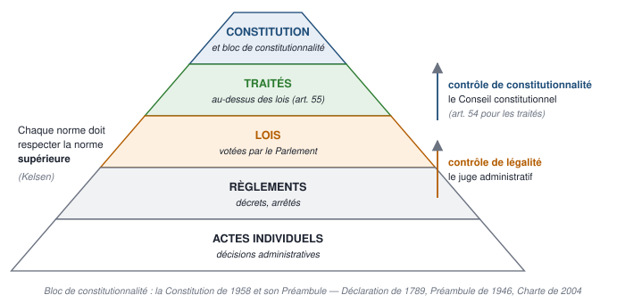
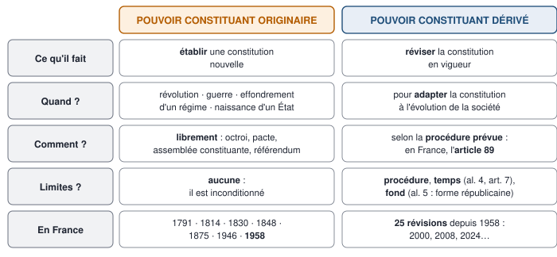
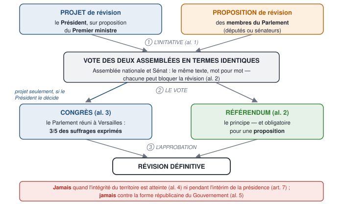
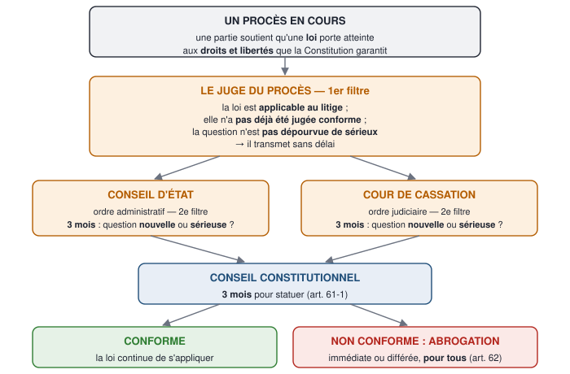
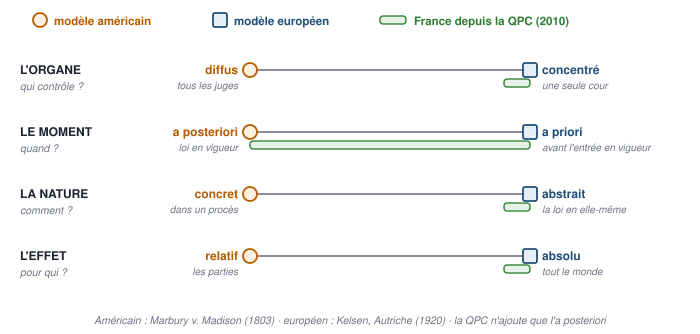
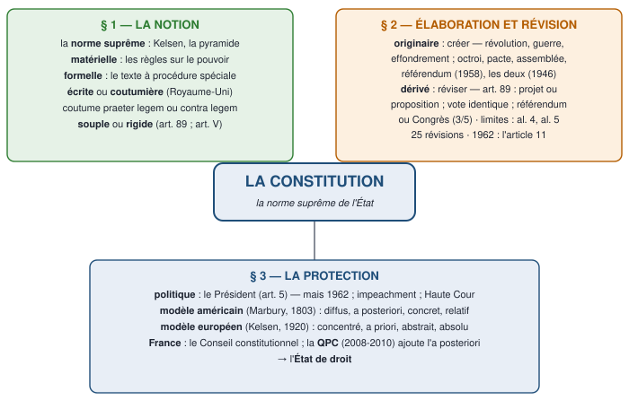

# 1 — Carte du chapitre

::: synthese Le chapitre en quelques lignes
La section 2 du chapitre « L'organisation du pouvoir dans l'État » s'intitule « **Un pouvoir organisé par une Constitution** ». Le cours l'étudie en trois paragraphes :

1. **La notion de constitution.** C'est la **norme suprême** de l'État, qui définit son fonctionnement. Deux approches : **matérielle** — le contenu, les règles sur le pouvoir — et **formelle** — le texte adopté selon une procédure spéciale. Il faut les deux, parce que certains États ont une constitution **coutumière** : le Royaume-Uni.
2. **L'élaboration et la révision.** Deux temps : l'**élaboration** relève du **pouvoir constituant originaire**, libre de toute règle — c'est un nouveau pacte de société ; la **révision** relève du **pouvoir constituant dérivé**, encadré par la constitution elle-même — en France, l'**article 89**, avec ses limites. Exception célèbre : la révision de **1962**, passée par l'article 11.
3. **La protection.** Par des **organes politiques** — le Président « veille au respect de la Constitution » (art. 5) — et surtout par des **juges** : deux modèles, **américain** (diffus, a posteriori, concret, effet relatif) et **européen** (concentré, a priori, abstrait, effet absolu), que la France complète depuis **2010** par la **QPC**. L'apport de la justice constitutionnelle : l'**État de droit**.
:::

**Ce qui tombe à l'examen** — le format de l'épreuve n'est pas encore connu (à demander en TD). Sur ce chapitre, les questions les plus probables : **définir** la constitution au sens matériel et au sens formel, le pouvoir constituant originaire et dérivé, la constitution souple et rigide, le contrôle de constitutionnalité, la QPC ; **distinguer** les deux pouvoirs constituants, les deux modèles de justice constitutionnelle ; **présenter** la procédure de l'article 89 et ses limites, la révision de 1962, la QPC ; une **question de réflexion** — le polycopié en donne une : « expliquer les différents modes de contrôle de constitutionnalité (US et Europe) ; en quoi ces modèles sont diffus ou concentrés ? ».

**Ce qu'il faut savoir par cœur**

| Quoi | Le contenu exact |
|---|---|
| La définition | La **norme suprême** de l'État : les règles qui organisent le pouvoir et, le plus souvent, garantissent les droits · au sens **matériel** (le contenu) et au sens **formel** (le texte, la procédure spéciale) |
| Les deux pouvoirs constituants | **Originaire** : établir une constitution nouvelle, sans règle préalable · **dérivé** : réviser la constitution en vigueur, selon ses propres règles |
| Les trois moments d'une création | Après une **révolution** (1789), une **guerre** (1946), l'**effondrement d'un régime** (1958) |
| L'article 89 | Initiative : le **Président sur proposition du Premier ministre** (projet) et les **parlementaires** (proposition) · vote des **deux assemblées en termes identiques** · puis **référendum**, ou, pour un projet, **Congrès** à la majorité des **3/5 des suffrages exprimés** · limites : al. 4 (intégrité du territoire), al. 5 (**forme républicaine**) |
| Les révisions | **25** depuis 1958, la dernière le **8 mars 2024** (IVG) : 22 par le Congrès, 1 par référendum de l'art. 89 (**2000**) · **1962** : par l'art. 11 |
| Les deux modèles | **Américain** — *Marbury v. Madison*, **1803** : **diffus, a posteriori, concret, effet relatif** · **européen** — Kelsen, Autriche, **1920** : **concentré, a priori, abstrait, effet absolu** |
| La QPC | **Art. 61-1**, révision du **23 juillet 2008**, applicable depuis le **1er mars 2010** · filtre du **Conseil d'État** ou de la **Cour de cassation** (3 mois), puis **Conseil constitutionnel** (3 mois) · **abrogation** (art. 62) |
| Les articles | **Art. 5** (le Président veille au respect de la Constitution) · **art. 11** (1962) · **art. 54** (traités) · **art. 61** (contrôle a priori) · **art. 61-1** (QPC) · **art. 62** (effets des décisions) · **art. 89** (révision) · **DDHC, art. 16** |

# 2 — Le cours reconstruit

## 2.1 — La notion de constitution

::: objectif À la fin de cette section, sans support, tu sais
- définir la constitution, norme suprême, et la situer au sommet de la hiérarchie des normes ;
- distinguer l'approche matérielle et l'approche formelle, et dire pourquoi il faut les deux ;
- distinguer constitutions écrites et coutumières, souples et rigides, avec leurs exemples ;
- expliquer le rôle de la coutume constitutionnelle, *praeter legem* et *contra legem*.
:::

### Au préalable : la norme suprême

::: definition Constitution
**En une phrase :** la règle la plus haute de l'État, qui dit qui gouverne et comment.

**Définition à connaître :** la constitution est la **norme suprême** de l'État : l'ensemble des règles — le plus souvent réunies dans un texte solennel — qui **définissent le fonctionnement de l'État**, c'est-à-dire la désignation des gouvernants, l'organisation des pouvoirs publics et leurs rapports, et, le plus souvent, les **droits et libertés** des citoyens. Toutes les autres normes doivent la respecter.
:::

**« Suprême »** veut dire deux choses (polycopié) : la constitution est la **première** norme — elle fonde l'État et ses pouvoirs — et elle est **au-dessus** de toutes les autres — elle leur est **supérieure**. Le juriste autrichien Hans **Kelsen** a représenté cet ordre par une **pyramide des normes** : chaque norme tient sa validité de la norme supérieure, et la constitution est au sommet.

- **La constitution** : le texte du **4 octobre 1958**, avec son **Préambule**, qui renvoie à la Déclaration des droits de l'homme et du citoyen de **1789**, au Préambule de **1946** et à la Charte de l'environnement de **2004** — l'ensemble forme le « **bloc de constitutionnalité** ».
- **Les traités** : ils ont « une autorité supérieure à celle des lois » (**art. 55**), mais restent **sous la Constitution** : un traité contraire à la Constitution ne peut être ratifié qu'après une **révision** (**art. 54**) — ce fut le cas pour le traité de Maastricht en 1992 (cours n° 2).
- **Les lois**, votées par le Parlement, puis **les règlements** — décrets, arrêtés — pris par le pouvoir exécutif, puis **les actes individuels**.

Au-delà du droit, la constitution a une **valeur symbolique** : elle marque la **naissance d'un État** — les États-Unis en 1787, les États africains après la décolonisation — ou d'un **nouveau régime** — la France en 1789, le Portugal en 1976, l'Espagne en 1978, les pays de l'Est après la chute du mur de Berlin, en 1989.

::: examen Point bonus : la définition « constitutionnaliste »
« Toute société dans laquelle la garantie des droits n'est pas assurée, ni la séparation des pouvoirs déterminée, n'a point de Constitution » (**article 16** de la Déclaration des droits de l'homme et du citoyen, **1789**). Pour les révolutionnaires, une vraie constitution ne se contente pas d'organiser le pouvoir : elle le **limite**, en garantissant les droits et en séparant les pouvoirs.
:::

### Deux approches de la notion : matérielle et formelle

Pour approfondir, le cours distingue **deux approches** de la notion de constitution.

::: definition Constitution au sens matériel
**En une phrase :** toutes les règles sur le pouvoir, quelle que soit leur forme.

**Définition à connaître :** au sens **matériel**, la constitution est l'**ensemble des règles relatives à l'organisation et au fonctionnement du pouvoir** dans l'État — sa forme, unitaire ou fédérale ; les titulaires du pouvoir ; les institutions, leurs rapports entre elles et avec les citoyens —, **quelle que soit leur forme** : texte constitutionnel, loi ordinaire ou coutume. Le critère est le **contenu**.
:::

Conséquence (notes) : **au sens matériel, tout État a une constitution**, car tout État a des règles, même non écrites, sur la dévolution et l'exercice du pouvoir.

::: definition Constitution au sens formel
**En une phrase :** le texte appelé « Constitution », adopté et révisé selon une procédure spéciale.

**Définition à connaître :** au sens **formel**, la constitution est le **texte adopté — et modifiable — selon une procédure spéciale**, différente et plus exigeante que celle des lois ordinaires, et qui a pour cette raison une **valeur supérieure** aux lois. Le critère est la **forme** — ou l'organe qui l'adopte, d'où le nom de critère **organique**. En France, c'est la Constitution du **4 octobre 1958**.
:::

**Pourquoi faut-il les deux définitions ?** Parce que certains États **n'ont pas de constitution formelle** : ils ont pourtant des règles qui organisent le pouvoir. On dit qu'ils ont une **constitution coutumière** : c'est le cas du **Royaume-Uni** (cours).

**Les deux critères coïncident le plus souvent** : la constitution formelle contient les règles fondamentales. **Mais pas toujours** :

| Cas | Exemples |
|---|---|
| Des règles **matériellement** constitutionnelles, mais **pas formellement** | Le **Royaume-Uni**, qui n'a pas de constitution formelle ; en France, les **modes de scrutin** et le financement des partis, fixés par de simples lois (cours n° 2), pour pouvoir les changer plus facilement |
| Des règles **formellement** constitutionnelles, mais **pas matériellement** | En Suisse, l'**article 102** de la Constitution de 1999 sur l'**approvisionnement du pays** — l'ancien article 23 bis de la Constitution de **1874**, inséré en 1929, visait même les « réserves de blé » — et l'ancien article 25 bis (**1893**), qui interdisait l'abattage des animaux sans étourdissement ; aux États-Unis, le **18e amendement**, qui interdisait l'alcool — la **prohibition** —, en vigueur de **1920** à son abrogation par le 21e amendement, en **1933** |

L'inscription d'une règle dans la constitution montre la volonté de la placer **au niveau juridique le plus élevé** — même si son importance est discutable (polycopié).

### Constitutions écrites et constitutions coutumières

**Les constitutions coutumières** sont aujourd'hui rares. Jusqu'au XVIIIe siècle, presque tous les États étaient régis par des règles coutumières : en France, les **lois fondamentales du royaume**, comme la **loi salique**, qui écartait les femmes de la succession au trône. **Le Royaume-Uni** est le grand exemple actuel — à nuancer, car sa constitution comporte des **textes écrits** : la Grande Charte (*Magna Carta*, **1215**), la Pétition des droits (**1628**), l'*Habeas Corpus* (**1679**), le *Bill of Rights* (**1689**), l'Acte d'établissement (**1701**), les *Parliament Acts* (**1911** et **1949**). Mais des règles essentielles y sont **purement coutumières** — le monarque nomme Premier ministre le chef du parti majoritaire, il ne préside pas le Cabinet — et elles sont respectées comme des obligations.

**Les constitutions écrites** apparaissent à la fin du XVIIIe siècle : celles des colonies britanniques d'Amérique devenues indépendantes (1776), puis la **Constitution fédérale des États-Unis** (**1787**) ; en Europe, la Constitution polonaise du **3 mai 1791**, quatre mois avant la première Constitution française, du **3 septembre 1791**, précédée de la Déclaration des droits de l'homme et du citoyen du 26 août 1789. Leurs avantages : la **lisibilité**, l'**accessibilité**, et une adoption plus démocratique, par une assemblée ou par référendum.

**La coutume constitutionnelle.** Même écrite, une constitution a des lacunes et des ambiguïtés : la pratique la complète, voire s'en écarte. Pour qu'il y ait **coutume**, il faut une pratique **répétée** et **constante** — sinon ce n'est qu'un **précédent** —, et l'accord des organes concernés sur son caractère obligatoire (l'*opinio juris*).

| | Coutume ***praeter legem*** — « à côté de la loi » | Coutume ***contra legem*** — « contre la loi » |
|---|---|---|
| Ce qu'elle fait | Elle **comble une lacune** du texte ou l'interprète | Elle **contredit** une disposition claire du texte |
| Exemple | Les lois constitutionnelles de 1875 ignoraient le président du Conseil, chef du Gouvernement : la pratique l'a créé, et la Constitution de 1946 l'a consacré (art. 45) | L'argument employé en 1962 pour justifier une révision par l'article 11 (section 2.3) |
| Admise ? | **Oui**, largement | **Discutée** : pour René **Capitant**, la nation souveraine peut abroger une règle en cessant de l'appliquer ; pour **Carré de Malberg** et la doctrine majoritaire, non — ce serait habiller une violation du droit « du manteau du droit » |

Bernard **Chantebout** y voit « la victoire du droit spontané sur le droit artificiel ». Sous la Ve République, la pratique a ainsi fait du Président, élu au suffrage universel direct depuis 1962, le véritable chef de l'exécutif, au-delà de la lettre du texte.

### Constitutions souples et constitutions rigides

::: definition Constitution souple et constitution rigide
**Souple :** une constitution **révisable dans les mêmes formes que la loi ordinaire**. Sa supériorité sur la loi n'est que théorique : une loi contraire la modifie. Exemples : le **Royaume-Uni**, **Israël**.

**Rigide :** une constitution **révisable seulement selon une procédure spéciale**, plus difficile que celle des lois — une majorité qualifiée, une assemblée spéciale, un référendum. Sa supériorité est **réelle**. Exemples : la **France** (art. 89), les **États-Unis** (art. V).
:::

- **La souplesse est dangereuse** pour les droits des citoyens, livrés aux majorités du moment ; **la rigidité protège les minorités** contre la loi du nombre. Un **État fédéral** a besoin d'une constitution rigide, qui associe les États fédérés à sa révision : aux États-Unis, un amendement doit être ratifié par les **trois quarts des États** (chapitre 1).
- **Une rigidité absolue** bloquerait toute évolution : les constitutions se situent sur une **échelle de rigidité**.
- **Écrite ne veut pas dire rigide** : les Chartes de 1814 et de 1830, muettes sur leur révision, étaient souples. **Coutumière ne veut pas dire souple** : les lois fondamentales de l'Ancien Régime s'imposaient même au roi.

::: piege Trois couples à ne pas mélanger
- **Matérielle / formelle** : le critère du **contenu** contre le critère de la **forme**.
- **Écrite / coutumière** : un **texte** contre une **pratique**.
- **Rigide / souple** : une **procédure de révision spéciale** contre la procédure de la loi.

Ils ne se recoupent pas : le Royaume-Uni a une constitution matérielle, surtout coutumière, et souple ; la Charte de 1814 était écrite et souple.
:::

## 2.2 — L'élaboration : le pouvoir constituant originaire

::: objectif À la fin de cette section, sans support, tu sais
- distinguer les deux temps de la vie d'une constitution et les deux pouvoirs constituants ;
- définir le pouvoir constituant originaire et expliquer pourquoi il n'est limité par rien ;
- donner les trois moments où naît une constitution, avec leurs exemples ;
- présenter les modes d'établissement — autoritaires et démocratiques — avec les exemples français.
:::

### Deux temps, deux pouvoirs

La vie d'une constitution connaît **deux temps** (cours) :

1. **L'élaboration**, qui correspond à l'intervention du **pouvoir constituant originaire** ;
2. **La révision**, qui correspond à l'intervention du **pouvoir constituant dérivé** (section 2.3).

::: definition Pouvoir constituant originaire
**En une phrase :** le pouvoir d'écrire une constitution nouvelle, en partant de zéro.

**Définition à connaître :** le pouvoir constituant originaire est le pouvoir d'**établir une constitution nouvelle**, dans un État qui n'en a pas ou lorsque l'ordre constitutionnel ancien a disparu. Il est **inconditionné** : aucune règle juridique préalable ne s'impose à lui.
:::

::: examen Point bonus : Sieyès et le pouvoir constituant
La distinction vient de l'abbé **Sieyès** (*Qu'est-ce que le tiers état ?*, **1789**) : le **pouvoir constituant**, qui fait la constitution, se distingue des **pouvoirs constitués** — Parlement, Gouvernement, juges —, qui tiennent d'elle leur existence et doivent la respecter.
:::

### La création : l'établissement d'un nouveau pacte de société

Créer une constitution, c'est **établir un nouveau pacte de société** (cours) : on décide de refonder la société, et la constitution énonce souvent **les valeurs** de la société nouvelle — la Déclaration de 1789, le Préambule de 1946, l'article 1er de la Constitution de 1958 : « La France est une République indivisible, laïque, démocratique et sociale ».

Une constitution nouvelle est aussi une **réaction** contre la précédente — celle de 1958 contre celle de 1946, qui s'était voulue une réaction contre les lois de 1875 — et une **imitation** partielle — la Charte de 1830 recopie en partie celle de 1814 ; la Constitution de 1958 reprend celle de 1946 sur les points qui ne faisaient pas débat (polycopié).

**À quel moment ?** On écrit une constitution quand on veut **mettre fin au système précédent**. Le cours retient **trois moments** :

| Moment | Exemples |
|---|---|
| **Après une révolution** | La France en **1789-1791** ; la Russie en 1917 |
| **Après une guerre** | La France en **1946**, à la Libération ; l'Italie en 1947 ; l'Allemagne en 1949 |
| **Après l'effondrement d'un régime** | La France en **1958**, après l'échec de la IVe République ; le Portugal en 1976 et l'Espagne en 1978, après des dictatures ; l'Europe de l'Est après 1989 |

Le polycopié ajoute un quatrième cas : la **naissance d'un État**, après son indépendance — les États-Unis en 1787, les États africains après la décolonisation.

**Une limitation dans le processus de création ?** **Non** (notes) : le pouvoir constituant originaire **n'est limité par rien**. Il a une **totale liberté** de création : il peut garantir les libertés des citoyens comme établir une dictature. Et **aucune procédure** ne s'impose à lui : les gouvernants du moment choisissent librement la manière d'élaborer le texte. Tout au plus est-il contraint **en fait** — par le contexte politique, par l'imitation des textes antérieurs ; certains auteurs invoquent des principes supérieurs, comme le droit naturel, mais aucun juge ne les sanctionne.

### Les modes d'établissement

En France, des constitutions ont été **imposées**, d'autres **rédigées par une assemblée**, d'autres **soumises au référendum** (notes). Le polycopié classe ces modes en deux familles.

#### Les modes autoritaires

- **L'octroi** : le titulaire du pouvoir **accorde** une constitution par un acte unilatéral, sans participation du peuple. Exemple : la **Charte du 4 juin 1814**, par laquelle Louis XVIII déclare avoir « volontairement, et par le libre exercice de [son] autorité royale, accordé et accord[er], fait concession et octroi à [ses] sujets » de la Charte constitutionnelle.
- **Le pacte** : la constitution est **négociée** entre le monarque et les représentants de la nation. Exemple : la **Charte du 14 août 1830**, amendée par les Chambres le 7 août et acceptée le 9 par le futur Louis-Philippe. Le mot « charte » évitait celui de « constitution », qui évoquait trop l'accord du peuple.

#### Les modes démocratiques

Dans une démocratie, le pouvoir constituant, première manifestation de la souveraineté, appartient au **peuple**. Quatre procédés :

1. **Le référendum constituant** : le peuple approuve, par oui ou par non, un texte préparé par les gouvernants, **sans participer à sa rédaction**. Le choix peut n'être qu'illusoire : la Constitution de l'**an VIII** — 22 frimaire an VIII, soit le 13 décembre 1799 — et celle du **14 janvier 1852** ont établi des « régimes autoritaires à habillage démocratique » (Chantebout) ; en 1852, le plébiscite des 20 et 21 décembre 1851 avait même donné d'avance à Louis-Napoléon Bonaparte le pouvoir de faire une constitution. C'est aussi le procédé de **1958** : la **loi constitutionnelle du 3 juin 1958** confie au Gouvernement la rédaction d'un projet, soumis au **référendum du 28 septembre 1958** ; la Constitution est **promulguée le 4 octobre 1958**.
2. **L'assemblée constituante** : le peuple élit une assemblée chargée de rédiger la constitution ; la rédaction est **publique**, le texte discuté, amendé, voté. Le risque : que les constituants se taillent des pouvoirs sur mesure. Pour l'éviter, un **décret du 16 mai 1791**, voté sur proposition de Robespierre, a interdit aux membres de la Constituante de siéger dans l'assemblée suivante. La constituante peut n'avoir que cette mission — la **Convention de Philadelphie**, en **1787** — ou gouverner et légiférer en même temps — la Convention de 1792-1795, l'assemblée de 1945-1946. Le travail dure de un an (1945-1946) à quatre ans (1871-1875).
3. **L'assemblée constituante puis le référendum** — un procédé de démocratie semi-directe, **le plus démocratique** : l'assemblée rédige, le peuple accepte ou refuse. Exemple : **1946**. Le **référendum du 21 octobre 1945** décide que l'assemblée élue le même jour sera constituante ; son projet est **rejeté par référendum le 5 mai 1946** ; une seconde assemblée, élue le **2 juin 1946**, fait adopter le sien le **13 octobre 1946** ; la Constitution est promulguée le **27 octobre 1946**.
4. **La rédaction et l'adoption par le peuple lui-même** : possible seulement dans de très petites communautés.

| Mode | Exemples français |
|---|---|
| **Octroi** | Charte du 4 juin 1814 |
| **Pacte** | Charte du 14 août 1830 |
| **Assemblée constituante** | 1791 ; 1848 ; les lois constitutionnelles de 1875 |
| **Référendum sur un texte des gouvernants** | An VIII (1799) ; 1852 ; **1958** |
| **Assemblée constituante, puis référendum** | 1793 et 1795 ; **1946** |

::: piege Deux erreurs sur la création
- La création d'une constitution relève du pouvoir constituant **originaire**, pas du pouvoir dérivé : le dérivé, c'est la **révision**.
- La Constitution de 1958 a été **approuvée par référendum le 28 septembre 1958** et **promulguée le 4 octobre 1958** — pas « adoptée le 4 octobre ».
:::

## 2.3 — La révision : le pouvoir constituant dérivé

::: objectif À la fin de cette section, sans support, tu sais
- définir le pouvoir constituant dérivé et justifier la révision ;
- présenter la procédure de l'article 89, étape par étape, avec la majorité du Congrès ;
- énumérer les limites de la révision — de forme, de temps, de fond — et discuter leur portée ;
- raconter la révision de 1962 et expliquer pourquoi elle est contestée.
:::

::: definition Pouvoir constituant dérivé
**En une phrase :** le pouvoir de modifier la constitution en vigueur, en suivant ses propres règles.

**Définition à connaître :** le pouvoir constituant dérivé — ou institué — est le pouvoir de **réviser** la constitution — lui ajouter, lui retirer ou modifier une disposition —, exercé par les organes et selon la **procédure que la constitution elle-même prévoit**. Il est « dérivé » parce qu'il découle de la constitution existante.
:::

### La justification

Il faut pouvoir **adapter la constitution à l'évolution de la société** (notes) ; une révision partielle vaut mieux qu'un changement complet, une révolution ou un coup d'État (polycopié).

- **En France**, la Constitution de 1958 a été révisée **25 fois**, la dernière le **8 mars 2024**, pour inscrire à l'article 34 que « la loi détermine les conditions dans lesquelles s'exerce la **liberté garantie à la femme d'avoir recours à une interruption volontaire de grossesse** ».
- **Aux États-Unis**, la Constitution de **1787** n'a été modifiée qu'à intervalles éloignés, par **27 amendements** qui s'ajoutent au texte — les dix premiers, en 1791, forment la déclaration des droits (*Bill of Rights*).

### La procédure de l'article 89

Les constitutions confient l'**initiative** de la révision au gouvernement, au parlement ou au peuple — l'initiative populaire existe en Suisse, et exista en France dans la Constitution de 1793 — et son **adoption** au parlement, à une assemblée spéciale ou au peuple, souvent avec une **majorité qualifiée** : deux tiers, trois cinquièmes (polycopié). En France, c'est l'**article 89** :

> « L'initiative de la révision de la Constitution appartient concurremment au Président de la République sur proposition du Premier ministre et aux membres du Parlement.
>
> Le projet ou la proposition de révision doit être examiné dans les conditions de délai fixées au troisième alinéa de l'article 42 et voté par les deux assemblées en termes identiques. La révision est définitive après avoir été approuvée par référendum.
>
> Toutefois, le projet de révision n'est pas présenté au référendum lorsque le Président de la République décide de le soumettre au Parlement convoqué en Congrès ; dans ce cas, le projet de révision n'est approuvé que s'il réunit la majorité des trois cinquièmes des suffrages exprimés. Le bureau du Congrès est celui de l'Assemblée nationale.
>
> Aucune procédure de révision ne peut être engagée ou poursuivie lorsqu'il est porté atteinte à l'intégrité du territoire.
>
> La forme républicaine du Gouvernement ne peut faire l'objet d'une révision. »

**Les trois étapes :**

1. **L'initiative** — deux voies : le **Président de la République, sur proposition du Premier ministre** : c'est un **projet** de loi constitutionnelle ; les **membres du Parlement**, députés ou sénateurs : c'est une **proposition** de loi constitutionnelle.
2. **Le vote par les deux assemblées en termes identiques** : l'Assemblée nationale et le Sénat doivent adopter **le même texte, mot pour mot**. Chacune dispose donc d'un **droit de veto** : le Sénat peut bloquer une révision.
3. **L'adoption définitive** : par **référendum** — c'est le principe ; mais, **pour un projet seulement**, le Président peut choisir de le soumettre au **Parlement convoqué en Congrès** — les deux assemblées réunies à Versailles —, qui doit l'approuver à la **majorité des trois cinquièmes des suffrages exprimés**. Une **proposition** doit passer par le référendum.

::: formule La majorité des trois cinquièmes au Congrès
$$ \text{voix nécessaires} \geq \frac{3}{5} \times \text{suffrages exprimés} $$
Le Congrès réunit **577 députés et 348 sénateurs, soit 925 parlementaires** ; la majorité se calcule sur les **suffrages exprimés**, pas sur les 925. Si le résultat n'est pas un nombre entier, on prend l'entier immédiatement supérieur.
:::

::: exemple Deux votes du Congrès, recalculés
- **Révision du 23 juillet 2008** : 896 suffrages exprimés ; 3 ÷ 5 × 896 = 537,6, donc **538** voix nécessaires. Elle a obtenu **539** voix : adoptée à **une voix près**.
- **Révision du 8 mars 2024** (IVG) : 780 voix pour, 72 contre, soit 852 exprimés ; 3 ÷ 5 × 852 = 511,2, donc **512** voix nécessaires. Avec 780 voix, elle a été largement adoptée.
:::

**La pratique.** Toutes les révisions adoptées sont des **projets**, donc d'initiative présidentielle (notes) : aucune proposition n'a abouti, puisqu'elle exigerait un référendum. Sur les **25 révisions**, **22** ont été approuvées par le **Congrès** ; **une seule** par référendum selon l'article 89 : le **quinquennat**, le **24 septembre 2000** ; les deux autres ont suivi d'autres voies — **1962**, par l'article 11, et **1960**, par une procédure propre à la Communauté (l'ancien article 85).

::: piege Trois erreurs à ne pas faire sur l'article 89
- L'initiative n'appartient pas au Président seul : il agit **sur proposition du Premier ministre**, et les **parlementaires** l'ont aussi.
- Le Congrès n'est **pas une troisième assemblée**, ni une assemblée distincte du Parlement : c'est **le Parlement convoqué en Congrès**.
- La majorité des **trois cinquièmes** se calcule sur les **suffrages exprimés**, et le Congrès n'est possible que pour un **projet**.
:::

### Les limites de la révision

La constitution **limite elle-même** le pouvoir constituant dérivé (notes). Le cours distingue les limites **d'ordre formel** et **d'ordre matériel** :

| Limites | Ce qu'elles interdisent | En France |
|---|---|---|
| **Formelles** : la procédure | Réviser autrement que par la procédure prévue | L'**article 89** : initiative, vote identique des deux assemblées, référendum ou Congrès aux trois cinquièmes |
| **Formelles** : le moment | Réviser **dans certaines circonstances** | **Art. 89 al. 4** : pas de révision « lorsqu'il est porté atteinte à l'**intégrité du territoire** » — hérité de 1946, en souvenir de la révision de juillet 1940, sous l'Occupation · **art. 7, dernier alinéa** : pas de révision pendant l'**intérim** de la présidence · le Conseil constitutionnel y ajoute la période de l'**article 16** |
| **Matérielles** : le contenu | **Toucher à certaines règles** | **Art. 89 al. 5** : « La **forme républicaine du Gouvernement** ne peut faire l'objet d'une révision » — déjà dans la loi constitutionnelle du **14 août 1884** |

D'autres constitutions ont leurs limites matérielles : la **Loi fondamentale allemande** (art. 79, al. 3) protège le fédéralisme et les principes fondamentaux — dignité humaine, démocratie, État de droit ; la Constitution **portugaise** en dresse une liste (art. 288).

**Quelle est la portée de ces limites ?** C'est la question du polycopié.

- **Pour le doyen Georges Vedel**, le pouvoir constituant dérivé n'est pas d'une autre nature que le pouvoir originaire : la constitution limite sa **procédure**, pas l'**étendue** de la révision. D'où la théorie de la **double révision** : pour changer la forme républicaine, il suffirait de supprimer d'abord, régulièrement, l'alinéa 5 de l'article 89, puis de réviser le reste.
- **Le Conseil constitutionnel** a jugé que, **sous réserve** des limites de temps (articles 7, 16 et 89 al. 4) et du respect de l'alinéa 5, « le pouvoir constituant est souverain ; [...] il lui est loisible d'abroger, de modifier ou de compléter des dispositions de valeur constitutionnelle dans la forme qu'il estime appropriée » (décision **92-312 DC** du **2 septembre 1992**, *Maastricht II*).
- **Mais aucun juge ne sanctionne ces limites** : le Conseil constitutionnel s'est déclaré **incompétent** pour contrôler une loi de révision constitutionnelle (décision **2003-469 DC** du **26 mars 2003**). Leur respect dépend donc des acteurs politiques. Sont-elles « supraconstitutionnelles » ? Le débat reste ouvert.

::: piege La citation tronquée de Maastricht II
Le polycopié cite la décision de 1992 — « Le pouvoir constituant est souverain » — **sans ses réserves**. Or le Conseil commence par elles : la souveraineté du pouvoir constituant s'exerce **sous réserve** des périodes interdites (art. 7, 16, 89 al. 4) et de la **forme républicaine** (art. 89 al. 5). Et pour lever l'interdiction de toucher à la forme républicaine, c'est l'**alinéa 5** de l'article 89 qu'il faudrait réviser — non l'alinéa 4, comme l'écrit le polycopié.
:::

### Le cas de la révision de 1962

C'est la seule révision **réussie** en dehors de l'article 89 — si l'on met à part celle de 1960, propre à la Communauté.

1. **Le projet.** En 1958, le Président est élu par un collège d'environ 80 000 grands électeurs. Après l'attentat du Petit-Clamart (**22 août 1962**), le général **de Gaulle** veut qu'il soit **élu au suffrage universel direct**.
2. **L'obstacle.** L'article 89 exige un vote des deux assemblées en termes identiques : le Parlement, et d'abord le Sénat, y est hostile.
3. **Le contournement.** De Gaulle soumet directement le projet au peuple par l'**article 11** — le référendum sur « l'organisation des pouvoirs publics » —, sans passer par le Parlement.
4. **La contestation.** Pour la plupart des juristes, l'article 11 permet d'adopter des **lois**, pas de **réviser la Constitution**, qui a sa procédure propre, l'article 89 — son titre XVI s'intitule « De la révision ». Le président du Sénat, Gaston **Monnerville**, parle de « **forfaiture** ». L'Assemblée nationale renverse le gouvernement Pompidou par une **motion de censure**, le **5 octobre 1962** ; de Gaulle **dissout** l'Assemblée.
5. **Le résultat.** Le **référendum du 28 octobre 1962** approuve la réforme à environ **62 %**. Saisi par le président du Sénat, le Conseil constitutionnel se déclare **incompétent** : une loi adoptée par référendum est « l'**expression directe de la souveraineté nationale** » (décision **62-20 DC** du **6 novembre 1962**). Les électeurs donnent ensuite la majorité aux partisans du Général, aux législatives de novembre 1962.
6. **La suite.** En **1969**, de Gaulle tente de nouveau une révision par l'article 11 — la réforme du Sénat et la création des régions — : le « non » l'emporte le **27 avril 1969**, et il démissionne. Depuis, l'article 11 n'a plus servi à réviser la Constitution.

::: examen Ce que 1962 permet d'illustrer
- **La coutume *contra legem*** : l'approbation populaire aurait-elle couvert l'irrégularité ? Oui pour Capitant ; non pour la doctrine majoritaire.
- **Les limites de la protection politique** de la Constitution : le gardien désigné par l'article 5, le Président, s'en est lui-même écarté (section 2.4).
- **L'absence de juge** pour les lois référendaires : le Conseil constitutionnel refuse de les contrôler.
:::

## 2.4 — La protection de la constitution

::: objectif À la fin de cette section, sans support, tu sais
- expliquer pourquoi la constitution doit être protégée, et présenter la protection politique et ses limites ;
- définir le contrôle de constitutionnalité et ses quatre critères ;
- comparer les modèles américain et européen, avec leur origine et leurs caractères ;
- présenter le Conseil constitutionnel et la QPC, étape par étape, et dire ce que la QPC change ;
- relier la justice constitutionnelle à l'État de droit.
:::

**Pourquoi protéger la constitution ?** Parce que les acteurs politiques peuvent être tentés de s'écarter de leurs obligations constitutionnelles (notes) : la méconnaissance de la constitution est une « tentation permanente » pour le pouvoir, puisqu'elle est faite pour le **limiter** (polycopié). Sans sanction, sa supériorité ne serait que théorique. Le cours distingue **deux protections** : par des organes **politiques**, et par des organes **juridictionnels**.

### La protection par des organes politiques

- **Le Président de la République** : « Le Président de la République **veille au respect de la Constitution**. Il assure, par son arbitrage, le fonctionnement régulier des pouvoirs publics ainsi que la continuité de l'État » (**art. 5**) ; l'**article 16** lui donne des pouvoirs exceptionnels lorsque les institutions sont menacées.
- **Sa limite** (notes) : le Président peut lui-même chercher à ne pas respecter la Constitution — comme en 1962. Qui gardera le gardien ?
- **Les autres sanctions politiques** (polycopié) : la **résistance à l'oppression**, « droit naturel et imprescriptible » (DDHC, **art. 2**), que la Constitution de 1791 confiait, dans sa dernière phrase, « à la vigilance des pères de famille, aux épouses et aux mères, à l'affection des jeunes citoyens, au courage de tous les Français » ; la **mise en accusation des gouvernants** — l'***impeachment*** : aux États-Unis, la Chambre des représentants accuse, le Sénat juge, à la majorité des deux tiers ; en France, la **destitution** du Président par le **Parlement constitué en Haute Cour**, depuis la révision du **23 février 2007**, « en cas de manquement à ses devoirs manifestement incompatible avec l'exercice de son mandat », à la majorité des **deux tiers** (art. 68) ; pour les ministres, la **Cour de justice de la République** (révision du 27 juillet 1993).

**Ces mécanismes sont lourds et peu efficaces** : aux États-Unis, quatre présidents ont été jugés par le Sénat — Andrew Johnson en 1868, Bill Clinton en 1999, Donald Trump en 2020 et en 2021 — et tous ont été **acquittés** ; Richard Nixon a préféré démissionner avant d'être mis en accusation, en 1974. Surtout, ils ne visent pas la violation la plus fréquente et la plus insidieuse : celle de la Constitution **par la loi**. Pour elle, il faut un juge.

### La protection par des juges : le contrôle de constitutionnalité

::: definition Contrôle de constitutionnalité
**En une phrase :** un juge vérifie qu'une loi respecte la Constitution.

**Définition à connaître :** le contrôle de constitutionnalité est le contrôle, par un **juge**, de la **conformité des lois — et des autres normes — à la Constitution**, avec pour sanction de les **écarter** ou de les **annuler** lorsqu'elles la méconnaissent.
:::

Il suppose une constitution **formelle** et **rigide** : si une loi ordinaire pouvait modifier la constitution, il n'y aurait rien à contrôler. Le cours l'étudie à travers le contrôle **de la loi**, l'acte politique essentiel (notes). **Quatre critères** permettent de décrire tout système de contrôle :

| Critère | La question | Les deux réponses |
|---|---|---|
| **L'organe** | Qui contrôle ? | **Diffus** : tous les juges du pays · **concentré** : une seule juridiction, spécialisée |
| **Le moment** | Quand ? | **A priori** : avant l'entrée en vigueur de la loi · **a posteriori** : sur une loi déjà en vigueur, appliquée |
| **La nature** | Comment le juge examine-t-il la loi ? | **Concret** : à l'occasion d'un procès, dans son application à un cas · **abstrait** : en elle-même, dans toutes ses applications possibles, hors de tout litige |
| **L'effet** | Pour qui vaut la décision ? | **Relatif** : seulement pour les parties au procès · **absolu** (*erga omnes*) : pour tout le monde |

#### Le modèle américain

**Son origine : un arrêt.** La Constitution de 1787 ne dit pas qui la fait respecter. C'est la **Cour suprême** qui s'est reconnu ce pouvoir, dans l'arrêt ***Marbury v. Madison*** (**1803**), sous la présidence du *Chief Justice* John **Marshall** : une loi contraire à la Constitution est nulle, et le juge doit faire prévaloir la Constitution — « il appartient par excellence au pouvoir judiciaire de dire ce qu'est le droit ». La Cour y a d'ailleurs écarté une disposition d'une loi fédérale : c'est la **première** déclaration d'inconstitutionnalité — la deuxième viendra en **1857**, avec l'arrêt *Dred Scott*, sur l'esclavage.

**Ses caractères** (cours et notes) :

- **diffus** : **tous les tribunaux** du pays peuvent contrôler la constitutionnalité d'une loi, avec à leur tête la Cour suprême ;
- **a posteriori** : il porte sur une **loi en vigueur**, déjà appliquée ;
- **concret** : il intervient **à l'occasion d'un procès** qui a un autre objet — une affaire de propriété, par exemple : une partie soulève l'**exception d'inconstitutionnalité**, et le juge regarde la manière dont la loi s'applique au cas ;
- **effet relatif de la chose jugée** : la loi jugée inconstitutionnelle est **écartée pour ce procès**, mais elle **reste en vigueur** en dehors.

**Une nuance décisive** : en pratique, l'effet relatif est corrigé par la règle du **précédent** (*stare decisis*) — les juridictions inférieures suivent les décisions de la Cour suprême. Une loi qu'elle déclare inconstitutionnelle cesse donc d'être appliquée partout. La Cour filtre sévèrement les affaires : elle en accepte environ **1 %** et en juge une **soixantaine par an**. Sa puissance est telle qu'on a parlé de « **gouvernement des juges** » (Édouard **Lambert**, 1921) — elle s'est opposée au *New Deal* de Roosevelt dans les années 1930, et a rendu à chaque État le droit de régler l'avortement en 2022 (chapitre 1).

#### Le modèle européen

**Son fondement : la loi, expression de la souveraineté nationale** (cours). En Europe, et d'abord en France, on a longtemps estimé que les juges n'avaient **pas la légitimité** pour remettre en cause la loi, votée par les représentants élus (notes) : « La loi est l'expression de la volonté générale » (DDHC, **art. 6**). C'est le **légicentrisme**. Les révolutionnaires se méfiaient des juges — les parlements d'Ancien Régime avaient bloqué les réformes — et la loi des **16-24 août 1790** leur interdit de s'immiscer dans le pouvoir législatif. Sous la IIIe République, le Conseil d'État refuse encore d'examiner la constitutionnalité d'une loi (arrêt ***Arrighi***, **6 novembre 1936**).

**Sa naissance : une théorie.** Au XXe siècle, on constate que des lois peuvent porter atteinte à la constitution (notes). Le juriste autrichien Hans **Kelsen** en tire la théorie : pour garantir la hiérarchie des normes, il faut **une juridiction spécialisée** chargée de contrôler la loi. Il fait créer une **Cour constitutionnelle** en **Autriche**, par la Constitution de **1920**. Sieyès en avait eu l'idée dès l'an III (1795), avec un « jury constitutionnaire », rejeté. Après la Seconde Guerre mondiale et les dictatures, le modèle se répand : **Italie** (Constitution de 1947), **Allemagne** (Loi fondamentale de 1949, Cour de Karlsruhe), puis **Espagne** (1978), **Portugal**, et l'Europe de l'Est après 1989.

**Ses caractères** (cours et notes) :

- **concentré** : **une seule juridiction** peut contrôler la loi — une cour constitutionnelle, placée hors des tribunaux ordinaires, dont les membres sont **désignés par des autorités politiques** ; en France, le **Conseil constitutionnel** ;
- **a priori** : le contrôle a lieu **après le vote de la loi mais avant son entrée en vigueur**, pour qu'aucune loi inconstitutionnelle ne soit appliquée ;
- **abstrait** : le juge examine la loi **en elle-même**, dans toutes ses applications possibles, sans litige ;
- **effet absolu de la chose jugée** : la décision vaut **pour tous** ; une loi jugée contraire à la Constitution **n'entre pas en vigueur**.

::: piege L'a priori n'est pas la règle en Europe
L'**a priori** décrit surtout le modèle **français d'avant 2010**. La plupart des cours constitutionnelles européennes contrôlent aussi, voire surtout, **a posteriori** : en Allemagne, en Italie, en Espagne, les juges ordinaires leur renvoient les questions de constitutionnalité soulevées dans les procès, et les particuliers peuvent les saisir de recours pour violation de leurs droits fondamentaux (polycopié). Retiens la présentation du cours — concentré, a priori, abstrait, effet absolu — **en ajoutant cette nuance**.
:::

#### Le Conseil constitutionnel

- **Sa composition** (art. 56) : **neuf membres**, nommés pour **neuf ans**, non renouvelables, renouvelés **par tiers tous les trois ans** — trois par le **Président de la République**, trois par le **président de l'Assemblée nationale**, trois par le **président du Sénat** ; les anciens Présidents de la République en sont membres de droit.
- **Le contrôle a priori des lois** (art. 61) : **obligatoire** pour les lois organiques et les règlements des assemblées ; **facultatif** pour les lois ordinaires, qui peuvent lui être déférées **avant leur promulgation** par le Président de la République, le Premier ministre, le président de l'Assemblée nationale, le président du Sénat et, depuis la révision du **29 octobre 1974**, **soixante députés ou soixante sénateurs** — l'opposition peut ainsi le saisir. Il statue en **un mois**, huit jours en cas d'urgence.
- **Les traités** (art. 54) : s'il juge qu'un engagement international contient une clause contraire à la Constitution, la ratification exige d'abord une **révision** — ce fut le cas pour Maastricht, en 1992.
- **Le tournant de 1971** : le Conseil contrôle la loi au regard du **Préambule**, donc de la Déclaration de 1789 et du Préambule de 1946 : c'est la naissance du **bloc de constitutionnalité** (décision **71-44 DC** du **16 juillet 1971**, *Liberté d'association*). Il devient le protecteur des droits et libertés.
- **L'effet de ses décisions** (art. 62) : une disposition déclarée inconstitutionnelle a priori « ne peut être promulguée ni mise en application » ; ses décisions « ne sont susceptibles d'aucun recours » et « s'imposent aux pouvoirs publics et à toutes les autorités administratives et juridictionnelles ».

#### La question prioritaire de constitutionnalité

Le contrôle a priori laissait un angle mort : des **lois déjà en vigueur**, jamais soumises au Conseil, pouvaient être inconstitutionnelles sans qu'aucun juge ne puisse le dire (notes). D'où la **QPC**.

::: definition Question prioritaire de constitutionnalité
**En une phrase :** le droit, pour une partie à un procès, de contester une loi qui porte atteinte à ses droits constitutionnels.

**Définition à connaître :** la QPC est la procédure par laquelle **une partie à un procès**, devant une juridiction administrative ou judiciaire, soutient qu'**une disposition législative** applicable à son litige **porte atteinte aux droits et libertés que la Constitution garantit** ; après un double filtrage, le **Conseil constitutionnel** statue et peut **abroger** la disposition (**art. 61-1**). Créée par la révision du **23 juillet 2008**, elle s'applique depuis le **1er mars 2010** (loi organique du 10 décembre 2009).
:::

**La procédure, étape par étape :**

1. **Une partie soulève la question** au cours d'un procès, par un écrit distinct et motivé ; le juge ne peut pas la soulever lui-même.
2. **Le juge du procès** vérifie trois conditions : la loi est **applicable au litige** ; elle n'a **pas déjà été déclarée conforme** à la Constitution par le Conseil constitutionnel, sauf changement des circonstances ; la question n'est **pas dépourvue de caractère sérieux**. Il la transmet alors, sans délai, à la juridiction suprême de son ordre : le **Conseil d'État** ou la **Cour de cassation**.
3. **Le Conseil d'État ou la Cour de cassation** dispose de **trois mois** pour décider s'il renvoie la question au Conseil constitutionnel : elle doit être **nouvelle** ou **sérieuse**. C'est le **double filtre**.
4. **Le Conseil constitutionnel** dispose à son tour de **trois mois** pour statuer.
5. **L'effet** (art. 62) : la disposition déclarée inconstitutionnelle est **abrogée**, soit à la publication de la décision, soit à une **date ultérieure** qu'il fixe, pour laisser au législateur le temps de la remplacer.

::: exemple Une QPC célèbre : la garde à vue
Le **30 juillet 2010**, saisi de plusieurs QPC, le Conseil constitutionnel juge le régime de la garde à vue contraire à la Constitution, faute notamment de l'assistance effective d'un avocat. Pour ne pas vider les commissariats du jour au lendemain, il **reporte l'abrogation au 1er juillet 2011** ; le législateur adopte entre-temps la loi du 14 avril 2011. L'exemple montre l'**effet absolu** et l'**abrogation différée**.
:::

**Ce que la QPC change — et ne change pas** (cours et notes) :

- **elle ne change pas** le caractère **concentré** du modèle — seul le Conseil constitutionnel peut abroger la loi, les autres juges ne font que transmettre —, ni son caractère **abstrait** — le Conseil ne juge pas l'affaire, il juge la loi —, ni l'**effet absolu** de ses décisions ;
- **elle ajoute** un contrôle **a posteriori** : le modèle français devient **a priori + a posteriori**.

::: examen Pourquoi « prioritaire » ?
Parce que le juge saisi à la fois d'une question de constitutionnalité et d'une question de conformité de la loi aux traités — le droit de l'Union européenne, la Convention européenne des droits de l'homme — doit examiner **d'abord** la question de constitutionnalité.
:::

**Les deux modèles, et la France depuis 2010 :**

| | Modèle américain | Modèle européen | France depuis la QPC |
|---|---|---|---|
| Fondement | Une pratique : *Marbury v. Madison* (1803) | Une théorie : Kelsen, Autriche (1920) | Révision du 23 juillet 2008 (art. 61-1) |
| Organe | **Diffus** : tous les juges | **Concentré** : une cour constitutionnelle | **Concentré** : le Conseil constitutionnel |
| Moment | **A posteriori** | **A priori** | **A priori + a posteriori** |
| Nature | **Concret** | **Abstrait** | **Abstrait** — même si la QPC naît d'un procès |
| Effet | **Relatif** — corrigé par le précédent | **Absolu** | **Absolu** : abrogation |

### L'apport de la justice constitutionnelle : l'État de droit

::: definition État de droit
**En une phrase :** un État soumis à son propre droit, sous le contrôle de juges.

**Définition à connaître :** l'État de droit est un État dans lequel **les pouvoirs publics sont eux-mêmes soumis au droit**, dans le respect de la hiérarchie des normes, et où cette soumission est **garantie par des juges** : le juge administratif contrôle les actes de l'administration, le juge constitutionnel contrôle la loi.
:::

Aux États-Unis comme en Europe, la justice constitutionnelle a développé l'État de droit (notes) : **les citoyens comme les pouvoirs publics** voient leur activité **encadrée et sanctionnée par le droit**. Le Conseil constitutionnel l'a formulé : « la loi votée [...] n'exprime la volonté générale que dans le respect de la Constitution » (décision **85-197 DC** du **23 août 1985**) — la fin du légicentrisme.

**La critique** : le « **gouvernement des juges** », qui substitueraient leurs choix à ceux des élus. **La réponse** classique : le juge constitutionnel n'a pas le dernier mot, puisque le pouvoir constituant peut toujours **réviser la Constitution** pour surmonter une décision. Georges Vedel parlait de « lit de justice » : le souverain, « à condition de paraître en majesté comme Constituant », peut passer outre. C'est ce qui s'est produit pour la **parité**, en **1999**, après la censure de 1982 (cours n° 2), et pour le **droit d'asile**, en **1993**.

# 3 — Pièges et points bonus

## Les confusions qui coûtent des points

| Ne confonds pas… | Ce qui est juste |
|---|---|
| **Constitution matérielle** et **formelle** | Le contenu — les règles sur le pouvoir, où qu'elles soient écrites **contre** le texte adopté selon une procédure spéciale |
| **Coutumière** et **souple** | Une constitution faite de pratiques **contre** une constitution révisable comme une loi — le Royaume-Uni est les deux, mais la Charte de 1814 était écrite et souple |
| **Pouvoir constituant originaire** et **dérivé** | Créer une constitution, sans règle préalable **contre** la réviser, selon ses propres règles (art. 89) |
| **Pouvoir constituant** et **pouvoirs constitués** | Celui qui fait la constitution **contre** les organes qu'elle crée — Parlement, Gouvernement, juges (Sieyès) |
| **Projet** et **proposition** de loi constitutionnelle | L'initiative du Président sur proposition du Premier ministre **contre** celle des parlementaires ; seul le projet peut aller au Congrès |
| **Congrès** et **Parlement** | Le Congrès, c'est le Parlement lui-même, ses deux assemblées réunies — pas une troisième assemblée |
| **Article 11** et **article 89** | Le référendum législatif **contre** la procédure de révision ; 1962 a utilisé l'article 11 pour réviser |
| **Référendum constituant** et **plébiscite** | Le peuple approuve un texte **contre** il approuve un homme (décembre 1851) |
| **Diffus** et **concentré** | Tous les juges **contre** une seule cour spécialisée |
| **A priori** et **a posteriori** | Avant l'entrée en vigueur de la loi **contre** sur une loi déjà en vigueur |
| **Concret** et **abstrait** | Dans un procès, au regard d'un cas **contre** la loi en elle-même |
| **Effet relatif** et **effet absolu** | Pour les parties au procès **contre** pour tous (*erga omnes*) |
| **Exception d'inconstitutionnalité** et **QPC** | Le juge ordinaire écarte lui-même la loi (États-Unis) **contre** le juge transmet, seul le Conseil constitutionnel abroge (France) |
| **Contrôle de constitutionnalité** et **contrôle de légalité** | La loi face à la Constitution (Conseil constitutionnel) **contre** l'acte administratif face à la loi (juge administratif ; chapitre 1) |
| **Destitution** et ***impeachment*** | En France, par le Parlement constitué en Haute Cour, aux deux tiers (art. 68) **contre** aux États-Unis, l'accusation par la Chambre et le jugement par le Sénat |

## Si tu lis autre chose ailleurs : les erreurs des sources, corrigées

| On lit parfois… | Ce qui est exact |
|---|---|
| La Constitution de la Ve République « adoptée le 4 octobre 1658 » | Approuvée par référendum le **28 septembre 1958**, promulguée le **4 octobre 1958** |
| « Pouvoir constituant dérivé : la création de la constitution » | La création relève du pouvoir **originaire** ; le dérivé, c'est la **révision** |
| La forme de l'État, « terre ou fédéral » | **Unitaire** ou fédéral |
| La Constitution « modifiée une vingtaine de fois » | **25 révisions**, la dernière le **8 mars 2024** |
| L'initiative de la révision appartient « au président de la République » | Au Président **sur proposition du Premier ministre**, et aux **membres du Parlement** |
| Le Congrès, une assemblée « qui n'est pas le Parlement » | C'est **le Parlement convoqué en Congrès** |
| « Une » révision hors de l'article 89 : celle de 1962 | La seule **réussie** par l'article 11 ; celle de 1960 a suivi l'ancien article 85 ; celle de 1969 a échoué |
| La majorité absolue, « la moitié plus une voix » | **Plus de la moitié** |
| Le plébiscite de décembre 1851, « les 21 et 22 » | Les **20 et 21 décembre 1851** |
| « La Constitution de 1791 » interdisait aux constituants d'être réélus | Un **décret** du **16 mai 1791** |
| Réviser « l'article 89 al. 4 » pour toucher à la forme républicaine | L'**alinéa 5** |
| Maastricht II : « Le pouvoir constituant est souverain », sans réserve | **Sous réserve** des articles 7, 16, 89 al. 4 et 5 ; et depuis 2003, le Conseil ne contrôle pas les révisions |
| Le 18e amendement « de 1918 » | Proposé en 1917, ratifié en **1919**, en vigueur en **1920** |
| Suisse : « art. 23 bis de la Constitution de 1848 », « ancien article 2-5 » | Art. 23 bis de la Constitution de **1874** ; ancien art. **25 bis** (1893) |
| La Constitution polonaise a précédé la française « de quelques semaines » | De **quatre mois** : 3 mai et 3 septembre 1791 |
| La Haute Cour juge le Président pour « haute trahison » | Depuis **2007**, **destitution** pour manquement à ses devoirs, aux deux tiers (art. 68) |
| Une seule procédure d'*impeachment* menée à son terme, en 1868 | Aussi Clinton (1999) et Trump (2020, 2021) — tous acquittés |
| La Cour suprême a attendu 1857 pour déclarer une loi inconstitutionnelle | **1803**, *Marbury v. Madison* ; 1857 (*Dred Scott*) est la deuxième |
| La Cour suprême écarte « 95 % » des requêtes et juge « quelques centaines » d'affaires | Environ **1 %** acceptées ; une **soixantaine** d'affaires par an |
| La QPC, « APC », « créée en 2010 » | **QPC**, créée en **2008**, applicable depuis le **1er mars 2010** |
| La QPC transmise « par le juge de l'affaire au Conseil constitutionnel » | **Double filtre** : le Conseil d'État ou la Cour de cassation, puis le Conseil constitutionnel |
| Le modèle européen, un contrôle « a priori » | Surtout le modèle **français d'avant 2010** ; ailleurs, souvent a posteriori |

## Ce que les correcteurs récompensent

- **Des définitions exactes**, données avant d'argumenter : constitution au sens matériel et formel, pouvoir constituant originaire et dérivé, contrôle de constitutionnalité, QPC — celles des encadrés.
- **Les articles**, cités avec leur numéro : art. 5, 11, 16, 54, 55, 61, 61-1, 62, 89 (al. 4 et 5) ; DDHC, art. 2, 6 et 16.
- **Des décisions datées** : *Marbury v. Madison* (1803), *Arrighi* (1936), 62-20 DC (1962), 71-44 DC (1971), 85-197 DC (1985), 92-312 DC (1992), 2003-469 DC (2003).
- **Des auteurs** : Sieyès (1789), Kelsen (1920), Carré de Malberg, Capitant, Vedel, Chantebout, Édouard Lambert (1921).
- **Des chiffres justes** : 25 révisions — 22 par le Congrès, 1 par référendum ; 925 parlementaires, trois cinquièmes des exprimés, 539 voix pour 538 requises en 2008 ; neuf membres, neuf ans, par tiers ; trois mois plus trois mois pour la QPC.
- **La nuance** : l'a priori européen ; la double révision et l'absence de juge des révisions ; l'effet relatif américain corrigé par le précédent ; la QPC, qui ne fait pas de la France un modèle américain.

# 4 — Ancrage mémoriel

## 4.1 — Fiche de synthèse

| | L'essentiel à savoir par cœur |
|---|---|
| **Notion** | La **norme suprême** : la première, au-dessus de toutes (Kelsen, la pyramide) ; les traités sous la Constitution, au-dessus des lois (art. 54, 55) · **matérielle** : les règles sur le pouvoir, quelle que soit leur forme — tout État en a une · **formelle** : le texte à procédure spéciale (4 octobre 1958) · il faut les deux : le **Royaume-Uni** · DDHC, art. 16 |
| **Formes** | **Écrite** (États-Unis 1787 ; Pologne, mai 1791 ; France, septembre 1791) ou **coutumière** (Royaume-Uni : 1215, 1628, 1679, 1689, 1701, 1911, 1949, et des règles coutumières) · coutume ***praeter legem*** (le président du Conseil) ou ***contra legem*** (Capitant pour, Carré de Malberg contre ; 1962) · **souple** (Royaume-Uni, Israël) ou **rigide** (France, art. 89 ; États-Unis, art. V) |
| **Originaire** | Créer une constitution ; **inconditionné** ; un **nouveau pacte** (Sieyès : pouvoir constituant, pouvoirs constitués) · trois moments : **révolution** (1789), **guerre** (1946), **effondrement** d'un régime (1958) — et la naissance d'un État (1787) · modes : **octroi** (1814), **pacte** (1830), **assemblée** (1791, 1848, 1875 ; décret du 16 mai 1791), **référendum** (an VIII, 1852, **1958** : 3 juin, 28 septembre, 4 octobre), **assemblée puis référendum** (**1946**) |
| **Dérivé : art. 89** | Réviser selon les règles de la constitution, pour l'adapter : **25 révisions**, la dernière le **8 mars 2024** (IVG) ; 27 amendements américains · initiative : **le Président sur proposition du Premier ministre** (projet) ou **les parlementaires** (proposition) · vote des deux assemblées **en termes identiques** · **référendum**, ou, pour un projet, **Congrès aux trois cinquièmes des exprimés** · 22 par le Congrès, 1 par référendum (2000) |
| **Limites** | **Procédure** : l'art. 89 · **temps** : art. 89 al. 4 (intégrité du territoire), art. 7 (intérim), art. 16 · **fond** : art. 89 al. 5 (**forme républicaine**, déjà en 1884) ; Allemagne, art. 79 ; Portugal, art. 288 · Vedel : la **double révision** · 92-312 DC (1992) : le pouvoir constituant est souverain, sous réserve · **2003-469 DC** : pas de contrôle des révisions |
| **1962** | Élection du Président au suffrage universel direct par l'**article 11**, et non l'article 89 · la « forfaiture » (Monnerville) · censure du 5 octobre, dissolution · référendum du **28 octobre** (62 %) · **62-20 DC** : pas de contrôle des lois référendaires · 1969 : échec, démission |
| **Protection politique** | **Art. 5** : le Président veille au respect de la Constitution — mais 1962 · résistance à l'oppression (DDHC, art. 2) · ***impeachment*** : quatre présidents jugés, tous acquittés · destitution par la Haute Cour (2007, deux tiers) · Cour de justice de la République (1993) |
| **Modèle américain** | ***Marbury v. Madison*, 1803** (Marshall) · **diffus, a posteriori, concret, effet relatif** — corrigé par le ***stare decisis*** · 1 % des affaires acceptées · le gouvernement des juges (Lambert, 1921) |
| **Modèle européen et QPC** | La loi, expression de la volonté générale (DDHC, art. 6) : **légicentrisme** (*Arrighi*, 1936) · **Kelsen**, Autriche, **1920** · **concentré, a priori, abstrait, effet absolu** · Conseil constitutionnel : 9 membres, 9 ans, par tiers ; saisine a priori (art. 61) — 60 députés ou sénateurs depuis 1974 ; **71-44 DC** (1971) · **QPC** : art. 61-1, 2008-2010 ; le juge → Conseil d'État ou Cour de cassation (3 mois) → Conseil constitutionnel (3 mois) → abrogation (art. 62) · a priori **et** a posteriori · **État de droit** (85-197 DC) |

## 4.2 — Cartes de révision

::: carte
Quelle est la définition de la constitution ?
--
La **norme suprême** de l'État : l'ensemble des règles qui définissent son fonctionnement — la désignation des gouvernants, l'organisation et les rapports des pouvoirs publics — et, le plus souvent, les **droits et libertés** des citoyens.
:::

::: carte
Pourquoi dit-on que la constitution est la norme suprême ?
--
Parce qu'elle est la **première** norme — elle fonde l'État — et qu'elle est **au-dessus** de toutes les autres, qui doivent la respecter.
:::

::: carte
La hiérarchie des normes en France, du sommet à la base ?
--
1. La **Constitution** (et le bloc de constitutionnalité).
2. Les **traités** (art. 55).
3. Les **lois**.
4. Les **règlements**.
5. Les **actes individuels**.
:::

::: carte
Quelle place ont les traités par rapport à la Constitution et aux lois ?
--
**Au-dessus des lois** (art. 55), **sous la Constitution** : un traité contraire à la Constitution ne peut être ratifié qu'après sa révision (art. 54 ; Maastricht, 1992).
:::

::: carte
Que dit l'article 16 de la Déclaration de 1789 ?
--
« Toute société dans laquelle la garantie des droits n'est pas assurée, ni la séparation des pouvoirs déterminée, **n'a point de Constitution**. »
:::

::: carte
La constitution au sens matériel ?
--
L'ensemble des **règles relatives à l'organisation et au fonctionnement du pouvoir**, **quelle que soit leur forme** — texte, loi, coutume. Le critère est le **contenu** : tout État en a une.
:::

::: carte
La constitution au sens formel ?
--
Le **texte adopté et révisable selon une procédure spéciale**, plus exigeante que celle des lois, et donc **supérieur** aux lois. Le critère est la **forme**. En France : la Constitution du 4 octobre 1958.
:::

::: carte
Pourquoi faut-il les deux définitions de la constitution ?
--
Parce que certains États n'ont **pas de constitution formelle** mais ont des règles sur le pouvoir : une **constitution coutumière** — le **Royaume-Uni**.
:::

::: carte
Un exemple de règle matériellement mais pas formellement constitutionnelle ? Et l'inverse ?
--
**Matérielle seulement** : le **mode de scrutin** des législatives, fixé par la loi. **Formelle seulement** : l'article sur l'**approvisionnement** du pays dans la Constitution suisse, ou le **18e amendement** américain (la prohibition).
:::

::: carte
Quels textes écrits comporte la constitution britannique ?
--
La Grande Charte (**1215**), la Pétition des droits (**1628**), l'*Habeas Corpus* (**1679**), le *Bill of Rights* (**1689**), l'Acte d'établissement (**1701**), les *Parliament Acts* (**1911** et **1949**).
:::

::: carte
Deux règles purement coutumières de la constitution britannique ?
--
Le monarque nomme Premier ministre le **chef du parti majoritaire** ; il ne **préside pas le Cabinet**.
:::

::: carte
Les premières constitutions écrites ?
--
Celles des colonies américaines devenues indépendantes (1776), puis la **Constitution fédérale des États-Unis** (**1787**) ; en Europe, la **Pologne** (3 mai 1791), puis la **France** (3 septembre 1791).
:::

::: carte
Les conditions d'une coutume constitutionnelle ?
--
Une pratique **répétée** et **constante** — sinon ce n'est qu'un précédent —, et l'accord des organes concernés sur son caractère **obligatoire** (*opinio juris*).
:::

::: carte
Coutume *praeter legem* et coutume *contra legem* ?
--
***Praeter legem*** : elle **comble une lacune** du texte — le président du Conseil sous la IIIe République. ***Contra legem*** : elle **contredit** le texte — admise par **Capitant**, rejetée par **Carré de Malberg** et la doctrine majoritaire.
:::

::: carte
Constitution souple et constitution rigide ?
--
**Souple** : révisable comme une **loi ordinaire** (Royaume-Uni, Israël). **Rigide** : révisable seulement selon une **procédure spéciale**, plus difficile (France, art. 89 ; États-Unis, art. V).
:::

::: carte
Une constitution écrite est-elle forcément rigide ? Une coutumière forcément souple ?
--
**Non** dans les deux cas : les Chartes de 1814 et 1830 étaient écrites et souples ; les lois fondamentales de l'Ancien Régime, coutumières, s'imposaient même au roi.
:::

::: carte
Pourquoi un État fédéral a-t-il besoin d'une constitution rigide ?
--
Pour **protéger le fédéralisme** : les États fédérés doivent être associés à la révision — aux États-Unis, la ratification par les trois quarts des États.
:::

::: carte
Les deux temps de la vie d'une constitution, et les deux pouvoirs qui y correspondent ?
--
L'**élaboration** : le pouvoir constituant **originaire**. La **révision** : le pouvoir constituant **dérivé**.
:::

::: carte
La définition du pouvoir constituant originaire ?
--
Le pouvoir d'**établir une constitution nouvelle**, quand il n'en existe pas ou que l'ordre ancien a disparu. Il est **inconditionné** : aucune règle ne s'impose à lui.
:::

::: carte
Qui a distingué pouvoir constituant et pouvoirs constitués ?
--
**Sieyès**, *Qu'est-ce que le tiers état ?* (**1789**) : le pouvoir constituant fait la constitution ; les pouvoirs constitués — Parlement, Gouvernement, juges — en tiennent leur existence et lui sont soumis.
:::

::: carte
Les trois moments où l'on crée une constitution, avec un exemple chacun ?
--
1. Après une **révolution** : 1789-1791.
2. Après une **guerre** : 1946.
3. Après l'**effondrement d'un régime** : 1958.
:::

::: carte
Le pouvoir constituant originaire est-il limité ?
--
**Non** : il a une **totale liberté** — garantir les libertés ou établir une dictature — et **aucune procédure** ne s'impose à lui. Tout au plus est-il contraint en fait, par le contexte.
:::

::: carte
L'octroi et le pacte : définitions et exemples ?
--
**Octroi** : le monarque **accorde** unilatéralement une constitution — la Charte du **4 juin 1814**. **Pacte** : la constitution est **négociée** entre le monarque et les représentants — la Charte du **14 août 1830**.
:::

::: carte
Le référendum constituant : définition, risque, exemples ?
--
Le peuple approuve par oui ou par non un texte **préparé par les gouvernants**. Risque : un **choix illusoire**, des « régimes autoritaires à habillage démocratique » (Chantebout) — an VIII, 1852. Exemple démocratique : **1958**.
:::

::: carte
Comment la Constitution de 1958 a-t-elle été établie ? Trois dates.
--
La **loi constitutionnelle du 3 juin 1958** confie au Gouvernement la rédaction d'un projet ; **référendum du 28 septembre 1958** ; **promulgation le 4 octobre 1958**.
:::

::: carte
Le mode d'établissement le plus démocratique, et l'exemple de 1946 ?
--
L'**assemblée constituante puis le référendum**. 1946 : référendum du 21 octobre 1945 ; premier projet **rejeté le 5 mai 1946** ; seconde assemblée élue le 2 juin ; texte **adopté le 13 octobre**, promulgué le **27 octobre 1946**.
:::

::: carte
Comment éviter que des constituants se taillent des pouvoirs sur mesure ? L'exemple de 1791 ?
--
En leur interdisant de siéger dans l'assemblée suivante : le **décret du 16 mai 1791**, voté sur proposition de Robespierre.
:::

::: carte
La définition du pouvoir constituant dérivé ?
--
Le pouvoir de **réviser** la constitution — ajouter, retirer, modifier une disposition —, exercé par les organes et selon la **procédure qu'elle prévoit elle-même**.
:::

::: carte
Pourquoi réviser une constitution ? Combien de révisions en France ? La dernière ?
--
Pour l'**adapter à l'évolution de la société**, plutôt que de la remplacer. **25 révisions** depuis 1958 ; la dernière le **8 mars 2024** : la liberté garantie de recourir à l'IVG.
:::

::: carte
Qui a l'initiative de la révision selon l'article 89 ?
--
**Concurremment** : le **Président de la République sur proposition du Premier ministre** — un **projet** — et les **membres du Parlement** — une **proposition**.
:::

::: carte
Les trois étapes de la révision selon l'article 89 ?
--
1. L'**initiative** : projet ou proposition.
2. Le **vote des deux assemblées en termes identiques**.
3. L'**approbation** : par **référendum**, ou, pour un projet, par le **Congrès** aux trois cinquièmes des suffrages exprimés.
:::

::: carte
Qu'est-ce que le Congrès ? Quelle majorité y faut-il ?
--
Le **Parlement convoqué en Congrès** : les 577 députés et les 348 sénateurs réunis à Versailles, soit 925 parlementaires. Majorité : les **trois cinquièmes des suffrages exprimés**.
:::

::: carte
Une proposition de loi constitutionnelle peut-elle être approuvée par le Congrès ?
--
**Non** : seul un **projet** peut être soumis au Congrès ; une proposition doit être approuvée par **référendum** — c'est pourquoi aucune n'a abouti.
:::

::: carte
Comment les 25 révisions ont-elles été adoptées ?
--
**22 par le Congrès** ; **1 par référendum** de l'article 89 — le quinquennat, le **24 septembre 2000** ; **1 par l'article 11** — 1962 ; **1** par la procédure propre à la Communauté — 1960.
:::

::: carte
Pourquoi la révision du 23 juillet 2008 est-elle célèbre ?
--
Elle a été adoptée au Congrès **à une voix près** : **539** voix pour **538** requises (trois cinquièmes de 896 exprimés = 537,6).
:::

::: carte
Les limites de temps à la révision ?
--
Pas de révision quand il est porté atteinte à l'**intégrité du territoire** (art. 89 al. 4), pendant l'**intérim** de la présidence (art. 7), ni, selon le Conseil constitutionnel, pendant l'application de l'**article 16**.
:::

::: carte
La limite matérielle de l'article 89 ?
--
Alinéa 5 : « La **forme républicaine du Gouvernement** ne peut faire l'objet d'une révision » — déjà dans la loi constitutionnelle du 14 août 1884.
:::

::: carte
La théorie de la double révision ?
--
Pour **Vedel**, la constitution limite la procédure de révision, pas son étendue : on pourrait supprimer d'abord l'interdiction (l'art. 89 al. 5), puis réviser le reste.
:::

::: carte
Que dit la décision Maastricht II (92-312 DC, 2 septembre 1992) ?
--
**Sous réserve** des limites de temps (art. 7, 16, 89 al. 4) et de la forme républicaine (art. 89 al. 5), « le pouvoir constituant est **souverain** » : il peut abroger, modifier ou compléter des dispositions constitutionnelles dans la forme qu'il estime appropriée.
:::

::: carte
Le Conseil constitutionnel contrôle-t-il les révisions de la Constitution ?
--
**Non** : il s'est déclaré **incompétent** (décision **2003-469 DC** du 26 mars 2003). Les limites de la révision n'ont donc pas de juge.
:::

::: carte
La révision de 1962 : son objet, sa procédure, sa contestation ?
--
L'**élection du Président au suffrage universel direct**, adoptée par **référendum de l'article 11** (28 octobre 1962), et non par l'article 89. Contestée : l'article 11 sert à adopter des lois, pas à réviser la Constitution — la « forfaiture », dit Monnerville.
:::

::: carte
Qu'a décidé le Conseil constitutionnel le 6 novembre 1962 ?
--
Il s'est déclaré **incompétent** pour contrôler une loi adoptée par référendum, « **expression directe de la souveraineté nationale** » (décision 62-20 DC).
:::

::: carte
Que dit l'article 5 de la Constitution ? Quelle est la limite de cette protection ?
--
« Le Président de la République **veille au respect de la Constitution**. » Limite : le Président peut lui-même s'en écarter — 1962.
:::

::: carte
L'*impeachment* : comment fonctionne-t-il, et qu'a-t-il donné aux États-Unis ?
--
La **Chambre des représentants accuse**, le **Sénat juge** (deux tiers). Quatre présidents jugés — Johnson 1868, Clinton 1999, Trump 2020 et 2021 —, **tous acquittés** ; Nixon a démissionné avant (1974).
:::

::: carte
La destitution du Président en France ?
--
Depuis la révision du **23 février 2007** : par le **Parlement constitué en Haute Cour**, « en cas de manquement à ses devoirs manifestement incompatible avec l'exercice de son mandat », à la majorité des **deux tiers** (art. 68).
:::

::: carte
La définition du contrôle de constitutionnalité ?
--
Le contrôle, par un **juge**, de la **conformité des lois à la Constitution**, avec pour sanction de les écarter ou de les annuler.
:::

::: carte
Les quatre critères qui décrivent un système de contrôle de constitutionnalité ?
--
1. L'**organe** : diffus ou concentré.
2. Le **moment** : a priori ou a posteriori.
3. La **nature** : concret ou abstrait.
4. L'**effet** : relatif ou absolu.
:::

::: carte
Quel arrêt fonde le modèle américain ? Quand, et sous qui ?
--
***Marbury v. Madison***, **1803**, sous le *Chief Justice* **John Marshall** : la Cour suprême s'est reconnu le pouvoir d'écarter une loi contraire à la Constitution.
:::

::: carte
Les quatre caractères du modèle américain ?
--
**Diffus** (tous les juges), **a posteriori** (loi en vigueur), **concret** (à l'occasion d'un procès), **effet relatif** de la chose jugée (pour les parties).
:::

::: carte
Pourquoi l'effet relatif américain est-il corrigé en pratique ?
--
Par la règle du **précédent** (*stare decisis*) : les juridictions inférieures suivent la Cour suprême, et une loi qu'elle juge inconstitutionnelle **cesse d'être appliquée partout**.
:::

::: carte
Qu'est-ce que le légicentrisme ? Quel arrêt l'illustre ?
--
La conception qui fait de la **loi**, expression de la volonté générale (DDHC, art. 6), une norme **incontestable** devant le juge. Le Conseil d'État refuse d'examiner la constitutionnalité d'une loi : ***Arrighi***, **6 novembre 1936**.
:::

::: carte
Qui a conçu le modèle européen, où et quand ?
--
Hans **Kelsen** : une Cour constitutionnelle en **Autriche**, par la Constitution de **1920**. Puis l'Italie (1947), l'Allemagne (1949), l'Espagne (1978).
:::

::: carte
Les quatre caractères du modèle européen ?
--
**Concentré** (une seule cour spécialisée), **a priori** (avant l'entrée en vigueur), **abstrait** (la loi en elle-même), **effet absolu** de la chose jugée (pour tous).
:::

::: carte
La composition du Conseil constitutionnel ?
--
**Neuf membres** nommés pour **neuf ans**, non renouvelables, renouvelés **par tiers tous les trois ans** : trois par le Président de la République, trois par le président de l'Assemblée nationale, trois par le président du Sénat. Les anciens Présidents sont membres de droit.
:::

::: carte
Qui peut saisir le Conseil constitutionnel d'une loi, avant sa promulgation ?
--
Le **Président de la République**, le **Premier ministre**, les **présidents des deux assemblées** et, depuis la révision du **29 octobre 1974**, **60 députés ou 60 sénateurs** (art. 61).
:::

::: carte
Qu'a décidé le Conseil constitutionnel le 16 juillet 1971 ?
--
Il a contrôlé une loi au regard du **Préambule** — donc de la Déclaration de 1789 et du Préambule de 1946 : naissance du **bloc de constitutionnalité** (décision 71-44 DC, *Liberté d'association*).
:::

::: carte
La définition de la QPC ?
--
La procédure par laquelle **une partie à un procès** soutient qu'**une disposition législative porte atteinte aux droits et libertés que la Constitution garantit** ; après un double filtre, le **Conseil constitutionnel** peut l'**abroger** (art. 61-1). Créée en **2008**, applicable depuis le **1er mars 2010**.
:::

::: carte
Les étapes de la QPC ?
--
1. Une **partie** la soulève dans un procès, par écrit.
2. Le **juge** vérifie : loi applicable au litige, pas déjà jugée conforme, question sérieuse.
3. Le **Conseil d'État** ou la **Cour de cassation** filtre en **trois mois**.
4. Le **Conseil constitutionnel** statue en **trois mois**.
5. **Abrogation** immédiate ou différée (art. 62).
:::

::: carte
Qu'est-ce que la QPC a changé au modèle français — et que n'a-t-elle pas changé ?
--
Elle a **ajouté un contrôle a posteriori** : a priori **et** a posteriori. Le contrôle reste **concentré** (seul le Conseil constitutionnel abroge), **abstrait** (il juge la loi, pas l'affaire), à **effet absolu**.
:::

::: carte
Pourquoi la question est-elle dite « prioritaire » ?
--
Parce que le juge doit l'examiner **avant** la question de conformité de la loi aux traités (droit de l'Union, Convention européenne des droits de l'homme).
:::

::: carte
La définition de l'État de droit ? La décision de 1985 ?
--
Un État dont **les pouvoirs publics sont soumis au droit**, sous le **contrôle de juges**. Décision 85-197 DC : « la loi votée [...] n'exprime la volonté générale que dans le **respect de la Constitution** ».
:::

::: carte
Le « gouvernement des juges » : la critique, et la réponse ?
--
La critique (Édouard Lambert, 1921) : les juges imposeraient leurs choix aux élus. La réponse : le **pouvoir constituant** peut toujours **réviser la Constitution** pour surmonter une décision — le « lit de justice » de Vedel (parité, 1999 ; droit d'asile, 1993).
:::

## 4.3 — Moyens mnémotechniques

| Pour retenir… | Le moyen |
|---|---|
| Matérielle ou formelle | **Ma**térielle = la **ma**tière, le contenu · **For**melle = la **for**me, la procédure |
| Les trois moments de création | **R-G-E**, trois ruptures : **R**évolution (1789), **G**uerre (1946), **E**ffondrement d'un régime (1958) |
| Les trois étapes de l'article 89 | **Initier, voter à l'identique, approuver** : le projet ou la proposition — les deux assemblées, mot pour mot — le référendum ou le Congrès aux 3/5 |
| Les limites de la révision | **Procédure, temps, fond** : l'art. 89 · l'intégrité du territoire et l'intérim · la forme républicaine |
| Les alinéas 4 et 5 de l'article 89 | **4** comme les quatre points cardinaux : le **territoire** · **5** comme la **Ve République** : la **forme républicaine** |
| Le modèle américain | **D-A-C-R**, « **d'accord** » : **D**iffus, **A** posteriori, **C**oncret, effet **R**elatif |
| Le modèle européen | **Un C et trois A** : **C**oncentré, **A** priori, **A**bstrait, effet **A**bsolu |
| Les trois dates de la justice constitutionnelle | **1803** Marshall aux États-Unis · **1920** Kelsen en Autriche · **2010** la QPC en France |
| La QPC | **3 + 3** : trois mois pour le filtre, trois mois pour le Conseil constitutionnel |
| Le Conseil constitutionnel | **9 - 9 - 3** : neuf membres, neuf ans, renouvelés par tiers tous les trois ans |

## 4.4 — Le schéma qui relie tout

**Comment t'en servir :** à chaque révision, redessine ce schéma sur une feuille blanche, **de mémoire** : la constitution au centre, ses trois paragraphes autour — la notion, l'élaboration et la révision, la protection —, puis tout ce que tu peux accrocher à chaque branche : articles, dates, décisions, auteurs. Compare ensuite avec le modèle et complète en couleur ce qui manquait.

# 5 — Entraînement

## Niveau 1 — Questions de cours

*Réponds par écrit, cours fermé, puis corrige avec les sections indiquées.*

1. Définissez la constitution ; pourquoi est-elle la norme suprême ? (§ 2.1)
2. Distinguez la constitution au sens matériel et au sens formel ; pourquoi faut-il les deux ? (§ 2.1)
3. Distinguez constitutions écrites et coutumières ; présentez le cas britannique. (§ 2.1)
4. Qu'est-ce qu'une coutume *praeter legem* ? *contra legem* ? (§ 2.1)
5. Distinguez constitutions souples et constitutions rigides. (§ 2.1)
6. Définissez le pouvoir constituant originaire ; est-il limité ? (§ 2.2)
7. À quels moments élabore-t-on une constitution ? (§ 2.2)
8. Présentez les modes d'établissement des constitutions, avec des exemples français. (§ 2.2)
9. Comment la Constitution de 1958 a-t-elle été établie ? (§ 2.2)
10. Définissez le pouvoir constituant dérivé et justifiez la révision. (§ 2.3)
11. Présentez la procédure de révision de l'article 89. (§ 2.3)
12. Quelles sont les limites de la révision, et quelle est leur portée ? (§ 2.3)
13. Racontez la révision de 1962 ; pourquoi est-elle contestée ? (§ 2.3)
14. Comment la Constitution est-elle protégée par des organes politiques, et avec quelles limites ? (§ 2.4)
15. Présentez le modèle américain de justice constitutionnelle. (§ 2.4)
16. Présentez le modèle européen de justice constitutionnelle. (§ 2.4)
17. Présentez le Conseil constitutionnel : composition, saisine, effet de ses décisions. (§ 2.4)
18. Qu'est-ce que la QPC, et qu'a-t-elle changé ? (§ 2.4)

::: correction Ce que le correcteur attend dans chaque réponse
Une **définition exacte** — celle des encadrés « Définition à connaître » —, puis **les éléments clés** — les deux approches, les trois moments, les trois étapes de l'article 89, les quatre caractères de chaque modèle —, et **une référence** : un article, une décision, un auteur, une date. Une réponse sans définition perd la moitié des points ; une réponse sans article ni décision plafonne.
:::

## Niveau 2 — Exercices types d'examen

### Exercice 1 — La révision : qui, comment, est-elle adoptée ?

- **a)** Le Premier ministre veut faire inscrire un nouveau droit dans la Constitution. Décrivez la procédure à suivre.
- **b)** Cent cinquante députés déposent une proposition de loi constitutionnelle, adoptée dans les mêmes termes par les deux assemblées. Le Président peut-il la soumettre au Congrès ?
- **c)** Au Congrès, 910 parlementaires votent ; 20 bulletins sont blancs ou nuls ; 535 voix sont favorables. La révision est-elle adoptée ?
- **d)** Même question avec 900 suffrages exprimés et 539 voix favorables.
- **e)** Le Président de la République est mort ; le président du Sénat assure l'intérim. Peut-on engager une révision ?
- **f)** Une majorité voudrait rétablir la monarchie. Est-ce possible ?

::: correction Corrigé, étape par étape
- **a)** Le Premier ministre **propose** la révision au **Président de la République**, qui décide de l'initiative : c'est un **projet** de loi constitutionnelle (art. 89 al. 1). Le texte doit être **voté par les deux assemblées en termes identiques** (al. 2). Le Président choisit ensuite : le **référendum**, ou le **Congrès**, où il faut les **trois cinquièmes des suffrages exprimés** (al. 3).
- **b)** **Non** : c'est une **proposition** ; seul un projet peut aller au Congrès. Elle doit être approuvée par **référendum** (al. 2).
- **c)** Exprimés : 910 − 20 = **890**. Majorité requise : 3 ÷ 5 × 890 = **534**. Avec **535** voix, la révision est **adoptée** — à une voix près.
- **d)** 3 ÷ 5 × 900 = **540** voix requises. Avec **539** voix, la révision est **rejetée**.
- **e)** **Non** : l'article 89 ne peut pas être appliqué pendant la vacance de la présidence (art. 7, dernier alinéa).
- **f)** **Pas directement** : « la forme républicaine du Gouvernement ne peut faire l'objet d'une révision » (art. 89 al. 5). Mais selon la théorie de la **double révision** (Vedel), on pourrait d'abord supprimer l'alinéa 5, puis rétablir la monarchie ; et le Conseil constitutionnel ne contrôle pas les révisions (décision 2003-469 DC). La limite est donc surtout **politique** — la question reste débattue.
:::

### Exercice 2 — Quel modèle ? Quel contrôle ?

- **a)** Au cours d'un procès au Texas, un tribunal refuse d'appliquer une loi de l'État, qu'il juge contraire à la Constitution fédérale, et tranche le litige sans elle. Qualifiez ce contrôle selon les quatre critères.
- **b)** Soixante sénateurs saisissent le Conseil constitutionnel d'une loi votée la veille, pas encore promulguée. Même question. Dans quel délai le Conseil statue-t-il ?
- **c)** Poursuivi devant le tribunal correctionnel de Marseille, un prévenu soutient que la loi qui fonde les poursuites viole le principe d'égalité. Que se passe-t-il ?
- **d)** La Cour de cassation reçoit la question le 2 mars. Jusqu'à quand doit-elle décider ? Si elle saisit le Conseil constitutionnel le 1er juin, jusqu'à quand celui-ci peut-il statuer ?
- **e)** Le Conseil constitutionnel déclare la disposition contraire à la Constitution et fixe son abrogation six mois plus tard. Pourquoi ce délai ? Pour qui vaut la décision ?

::: correction Corrigé, étape par étape
- **a)** Un contrôle **diffus** — un tribunal ordinaire d'un État —, **a posteriori** — la loi est en vigueur —, **concret** — à l'occasion d'un procès —, à **effet relatif** — la loi n'est écartée que pour ce litige. Si la Cour suprême confirme, le **précédent** rendra la solution générale.
- **b)** Un contrôle **concentré** (le Conseil constitutionnel), **a priori** (avant la promulgation), **abstrait** (la loi en elle-même), à **effet absolu** : si la loi est jugée contraire, elle « ne peut être promulguée ni mise en application » (art. 62). Le Conseil statue en **un mois** (huit jours en cas d'urgence).
- **c)** C'est une **QPC** : le prévenu la présente dans un **écrit distinct et motivé**. Le tribunal vérifie que la loi est **applicable** au litige — elle fonde les poursuites —, qu'elle n'a **pas déjà été jugée conforme** par le Conseil constitutionnel, et que la question n'est **pas dépourvue de sérieux** ; il la transmet alors à la **Cour de cassation**, juridiction suprême de l'ordre judiciaire.
- **d)** **Trois mois** : jusqu'au **2 juin**. Le Conseil constitutionnel a lui aussi **trois mois** : jusqu'au **1er septembre**.
- **e)** L'**abrogation différée** laisse au législateur le temps d'adopter une loi nouvelle et évite un vide juridique — comme pour la garde à vue en 2010. La décision a un **effet absolu** : elle vaut **pour tous** (*erga omnes*), pas seulement pour le prévenu (art. 62).
:::

### Exercice 3 — Constitution matérielle ou formelle ?

Pour chaque règle, dites si elle est constitutionnelle au sens matériel, au sens formel, ou les deux, en justifiant.

- **a)** L'article 89 de la Constitution de 1958.
- **b)** Le mode de scrutin des élections législatives (article L. 123 du Code électoral).
- **c)** Au Royaume-Uni, la règle selon laquelle le monarque nomme Premier ministre le chef du parti majoritaire.
- **d)** L'article 102 de la Constitution suisse sur l'approvisionnement du pays.
- **e)** L'article 16 de la Déclaration des droits de l'homme et du citoyen.

::: correction Corrigé
- **a)** **Les deux** : il figure dans la Constitution (formel) et règle l'exercice d'un pouvoir, la révision (matériel).
- **b)** **Matériel seulement** : il détermine la désignation des gouvernants, mais il est fixé par une **loi ordinaire** — il a pu changer en 1985 puis en 1986 sans révision.
- **c)** **Matériel seulement**, et **coutumier** : c'est une règle sur le pouvoir, mais elle n'est écrite dans aucun texte — le Royaume-Uni n'a pas de constitution formelle.
- **d)** **Formel seulement** : inscrit dans la Constitution, il porte sur une politique économique, non sur l'organisation du pouvoir.
- **e)** **Les deux** : il appartient au **bloc de constitutionnalité** (décision 71-44 DC de 1971) et définit ce qu'une constitution doit garantir — les droits et la séparation des pouvoirs.
:::

### Exercice 4 — Rédiger une définition complète

Définissez, en quelques lignes chacun : a) le pouvoir constituant dérivé ; b) la question prioritaire de constitutionnalité.

::: correction Corrigé type et barème (2 points par définition)
- **a)** « Le pouvoir constituant dérivé est le pouvoir de **réviser** la constitution en vigueur (0,5), exercé par les organes et selon la **procédure qu'elle prévoit elle-même** — en France, l'article 89 : initiative du Président sur proposition du Premier ministre ou des parlementaires, vote identique des deux assemblées, référendum ou Congrès aux trois cinquièmes des suffrages exprimés (0,5). Il s'oppose au pouvoir constituant **originaire**, qui établit une constitution nouvelle sans règle préalable (0,5). Il est soumis à des **limites** de temps et de fond — la forme républicaine (art. 89 al. 5) —, dont la portée est discutée faute de juge (2003) (0,5). »

- **b)** « La QPC est la procédure par laquelle **une partie à un procès** soutient qu'une **disposition législative porte atteinte aux droits et libertés que la Constitution garantit** (0,5). Créée par la révision du **23 juillet 2008** (art. 61-1), elle s'applique depuis le **1er mars 2010** (0,5). Après un **double filtre** — le juge du procès, puis le Conseil d'État ou la Cour de cassation, en trois mois —, le **Conseil constitutionnel** statue en trois mois et peut **abroger** la disposition, avec un effet absolu (art. 62) (0,5). Elle ajoute un contrôle **a posteriori** au contrôle a priori, sans remettre en cause le caractère **concentré** du modèle français (0,5). »
:::

## Niveau 3 — Questions pièges et cas transversaux

*Vrai ou faux ? Justifie en deux lignes, puis vérifie.*

1. « Le Royaume-Uni n'a pas de constitution. »
2. « Une constitution écrite est toujours rigide. »
3. « Le pouvoir constituant originaire doit respecter la procédure de l'article 89. »
4. « Le Président de la République peut réviser seul la Constitution. »
5. « Le Congrès est une troisième assemblée, distincte du Parlement. »
6. « Une proposition de loi constitutionnelle peut être approuvée par le Congrès. »
7. « La révision de 1962 a respecté l'article 89. »
8. « Le Conseil constitutionnel contrôle les lois adoptées par référendum. »
9. « Aux États-Unis, seule la Cour suprême peut contrôler la constitutionnalité des lois. »
10. « Depuis la QPC, la France applique le modèle américain. »
11. « Aux États-Unis, une loi jugée inconstitutionnelle par la Cour suprême continue d'être appliquée partout, puisque la décision n'a qu'un effet relatif. »
12. « Le juge peut soulever lui-même une QPC. »
13. « La forme républicaine du Gouvernement ne pourra jamais être modifiée. »

::: correction Corrigé
1. **Faux** : il n'a pas de constitution **formelle**, mais il a une constitution **matérielle**, surtout coutumière, avec des textes écrits (1215, 1689…).
2. **Faux** : les Chartes de 1814 et de 1830, écrites, étaient souples — elles ne prévoyaient aucune procédure spéciale de révision.
3. **Faux** : le pouvoir originaire est **inconditionné** ; c'est le pouvoir **dérivé** qui suit l'article 89.
4. **Faux** : il a l'initiative **sur proposition du Premier ministre** ; le texte doit être voté par les **deux assemblées**, puis approuvé par référendum ou par le Congrès.
5. **Faux** : c'est **le Parlement convoqué en Congrès** — les deux assemblées réunies.
6. **Faux** : seul un **projet** peut l'être ; une proposition exige un **référendum**.
7. **Faux** : elle est passée par l'**article 11**, sans vote du Parlement — d'où la contestation.
8. **Faux** : il s'est déclaré incompétent — une loi référendaire est « l'expression directe de la souveraineté nationale » (62-20 DC, 1962).
9. **Faux** : le contrôle est **diffus** — tous les tribunaux peuvent l'exercer ; la Cour suprême est au sommet.
10. **Faux** : le contrôle reste **concentré**, **abstrait**, à **effet absolu** ; la QPC n'ajoute que le contrôle **a posteriori**.
11. **Faux** en pratique : par la règle du **précédent** (*stare decisis*), les autres juridictions suivent la Cour suprême, et la loi cesse d'être appliquée.
12. **Faux** : la QPC est soulevée par **une partie** ; le juge ne peut pas la relever d'office.
13. **À nuancer** : l'article 89 al. 5 l'interdit, mais la théorie de la **double révision** (Vedel) et l'absence de contrôle des révisions (2003) font de cette limite une garantie surtout politique.
:::

## Niveau 4 — Sujet au format de l'examen

::: objectif Le cadre
**Le format réel de l'épreuve n'est pas encore connu** : aucune annale ni modalité de contrôle n'a été reçue. Ce sujet suit le format le plus courant en première année — questions de cours, puis question de réflexion —, sans document. Il sera recalé sur les annales dès que tu les auras envoyées.

**En trois pomodoros** : **P1** la partie 1, cours fermé ; **P2** la partie 2 — introduction rédigée et plan détaillé ; **P3** la correction au barème, avec la copie de major. Les examens blancs, eux, se feront d'une traite, à la durée réelle de l'épreuve.
:::

**Partie 1 — Questions de cours (8 points)**

1. Distinguez la constitution au sens matériel et la constitution au sens formel. (2 points)
2. Présentez la procédure de révision de l'article 89 de la Constitution. (3 points)
3. Qu'est-ce que la question prioritaire de constitutionnalité ? (3 points)

**Partie 2 — Question de réflexion (12 points)**

« Modèle américain et modèle européen de justice constitutionnelle : deux modèles opposés ? »

::: correction Barème de la partie 1
1. **Sens matériel** : les règles sur le pouvoir, quelle que soit leur forme ; tout État en a une (0,5) · **sens formel** : le texte à procédure spéciale, supérieur aux lois (0,5) · **pourquoi les deux** : le Royaume-Uni, constitution coutumière (0,5) · **un décalage** : le mode de scrutin, ou l'article suisse sur l'approvisionnement (0,5).
2. **Initiative** : le Président sur proposition du Premier ministre (projet), les parlementaires (proposition) (1) · **vote des deux assemblées en termes identiques** (0,5) · **approbation** : référendum, ou Congrès aux trois cinquièmes des exprimés, pour un projet seulement (1) · **limites** : al. 4 et al. 5, art. 7 ; et la pratique — 22 révisions par le Congrès (0,5).
3. **Définition** avec l'art. 61-1 et les dates — 2008, 1er mars 2010 (1) · **procédure** : écrit d'une partie, trois conditions, double filtre, trois mois plus trois mois (1) · **effet** : abrogation immédiate ou différée, effet absolu (art. 62) (0,5) · **portée** : contrôle a posteriori, modèle toujours concentré (0,5).
:::

::: correction Corrigé type de la partie 2 — une copie de major
**Introduction.** « Il appartient par excellence au pouvoir judiciaire de dire ce qu'est le droit » : par ces mots, le *Chief Justice* Marshall fondait en **1803**, dans l'arrêt *Marbury v. Madison*, le contrôle de constitutionnalité des lois aux États-Unis. Plus d'un siècle plus tard, en **1920**, Hans Kelsen faisait créer en Autriche une Cour constitutionnelle. Le **contrôle de constitutionnalité** est le contrôle, par un juge, de la conformité des lois à la Constitution ; il garantit la suprématie de celle-ci. Deux modèles se sont imposés : le **modèle américain**, diffus, a posteriori, concret, à effet relatif ; le **modèle européen**, concentré, a priori, abstrait, à effet absolu. **Ces deux modèles sont-ils irréductiblement opposés ?** Opposés dans leurs principes (I), ils se rapprochent dans leur fonctionnement (II).

**I. Deux modèles opposés dans leurs principes**

*A. Le modèle américain : un contrôle diffus et concret, né d'une pratique.* La Constitution de 1787 ne désigne pas de juge constitutionnel : la Cour suprême s'est reconnu ce pouvoir en 1803. Le contrôle est **diffus** — tous les tribunaux l'exercent —, **a posteriori** et **concret** — il naît d'une exception soulevée au cours d'un procès —, et la décision n'a qu'un **effet relatif** : la loi est écartée pour le litige, sans être annulée.

*B. Le modèle européen : un contrôle concentré et abstrait, né d'une théorie.* L'Europe a d'abord refusé le contrôle : la loi, « expression de la volonté générale » (DDHC, art. 6), ne pouvait être contestée par des juges — c'est le légicentrisme, dont témoigne l'arrêt *Arrighi* (1936). Pour garantir la hiérarchie des normes, Kelsen a conçu une **cour spécialisée**, seule compétente : le contrôle est **concentré**, **abstrait**, souvent **a priori** — en France, avant la promulgation (art. 61) —, et ses décisions ont un **effet absolu** (art. 62).

**II. Deux modèles qui se rapprochent**

*A. Le modèle européen s'ouvre au contrôle a posteriori et au procès.* Les cours allemande, italienne et espagnole contrôlent les lois en vigueur, sur renvoi des juges ordinaires ou recours des particuliers. La France a suivi : la **question prioritaire de constitutionnalité**, créée en 2008 et applicable depuis 2010 (art. 61-1), permet à une partie de contester une loi en vigueur au cours d'un procès. Mais le modèle reste **concentré** — seul le Conseil constitutionnel abroge, après le filtre du Conseil d'État ou de la Cour de cassation — et à **effet absolu**.

*B. Le modèle américain produit des effets généraux, et les deux servent l'État de droit.* Par la règle du précédent (*stare decisis*), une loi jugée inconstitutionnelle par la Cour suprême n'est plus appliquée nulle part : l'effet relatif devient, en fait, quasi absolu. Et les deux modèles aboutissent au même résultat — l'**État de droit**, où « la loi votée n'exprime la volonté générale que dans le respect de la Constitution » (85-197 DC, 1985) —, comme à la même critique, celle du « gouvernement des juges », à laquelle le pouvoir constituant peut toujours répondre en révisant la Constitution.

**Conclusion.** Nés l'un d'une pratique, l'autre d'une théorie, les modèles américain et européen s'opposent par leurs principes — diffus ou concentré, concret ou abstrait. Mais leur fonctionnement les rapproche : l'Europe s'ouvre au contrôle a posteriori, avec la QPC en France ; l'Amérique donne à ses décisions une portée générale. Tous deux ont fait du juge le gardien de la Constitution.
:::

::: correction Barème de la partie 2
**Introduction** : définition du contrôle de constitutionnalité (1), problématique claire (1), annonce du plan (1) · **I** : le modèle américain, origine et quatre caractères (2) ; le modèle européen, légicentrisme, Kelsen, quatre caractères (2) · **II** : l'ouverture européenne au contrôle a posteriori, la QPC et ses limites (2) ; le précédent américain, l'État de droit, le gouvernement des juges (2) · **Conclusion** qui répond à la question (1).
:::

# 6 — Auto-évaluation

**Si tu ne sais pas répondre à ces questions sans regarder, tu ne maîtrises pas encore le chapitre.**

1. Récite la définition de la constitution et explique pourquoi elle est la norme suprême.
2. Dessine de mémoire la hiérarchie des normes, avec les articles 54 et 55.
3. Définis les deux approches de la constitution et donne un exemple de chaque décalage.
4. Cite les textes écrits de la constitution britannique, avec leurs dates.
5. Distingue coutume *praeter legem* et *contra legem*, avec un exemple et deux auteurs.
6. Distingue constitutions souples et rigides, et explique pourquoi écrite ne veut pas dire rigide.
7. Définis le pouvoir constituant originaire et donne ses trois moments, avec un exemple chacun.
8. Classe les constitutions françaises selon leur mode d'établissement.
9. Donne les trois dates de l'établissement de la Constitution de 1958, et les quatre dates de 1946.
10. Récite les trois étapes de l'article 89, avec la majorité du Congrès.
11. Calcule la majorité requise au Congrès pour 896 suffrages exprimés.
12. Énumère les limites de la révision, par catégorie, avec leurs articles.
13. Explique la double révision et la décision de 2003.
14. Raconte la révision de 1962 en six étapes.
15. Compare les deux modèles de justice constitutionnelle sur les quatre critères, avec leurs dates.
16. Décris la QPC étape par étape, avec ses délais et ses effets.

# 7 — Révision en marchant

1. **La constitution, en deux mots ?** → La norme suprême.
2. **Qui a imaginé la pyramide des normes ?** → Kelsen.
3. **Les traités : au-dessus ou au-dessous de la Constitution ?** → Au-dessous, mais au-dessus des lois.
4. **L'article 16 de la Déclaration de 1789 ?** → Sans garantie des droits ni séparation des pouvoirs, pas de constitution.
5. **La constitution au sens matériel ?** → Les règles sur le pouvoir, quelle que soit leur forme.
6. **La constitution au sens formel ?** → Le texte adopté selon une procédure spéciale.
7. **Un État sans constitution formelle ?** → Le Royaume-Uni.
8. **La Grande Charte, c'est quand ?** → 1215.
9. **Une coutume *praeter legem* ?** → Elle comble une lacune du texte.
10. **Une coutume *contra legem* ?** → Elle contredit le texte.
11. **Une constitution souple ?** → Révisable comme une loi.
12. **Une constitution rigide ?** → Révisable selon une procédure spéciale.
13. **Le pouvoir constituant originaire ?** → Créer une constitution, sans règle préalable.
14. **Le pouvoir constituant dérivé ?** → Réviser la constitution, selon ses règles.
15. **Les trois moments de création ?** → Révolution, guerre, effondrement d'un régime.
16. **L'octroi, l'exemple ?** → La Charte de 1814.
17. **Le pacte, l'exemple ?** → La Charte de 1830.
18. **Le référendum de 1958 ?** → Le 28 septembre 1958.
19. **La promulgation de 1958 ?** → Le 4 octobre 1958.
20. **Le premier projet de 1946, rejeté le… ?** → 5 mai 1946.
21. **Qui a l'initiative de la révision ?** → Le Président sur proposition du Premier ministre, et les parlementaires.
22. **Le vote des deux assemblées ?** → En termes identiques.
23. **La majorité du Congrès ?** → Trois cinquièmes des suffrages exprimés.
24. **Combien de parlementaires au Congrès ?** → 925.
25. **Combien de révisions depuis 1958 ?** → 25.
26. **La dernière révision ?** → Le 8 mars 2024, sur l'IVG.
27. **La seule révision par référendum de l'article 89 ?** → Le quinquennat, en 2000.
28. **L'article 89, alinéa 5 ?** → La forme républicaine ne peut être révisée.
29. **L'article 89, alinéa 4 ?** → Pas de révision si l'intégrité du territoire est atteinte.
30. **En 1962, quel article ?** → L'article 11.
31. **Le mot de Monnerville ?** → Forfaiture.
32. **Le Conseil constitutionnel et les lois référendaires ?** → Il ne les contrôle pas.
33. **Qui veille au respect de la Constitution ?** → Le Président, selon l'article 5.
34. ***Marbury v. Madison*, c'est quand ?** → 1803.
35. **Le modèle américain, en quatre mots ?** → Diffus, a posteriori, concret, relatif.
36. **Le modèle européen, en quatre mots ?** → Concentré, a priori, abstrait, absolu.
37. **Kelsen, quelle cour, quand ?** → La Cour constitutionnelle autrichienne, en 1920.
38. **Le Conseil constitutionnel : combien de membres, pour combien de temps ?** → Neuf, pour neuf ans.
39. **La QPC, applicable depuis… ?** → Le 1er mars 2010.
40. **Les délais de la QPC ?** → Trois mois pour le filtre, trois mois pour le Conseil.

# Annexe A — Glossaire du chapitre

| Terme | En une phrase | Définition académique |
|---|---|---|
| Constitution | La règle la plus haute de l'État | Norme suprême de l'État : ensemble des règles qui définissent la désignation des gouvernants, l'organisation et les rapports des pouvoirs publics et, le plus souvent, les droits et libertés |
| Hiérarchie des normes | Les règles rangées en pyramide | Ordonnancement des normes juridiques dans lequel chaque norme doit respecter la norme supérieure ; la Constitution est au sommet (Kelsen) |
| Bloc de constitutionnalité | Tout ce qui a valeur constitutionnelle | Ensemble des normes de valeur constitutionnelle : la Constitution de 1958 et son Préambule — Déclaration de 1789, Préambule de 1946, Charte de l'environnement (décision 71-44 DC de 1971) |
| Constitution au sens matériel | Les règles sur le pouvoir, quelle que soit leur forme | Ensemble des règles relatives à l'organisation et au fonctionnement du pouvoir dans l'État, qu'elles figurent dans un texte constitutionnel, une loi ou une coutume |
| Constitution au sens formel | Le texte à procédure spéciale | Texte adopté et révisable selon une procédure plus exigeante que celle des lois, et doté pour cette raison d'une valeur supérieure |
| Constitution coutumière | Une constitution faite d'usages | Constitution composée principalement de règles non écrites nées de la pratique (Royaume-Uni) |
| Constitution écrite | Un texte constitutionnel | Constitution rassemblée dans un ou plusieurs textes formellement adoptés |
| Coutume constitutionnelle | Une pratique devenue obligatoire | Règle née d'une pratique répétée et constante des organes constitutionnels, qu'ils tiennent pour obligatoire (*opinio juris*) |
| Coutume *praeter legem* | Une coutume qui complète le texte | Coutume qui comble une lacune ou précise le sens d'un texte constitutionnel |
| Coutume *contra legem* | Une coutume qui contredit le texte | Coutume contraire à une disposition claire de la constitution écrite, dont la validité est discutée |
| Constitution souple | Révisable comme une loi | Constitution qui peut être modifiée selon la procédure législative ordinaire |
| Constitution rigide | Révisable par une procédure spéciale | Constitution qui ne peut être modifiée que selon une procédure plus exigeante que celle des lois |
| Pouvoir constituant originaire | Le pouvoir de créer une constitution | Pouvoir d'établir une constitution nouvelle, inconditionné, exercé lorsqu'il n'existe pas d'ordre constitutionnel ou que l'ancien a disparu |
| Pouvoir constituant dérivé | Le pouvoir de réviser la constitution | Pouvoir de modifier la constitution en vigueur, exercé par les organes et selon la procédure qu'elle prévoit ; dit aussi institué |
| Pouvoirs constitués | Les pouvoirs créés par la constitution | Organes institués par la constitution — Parlement, Gouvernement, juges —, qui lui sont soumis (Sieyès) |
| Octroi | Une constitution accordée par le souverain | Mode autoritaire d'établissement par lequel le titulaire du pouvoir concède unilatéralement une constitution (Charte de 1814) |
| Pacte constitutionnel | Une constitution négociée | Constitution issue d'un accord entre le monarque et les représentants de la nation (Charte de 1830) |
| Assemblée constituante | Une assemblée élue pour écrire la constitution | Assemblée élue par le peuple et chargée de rédiger et d'adopter une constitution |
| Référendum constituant | Le peuple adopte la constitution | Procédure par laquelle le peuple approuve ou rejette, par oui ou par non, un texte constitutionnel |
| Révision constitutionnelle | La modification de la constitution | Modification de la constitution par le pouvoir constituant dérivé, selon la procédure prévue (art. 89) |
| Projet de loi constitutionnelle | Une révision voulue par l'exécutif | Texte de révision présenté par le Président de la République sur proposition du Premier ministre |
| Proposition de loi constitutionnelle | Une révision voulue par des parlementaires | Texte de révision déposé par des membres du Parlement, qui ne peut être approuvé que par référendum |
| Congrès | Les deux assemblées réunies | Parlement convoqué à Versailles, réunissant députés et sénateurs, pour approuver un projet de révision à la majorité des trois cinquièmes des suffrages exprimés |
| Limites matérielles de la révision | Ce qu'on ne peut pas réviser | Dispositions que la constitution interdit de modifier (art. 89 al. 5 : la forme républicaine du Gouvernement) |
| Limites temporelles de la révision | Quand on ne peut pas réviser | Circonstances dans lesquelles aucune révision ne peut être engagée ou poursuivie (art. 89 al. 4, art. 7, art. 16) |
| Double révision | Réviser la règle, puis le reste | Théorie selon laquelle une limite à la révision peut être levée en révisant d'abord la disposition qui la pose (Vedel) |
| Supraconstitutionnalité | Des règles au-dessus de la constitution | Idée, discutée, de normes supérieures à la constitution, qui s'imposeraient même au pouvoir constituant |
| Impeachment | La mise en accusation d'un dirigeant | Procédure anglo-saxonne de mise en accusation d'un dirigeant par la chambre basse et de jugement par la chambre haute |
| Haute Cour | Le Parlement qui juge le Président | Formation du Parlement qui peut destituer le Président de la République pour manquement à ses devoirs, à la majorité des deux tiers (art. 68) |
| Cour de justice de la République | Le tribunal des ministres | Juridiction compétente pour juger les membres du Gouvernement pour les infractions commises dans l'exercice de leurs fonctions (révision de 1993) |
| Contrôle de constitutionnalité | Vérifier qu'une loi respecte la Constitution | Contrôle par un juge de la conformité des lois et autres normes à la Constitution, sanctionné par leur mise à l'écart ou leur annulation |
| Contrôle diffus | Tous les juges contrôlent | Contrôle de constitutionnalité exercé par l'ensemble des juridictions (modèle américain) |
| Contrôle concentré | Une seule cour contrôle | Contrôle de constitutionnalité réservé à une juridiction spécialisée (modèle européen) |
| Contrôle a priori | Avant l'entrée en vigueur | Contrôle d'une loi après son vote et avant sa promulgation |
| Contrôle a posteriori | Après l'entrée en vigueur | Contrôle d'une loi déjà en vigueur, à l'occasion de son application |
| Contrôle concret | À l'occasion d'un procès | Contrôle de la loi dans son application à un litige particulier |
| Contrôle abstrait | La loi en elle-même | Contrôle de la loi dans toutes ses applications possibles, en dehors de tout litige |
| Effet relatif de la chose jugée | La décision ne vaut que pour le procès | Portée d'une décision limitée aux parties au litige |
| Effet absolu de la chose jugée | La décision vaut pour tous | Portée d'une décision opposable à tous (*erga omnes*) |
| Exception d'inconstitutionnalité | Contester la loi dans un procès | Moyen de défense par lequel une partie demande au juge d'écarter une loi contraire à la constitution |
| *Stare decisis* | La règle du précédent | Règle des pays de *common law* selon laquelle les juridictions suivent les décisions antérieures des juridictions supérieures |
| Légicentrisme | La loi au-dessus de tout | Conception qui fait de la loi, expression de la volonté générale, une norme incontestable devant le juge |
| Conseil constitutionnel | Le juge de la loi en France | Juridiction de neuf membres nommés pour neuf ans, chargée notamment du contrôle de constitutionnalité des lois (art. 56 à 63) |
| Question prioritaire de constitutionnalité | Contester une loi dans un procès, en France | Procédure permettant à une partie de soutenir qu'une disposition législative porte atteinte aux droits et libertés constitutionnels ; transmise après filtrage au Conseil constitutionnel, qui peut l'abroger (art. 61-1) |
| Abrogation | La suppression d'une loi pour l'avenir | Disparition d'une disposition de l'ordre juridique pour l'avenir, par exemple à la suite d'une QPC (art. 62) |
| Gouvernement des juges | Des juges à la place des élus | Critique d'une justice constitutionnelle qui substituerait ses choix à ceux des représentants élus (Lambert, 1921) |
| État de droit | Un État soumis à son propre droit | État dans lequel les pouvoirs publics sont soumis au droit, dans le respect de la hiérarchie des normes, sous le contrôle de juges |

# Annexe B — Tableau de couverture des sources

*Chaque élément des trois sources : ✔ traité · ⚠ traité et corrigé · ✖ absent des sources.*

| № | Élément des sources | État | Où c'est traité |
|:---:|---|:---:|---|
| **1** | Diapo 1 — section 2, un pouvoir organisé par une Constitution : notion, élaboration et modification, protection | **✔** | § 1 ; plan des § 2.1 à 2.4 |
| **2** | Diapo 2 — § 1 la notion : au préalable, norme suprême ; norme qui définit le fonctionnement de l'État | **✔** | § 2.1 |
| **3** | Diapo 3 — deux approches, matérielle et formelle ; définition nécessaire pour les États à constitution coutumière | **✔** | § 2.1 |
| **4** | Diapo 4 — § 2 : deux temps, l'élaboration (pouvoir constituant originaire) et la révision (dérivé) | **✔** | § 2.2, § 2.3 |
| **5** | Diapo 5 — la création : un nouveau pacte de société ; à quel moment ? une limitation ? | **✔** | § 2.2 |
| **6** | Diapo 6 — la révision : justification ; limitation matérielle (forme républicaine) ou formelle (art. 89) ; le cas de 1962 | **✔** | § 2.3 |
| **7** | Diapo 7 — § 3 la protection : organes politiques (art. 5), organes juridictionnels, deux modèles, contrôle des lois | **✔** | § 2.4 |
| **8** | Diapo 8 — le modèle américain : *Marbury v. Madison* (1803) ; diffus, a posteriori, concret, effet relatif | **✔** | § 2.4 |
| **9** | Diapo 9 — le modèle européen : la loi, expression de la souveraineté nationale ; la QPC « en 2010 » ; concentré, a priori, abstrait, effet absolu | **⚠** | § 2.4 — QPC créée en 2008, applicable en 2010 ; l'a priori, surtout français |
| **10** | Diapo 10 — le modèle européen depuis la QPC : concentré, a priori et a posteriori, abstrait, effet absolu | **✔** | § 2.4 |
| **11** | Diapo 11 — l'apport de la justice constitutionnelle : l'État de droit | **✔** | § 2.4 |
| **12** | Notes — la notion : norme suprême ; approche matérielle (forme de l'État « terre ou fédéral », titulaires, relations) ; tout État a une constitution | **⚠** | § 2.1 — État **unitaire** ou fédéral |
| **13** | Notes — l'approche formelle : le texte intitulé constitution, « adopté le 4 octobre 1658 » | **⚠** | § 2.1, § 2.2 — référendum du 28 septembre, promulgation du 4 octobre **1958** |
| **14** | Notes — pourquoi deux définitions : le Royaume-Uni, constitution coutumière | **✔** | § 2.1 |
| **15** | Notes — « pouvoir constituant dérivé, la création » ; un nouveau pacte ; les valeurs de la société nouvelle | **⚠** | § 2.2 — la création relève du pouvoir **originaire** |
| **16** | Notes — trois moments : révolution, guerre, effondrement d'un régime ; 1958 après l'échec de la IVe | **✔** | § 2.2 |
| **17** | Notes — aucune limite au pouvoir originaire ; aucune procédure ; constitutions imposées, rédigées par une assemblée, soumises au référendum | **✔** | § 2.2 |
| **18** | Notes — la révision : définition, adaptation, « une vingtaine » de révisions, la dernière sur l'IVG | **⚠** | § 2.3 — **25** révisions, la dernière le 8 mars 2024 |
| **19** | Notes — la Constitution américaine de 1787 et ses amendements | **✔** | § 2.3 |
| **20** | Notes — limites matérielles (forme républicaine) et formelles (procédure) | **✔** | § 2.3 |
| **21** | Notes — initiative « au président », proposition parlementaire, vote des deux assemblées, référendum ou Congrès aux 3/5 | **⚠** | § 2.3 — le Président **sur proposition du Premier ministre** ; vote en termes identiques ; 3/5 des **exprimés** |
| **22** | Notes — le Congrès, « qui n'est pas le Parlement » ; en pratique, des révisions présidentielles, par le Congrès | **⚠** | § 2.3 — **le Parlement convoqué en Congrès** ; 22 révisions sur 25 |
| **23** | Notes — « une » révision hors de l'art. 89 : 1962 et l'art. 11 | **⚠** | § 2.3 — aussi 1960 (ancien art. 85) ; la tentative de 1969 |
| **24** | Notes — la protection nécessaire ; par des organes politiques : le Président, une protection limitée | **✔** | § 2.4 |
| **25** | Notes — la protection juridictionnelle, le contrôle de la loi | **✔** | § 2.4 |
| **26** | Notes — le modèle américain : Marbury (1803), tous les tribunaux ; les quatre caractères expliqués | **✔** | § 2.4 |
| **27** | Notes — le modèle européen : légitimité de la loi, XXe siècle, juridiction spécialisée, contrôle avant l'entrée en vigueur ; les quatre caractères | **⚠** | § 2.4 — l'a priori, caractère surtout français, nuancé |
| **28** | Notes — la QPC « créée en 2010 », transmise « par le juge de l'affaire » au Conseil constitutionnel ; abrogation | **⚠** | § 2.4 — créée en 2008 ; **double filtre** |
| **29** | Notes — ce que la QPC change (a posteriori) et ne change pas (concentré, abstrait, effet absolu) | **✔** | § 2.4 |
| **30** | Notes — la justice constitutionnelle et l'État de droit | **✔** | § 2.4 |
| **31** | Polycopié p. 1 — plan en trois sections | **✔** | § 2.1 à 2.4, dans l'ordre du cours |
| **32** | Polycopié p. 1-2 — valeur symbolique : fondation d'un État, « Constitution européenne », nouveaux régimes (Portugal, Espagne, Est, 1789) ; norme suprême | **✔** | § 2.1 |
| **33** | Polycopié p. 2 — parallélisme des formes ; pouvoir originaire et dérivé ; souples et rigides | **✔** | § 2.2, § 2.3 |
| **34** | Polycopié p. 2 — pouvoir inconditionné, rupture ; 1789, 1814, 1848, 1870, Russie 1917 ; réaction et mimétisme | **✔** | § 2.2 |
| **35** | Polycopié p. 3 — mode autoritaire : l'octroi, Charte de 1814 | **✔** | § 2.2 |
| **36** | Polycopié p. 4 — le pacte : Charte de 1830, Belgique 1831 ; le mot « charte » | **✔** | § 2.2 |
| **37** | Polycopié p. 4 — référendum constituant : an VIII, 1852 (plébiscite « des 21 et 22 décembre 1851 »), Chantebout, 1958 | **⚠** | § 2.2 — plébiscite des **20 et 21** décembre 1851 |
| **38** | Polycopié p. 4-5 — assemblée constituante : non-rééligibilité imputée à « la Constitution de 1791 », constituantes bicamérales, durées, délai de 1946, Philadelphie, Convention | **⚠** | § 2.2 — un **décret** du 16 mai 1791 |
| **39** | Polycopié p. 6 — assemblée constituante et référendum : 1946 | **✔** | § 2.2 |
| **40** | Polycopié p. 7 — rédaction par le peuple | **✔** | § 2.2 |
| **41** | Polycopié p. 7 — pouvoir dérivé : conditions de forme, de temps (89 al. 4), de fond (89 al. 5) | **✔** | § 2.3 |
| **42** | Polycopié p. 7-8 — souples et rigides : Royaume-Uni, Israël, art. V américain, échelle de rigidité ; écrite et souple (1814, 1830, 1875), coutumière et rigide | **✔** | § 2.1 |
| **43** | Polycopié p. 8 — distinction nuancée des deux pouvoirs ; passage de 1946 à 1958 | **✔** | § 2.2, § 2.3 |
| **44** | Polycopié p. 8-9 — l'initiative : gouvernement, parlement, peuple (1793, Suisse) | **✔** | § 2.3 |
| **45** | Polycopié p. 9 — l'organe de révision ; la majorité qualifiée, « plus large que la majorité absolue, soit la moitié plus une voix » | **⚠** | § 2.3 — majorité absolue : « plus de la moitié » |
| **46** | Polycopié p. 9 — limites de temps (1791, 1848, art. 89 al. 4, art. 7) et de fond (89 al. 5, 1884, Allemagne, Portugal) ; supraconstitutionnalité | **✔** | § 2.3 |
| **47** | Polycopié p. 9-10 — Vedel ; lever l'interdiction en révisant « l'article 89 al. 4 » | **⚠** | § 2.3 — l'**alinéa 5** |
| **48** | Polycopié p. 10 — Maastricht II, « cons. 34 », sans les réserves | **⚠** | § 2.3 — citation complétée ; décision 2003-469 DC ajoutée |
| **49** | Polycopié p. 11 — définitions matérielle et formelle ; leur combinaison | **✔** | § 2.1 |
| **50** | Polycopié p. 12 — les décalages : Royaume-Uni, modes de scrutin, Suisse (« art. 23 bis de 1848 », « art. 2-5 »), 18e amendement (« 1918 »), 21e (1933) | **⚠** | § 2.1 — Constitution de **1874** ; art. **25 bis** ; ratification en 1919, vigueur en 1920 |
| **51** | Polycopié p. 12-13 — constitutions coutumières : Ancien Régime, loi salique ; Royaume-Uni, textes et règles coutumières | **✔** | § 2.1 |
| **52** | Polycopié p. 13 — constitutions écrites : colonies, 1787 ; Pologne « quelques semaines » avant la France ; avantages | **⚠** | § 2.1 — **quatre mois** |
| **53** | Polycopié p. 13-14 — la coutume : conditions ; *praeter* et *contra legem* ; Capitant, 1962, Carré de Malberg, Chantebout ; la Ve République | **✔** | § 2.1, § 2.3 |
| **54** | Polycopié p. 15 — suprématie, sanctions, État de droit | **✔** | § 2.4 |
| **55** | Polycopié p. 15 — sanctions politiques : destitution ; résistance à l'oppression ; 1791 (« chap. V, titre VII, art. 8 ») ; DDHC art. 2 ; Boissy d'Anglas | **⚠** | § 2.4 — la **dernière phrase** de la Constitution de 1791 |
| **56** | Polycopié p. 15-16 — tableau : *impeachment* ; Haute Cour « jusqu'en 2007 » ; Cour de justice de la République ; cours allemande et italienne présentées comme juridictions ordinaires | **⚠** | § 2.4 — destitution depuis 2007 (art. 68) ; des **cours constitutionnelles** |
| **57** | Polycopié p. 16 — « une seule procédure » d'*impeachment* (1868), Clinton, Nixon ; art. 5 et 16 ; inefficacité | **⚠** | § 2.4 — Trump, 2020 et 2021 |
| **58** | Polycopié p. 16-17 — sanctions juridiques : les règlements ; la loi ; légicentrisme ; Duguit, Hauriou ; *Arrighi* (1936) | **✔** | § 2.4 |
| **59** | Polycopié p. 17-18 — modèle américain : incident, diffus, exception, a posteriori ; histoire, Philadelphie, art. III, *Marbury*, Marshall | **✔** | § 2.4 |
| **60** | Polycopié p. 18 — portée : « attendre 1857 », effet relatif, *stare decisis* ; injonction, jugement déclaratoire ; filtrage « 95 % », « quelques centaines » ; gouvernement des juges, *New Deal* | **⚠** | § 2.4 — **1803** ; environ 1 %, une soixantaine d'affaires |
| **61** | Polycopié p. 19 — modèle européen : cour spécialisée, membres, *erga omnes* ; raisons du refus ; Kelsen ; Sieyès (an III) ; Autriche 1867, Espagne 1931 ; Autriche 1920 | **✔** | § 2.4 |
| **62** | Polycopié p. 19-20 — les trois générations de cours constitutionnelles ; la France à part | **✔** | § 2.4 |
| **63** | Polycopié p. 20-21 — abstrait et concret, a priori et a posteriori ; recours individuels ; deux tendances | **✔** | § 2.4 |
| **64** | Polycopié p. 21 — la France : révision de 2008, « APC » ; conditions, filtre, délais, abrogation | **⚠** | § 2.4 — **QPC** ; applicable depuis le 1er mars 2010 |
| **65** | Polycopié p. 22 — question de synthèse : les modèles américain et européen, diffus ou concentrés | **✔** | § 5, niveau 4 |
