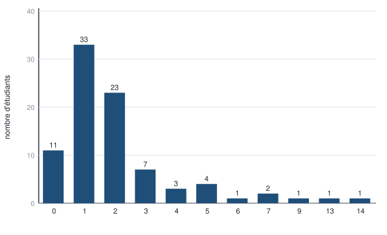
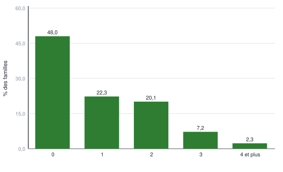
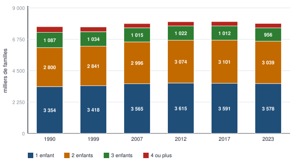
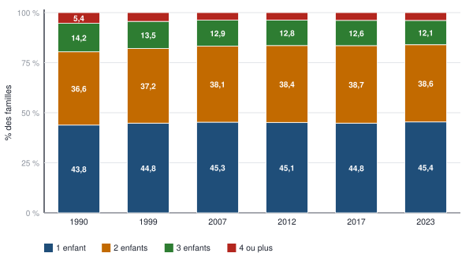
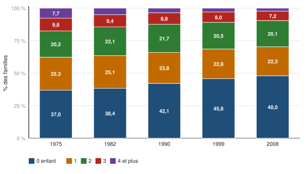

# 1 — Carte du chapitre

::: synthese Le chapitre en dix lignes
1. Une étude statistique ne part jamais des données : elle part d'une **décision à prendre**, qui crée un **besoin d'information** — *besoin de décider → besoin d'information → étude statistique*.
2. Elle suit **six étapes** — problématique, données à observer, méthode de recueil, campagne de mesures, traitement, décision — et **tous les choix sont guidés par le type de problématique**.
3. Quatre méthodes de recueil : **expérimentation**, **enquête qualitative**, **données de seconde main**, **enquête quantitative** (la plus coûteuse).
4. Le rapport statistique **éclaire** la décision, il ne la prend pas : **toute décision est politique**.
5. Le vocabulaire : **population**, **unités statistiques**, **effectif total**, **variable** (une *application*), **modalités** — variable en majuscule $ X $, modalités en minuscule $ x_i $.
6. **Deux types, quatre sous-types** : qualitative **nominale** ou **ordinale**, quantitative **discrète** (comptage) ou **continue** (mesure).
7. Deux présentations **sans perte d'information** : la **série brute** et la **distribution des effectifs** — on passe de l'une à l'autre par un **tri** puis un **comptage**.
8. **Effectif** $ n_i $, **fréquence** $ f_i = n_i/n $, **fréquence cumulée** $ F_k = \sum_{i \le k} f_i $ — le cumul exige un **ordre** entre modalités.
9. Plusieurs distributions juxtaposées servent à **comparer** des sous-populations : colonnes **groupées par catégorie** ou **par année**, **empilé**, **empilé à 100 %** — le graphique dépend de la question.
10. Un tableau **produit** de l'information : titre précis, lisible, note de lecture si besoin, **unités, population, choix méthodologiques**. Tout le chapitre est de la statistique **descriptive** ; l'**inférentielle** viendra plus tard.
:::

**Les idées maîtresses à retenir absolument**

1. **La problématique commande tout** — les données, la méthode, la présentation.
2. **Le caractère est ce qui varie d'une unité à l'autre** ; l'unité est l'élément qu'on observe.
3. **Un nombre n'est une quantité que si sa moyenne a un sens** ; mesuré → continu, compté → discret.
4. **Pas d'ordre, pas de cumul** : la fréquence cumulée n'existe pas pour une qualitative nominale.
5. **Chaque sous-population a son propre dénominateur** — l'empilé à 100 % en est la traduction.
6. **Une phrase de lecture a cinq éléments** : quand, combien, de quoi, dans quelle population, quelle modalité.

**Prérequis** — aucun. Les notions mathématiques nécessaires — **application**, ensemble
**dénombrable**, symbole **Σ** — sont **enseignées ici** au moment où elles servent.

::: marche Le lien avec la finance, là où il est réel
- **Le rendement d'un portefeuille** se calcule avec les poids de chaque ligne : ce sont des **fréquences** — la part de chaque actif dans le total, qui somment à 100 %.
- **Un empilé à 100 % est une allocation d'actifs** : il montre la composition d'un portefeuille à chaque date, indépendamment de sa taille — exactement comme la structure des familles indépendamment de leur nombre.
- **La fréquence cumulée est une fonction de répartition** : « 90,4 % des familles ont deux enfants ou moins » a la même forme que « 95 % des pertes journalières sont inférieures à X » — c'est la logique de la **VaR** (*Value at Risk* : le seuil de perte qui n'est dépassé qu'avec une probabilité donnée, par exemple 5 % des jours).
- **Données de seconde main contre expérimentation** : un backtest travaille sur des données collectées pour autre chose — il ne prouve aucune causalité.
:::

**Pour plus tard** — fréquences, pourcentages, **points de pourcentage** et taux de variation,
lecture de tableaux et de graphiques : le cœur des épreuves de calcul et de raisonnement du
**TAGE MAGE**. Fréquence cumulée et fonction de répartition : le socle des probabilités et de la
mesure du risque en **finance**.

<!--saut-->

# 2 — Le cours reconstruit

> **Quatre sections d'apprentissage.** Chacune se travaille en un cycle APPRENDRE de quatre
> pomodoros : **P1** lecture active · **P2** restitution de mémoire, cours fermé · **P3** cartes de
> la section (§ 4.2) · **P4** questions de niveau 1 de la section (§ 5).

## 2.1 — Réaliser une étude statistique (diapositives 1 à 10)

**À quoi sert cette section.** Elle répond à la question que tout le reste suppose : **pourquoi fait-on une étude statistique, et comment la mène-t-on ?** Réponse du cours : on part d'une **décision**, et chaque choix technique — qui observer, comment, combien — se justifie par elle. C'est la partie « démarche » : peu de calcul, beaucoup de définitions à restituer au mot près.

### 2.1.1 — Le cadre : le cours, son plan, sa place dans la maquette (diapositives 1, 2 et 9)

| Le cadre | Ce qu'il faut savoir |
|---|---|
| **Enseignante** | **Hélène Couprie** — Portail L1, **Division A**, année 2026-2027 |
| **Crédits** | **5 ECTS** — BCC 2, « Compréhension de l'environnement des acteurs, firmes et organisations » |
| **Place du chapitre** | **Chapitre 1 sur au moins 4** : présenter (CHAP 1) · résumer (CHAP 2) · évolutions temporelles (CHAP 3) · croiser les variables (CHAP 4) |

::: piege Ce que l'on sait — et ne sait pas — de l'épreuve
Les 33 diapositives ne donnent **ni la nature, ni la durée, ni le barème** de l'examen. Hypothèse
retenue et justifiée au § 5 (méthode de l'épreuve) : **écrit, exercices d'application et
questions de cours, sans document**. Le support pose **cinq fois** les mêmes trois gestes —
**identifier, calculer, lire** — : ce sont eux qui seront notés. La demande des modalités de
contrôle figure dans `SOURCES.md`.
:::

::: definition Le contenu annoncé par la diapositive 2
**« Découvrir la démarche de la statisticienne · définitions essentielles (variables et type,
population et unités statistiques) · présenter de façon pertinente les informations contenues
dans les données. »**

**Plan en trois sections :** ① Réaliser une étude statistique · ② Communiquer : le vocabulaire
de la statisticienne · ③ Communiquer : la présentation des données.
:::

**La place du chapitre dans le cours** (diapositive 9) :

| Chapitre | Ce qu'il fait |
|:---:|---|
| **1** | **Présenter les données sans perte d'information** |
| **2** | **Résumer** l'information contenue dans les données, **variable par variable** |
| **3** | S'intéresser aux **évolutions temporelles** |
| **4** | **Croiser** les informations de plusieurs variables |

### 2.1.2 — Pourquoi une étude statistique : la chaîne de décision (diapositive 3)

::: definition Diapositive 3, à restituer telle quelle
**Besoin de décider → Besoin d'information → Étude statistique.**
:::

**Les quatre exemples du support**, à pouvoir citer :
1. **Identifier les populations à risque** afin d'optimiser une **campagne de prévention**.
2. **Connaître l'évolution démographique** pour planifier le **financement du système de
   retraite**.
3. **Prévoir la répartition d'une population selon des zones géographiques** pour planifier
   d'éventuels **quotas de médecins**.
4. **Localiser des prospects** dans le but d'optimiser la **ventilation des forces de vente**.

**La flèche part de la décision, pas des données.**

::: synthese Ce que cet ordre impose, et qui commande tout le chapitre
Une étude statistique ne commence **jamais** par « voici des données, que peut-on en tirer ? ».
Elle commence par **une décision à prendre**, qui crée un **besoin d'information**, auquel
l'étude répond.

**Conséquence immédiate, écrite dans le schéma de la diapositive 4 :** **« tous les choix sont
guidés par le type de problématique »** — et des flèches remontent de **chacune** des cinq
étapes suivantes vers la première.

**Deuxième conséquence, diapositive 10 :** *« toute information inutile, non informative au
regard de la problématique, doit être bannie »*. Un tableau juste mais hors sujet est un
défaut, pas un supplément.

**Troisième conséquence, la plus contre-intuitive :** *« ce n'est pas le rapport statistique
qui décide : toute décision est politique »*. Le statisticien éclaire, il ne tranche pas —
d'autres considérations entrent en jeu, **« comme le coût par exemple »**.
:::

::: exemple Les quatre exemples de la diapositive 3, décomposés — ce que le support laisse faire au lecteur
Le support aligne quatre exemples sans les commenter. Chacun se lit avec la même chaîne :
**une décision** précise, **l'information** sans laquelle on la prendrait à l'aveugle, et
**l'étude** qui fournit cette information.

| Exemple du support | La décision à prendre | L'information nécessaire | Une étude possible |
|---|---|---|---|
| **Campagne de prévention** | À qui l'adresser, où concentrer un budget limité | Quels groupes (âge, lieu, comportement) sont les plus exposés, et combien de personnes chacun compte | Données de santé existantes (**seconde main**) ou **enquête quantitative** |
| **Financement des retraites** | Niveau des cotisations, âge de départ | Nombre futur de retraités rapporté au nombre futur d'actifs qui cotisent | Projections à partir des **recensements** |
| **Quotas de médecins** | Combien de médecins autoriser dans chaque zone | Population actuelle et future de chaque zone, et ses besoins de soins | Recensements, statistiques de santé par territoire |
| **Forces de vente** | Où affecter les commerciaux | Où se trouvent les clients potentiels (*prospects*), et combien il y en a par secteur | Fichiers clients, données de seconde main, enquête |

**Ce que l'exercice montre :** la même donnée — une population par zone — sert trois décisions
différentes. **Ce n'est pas la donnée qui définit l'étude, c'est la décision.**
:::

### 2.1.3 — Les six étapes d'une étude statistique (diapositives 4 à 9)

::: definition Le schéma de la diapositive 4 — et la phrase qui s'y trouve
| № | Étape |
|:---:|---|
| **1** | **Quel type de problématique ?** |
| **2** | **Choix des données à observer** |
| **3** | **Choix de la méthode de recueil des données** |
| **4** | **Campagne de mesures** |
| **5** | **Traitement (présentation, résumé, etc.) des données** |
| **6** | **Prise de décision** |

**Et la phrase inscrite au bas du schéma, avec des flèches qui remontent de chaque étape vers
la première :**

> **« Tous les choix sont guidés par le type de problématique. »**

**C'est la thèse de toute la section 1, et elle ne figure que dans l'image.**
:::


**Le détail des six étapes** (diapositives 5 à 10) :

| Étape | Ce qu'elle décide | Le point exigible |
|:---:|---|---|
| **1 — Problématique** | Ce qui intéresse **le donneur d'ordre** | L'exemple du support : une demande d'« enquête de satisfaction » est **« beaucoup trop vague »**. Il faut savoir si c'est pour **modifier la mise en place des produits en rayon**, **améliorer l'affichage**, **mieux répondre aux attentes en matière de choix des produits**, ou **mieux définir les attentes en matière d'horaires d'ouverture et de conseil** |
| **2 — Données à observer** | **Qui ?** | Définir **sur quels individus ou unités statistiques** les observations seront réalisées. La population devra être **définie, délimitée** ; **« parfois on connaît sa taille, mais pas toujours »** |
| **3 — Méthode de recueil** | **Comment obtenir les informations ?** | **Quatre méthodes** — tableau ci-dessous |
| **4 — Campagne de mesures** | **Combien, quand, comment** enquêter | En cas d'enquête quantitative, **« c'est l'option la plus coûteuse »** |
| **5 — Traitement** | Faire parler les données | **« C'est l'objet du cours de Techniques statistiques »** — et les quatre chapitres du plan (§ 2.1.1) |
| **6 — Prise de décision** | Le **rapport statistique** | Contenu et limites du rapport : § 2.1.4 |

**Les quatre méthodes de recueil des données** (diapositive 7) :

| Méthode | Définition du support |
|---|---|
| **L'expérimentation** | **« On dispose d'un protocole permettant l'observation directe de l'impact d'une variable de contrôle sur une variable d'observation. »** |
| **L'observation, ou enquête qualitative** | **« On observe de façon extensive un petit nombre d'individus. »** |
| **Les données de seconde main** | **« On réutilise des informations disponibles par ailleurs. »** |
| **L'enquête quantitative** | **« Il s'agit d'un travail sur-mesure, on collecte l'information utile par enquête, questionnaire, etc. »** |

Trois étapes demandent une explication que le support ne donne pas : la méthode de recueil (étape 3), la problématique (étape 1) et la campagne de mesures (étape 4).

::: definition Étape 3 — les mots de l'expérimentation, employés sans être définis
Le support écrit que l'expérimentation repose sur « un protocole permettant l'observation
directe de l'impact d'une **variable de contrôle** sur une **variable d'observation** ».

**Variable de contrôle :** celle que l'expérimentateur **fait varier lui-même** — le
traitement administré, le prix affiché, le message publicitaire testé. On la contrôle, d'où
son nom.

**Variable d'observation :** celle dont on **mesure la réaction** — la guérison, la quantité
achetée, le taux de clic.

**Ce qui fait la force de l'expérimentation :** comme c'est l'expérimentateur qui fixe la
variable de contrôle, **rien d'autre ne la détermine**. Toute différence observée sur la
variable d'observation lui est donc imputable. C'est la seule des quatre méthodes qui établit
directement un lien de **cause à effet**.
:::

::: piege Les quatre méthodes de recueil, comparées — ce que le support juxtapose sans opposer
| Méthode | Nombre d'individus | Coût | Ce qu'elle permet | Sa limite |
|---|---|---|---|---|
| **Expérimentation** | Variable | Élevé | **Établir une causalité** | Souvent impossible ou non éthique en sciences sociales |
| **Observation / enquête qualitative** | **« Un petit nombre »**, observé **« de façon extensive »** | Modéré | **Comprendre en profondeur**, faire émerger des hypothèses | **Non généralisable** : trop peu d'individus |
| **Données de seconde main** | Celui de la source | **Le plus faible** | Disposer **immédiatement** de données massives | Les données **n'ont pas été collectées pour ta question** |
| **Enquête quantitative** | Défini par la campagne de mesures | **« L'option la plus coûteuse »** | Un travail **sur-mesure**, adapté à la problématique | Le coût, et la dépendance à la qualité du questionnaire |

**Le mot clé de l'opposition qualitatif / quantitatif ici :** ce n'est **pas** le type de
variable, c'est le **nombre d'individus** et la **profondeur** de l'observation. « Enquête
qualitative » = peu d'individus observés en détail. « Enquête quantitative » = beaucoup
d'individus sur un questionnaire standardisé. **Ne pas confondre avec variable qualitative /
quantitative du § 2.2.3** — ce sont deux emplois différents des mêmes mots.
:::

::: exemple L'étape 1 appliquée : pourquoi « une enquête de satisfaction » ne veut rien dire
Le support prend l'exemple d'un **directeur d'hypermarché** qui demande une enquête de
satisfaction auprès de sa clientèle, et tranche : **« cette demande est beaucoup trop
vague »**.

**Pourquoi.** Selon ce que le directeur veut décider, l'étude n'interroge ni les mêmes
personnes, ni sur les mêmes choses :

| S'il veut… | Il faut mesurer… |
|---|---|
| **Modifier la mise en place des produits en rayon** | Les parcours en magasin, les produits non trouvés |
| **Améliorer l'affichage des produits** | La lisibilité perçue, les erreurs de prix relevées |
| **Mieux répondre aux attentes en matière de choix des produits** | Les références manquantes, les substitutions subies |
| **Mieux définir les attentes en matière d'horaires d'ouverture et de conseil** | Les heures de fréquentation souhaitées, le recours au personnel |

**Les quatre études sont incompatibles.** Voilà pourquoi la problématique se définit d'abord,
et pourquoi toutes les flèches du schéma y reviennent.
:::

::: definition L'étape 4 — ce que « combien, quand, comment » engagent vraiment
Le support pose les trois questions de la campagne de mesures sans y répondre. Chacune est un
**arbitrage**, et chacune se tranche par la problématique.

| Question | Ce qu'elle décide | L'arbitrage |
|---|---|---|
| **Combien ?** | Interroger **toute** la population (**recensement**, dit aussi *exhaustif*) ou seulement une **partie** (**échantillon**) | Plus on interroge de personnes, plus le résultat est précis — et plus l'enquête coûte. **C'est pourquoi l'enquête quantitative est « l'option la plus coûteuse »** |
| **Quand ?** | La **date** ou la **période** d'observation | La date fait partie de la population étudiée (le « quand » du champ). Mal choisie, elle **déforme** le résultat : interroger les clients d'un hypermarché **le samedi après-midi** ne décrit pas la clientèle de la semaine |
| **Comment ?** | Le **mode de collecte** (face à face, téléphone, en ligne) et la **formulation** des questions | Le mode choisit, sans le dire, qui répond ; une question mal posée produit une réponse inexploitable |

**À retenir :** un résultat qui ne dit pas **qui**, **quand** et **comment** a été interrogé ne
peut pas être jugé. C'est pour cela que le rapport doit contenir **les éléments
méthodologiques** (§ 2.1.4).
:::

### 2.1.4 — Délimiter la population, et le rapport qui conclut l'étude (diapositives 6 et 10)

::: definition « La population devra être définie, DÉLIMITÉE » — ce que délimiter veut dire
Le support emploie le mot à l'étape 2 et ne le définit pas. **C'est pourtant l'opération qui
rapporte le plus de points dans tout le chapitre**, parce que c'est elle qu'on retrouve sous
le nom de **champ** au bas de chaque tableau.

**Délimiter une population, c'est répondre à trois questions :**

| | La question | Sur l'exemple de la diapositive 28 (§ 2.4.3) |
|:---:|---|---|
| **Qui ?** | Quel type d'unité, et avec quelle restriction ? | Les **familles** vivant **en ménage ordinaire** et ayant **au moins un enfant mineur** |
| **Où ?** | Sur quel territoire ? | **France hors Mayotte** |
| **Quand ?** | À quelle date d'observation ? | **1990, 1999, 2007, 2012, 2017, 2023** — les années de recensement |

**Pourquoi c'est décisif :** deux tableaux sur le même sujet mais de champs différents **ne
sont pas comparables**. La diapositive 22 compte les familles **sans enfant** ; la 28 les
exclut. Confondre les deux, c'est comparer 48 % de familles sans enfant à un tableau où
elles n'existent pas.

**Et c'est aussi ce que veut dire « parfois on connaît sa taille, mais pas toujours » :** un
recensement donne l'effectif exact de la population ; une enquête sur « les clients d'un
hypermarché » ne le donne pas — **on ne sait pas combien il y en a en tout**.
:::

**Ce que doit contenir un rapport statistique** (diapositive 10) :

::: definition Diapositive 10
**« Un rapport statistique doit contenir le résultat des traitements statistiques bien sûr,
mais aussi les éléments méthodologiques — choix réalisés quant aux méthodes statistiques
utilisées —, le tout orienté selon la problématique, vers la prise de décision. »**
:::

**Les deux règles qui l'accompagnent :**

1. **« Toute information inutile — non informative au regard de la problématique — doit être
   bannie. »**
2. **« Ce n'est pas le rapport statistique qui décide : toute décision est politique et repose
   sur les informations collectées et présentées dans le rapport, ainsi que d'autres
   considérations ou contraintes comme le coût par exemple. »**

::: synthese « Ce n'est pas le rapport statistique qui décide » — la frontière, et pourquoi elle existe
Le support conclut la section 1 sur une phrase qu'il ne développe pas : **« toute décision est
politique et repose sur les informations collectées et présentées dans le rapport, ainsi que
d'autres considérations ou contraintes comme le coût »**.

**Ce qu'elle veut dire, précisément :**

| Le statisticien fournit | Le décideur ajoute |
|---|---|
| **Des faits** : combien, dans quelle proportion, en hausse ou en baisse | **Des objectifs** : ce qu'il veut obtenir |
| **Des incertitudes** : marge d'erreur, limites du champ | **Des contraintes** : budget, délai, acceptabilité |
| **Des méthodes** : les choix faits et leurs conséquences | **Un arbitrage** entre des objectifs contradictoires |

**Les données ne contiennent pas la décision.** Savoir que 12,1 % des familles ont trois
enfants ne dit pas s'il faut augmenter les allocations familiales : cela dépend de ce qu'on
cherche à obtenir, et de ce qu'on peut financer.

**La conséquence opératoire, et elle est notée :** c'est **exactement** pour cela que le
rapport doit contenir **les éléments méthodologiques**. Le décideur doit pouvoir juger de la
solidité des chiffres avant de s'appuyer dessus. Et c'est la même exigence que la règle
« indiquer les choix méthodologiques réalisés » de la diapositive 32 — **la section 1 et la
section 3 disent la même chose, à deux endroits différents du cours.**
:::

<!--saut-->

## 2.2 — Le vocabulaire de la statisticienne (diapositives 11 à 14)

**À quoi sert cette section.** Elle fixe les **mots** avec lesquels on décrit n'importe quel tableau : population, unité, variable, modalité, type. **C'est la question posée cinq fois par le support** — « indiquez la population, les unités statistiques, le caractère, son type » — donc la plus rentable du chapitre. Une définition approximative produit un exercice entièrement faux.

### 2.2.1 — Les cinq définitions fondatrices (diapositive 11)

::: definition Diapositive 11 — à savoir mot pour mot
**La population :** **« Ensemble (mathématique) étudié. »**

**Les individus, ou unités statistiques :** **« Les éléments de cette population. »**

**La taille de la population, ou effectif total :** **« Le nombre d'individus ou d'unités
statistiques. »**

**Une variable statistique, ou caractère statistique :** **« Une application associant à
chaque individu une valeur. »**

**Les modalités :** **« Les valeurs prises par une variable statistique. »**
:::

::: piege La convention de notation, qui vaut un point à elle seule
**« Les variables seront notées en majuscule et leurs valeurs prises en minuscule. »**

Donc : **$ X $** est le caractère, **$ x_i $** est une modalité. Écrire $ X_i $ pour une
modalité est une faute de notation visible immédiatement.
:::

Une seule de ces cinq définitions contient un terme technique que le support ne définit pas.

::: definition « Une application associant à chaque individu une valeur »
**Application** est ici un mot de mathématiques, et il est précis. Une **application** d'un
ensemble $ A $ vers un ensemble $ B $ associe à **chaque** élément de $ A $ **une et une
seule** valeur de $ B $.

**Les deux exigences comptent :**
- **Chaque** individu a une valeur — **aucun n'est laissé sans réponse**.
- **Une seule** valeur — un individu ne peut pas avoir deux modalités à la fois pour la même
  variable.

**Ce que cela interdit concrètement :** un tableau où un individu figurerait deux fois, ou
une variable « moyen de transport » dont un individu cocherait à la fois « voiture » et
« train ». Si les deux réponses sont possibles, **ce sont deux variables**, pas une.

**Et c'est aussi ce qui garantit que la somme des effectifs fait exactement $ n $** : chaque
individu est compté une fois et une seule.
:::

### 2.2.2 — Première application : les infractions déclarées en 2024 (diapositive 12)

Le support applique aussitôt ces définitions à un tableau réel, et **pose l'exercice sans le corriger**.

| Atteinte déclarée | Nombre d'infractions |
|---|---:|
| Actes de vandalisme contre la voiture | 2 893 000 |
| Vols ou tentatives de vol d'objet dans ou sur la voiture | 1 544 000 |
| Vols ou tentatives de vol avec effraction de la résidence principale | 1 516 000 |
| Actes de vandalisme contre le logement | 1 141 000 |
| Vols ou tentatives de vol de vélo | 853 000 |
| Vols sans effraction de la résidence principale | 616 000 |
| Vols ou tentatives de vol de voiture | 549 000 |
| Vols ou tentatives de vol de deux-roues motorisés | 264 000 |
| **Ensemble** | **9 376 000** |

*Source : enquête « Vécu et ressenti en matière de sécurité », diffusion Insee. Champ : France
métropolitaine, Martinique, Guadeloupe et La Réunion. Année 2024.*


::: examen L'exercice posé par la diapositive 12
**▶ Indiquez la population, les unités statistiques, l'effectif total, la ou les variables ainsi
que les modalités.**

**Fais-le maintenant, sur une feuille, avec les définitions du § 2.2.1 sous les yeux** — puis
compare au corrigé intégral du § 5, niveau 2, **exercice B1**. Les deux pièges : l'unité
statistique n'est pas une victime, et « nombre d'infractions » n'est pas une variable.
:::

### 2.2.3 — Les deux types et quatre sous-types de variables (diapositives 13 et 14)

::: definition La classification, à restituer intégralement
**On distingue 2 types et 4 sous-types.**

**① Variable QUALITATIVE — « les modalités ne sont pas des nombres ».**
- **Nominale** : **« lorsqu'il n'est pas possible de classer les modalités selon un ordre qui
  a du sens »**.
- **Ordinale** : **« lorsqu'il est possible de classer les modalités selon un ordre qui a du
  sens »**.

**② Variable QUANTITATIVE — « les modalités sont des nombres ».**
- **Discrète** : **« si les modalités relèvent du comptage (ensemble dénombrable) »**.
- **Continue** : **« si les modalités relèvent de la mesure (ensemble non dénombrable) »**.
:::

::: piege L'avertissement du support, mot pour mot
**« Attention aux confusions : une variable qualitative peut être codée dans une base de
données sous forme de nombre, un mot valant un chiffre. »**

Coder « homme = 1, femme = 2 » ne rend pas la variable quantitative. **Le test :
la moyenne a-t-elle un sens ?** Une moyenne de 1,4 sur le sexe ne veut rien dire ; une
moyenne de 1,4 enfant en veut un.
:::

**Les quatre exemples du support** (diapositive 14), un par sous-type :

| Variable | Modalités | Type |
|---|---|---|
| **Sexe** | « homme », « femme », « autre » | **Qualitative nominale** |
| **Qualité du service** | « mauvaise », « plutôt mauvaise », « plutôt bonne », « très bonne » | **Qualitative ordinale** |
| **Nombre d'enfants** | 0, 1, 2, 3, 4, 5 | **Quantitative discrète** |
| **Taille en cm** | 179, 182, 183, 165, 148, 205… | **Quantitative continue** |

Le support définit le discret et le continu par
**« ensemble dénombrable »** et **« ensemble non dénombrable »**, sans expliquer ces termes.

::: definition Dénombrable et non dénombrable
Un ensemble est **dénombrable** quand on peut **énumérer ses éléments un par un**, en les
numérotant, même si la liste ne s'arrête jamais. Les entiers 0, 1, 2, 3… sont dénombrables.

Il est **non dénombrable** quand **entre deux valeurs quelconques il en existe toujours une
troisième**, si bien qu'aucune énumération n'est possible. Les nombres réels d'un intervalle
sont non dénombrables.

**La traduction statistique, plus simple à manier :**
- **Discret** — les modalités relèvent du **comptage**. Entre 2 et 3 enfants, il n'y a rien.
- **Continu** — les modalités relèvent de la **mesure**. Entre 179 cm et 180 cm, il y a
  179,4 cm, et entre les deux 179,42 cm, indéfiniment.

**Le test pratique en examen :** *« existe-t-il une valeur possible entre deux valeurs
voisines ? »* Non → discret. Oui → continu.
:::

::: piege Les deux pièges de classification, et comment les trancher
**① La variable qualitative codée en chiffres.** Le support le dit : *« une variable
qualitative peut être codée dans une base de données sous forme de nombre, un mot valant un
chiffre »*. Le code postal, le numéro de département, « homme = 1 » sont des **nombres qui ne
comptent ni ne mesurent rien**.
**Le test : la moyenne a-t-elle un sens ?** Une moyenne de code postal ne veut rien dire.

**② La variable continue présentée en classes.** La taille arrondie au centimètre ressemble
à du comptage. Mais la taille **se mesure**, et l'arrondi est une commodité d'affichage, non
la nature de la variable. **Le test : la grandeur sous-jacente est-elle mesurée ou comptée ?**

**Et le troisième cas, le plus subtil : l'ordinale.** « Mauvaise, plutôt mauvaise, plutôt
bonne, très bonne » se classe dans un ordre qui a du sens — mais les modalités **ne sont pas
des nombres**. C'est donc une **qualitative ordinale**, pas une quantitative. On peut les
ranger, on ne peut pas les additionner.
:::

<!--saut-->

## 2.3 — Présenter une variable sans perte d'information (diapositives 15 à 23)

**À quoi sert cette section.** Elle apprend à transformer une liste de réponses en **tableau** — effectifs, fréquences, fréquences cumulées — et à l'écrire en **notations**. C'est le cœur calculatoire du chapitre, et **la base de tous les chapitres suivants** : on ne résume (chapitre 2) que ce qu'on a d'abord présenté.

### 2.3.1 — Série brute et distribution : les deux présentations sans perte (diapositive 15)

::: definition Diapositive 15
**« Il y a 2 grandes façons de présenter une variable (sans perte d'information) :**
- **sous forme de série ou données brutes** (en anglais *raw data*) ;
- **sous forme de distribution observée des effectifs** (en anglais *frequencies*). »
:::

::: definition Le passage de l'une à l'autre — deux opérations, dans cet ordre
**« Il y a un traitement de données nécessaire pour passer de la série brute à la
distribution observée, qui nécessite (dans le cas quantitatif ou qualitatif ordinal) :
un TRI des modalités, puis un COMPTAGE des effectifs. »**
:::

::: synthese La thèse que le support pose sans la formuler
Le chapitre 1 s'intitule **« Présenter pour informer »**, et la diapositive 15 précise :
**deux façons de présenter une variable — *sans perte d'information*.**

**Ce qualificatif oppose implicitement le chapitre 1 au chapitre 2.** Une série brute contient
toute l'information. Une distribution des effectifs aussi : **à partir du tableau, on peut
reconstituer la série** — il suffit de réécrire chaque modalité autant de fois que son
effectif. Rien n'est perdu, seul l'ordre de présentation a changé.

**Le chapitre 2, lui, s'intitule « Résumer pour informer » — et un résumé perd de
l'information.** Une moyenne de 2,16 frères et sœurs — $ 188/87 $, calcul au chapitre 2 — ne permet pas de
retrouver les 87 réponses.

**C'est la raison pour laquelle la distribution est « souvent l'étape n° 1 d'une analyse
statistique »** : on commence par la présentation intégrale, on ne résume qu'ensuite, en
sachant ce qu'on perd.
:::

### 2.3.2 — Du tri au comptage : l'exemple des 87 étudiants (diapositives 16 à 20)

::: definition Diapositive 16
**« Une distribution observée des effectifs associe à chaque modalité d'une variable
statistique l'effectif observé correspondant. »**

**« L'effectif d'une modalité est le nombre d'individus présentant une modalité donnée du
caractère statistique. »**
:::

**Trois précisions du support :**
1. **La représentation peut être un tableau ou un diagramme colonne.**
2. **« Il n'y a pas de perte d'information. »**
3. **« Il s'agit souvent de l'étape n° 1 d'une analyse statistique. »**

::: demo Deux opérations, dans cet ordre — et pourquoi cet ordre
Le support écrit : **« un tri des modalités, puis un comptage des effectifs »**.

1. **Trier** met côte à côte les valeurs identiques.
2. **Compter** devient alors une simple lecture de longueurs de blocs.

**Sans le tri, le comptage exige de parcourir toute la série une fois par modalité** — onze
passages sur 87 valeurs dans l'exemple du cours. Avec le tri, un seul passage suffit.

**C'est exactement ce que montrent les diapositives 17, 18 et 19 :** la série brute, puis la
série **ordonnée**, puis le tableau. Trois états du même contenu, et deux opérations pour
passer de l'un à l'autre.

**La précision entre parenthèses du support compte :** le tri n'a de sens **« dans le cas
quantitatif ou qualitatif ordinal »**. Pour une qualitative **nominale** — le sexe, la
couleur, la région —, **il n'existe pas d'ordre naturel** : on regroupe, on ne trie pas, et
l'ordre d'affichage est un choix de présentation.
:::

**Mini-enquête :** 87 étudiants d'une promotion répondent à *« combien avez-vous de frères et
sœurs ? »*. **Population :** l'ensemble des **87 étudiants**. **Taille : $ n = 87 $ unités
statistiques.** **Caractère : quantitatif discret.**

**La distribution donnée par le support** (diapositive 19) :

| $ x_i $ | 0 | 1 | 2 | 3 | 4 | 5 | 6 | 7 | 9 | 13 | 14 | **Ensemble** |
|---|---:|---:|---:|---:|---:|---:|---:|---:|---:|---:|---:|---:|
| $ n_i $ | 11 | 33 | 23 | 7 | 3 | 4 | 1 | 2 | 1 | 1 | 1 | **87** |

**Donc $ n = 87 $ et $ p = 11 $.**

::: piege Une anomalie vérifiée du support — la série brute ne donne pas cette distribution
J'ai recompté la **série brute** de la diapositive 17, chiffre par chiffre, après vérification
à l'image : elle contient **10 zéros et 24 « 2 »**. La **série ordonnée** (diapositive 18) et
le **tableau** (diapositive 19) en contiennent **11 et 23**.

**Un « 2 » de la série brute est devenu un « 0 » au tri.** Les deux totaux font bien 87, et
toutes les autres modalités concordent. ➔ § 3.1, **A1**, pour la conduite à tenir.
:::



::: methode Lire ce diagramme — ce que le support montre sans le commenter
- **Une colonne par modalité observée**, de hauteur égale à l'effectif : c'est la distribution
  du tableau, sous une autre forme — **aucune information n'est perdue**.
- **La modalité la plus fréquente** saute aux yeux : **1 frère ou sœur**, 33 étudiants sur 87,
  soit $ 33/87 = 37{,}9\ \% $.
- **La distribution est concentrée à gauche** : 67 étudiants sur 87 ($ 11 + 33 + 23 $), soit
  77,0 %, ont deux frères et sœurs ou moins ; quelques valeurs **extrêmes** (9, 13, 14)
  s'étirent à droite.
- **Attention à l'axe horizontal** : les modalités **absentes** (8, 10, 11, 12) n'ont pas de
  colonne, donc 9 et 13 se retrouvent côte à côte. **L'axe range des modalités, il ne mesure pas
  des distances** — on ne lit pas un écart numérique sur un diagramme en colonnes.
- **Pourquoi pas un camembert :** onze modalités, dont sept d'effectif inférieur ou égal à 4 —
  des parts minuscules que l'œil ne distingue plus.
:::

### 2.3.3 — Effectif, fréquence, fréquence cumulée : le tableau des familles (diapositives 21 et 22)

::: definition Diapositive 21
**La fréquence d'une modalité :** **« la proportion d'individus présentant une modalité donnée
du caractère statistique dans la population totale (en pour cent de la population) »**.

**La fréquence cumulée d'une modalité — pour un caractère quantitatif :** **« la proportion
d'individus présentant une modalité donnée OU INFÉRIEURE dans la population »**.
:::

**Les représentations possibles :** **« un camembert ou un diagramme en barres peuvent être
choisis »** pour une répartition des fréquences.

::: piege Les trois mots à ne pas perdre
**« ou inférieure »** — c'est ce qui fait la différence entre fréquence et fréquence cumulée.
Et **« pour un caractère quantitatif »** : la fréquence cumulée **suppose un ordre sur les
modalités** — démonstration ci-dessous.
:::

::: definition Les deux grandeurs, et pourquoi on a besoin des deux
**L'effectif $ n_i $** est un **nombre d'individus** : 33 étudiants ont un frère ou une sœur.
**La fréquence $ f_i $** est une **proportion** : $ 33/87 = 37{,}9\ \% $.

$$ f_i = \frac{n_i}{n} $$

**Pourquoi la fréquence est indispensable : elle seule permet de comparer.** Deux promotions
de tailles différentes ne se comparent pas en effectifs — 33 sur 87 et 50 sur 200 ne se
lisent pas côte à côte. En fréquences, 37,9 % et 25,0 % se comparent immédiatement.

**C'est précisément le passage que fait la diapositive 30 :** l'empilé à 100 % **« revient à
prendre les fréquences et non les effectifs »**, pour comparer des **structures** entre
années dont les totaux diffèrent.
:::

::: demo Pourquoi la fréquence cumulée n'a de sens que pour un caractère ordonné
La définition du support : **« la proportion d'individus présentant une modalité donnée ou
inférieure dans la population »**.

1. Le mot **« inférieure »** suppose qu'on puisse **comparer deux modalités**.
2. Pour une variable **quantitative**, c'est immédiat : 2 enfants est inférieur à 3.
3. Pour une **qualitative ordinale**, c'est encore possible : « plutôt mauvaise » est
   inférieure à « plutôt bonne ».
4. Pour une **qualitative nominale**, **c'est impossible** : « le bleu est-il inférieur au
   vert ? » n'a pas de sens.

**Donc : pas d'ordre, pas de cumul.** Le support restreint d'ailleurs explicitement sa
définition au cas **« pour un caractère quantitatif »**.

**Corollaire à savoir :** une fréquence cumulée est **toujours croissante**, et la dernière
vaut **toujours 100 %**. Si ce n'est pas le cas dans ta copie, tu t'es trompé.
:::

Diapositive 22 — **le tableau modèle du chapitre**, celui dont la structure tombera.

| Modalités $ x_i $ | Effectifs $ n_i $ (en milliers) | Fréquences $ f_i $ (%) | Fréquences cumulées $ F(x_i) $ (%) |
|---|---:|---:|---:|
| 0 enfant | 8 225 | **48,0** | **48,0** |
| 1 enfant | 3 821 | **22,3** | **70,3** |
| 2 enfants | 3 449 | **20,1** | **90,4** |
| 3 enfants | 1 241 | **7,2** | **97,7** |
| 4 enfants et plus | 396 | **2,3** | **100,0** |
| **Ensemble** | **17 132** | **100,0** | |



**Tous les chiffres ont été recalculés et sont exacts** : $ 8\,225/17\,132 = 48{,}01\ \% $ ;
la somme des effectifs fait bien **17 132** ; les cumuls s'enchaînent correctement.

::: piege Deux imprécisions du support sur cette diapositive
① Le texte annonce une **« enquête menée auprès de 17 132 familles »**, alors que la colonne
est intitulée **« effectifs en milliers »** : il s'agit de **17 132 milliers de familles**,
soit **17,1 millions**.
② L'**« année donnée »** n'est pas précisée ici — mais le graphique de la **diapositive 31**
la révèle : c'est **2008**, puisque sa colonne 2008 reproduit exactement ces cinq fréquences.
➔ § 3.1, **A2** et **A3**.
:::

::: exemple Vérifier une colonne de fréquences cumulées — le réflexe qui sauve un exercice
Reprends le tableau des familles ci-dessus :
$ 48{,}0 $ · $ 48{,}0 + 22{,}3 = 70{,}3 $ · $ 70{,}3 + 20{,}1 = 90{,}4 $ ·
$ 90{,}4 + 7{,}2 = 97{,}6 $ · $ 97{,}6 + 2{,}3 = 99{,}9 $.

Le support annonce **97,7** puis **100,0**. L'écart vient des **arrondis** : les fréquences
exactes sont 48,01 · 22,30 · 20,13 · 7,24 · 2,31, dont les cumuls exacts donnent 48,01 ·
70,31 · 90,44 · **97,69** · **100,00**.

**La règle : on cumule les valeurs exactes, on arrondit à la fin.** Cumuler des valeurs déjà
arrondies fait dériver le total — et c'est exactement le genre de détail qu'un correcteur
attend qu'on signale.
:::

### 2.3.4 — Les notations formelles (diapositive 23)

::: formule Diapositive 23 — à savoir écrire
- Le caractère statistique est noté **$ X $**, les modalités **$ x_i $** sont **ordonnées** de
  $ i = 1, \ldots, p $.
- À chaque modalité $ x_i $ correspond un **effectif $ n_i $**, et l'**effectif total** vaut

$$ n = \sum_{i=1}^{p} n_i = n_1 + n_2 + \ldots + n_p $$

- Les **fréquences** $ f_i $, pour $ i = 1, \ldots, p $, se calculent ainsi :

$$ f_i = \frac{n_i}{n} $$

- Les **fréquences cumulées** $ F_k $, pour $ k = 1, \ldots, p $, sont telles que :

$$ F_k = \sum_{i=1}^{k} f_i $$
:::

::: piege Deux indices, deux rôles
**$ p $** est le **nombre de modalités distinctes**. **$ n $** est le **nombre d'individus**.
Ce ne sont pas les mêmes : dans l'exemple des 87 étudiants, $ n = 87 $ et $ p = 11 $.
:::

::: formule Le symbole Σ, si tu ne l'as jamais manipulé
$ \sum_{i=1}^{p} n_i $ se lit **« somme des $ n_i $ pour $ i $ allant de 1 à $ p $ »**, et
signifie exactement $ n_1 + n_2 + \ldots + n_p $.

- **$ i $** est un **compteur** : il prend successivement les valeurs 1, 2, …, $ p $.
- **Le nombre du bas** dit où il commence, **celui du haut** où il s'arrête.
- **Le nom du compteur est sans importance** : $ \sum_{i=1}^{p} n_i $ et
  $ \sum_{k=1}^{p} n_k $ désignent le même nombre.

**Les deux formules du chapitre se lisent alors sans effort :**
$ n = \sum_{i=1}^{p} n_i $ — *l'effectif total est la somme de tous les effectifs*.
$ F_k = \sum_{i=1}^{k} f_i $ — *la fréquence cumulée au rang $ k $ est la somme des
fréquences **jusqu'à** $ k $*. La borne haute est $ k $, pas $ p $ : c'est tout ce qui
distingue un cumul partiel d'un total.
:::

::: formule Les propriétés des fréquences — à connaître et à savoir démontrer
$$ \sum_{i=1}^{p} f_i = 1 = 100\ \% \qquad F_p = 100\ \% \qquad F_{k+1} \geq F_k \qquad f_k = F_k - F_{k-1} \ \text{avec} \ F_0 = 0 $$

Démonstrations : Statistiques Ch01, § 2.3.4. Elles servent de contrôle à chaque tableau construit.
:::

::: demo Les trois propriétés des fréquences, démontrées — ce que le support pose sans preuve
**① La somme des fréquences vaut 1, soit 100 %.**

$$ \sum_{i=1}^{p} f_i = \sum_{i=1}^{p} \frac{n_i}{n} = \frac{1}{n} \sum_{i=1}^{p} n_i = \frac{n}{n} = 1 $$

*Pas à pas :* chaque fréquence a le même dénominateur $ n $, qu'on met en facteur ; la somme des
effectifs est l'effectif total, parce que chaque individu est compté **une fois et une seule**
(c'est le sens du mot « application », § 2.2.1). **Conséquence :** la dernière fréquence
cumulée vaut toujours $ F_p = 1 = 100\ \% $.

**② Les fréquences cumulées sont croissantes.**

$$ F_{k+1} = F_k + f_{k+1} \quad \text{et} \quad f_{k+1} \geq 0 \quad \Longrightarrow \quad F_{k+1} \geq F_k $$

**③ On retrouve chaque fréquence à partir des fréquences cumulées.**

$$ f_k = F_k - F_{k-1} \quad \text{avec la convention} \quad F_0 = 0 $$

**Exemple chiffré, tableau des familles :** $ f(2 \text{ enfants}) = F(2) - F(1) = 90{,}4 - 70{,}3 = 20{,}1\ \% $ —
c'est bien la fréquence du tableau. Et $ 48{,}0 + 22{,}3 + 20{,}1 + 7{,}2 + 2{,}3 = 99{,}9 $ : l'écart
de 0,1 à 100 vient des arrondis ; avec les valeurs exactes, la somme vaut 100,00 %.

**Une notation à ne pas confondre :** le support écrit $ F(x_i) $ en tête de colonne
(diapositive 22) et $ F_k $ dans les formules (diapositive 23). **C'est la même grandeur** : la
fréquence cumulée **au rang** $ k $, c'est-à-dire **à la modalité** $ x_k $.
:::

**Une coquille du support :** la diapositive 23 invite à « mettre les notations en adéquation
avec l'illustration de la diapo 21 » — l'illustration est en réalité le **tableau des familles de
la diapositive 22**. ➔ § 3.1, **A4**.

<!--saut-->

## 2.4 — Comparer des distributions, choisir un graphique, communiquer (diapositives 24 à 33)

**À quoi sert cette section.** Elle passe d'une distribution à **plusieurs**, pour **comparer** — des années, des territoires, des catégories. Elle apprend à choisir le graphique qui répond à la question posée, à l'intituler, puis elle conclut le chapitre : un tableau est un **outil de communication**, et tout ce qu'on a fait est de la statistique **descriptive**.

### 2.4.1 — Une distribution par sous-population : les personnes écrouées (diapositives 24 et 25)

::: definition Diapositive 24 — les quatre propositions
1. **« Il arrive fréquemment que plusieurs distributions statistiques d'un même caractère
   soient présentées simultanément dans une optique comparative. »**
2. **« Plusieurs populations (ou sous-populations) sont définies selon une AUTRE variable —
   par année, zone géographique, etc. »**
3. **« Il y a en fait une distribution par sous-population. Ces distributions sont présentées
   juxtaposées. »**
4. **« Le but d'une telle présentation est la COMPARAISON de la répartition de la variable
   entre sous-populations. »**
:::

::: synthese Le mécanisme, en trois temps
1. **Une seconde variable découpe la population** en sous-populations : l'année, la zone
   géographique, le sexe. Le support le dit : *« plusieurs populations (ou sous-populations)
   sont définies selon une AUTRE variable »*.
2. **On calcule la distribution du caractère étudié dans chaque sous-population séparément.**
   Il y a donc **autant de distributions que de sous-populations**.
3. **On les présente juxtaposées**, et *« le but d'une telle présentation est la
   comparaison »*.

**Le point qui piège :** dans le tableau des personnes écrouées, **la variable étudiée est la
catégorie pénale**, et **la variable de découpage est l'année**. Ce sont deux rôles
différents, et l'examen demandera lequel est lequel. ➔ § 5, niveau 2, **B3**.

**Et c'est ce mécanisme qui annonce le chapitre 4** : dès qu'on croise deux variables, on
quitte la présentation d'une variable seule.
:::

Diapositive 25. Source : **ministère de la Justice**.

| Catégorie | 2020 | 2021 | 2022 | 2023 |
|---|---:|---:|---:|---:|
| **Prévenus détenus** | 17 692 | 18 486 | 18 779 | 19 755 |
| **Condamnés-prévenus détenus** | 2 405 | 2 613 | 2 908 | 3 117 |
| **Condamnés détenus** | 41 553 | 47 246 | 49 338 | 51 746 |
| **Condamnés non détenus** | 12 184 | 13 644 | 14 286 | 15 453 |
| **Total des personnes écrouées** | **73 834** | **81 989** | **85 311** | **90 071** |

**Les quatre totaux ont été vérifiés : ils sont tous exacts.**

::: definition Le vocabulaire pénal que le support emploie sans jamais le définir
Quatre termes techniques, indispensables pour justifier le type du caractère. **Aucun n'est
expliqué dans les diapositives.**

- **Écroué** — inscrit au **registre d'écrou** d'un établissement pénitentiaire. **C'est la
  population totale du tableau**, et elle est plus large que « détenu » : on peut être écroué
  **sans être enfermé** (bracelet électronique, placement extérieur).
- **Prévenu** — personne **poursuivie et pas encore jugée définitivement**. Elle est
  **présumée innocente**.
- **Condamné** — personne dont la **condamnation est définitive**.
- **Condamné-prévenu** — personne **condamnée définitivement dans une affaire et encore
  prévenue dans une autre**. C'est la raison d'être de cette catégorie intermédiaire.

**La clé de lecture :** les quatre modalités croisent **deux critères** — le **statut
judiciaire** (prévenu / condamné) et la **détention effective** (détenu / non détenu).
:::

::: formule Taux de variation et points de pourcentage — les deux outils pour commenter un tableau par année
Le support compare des années **sans donner l'outil de la comparaison**. Il est indispensable dès
qu'on commente un tableau comme celui-ci — et c'est l'objet annoncé du chapitre 3,
« évolutions temporelles ».

$$ t = \frac{V_{\text{arrivée}} - V_{\text{départ}}}{V_{\text{départ}}} \times 100 $$

- **$ V_{\text{départ}} $** : la valeur à la date de départ — **c'est le dénominateur**.
- **$ V_{\text{arrivée}} $** : la valeur à la date d'arrivée.
- **$ t $** : la variation **rapportée au point de départ**, en pour cent.

*Pourquoi cette formule :* une hausse de 16 237 personnes ne dit rien seule ; rapportée aux
73 834 de départ, elle devient comparable à n'importe quelle autre évolution.

**Application :** $ t = \dfrac{90\,071 - 73\,834}{73\,834} \times 100 = \dfrac{16\,237}{73\,834} \times 100 = +21{,}99\ \% $,
soit **+22,0 %** de personnes écrouées entre 2020 et 2023.

**L'écart entre deux pourcentages se dit en points de pourcentage.** Les condamnés détenus
représentent 56,3 % des écroués en 2020 et 57,5 % en 2023 : leur part augmente de **1,2 point**
— pas de 1,2 %. Le taux de variation de cette part serait, sur les valeurs arrondies, $ 1{,}2 / 56{,}3 = +2{,}1\ \% $.
**Les deux chiffres sont vrais et ne disent pas la même chose.**
:::

### 2.4.2 — Colonnes groupées : un même tableau, deux graphiques (diapositives 26 et 27)

Le support pose le critère en une phrase : **« le choix du diagramme colonne groupé dépend de
[ce qui] est au centre de l'analyse »**. Voici ce que cela donne sur le même tableau.


::: piege Deux graphiques, même tableau, deux questions
| | **Groupement par catégorie** (d. 26) | **Groupement par année** (d. 27) |
|---|---|---|
| Ce que dit le support | *« Si l'on s'intéresse à l'évolution des effectifs de chaque catégorie… »* | *« Si l'on s'intéresse à l'évolution de la structure des effectifs… »* |
| Titre donné | **Évolution, pour chaque catégorie, du nombre de personnes écrouées** | **Évolution, pour chaque année, des catégories de personnes écrouées** |
| Ce qu'on lit d'un coup d'œil | Chaque catégorie **monte-t-elle ou descend-elle** dans le temps ? | La **composition** d'une année se déforme-t-elle par rapport à l'autre ? |
| Sur l'axe horizontal | Les **catégories** | Les **années** |

**Le titre change avec le graphique, et il n'est pas décoratif :** *« évolution, pour chaque
catégorie »* contre *« évolution, pour chaque année »*. C'est une application directe de la
règle « intitulés précis » de la diapositive 32.
:::

**La lecture chiffrée des deux graphiques.** Sur le premier, chaque groupe de quatre colonnes monte : les quatre catégories augmentent, de **+11,7 %** (prévenus détenus) à **+29,6 %** (condamnés-prévenus détenus). Sur le second, les quatre groupes ont presque le même profil : les condamnés détenus pèsent **56,3 %** des écroués en 2020 et **57,5 %** en 2023. **Même tableau : une hausse générale d'un côté, une structure presque stable de l'autre** — détail des calculs au § 5, niveau 2, B3.

### 2.4.3 — Empilé et empilé à 100 % : les enfants par famille (diapositives 28 à 31)

Diapositive 28. **Champ :** France hors Mayotte, familles vivant en ménage ordinaire **ayant
au moins un enfant mineur**. **Unité :** milliers de familles. **Source :** Insee,
recensements de la population.

| Nombre d'enfants mineurs | 1990 | 1999 | 2007 | 2012 | 2017 | 2023 |
|---|---:|---:|---:|---:|---:|---:|
| **1 enfant** | 3 353,7 | 3 418,3 | 3 565,0 | 3 614,8 | 3 590,7 | 3 578,3 |
| **2 enfants** | 2 800,5 | 2 841,1 | 2 996,3 | 3 074,1 | 3 101,1 | 3 039,0 |
| **3 enfants** | 1 087,1 | 1 033,5 | 1 015,2 | 1 022,3 | 1 012,2 | 956,2 |
| **4 enfants ou plus** | 410,9 | 334,5 | 296,9 | 296,1 | 310,7 | 308,4 |
| **Ensemble** | **7 652,2** | **7 627,5** | **7 873,5** | **8 007,3** | **8 014,7** | **7 881,9** |



**Et la même chose en fréquences** — c'est l'empilé à 100 % de la diapositive 30 :

| En % | 1990 | 1999 | 2007 | 2012 | 2017 | 2023 |
|---|---:|---:|---:|---:|---:|---:|
| **1 enfant** | 43,8 | 44,8 | 45,3 | 45,1 | 44,8 | **45,4** |
| **2 enfants** | 36,6 | 37,2 | 38,1 | 38,4 | 38,7 | **38,6** |
| **3 enfants** | 14,2 | 13,5 | 12,9 | 12,8 | **12,6** | **12,1** |
| **4 enfants ou plus** | 5,4 | 4,4 | 3,8 | 3,7 | 3,9 | **3,9** |



**J'ai recalculé les vingt-quatre pourcentages : ils sont tous exacts.**

::: piege Le contrôle « Σ nᵢ = n » va te donner un écart de 0,1 sur deux colonnes
**1999 : les quatre lignes font 7 627,4 ; l'« Ensemble » annonce 7 627,5.**
**2007 : les quatre lignes font 7 873,4 ; l'« Ensemble » annonce 7 873,5.**
**Les quatre autres colonnes tombent juste.**

**Ce n'est pas une erreur** : les données sont publiées en milliers **arrondis au dixième**,
lignes et total arrondis séparément. ➔ § 3.2, pour la ligne exacte à écrire en
examen.
:::

::: definition Les deux termes du champ que le support n'explique pas
- **Ménage ordinaire** — au sens de l'Insee, l'ensemble des personnes **partageant le même
  logement ordinaire**. Cela **exclut les ménages collectifs** : foyers de travailleurs,
  internats, maisons de retraite, casernes, établissements pénitentiaires. *Une famille vivant
  en foyer d'hébergement n'est donc pas dans ce tableau.*
- **Enfant mineur** — enfant de **moins de 18 ans** vivant dans la famille. *Un enfant majeur
  encore au domicile ne compte pas ici : c'est pourquoi une famille avec deux enfants de 19 et
  16 ans figure dans la ligne « 1 enfant ».*

**Ces deux restrictions expliquent pourquoi ce tableau n'a pas de ligne « 0 enfant » :** le
champ ne retient que les familles **ayant au moins un enfant mineur**.
:::

::: piege Empilé ou empilé à 100 % — le critère
**Empilé** (d. 29) : les **effectifs** sont empilés, et **« la hauteur de l'empilement
correspond à l'ensemble »**. On voit donc **à la fois** la composition **et** le total.

**Empilé à 100 %** (d. 30-31) : on empile les **fréquences**, toutes les colonnes ont la
**même hauteur**. On ne voit plus le total — **on voit uniquement la structure**.

**Le choix se déduit de la question :** si le total varie et que cette variation compte, il
faut l'empilé simple. Si l'on veut comparer des structures entre populations de tailles
différentes, il faut le 100 %. Dans l'exemple des familles, l'ensemble ne varie que de 3 % (de 7 652,2 à
7 881,9 milliers) : **le total n'est pas l'enjeu, la structure l'est**. Le 100 % s'impose, parce
qu'il met toutes les colonnes à la même hauteur et rend les parts directement comparables d'une
année à l'autre.
:::



**Ce que montre la diapositive 31, et ce qu'elle révèle.** Sur trente-trois ans, la part des
familles **sans enfant** passe de 37,0 % à 48,0 %, et celle des familles de **quatre enfants et
plus** de 7,7 % à 2,3 %. Le support dit que ce diagramme illustre « le tableau précédent » :
c'est **faux** — il illustre le tableau de la **diapositive 22**, dont il révèle l'année non
précisée : **2008**. ➔ § 3.1, **A3**.

::: piege Le camembert, que le support autorise sans le commenter
La diapositive 21 indique qu'**« un camembert ou un diagramme en barres peuvent être choisis »**
pour représenter une répartition de fréquences.

**Quand le camembert convient :** une **seule** distribution, **peu de modalités**, dont les
parts **somment à 100 %** — donc des modalités **exclusives et exhaustives**.

**Quand il ne convient pas :** dès qu'il faut **comparer** deux distributions. L'œil compare
mal deux angles ; il compare très bien deux hauteurs. C'est précisément pourquoi toutes les
comparaisons du chapitre — diapositives 26, 27, 29, 30, 31 — utilisent des **colonnes**, et
jamais des camemberts.
:::

**Récapitulatif — les graphiques du chapitre et la question à laquelle chacun répond :**

| Graphique | Quand le choisir | Ce qu'il montre | Diapositive |
|---|---|---|:---:|
| **Diagramme colonne** simple | Une seule distribution | Les effectifs ou les fréquences, modalité par modalité | 20 |
| **Colonnes groupées, groupement par catégorie** | On s'intéresse à **l'évolution des effectifs de chaque catégorie** | Pour chaque catégorie, une colonne par année, côte à côte | 26 |
| **Colonnes groupées, groupement par année** | On s'intéresse à **l'évolution de la structure des effectifs** | Pour chaque année, une colonne par catégorie, côte à côte | 27 |
| **Empilé** | La **hauteur totale** a un sens | Les effectifs empilés — « la hauteur de l'empilement correspond à l'ensemble des enfants chaque année » | 29 |
| **Empilé à 100 %** | On compare des **structures** dans le temps | **« Ce qui revient à prendre les fréquences et non les effectifs, par année »** | 30-31 |

::: piege Le critère de choix, que le support énonce en une ligne
**« Le choix du diagramme colonne groupé dépend de [ce qui] est au centre de l'analyse. »**

**Groupement par catégorie → on suit chaque catégorie dans le temps.**
**Groupement par année → on compare la composition d'une année à l'autre.**
**Même tableau, deux graphiques, deux questions différentes.**
:::

### 2.4.4 — Les quatre règles de présentation (diapositive 32)

::: definition Diapositive 32
**« La présentation des données sous forme de tableau ou de graphique sert à INFORMER,
c'est-à-dire donner une forme, une signification à des données (le plus souvent numériques
brutes). Les tableaux ou graphiques produisent de l'information, ils sont des outils de
communication. Il est primordial de les choisir et les intituler à bon escient pour que
l'information utile passe. »**

**Les quatre règles :**
1. **Intitulés précis** — « pas de noms de variables ou de modalités obscurs ».
2. **Lisibles par un non-spécialiste.**
3. **Compréhension immédiate ou simplifiée au maximum** — « si complexité : **note de lecture
   en bas de tableau** ».
4. **Indiquer les unités de mesure, la population, les choix méthodologiques réalisés.**
:::

Le mot décisif est dans la première phrase : **informer, « c'est-à-dire
donner une FORME, une SIGNIFICATION à des données »**.

::: synthese Pourquoi un tableau est un acte de communication, pas un acte de calcul
Le support écrit : **« les tableaux ou graphiques PRODUISENT de l'information, ils sont des
outils de communication »**. Produire — pas transmettre.

**Les mêmes données donnent des messages différents selon la présentation.** Les personnes
écrouées, groupées par catégorie, racontent une hausse générale ; groupées par année, elles
racontent une structure à peu près stable. **Les deux graphiques sont exacts, et ils ne disent
pas la même chose.**

**D'où les quatre règles**, qui sont toutes des règles de **lecteur**, pas de statisticien :
intitulés précis, lisibilité par un non-spécialiste, compréhension immédiate ou note de
lecture, et mention des unités, de la population et des choix méthodologiques.

**Le tableau de la diapositive 28 les applique toutes** : il porte un champ (« France hors
Mayotte, familles vivant en ménage ordinaire ayant au moins un enfant mineur »), une unité
(« milliers de familles ») et une source (« Insee, recensements de la population »).
**Recopie cette discipline dans tes propres tableaux : c'est un point à chaque fois.**
:::

### 2.4.5 — Conclusion : du descriptif à l'inférentiel (diapositive 33)

::: definition Diapositive 33
**« Nous venons de voir les principales étapes d'une étude statistique. Nous avons appris à
présenter la distribution d'un caractère statistique d'une population en effectifs, en
fréquence ou en fréquences cumulées. Il s'agit souvent de la première étape de différents
traitements de statistique descriptive que nous allons étudier dans les chapitres suivants. »**

**Et l'ouverture :** **« Nous ne disposons pas toujours de l'information exhaustive sur une
population d'intérêt. Il faut parfois tirer aléatoirement un échantillon. Les techniques
statistiques permettant de déduire des éléments d'une population à partir d'un échantillon
aléatoire relèvent de la STATISTIQUE INFÉRENTIELLE. »**
:::

::: piege Statistique descriptive / statistique inférentielle
**Descriptive** : on décrit **la population dont on dispose**. C'est tout ce chapitre.
**Inférentielle** : on **déduit** des éléments d'une population **à partir d'un échantillon
tiré aléatoirement**. Le support l'annonce sans la traiter.
:::

::: definition Échantillon et inférence
Le support conclut : *« nous ne disposons pas toujours de l'information exhaustive sur une
population d'intérêt. Il faut parfois tirer aléatoirement un échantillon. »*

**Un échantillon** est un **sous-ensemble de la population**, tiré **au hasard**, sur lequel
on observe effectivement les données.

**La statistique inférentielle** regroupe **« les techniques permettant de déduire des
éléments d'une population à partir d'un échantillon aléatoire »**.

**Pourquoi le tirage doit être aléatoire :** parce que c'est la seule façon de garantir que
l'échantillon ne soit pas systématiquement différent de la population. Interroger les clients
d'un hypermarché **le samedi après-midi** donnerait un échantillon biaisé — pas un échantillon
aléatoire.

**Ce qui distingue les deux branches en une ligne :** la statistique **descriptive** décrit
**ce qu'on a observé** ; la statistique **inférentielle** énonce ce qu'on peut en conclure
**sur ce qu'on n'a pas observé**. **Tout ce chapitre est de la statistique descriptive.**
:::

<!--saut-->

# 3 — Points de vigilance

> **Relu avant chaque examen blanc et la veille de l'épreuve.** Les anomalies du support et ce
> qu'il faut écrire, les confusions qui coûtent une question entière, et ce qui fait passer de 14
> à 18.

## 3.1 — Les quatre anomalies du support, et la conduite à tenir

**Chacune a été vérifiée, chiffre par chiffre, en relisant les diapositives à l'image.** Tu
n'as pas à les chercher : tu dois seulement savoir **quoi écrire** si la question tombe
dessus.

::: piege A1 — La série brute ne donne pas la distribution du tableau *(diapositives 17 à 19)*
**Le fait.** La **série brute** de la diapositive 17 contient **10 zéros et 24 « 2 »**. La
**série ordonnée** (d. 18) et le **tableau** (d. 19) en contiennent **11 et 23**.
**Un « 2 » est devenu un « 0 » au tri.** Les deux totaux font bien **87**, et **toutes les
autres modalités concordent**.

**Conduite à tenir — et elle dépend de l'énoncé :**
- *« Construisez la distribution **à partir de la série** »* → **compte ce qui est écrit** :
  **10 et 24**. Puis **ajoute une ligne** : *« Nota : le tableau du cours indique 11 et 23 ;
  l'écart provient d'une valeur modifiée au tri. L'effectif total, 87, est identique. »*
- *« Rappelez la distribution du cours »* → **11 et 23**, les chiffres du tableau.

**Ne jamais corriger silencieusement l'enseignante, ne jamais la contredire sans montrer le
comptage.** Une ligne de nota suffit : **elle prouve que tu as recompté**, et c'est exactement
ce qui distingue une copie à 18.
:::

::: piege A2 — « 17 132 familles » alors que la colonne est « en milliers » *(diapositive 22)*
**Le fait.** L'énoncé écrit *« enquête menée auprès de 17 132 familles »*, mais la colonne est
intitulée *« effectifs $ n_i $ **en milliers** »*.

**La bonne lecture : 17 132 milliers, soit environ 17,1 millions de familles.**

**Conduite à tenir.** Écris **« 17 132 milliers de familles, soit 17,1 millions »**. **Tout
raisonnement reste valide** — les fréquences sont des rapports, l'unité se simplifie. C'est
donc **une faute d'unité, pas une faute de calcul**.

**Et c'est le piège d'unité n° 1 du chapitre :** le même problème se pose à la diapositive 28,
dont l'unité est également le **millier de familles**. « 1 012,2 familles » au lieu de
**« 1 012,2 milliers »** est une **erreur d'un facteur mille**.
:::

::: piege A3 — La diapositive 31 n'illustre pas « le tableau précédent » *(diapositives 28 et 31)*
**Le fait.** La diapositive 31 affirme : *« ce diagramme colonne a le même contenu
informationnel que le tableau précédent »*. Le tableau qui précède est celui de la
**diapositive 28** — enfants **mineurs**, six années de 1990 à 2023, **champ restreint aux
familles ayant au moins un enfant mineur**.

Or le graphique de la diapositive 31 porte sur **cinq années — 1975, 1982, 1990, 1999, 2008**
— et sur **cinq modalités dont « 0 enfant »**. Ses colonnes valent :

| Année | 0 enfant | 1 | 2 | 3 | 4 et plus |
|---|---:|---:|---:|---:|---:|
| 1975 | 37,0 | 25,3 | 20,2 | 9,8 | 7,7 |
| 1982 | 38,4 | 25,1 | 22,1 | 9,4 | 5,0 |
| 1990 | 42,1 | 23,8 | 21,7 | 8,8 | 3,5 |
| 1999 | 45,8 | 22,8 | 20,5 | 8,0 | 2,9 |
| **2008** | **48,0** | **22,3** | **20,1** | **7,2** | **2,3** |

**La colonne 2008 reproduit exactement les cinq fréquences de la diapositive 22.**

**Deux conséquences, et la seconde est un point gratuit :**
1. Le renvoi *« le tableau précédent »* est **faux** : la 31 illustre la **diapositive 22**.
2. **L'« année donnée » de la diapositive 22, jamais précisée, est donc 2008.**

**Conduite à tenir.** Si on te demande l'année du tableau de la diapositive 22, réponds
**2008** et **justifie par la concordance des cinq fréquences**. C'est une réponse
démontrable, pas une hypothèse.
:::

::: piege A4 — Le renvoi à la « diapo 21 » *(diapositive 23)*
**Le fait.** La diapositive 23, qui pose les notations formelles, conclut : *« à présent
amusons-nous à mettre les notations mathématiques en adéquation avec l'illustration de la
diapo 21 »*.

**Mais la diapositive 21 ne contient aucune illustration** : elle contient les **définitions**
de la fréquence et de la fréquence cumulée. **L'illustration est à la diapositive 22** — le
tableau des familles.

**Conduite à tenir.** Sans conséquence sur le contenu : c'est une coquille de numérotation.
**Sache seulement que « l'illustration des notations » est le tableau des familles**, pour ne
pas chercher une diapositive qui n'existe pas si l'énoncé y renvoie.
:::

## 3.2 — Le faux problème : l'écart de 0,1 de la diapositive 28

::: piege Tu vas le trouver en faisant le contrôle « Σ nᵢ = n » — ce n'est pas une erreur
**Le fait, vérifié.** Sur le tableau de la diapositive 28, **quatre colonnes sur six** somment
exactement au total annoncé. **Deux ne le font pas :**

| Année | Somme des quatre lignes | « Ensemble » annoncé | Écart |
|---|---:|---:|---:|
| 1999 | 7 627,**4** | 7 627,**5** | **0,1** |
| 2007 | 7 873,**4** | 7 873,**5** | **0,1** |

**L'explication.** Les données sont publiées **en milliers, arrondies au dixième**. L'Insee
arrondit **chaque ligne** et **le total séparément**, à partir des valeurs exactes. **La somme
des arrondis n'est donc pas l'arrondi de la somme.** Un écart de 0,1 millier — **cent
familles sur près de huit millions** — est le résidu normal de ce procédé.

**Conduite à tenir.** **Ne corrige rien.** Si tu fais le contrôle et que tu tombes dessus,
écris une ligne : *« Écart de 0,1 millier sur deux colonnes, imputable aux arrondis au dixième
des données publiées. »* **C'est une remarque de statisticien, et elle rapporte.**

**Le même phénomène, en sens inverse, sur les fréquences :** les huit fréquences des
infractions (§ 5, niveau 2, B1) somment à **100,2 %** parce que sept d'entre elles s'arrondissent vers le
haut. **On signale, on ne truque pas.**
:::

## 3.3 — Les huit paires à ne jamais confondre

| № | Ne pas confondre | Le critère qui tranche |
|:---:|---|---|
| **1** | **Effectif** $ n_i $ / **fréquence** $ f_i $ | Un **nombre d'individus** / une **proportion**, $ f_i = n_i/n $ |
| **2** | **Fréquence** / **fréquence cumulée** | « présentant cette modalité » / « cette modalité **ou inférieure** » |
| **3** | **Population** / **unité statistique** | L'**ensemble** étudié / un **élément** de cet ensemble |
| **4** | **Variable** / **modalité** | L'**application** $ X $ / les **valeurs** $ x_i $ qu'elle prend |
| **5** | **Qualitative nominale** / **ordinale** | **Aucun ordre qui ait du sens** / **un ordre qui a du sens** |
| **6** | **Quantitative discrète** / **continue** | Relève du **comptage**, ensemble **dénombrable** / de la **mesure**, ensemble **non dénombrable** |
| **7** | **$ n $** / **$ p $** | Le nombre d'**individus** / le nombre de **modalités distinctes** |
| **8** | **Statistique descriptive** / **inférentielle** | Décrire **la population dont on dispose** / **déduire** à partir d'un **échantillon aléatoire** |

## 3.4 — Les erreurs que fait la majorité de la promotion

::: piege Les dix fautes, et le réflexe qui les évite
| № | La faute | Le réflexe |
|:---:|---|---|
| **1** | Lire une **fréquence cumulée** comme une fréquence : « 90,4 % ont deux enfants » | **Le « ou moins » est obligatoire.** Sans lui, la phrase est fausse. |
| **2** | Oublier l'**unité** : « 3 578,3 familles » | L'unité est **le millier** : facteur 1 000. **Vérifie l'en-tête de colonne avant d'écrire.** |
| **3** | Oublier le **champ** : « toutes les familles françaises » | Le champ **définit la population**. Il est dans le bas du tableau, et il est **noté**. |
| **4** | Confondre **unité statistique** et **caractère** | Le caractère est **ce qui varie d'une unité à l'autre**. |
| **5** | Classer en **quantitatif** une variable codée en chiffres | **La moyenne a-t-elle un sens ?** Code postal, sexe codé 1/2 : non → **qualitatif**. |
| **6** | Confondre **discret** et **continu** | **Compté** → discret. **Mesuré** → continu. *L'arrondi d'affichage ne change pas la nature.* |
| **7** | Oublier la **qualitative ordinale** et répondre « nominale » | Des **libellés** + un **ordre qui a du sens** = **ordinale**. |
| **8** | Inverser **caractère étudié** et **variable de découpage** | **Le total est du côté de la sous-population.** |
| **9** | **Inventer une modalité d'effectif nul**, ou **oublier une valeur extrême** | Le tableau contient **exactement les modalités observées** : ni plus, ni moins. |
| **10** | Calculer une fréquence sur le **total général** au lieu du **total de la colonne** | Dans un empilé à 100 %, **chaque colonne a son propre dénominateur**. |
:::

::: piege Les deux fautes de vocabulaire qui coûtent le plus cher
**① « Écroué » ≠ « détenu ».** En 2023 : **90 071 écroués**, dont **15 453 non détenus**.
Écrire « 90 071 détenus » est **faux** : **17,2 %** des écroués (15 453 sur 90 071) ne sont pas
détenus — il y a **74 618** détenus.

**② « + 10 % » ≠ « + 10 points ».** Un écart entre deux pourcentages se dit **en points de
pourcentage**. De 20,0 % à 30,0 % : **+ 10 points**, et **+ 50 %** d'effectif. **Les deux
chiffres sont vrais, ils ne disent pas la même chose.**
:::

## 3.5 — Ce qu'une copie à 18 écrit et qu'une copie à 14 n'écrit pas

::: synthese Les huit réflexes qui valent les quatre derniers points
| № | Ce que la copie à 18 ajoute | Pourquoi ça rapporte |
|:---:|---|---|
| **1** | **Elle justifie le type** au lieu de l'affirmer : « qualitatif, car les modalités sont des libellés ; nominal, car aucun ordre n'a de sens » | Le barème sépare presque toujours **la réponse** et **la justification** |
| **2** | **Elle écrit les trois contrôles** : $ \sum n_i = n $, $ \sum f_i = 100 $, dernière cumulée $ = 100 $ | Trente secondes, et cela prouve la méthode même si un calcul est faux |
| **3** | **Elle donne la formule en lettres avant l'application numérique** | La formule est notée séparément du résultat |
| **4** | **Elle écrit une phrase de lecture complète** : quand · combien · de quoi · champ · modalité | C'est la question type de l'Insee, et le support la pose deux fois |
| **5** | **Elle signale les arrondis** au lieu de les masquer : « somme à 100,2 % par cumul d'arrondis » | Une copie qui force un total à 100 est une copie qui triche |
| **6** | **Elle intitule ses tableaux et graphiques** : titre, unité, population, champ, source | Ce sont les **quatre règles de la diapositive 32** — donc du barème explicite |
| **7** | **Elle ajoute la grandeur qu'on ne demandait pas** — les fréquences quand on demande les effectifs, la structure quand on demande l'évolution | Un point d'initiative, à condition que le demandé soit complet |
| **8** | **Elle nomme le mécanisme** : « l'année découpe, la catégorie est distribuée » ; « chaque colonne a son propre dénominateur » | Le correcteur cherche la compréhension, pas la récitation |
:::

::: synthese Les cinq phrases à recopier telles quelles le jour de l'épreuve
1. *« La population est l'ensemble des [unités], sur le champ [champ]. L'unité statistique est
   [une unité]. L'effectif total est n = [valeur]. »*
2. *« Le caractère est [X]. Il est [type], car [justification en une ligne]. »*
3. *« En [année], [valeur] [unité] de [population, champ] avaient [modalité]. »*
4. *« [F] % de [population] présentaient [modalité] **ou moins**. »*
5. *« Contrôles : la somme des effectifs vaut l'effectif total ; la somme des fréquences vaut
   100 % ; la dernière fréquence cumulée vaut 100 %. »*
:::

## 3.6 — La check-list de la veille *(20 minutes : fiche du § 4.1 et section 3)*

::: methode Sept questions. Si tu réponds aux sept, tu es prêt.
1. Les **six étapes**, dans l'ordre, et la phrase qui les commande ?
2. Les **cinq définitions** : population, unité, caractère, modalité, effectif ?
3. Les **quatre sous-types** de variables, avec **le critère** de chacun et un exemple ?
4. $ f_i = ? $ · $ F_k = ? $ · $ n = ? $ — **en notations**, et ce que vaut $ p $ ?
5. **Quand** une fréquence cumulée a-t-elle un sens, et **quand** n'en a-t-elle pas ?
6. Les **quatre graphiques** du chapitre et **la question** à laquelle chacun répond ?
7. Les **quatre règles de présentation** de la diapositive 32 ?

**Puis : les cartes du § 4.2 dues ou ratées, à froid, en dix minutes.** Toute carte ratée deux
fois de suite renvoie au § 2 sur cette notion — **c'est un défaut de compréhension, pas de
mémoire.**
:::

<!--saut-->

# 4 — Ancrage mémoriel

## 4.1 — Fiche de synthèse

| Bloc | À savoir par cœur |
|---|---|
| **Examen** | Format **non communiqué** — hypothèse : écrit, exercices + questions de cours, sans document · 5 ECTS, BCC 2 · Hélène Couprie · 4 chapitres : **présenter** · **résumer** · **évolutions temporelles** · **croiser** |
| **Démarche** | **Besoin de décider → besoin d'information → étude statistique** · 6 étapes : ① problématique ② données à observer (**qui ?** population **définie, délimitée**) ③ méthode de recueil ④ campagne de mesures (**combien, quand, comment**) ⑤ traitement ⑥ décision · **« Tous les choix sont guidés par le type de problématique »** |
| **Recueil** | **Expérimentation** (variable de **contrôle** → variable d'**observation** : seule à établir une causalité) · **enquête qualitative** (petit nombre, de façon extensive) · **seconde main** (informations disponibles par ailleurs) · **enquête quantitative** (sur-mesure, **la plus coûteuse**) |
| **Rapport** | Résultats **+ éléments méthodologiques**, orientés vers la décision · toute information inutile **bannie** · **« ce n'est pas le rapport qui décide : toute décision est politique »** (coût…) · délimiter = **qui, où, quand** = le **champ** |
| **Vocabulaire** | **Population** : « ensemble (mathématique) étudié » · **unités** : « les éléments de cette population » · **effectif total** : leur nombre · **variable** : « une **application** associant à chaque individu une valeur » (chaque individu, une seule valeur) · **modalités** : « les valeurs prises » · $ X $ majuscule, $ x_i $ minuscule |
| **Types** | **Qualitative** (modalités ≠ nombres) : **nominale** (aucun ordre qui ait du sens) / **ordinale** (un ordre qui a du sens) · **Quantitative** : **discrète** (comptage, dénombrable) / **continue** (mesure, non dénombrable) · test : **la moyenne a-t-elle un sens ?** · sexe / qualité du service / nombre d'enfants / taille en cm |
| **Présenter** | Sans perte d'information : **série brute** (*raw data*) ou **distribution des effectifs** (*frequencies*) · passage : **TRI puis COMPTAGE** (quantitatif ou ordinal) · distribution = « étape n° 1 » · 87 étudiants : $ n = 87 $, $ p = 11 $, modalité la plus fréquente : 1 (33 étudiants) |
| **Formules** | $ n = \sum_{i=1}^{p} n_i $ · $ f_i = n_i / n $ · $ F_k = \sum_{i=1}^{k} f_i $ · $ \sum f_i = 1 $ · $ F_p = 100\ \% $ · $ F $ croissante · $ f_k = F_k - F_{k-1} $ · **cumuler exact, arrondir à la fin** · fréquence cumulée = « **ou inférieure** », **pas d'ordre, pas de cumul** |
| **Familles d. 22** | **17 132 milliers** (2008) · 48,0 · 22,3 · 20,1 · 7,2 · 2,3 % · cumulées 48,0 · 70,3 · 90,4 · 97,7 · 100,0 |
| **Comparer** | Une distribution **par sous-population**, définie par une **autre** variable (année…) · **groupées par catégorie** = évolution de chaque catégorie · **par année** = évolution de la structure · **empilé** = structure + total · **empilé à 100 %** = structure seule (fréquences par année) · camembert : **une** distribution, peu de modalités |
| **Chiffres** | Infractions 2024 : **9 376 000**, 30,9 % vandalisme voiture, somme des arrondis 100,2 % · écroués **73 834 → 90 071**, **+22,0 %** · 2023 : 74 618 détenus, 15 453 non détenus · enfants mineurs : **12,6 %** à 3 enfants en 2017 ($ 1\,012{,}2 / 8\,014{,}7 $) · écart 0,1 en 1999 et 2007 = arrondis |
| **Présentation** | Informer = « donner une **forme**, une **signification** » · 4 règles : **intitulés précis** · **lisibles par un non-spécialiste** · **compréhension immédiate**, sinon **note de lecture** · **unités, population, choix méthodologiques** · **descriptive** (ce qu'on a) / **inférentielle** (échantillon **aléatoire**) |
| **Sources** | Enquête « Vécu et ressenti en matière de sécurité » (**Insee**) · **ministère de la Justice** · **Insee, recensements de la population** |

## 4.2 — Cartes de révision

> **74 cartes**, exportées dans `Statistiques/Anki/Statistiques_Ch01_Presenter_pour_informer.csv`.
> P3 de chaque cycle APPRENDRE : les cartes de la section étudiée ; RÉVISER : les cartes dues.
> **Protocole.** Cache la réponse. Formule la tienne **à voix haute ou par écrit** — la
> reformuler dans sa tête ne compte pas. Puis compare. Note ✔ ou ✖. À la révision suivante, tu ne
> reprends que les ✖ — Anki le fait pour toi.


### Section 2.1 — Réaliser une étude statistique

::: carte
Donne la chaîne qui justifie toute étude statistique.
--
**Besoin de décider → Besoin d'information → Étude statistique.**
:::

::: carte
Cite les six étapes d'une étude statistique.
--
**① Quel type de problématique ? · ② choix des données à observer · ③ choix de la méthode de
recueil des données · ④ campagne de mesures · ⑤ traitement des données · ⑥ prise de
décision.**
:::

::: carte
Quelle phrase figure au bas du schéma des six étapes, et que signifient les flèches ?
--
**« Tous les choix sont guidés par le type de problématique. »** Les flèches remontent de
**chacune** des cinq étapes suivantes vers la **première**.
:::

::: carte
Pourquoi la demande « faites-moi une enquête de satisfaction » est-elle insuffisante ?
--
Elle est **« beaucoup trop vague »** : selon qu'il s'agit de **modifier la mise en place des
produits en rayon**, d'**améliorer l'affichage**, de **mieux répondre aux attentes en matière
de choix des produits** ou de **mieux définir les attentes en matière d'horaires et de
conseil**, l'étude n'interroge ni les mêmes personnes ni sur les mêmes choses.
:::

::: carte
Que décide l'étape 2, et que sait-on de la population ?
--
**Qui ?** — « sur quels individus ou unités statistiques les observations vont être
réalisées ». La population doit être **définie, délimitée** ; **« parfois on connaît sa taille,
mais pas toujours »**.
:::

::: carte
Cite les quatre méthodes de recueil des données.
--
**① L'expérimentation · ② l'observation, ou enquête qualitative · ③ les données de seconde
main · ④ l'enquête quantitative.**
:::

::: carte
Définis l'expérimentation, avec ses deux variables.
--
**« On dispose d'un protocole permettant l'observation directe de l'impact d'une variable de
contrôle sur une variable d'observation. »** La **variable de contrôle** est celle que
l'expérimentateur fait varier ; la **variable d'observation** est celle dont on mesure la
réaction.
:::

::: carte
Définis l'enquête qualitative et les données de seconde main.
--
**Qualitative :** « on observe de façon extensive un **petit nombre** d'individus ».
**Seconde main :** « on réutilise des informations **disponibles par ailleurs** ».
:::

::: carte
Définis l'enquête quantitative et cite sa caractéristique économique.
--
**« Un travail sur-mesure : on collecte l'information utile par enquête, questionnaire, etc. »**
C'est **« l'option la plus coûteuse »**.
:::

::: carte
Que doit définir la campagne de mesures ?
--
**Combien** de personnes enquêter · **quand** les enquêter · **comment** les enquêter.
:::

::: carte
Que doit contenir un rapport statistique ?
--
**Le résultat des traitements statistiques**, mais aussi **les éléments méthodologiques** —
les choix réalisés quant aux méthodes utilisées — **le tout orienté selon la problématique,
vers la prise de décision**.
:::

::: carte
Cite les deux règles qui accompagnent le rapport statistique.
--
**« Toute information inutile, non informative au regard de la problématique, doit être
bannie. »** Et : **« ce n'est pas le rapport statistique qui décide, toute décision est
politique »** et repose aussi sur d'autres considérations ou contraintes, **« comme le coût
par exemple »**.
:::

::: carte
Cite les quatre chapitres du cours et ce que chacun fait.
--
**CHAP 1** présenter **sans perte d'information** · **CHAP 2** **résumer** variable par
variable · **CHAP 3** les **évolutions temporelles** · **CHAP 4** **croiser** plusieurs
variables.
:::

::: carte
Décompose un exemple de la diapositive 3 — le financement des retraites — en décision, information et étude.
--
**Décision :** fixer le niveau des cotisations et l'âge de départ. **Information :** le nombre
futur de retraités rapporté au nombre futur d'actifs qui cotisent. **Étude :** des projections
démographiques à partir des **recensements**.
:::

::: carte
Campagne de mesures : quel est l'enjeu de chacune des trois questions « combien, quand, comment » ?
--
**Combien :** recensement ou échantillon — précision contre coût. **Quand :** la date fait partie
du champ, et une date mal choisie déforme le résultat (clients du samedi). **Comment :** le mode
de collecte et la formulation des questions conditionnent les réponses.
:::

::: carte
Délimiter une population, c'est répondre à quelles trois questions ?
--
**Qui ?** *(quel type d'unité, avec quelle restriction)* · **Où ?** *(quel territoire)* ·
**Quand ?** *(quelle date d'observation)*. **C'est exactement ce qu'on appelle le champ**, au
bas de chaque tableau.
:::

::: carte
« Ce n'est pas le rapport statistique qui décide » : qui apporte quoi ?
--
**Le statisticien apporte** des faits, des incertitudes et des méthodes. **Le décideur
ajoute** des objectifs, des contraintes et un arbitrage. **Les données ne contiennent pas la
décision** — d'où l'obligation de joindre les éléments méthodologiques.
:::

### Section 2.2 — Le vocabulaire de la statisticienne

::: carte
Définis la population et les unités statistiques.
--
**Population : « ensemble (mathématique) étudié ».** **Individus ou unités statistiques :
« les éléments de cette population ».**
:::

::: carte
Définis la taille de la population.
--
**« Le nombre d'individus ou d'unités statistiques »** — on l'appelle aussi **effectif
total**.
:::

::: carte
Définis une variable statistique et ses modalités.
--
**Variable (ou caractère) statistique : « une application associant à chaque individu une
valeur ».** **Modalités : « les valeurs prises par une variable statistique ».**
:::

::: carte
Que signifie « application » dans cette définition, et qu'est-ce que cela interdit ?
--
Une application associe à **chaque** individu **une et une seule** valeur. Cela interdit
qu'un individu soit **sans réponse** ou qu'il présente **deux modalités à la fois** pour la
même variable. C'est aussi ce qui garantit que $ \sum n_i = n $.
:::

::: carte
Quelle est la convention de notation du cours ?
--
**« Les variables seront notées en majuscule et leurs valeurs prises en minuscule »** : le
caractère est **$ X $**, les modalités sont **$ x_i $**.
:::

::: carte
Combien de types et de sous-types de variables, et lesquels ?
--
**2 types et 4 sous-types.** **Qualitative** : **nominale** et **ordinale**.
**Quantitative** : **discrète** et **continue**.
:::

::: carte
Distingue qualitative nominale et ordinale.
--
**Nominale** : « il **n'est pas possible** de classer les modalités selon un ordre qui a du
sens ». **Ordinale** : « il **est possible** de classer les modalités selon un ordre qui a du
sens ».
:::

::: carte
Distingue quantitative discrète et continue.
--
**Discrète** : « les modalités relèvent du **comptage** (ensemble **dénombrable**) ».
**Continue** : « les modalités relèvent de la **mesure** (ensemble **non dénombrable**) ».
:::

::: carte
Que signifient dénombrable et non dénombrable ?
--
**Dénombrable** : on peut **énumérer les éléments un par un**, même si la liste est infinie.
**Non dénombrable** : **entre deux valeurs quelconques il en existe toujours une troisième**.
Test pratique : existe-t-il une valeur possible entre deux valeurs voisines ?
:::

::: carte
Quel avertissement le support donne-t-il sur les variables qualitatives ?
--
**« Une variable qualitative peut être codée dans une base de données sous forme de nombre, un
mot valant un chiffre. »** Test : **la moyenne a-t-elle un sens ?**
:::

::: carte
Donne les quatre exemples du support, un par sous-type.
--
**Sexe** (homme, femme, autre) → **qualitative nominale**. **Qualité du service** (mauvaise,
plutôt mauvaise, plutôt bonne, très bonne) → **qualitative ordinale**. **Nombre d'enfants**
(0 à 5) → **quantitative discrète**. **Taille en cm** (179, 182, 183…) → **quantitative
continue**.
:::

::: carte
Tableau des infractions (d. 12) : population, unité statistique, effectif total, caractère, type, nombre de modalités ?
--
**Population :** les infractions déclarées en 2024 sur le champ — France métropolitaine,
Martinique, Guadeloupe, La Réunion. **Unité :** **une infraction déclarée** (pas une victime).
$ n = 9\,376\,000 $. **Caractère :** le type d'atteinte, **qualitatif nominal**. $ p = 8 $.
:::

::: carte
Combien font, additionnées, les huit fréquences du tableau des infractions — et pourquoi ?
--
**100,2 %.** **Sept des huit s'arrondissent vers le haut.** Les valeurs exactes, elles,
somment à 100,000 %. **En examen : on signale le cumul d'arrondis, on ne truque aucun
chiffre.**
:::

### Section 2.3 — Présenter une variable sans perte d'information

::: carte
Quelles sont les deux façons de présenter une variable sans perte d'information ?
--
**La série, ou données brutes** (*raw data*) · et la **distribution observée des effectifs**
(*frequencies*).
:::

::: carte
Quelles sont les deux opérations pour passer de la série brute à la distribution, et dans
quel ordre ?
--
**Un TRI des modalités, puis un COMPTAGE des effectifs** — et cela « dans le cas quantitatif
ou qualitatif ordinal ».
:::

::: carte
Pourquoi trier avant de compter ?
--
Parce que le tri met **côte à côte les valeurs identiques** : le comptage devient une lecture
de longueurs de blocs, en **un seul passage** au lieu d'un passage par modalité.
:::

::: carte
Définis la distribution observée des effectifs, et l'effectif d'une modalité.
--
**Distribution : « associe à chaque modalité d'une variable statistique l'effectif observé
correspondant ».** **Effectif d'une modalité : « le nombre d'individus présentant une modalité
donnée du caractère statistique ».**
:::

::: carte
Quelles représentations pour une distribution des effectifs, et quelle remarque le support
ajoute-t-il ?
--
**Un tableau ou un diagramme colonne.** **« Il n'y a pas de perte d'information »**, et
**« il s'agit souvent de l'étape n° 1 d'une analyse statistique »**.
:::

::: carte
Pourquoi dit-on que la distribution est « sans perte d'information » ?
--
Parce qu'**à partir du tableau on peut reconstituer la série** : il suffit de réécrire chaque
modalité autant de fois que son effectif. Seul l'ordre de présentation a changé. **Le
chapitre 2, qui résume, perd de l'information.**
:::

::: carte
Définis la fréquence d'une modalité.
--
**« La proportion d'individus présentant une modalité donnée du caractère statistique dans la
population totale (en pour cent de la population). »**
:::

::: carte
Définis la fréquence cumulée, et donne la restriction du support.
--
**« Pour un caractère quantitatif, la proportion d'individus présentant une modalité donnée
OU INFÉRIEURE dans la population. »**
:::

::: carte
Pourquoi la fréquence cumulée n'a-t-elle pas de sens pour une qualitative nominale ?
--
Parce que le mot **« inférieure »** suppose qu'on puisse **comparer deux modalités**. Sur une
nominale, il n'y a **pas d'ordre** : « le bleu est-il inférieur au vert ? » n'a pas de sens.
:::

::: carte
Quelles sont les deux propriétés d'une colonne de fréquences cumulées ?
--
Elle est **toujours croissante**, et la **dernière valeur vaut toujours 100 %**.
:::

::: carte
Quelles représentations pour une répartition des fréquences ?
--
**« Un camembert ou un diagramme en barres peuvent être choisis. »**
:::

::: carte
Quand le camembert convient-il, et quand ne convient-il pas ?
--
**Il convient** pour **une seule** distribution, **peu de modalités**, exclusives et
exhaustives. **Il ne convient pas** dès qu'il faut **comparer** : l'œil compare mal deux
angles, bien deux hauteurs.
:::

::: carte
Écris les quatre formules du cours.
--
$ n = \sum_{i=1}^{p} n_i $ · $ f_i = \dfrac{n_i}{n} $ · $ F_k = \sum_{i=1}^{k} f_i $ · et les
modalités $ x_i $ **ordonnées** de $ i = 1 $ à $ p $.
:::

::: carte
Que désignent $ n $ et $ p $ ? Ne pas confondre.
--
**$ n $** = le nombre d'**individus** (effectif total). **$ p $** = le nombre de **modalités
distinctes**. Dans l'exemple des frères et sœurs, $ n = 87 $ et $ p = 11 $.
:::

::: carte
Comment se lit $ \sum_{i=1}^{k} f_i $, et qu'est-ce qui le distingue de $ \sum_{i=1}^{p} f_i $ ?
--
« Somme des $ f_i $ pour $ i $ allant de 1 à $ k $ ». La **borne haute est $ k $, pas $ p $** :
c'est un **cumul partiel**, pas le total.
:::

::: carte
Pourquoi cumuler les valeurs exactes plutôt que les valeurs arrondies ?
--
Parce que cumuler des arrondis **fait dériver le total**. Dans le tableau des familles, les
arrondis donnent 97,6 alors que le cumul exact donne **97,7**. **On cumule exact, on arrondit
à la fin.**
:::

::: carte
Démontre que la somme des fréquences vaut 100 %.
--
$ \sum f_i = \sum \dfrac{n_i}{n} = \dfrac{1}{n} \sum n_i = \dfrac{n}{n} = 1 $, soit **100 %** — on met
$ n $ en facteur, et la somme des effectifs est l'effectif total. D'où $ F_p = 100\ \% $.
:::

::: carte
Comment retrouve-t-on une fréquence à partir des fréquences cumulées ?
--
$ f_k = F_k - F_{k-1} $, avec $ F_0 = 0 $. Exemple : $ 90{,}4 - 70{,}3 = 20{,}1\ \% $ de familles à
deux enfants.
:::

::: carte
Dans l'exemple des 87 étudiants : population, taille, caractère, type ?
--
**Population :** l'ensemble des **87 étudiants** d'une promotion. **Taille : $ n = 87 $ unités
statistiques.** **Caractère :** « nombre de frères et sœurs ». **Type : quantitatif
discret.**
:::

::: carte
Donne la distribution des 87 étudiants, telle que le support la présente.
--
0 → **11** · 1 → **33** · 2 → **23** · 3 → **7** · 4 → **3** · 5 → **4** · 6 → **1** ·
7 → **2** · 9 → **1** · 13 → **1** · 14 → **1**. **Ensemble : 87.** Donc $ p = 11 $.
:::

::: carte
Quelle anomalie contient l'exemple des 87 étudiants ?
--
La **série brute** (d. 17) contient **10 zéros et 24 « 2 »** ; la **série ordonnée** (d. 18) et
le **tableau** (d. 19) en contiennent **11 et 23**. Un « 2 » est devenu un « 0 » au tri. Les
deux totaux font bien 87.
:::

::: carte
Dans le tableau des familles (d. 22) : les cinq fréquences et les cinq fréquences cumulées ?
--
**Fréquences :** 48,0 · 22,3 · 20,1 · 7,2 · 2,3 %. **Cumulées :** 48,0 · 70,3 · 90,4 · 97,7 ·
100,0 %. **Effectif total : 17 132 milliers de familles.**
:::

::: carte
Quelle imprécision le tableau de la diapositive 22 contient-il, et quelle est l'année ?
--
Le texte dit **« 17 132 familles »** alors que la colonne est **« en milliers »** : ce sont
**17,1 millions**. Et l'**« année donnée »** non précisée est **2008**, révélée par le
graphique de la diapositive 31.
:::

### Section 2.4 — Comparer, choisir un graphique, communiquer

::: carte
Dans quelle optique présente-t-on plusieurs distributions d'un même caractère ?
--
**Dans une optique comparative.** « Plusieurs populations ou sous-populations sont définies
selon une **autre** variable — par année, zone géographique, etc. » Il y a **une distribution
par sous-population**, et elles sont **juxtaposées**.
:::

::: carte
Quel est le but d'une présentation juxtaposée ?
--
**« La comparaison de la répartition de la variable entre sous-populations. »**
:::

::: carte
Quand choisir un diagramme colonnes groupées **par catégorie** ?
--
**« Si l'on s'intéresse à l'évolution des effectifs de chaque catégorie. »** Titre type :
« Évolution, **pour chaque catégorie**, du nombre de… ».
:::

::: carte
Quand choisir un diagramme colonnes groupées **par année** ?
--
**« Si l'on s'intéresse à l'évolution de la structure des effectifs. »** Titre type :
« Évolution, **pour chaque année**, des… ».
:::

::: carte
Que représente la hauteur d'un diagramme empilé ?
--
**« La hauteur de l'empilement correspond à l'ensemble »** — on voit **à la fois** la
composition **et** le total.
:::

::: carte
Qu'est-ce qu'un empilé à 100 %, et à quoi sert-il ?
--
On empile les **fréquences et non les effectifs** : toutes les colonnes ont la **même
hauteur**. On ne voit plus le total, **on voit uniquement la structure** — ce qui permet de
comparer des populations de **tailles différentes**.
:::

::: carte
Cite les quatre règles de présentation d'un tableau ou d'un graphique.
--
**① Intitulés précis** — pas de noms obscurs · **② lisibles par un non-spécialiste** ·
**③ compréhension immédiate**, sinon **note de lecture en bas de tableau** · **④ indiquer les
unités de mesure, la population, les choix méthodologiques**.
:::

::: carte
Que signifie « informer », selon le support ?
--
**« Donner une forme, une signification à des données, le plus souvent numériques brutes. »**
Les tableaux et graphiques **« produisent de l'information, ils sont des outils de
communication »**.
:::

::: carte
Personnes écrouées : total 2020 et total 2023, et l'évolution en % ?
--
**73 834** en 2020, **90 071** en 2023, soit **+ 22,0 %**.
:::

::: carte
Dans le tableau des personnes écrouées, quel est le caractère et quelle est la variable de
découpage ?
--
**Le caractère étudié est la catégorie pénale** (qualitative nominale). **La variable de
découpage en sous-populations est l'année.**
:::

::: carte
Définis les quatre catégories pénales du tableau de la diapositive 25.
--
**Écroué :** inscrit au registre d'écrou — **plus large que « détenu »**. **Prévenu :**
poursuivi, **pas encore jugé définitivement**. **Condamné :** condamnation **définitive**.
**Condamné-prévenu :** **condamné dans une affaire et encore prévenu dans une autre.**
:::

::: carte
Écris la formule du taux de variation et applique-la aux personnes écrouées 2020-2023.
--
$ t = \dfrac{V_{\text{arrivée}} - V_{\text{départ}}}{V_{\text{départ}}} \times 100 = \dfrac{90\,071 - 73\,834}{73\,834} \times 100 = +21{,}99\ \% $,
soit **+22,0 %**. **Le dénominateur est la valeur de départ.**
:::

::: carte
Un écart entre deux pourcentages se dit comment ?
--
**En points de pourcentage**, jamais en pourcent. De 20,0 % à 30,0 % : **+ 10 points** de
part, et **+ 50 %** d'effectif. **Les deux chiffres sont vrais et différents.**
:::

::: carte
« Ménage ordinaire » et « enfant mineur » : les deux définitions Insee du champ de la
diapositive 28 ?
--
**Ménage ordinaire :** personnes partageant un même **logement ordinaire** — cela **exclut**
foyers, internats, maisons de retraite, casernes, établissements pénitentiaires.
**Enfant mineur :** enfant de **moins de 18 ans** vivant dans la famille.
:::

::: carte
Quel champ porte le tableau des enfants par famille ?
--
**« France hors Mayotte, familles vivant en ménage ordinaire ayant au moins un enfant
mineur. »** Unité : **milliers de familles**. Source : **Insee, recensements de la
population**.
:::

::: carte
Quel écart le contrôle « Σ nᵢ = n » donne-t-il sur le tableau de la diapositive 28, et que
faut-il en faire ?
--
**0,1 millier sur 1999 et 2007** *(7 627,4 contre 7 627,5 · 7 873,4 contre 7 873,5)*.
**On ne corrige rien** : lignes et total sont arrondis **séparément** au dixième. On écrit une
ligne de nota.
:::

::: carte
À quoi correspond le chiffre 12,6 de la diapositive 30 ?
--
À la **fréquence des familles à 3 enfants mineurs en 2017** :
$ 1\,012{,}2 / 8\,014{,}7 = 12{,}6\ \% $. Le dénominateur est **le total de l'année 2017**,
pas le total général.
:::

::: carte
Cite les trois sources de données utilisées dans le chapitre.
--
L'enquête **« Vécu et ressenti en matière de sécurité »**, diffusion **Insee** · le
**ministère de la Justice** · l'**Insee, recensements de la population**.
:::

::: carte
Qu'est-ce que la statistique inférentielle ?
--
**« Les techniques statistiques permettant de déduire des éléments d'une population à partir
d'un échantillon aléatoire. »** On y recourt quand **« on ne dispose pas de l'information
exhaustive »** et qu'il faut **« tirer aléatoirement un échantillon »**.
:::

::: carte
Distingue statistique descriptive et inférentielle.
--
La **descriptive** décrit **ce qu'on a observé** — tout ce chapitre. L'**inférentielle**
énonce ce qu'on peut conclure **sur ce qu'on n'a pas observé**, à partir d'un échantillon
aléatoire.
:::

::: carte
Pourquoi le tirage d'un échantillon doit-il être aléatoire ?
--
C'est la seule façon de garantir que l'échantillon ne soit pas **systématiquement différent**
de la population. Interroger les clients un samedi après-midi donne un échantillon **biaisé**,
pas aléatoire.
:::


## 4.3 — Moyens mnémotechniques

| Ce qu'il faut retenir | Le moyen |
|---|---|
| La chaîne de la diapositive 3 | **« Décider d'abord »** — la chaîne se lit de gauche à droite : **décision → information → étude**, jamais en partant des données |
| Les six étapes | **« Pour Donner Mes Chiffres, Traite-les, Décide »** — **P**roblématique, **D**onnées, **M**éthode, **C**ampagne, **T**raitement, **D**écision |
| Les quatre méthodes de recueil | **« Labo, loupe, archives, sondage »** — expérimentation (le labo), enquête qualitative (la loupe sur peu d'individus), seconde main (les archives), enquête quantitative (le sondage, le plus cher) |
| Délimiter une population | **« Qui, où, quand »** — les trois questions du champ |
| Nominale / ordinale | **« Nom »** = on peut seulement **nommer** ; **« Ordre »** = on peut **ordonner** |
| Discrète / continue | **« Je compte des billes, je mesure de l'eau »** — les billes se comptent (discret), l'eau se mesure (continu) |
| Qualitative codée en chiffres | **« Le code postal ne se moyenne pas »** — si la moyenne n'a pas de sens, c'est qualitatif |
| Série → distribution | **« Trier puis compter »** — comme on range ses cartes avant de les compter |
| Fréquence cumulée | **« Ou moins »** — trois mots obligatoires dans chaque phrase de lecture d'une cumulée |
| Groupé par catégorie / par année | **« Ce qui est en bas, on le suit »** — sur l'axe horizontal : les catégories (on suit chaque catégorie) ou les années (on compare les structures) |
| Empilé / 100 % | **« Empilé = taille + forme ; 100 % = forme seule »** |
| Les 4 règles de présentation | **« TLCU »** — **T**itre précis, **L**isible, **C**ompréhension immédiate (ou note de lecture), **U**nités-population-méthode |
| Phrase de lecture | **« QCQPM »** — **Q**uand, **C**ombien, de **Q**uoi, **P**opulation, **M**odalité |
| Les trois contrôles | **« n, 100, 100 »** — $ \sum n_i = n $ · $ \sum f_i = 100 $ · dernière cumulée $ = 100 $ |

## 4.4 — Le schéma qui relie tout

```
 BESOIN DE DÉCIDER → BESOIN D'INFORMATION → ÉTUDE STATISTIQUE
        │  « tous les choix sont guidés par le type de problématique »
        ▼
 ① problématique → ② qui ? (population délimitée : qui, où, quand = CHAMP)
 → ③ recueil (expérimentation · qualitative · seconde main · quantitative)
 → ④ campagne (combien, quand, comment) → ⑤ TRAITEMENT → ⑥ décision (politique)
        │  le traitement commence par le VOCABULAIRE
        ▼
 population · unités · effectif total n · variable X (une application) · modalités x_i
 type : qualitative nominale | ordinale      quantitative discrète | continue
        │  puis la PRÉSENTATION sans perte d'information
        ▼
 série brute ──TRI──▶ série ordonnée ──COMPTAGE──▶ distribution (x_i, n_i)
                                            f_i = n_i / n     F_k = Σ f_i (i ≤ k)
                                            (cumul seulement s'il existe un ordre)
        │  plusieurs sous-populations (une AUTRE variable : l'année…)
        ▼
 une distribution par sous-population → COMPARER
   groupé par catégorie (évolution de chaque catégorie) · groupé par année (structure)
   empilé (structure + total) · empilé à 100 % (structure seule)
        │  présenter = INFORMER : titre, lisibilité, note de lecture, unités/population/méthode
        ▼
 STATISTIQUE DESCRIPTIVE (ce chapitre)   →   INFÉRENTIELLE (échantillon aléatoire)
```


<!--saut-->

# 5 — Entraînement

> **Niveau 1** : à la fin de chaque cycle APPRENDRE (P4), les questions de la section étudiée.
> **Niveaux 2 à 4** : pomodoros S'ENTRAÎNER, document fermé, chronomètre, correction au barème,
> chaque erreur classée — **connaissance**, **méthode** ou **inattention**.

## Méthode de l'épreuve — format, minutage, gabarits

> À consulter avant les niveaux 2 à 4, puis la veille. Le support pose **cinq fois** les mêmes
> trois gestes — **identifier**, **calculer**, **lire** — : voici leurs gabarits.

### Le format de l'épreuve

::: piege Le format n'est pas donné par le support — hypothèse explicite
Les 33 diapositives ne précisent ni la nature, ni la durée, ni le barème de l'épreuve.
**Je ne l'inventerai pas.**

**Hypothèse retenue : épreuve écrite, exercices d'application + questions de cours, sans
document.**

**Pourquoi.** Le support est bâti sur **cinq exercices posés à l'étudiant** — diapositives 12,
22, 25, 28 et 30 — toujours de la même forme : *« indiquez la population, les unités
statistiques, le caractère, son type »*, *« comment a été calculé ce chiffre ? »*, *« écrivez
une phrase de lecture »*. **Un enseignant qui pose cinq fois la même question dans un cours
l'interroge à l'examen.** Les niveaux 2 à 4 sont construits exactement sur ces trois gestes.

**Ce que l'hypothèse ne change pas :** le cours (§ 2) est le même quel que soit le format. Les
définitions, les types de variables et les formules se savent dans tous les cas.

**La demande figure dans `SOURCES.md`.** Avec le format réel, les niveaux 2 et 4 sont recalibrés
en une passe.
:::

### Le minutage

La durée n'est pas donnée par le support. La règle est indépendante de la durée : **5 % de
lecture · 85 % de production · 10 % de vérification**, et à l'intérieur, **autant de minutes
par point que le barème en accorde**.

::: methode Les trois vérifications de fin d'épreuve, dans cet ordre
1. **La somme des effectifs fait-elle l'effectif total annoncé ?** Si non, il manque une ligne
   ou tu as compté deux fois.
2. **La somme des fréquences fait-elle 100 % ?** À 0,1 près, écart d'arrondi accepté et
   **signalé**.
3. **La dernière fréquence cumulée fait-elle 100 % ?** Si non, l'erreur est dans le cumul.

**Ces trois contrôles prennent trente secondes et rattrapent la quasi-totalité des erreurs de
calcul de ce chapitre.**
:::

### Gabarit 1 : « Identifiez la population, les unités statistiques, le caractère… »

**C'est la question posée cinq fois dans le support. Six éléments, toujours dans cet ordre.**

| № | Ce qu'on demande | Comment le trouver |
|:---:|---|---|
| **1** | **La population** | **L'ensemble** dont parle le tableau. Cherche le **champ** et le **titre** |
| **2** | **Les unités statistiques** | **Un élément** de cet ensemble : une famille, un étudiant, une personne écrouée |
| **3** | **L'effectif total $ n $** | La ligne **« Ensemble »** ou **« Total »**. S'il n'y a pas de ligne totale, c'est la somme |
| **4** | **Le caractère (ou variable) $ X $** | **Ce que le tableau mesure sur chaque unité** — pas l'unité elle-même |
| **5** | **Les modalités $ x_i $** | **Les valeurs prises** : les intitulés de lignes, ou les valeurs de la série |
| **6** | **Le type** | Qualitative nominale ou ordinale · quantitative discrète ou continue — **et justifie** |

::: piege L'erreur qui coûte la moitié de la question
**Confondre l'unité statistique et le caractère.** Dans le tableau des infractions,
l'unité n'est pas « l'infraction en général », c'est **une infraction déclarée** ; le
caractère est **le type d'atteinte subie**. Dans le tableau des familles, l'unité est **une
famille**, le caractère est **le nombre d'enfants**.

**Le test : le caractère est ce qui VARIE d'une unité à l'autre.** Si ça ne varie pas, ce
n'est pas le caractère.
:::

### Gabarit 2 : construire une distribution à partir d'une série brute

**Quatre étapes, à écrire toutes les quatre — même les évidentes, elles sont notées.**

1. **Annoncer la population, son effectif $ n $, et le type du caractère.**
2. **Trier** la série par ordre croissant des modalités.
3. **Compter** : dresser le tableau modalité / effectif, **et vérifier que $ \sum n_i = n $**.
4. **Ajouter les colonnes demandées** — fréquences $ f_i = n_i/n $, cumulées
   $ F_k = \sum_{i=1}^{k} f_i $ — **avec leurs unités (%) et une ligne « Ensemble »**.

::: piege Trois réflexes qui rapportent
- **N'oublie aucune modalité présente**, même d'effectif 1 : les valeurs extrêmes (13, 14
  frères et sœurs) font partie de la distribution.
- **N'invente pas les modalités absentes.** Il n'y a pas de ligne « 8 » ni « 10 » dans le
  tableau du cours, parce qu'aucun étudiant n'a déclaré ces valeurs.
- **Cumule les valeurs exactes, arrondis à la fin** (➔ § 2.3.3).
:::

### Gabarit 3 : écrire une phrase de lecture

**La phrase de lecture est la question type de l'Insee, et le support la demande deux fois.**
**Cinq éléments, toujours les cinq.**

$$ \underbrace{\text{Quand}}_{\text{la date}} + \underbrace{\text{Combien}}_{\text{la valeur}} + \underbrace{\text{de quoi}}_{\text{l'unité}} + \underbrace{\text{dans quelle population}}_{\text{le champ}} + \underbrace{\text{présentaient quelle modalité}}_{\text{la valeur du caractère}} $$

::: correction Trois phrases de lecture modèles, prêtes à l'emploi
**Sur un effectif :** « En 2023, **3 578,3 milliers de familles** vivant en ménage ordinaire
en France hors Mayotte et ayant au moins un enfant mineur **avaient exactement un enfant
mineur**. »

**Sur une fréquence :** « En 2017, **12,6 %** des familles ayant au moins un enfant mineur
**avaient trois enfants mineurs**. »

**Sur une fréquence cumulée :** « **90,4 %** des familles avaient **deux enfants ou moins**. »
— le « ou moins » est obligatoire, c'est ce qui signale le cumul.
:::

::: piege Les trois fautes de lecture les plus fréquentes
1. **Oublier l'unité.** « 3 578,3 familles » au lieu de « **milliers de** familles » : erreur
   d'un facteur mille.
2. **Oublier le champ.** Ce ne sont pas toutes les familles, ce sont celles **ayant au moins
   un enfant mineur, vivant en ménage ordinaire, en France hors Mayotte**.
3. **Lire une fréquence cumulée comme une fréquence.** « 90,4 % avaient deux enfants » est
   **faux** — ils en avaient **deux ou moins**.
:::

### Gabarit 4 : « Comment a été calculé ce chiffre ? »

**Le support pose cette question deux fois. Quatre lignes, toujours les mêmes.**

1. **Nommer la grandeur** : effectif, fréquence, fréquence cumulée.
2. **Écrire la formule en lettres** : $ f_i = n_i/n $.
3. **Écrire l'application numérique complète**, avec les deux nombres tirés du tableau.
4. **Donner le résultat avec son unité, et une phrase de lecture.**

::: correction Exemple appliqué — le chiffre 12,6 de la diapositive 30
« Il s'agit d'une **fréquence**, exprimée en pourcentage, calculée **au sein de l'année 2017**.

$$ f = \frac{n_{3\text{ enfants, }2017}}{n_{\text{ensemble, }2017}} = \frac{1\,012{,}2}{8\,014{,}7} = 0{,}1263 $$

soit **12,6 %**. **Lecture :** en 2017, 12,6 % des familles ayant au moins un enfant mineur
avaient trois enfants mineurs. »

**Le point qui distingue une copie à 18 :** préciser que le dénominateur est **le total de
l'année 2017**, et non le total général. Dans un empilé à 100 %, **chaque colonne a son propre
dénominateur** — c'est exactement ce qui fait qu'elles atteignent toutes 100 %.
:::

### Gabarit 5 : choisir et intituler un graphique

| Si la question est… | Choisis… | Intitule… |
|---|---|---|
| Une seule distribution, à présenter | **Diagramme colonne** (ou camembert si peu de modalités) | « Distribution de *[caractère]* dans *[population]* » |
| Suivre **chaque catégorie** dans le temps | **Colonnes groupées par catégorie** | « **Évolution, pour chaque catégorie**, de… » |
| Comparer la **composition** d'une période à l'autre | **Colonnes groupées par année**, ou **empilé** | « **Évolution, pour chaque année**, des… » |
| Comparer des **structures** entre populations de tailles différentes | **Empilé à 100 %** | « **Répartition** de… **par** *[variable de découpage]* » |

::: methode Les quatre mentions obligatoires, quelle que soit la forme
**Un titre précis** · **l'unité de mesure** · **la population et son champ** · **la source**.
Et, si la lecture n'est pas immédiate, **une note de lecture en bas**. Ce sont les quatre
règles de la diapositive 32, et elles sont chacune notées.
:::

## Niveau 1 — Questions de cours

### Section 2.1 — Réaliser une étude statistique

::: examen Six questions *(10 minutes)*
1. Énonce la chaîne de la diapositive 3, puis décompose l'exemple du financement des retraites en décision, information et étude.
2. Cite les six étapes d'une étude statistique dans l'ordre, et la phrase qui les commande.
3. Cite les quatre méthodes de recueil avec leur définition. Laquelle établit une causalité ? Laquelle est la plus coûteuse ?
4. Pourquoi la demande « faites-moi une enquête de satisfaction » est-elle insuffisante ?
5. Que signifie « délimiter » une population ? Applique au tableau de la diapositive 28.
6. Que doit contenir un rapport statistique, et que veut dire « ce n'est pas le rapport statistique qui décide » ?
:::

::: correction Corrigé
1. **Besoin de décider → besoin d'information → étude statistique.** Retraites : décision = niveau des cotisations, âge de départ ; information = nombre futur de retraités rapporté au nombre futur d'actifs ; étude = projections démographiques à partir des recensements.
2. ① Quel type de problématique ? ② choix des données à observer ③ choix de la méthode de recueil des données ④ campagne de mesures ⑤ traitement des données ⑥ prise de décision. **« Tous les choix sont guidés par le type de problématique. »**
3. **Expérimentation** : un protocole permettant l'observation directe de l'impact d'une variable de contrôle sur une variable d'observation — **la seule qui établit une causalité**. **Enquête qualitative** : on observe de façon extensive un petit nombre d'individus. **Données de seconde main** : on réutilise des informations disponibles par ailleurs. **Enquête quantitative** : un travail sur-mesure par enquête, questionnaire — **la plus coûteuse**.
4. Elle est « beaucoup trop vague » : selon que le directeur veut modifier la mise en rayon, l'affichage, le choix des produits ou les horaires et le conseil, l'étude n'interroge ni les mêmes personnes ni sur les mêmes choses.
5. Répondre à **qui, où, quand** — c'est le **champ**. Diapositive 28 : les familles vivant en ménage ordinaire ayant au moins un enfant mineur (qui), France hors Mayotte (où), 1990 à 2023, années de recensement (quand).
6. Les résultats des traitements **et les éléments méthodologiques**, orientés vers la décision ; toute information inutile est bannie. Le statisticien apporte faits, incertitudes et méthodes ; le décideur ajoute objectifs, contraintes (le coût) et arbitrage : **toute décision est politique**.
:::

### Section 2.2 — Le vocabulaire de la statisticienne

::: examen Cinq questions *(8 minutes)*
1. Donne au mot près les cinq définitions de la diapositive 11, et la convention de notation.
2. Que signifie « application » dans la définition d'une variable ? Que garantit cette exigence ?
3. Donne le type précis, avec justification : nombre de frères et sœurs · mention au baccalauréat · taille en centimètres · région de naissance.
4. Pourquoi une variable codée en chiffres peut-elle rester qualitative ? Donne le test.
5. Tableau des infractions (diapositive 12) : population, unité statistique, effectif total, caractère, type, nombre de modalités.
:::

::: correction Corrigé
1. Population : « ensemble (mathématique) étudié » · unités statistiques : « les éléments de cette population » · taille ou effectif total : « le nombre d'individus ou d'unités statistiques » · variable ou caractère : « une application associant à chaque individu une valeur » · modalités : « les valeurs prises par une variable statistique ». Variable en **majuscule** $ X $, valeurs en **minuscule** $ x_i $.
2. À **chaque** individu, **une et une seule** valeur : aucun individu sans réponse, aucun avec deux modalités. Cela garantit $ \sum n_i = n $.
3. Quantitative **discrète** (comptage) · qualitative **ordinale** (ordre qui a du sens, pas des nombres) · quantitative **continue** (mesure) · qualitative **nominale** (aucun ordre qui ait du sens).
4. Parce qu'« un mot peut valoir un chiffre » dans une base de données (homme = 1). Test : **la moyenne a-t-elle un sens ?**
5. Population : les infractions déclarées en 2024 sur le champ (France métropolitaine, Martinique, Guadeloupe, La Réunion) · unité : **une infraction déclarée** · $ n = 9\,376\,000 $ · caractère : le type d'atteinte · **qualitatif nominal** · $ p = 8 $.
:::

### Section 2.3 — Présenter une variable sans perte d'information

::: examen Six questions *(10 minutes)*
1. Quelles sont les deux façons de présenter une variable sans perte d'information, et pourquoi « sans perte » ?
2. Quelles opérations font passer de l'une à l'autre, dans quel ordre, et pourquoi cet ordre ?
3. Définis la fréquence et la fréquence cumulée. Pourquoi la cumulée exige-t-elle un ordre ?
4. Écris les formules de $ n $, $ f_i $ et $ F_k $. Que valent $ n $ et $ p $ dans l'exemple des 87 étudiants ?
5. Démontre que la somme des fréquences vaut 100 %.
6. Tableau des familles : $ F(1) = 70{,}3 $ et $ F(2) = 90{,}4 $. Retrouve la fréquence des familles à deux enfants, et écris la phrase de lecture de 90,4.
:::

::: correction Corrigé
1. La **série brute** (*raw data*) et la **distribution observée des effectifs** (*frequencies*). Sans perte : à partir du tableau on reconstitue la série en réécrivant chaque modalité autant de fois que son effectif.
2. Un **tri** des modalités, puis un **comptage** des effectifs (cas quantitatif ou qualitatif ordinal) : le tri met côte à côte les valeurs identiques, le comptage devient une lecture de blocs en un seul passage.
3. Fréquence : la proportion d'individus présentant une modalité donnée dans la population totale. Cumulée : la proportion présentant une modalité donnée **ou inférieure** — « inférieure » suppose de pouvoir comparer deux modalités : **pas d'ordre, pas de cumul**.
4. $ n = \sum_{i=1}^{p} n_i $ · $ f_i = n_i/n $ · $ F_k = \sum_{i=1}^{k} f_i $. Ici $ n = 87 $ individus, $ p = 11 $ modalités distinctes.
5. $ \sum f_i = \sum n_i/n = \frac{1}{n} \sum n_i = n/n = 1 $, soit 100 %.
6. $ f = F(2) - F(1) = 90{,}4 - 70{,}3 = 20{,}1\ \% $. Lecture : « **90,4 % des familles avaient deux enfants ou moins.** »
:::

### Section 2.4 — Comparer, choisir un graphique, communiquer

::: examen Six questions *(10 minutes)*
1. Que signifie présenter plusieurs distributions d'un même caractère ? Dans le tableau des personnes écrouées, quel est le caractère étudié, quelle est la variable de découpage ?
2. Définis : écroué · prévenu · condamné · condamné-prévenu.
3. Colonnes groupées par catégorie ou par année : quand choisir chacune, et quel titre donner ?
4. Qu'est-ce que l'empilé montre que l'empilé à 100 % ne montre pas, et inversement ?
5. Calcule le taux de variation du nombre de personnes écrouées entre 2020 et 2023. Pourquoi un écart entre deux parts se dit-il en points ?
6. Cite les quatre règles de présentation, puis distingue statistique descriptive et inférentielle.
:::

::: correction Corrigé
1. Des sous-populations sont définies par une **autre** variable (année, zone) ; une distribution par sous-population, juxtaposées, pour **comparer**. Écroués : caractère = **la catégorie pénale** ; variable de découpage = **l'année**.
2. **Écroué** : inscrit au registre d'écrou, détenu ou non · **prévenu** : poursuivi, pas encore jugé définitivement · **condamné** : condamnation définitive · **condamné-prévenu** : condamné dans une affaire, encore prévenu dans une autre.
3. **Par catégorie** : pour suivre l'évolution des effectifs de chaque catégorie — « Évolution, pour chaque catégorie, du nombre de… ». **Par année** : pour suivre l'évolution de la structure — « Évolution, pour chaque année, des… ».
4. L'**empilé** montre la structure **et** le total (la hauteur est l'ensemble). Le **100 %** montre la structure **seule**, comparable entre années de totaux différents, mais **efface les effectifs**.
5. $ t = (90\,071 - 73\,834)/73\,834 \times 100 = +22{,}0\ \% $. Une part passe de 56,3 % à 57,5 % : **+1,2 point** ; « +1,2 % » serait un taux de variation de la part, autre grandeur.
6. Intitulés précis · lisibles par un non-spécialiste · compréhension immédiate, sinon note de lecture · unités, population et choix méthodologiques. **Descriptive** : décrire la population dont on dispose ; **inférentielle** : déduire des éléments d'une population à partir d'un **échantillon aléatoire**.
:::

## Niveau 2 — Les cinq exercices que le support pose et ne corrige jamais *(1 h 30 au total — /36)*

> **Le cœur de l'entraînement.** Ces cinq énoncés sont **dans les diapositives**, mot pour mot.
> Aucun n'a de corrigé dans le support. Ils sont corrigés ici, intégralement, au barème.
> **Fais-les document fermé, chronométrés, puis compare ligne à ligne.**

### B1 — Diapositive 12 : les infractions déclarées en France en 2024 *(15 min — /6)*

::: examen Diapositive 12 — l'énoncé, mot pour mot
*« Selon l'enquête "Vécu et ressenti en matière de sécurité", la répartition des infractions
a été la suivante en France en 2024. »*

| Atteinte déclarée | Nombre d'infractions |
|---|---:|
| Actes de vandalisme contre la voiture | 2 893 000 |
| Vols ou tentatives de vol d'objet dans ou sur la voiture | 1 544 000 |
| Vols ou tentatives de vol avec effraction de la résidence principale | 1 516 000 |
| Actes de vandalisme contre le logement | 1 141 000 |
| Vols ou tentatives de vol de vélo | 853 000 |
| Vols sans effraction de la résidence principale | 616 000 |
| Vols ou tentatives de vol de voiture | 549 000 |
| Vols ou tentatives de vol de deux-roues motorisés | 264 000 |
| **Ensemble** | **9 376 000** |

*Champ : France métropolitaine, Martinique, Guadeloupe et La Réunion, diffusion Insee.*

**▶ Indiquez la population, les unités statistiques, l'effectif total, la ou les variables
ainsi que les modalités.**
:::

::: correction Copie de major — les cinq éléments demandés
**① La population** *(1 pt)* — **l'ensemble des infractions déclarées en 2024** sur le champ
de l'enquête, c'est-à-dire **la France métropolitaine, la Martinique, la Guadeloupe et La
Réunion**. *Ce n'est pas « la France », ni « les Français » : une population statistique est
l'ensemble des objets sur lesquels on observe le caractère.*

**② Les unités statistiques** *(1 pt)* — **une infraction déclarée**. *Pas « une victime » :
une même personne peut déclarer plusieurs atteintes, et le tableau compte des atteintes.*

**③ L'effectif total** *(1 pt)* — $ n = 9\,376\,000 $ infractions déclarées.
**Vérification faite : la somme des huit effectifs vaut exactement 9 376 000.**

**④ La variable** *(1,5 pt)* — **une seule** : le **type d'atteinte déclarée**, notée $ X $.
*Le pluriel de l'énoncé est un piège : « nombre d'infractions » n'est pas une seconde
variable, c'est la colonne des effectifs $ n_i $.*
**Type : qualitative nominale.** *Justification exigée : les modalités sont des libellés, et
aucun ordre entre « vandalisme contre la voiture » et « vol de vélo » n'aurait de sens.*

**⑤ Les modalités** *(1,5 pt)* — **les huit libellés de lignes**, donc $ p = 8 $ :
vandalisme voiture · vol d'objet dans la voiture · vol avec effraction de la résidence
principale · vandalisme logement · vol de vélo · vol sans effraction de la résidence
principale · vol de voiture · vol de deux-roues motorisés.
*« Ensemble » n'est pas une modalité : c'est la ligne de total.*
:::

::: piege Les trois points que 80 % des copies perdent ici
**① Répondre « la population, c'est la France ».** La population est l'ensemble des **unités
observées**, et ici les unités sont des **infractions**, pas des territoires ni des personnes.

**② Classer la variable en quantitative** parce que la colonne contient de gros nombres. Les
nombres sont les **effectifs**, pas les **modalités**. **Le test : peut-on calculer la moyenne
des modalités ?** Moyenne de « vol de vélo » et « vandalisme » : aucun sens → **qualitative**.

**③ Oublier le champ.** *« France métropolitaine, Martinique, Guadeloupe et La Réunion »* —
donc **ni la Guyane ni Mayotte**. Le champ fait partie de la définition de la population, et
il est **noté**.
:::

::: correction Les points volés — ce qu'ajoute une copie à 18
**On ne demandait pas les fréquences. Les donner en deux lignes vaut un point d'initiative,
et prouve la maîtrise de $ f_i = n_i/n $.**

| Modalité | $ n_i $ | $ f_i $ (%) |
|---|---:|---:|
| Vandalisme contre la voiture | 2 893 000 | **30,9** |
| Vol d'objet dans ou sur la voiture | 1 544 000 | **16,5** |
| Vol avec effraction de la résidence principale | 1 516 000 | **16,2** |
| Vandalisme contre le logement | 1 141 000 | **12,2** |
| Vol de vélo | 853 000 | **9,1** |
| Vol sans effraction de la résidence principale | 616 000 | **6,6** |
| Vol de voiture | 549 000 | **5,9** |
| Vol de deux-roues motorisés | 264 000 | **2,8** |
| **Ensemble** | **9 376 000** | **100,0** |

**Et la remarque qui fait la différence :** $ 30{,}9 + 16{,}5 + \ldots + 2{,}8 = 100{,}2 $.
**Sept des huit fréquences s'arrondissent vers le haut**, la somme des valeurs arrondies
dépasse donc 100. Les valeurs exactes, elles, somment bien à 100,000 %.
**En examen : on écrit « somme à 100,2 % par cumul d'arrondis » — on ne truque aucun
chiffre pour retomber sur 100.**

**Deux observations de plus, gratuites :**
- **Pas de fréquence cumulée possible ici.** Le support le dit à la diapositive 21 :
  la fréquence cumulée n'existe que **« pour un caractère quantitatif »**. Ce caractère est
  qualitatif nominal — cumuler des libellés non ordonnés n'a aucun sens.
- **Le tableau est trié par effectif décroissant.** C'est un **choix de présentation**, pas
  une propriété des données : il applique la règle « compréhension immédiate » de la
  diapositive 32. Pour un caractère nominal, le tri par effectif décroissant est la
  convention.
:::

<!--saut-->

### B2 — Diapositive 22 : les familles selon le nombre d'enfants *(20 min — /8)*

::: examen Diapositive 22 — l'énoncé, mot pour mot
*« Enquête menée auprès de 17 132 familles. On a demandé à chaque famille le nombre d'enfants
pour une année donnée. »*

| Modalités $ x_i $ | Effectifs $ n_i $ en milliers | Fréquences $ f_i $ en % | Fréquences cumulées $ F(x_i) $ en % |
|---|---:|---:|---:|
| 0 enfant | 8 225 | 48,0 | 48,0 |
| 1 enfant | 3 821 | 22,3 | 70,3 |
| 2 enfants | 3 449 | 20,1 | 90,4 |
| 3 enfants | 1 241 | 7,2 | 97,7 |
| 4 enfants et plus | 396 | 2,3 | 100,0 |
| **Ensemble** | **17 132** | **100,0** | |

**▶ Indiquez la population, le caractère statistique, les unités statistiques. Comment ont
été calculés ces chiffres ?**
:::

::: correction Copie de major, première partie : identifier *(4 pts)*
**① La population** — **l'ensemble des familles interrogées pour l'année considérée**, soit
**17 132 milliers de familles**, c'est-à-dire **environ 17,1 millions**.
*L'énoncé écrit « 17 132 familles », mais la colonne est intitulée « effectifs en milliers ».
Signaler l'incohérence et retenir la bonne lecture vaut un point.* ➔ § 3.1, **A2**.

**② Les unités statistiques** — **une famille**. *L'enquête interroge « chaque famille », pas
chaque enfant ni chaque individu.*

**③ Le caractère statistique** — le **nombre d'enfants**, noté $ X $.
**Type : quantitatif discret** — il relève du **comptage**, et entre 2 et 3 enfants il
n'existe aucune valeur possible.
**Nuance qui rapporte :** la dernière modalité, **« 4 enfants et plus »**, est une **classe
ouverte** : on a **regroupé** toutes les valeurs $ \geq 4 $. La variable reste discrète, mais
sa présentation est **partiellement regroupée** — et ce regroupement **interdit tout calcul
de moyenne** sans hypothèse supplémentaire sur cette classe.

**④ Les effectifs** — $ n = 17\,132 $ milliers ; **$ p = 5 $ modalités**.
:::

::: correction Copie de major, deuxième partie : « comment ont été calculés ces chiffres ? » *(4 pts)*
**Il y a trois colonnes, donc trois réponses. Les donner toutes les trois.**

**Colonne 1 — les effectifs $ n_i $.** Ils ne sont pas *calculés* : ils sont **comptés**. Pour
chaque modalité, on dénombre les familles qui la déclarent. C'est l'étape « comptage » du
passage série brute → distribution.
**Contrôle : $ \sum n_i = 8\,225 + 3\,821 + 3\,449 + 1\,241 + 396 = 17\,132 $** ✔

**Colonne 2 — les fréquences $ f_i $.** Formule :

$$ f_i = \frac{n_i}{n} \times 100 $$

| | Application numérique | Résultat exact | Arrondi |
|---|---|---:|---:|
| 0 enfant | $ 8\,225 / 17\,132 $ | 48,0096 % | **48,0** |
| 1 enfant | $ 3\,821 / 17\,132 $ | 22,3033 % | **22,3** |
| 2 enfants | $ 3\,449 / 17\,132 $ | 20,1319 % | **20,1** |
| 3 enfants | $ 1\,241 / 17\,132 $ | 7,2438 % | **7,2** |
| 4 enfants et plus | $ 396 / 17\,132 $ | 2,3115 % | **2,3** |

**Les cinq valeurs du support sont exactes.** *(Je les ai toutes recalculées.)*

**Colonne 3 — les fréquences cumulées $ F(x_k) $.** Formule :

$$ F(x_k) = \sum_{i=1}^{k} f_i $$

$ F(0) = 48{,}0 $ · $ F(1) = 48{,}0 + 22{,}3 = 70{,}3 $ ·
$ F(2) = 70{,}3 + 20{,}1 = 90{,}4 $ · $ F(3) = 90{,}4 + 7{,}2 = 97{,}7 $ ·
$ F(4^{+}) = 97{,}7 + 2{,}3 = 100{,}0 $ ✔

**Les trois contrôles de fin :** $ \sum n_i = n $ ✔ · $ \sum f_i = 100{,}0 $ ✔ ·
$ F(\text{dernière}) = 100{,}0 $ ✔
:::

::: correction Les points volés — ce qu'ajoute une copie à 18
**① Justifier que la colonne cumulée a le droit d'exister.** La diapositive 21 réserve la
fréquence cumulée aux **caractères quantitatifs**. Ici le caractère est quantitatif discret,
donc ordonné : **« 2 enfants ou moins » a un sens**, et le cumul est légitime. *Dans le
tableau des infractions (B1), il serait absurde.*

**② Donner une phrase de lecture par colonne**, sans qu'on la demande :
- **Effectif :** « 3 449 milliers de familles, soit près de 3,4 millions, avaient deux
  enfants. »
- **Fréquence :** « 20,1 % des familles avaient deux enfants. »
- **Cumulée :** « 90,4 % des familles avaient **deux enfants ou moins**. »

**③ Signaler les deux imprécisions du support**, en une ligne chacune : *« 17 132 familles »*
au lieu de *« 17 132 milliers »* ; *« une année donnée »* jamais précisée — **c'est 2008**, la
diapositive 31 reproduisant exactement ces cinq fréquences dans sa colonne 2008.
➔ § 3.1, **A2** et **A3**.

**④ Le contraste qui prouve qu'on a compris le champ.** Ce tableau **inclut les familles sans
enfant** (48 % du total !). Celui de la diapositive 28 ne porte que sur les familles **ayant
au moins un enfant mineur** — d'où l'absence de ligne « 0 enfant ». **Deux tableaux sur le
même sujet, deux populations différentes : leurs chiffres ne sont pas comparables.**
:::

<!--saut-->

### B3 — Diapositive 25 : les personnes écrouées, 2020-2023 *(20 min — /8)*

::: examen Diapositive 25 — l'énoncé, mot pour mot
*« Distribution des personnes écrouées en France, par année. »*

| Catégorie | 2020 | 2021 | 2022 | 2023 |
|---|---:|---:|---:|---:|
| Prévenus détenus | 17 692 | 18 486 | 18 779 | 19 755 |
| Condamnés-prévenus détenus | 2 405 | 2 613 | 2 908 | 3 117 |
| Condamnés détenus | 41 553 | 47 246 | 49 338 | 51 746 |
| Condamnés non détenus | 12 184 | 13 644 | 14 286 | 15 453 |
| **Total des personnes écrouées** | **73 834** | **81 989** | **85 311** | **90 071** |

*Source : ministère de la Justice.*

**▶ Identifier la population, les sous-populations, le caractère statistique étudié, son
type ?**
**▶ Le choix du diagramme colonne groupé dépend de la comparaison [qui] est au centre de
l'analyse…**
:::

::: methode Avant de rédiger — le vocabulaire pénal
Les quatre catégories — **écroué, prévenu, condamné, condamné-prévenu** — sont définies au
**§ 2.4.1**. Elles sont indispensables pour **justifier** le type du caractère : si tu hésites
sur l'une d'elles, relis-les **avant** de commencer, puis ferme le cours.
:::

::: correction Copie de major — population, sous-populations, caractère, type
**① La population** *(1 pt)* — **l'ensemble des personnes écrouées en France**, telles que
recensées par le **ministère de la Justice**. *Attention : écrouées, donc y compris non
détenues — 12 184 personnes en 2020, soit 16,5 % du total, ne sont pas enfermées.*

**② Les sous-populations** *(2 pts)* — **quatre sous-populations, définies par l'année** :
les personnes écrouées en **2020**, en **2021**, en **2022**, en **2023**.
**La variable de découpage est donc l'année**, et il y a **une distribution par année**.
Leurs effectifs totaux : **73 834 · 81 989 · 85 311 · 90 071**. *(Les quatre totaux du support
ont été vérifiés : ils sont exacts.)*

**③ Le caractère statistique étudié** *(2 pts)* — **la catégorie pénale de la personne
écrouée**. **Quatre modalités**, donc $ p = 4 $ : prévenu détenu · condamné-prévenu détenu ·
condamné détenu · condamné non détenu.

**④ Le type** *(2 pts)* — **qualitatif nominal**. *Justification :* les modalités sont des
**statuts**, pas des nombres, et **aucun ordre unique n'a de sens** — parce qu'elles croisent
deux critères indépendants (statut judiciaire × détention). On ne peut pas dire qu'un
« condamné non détenu » est « avant » ou « après » un « prévenu détenu ».

**⑤ Le choix du graphique** *(1 pt)* — il **dépend de la question posée** :
- *Comment évolue chaque catégorie ?* → **colonnes groupées par catégorie** (d. 26), intitulé
  **« Évolution, pour chaque catégorie, du nombre de personnes écrouées en France »**.
- *Comment évolue la structure ?* → **colonnes groupées par année** (d. 27), intitulé
  **« Évolution, pour chaque année, des catégories de personnes écrouées en France »**.
:::

::: piege Le piège central de cet exercice — et il vaut 2 points
**Inverser les deux rôles.** Il est tentant de répondre « les sous-populations sont les quatre
catégories pénales ». **C'est faux, et voici le critère qui tranche :**

> **Le caractère étudié est celui dont on calcule la distribution ; la variable de découpage
> est celle qui définit les colonnes qu'on compare.**

Ici chaque **colonne-année** contient une distribution complète qui somme à son propre total.
**L'année découpe, la catégorie est distribuée.** Si les catégories étaient les
sous-populations, chacune devrait porter une distribution sommant à 100 % — ce n'est pas le
cas.

**Le test en deux secondes : où est la ligne "Total" ?** Elle est **au bas de chaque année**.
**Le total est du côté de la sous-population.**
:::

::: correction Les points volés — ce qu'ajoute une copie à 18
**① Chiffrer l'évolution, puisque le tableau est là pour comparer.**

| Catégorie | 2020 | 2023 | Évolution |
|---|---:|---:|---:|
| Prévenus détenus | 17 692 | 19 755 | **+ 11,7 %** |
| Condamnés-prévenus détenus | 2 405 | 3 117 | **+ 29,6 %** |
| Condamnés détenus | 41 553 | 51 746 | **+ 24,5 %** |
| Condamnés non détenus | 12 184 | 15 453 | **+ 26,8 %** |
| **Total** | **73 834** | **90 071** | **+ 22,0 %** |

**② Chiffrer la structure, ce que le tableau ne montre pas** *(c'est exactement ce que
ferait un empilé à 100 %)* :

| Catégorie | 2020 (%) | 2023 (%) |
|---|---:|---:|
| Prévenus détenus | **24,0** | **21,9** |
| Condamnés-prévenus détenus | **3,3** | **3,5** |
| Condamnés détenus | **56,3** | **57,5** |
| Condamnés non détenus | **16,5** | **17,2** |

*Chaque colonne somme à 100,1 % : cumul d'arrondis au dixième, pas une erreur.*

**③ La phrase de conclusion qui vaut le point d'analyse :** *« Les effectifs augmentent dans
les quatre catégories — de + 11,7 % à + 29,6 % — mais la structure ne bouge presque pas : les
condamnés détenus restent un peu plus de 56 % des écroués. Le phénomène est une hausse de
volume, pas une déformation de composition. »* **C'est la distinction d. 26 / d. 27 appliquée
aux chiffres.**
:::

<!--saut-->

### B4 — Diapositive 28 : le nombre d'enfants par famille, 1990-2023 *(20 min — /8)*

::: examen Diapositive 28 — l'énoncé, mot pour mot
*« Distribution du nombre d'enfants par famille (en milliers), par année. »*

| Nombre d'enfants mineurs | 1990 | 1999 | 2007 | 2012 | 2017 | 2023 |
|---|---:|---:|---:|---:|---:|---:|
| 1 enfant | 3 353,7 | 3 418,3 | 3 565,0 | 3 614,8 | 3 590,7 | 3 578,3 |
| 2 enfants | 2 800,5 | 2 841,1 | 2 996,3 | 3 074,1 | 3 101,1 | 3 039,0 |
| 3 enfants | 1 087,1 | 1 033,5 | 1 015,2 | 1 022,3 | 1 012,2 | 956,2 |
| 4 enfants ou plus | 410,9 | 334,5 | 296,9 | 296,1 | 310,7 | 308,4 |
| **Ensemble** | **7 652,2** | **7 627,5** | **7 873,5** | **8 007,3** | **8 014,7** | **7 881,9** |

*Champ : France hors Mayotte, familles vivant en ménage ordinaire ayant au moins un enfant
mineur. Unité : milliers de familles. Source : Insee, recensements de la population.*

**▶ Identifier la population, les sous-populations, le caractère statistique étudié, son
type**
**▶ Donner un exemple de lecture de ce tableau**
:::

::: methode Avant de rédiger — les deux termes du champ
**« Ménage ordinaire »** et **« enfant mineur »** sont définis au **§ 2.4.3**. Ils expliquent
pourquoi ce tableau n'a pas de ligne « 0 enfant ».
:::

::: correction Copie de major — les cinq questions, au barème
**① La population** *(2 pts)* — **l'ensemble des familles vivant en ménage ordinaire, en
France hors Mayotte, et ayant au moins un enfant mineur.**
*Les trois restrictions du champ doivent être citées : elles font partie de la définition, et
c'est le point que la majorité des copies oublie.*

**② Les unités statistiques** *(1 pt)* — **une famille**. **Unité de compte du tableau : le
millier de familles** — les chiffres sont donc à multiplier par 1 000.

**③ Les sous-populations** *(1,5 pt)* — **six, définies par l'année** : 1990, 1999, 2007,
2012, 2017, 2023. *Ce sont les années de recensement.* **La variable de découpage est
l'année.** Chaque colonne porte **sa propre distribution**, avec **son propre total**, et ces
totaux varient : de **7 627,5** milliers en 1999 à **8 014,7** en 2017.

**④ Le caractère étudié** *(1,5 pt)* — le **nombre d'enfants mineurs de la famille**.
**Type : quantitatif discret** — comptage, aucune valeur entre 2 et 3.
**Nuance :** la dernière modalité **« 4 enfants ou plus »** est une **classe ouverte**, donc
la présentation est **partiellement regroupée**. $ p = 4 $ modalités.

**⑤ L'exemple de lecture** *(2 pts)* — **cinq éléments obligatoires : quand · combien · de
quoi · dans quelle population · quelle modalité.**

> **« En 2017, 1 012,2 milliers de familles — soit un peu plus d'un million — vivant en ménage
> ordinaire en France hors Mayotte et ayant au moins un enfant mineur, avaient exactement
> trois enfants mineurs. »**
:::

::: piege Les quatre fautes de lecture de ce tableau
**① Écrire « 1 012,2 familles ».** L'unité est le **millier** : c'est **1 012 200 familles**.
**Erreur d'un facteur mille, et la faute la plus fréquente du chapitre.**

**② Oublier « au moins un enfant mineur ».** Sans cette mention, la phrase prétend décrire
**toutes** les familles de France — c'est faux, et le correcteur le sanctionne parce que
c'est la règle « indiquer la population » de la diapositive 32.

**③ Dire « trois enfants ou plus ».** La ligne est **exactement trois**. Seule la dernière
ligne, « 4 enfants ou plus », est cumulative — et **c'est une classe ouverte, pas une
fréquence cumulée**.

**④ Comparer une colonne à une autre en oubliant que les totaux diffèrent.** 1 087,1 en 1990
contre 1 012,2 en 2017 pour trois enfants : la baisse en **effectif** est de 6,9 %, mais la
baisse en **part** est plus forte encore, puisque l'ensemble a **augmenté** sur la période.
**➔ c'est exactement pourquoi la diapositive 30 passe en empilé à 100 %.**
:::

::: correction Les points volés — ce qu'ajoute une copie à 18
**① Nommer la différence avec le tableau de la diapositive 22, en une phrase.** *« Les deux
tableaux portent sur le nombre d'enfants par famille, mais pas sur la même population : la
diapositive 22 inclut les familles sans enfant — 48 % de l'ensemble — alors que celui-ci ne
retient que les familles ayant au moins un enfant mineur. Leurs chiffres ne sont pas
comparables. »*

**② Donner une lecture par nature de chiffre**, pas une seule :
- **Effectif de colonne :** « En 2023, 7 881,9 milliers de familles avaient au moins un enfant
  mineur. »
- **Comparaison dans le temps :** « Entre 1990 et 2023, le nombre de familles à 4 enfants ou
  plus est passé de 410,9 à 308,4 milliers, soit une baisse d'un quart. »

**③ Annoncer le graphique adapté, sans qu'on le demande :** *« Pour suivre chaque catégorie,
colonnes groupées par nombre d'enfants ; pour comparer les structures malgré des totaux
différents, empilé à 100 % — c'est le choix de la diapositive 30. »*
:::

<!--saut-->

### B5 — Diapositive 30 : l'empilé à 100 % *(15 min — /6)*

::: examen Diapositive 30 — l'énoncé, mot pour mot
*« Dans une optique comparative des structures des familles dans le temps, on peut procéder à
un empilement à 100 %, ce qui revient à prendre les fréquences et non les effectifs, par
année. »* — **Graphique : « Répartition du nombre d'enfants par famille, par année ».**

**▶ Écrire une phrase de lecture**
**▶ Comment a été calculé le chiffre 12,6 ?**
:::

::: correction Copie de major — la phrase de lecture et le calcul du 12,6
**① La phrase de lecture** *(2 pts)* — cinq éléments :

> **« En 2017, 12,6 % des familles vivant en ménage ordinaire en France hors Mayotte et ayant
> au moins un enfant mineur avaient exactement trois enfants mineurs. »**

**② « Comment a été calculé le chiffre 12,6 ? »** *(4 pts)* — **les quatre lignes du
gabarit 4 :**

**a. La nature** — c'est une **fréquence**, exprimée en pourcentage, calculée **à l'intérieur
de la seule année 2017**.

**b. La formule en lettres** —

$$ f_i = \frac{n_i}{n} \times 100 $$

**c. L'application numérique** — avec les deux chiffres tirés du tableau de la diapositive 28 :

$$ f_{3\text{ enfants, }2017} = \frac{1\,012{,}2}{8\,014{,}7} \times 100 = 12{,}63\ \% $$

**d. Le résultat et sa lecture** — **12,6 %** après arrondi au dixième : en 2017, 12,6 % des
familles du champ avaient trois enfants mineurs.

**Le point décisif, celui qui sépare 4/4 de 2/4 :** le dénominateur est **le total de l'année
2017 seule** — 8 014,7 milliers — **et non le total général des six années**. C'est
**précisément** la raison pour laquelle **toutes les colonnes de l'empilé atteignent 100 %** :
**chaque année a son propre dénominateur.**
:::

::: correction Le tableau complet des vingt-quatre fréquences — et sa lecture
**Je les ai toutes recalculées à partir de la diapositive 28 : elles sont exactes.**

| En % | 1990 | 1999 | 2007 | 2012 | 2017 | 2023 |
|---|---:|---:|---:|---:|---:|---:|
| **1 enfant** | 43,8 | 44,8 | 45,3 | 45,1 | 44,8 | 45,4 |
| **2 enfants** | 36,6 | 37,2 | 38,1 | 38,4 | 38,7 | 38,6 |
| **3 enfants** | 14,2 | 13,5 | 12,9 | 12,8 | **12,6** | 12,1 |
| **4 enfants ou plus** | 5,4 | 4,4 | 3,8 | 3,7 | 3,9 | 3,9 |
| **Ensemble** | **100,0** | **99,9** | **100,1** | **100,0** | **100,0** | **100,0** |

*Les « 99,9 » et « 100,1 » sont des cumuls d'arrondis au dixième, pas des erreurs.*

**La lecture d'ensemble, en trois phrases** — c'est ce que l'empilé à 100 % sert à voir :
1. **Les familles à un enfant restent la modalité majoritaire**, autour de **45 %**, très
   stable sur trente-trois ans.
2. **Les familles à deux enfants progressent** de 36,6 % à 38,6 %.
3. **Les familles nombreuses reculent** : trois enfants, de **14,2 % à 12,1 %** ; quatre
   enfants ou plus, de **5,4 % à 3,9 %**. **La déformation de structure se fait au détriment
   des grandes familles.**
:::

::: piege Ce que l'empilé à 100 % te fait perdre — et la phrase qui récupère le point
**Un empilé à 100 % efface complètement les effectifs.** Toutes les colonnes ont la même
hauteur : **on ne voit plus que l'ensemble est passé de 7 652,2 à 7 881,9 milliers de
familles**.

**La phrase qui montre qu'on l'a compris :** *« La part des familles à trois enfants passe de
14,2 % à 12,1 %, mais ce graphique ne dit pas si leur nombre a baissé : il faut revenir aux
effectifs de la diapositive 28, qui montrent une baisse de 1 087,1 à 956,2 milliers. »*

**Et la comparaison de graphiques, en une ligne :** empilé **simple** (d. 29) = structure
**+** total · empilé **à 100 %** (d. 30) = structure **seule**, mais comparable entre années.
:::

<!--saut-->

## Niveau 3 — Les exercices de construction *(20 à 30 minutes chacun)*

> **Niveau 2 = les questions du support. Niveau 3 = les gestes que le support ne fait jamais
> faire, mais qu'il faudra savoir exécuter.** Toutes les données de cette série sont
> construites pour l'entraînement : elles ne proviennent pas du cours.

### C1 — De la série brute à la distribution complète *(/8)*

::: examen C1 — Énoncé : 25 salariés, jours de télétravail
On relève, auprès des **25 salariés** d'une PME, le **nombre de jours de télétravail par
semaine** :

```
2  0  3  1  2  5  2  1  0  4  3  2  2  1  0  2  3  1  2  4  1  2  0  3  2
```

1. Identifiez la population, l'unité statistique, l'effectif total, le caractère et son type.
2. Ordonnez la série.
3. Construisez le tableau de la distribution : effectifs, fréquences, fréquences cumulées.
4. Donnez une phrase de lecture pour chacune des trois colonnes.
5. Choisissez et intitulez le graphique adapté.
:::

::: correction C1 — Corrigé : les cinq questions, au barème
**1. Identification** *(2 pts)* — **Population :** l'ensemble des salariés de cette PME.
**Unité statistique :** un salarié. **Effectif total :** $ n = 25 $. **Caractère :** le nombre
de jours de télétravail hebdomadaire. **Type : quantitatif discret** — comptage, aucune valeur
entre 2 et 3 jours.

**2. La série ordonnée** *(1 pt)* — on trie par ordre croissant :

```
0  0  0  0  1  1  1  1  1  2  2  2  2  2  2  2  2  2  3  3  3  3  4  4  5
```

*Le tri rassemble les valeurs identiques : le comptage devient une lecture de longueurs de
blocs.*

**3. Le tableau** *(3 pts)* — $ p = 6 $ modalités.

| $ x_i $ | $ n_i $ | $ f_i $ (%) | $ F(x_i) $ (%) |
|---:|---:|---:|---:|
| 0 | 4 | 16,0 | 16,0 |
| 1 | 5 | 20,0 | 36,0 |
| 2 | 9 | 36,0 | 72,0 |
| 3 | 4 | 16,0 | 88,0 |
| 4 | 2 | 8,0 | 96,0 |
| 5 | 1 | 4,0 | 100,0 |
| **Ensemble** | **25** | **100,0** | |

**Détail des calculs :** $ f_1 = 4/25 = 0{,}16 $ soit 16,0 % · $ f_3 = 9/25 = 0{,}36 $ soit
36,0 % · $ F(x_3) = 16{,}0 + 20{,}0 + 36{,}0 = 72{,}0 \% $.
**Les trois contrôles :** $ \sum n_i = 25 $ ✔ · $ \sum f_i = 100{,}0 $ ✔ ·
$ F(5) = 100{,}0 $ ✔

**4. Les trois phrases de lecture** *(1,5 pt)*
- **Effectif :** « 9 des 25 salariés de cette PME télétravaillent 2 jours par semaine. »
- **Fréquence :** « 36,0 % des salariés télétravaillent 2 jours par semaine. »
- **Cumulée :** « 72,0 % des salariés télétravaillent **2 jours ou moins** par semaine. »

**5. Le graphique** *(0,5 pt)* — **un diagramme en colonnes**, une colonne par modalité,
hauteur = effectif (ou fréquence). Intitulé : **« Distribution du nombre de jours de
télétravail hebdomadaire parmi les 25 salariés de l'entreprise »**, avec **l'unité** (nombre
de salariés) et **la source** (relevé interne). *Le camembert est acceptable pour les
fréquences — six modalités, c'est la limite haute.*
:::

### C2 — Classer dix variables *(/10, un point par ligne)*

::: examen C2 — Énoncé : dix variables à classer
Donnez le type **précis** — qualitative nominale, qualitative ordinale, quantitative discrète,
quantitative continue — et **justifiez en une ligne** :

**a.** le code postal · **b.** la mention au baccalauréat · **c.** la taille en centimètres ·
**d.** le nombre d'enfants · **e.** le chiffre d'affaires annuel en euros · **f.** le sexe
codé « 1 = homme, 2 = femme » · **g.** le nombre d'abonnés d'un compte · **h.** la durée d'un
appel en minutes · **i.** le numéro de département · **j.** la catégorie pénale d'une personne
écrouée
:::

::: correction C2 — Corrigé : les dix types, avec la justification qui vaut le point
| | Variable | Type | La justification qui vaut le point |
|:---:|---|---|---|
| **a** | Code postal | **Qualitative nominale** | C'est un **code**, pas une quantité. **Une moyenne de codes postaux n'a aucun sens.** |
| **b** | Mention au bac | **Qualitative ordinale** | Passable < AB < B < TB : **l'ordre a un sens**, mais les modalités **ne sont pas des nombres** et les écarts ne se mesurent pas. |
| **c** | Taille en cm | **Quantitative continue** | Elle se **mesure** ; entre 179 et 180 cm il existe 179,4 cm. **L'arrondi au centimètre est un affichage, pas la nature de la variable.** |
| **d** | Nombre d'enfants | **Quantitative discrète** | Elle se **compte** ; rien entre 2 et 3. |
| **e** | Chiffre d'affaires en € | **Quantitative continue** | Grandeur monétaire **mesurée** sur un ensemble non dénombrable de valeurs. *(Le centime est une unité d'affichage.)* |
| **f** | Sexe codé 1/2 | **Qualitative nominale** | Exactement le cas du support : *« un mot valant un chiffre »*. **La moyenne « 1,5 » ne désigne personne.** |
| **g** | Nombre d'abonnés | **Quantitative discrète** | Comptage d'individus, valeurs entières. |
| **h** | Durée d'un appel | **Quantitative continue** | Le temps se **mesure** : entre 2 et 3 minutes, il y a 2,4 minutes. |
| **i** | Numéro de département | **Qualitative nominale** | Un identifiant. *Et « 2A » et « 2B » ne sont même pas des nombres.* |
| **j** | Catégorie pénale | **Qualitative nominale** | Des statuts, et **aucun ordre unique** : les modalités croisent statut judiciaire et détention. |

**La règle qui règle les dix cas :**

> **Un nombre n'est une quantité que si sa moyenne a un sens.**
> **Et si la grandeur se mesure, elle est continue ; si elle se compte, elle est discrète.**
:::

### C3 — « Comment a été calculé ce chiffre ? » × 4 *(/8)*

::: examen C3 — Énoncé : quatre chiffres à expliquer
Pour chacun des quatre chiffres, appliquez le gabarit 4 en **quatre lignes** : nature, formule
en lettres, application numérique, résultat et lecture.

**a.** Le **90,4** de la diapositive 22. · **b.** Le **48,0** de la diapositive 22. ·
**c.** Le **+ 22,0 %** d'évolution des personnes écrouées entre 2020 et 2023. ·
**d.** Le **57,5 %** de condamnés détenus parmi les écroués de 2023.
:::

::: correction C3 — Corrigé : le gabarit 4 appliqué quatre fois
**a. Le 90,4** — c'est une **fréquence cumulée**.
$$ F(x_3) = \sum_{i=1}^{3} f_i = 48{,}0 + 22{,}3 + 20{,}1 = 90{,}4\ \% $$
*Lecture :* **90,4 % des familles avaient deux enfants ou moins.** **Le « ou moins » est
obligatoire.**

**b. Le 48,0** — c'est une **fréquence**.
$$ f_1 = \frac{n_1}{n} \times 100 = \frac{8\,225}{17\,132} \times 100 = 48{,}01\ \% $$
*Lecture :* **48,0 % des familles n'avaient aucun enfant.**

**c. Le + 22,0 %** — c'est un **taux de variation**, pas une fréquence. **La formule n'est pas
dans le support** ; elle est au § 2.4.1, et indispensable dès qu'on commente un tableau par année :
$$ t = \frac{V_{\text{arrivée}} - V_{\text{départ}}}{V_{\text{départ}}} \times 100 = \frac{90\,071 - 73\,834}{73\,834} \times 100 = + 21{,}99\ \% $$
*Lecture :* **le nombre de personnes écrouées a augmenté de 22,0 % entre 2020 et 2023.**
**Le dénominateur est l'année de départ** — c'est l'erreur classique.

**d. Le 57,5 %** — c'est une **fréquence à l'intérieur d'une sous-population**.
$$ f = \frac{51\,746}{90\,071} \times 100 = 57{,}45\ \% $$
*Lecture :* **en 2023, 57,5 % des personnes écrouées étaient des condamnés détenus.**
**Le dénominateur est le total de 2023**, pas le total des quatre années.
:::

### C4 — Choisir et intituler le graphique × 6 *(/6)*

::: examen C4 — Énoncé : six situations
Pour chaque situation : quel graphique, et quel intitulé exact ?

**a.** Présenter la répartition des 87 étudiants selon leur nombre de frères et sœurs. ·
**b.** Montrer si chaque catégorie de personnes écrouées augmente ou diminue de 2020 à 2023. ·
**c.** Montrer si la composition de la population écrouée se déforme d'une année à l'autre. ·
**d.** Comparer la structure des familles en 1990 et en 2023, alors que les totaux diffèrent. ·
**e.** Montrer à la fois la structure **et** le nombre total d'enfants chaque année. ·
**f.** Présenter la répartition des 9 376 000 infractions de 2024.
:::

::: correction C4 — Corrigé : le graphique et son intitulé, pour les six
| | Le graphique | L'intitulé |
|:---:|---|---|
| **a** | **Diagramme en colonnes**, une colonne par modalité *(11 modalités : trop pour un camembert)* | « Distribution du nombre de frères et sœurs parmi les 87 étudiants de la promotion » |
| **b** | **Colonnes groupées par catégorie** *(d. 26)* | « **Évolution, pour chaque catégorie**, du nombre de personnes écrouées en France, 2020-2023 » |
| **c** | **Colonnes groupées par année** *(d. 27)* | « **Évolution, pour chaque année**, des catégories de personnes écrouées en France » |
| **d** | **Empilé à 100 %** *(d. 30)* — c'est **le seul** qui neutralise la différence de totaux | « **Répartition** du nombre d'enfants par famille, **par année** » |
| **e** | **Empilé simple** *(d. 29)* — la hauteur de l'empilement porte le total | « Évolution du nombre d'enfants par type de famille, par année » |
| **f** | **Colonnes triées par effectif décroissant** ; camembert acceptable mais **8 parts, dont trois sous 7 %** : la lecture devient difficile | « Répartition des infractions déclarées en France en 2024, par type d'atteinte » *(+ champ et source)* |

**Les quatre mentions obligatoires dans les six cas :** titre précis · unité · population et
champ · source. **Et une note de lecture en bas si la compréhension n'est pas immédiate.**
:::

### C5 — Corriger cinq phrases de lecture fausses *(/10)*

::: examen C5 — Énoncé : cinq phrases à corriger
Chacune de ces phrases contient **au moins une erreur**. Trouvez-la, et réécrivez la phrase.

**a.** « 90,4 % des familles ont deux enfants. »
**b.** « En 2023, 3 578,3 familles avaient un enfant mineur. »
**c.** « En 2017, 12,6 % de toutes les familles françaises avaient trois enfants. »
**d.** « Il y a 9 376 000 infractions : la moyenne des infractions vaut donc 1 172 000. »
**e.** « En 2023, il y avait 90 071 détenus en France. »
:::

::: correction C5 — Corrigé : l'erreur, puis la phrase juste
**a.** **Erreur : fréquence cumulée lue comme une fréquence.**
✔ **« 90,4 % des familles avaient deux enfants *ou moins*. »** *(La fréquence simple des
familles à deux enfants est 20,1 %.)*

**b.** **Erreur : l'unité est le millier — facteur 1 000 — et la modalité est mal dite.**
✔ **« En 2023, 3 578,3 *milliers* de familles, soit près de 3,6 millions, avaient *exactement
un* enfant mineur. »**

**c.** **Erreur : le champ.** Le dénominateur n'est pas « toutes les familles françaises »,
mais les familles **vivant en ménage ordinaire, en France hors Mayotte, ayant au moins un
enfant mineur** — et il s'agit d'enfants **mineurs**.
✔ **« En 2017, 12,6 % des familles vivant en ménage ordinaire en France hors Mayotte et ayant
au moins un enfant mineur avaient trois enfants mineurs. »**

**d.** **Erreur : on calcule une moyenne sur une variable qualitative nominale.** 9 376 000 est
un **effectif total**, et « type d'atteinte » ne se moyenne pas. Le chiffre 1 172 000 est
seulement $ 9\,376\,000/8 $ : **l'effectif moyen par modalité**, une grandeur sans intérêt ici.
✔ **« La modalité la plus fréquente est le vandalisme contre la voiture, avec 2 893 000
infractions, soit 30,9 % de l'ensemble. »**

**e.** **Erreur : « écroué » confondu avec « détenu ».** En 2023, sur 90 071 **écroués**,
**15 453 n'étaient pas détenus**.
✔ **« En 2023, 90 071 personnes étaient écrouées en France, dont 74 618 détenues. »**
*(19 755 + 3 117 + 51 746 = 74 618.)*
:::

### C6 — La preuve du « sans perte d'information » *(/6)*

::: examen C6 — Énoncé : reconstituer la série à partir du tableau
On ne vous donne que le tableau de C1 :

| $ x_i $ | 0 | 1 | 2 | 3 | 4 | 5 |
|---:|---:|---:|---:|---:|---:|---:|
| $ n_i $ | 4 | 5 | 9 | 4 | 2 | 1 |

1. Reconstituez la série ordonnée des 25 observations.
2. Peut-on reconstituer la série **brute**, c'est-à-dire l'ordre initial de collecte ?
3. Que prouve cet exercice sur le titre du chapitre ?
:::

::: correction C6 — Corrigé : la démonstration du « sans perte d'information »
**1.** On réécrit chaque modalité autant de fois que son effectif :

```
0  0  0  0  1  1  1  1  1  2  2  2  2  2  2  2  2  2  3  3  3  3  4  4  5
```
**25 valeurs** ✔ — **identiques à la série ordonnée de C1.**

**2. Non — et c'est la nuance qui rapporte.** On retrouve **l'ensemble des valeurs
observées**, pas **l'ordre dans lequel elles ont été collectées**. Or cet ordre **n'est pas
de l'information statistique** : il dépend de l'ordre de passage des salariés, pas du
caractère étudié. **L'information sur le caractère, elle, est intégralement conservée.**

**3.** C'est exactement ce que signifie **« présenter sans perte d'information »**, le
sous-titre de la diapositive 15 : **la distribution des effectifs et la série brute portent la
même information**, seule la forme change.
**Et c'est ce qui oppose le chapitre 1 au chapitre 2 :** une moyenne de 1,92 jour de
télétravail **ne permet pas** de reconstituer les 25 réponses. **Résumer, c'est perdre.**
*(Vérification : $ (4 \times 0 + 5 \times 1 + 9 \times 2 + 4 \times 3 + 2 \times 4 + 1 \times 5)/25 = 48/25 = 1{,}92 $.)*
:::

## Niveau 4 — Sujet au format supposé de l'examen *(1 h 00, noté sur 20)*

::: piege Le format simulé est une hypothèse, pas une information du support
Les 33 diapositives ne donnent **ni la durée, ni la nature, ni le barème** de l'épreuve.
**Durée et barème retenus ici : 1 h 00, sur 20 points, sans document** — calibrés sur les
quatre gestes que le support fait répéter : **restituer, identifier, construire, lire**.
Dès que tu me donnes le format réel, je recalibre cette simulation en une passe.
:::

### Le sujet

**Techniques statistiques — Chapitre 1 — Durée : 1 h 00 — Aucun document autorisé.**

::: examen Exercice 1 — Questions de cours *(6 points)*

1. Énoncez la chaîne en trois maillons qui justifie toute étude statistique. *(0,5 pt)*
2. Citez les six étapes d'une étude statistique, dans l'ordre. *(1,5 pt)*
3. Définissez : population · unité statistique · caractère statistique · modalité. *(2 pts)*
4. Donnez les deux types de variables et leurs quatre sous-types, avec un exemple par
   sous-type. *(1,5 pt)*
5. Quelle différence faites-vous entre statistique descriptive et statistique inférentielle ?
   *(0,5 pt)*

:::

::: examen Exercice 2 — Identification *(5 points)*
Une enquête est menée auprès des **1 200 étudiants** d'un portail universitaire. On leur
demande leur appréciation du dispositif de tutorat.

| Appréciation | Effectifs |
|---|---:|
| Très insatisfait | 96 |
| Plutôt insatisfait | 204 |
| Plutôt satisfait | 588 |
| Très satisfait | 312 |
| **Ensemble** | **1 200** |

*Champ : étudiants inscrits au portail au 1er octobre. Source : enquête interne.*

1. Population, unités statistiques, effectif total, caractère, modalités, type — **avec
   justification du type**. *(3 pts)*
2. Complétez le tableau par les fréquences et les fréquences cumulées. *(1,5 pt)*
3. Une fréquence cumulée a-t-elle un sens ici ? Justifiez. *(0,5 pt)*

:::

::: examen Exercice 3 — Construction *(6 points)*
On relève, pour **20 clients**, le **nombre d'achats en ligne effectués dans le mois** :

```
1  3  0  2  1  4  1  2  3  1  0  2  1  6  2  3  1  2  0  2
```

1. Identifiez la population, l'unité, l'effectif total, le caractère, son type. *(1,5 pt)*
2. Ordonnez la série, puis construisez le tableau complet : $ x_i $, $ n_i $, $ f_i $,
   $ F(x_i) $. *(3 pts)*
3. Donnez une phrase de lecture d'une fréquence cumulée. *(0,5 pt)*
4. Choisissez et **intitulez** le graphique adapté. *(1 pt)*

:::

::: examen Exercice 4 — Lecture et calcul *(3 points)*

| Nombre d'achats | 2023 | 2024 |
|---|---:|---:|
| Aucun | 3 | 2 |
| 1 à 3 achats | 13 | 12 |
| 4 achats ou plus | 4 | 6 |
| **Ensemble** | **20** | **20** |

1. Identifiez le caractère étudié et la variable de découpage en sous-populations. *(1 pt)*
2. Écrivez une phrase de lecture du chiffre **6**. *(1 pt)*
3. En 2024, quelle est la fréquence des clients à 4 achats ou plus ? Détaillez le calcul et
   commentez l'évolution depuis 2023. *(1 pt)*
:::

<!--saut-->

### Le corrigé, au barème

::: correction Exercice 1 — Questions de cours *(6 points)*
**1.** *(0,5)* **Besoin de décider → besoin d'information → étude statistique.**
*Une étude statistique n'existe jamais pour elle-même : elle sert une décision.*

**2.** *(1,5 — 0,25 par étape)* ① Quel type de problématique ? · ② choix des données à
observer · ③ choix de la méthode de recueil des données · ④ campagne de mesures · ⑤ traitement
des données · ⑥ prise de décision.
**Phrase qui rapporte le demi-point d'analyse :** *« tous les choix sont guidés par le type de
problématique »* — c'est pourquoi les flèches du schéma remontent des cinq étapes suivantes
vers la première.

**3.** *(2 — 0,5 par définition)*
- **Population** : « **ensemble (mathématique) étudié** » — l'ensemble des individus ou objets
  sur lesquels porte l'étude.
- **Unité statistique** : « **les éléments de cette population** » — un élément de cet ensemble.
- **Caractère (ou variable) $ X $** : une **application** qui associe à **chaque** individu
  **une et une seule** valeur.
- **Modalités $ x_i $** : « **les valeurs prises par une variable statistique** ».

**4.** *(1,5)* Deux types : **qualitatif** et **quantitatif**.
| Sous-type | Critère | Exemple |
|---|---|---|
| Qualitative **nominale** | aucun ordre qui ait du sens | sexe, code postal |
| Qualitative **ordinale** | un ordre qui a du sens | qualité du service : mauvaise → très bonne |
| Quantitative **discrète** | comptage, ensemble dénombrable | nombre d'enfants |
| Quantitative **continue** | mesure, ensemble non dénombrable | taille en cm |

**5.** *(0,5)* La **descriptive** décrit **la population dont on dispose** ; l'**inférentielle**
**déduit** des éléments d'une population **à partir d'un échantillon tiré aléatoirement**.
**Tout le chapitre 1 est de la statistique descriptive.**
:::

::: correction Exercice 2 — Identification *(5 points)*
**1.** *(3 points)*
- **Population** *(0,5)* — l'ensemble des **1 200 étudiants inscrits au portail au 1er
  octobre**. *Le champ fait partie de la réponse.*
- **Unités statistiques** *(0,5)* — **un étudiant**.
- **Effectif total** *(0,5)* — $ n = 1\,200 $.
  **Vérification : $ 96 + 204 + 588 + 312 = 1\,200 $** ✔
- **Caractère** *(0,5)* — l'**appréciation du dispositif de tutorat**.
- **Modalités** *(0,5)* — **quatre**, donc $ p = 4 $ : très insatisfait, plutôt insatisfait,
  plutôt satisfait, très satisfait.
- **Type** *(0,5)* — **qualitatif ORDINAL**. **Justification exigée :** les modalités sont des
  **libellés**, pas des nombres — donc **qualitatif** — mais elles se rangent dans un **ordre
  qui a du sens**, du moins satisfait au plus satisfait — donc **ordinal**.
  *C'est exactement l'exemple « qualité du service » de la diapositive 14.*

**2.** *(1,5 point)*

| Appréciation | $ n_i $ | $ f_i $ (%) | $ F(x_i) $ (%) |
|---|---:|---:|---:|
| Très insatisfait | 96 | **8,0** | **8,0** |
| Plutôt insatisfait | 204 | **17,0** | **25,0** |
| Plutôt satisfait | 588 | **49,0** | **74,0** |
| Très satisfait | 312 | **26,0** | **100,0** |
| **Ensemble** | **1 200** | **100,0** | |

**Détail :** $ 96/1\,200 = 0{,}08 $ soit 8,0 % · $ 204/1\,200 = 17{,}0\ \% $ ·
$ 588/1\,200 = 49{,}0\ \% $ · $ 312/1\,200 = 26{,}0\ \% $.
**Contrôles :** $ \sum n_i = 1\,200 $ ✔ · $ \sum f_i = 100{,}0 $ ✔ ·
$ F(\text{dernier}) = 100{,}0 $ ✔

**3.** *(0,5 point)* **Réponse en deux temps — et c'est la réponse complète qui prend le
point :**
> **« Le cours réserve la fréquence cumulée aux caractères quantitatifs. Ici le caractère est
> qualitatif — mais il est *ordinal*, donc ses modalités sont ordonnées, et l'énoncé
> "25,0 % des étudiants sont insatisfaits, au moins plutôt" a un sens parfaitement défini.
> La fréquence cumulée est donc interprétable ici, alors qu'elle ne le serait pas pour un
> caractère nominal comme le type d'infraction. »**
:::

::: correction Exercice 3 — Construction *(6 points)*
**1.** *(1,5)* **Population :** l'ensemble des **20 clients** observés. **Unité :** un client.
**Effectif total :** $ n = 20 $. **Caractère :** le **nombre d'achats en ligne dans le mois**.
**Type : quantitatif discret** — comptage, aucune valeur entre 1 et 2 achats.

**2.** *(3)* **Série ordonnée :**

```
0  0  0  1  1  1  1  1  1  2  2  2  2  2  2  3  3  3  4  6
```

| $ x_i $ | $ n_i $ | $ f_i $ (%) | $ F(x_i) $ (%) |
|---:|---:|---:|---:|
| 0 | 3 | 15,0 | 15,0 |
| 1 | 6 | 30,0 | 45,0 |
| 2 | 6 | 30,0 | 75,0 |
| 3 | 3 | 15,0 | 90,0 |
| 4 | 1 | 5,0 | 95,0 |
| 6 | 1 | 5,0 | 100,0 |
| **Ensemble** | **20** | **100,0** | |

**$ p = 6 $ modalités. Le piège est là : il n'y a pas de ligne « 5 »** — aucun client n'a
effectué exactement 5 achats. **On n'invente pas une modalité d'effectif nul**, et on ne
saute pas non plus la valeur extrême 6.
**Contrôles :** $ \sum n_i = 3+6+6+3+1+1 = 20 $ ✔ · $ \sum f_i = 100{,}0 $ ✔ ·
$ F(6) = 100{,}0 $ ✔

**3.** *(0,5)* « **75,0 % des 20 clients observés ont effectué deux achats ou moins dans le
mois.** » *(Le « ou moins » est obligatoire.)*

**4.** *(1)* **Diagramme en colonnes**, une colonne par modalité, hauteur = effectif.
Intitulé : **« Distribution du nombre d'achats en ligne effectués dans le mois par les
20 clients observés »**, avec l'**unité** (nombre de clients) et la **source**.
*Un camembert serait acceptable sur les fréquences, mais six modalités dont deux à 5 % le
rendent peu lisible : les colonnes sont préférables.*
:::

::: correction Exercice 4 — Lecture et calcul *(3 points)*
**1.** *(1)* **Le caractère étudié est le nombre d'achats**, présenté **regroupé en trois
classes** — aucun · 1 à 3 · 4 ou plus — dont la dernière est **ouverte**. Il est
**quantitatif discret regroupé**.
**La variable de découpage en sous-populations est l'année** : deux sous-populations, les
clients de **2023** et ceux de **2024**, chacune de 20 clients.

**2.** *(1)* « **En 2024, 6 des 20 clients observés ont effectué 4 achats ou plus dans le
mois.** » *(Quand · combien · de quoi · dans quelle population · quelle modalité.)*

**3.** *(1)* **Nature :** une fréquence, calculée **à l'intérieur de 2024**.
$$ f = \frac{6}{20} \times 100 = 30{,}0\ \% $$
**En 2023 :** $ 4/20 = 20{,}0\ \% $. **La part des gros acheteurs passe donc de 20,0 % à
30,0 %, soit + 10 points de pourcentage** — ou **une hausse de 50 % de leur effectif**
$ (6-4)/4 $.
**Le point volé :** écrire **« + 10 points de pourcentage »** et non « + 10 % ». **Un écart
entre deux pourcentages se dit en points, jamais en pourcent.** Ici les deux chiffres
coexistent : **+ 10 points** de part, **+ 50 %** d'effectif.
:::

::: methode Grille d'auto-évaluation — à remplir juste après la simulation
| Bloc de points | Obtenu | Seuil de sécurité | Si tu es en dessous |
|---|:---:|:---:|---|
| **Ex. 1 — cours** *(6)* | ___ | **6/6** | Les définitions ne sont pas sues : cartes du § 4.2 et fiche du § 4.1 avant tout le reste. |
| **Ex. 2 — identifier** *(5)* | ___ | **4,5/5** | Reprends le gabarit 1 (méthode de l'épreuve) et refais B1 et B3. |
| **Ex. 3 — construire** *(6)* | ___ | **5/6** | Reprends le gabarit 2 (méthode de l'épreuve) et refais C1. |
| **Ex. 4 — lire** *(3)* | ___ | **2,5/3** | Reprends les gabarits 3 et 4 (méthode de l'épreuve) et refais B5. |
| **Total** | ___ | **18/20** | |

**Décision.** **≥ 18/20** : le chapitre est acquis ; garde seulement la révision de la veille.
**14 à 17,5** : reprends les cartes du § 4.2 et les corrigés des questions ratées, puis refais la
simulation à J+5 en changeant l'ordre des questions. **< 14** : les définitions ne sont pas sues —
défaut de **mémorisation**, pas de compréhension ; reprends les cartes et la fiche du § 4 en
entier avant toute autre chose.

**Les trois contrôles de fin d'épreuve, encore :** $ \sum n_i = n $ · $ \sum f_i = 100 $ ·
dernière cumulée $ = 100 $. **Trente secondes, et ils rattrapent presque toutes les erreurs
de calcul de ce chapitre.**
:::

<!--saut-->

<!--saut-->

# 6 — Auto-évaluation

> **Si tu ne sais pas répondre à ces questions sans regarder, tu ne maîtrises pas encore le
> chapitre.** À faire à la fin de la révision J+7, sur feuille blanche.

| № | Question | Seuil |
|:---:|---|---|
| **1** | Je restitue au mot près : les cinq définitions de la diapositive 11, les quatre sous-types, la distribution observée, l'effectif, la fréquence, la fréquence cumulée, le rapport statistique | 100 % |
| **2** | Je cite dans l'ordre les six étapes et la phrase qui les commande, puis les quatre méthodes de recueil avec leur définition | 100 % |
| **3** | Je classe dix variables quelconques dans le bon sous-type, **avec la justification en une ligne** | 10 / 10 |
| **4** | À partir d'une série brute de 25 valeurs, je construis en moins de 10 minutes le tableau complet ($ n_i $, $ f_i $, $ F $) avec les trois contrôles | sans erreur |
| **5** | Je démontre $ \sum f_i = 1 $, la croissance des fréquences cumulées et $ f_k = F_k - F_{k-1} $ | 3 / 3 |
| **6** | J'écris une phrase de lecture à cinq éléments pour un effectif, une fréquence et une fréquence cumulée | 3 / 3 |
| **7** | Je réponds à « comment a été calculé ce chiffre ? » en quatre lignes : nature, formule, application numérique, lecture | 4 lignes |
| **8** | Dans un tableau par année, je distingue immédiatement le caractère étudié et la variable de découpage | sans hésiter |
| **9** | Je choisis et j'intitule le bon graphique pour six situations différentes | 6 / 6 |
| **10** | Je cite les quatre anomalies du support, le faux problème de la diapositive 28, et la conduite à tenir pour chacun | 5 / 5 |
| **11** | Niveau 2 : **au moins 90 %** des points, soit **32,5 sur 36** | ≥ 90 % |
| **12** | Niveau 4 : **au moins 18/20** au barème | ≥ 18 |

**Protocole si un seuil n'est pas atteint :** une carte ratée deux fois de suite est un défaut de
**compréhension**, pas de mémoire → relire la sous-section du § 2 concernée, puis restitution
Feynman ; une confusion → § 3.3 et § 3.4 ; une erreur de calcul ou de rédaction → méthode de
l'épreuve, § 5.

# 7 — Révision en marchant

> Hors pomodoros. Question à voix haute, réponse en une phrase, puis vérification. Une réponse
> hésitante revient le lendemain.

1. **La chaîne de la diapositive 3 ?** → Besoin de décider, besoin d'information, étude statistique.
2. **Les six étapes ?** → Problématique, données à observer, méthode de recueil, campagne de mesures, traitement, décision.
3. **La phrase du schéma ?** → Tous les choix sont guidés par le type de problématique.
4. **Les quatre méthodes de recueil ?** → Expérimentation, enquête qualitative, données de seconde main, enquête quantitative.
5. **Laquelle établit une causalité ?** → L'expérimentation, parce que l'expérimentateur fixe lui-même la variable de contrôle.
6. **Laquelle coûte le plus ?** → L'enquête quantitative, travail sur-mesure.
7. **Les trois questions de la campagne de mesures ?** → Combien, quand, comment.
8. **Délimiter une population ?** → Dire qui, où et quand : c'est le champ.
9. **Qui décide, le rapport ou le décideur ?** → Le décideur : toute décision est politique.
10. **Population ?** → Ensemble mathématique étudié.
11. **Unité statistique ?** → Un élément de cette population.
12. **Variable ?** → Une application associant à chaque individu une valeur.
13. **Pourquoi « application » ?** → Chaque individu a une valeur, et une seule.
14. **Modalités ?** → Les valeurs prises par la variable.
15. **Nominale ou ordinale ?** → Aucun ordre qui ait du sens, ou un ordre qui a du sens.
16. **Discrète ou continue ?** → Comptage, ou mesure.
17. **Le test contre les faux quantitatifs ?** → La moyenne a-t-elle un sens ?
18. **Les deux présentations sans perte ?** → Série brute et distribution des effectifs.
19. **Les deux opérations, dans l'ordre ?** → Trier, puis compter.
20. **Fréquence ?** → n i sur n : la part des individus qui présentent la modalité.
21. **Fréquence cumulée ?** → La part des individus qui présentent la modalité ou une inférieure.
22. **Quand n'a-t-elle pas de sens ?** → Pour une qualitative nominale : pas d'ordre, pas de cumul.
23. **n et p ?** → Le nombre d'individus, le nombre de modalités distinctes.
24. **Pourquoi la somme des fréquences fait 100 % ?** → On met n en facteur : la somme des effectifs sur n vaut un.
25. **Le 90,4 des familles ?** → 90,4 % des familles avaient deux enfants ou moins.
26. **L'année du tableau de la diapositive 22 ?** → 2008, révélée par la diapositive 31.
27. **Écroué ou détenu ?** → Écroué est plus large : en 2023, 15 453 écroués n'étaient pas détenus.
28. **Caractère ou variable de découpage, chez les écroués ?** → La catégorie pénale est étudiée, l'année découpe.
29. **Groupé par catégorie ou par année ?** → Suivre chaque catégorie, ou comparer les structures.
30. **Empilé ou empilé à 100 % ?** → Structure et total, ou structure seule.
31. **Le 12,6 ?** → 1 012,2 sur 8 014,7 : la part des familles à trois enfants mineurs en 2017.
32. **Taux de variation des écroués ?** → Plus 22 % entre 2020 et 2023.
33. **Points ou pour cent ?** → Un écart entre deux parts se dit en points.
34. **Les quatre règles de présentation ?** → Titre précis, lisible, compréhension immédiate ou note de lecture, unités-population-méthode.
35. **Descriptive ou inférentielle ?** → Décrire ce qu'on a, ou déduire à partir d'un échantillon aléatoire.

<!--saut-->

# Annexe A — Glossaire du chapitre

| Terme | En une phrase | Définition académique |
|---|---|---|
| **Étude statistique** | Collecter et traiter des données pour éclairer une décision | Démarche en six étapes, de la problématique à la décision, répondant à un besoin d'information né d'un besoin de décider |
| **Problématique** | La question que l'étude doit trancher | Ce qui intéresse le donneur d'ordre, formulé assez précisément pour guider tous les choix de l'étude |
| **Donneur d'ordre** | Celui qui commande l'étude | Personne ou organisation qui a une décision à prendre et demande l'étude statistique |
| **Expérimentation** | On fait varier une chose et on regarde l'effet | Méthode de recueil fondée sur un protocole permettant l'observation directe de l'impact d'une variable de contrôle sur une variable d'observation |
| **Variable de contrôle** | Ce que l'expérimentateur fait varier | Variable fixée par l'expérimentateur, dont on mesure l'effet |
| **Variable d'observation** | Ce dont on mesure la réaction | Variable dont les variations sont attribuées à la variable de contrôle |
| **Enquête qualitative** | Peu de personnes, observées en profondeur | Méthode de recueil observant de façon extensive un petit nombre d'individus |
| **Données de seconde main** | Des données déjà collectées par d'autres | Informations disponibles par ailleurs, réutilisées pour l'étude |
| **Enquête quantitative** | Un questionnaire posé à beaucoup de monde | Collecte sur-mesure de l'information utile par enquête ou questionnaire ; la méthode la plus coûteuse |
| **Campagne de mesures** | L'organisation concrète de la collecte | Étape fixant combien, quand et comment enquêter |
| **Recensement** | Tout le monde est compté | Observation exhaustive de l'ensemble d'une population |
| **Échantillon** | Une partie de la population, tirée au hasard | Sous-ensemble de la population tiré aléatoirement, sur lequel on observe les données |
| **Biais** | Une déformation systématique | Écart systématique entre ce que mesure l'échantillon et ce qu'est la population, dû à la façon dont il a été constitué |
| **Rapport statistique** | Le document qui conclut l'étude | Document contenant les résultats des traitements et les éléments méthodologiques, orienté par la problématique vers la prise de décision |
| **Champ** | Qui, où et quand : les limites de la population | Délimitation d'une population par le type d'unité et ses restrictions, le territoire et la date d'observation |
| **Population** | Ce qu'on étudie, pris comme un tout | « Ensemble (mathématique) étudié » |
| **Unité statistique** | Un élément de ce qu'on étudie | « Les éléments de cette population » ; synonyme : individu |
| **Effectif total** | Combien il y a d'unités en tout | « Le nombre d'individus ou d'unités statistiques » ; noté $ n $ ; synonyme : taille de la population |
| **Variable statistique** | Ce qu'on observe sur chaque unité | « Une application associant à chaque individu une valeur » ; synonyme : caractère statistique ; notée $ X $ |
| **Application** | Chaque élément reçoit une valeur, et une seule | Relation associant à chaque élément d'un ensemble de départ une et une seule valeur d'un ensemble d'arrivée |
| **Modalité** | Une réponse possible | « Les valeurs prises par une variable statistique » ; notée $ x_i $ |
| **Variable qualitative** | Les réponses sont des mots | Variable dont les modalités ne sont pas des nombres |
| **Qualitative nominale** | Des mots sans ordre | Variable qualitative dont les modalités ne peuvent être classées selon un ordre qui a du sens |
| **Qualitative ordinale** | Des mots qu'on peut ranger | Variable qualitative dont les modalités peuvent être classées selon un ordre qui a du sens |
| **Variable quantitative** | Les réponses sont des nombres | Variable dont les modalités sont des nombres |
| **Quantitative discrète** | Des nombres qu'on compte | Variable quantitative dont les modalités relèvent du comptage (ensemble dénombrable) |
| **Quantitative continue** | Des nombres qu'on mesure | Variable quantitative dont les modalités relèvent de la mesure (ensemble non dénombrable) |
| **Dénombrable** | On peut numéroter les éléments un par un | Se dit d'un ensemble dont les éléments peuvent être énumérés un par un, même indéfiniment |
| **Série brute** | La liste des réponses, telle quelle | Présentation d'une variable par la liste de ses valeurs observées, dans l'ordre de collecte (*raw data*) |
| **Série ordonnée** | La même liste, triée | Série brute dont les valeurs sont rangées par ordre croissant |
| **Distribution observée des effectifs** | Le tableau réponse → nombre de fois | Présentation associant à chaque modalité d'une variable l'effectif observé correspondant (*frequencies*) |
| **Effectif d'une modalité** | Combien d'individus ont donné cette réponse | Nombre d'individus présentant une modalité donnée du caractère ; noté $ n_i $ |
| **Fréquence** | La part des individus qui ont cette réponse | Proportion d'individus présentant une modalité donnée dans la population totale : $ f_i = n_i/n $ |
| **Fréquence cumulée** | La part des individus qui ont cette réponse ou moins | Proportion d'individus présentant une modalité donnée ou inférieure : $ F_k = \sum_{i=1}^{k} f_i $ ; suppose un ordre |
| **Classe ouverte** | Une dernière ligne « et plus » | Modalité regroupant toutes les valeurs au-delà d'un seuil, sans borne supérieure (« 4 enfants et plus ») |
| **Sous-population** | Un morceau de la population | Partie de la population définie par une autre variable (année, zone), dans laquelle on calcule une distribution |
| **Variable de découpage** | Ce qui sépare les colonnes qu'on compare | Variable définissant les sous-populations entre lesquelles on compare la distribution du caractère étudié |
| **Diagramme en colonnes** | Une colonne par réponse, haute comme son effectif | Représentation d'une distribution où chaque modalité reçoit une colonne de hauteur proportionnelle à son effectif ou à sa fréquence |
| **Colonnes groupées** | Des colonnes côte à côte pour comparer | Diagramme juxtaposant, pour chaque catégorie (ou chaque année), une colonne par année (ou par catégorie) |
| **Diagramme empilé** | Les parts posées les unes sur les autres | Diagramme où les effectifs des modalités sont superposés, la hauteur totale représentant l'ensemble |
| **Empilé à 100 %** | Toutes les colonnes à la même hauteur | Diagramme empilé construit sur les fréquences de chaque sous-population, pour comparer des structures |
| **Camembert** | Un disque découpé en parts | Diagramme circulaire dont les secteurs sont proportionnels aux fréquences d'une distribution |
| **Note de lecture** | La phrase sous le tableau qui dit comment le lire | Mention accompagnant un tableau ou un graphique complexe, donnant l'exemple de lecture d'une valeur |
| **Phrase de lecture** | Traduire un chiffre en phrase complète | Énoncé donnant la date, la valeur, l'unité, la population et la modalité auxquelles un chiffre se rapporte |
| **Taux de variation** | De combien une valeur a changé, en % | $ (V_{\text{arrivée}} - V_{\text{départ}}) / V_{\text{départ}} \times 100 $ |
| **Point de pourcentage** | L'unité d'écart entre deux pourcentages | Différence arithmétique entre deux taux exprimés en pourcentage |
| **Écroué** | Inscrit en prison, enfermé ou non | Personne inscrite au registre d'écrou d'un établissement pénitentiaire, détenue ou non (bracelet électronique, placement extérieur) |
| **Prévenu** | Poursuivi, pas encore jugé définitivement | Personne poursuivie pénalement qui n'a pas fait l'objet d'une condamnation définitive ; présumée innocente |
| **Condamné** | Jugé définitivement | Personne dont la condamnation pénale est définitive |
| **Condamné-prévenu** | Condamné pour une affaire, poursuivi pour une autre | Personne condamnée définitivement dans une affaire et encore prévenue dans une autre |
| **Ménage ordinaire** | Des personnes qui vivent dans un logement normal | Au sens de l'Insee, ensemble des personnes partageant un même logement ordinaire, à l'exclusion des ménages collectifs (foyers, internats, maisons de retraite, casernes, prisons) |
| **Enfant mineur** | Un enfant de moins de 18 ans | Enfant âgé de moins de 18 ans vivant dans la famille |
| **Statistique descriptive** | Décrire ce qu'on a observé | Ensemble des techniques présentant et résumant les données d'une population observée |
| **Statistique inférentielle** | Conclure sur tous à partir de quelques-uns | Techniques permettant de déduire des éléments d'une population à partir d'un échantillon aléatoire |
| **Symbole Σ (somme)** | « Additionne tout ça » | $ \sum_{i=1}^{p} a_i = a_1 + a_2 + \ldots + a_p $ ; l'indice $ i $ va de la borne basse à la borne haute |

<!--saut-->

# Annexe B — Tableau de couverture du support

> Une ligne par diapositive du support « CHAPITRE 1 — Présenter pour informer », **33 diapositives,
> aucun numéro manquant**. **✔** traité intégralement · **⚠** support muet, elliptique ou fautif :
> reconstruit à l'endroit indiqué · **✖** donnée manquante, demande formulée dans `SOURCES.md`.

| № | Élément du support | État | Où c'est traité |
|:---:|---|:---:|---|
| **1** | Page de titre — Hélène Couprie, Portail L1 Division A, 2026-27 | **✔** | § 2.1.1 |
| **2** | Contenu et plan du chapitre en trois sections | **✔** | § 2.1.1 |
| **3** | Section 1 · chaîne « décider → information → étude » + quatre exemples | **⚠** | § 2.1.2 — les quatre exemples sont posés **sans commentaire** : chacun est décomposé en décision visée / information nécessaire |
| **4** | **Schéma muet** des six étapes | **⚠** | § 2.1.3 (schéma redessiné) — diapositive **sans une ligne de texte** : les six étapes, le sens des flèches et la phrase qui les commande sont reconstruits |
| **5** | Étape 1 · « quel type de problématique ? » + exemple de l'hypermarché | **⚠** | § 2.1.3 — les quatre sous-questions sont énumérées sans être exploitées : ce qu'elles changent pour l'étude est explicité |
| **6** | Étape 2 · « Qui ? » — choix des données à observer | **⚠** | § 2.1.3, § 2.1.4 — « la population devra être définie, délimitée » : ce que *délimiter* veut dire est reconstruit |
| **7** | Étape 3 · les **quatre méthodes de recueil** | **⚠** | § 2.1.3 — les quatre méthodes sont **nommées sans critère de choix** : tableau comparatif coût / précision / usage ajouté |
| **8** | Étape 4 · campagne de mesures, trois questions | **⚠** | § 2.1.3 — « combien, quand, comment » sans réponse : les enjeux de chacune sont développés |
| **9** | Étape 5 · traitement + annonce des quatre chapitres du cours | **✔** | § 2.1.1, § 2.1.3 |
| **10** | Étape 6 · prise de décision et contenu du rapport | **⚠** | § 2.1.4 — « toute décision est politique » n'est pas expliqué : le partage entre statisticien et décideur est reconstruit |
| **11** | Section 2 · les cinq définitions + convention de notation majuscule/minuscule | **⚠** | § 2.2.1 — **« application »** est un terme mathématique **employé sans définition** : défini, avec ses deux exigences et leurs conséquences |
| **12** | Illustration · infractions déclarées, France 2024 + **exercice sans corrigé** | **⚠** | § 2.2.2 (graphique ajouté), niveau 2 (B1) — l'exercice posé par la diapositive est **corrigé intégralement**, fréquences comprises |
| **13** | Les deux types et **quatre sous-types** + avertissement sur le codage numérique | **⚠** | § 2.2.3 — **« dénombrable »** et **« non dénombrable »** sont **employés sans définition** : définis, avec le test pratique d'examen |
| **14** | Illustration · quatre couples caractère / modalités | **✔** | § 2.2.3 — les quatre exemples sont repris et classés |
| **15** | Section 3 · les deux façons de présenter, et le traitement qui fait passer de l'une à l'autre | **✔** | § 2.3.1 |
| **16** | Distribution observée des effectifs · définition + trois précisions | **✔** | § 2.3.2 |
| **17** | Illustration · **série brute** des 87 étudiants | **⚠** | § 2.3.2, § 3.1 (A1) — série **recomptée chiffre par chiffre à l'image** : **10 zéros et 24 « 2 »** ➔ anomalie **A1** |
| **18** | Illustration · **série ordonnée** | **✔** | § 2.3.2 — recomptée : **11 zéros, 23 « 2 »**, conforme au tableau |
| **19** | Illustration · **tableau** de la distribution, total 87 | **✔** | § 2.3.2 |
| **20** | Illustration · **diagramme colonne** de la distribution *(image seule)* | **⚠** | § 2.3.2 (graphique redessiné) — graphique **sans aucun commentaire** : ce qu'il montre, ce qu'il permet de lire et pourquoi 11 modalités excluent le camembert |
| **21** | Répartition · définitions de la **fréquence** et de la **fréquence cumulée** + camembert ou barres | **⚠** | § 2.3.3, § 2.4.3 (camembert) — la restriction *« pour un caractère quantitatif »* et le choix camembert/barres sont **posés sans justification** : les deux sont démontrés |
| **22** | Illustration · **tableau des familles** + **exercice sans corrigé** | **⚠** | § 2.3.3, niveau 2 (B2), § 3.1 (A2, A3) — exercice corrigé intégralement ; deux imprécisions relevées ➔ **A2**, **A3** |
| **23** | Formellement · $ X $, $ x_i $, $ n_i $, $ n $, $ f_i $, $ F_k $ + renvoi « diapo 21 » | **⚠** | § 2.3.4, § 3.1 (A4) — les notations sont **posées sans démonstration** : $ \sum n_i = n $ est démontré ; renvoi fautif ➔ **A4** |
| **24** | Plusieurs distributions · le mécanisme en quatre puces | **⚠** | § 2.4.1 — « définies selon une AUTRE variable » n'est pas explicité : le mécanisme en trois temps est reconstruit |
| **25** | Tableau des **personnes écrouées** + **exercice sans corrigé** | **⚠** | § 2.4.1, niveau 2 (B3) — exercice corrigé ; **quatre termes pénaux employés sans définition** (écroué, prévenu, condamné, condamné-prévenu) : tous définis |
| **26** | **Diagramme colonnes groupées 1** — groupement par catégorie *(image seule)* | **⚠** | § 2.4.2 (graphique redessiné) — la règle « le choix dépend de ce qui est au centre de l'analyse » est **énoncée sans être appliquée** : tableau comparatif d. 26 / d. 27 |
| **27** | **Diagramme colonnes groupées 2** — groupement par année *(image seule)* | **⚠** | § 2.4.2 (graphique redessiné) — *idem*, avec la lecture chiffrée des deux graphiques |
| **28** | Tableau **enfants par famille**, 1990-2023 + **exercice sans corrigé** | **⚠** | § 2.4.3, niveau 2 (B4), § 3.2 — exercice corrigé ; **« ménage ordinaire »** et **« enfant mineur »** définis ; écart d'arrondi de 0,1 expliqué ➔ § 3.2 |
| **29** | **Diagramme empilé** *(image seule)* | **⚠** | § 2.4.3 (graphique redessiné) — « la hauteur correspond à l'ensemble » sans en tirer la conséquence : le critère de choix empilé / empilé 100 % est établi |
| **30** | **Diagramme empilé à 100 %** + **exercice sans corrigé** | **⚠** | § 2.4.3 (graphique redessiné), niveau 2 (B5) — exercice corrigé ; **les 24 fréquences recalculées** et vérifiées |
| **31** | Diagramme colonne 1975-2008 + renvoi « le tableau précédent » | **⚠** | § 2.4.3 (graphique redessiné), § 3.1 (A3) — les **25 valeurs relevées à l'image** ; le renvoi est faux, et sa correction **révèle l'année du tableau de la diapositive 22 : 2008** |
| **32** | Section 3 · les **quatre règles** de présentation | **✔** | § 2.4.4 |
| **33** | Remarques conclusives + ouverture sur la **statistique inférentielle** | **⚠** | § 2.4.5 — **« échantillon »** et **« inférentielle »** employés sans définition opératoire : définis, avec la raison du tirage aléatoire |

::: synthese Bilan de couverture
**33 diapositives, 0 trou — 9 ✔, 24 ⚠, 0 ✖.** Les 24 ⚠ recouvrent huit termes employés sans définition (application, dénombrable, écroué, prévenu, condamné-prévenu, ménage ordinaire, enfant mineur, échantillon), six graphiques ou schémas sans commentaire — tous redessinés —, cinq exercices posés sans corrigé — tous corrigés au niveau 2 —, trois règles énoncées sans justification et deux listes sans mécanisme. Quatre anomalies du support sont vérifiées et traitées au § 3.1, et un faux problème d'arrondi au § 3.2. Les demandes qui amélioreraient encore ce cours — format exact de l'épreuve, sujets de TD, annales, chapitres suivants, questions posées en amphithéâtre — sont inscrites dans `SOURCES.md`.
:::
