# 1 — Carte du chapitre

::: synthese Le chapitre en quelques lignes
Le cours de Techniques statistiques compte **quatre chapitres** : présenter les données (**chapitre 1 — ce cours**), les résumer (chapitre 2), étudier leurs évolutions dans le temps (chapitre 3), croiser plusieurs variables (chapitre 4). Ce premier chapitre répond à trois questions :

1. **Comment mène-t-on une étude statistique ?** En **six étapes**, toutes guidées par la **problématique** : la question de départ, les données à observer, la méthode de recueil, la campagne de mesures, le traitement, la décision.
2. **Comment nomme-t-on ce qu'on étudie ?** La **population** est l'ensemble étudié ; ses éléments sont les **unités statistiques** ; on observe sur elles un **caractère** (ou variable) *X*, qui prend des **modalités**. Le caractère est **qualitatif** (nominal ou ordinal) ou **quantitatif** (discret ou continu).
3. **Comment présente-t-on les données sans rien perdre ?** Sous forme de **série brute** — une ligne par individu — ou de **distribution** — une ligne par modalité, avec son **effectif**, sa **fréquence** et sa **fréquence cumulée** —, dans un **tableau** ou un **diagramme** bien choisi et bien titré.
:::

**Ce qui tombe à l'examen** — le format de l'épreuve n'est pas encore connu (à demander en TD). La planche de TD montre ce qui est attendu, et c'est ce qui tombera : **identifier** la population, l'unité statistique, la taille de la population, le caractère, son type et son sous-type, ses modalités ; **passer** d'une série brute à une distribution ; **calculer** des fréquences et des fréquences cumulées, en écrivant la formule ; **écrire une phrase de lecture** pour une valeur du tableau ; **tracer** un diagramme correctement annoté, avec son échelle ; **choisir** entre données brutes et distribution, entre colonnes groupées, empilées ou empilées à 100 %, et **justifier** ce choix.

**Ce qu'il faut savoir par cœur**

| Quoi | Le contenu exact |
|---|---|
| Les six étapes | **Problématique** → **choix des données** à observer → **méthode de recueil** → **campagne de mesures** → **traitement** → **prise de décision** ; tous les choix sont guidés par la problématique |
| Les quatre méthodes de recueil | **Expérimentation** · **observation** (enquête qualitative) · **données de seconde main** · **enquête quantitative** |
| Le vocabulaire | **Population** (l'ensemble étudié) · **individus** ou **unités statistiques** (ses éléments) · **taille** ou **effectif total** *N* · **caractère** ou **variable** *X* (associe une valeur à chaque individu) · **modalités** (ses valeurs) |
| Les types de variables | **Qualitative** (modalités = mots) : **nominale** (pas d'ordre qui ait un sens) ou **ordinale** (un ordre qui a un sens) · **quantitative** (modalités = nombres) : **discrète** (comptage) ou **continue** (mesure) |
| Les formules | $f_k = n_k / N$ · $\sum n_k = N$ · $\sum f_k = 1$ · $F_k = f_1 + f_2 + \dots + f_k = F_{k-1} + f_k$ |
| Les lectures | $f_k$ : « *f* % des individus ont la modalité $x_k$ » · $F_k$ : « *F* % des individus ont la modalité $x_k$ **ou moins** » |
| Les diagrammes | **Colonnes** ou **barres** : une distribution · **colonnes groupées** : comparer des sous-populations · **empilées** : comparer des totaux · **empilées à 100 %** : comparer des structures |

<!--saut-->

# 2 — Le cours reconstruit

## 2.1 — L'étude statistique et son vocabulaire

::: objectif À la fin de cette section, sans support, tu sais
- dire à quoi sert une étude statistique et réciter ses six étapes dans l'ordre, avec ce que chacune décide ;
- définir population, unité statistique, taille de la population, caractère et modalité, et les repérer dans n'importe quel tableau ;
- donner le type et le sous-type de n'importe quelle variable, en justifiant.
:::

### Pourquoi une étude statistique ?

Tout part d'une **décision à prendre**. Pour bien décider, il faut de l'**information** ; pour obtenir cette information, on mène une **étude statistique** :

**besoin de décider → besoin d'information → étude statistique**

Les exemples du cours : identifier les **populations à risque** pour cibler une campagne de prévention ; connaître l'**évolution démographique** pour financer les retraites ; prévoir la **répartition géographique** d'une population pour fixer des quotas de médecins ; **localiser des prospects** pour répartir les forces de vente.

### Les six étapes d'une étude statistique

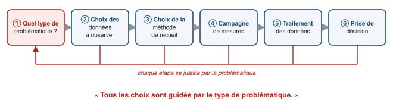

1. **Quel type de problématique ?** On précise la question du **donneur d'ordre** — celui qui commande l'étude. L'exemple du cours : un directeur d'hypermarché demande « une enquête de satisfaction ». C'est **beaucoup trop vague** : veut-il modifier la mise en rayon, améliorer l'affichage des produits, mieux répondre aux attentes des clients sur le choix des produits, les horaires d'ouverture, le conseil ? Chaque réponse conduit à une autre étude.
2. **Choix des données à observer — « qui ? ».** On définit et on **délimite la population** sur laquelle portent les observations, et ses **unités statistiques**. On connaît parfois sa taille, pas toujours.
3. **Choix de la méthode de recueil — « comment obtenir l'information ? ».** Quatre façons de faire :
   - l'**expérimentation** : un protocole permet d'observer directement l'effet d'une **variable de contrôle** (celle qu'on fait varier) sur une **variable d'observation** (celle qu'on mesure) ;
   - l'**observation**, ou **enquête qualitative** : on observe **de façon approfondie un petit nombre** d'individus ;
   - les **données de seconde main** : on **réutilise** des informations disponibles ailleurs (Insee, ministères, entreprises) ;
   - l'**enquête quantitative** : un travail **sur mesure** — on collecte soi-même l'information utile, par questionnaire, auprès d'un grand nombre d'individus.
4. **Campagne de mesures.** Si l'on choisit l'enquête quantitative — **l'option la plus coûteuse** —, il faut décider **combien** de personnes interroger, **quand** et **comment**.
5. **Traitement des données : les faire parler.** C'est l'objet de tout le cours, chaque traitement étant orienté vers la problématique : **présenter** les données sans perte d'information (**chapitre 1**), les **résumer** variable par variable (**chapitre 2**), étudier leurs **évolutions dans le temps** (**chapitre 3**), **croiser** plusieurs variables (**chapitre 4**).
6. **Prise de décision.** Le **rapport statistique** donne les résultats des traitements **et** les **éléments méthodologiques** — les choix faits et les méthodes utilisées —, le tout orienté vers la décision. **Toute information inutile**, c'est-à-dire non informative pour la problématique, **est bannie**. Et **ce n'est pas le rapport qui décide** : la décision est **politique** ; elle s'appuie sur le rapport, mais aussi sur d'autres contraintes, comme le coût.

::: examen Ce qu'il faut retenir du schéma
Les flèches de retour vers la première étape disent l'essentiel : **tous les choix — données, méthode, mesures, traitement — sont guidés par le type de problématique**. Une question du type « Pourquoi la demande du directeur est-elle trop vague ? » attend cette idée : sans problématique précise, on ne sait ni qui interroger, ni quoi mesurer, ni comment traiter les réponses.
:::

### Le vocabulaire : population, unités, caractère, modalités

::: definition Population, unité statistique, taille
**En une phrase :** la population est l'ensemble de ce qu'on étudie ; chacun de ses éléments est une unité statistique ; leur nombre est la taille de la population.

**Définitions à connaître :**
- la **population** est l'**ensemble** (au sens mathématique) étudié ;
- ses éléments s'appellent les **individus** ou **unités statistiques** ;
- le **nombre d'individus** s'appelle la **taille de la population** ou **effectif total**, noté *N*.
:::

Une unité statistique n'est pas forcément une personne : ce peut être une **famille**, un **logement**, une **infraction**, un **match**, un **pays**, une **entreprise**. Pour la trouver, demande-toi : **« sur quoi a-t-on relevé chaque valeur ? »**

::: definition Caractère (variable) et modalités
**En une phrase :** le caractère est ce qu'on observe sur chaque individu ; les modalités sont les valeurs qu'il peut prendre.

**Définitions à connaître :**
- une **variable statistique** ou **caractère statistique** est une **application** qui associe **à chaque individu une valeur** ;
- les valeurs prises par une variable statistique sont ses **modalités**.

**Notation :** la variable s'écrit en **majuscule** (*X*), ses valeurs en **minuscule** ($x_1, x_2, \dots$).
:::

::: exemple Tout repérer dans un tableau — les infractions de 2024 (cours, séance 1)
Selon l'enquête « Vécu et ressenti en matière de sécurité », la répartition des atteintes déclarées en France en 2024 est la suivante.

| Atteinte déclarée | Nombre d'infractions |
|---|---:|
| Actes de vandalisme contre la voiture | 2 893 000 |
| Vols ou tentatives de vol d'objet dans ou sur la voiture | 1 544 000 |
| Vols ou tentatives de vol avec effraction de la résidence principale | 1 516 000 |
| Actes de vandalisme contre le logement | 1 141 000 |
| Vols ou tentatives de vol de vélo | 853 000 |
| Vols sans effraction de la résidence principale | 616 000 |
| Vols ou tentatives de vol de voiture | 549 000 |
| Vols ou tentatives de vol de deux-roues motorisés | 264 000 |
| **Ensemble** | **9 376 000** |

*Champ : France métropolitaine, Martinique, Guadeloupe et La Réunion. Diffusion Insee.*

- **Population** : l'ensemble des **infractions** déclarées commises en France (dans le champ de l'enquête) en **2024**.
- **Unité statistique** : **une infraction** — pas une personne.
- **Taille de la population** : *N* = **9 376 000** infractions (la ligne « Ensemble » ; vérifié : la somme des huit lignes fait bien 9 376 000).
- **Caractère** : *X* = le **type d'atteinte** — qualitatif nominal.
- **Modalités** : les **8 types** d'atteinte, numérotés *k* = 1, …, 8 ; l'**effectif** de chacune est noté $n_k$ : $n_1$ = 2 893 000, $n_2$ = 1 544 000, et ainsi de suite.

Ce tableau est un **tableau de distribution des effectifs du caractère X** : à chaque modalité, il associe son effectif.
:::

### Les types de variables

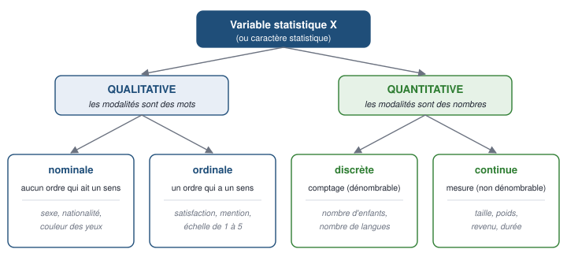

::: definition Variable qualitative, nominale ou ordinale
**En une phrase :** une variable qualitative a des modalités qui ne sont pas des nombres ; elle est ordinale si l'on peut ranger ses modalités dans un ordre qui a du sens, nominale sinon.

**Définitions à connaître :**
- les modalités d'une variable **qualitative** **ne sont pas des nombres** ;
- elle est **nominale** lorsqu'il **n'est pas possible** de classer les modalités selon un **ordre qui a du sens** — le sexe (« homme », « femme », « autre »), la nationalité, la couleur des yeux ;
- elle est **ordinale** lorsqu'il **est possible** de classer les modalités selon un **ordre qui a du sens** — la qualité d'un service (« mauvaise », « plutôt mauvaise », « plutôt bonne », « très bonne »), une mention, une satisfaction.
:::

::: definition Variable quantitative, discrète ou continue
**En une phrase :** une variable quantitative a des modalités qui sont des nombres ; elle est discrète si ces nombres viennent d'un comptage, continue s'ils viennent d'une mesure.

**Définitions à connaître :**
- les modalités d'une variable **quantitative** **sont des nombres** ;
- elle est **discrète** si les modalités relèvent du **comptage** : elles forment un ensemble **dénombrable** (0, 1, 2, …) — le nombre d'enfants, de frères et sœurs, de langues parlées ;
- elle est **continue** si les modalités relèvent de la **mesure** : elles forment un ensemble **non dénombrable** (toutes les valeurs d'un intervalle) — la taille en cm (179, 182, 165, 148, 205…), le poids, une durée, un revenu.
:::

**Deux types, quatre sous-types** : c'est la formule du cours. Pour classer une variable, pose deux questions, dans l'ordre :

1. **Les modalités sont-elles des nombres qui mesurent une quantité ?** Non → qualitative ; oui → quantitative.
2. Qualitative : **peut-on ranger les modalités dans un ordre qui a du sens ?** Non → nominale ; oui → ordinale. Quantitative : **les valeurs se comptent-elles ou se mesurent-elles ?** Compter → discrète ; mesurer → continue.

::: piege Un chiffre ne fait pas une variable quantitative
Une variable qualitative peut être **codée par des nombres** dans une base de données — « un mot valant un chiffre » (cours). Une satisfaction notée de **1 (très mauvaise) à 5 (très bonne)**, un code postal, un numéro de département restent **qualitatifs** : le 4 n'est pas « deux fois » le 2, et additionner deux codes postaux n'a aucun sens. **Le test** : la moyenne des valeurs aurait-elle un sens concret ? Si non, la variable est qualitative (ordinale si l'ordre a un sens, comme pour la satisfaction ; nominale sinon, comme pour le code postal).
:::

::: piege Les cas limites : dis comment la variable est mesurée
- **L'âge** est par nature **continu** (une durée) ; relevé en **années entières** (18, 19, 20…), il se présente comme une variable **discrète**, avec une colonne par âge ; regroupé en **classes** (de 25 à moins de 30 ans), il se traite comme une variable **continue** (histogramme, chapitre 2).
- **Un revenu, un prix** se mesurent en euros : on les traite comme des variables **continues**, même s'ils s'arrêtent au centime.
- **Une fréquence de consommation** est **ordinale** si on la relève par « jamais, rarement, souvent, toujours », **quantitative discrète** si l'on compte le nombre de fois par semaine.

À l'examen, **justifie en une demi-phrase** (« discrète, car elle résulte d'un comptage ») : c'est ce qui fait la différence quand deux réponses sont défendables.
:::

### Population ou échantillon

On ne dispose pas toujours d'une information **exhaustive** sur toute la population qui nous intéresse : il faut parfois **tirer aléatoirement un échantillon**, c'est-à-dire une partie de la population. Deux branches des statistiques :

- la **statistique descriptive** — tout ce cours — décrit les données observées : les présenter, les résumer ;
- la **statistique inférentielle** — hors programme de ce semestre — **déduit** des propriétés de la population **à partir d'un échantillon aléatoire**.

::: examen Le réflexe à avoir devant tout tableau
Avant tout calcul, écris quatre lignes : **population** (qui, où, quand), **unité statistique**, **taille de la population** *N*, **caractère** avec son **type et sous-type** et le **nombre de modalités**. Ces éléments ouvrent presque chaque exercice des planches de TD et rapportent des points faciles.
:::

## 2.2 — La distribution d'une variable : effectifs, fréquences, fréquences cumulées

::: objectif À la fin de cette section, sans support, tu sais
- distinguer série brute et distribution, et passer de l'une à l'autre ;
- définir effectif, fréquence et fréquence cumulée, écrire leurs formules et leurs propriétés ;
- compléter un tableau de distribution et écrire une phrase de lecture pour chaque colonne.
:::

### Deux façons de présenter une variable sans perte d'information

::: definition Série brute et distribution observée
**En une phrase :** la série brute donne la valeur de chaque individu ; la distribution donne, pour chaque modalité, le nombre d'individus qui la présentent.

**Définitions à connaître :**
- la **série brute**, ou **données brutes** (*raw data*), liste la valeur du caractère **pour chaque individu** : **une ligne = un individu** ;
- la **distribution observée des effectifs** (*frequencies*) **associe à chaque modalité** d'une variable statistique **l'effectif observé correspondant** : **une ligne = une modalité**. On la présente dans un **tableau** ou un **diagramme en colonnes**. Elle ne perd **aucune information** sur la répartition de la variable ; c'est souvent **l'étape n° 1** d'une analyse statistique.
:::

::: definition Effectif d'une modalité
**En une phrase :** le nombre d'individus qui ont cette modalité.

**Définition à connaître :** l'**effectif** d'une modalité est le **nombre d'individus présentant cette modalité** du caractère statistique. On le note $n_k$ pour la modalité $x_k$.
:::

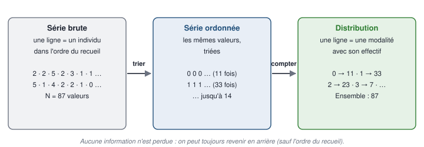

Pour passer de la série brute à la distribution, il faut un **traitement** : pour une variable **quantitative** ou **qualitative ordinale**, **trier** les modalités (on obtient la **série ordonnée**), puis **compter** les effectifs. Pour une variable nominale, on se contente de compter.

::: exemple Les frères et sœurs de 87 étudiants (cours)
Une mini-enquête : 87 étudiants d'une promotion répondent à la question « Combien avez-vous de frères et sœurs ? ». Population : les 87 étudiants — *N* = 87 unités statistiques. Caractère : le **nombre de frères et sœurs**, quantitatif **discret**.

**La série brute** — dans l'ordre des réponses :

```text
2  2  5  2  3  1  1  1  1  2  1  1  0  2  2
5  1  4  2  2  1  0  2  2  1  2  1  1  2  1
3  1  2  1  0  0  1  3 13  2  1  1  2  1  1
1  6  1  3  1  0  1  5  7  2  1  2  2  3  0
3  2  2  7 14  9  5  4  1  0  1  2  1  3  2
1  2  2  0  4  1  0  1  0  1  1  1
```

**La série ordonnée** range ces 87 valeurs de la plus petite à la plus grande : onze fois 0, trente-trois fois 1, vingt-trois fois 2, sept fois 3, puis 4, 4, 4, 5, 5, 5, 5, 6, 7, 7, 9, 13, 14.

**La distribution** compte chaque modalité :

| Nombre de frères et sœurs $x_k$ | 0 | 1 | 2 | 3 | 4 | 5 | 6 | 7 | 9 | 13 | 14 | **Ensemble** |
|---|---|---|---|---|---|---|---|---|---|---|---|---|
| **Effectif** $n_k$ | 11 | 33 | 23 | 7 | 3 | 4 | 1 | 2 | 1 | 1 | 1 | **87** |

**Vérification** : 11 + 33 + 23 + 7 + 3 + 4 + 1 + 2 + 1 + 1 + 1 = 87.

**Attention, erreur du support** : la série brute de la diapositive 17 contient en réalité **10** fois « 0 » et **24** fois « 2 », alors que la série ordonnée et le tableau (diapositives 18 et 19) en comptent **11** et **23** : une valeur a été mal recopiée. Le tableau, cohérent avec la série ordonnée, est celui qu'on retient ; retiens surtout la méthode — **toujours vérifier que la somme des effectifs redonne *N***.
:::

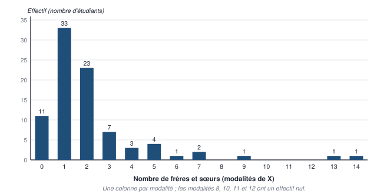

### La fréquence

::: formule Fréquence d'une modalité
$$ f_k = \frac{n_k}{N} $$

- $f_k$ : la **fréquence** de la modalité $x_k$ ;
- $n_k$ : son **effectif** ;
- *N* : l'**effectif total** (la taille de la population).

La fréquence d'une modalité est la **proportion d'individus** qui présentent cette modalité dans la population totale. C'est un nombre entre 0 et 1, qu'on exprime souvent **en pourcentage** (on multiplie par 100).

**Propriétés** : les effectifs s'additionnent pour donner l'effectif total, et les fréquences pour donner 1 :

$$ \sum_{k=1}^{K} n_k = n_1 + n_2 + \dots + n_K = N \qquad \sum_{k=1}^{K} f_k = f_1 + f_2 + \dots + f_K = 1 = 100\ \% $$

**Pourquoi la somme des fréquences vaut 1** : $\sum f_k = \sum \frac{n_k}{N} = \frac{1}{N} \sum n_k = \frac{N}{N} = 1$.
:::

On représente une répartition en fréquences par un **camembert** ou un **diagramme en barres** (cours). Dans un camembert, chaque part a un **angle proportionnel à sa fréquence** : angle $= f_k \times 360°$ — une fréquence de 25 % donne un quart de disque, 90°.

### La fréquence cumulée

::: formule Fréquence cumulée
$$ F_k = f_1 + f_2 + \dots + f_k = \sum_{i=1}^{k} f_i \qquad \text{d'où} \qquad F_k = F_{k-1} + f_k $$

- $F_k$, qu'on note aussi $F(x_k)$ : la **fréquence cumulée** de la modalité $x_k$ ;
- on l'obtient en ajoutant les fréquences **de la première modalité jusqu'à** $x_k$ ;
- en pratique, **de proche en proche** : chaque fréquence cumulée est la précédente plus la fréquence de la ligne.

La fréquence cumulée d'une modalité est la **proportion d'individus présentant cette modalité ou une modalité inférieure**. Elle n'a de sens que si les modalités **peuvent être rangées** : variable **quantitative** ou **qualitative ordinale** — jamais nominale. La dernière vaut toujours **1 = 100 %**.
:::

::: exemple Les familles selon le nombre d'enfants, en 2008 (cours, diapositive 22 et séance 1)
| Modalités $x_k$ | Effectifs $n_k$ (en milliers) | Fréquences $f_k$ (en %) | Fréquences cumulées $F(x_k)$ (en %) |
|---|---:|---:|---:|
| 0 enfant | 8 225 | 48,0 | 48,0 |
| 1 enfant | 3 821 | 22,3 | 70,3 |
| 2 enfants | 3 449 | 20,1 | 90,4 |
| 3 enfants | 1 241 | 7,2 | 97,7 |
| 4 enfants et plus | 396 | 2,3 | 100,0 |
| **Ensemble** | **17 132** | **100,0** | |

- **Population** : l'ensemble des familles en France en 2008 ; **taille** : *N* = 17 132 **milliers** de familles, soit environ 17,1 millions. **Caractère** : le nombre d'enfants, quantitatif **discret**, 5 modalités (*k* = 1, …, 5).
- **Une fréquence** : $f_2 = n_2 / N = 3\,821 / 17\,132 = 0,223$, soit **22,3 %** — « **22,3 % des familles ont 1 enfant** ».
- **Des fréquences cumulées** : $F_1 = f_1 = 48,0$ % ; $F_2 = f_1 + f_2 = 48,0 + 22,3 = 70,3$ % — « **70,3 % des familles ont 1 enfant ou moins** » ; $F_3 = F_2 + f_3 = 70,3 + 20,1 = 90,4$ %, que l'on retrouve aussi par $f_1 + f_2 + f_3 = 48 + 22,3 + 20,1$.
- **Vérifications** : 8 225 + 3 821 + 3 449 + 1 241 + 396 = 17 132 ; 48,0 + 22,3 + 20,1 + 7,2 + 2,3 = 99,9 — l'écart de 0,1 vient des arrondis ; la dernière fréquence cumulée vaut 100,0.

**Attention, erreur du support** : la diapositive annonce une « enquête menée auprès de 17132 familles », mais les effectifs sont **en milliers** : il s'agit de **17 132 milliers** de familles, soit toutes les familles de France. L'« année donnée » est **2008** (les mêmes chiffres reviennent au chapitre 2 avec cette date).
:::

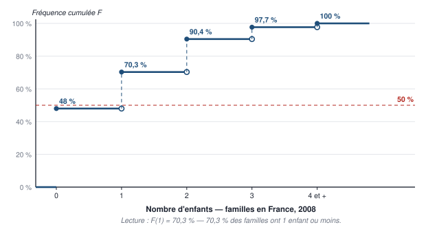

**Comment lire ce diagramme** : pour une variable discrète, la fréquence cumulée reste constante entre deux modalités, puis **saute** à chaque modalité d'une hauteur égale à sa fréquence : c'est un **diagramme en escalier**. Le premier palier qui dépasse la ligne des 50 % montre où se trouve le « milieu » de la population — la **médiane**, au chapitre 2.

### Les notations du cours

Au tableau, les modalités sont numérotées par l'indice **k** (*k* = 1, …, *K*) ; dans les diapositives, par l'indice **i** (*i* = 1, …, *p*, pour *p* modalités) : $n_i$, $f_i = n_i / n$, $F_k = \sum_{i=1}^{k} f_i$. **C'est la même chose** : utilise l'une ou l'autre, mais une seule dans une copie. Au chapitre 2, on distinguera l'indice d'une **observation** (données brutes, *i* = 1, …, *N*) et celui d'une **modalité** (distribution, *i* = 1, …, *p*).

::: methode Compléter un tableau de distribution, sans rien oublier
1. **Identifier** : population, unité, *N*, caractère, type, nombre de modalités.
2. **Écrire la formule** avant le premier calcul : $f_k = n_k / N$ — la planche de TD le demande (« après avoir écrit la formule correspondante »).
3. **Calculer chaque fréquence**, en gardant assez de décimales (au moins quatre, ou un dixième de pour cent).
4. **Cumuler de proche en proche** : $F_1 = f_1$, puis $F_k = F_{k-1} + f_k$.
5. **Vérifier** : $\sum n_k = N$, $\sum f_k = 1$ (à l'arrondi près), dernière $F$ = 100 %.
6. **Écrire une phrase de lecture** pour une fréquence et une fréquence cumulée, avec la population, le lieu, la date et l'unité : « En 2008, 70,3 % des familles vivant en France ont 1 enfant ou moins. »
:::

## 2.3 — Représenter pour informer : diagrammes et tableaux

::: objectif À la fin de cette section, sans support, tu sais
- choisir le diagramme adapté à une distribution et le tracer correctement ;
- comparer les distributions de plusieurs sous-populations avec des colonnes groupées, empilées ou empilées à 100 %, en disant ce que chacune montre ;
- écrire une phrase de lecture et donner un titre complet à un tableau ou un graphique.
:::

### Un diagramme pour une distribution

| Type de variable | Le diagramme | Ce qu'on met en ordonnée |
|---|---|---|
| **Qualitative nominale** | **Colonnes** (ou **barres**, horizontales) ; **camembert** | Effectifs ou fréquences ; l'ordre des colonnes est libre |
| **Qualitative ordinale** | **Colonnes** dans l'ordre des modalités ; fréquences cumulées en escalier | Effectifs ou fréquences |
| **Quantitative discrète** | **Colonnes** — une par modalité, **y compris les modalités d'effectif nul** — ; fréquences cumulées en escalier | Effectifs ou fréquences |
| **Quantitative continue** | Regroupée en **classes** : **histogramme** (chapitre 2) | La **densité** |

**Tracer un diagramme en colonnes, pas à pas** : une colonne par modalité, **de même largeur** ; une hauteur proportionnelle à l'effectif ou à la fréquence ; une **échelle** indiquée (par exemple 1 cm pour 10 %) ; les deux axes **nommés**, avec leur unité ; un **titre** complet et la **source**. Le diagramme des frères et sœurs, plus haut, en est un modèle : les modalités 8, 10, 11 et 12 y figurent avec une hauteur nulle, pour ne pas écraser l'échelle des nombres.

### Plusieurs distributions d'un même caractère

Il arrive souvent que **plusieurs distributions d'un même caractère** soient présentées ensemble, **pour les comparer**. La population est alors découpée en **sous-populations** selon une autre variable — l'année, la zone géographique… — ; il y a **une distribution par sous-population**, et on les **juxtapose**. Le but est de **comparer la répartition** de la variable entre sous-populations.

::: exemple Les personnes écrouées en France, de 2020 à 2023 (cours)
| Catégorie | 2020 | 2021 | 2022 | 2023 |
|---|---:|---:|---:|---:|
| Prévenus détenus | 17 692 | 18 486 | 18 779 | 19 755 |
| Condamnés-prévenus détenus | 2 405 | 2 613 | 2 908 | 3 117 |
| Condamnés détenus | 41 553 | 47 246 | 49 338 | 51 746 |
| Condamnés non détenus | 12 184 | 13 644 | 14 286 | 15 453 |
| **Total des personnes écrouées** | **73 834** | **81 989** | **85 311** | **90 071** |

*Source : ministère de la Justice. Les totaux ont été vérifiés.*

- **Population** : les personnes écrouées en France de 2020 à 2023 ; **sous-populations** : les **quatre années** (une distribution par année) ; **caractère** : la **catégorie** de personne écrouée — qualitatif **nominal**, 4 modalités.
- Une **personne écrouée** est placée sous la garde de l'administration pénitentiaire : **prévenue** (pas encore jugée définitivement), **condamnée**, ou **condamnée-prévenue** (condamnée dans une affaire, en attente de jugement dans une autre) ; **détenue** en prison, ou **non détenue** — par exemple sous bracelet électronique.
:::

Pour comparer ces distributions, on trace un **diagramme en colonnes groupées**. **Le groupement dépend de la comparaison au centre de l'analyse** :

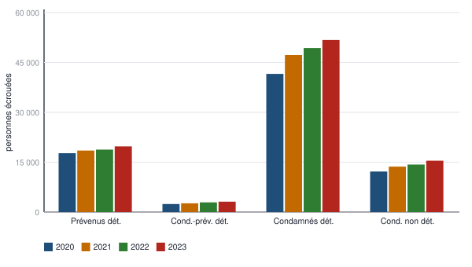

- **Si l'on s'intéresse à l'évolution des effectifs de chaque catégorie**, on **groupe par catégorie** : les quatre années côte à côte pour chaque catégorie. On voit d'un coup d'œil que **chaque catégorie augmente chaque année** — les condamnés détenus passent de 41 553 à 51 746.

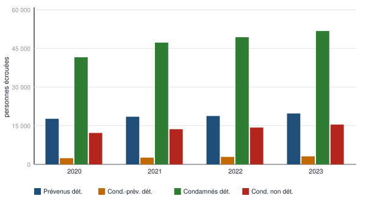

- **Si l'on s'intéresse à l'évolution de la structure des effectifs**, on **groupe par année** : les quatre catégories côte à côte pour chaque année. On voit la **structure** de chaque année — les condamnés détenus dominent toujours, loin devant les prévenus détenus —, puis on compare les années.

::: exemple Les familles selon le nombre d'enfants mineurs, de 1990 à 2023 (cours)
| Nombre d'enfants mineurs | 1990 | 1999 | 2007 | 2012 | 2017 | 2023 |
|---|---:|---:|---:|---:|---:|---:|
| 1 enfant | 3 353,7 | 3 418,3 | 3 565,0 | 3 614,8 | 3 590,7 | 3 578,3 |
| 2 enfants | 2 800,5 | 2 841,1 | 2 996,3 | 3 074,1 | 3 101,1 | 3 039,0 |
| 3 enfants | 1 087,1 | 1 033,5 | 1 015,2 | 1 022,3 | 1 012,2 | 956,2 |
| 4 enfants ou plus | 410,9 | 334,5 | 296,9 | 296,1 | 310,7 | 308,4 |
| **Ensemble** | **7 652,2** | **7 627,5** | **7 873,5** | **8 007,3** | **8 014,7** | **7 881,9** |

*Champ : France hors Mayotte, familles vivant en ménage ordinaire ayant au moins un enfant mineur. Unité : milliers de familles. Source : Insee, recensements de la population.*

- **Population** : les familles vivant en France (hors Mayotte), en ménage ordinaire, ayant **au moins un enfant mineur** ; **sous-populations** : les **six années** ; **unité statistique** : une **famille** ; **caractère** : le **nombre d'enfants mineurs**, quantitatif **discret**, 4 modalités (la dernière est une classe ouverte : « 4 ou plus »). Les effectifs sont **en milliers**.
- **Une phrase de lecture** : « En 2023, en France hors Mayotte, 3 578,3 milliers de familles — près de 3,6 millions — ont un seul enfant mineur. »
- Les totaux de 1999 et 2007 dépassent de 0,1 la somme des lignes (7 627,4 et 7 873,4) : ce sont des **arrondis**, sans conséquence.
:::

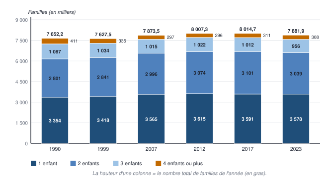

**Le diagramme empilé** superpose les modalités dans une même colonne : la **hauteur de l'empilement est l'effectif total de la sous-population** — ici, le **nombre total de familles** de l'année. Il sert à comparer les **totaux** et, grossièrement, leur composition.

**Attention, erreur du support** : la diapositive dit que la hauteur de l'empilement « correspond à l'ensemble des **enfants** » et titre « nombre d'enfants par type de famille ». Chaque colonne compte des **familles** (en milliers) : c'est le **nombre de familles selon leur nombre d'enfants**, et la hauteur est le **nombre total de familles** ayant au moins un enfant mineur.

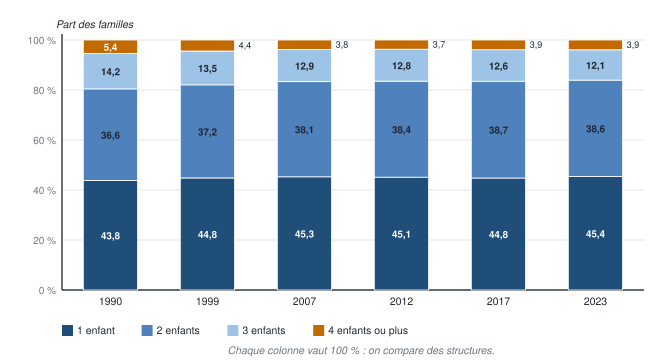

**Le diagramme empilé à 100 %** ramène chaque colonne à 100 % : cela **revient à prendre les fréquences et non les effectifs**, année par année. Il sert à comparer des **structures** dans le temps — la part des familles de 3 enfants baisse de 14,2 % à 12,1 % —, mais **il ne montre plus les effectifs** : il ne dit pas combien il y a de familles.

::: exemple Comment a été calculé le chiffre 12,6 ? (question de la diapositive 30)
C'est la **fréquence** des familles de **3 enfants** en **2017** : $f = 1\,012,2 / 8\,014,7 = 0,1263$, soit **12,6 %**. **Phrase de lecture** : « En 2017, en France hors Mayotte, 12,6 % des familles ayant au moins un enfant mineur ont trois enfants mineurs. »
:::

::: piege Un graphique n'est pas toujours la traduction du tableau voisin
La diapositive 31 présente un diagramme empilé à 100 % comme ayant « **le même contenu informationnel** » que le tableau de 1990-2023. **C'est faux** : ses années sont 1975, 1982, 1990, 1999 et 2008, et il compte **toutes les familles**, avec la modalité « **0 enfant** » — ce sont d'autres données (sa colonne 2008 reprend le tableau de la diapositive 22 : 48,0 ; 22,3 ; 20,1 ; 7,2 ; 2,3). **Le réflexe** : avant de commenter un graphique, vérifie ses années, son champ et ses modalités.
:::

### Tableaux et graphiques : des outils de communication

Présenter des données sous forme de tableau ou de graphique sert à **informer** : **donner une forme et une signification** à des données, le plus souvent numériques et brutes. Les tableaux et les graphiques **produisent de l'information** : ce sont des **outils de communication**, qu'il faut **choisir et intituler à bon escient** pour que l'information utile passe.

::: methode Les règles d'un tableau ou d'un graphique qui informe (cours)
1. **Des intitulés précis** — pas de noms de variables ou de modalités obscurs (« NBENF_M » → « Nombre d'enfants mineurs »).
2. **Lisible par un non-spécialiste.**
3. **Compréhension immédiate**, ou simplifiée au maximum ; si c'est complexe, une **note de lecture** en bas du tableau.
4. **Indiquer les unités de mesure, la population, les choix méthodologiques** — et la **source**.

**Le titre complet** dit **quoi** (le caractère), **qui** (la population), **où** et **quand** : « Répartition des familles selon le nombre d'enfants mineurs, France hors Mayotte, de 1990 à 2023 (en milliers) ». **La note de lecture** traduit une case en phrase : « Lecture : en 2017, 12,6 % des familles ayant au moins un enfant mineur ont trois enfants mineurs. »
:::

::: examen Conclusion du chapitre
Présenter la distribution d'un caractère en **effectifs**, en **fréquences** ou en **fréquences cumulées** est souvent la **première étape** des traitements de statistique descriptive. Le chapitre 2 part de là pour **résumer** cette distribution en quelques nombres.
:::

# 3 — Pièges et points bonus

## Les confusions qui coûtent des points

| Ne confonds pas… | Ce qui est juste |
|---|---|
| **Population** et **unité statistique** | L'ensemble étudié (toutes les infractions de 2024) **contre** un de ses éléments (une infraction) |
| **Unité statistique** et **personne interrogée** | L'unité est ce sur quoi porte chaque valeur : une famille, un logement, un match, une infraction — pas toujours une personne |
| **Caractère** et **modalité** | La variable observée (le type d'atteinte) **contre** une de ses valeurs (vol de vélo) |
| **Nominale** et **ordinale** | Aucun ordre qui ait un sens (nationalité) **contre** un ordre qui a un sens (satisfaction) |
| **Discrète** et **continue** | Un comptage, des valeurs isolées (nombre d'enfants) **contre** une mesure, toutes les valeurs d'un intervalle (taille) |
| **Qualitative codée en chiffres** et **quantitative** | Une échelle de 1 à 5 ou un code postal restent qualitatifs : leur moyenne n'a pas de sens concret |
| **Série brute** et **distribution** | Une ligne par individu **contre** une ligne par modalité |
| **Effectif** et **fréquence** | Un nombre d'individus ($n_k$) **contre** une proportion ($f_k = n_k / N$) |
| **Fréquence** et **fréquence cumulée** | « 20,1 % ont 2 enfants » **contre** « 90,4 % ont 2 enfants **ou moins** » |
| **Somme des fréquences** et **dernière fréquence cumulée** | Les deux valent 1, mais la somme des fréquences cumulées ne vaut rien de particulier |
| **Groupement par catégorie** et **par année** | L'évolution de chaque catégorie **contre** la structure de chaque année |
| **Empilé** et **empilé à 100 %** | Des effectifs, qui montrent les totaux **contre** des fréquences, qui montrent les structures |
| **Statistique descriptive** et **inférentielle** | Décrire les données observées **contre** déduire des propriétés d'une population à partir d'un échantillon |

## Si tu lis autre chose ailleurs : les erreurs des sources, corrigées

| On lit dans les supports… | Ce qui est exact |
|---|---|
| La série brute des 87 étudiants (diapositive 17) | Elle compte 10 fois « 0 » et 24 fois « 2 » ; le tableau et la série ordonnée, **11 et 23** : c'est le tableau qu'on retient |
| « Enquête menée auprès de 17132 familles » (diapositive 22) ; « taille pop = 17132 » | Des **milliers** : 17 132 milliers de familles, soit 17,1 millions, en **2008** |
| « L'illustration de la diapo 21 » (diapositive 23) | C'est la **diapositive 22** |
| La hauteur de l'empilement « correspond à l'ensemble des enfants » (diapositive 29) | Au **nombre total de familles** ayant au moins un enfant mineur |
| Le diagramme de la diapositive 31 a « le même contenu informationnel que le tableau précédent » | **Non** : autres années (1975-2008), familles avec ou sans enfant, fréquences |
| La répartition par âge d'obtention du bac totalise 100 % (planche de TD, exercice 3) | Elle totalise **100,6 %** : incohérence de la source, à signaler |

## Ce que les correcteurs récompensent

- **Les éléments statistiques identifiés d'abord**, dans l'ordre : population (qui, où, quand), unité, taille *N*, caractère, type **et** sous-type, nombre de modalités.
- **Une justification du type** en une demi-phrase : « discrète, car elle résulte d'un comptage » ; « ordinale, car les modalités se rangent de la plus mauvaise à la meilleure ».
- **La formule écrite avant le calcul** ($f_k = n_k / N$, $F_k = F_{k-1} + f_k$), puis le calcul posé, puis le résultat avec son unité.
- **Une phrase de lecture complète** : qui, où, quand, combien — et « ou moins » pour une fréquence cumulée.
- **Un diagramme propre** : titre complet, axes nommés avec unités, échelle indiquée, source ; les modalités d'effectif nul d'une variable discrète figurent sur l'axe.
- **L'esprit critique** : repérer qu'un tableau est en milliers, qu'un total ne tombe pas juste, qu'un effectif calculé à partir d'un échantillon ne vaut pas pour toute la population.

# 4 — Ancrage mémoriel

## 4.1 — Fiche de synthèse

| | L'essentiel à savoir par cœur |
|---|---|
| **L'étude** | Décider → s'informer → étudier · **6 étapes** : problématique · choix des données (qui ?) · méthode de recueil (expérimentation, observation qualitative, seconde main, enquête quantitative) · campagne de mesures (combien, quand, comment ; la plus coûteuse) · traitement (présenter ch. 1, résumer ch. 2, évolutions ch. 3, croiser ch. 4) · décision (rapport = résultats + méthode ; l'information inutile est bannie ; le rapport ne décide pas) · **tout est guidé par la problématique** |
| **Vocabulaire** | **Population** : l'ensemble étudié · **individus** ou **unités statistiques** : ses éléments · **taille** ou **effectif total** *N* · **caractère** ou **variable** *X* : associe une valeur à chaque individu · **modalités** $x_k$ : ses valeurs · *X* majuscule, *x* minuscule |
| **Types** | **Qualitative** (mots) : **nominale** (pas d'ordre) · **ordinale** (ordre qui a un sens) · **quantitative** (nombres) : **discrète** (comptage) · **continue** (mesure) · piège : un code en chiffres reste qualitatif |
| **Présenter** | **Série brute** : 1 ligne = 1 individu · **distribution** : 1 ligne = 1 modalité et son effectif · trier puis compter · sans perte d'information sur la répartition |
| **Formules** | $f_k = n_k / N$ · $\sum n_k = N$ · $\sum f_k = 1$ · $F_k = f_1 + \dots + f_k = F_{k-1} + f_k$ ; fréquence cumulée = « ou moins », quantitatif ou ordinal seulement ; dernière *F* = 100 % |
| **Diagrammes** | Colonnes, barres, camembert (angle = $f \times 360°$) · escalier des fréquences cumulées · continue en classes → histogramme (ch. 2) |
| **Comparer** | Sous-populations juxtaposées · **colonnes groupées** par catégorie (évolution de chaque catégorie) ou par année (structure) · **empilées** : totaux · **empilées à 100 %** : structures (= fréquences) |
| **Communiquer** | Intitulés précis · lisible par un non-spécialiste · note de lecture · unités, population, champ, méthode, source · titre = quoi, qui, où, quand |
| **Échantillon** | Statistique **descriptive** (décrire) ≠ **inférentielle** (de l'échantillon aléatoire à la population) |

## 4.2 — Moyens mnémotechniques

| Pour retenir… | Le moyen |
|---|---|
| Les six étapes | **« Pour Décider, Mieux Compter, Traiter, Trancher »** : **P**roblématique, **D**onnées, **M**éthode de recueil, **C**ampagne de mesures, **T**raitement, **T**rancher (la décision) |
| Les quatre méthodes de recueil | **E-O-S-Q** : **E**xpérimenter, **O**bserver, réutiliser la **S**econde main, **Q**uestionner (enquête quantitative) |
| Les quatre chapitres | **Présenter, Résumer, Dater, Croiser** |
| Qualitatif ou quantitatif | **« Peut-on en faire la moyenne ? »** Non → qualitatif ; oui → quantitatif |
| Nominal ou ordinal | **Nominal = Nom** (une étiquette, sans rang) · **Ordinal = Ordre** |
| Discret ou continu | **Discret = je Compte** (des personnes, des langues) · **Continu = je Mesure** (avec une règle, une balance, un chronomètre) |
| La fréquence cumulée | **F majuscule = « ou moins »** : F grimpe comme un escalier jusqu'à 100 % |
| Groupé, empilé, 100 % | **Groupé = comparer les colonnes · Empilé = comparer les totaux · 100 % = comparer les structures** |

## 4.3 — Le schéma qui relie tout

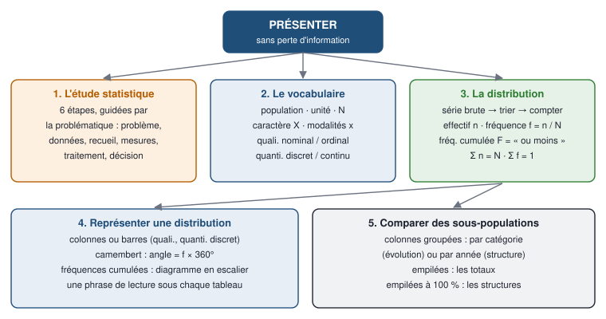

**Comment t'en servir :** à chaque révision, redessine ce schéma sur une feuille blanche, **de mémoire** : « présenter » au centre, puis les cinq blocs, puis, dans chaque bloc, tout ce que tu peux accrocher — les six étapes, les définitions, les formules, les types de diagrammes et ce qu'ils montrent. Compare ensuite avec le modèle et complète en couleur ce qui manquait.

# 5 — Teste-toi

*Fais tout ce test sur une feuille, **sans regarder le cours**. Le corrigé est **à la fin du document**, dans la partie « Corrigés », sur une page à part : ne la lis qu'après. En statistiques, l'examen est fait d'exercices : le QCM vérifie que tu sais le cours ; les exercices des niveaux 2 à 4 te mettent en condition d'examen. Chaque question renvoie à sa section (§).*

## Niveau 1 — QCM

*Une seule bonne réponse par question.*

**1.** Dans quel ordre se déroule une étude statistique ? *(§ 2.1)*

- **a)** problématique → méthode de recueil → choix des données → campagne de mesures → traitement → décision
- **b)** problématique → choix des données → méthode de recueil → campagne de mesures → traitement → décision
- **c)** choix des données → problématique → traitement → méthode de recueil → campagne de mesures → décision
- **d)** méthode de recueil → traitement → problématique → décision → campagne de mesures → choix des données

**2.** Qu'est-ce qui guide tous les choix d'une étude statistique ? *(§ 2.1)*

- **a)** le coût de l'enquête
- **b)** la taille de la population
- **c)** le type de problématique
- **d)** la méthode de recueil

**3.** Observer en profondeur un petit nombre d'individus, c'est : *(§ 2.1)*

- **a)** une enquête qualitative (observation)
- **b)** une enquête quantitative
- **c)** une expérimentation
- **d)** utiliser des données de seconde main

**4.** La méthode de recueil la plus coûteuse est : *(§ 2.1)*

- **a)** l'observation
- **b)** les données de seconde main
- **c)** le rapport statistique
- **d)** l'enquête quantitative

**5.** Dans le tableau des infractions de 2024, l'unité statistique est : *(§ 2.1)*

- **a)** une personne victime
- **b)** un type d'atteinte
- **c)** une infraction
- **d)** la France

**6.** Une variable statistique est : *(§ 2.1)*

- **a)** l'ensemble étudié
- **b)** le nombre d'individus
- **c)** une valeur prise par un individu
- **d)** une application qui associe une valeur à chaque individu

**7.** La nationalité est une variable : *(§ 2.1)*

- **a)** qualitative nominale
- **b)** qualitative ordinale
- **c)** quantitative discrète
- **d)** quantitative continue

**8.** La qualité d'un service (« mauvaise », « plutôt mauvaise », « plutôt bonne », « très bonne ») est une variable : *(§ 2.1)*

- **a)** qualitative nominale
- **b)** qualitative ordinale
- **c)** quantitative discrète
- **d)** quantitative continue

**9.** Le nombre de langues parlées est une variable : *(§ 2.1)*

- **a)** qualitative ordinale
- **b)** quantitative continue
- **c)** qualitative nominale
- **d)** quantitative discrète

**10.** Une satisfaction notée de 1 à 5 est une variable : *(§ 2.1)*

- **a)** quantitative discrète, puisque ses modalités sont des nombres
- **b)** quantitative continue
- **c)** qualitative ordinale codée en chiffres
- **d)** qualitative nominale

**11.** Le poids d'un nouveau-né est une variable : *(§ 2.1)*

- **a)** quantitative continue
- **b)** quantitative discrète
- **c)** qualitative ordinale
- **d)** qualitative nominale

**12.** Déduire des propriétés d'une population à partir d'un échantillon aléatoire relève : *(§ 2.1)*

- **a)** de la statistique descriptive
- **b)** de la campagne de mesures
- **c)** de la problématique
- **d)** de la statistique inférentielle

**13.** Dans une série brute, une ligne correspond à : *(§ 2.2)*

- **a)** un individu
- **b)** une modalité
- **c)** une fréquence
- **d)** une sous-population

**14.** Pour passer d'une série brute d'une variable quantitative à sa distribution, on : *(§ 2.2)*

- **a)** compte, puis trie
- **b)** trie, puis compte
- **c)** calcule les fréquences cumulées
- **d)** calcule la moyenne

**15.** La fréquence d'une modalité se calcule par : *(§ 2.2)*

- **a)** $f_k = N / n_k$
- **b)** $f_k = n_k \times N$
- **c)** $f_k = n_k / N$
- **d)** $f_k = n_k - N$

**16.** La somme de toutes les fréquences d'une distribution vaut : *(§ 2.2)*

- **a)** 1
- **b)** *N*
- **c)** 0
- **d)** le nombre de modalités

**17.** En 2008, la fréquence cumulée de la modalité « 1 enfant » vaut 70,3 %. Cela signifie que : *(§ 2.2)*

- **a)** 70,3 % des familles ont exactement 1 enfant
- **b)** 70,3 % des familles ont 1 enfant ou moins
- **c)** 70,3 % des familles ont 1 enfant ou plus
- **d)** 70,3 % des familles ont au moins 2 enfants

**18.** On peut calculer des fréquences cumulées pour : *(§ 2.2)*

- **a)** la couleur des yeux
- **b)** la nationalité
- **c)** le nombre d'enfants
- **d)** le lieu de résidence

**19.** Si $f_1$ = 48,0 %, $f_2$ = 22,3 % et $f_3$ = 20,1 %, alors $F_3$ vaut : *(§ 2.2)*

- **a)** 20,1 %
- **b)** 42,4 %
- **c)** 70,3 %
- **d)** 90,4 %

**20.** Dans le tableau des familles de 2008, le nombre « 17 132 » de la ligne Ensemble représente : *(§ 2.2)*

- **a)** 17 132 milliers de familles
- **b)** 17 132 familles interrogées
- **c)** 17 132 enfants
- **d)** 17 132 %

**21.** Pour suivre l'évolution de chaque catégorie de personnes écrouées d'une année à l'autre, on groupe les colonnes : *(§ 2.3)*

- **a)** par année
- **b)** en camembert
- **c)** en empilement à 100 %
- **d)** par catégorie

**22.** Un diagramme empilé à 100 % permet de comparer : *(§ 2.3)*

- **a)** des totaux
- **b)** des structures
- **c)** des effectifs
- **d)** des moyennes

**23.** Dans un camembert, une fréquence de 20 % correspond à un angle de : *(§ 2.3)*

- **a)** 20°
- **b)** 36°
- **c)** 72°
- **d)** 90°

**24.** Dans le diagramme empilé des familles de 1990 à 2023, la hauteur d'une colonne mesure : *(§ 2.3)*

- **a)** le nombre total de familles ayant au moins un enfant mineur
- **b)** le nombre total d'enfants
- **c)** 100 %
- **d)** le nombre de familles de 4 enfants ou plus

**25.** Le titre complet d'un tableau dit : *(§ 2.3)*

- **a)** seulement le caractère étudié
- **b)** le nom de l'auteur
- **c)** la formule utilisée
- **d)** quoi, qui, où et quand

## Niveau 2 — Exercices types d'examen

*Ce sont les quatre exercices de la planche de TD du chapitre 1 : fais-les seul avant la séance, chronomètre en main, puis corrige avec la partie « Corrigés », à la fin du document.*

### Exercice 1 — Identifier les types de variables (planche, exercice 1 ; § 2.1)

Précisez le type et le sous-type de chaque caractère : revenu annuel ; sexe ; situation matrimoniale ; lieu de résidence ; poids ; taille ; nationalité ; couleur des yeux ; nombre de langues parlées ; fréquence de consommation d'un bien.

### Exercice 2 — Les éléments d'une étude statistique (planche, exercice 2 ; § 2.1)

Pour chaque sujet d'étude, précisez l'unité statistique, le caractère étudié et son type : **a)** le temps de jeu effectif (en minutes) dans les matchs de la Coupe du monde de rugby 2023 ; **b)** l'absentéisme (en jours) des salariés de Google en 2023 ; **c)** la préférence pour les fraises Tagada dans une école maternelle.

### Exercice 3 — Manier les représentations d'une variable (planche, exercice 3 ; § 2.2 et 2.3)

L'enquête « Conditions de vie des étudiants 2020 » de l'Observatoire de la vie étudiante (OVE) donne la répartition des étudiants en cours d'études au printemps 2020 en France selon l'âge d'obtention du bac. Champ : ensemble des répondants (*n* = 60 014).

| Âge d'obtention du bac | Moins de 18 ans | 18 ans | 19 ans | 20 ans | 21 ans | 22 ans | 23 ans | 24 ans | 25 ans | 26 ans et plus |
|---|---|---|---|---|---|---|---|---|---|---|
| **%** | 8,7 | 68,3 | 15,8 | 3,8 | 1,3 | 0,7 | 0,4 | 0,2 | 0,2 | 1,2 |

1. Quelle est la population étudiée ? L'unité statistique ?
2. Quel est le caractère étudié ? Son type ? Combien y a-t-il de modalités ?
3. Proposez une question de questionnaire permettant d'observer cette variable.
4. Quel est ce tableau ? Sous quelle forme sont présentées les données ?
5. Écrivez une note de lecture à partir d'un exemple.
6. Après avoir écrit la formule correspondante, calculez l'effectif de la 4ᵉ modalité et faites une phrase. Ce chiffre correspond-il au nombre d'étudiants ayant obtenu le bac à 20 ans en 2020 en France ?
7. Tracez un diagramme en colonnes des fréquences, correctement annoté, avec son échelle.

### Exercice 4 — Interpréter une étude statistique (planche, exercice 4 ; § 2.2)

Votre entreprise, qui peine à recruter, vous charge d'une étude sur la qualité de l'emploi, pour identifier les postes ou les salariés pour lesquels une intervention est urgente. Quatre dimensions : la sécurité de l'emploi (le type de contrat), la souplesse dans l'organisation de son temps (Likert à 4 modalités), la qualité du soutien social (Likert de 1 : très mauvaise, 2 : plutôt mauvaise, 3 : moyenne, 4 : plutôt bonne, à 5 : très bonne) et l'autonomie décisionnelle (forte ou faible). Données recueillies et anonymisées :

| Salarié | Contrat | Souplesse de l'organisation du temps | Lien social | Autonomie |
|---|---|---|---|---|
| 1 | CDI | Pas du tout souple | 5 | Forte |
| 2 | CDD | Plutôt souple | 5 | Forte |
| 3 | CDD | Plutôt souple | 3 | Forte |
| 4 | Intérim | Très souple | 4 | Faible |
| 5 | CDI | Très souple | 4 | Faible |
| 6 | CDI | Plutôt pas souple | 5 | Faible |
| 7 | CDI | Pas du tout souple | 1 | Faible |
| 8 | CDI | Plutôt souple | 1 | Faible |
| 9 | CDD | Plutôt pas souple | 2 | Forte |
| 10 | CDD | Très souple | 2 | Forte |
| 11 | CDI | Plutôt souple | 3 | Forte |
| 12 | CDI | Plutôt pas souple | 4 | Faible |
| 13 | Intérim | Plutôt pas souple | 5 | Faible |
| 14 | CDI | Plutôt pas souple | 5 | Forte |
| 15 | CDI | Très souple | 4 | Faible |
| 16 | CDD | Plutôt souple | 4 | Faible |

1. Identifiez la population, l'unité statistique, la taille de la population.
2. De quel type de données disposez-vous : brutes ou de distribution ?
3. Quelle question poseriez-vous pour chaque dimension ? Quel est le type de chaque variable ?
4. Créez un tableau de répartition de la qualité du lien social.
5. Calculez les fréquences cumulées et tracez le diagramme correspondant.
6. Ordonnez les quatre variables en 3, 4, 5 et 2 niveaux.
7. Après avoir calculé les fréquences cumulées dans chaque cas et repéré la position de la médiane, coloriez en rouge les cases situées sous la médiane.
8. Au vu de l'objectif, vaut-il mieux présenter les données sous forme brute ou sous forme de distribution ? Pourquoi ?
9. Si l'objectif était un suivi annuel de la qualité de l'emploi pour vos investisseurs, comment résumeriez-vous l'information ?

## Niveau 3 — Questions pièges et cas transversaux

*Vrai ou faux ? Justifie chaque réponse en une phrase.*

1. Le code postal est une variable quantitative discrète.
2. Une satisfaction notée de 1 à 5 est quantitative, puisque ses modalités sont des nombres.
3. On peut calculer les fréquences cumulées de la nationalité.
4. F(2 enfants) = 90,4 % signifie que 90,4 % des familles ont 2 enfants.
5. La somme des fréquences cumulées vaut 1.
6. Un diagramme empilé à 100 % montre que le nombre de familles a augmenté de 1990 à 2012.
7. L'unité statistique d'une étude sur le temps de jeu des matchs de rugby est le joueur.
8. La distribution observée des effectifs perd de l'information sur la répartition de la variable.
9. Dans un diagramme en colonnes d'une variable discrète, on peut omettre les modalités d'effectif nul.
10. Un camembert convient bien pour montrer le nombre de frères et sœurs de 87 étudiants.
11. Si 20 % des étudiants du site A et 30 % de ceux du site B viennent en voiture, plus d'étudiants viennent en voiture sur le site B.
12. Une enquête qualitative porte sur un grand nombre d'individus, interrogés par questionnaire.

## Niveau 4 — Sujet au format de l'examen

::: objectif Le cadre
**Le format réel de l'épreuve n'est pas encore connu** : aucune annale ni modalité n'a été reçue. Ce sujet suit le format des planches de TD — exercices sur données, calculs posés, phrases d'interprétation —, avec calculatrice, sans document. Les données sont **fictives**. Il sera recalé sur les annales dès que tu les auras envoyées.

**En trois pomodoros** : **P1** l'exercice 1 ; **P2** les exercices 2 et 3 ; **P3** la correction au barème. Les examens blancs, eux, se feront d'une traite, à la durée réelle.
:::

**Exercice 1 — Les TD manqués (9 points).** On a relevé, pour les 40 étudiants d'un groupe de TD, le nombre de séances de TD manquées au premier semestre :

```text
0  1  0  2  0  1  3  0  1  0
2  0  1  4  0  0  1  2  5  1
0  3  1  0  2  1  0  4  0  2
1  0  3  2  1  0  4  1  2  3
```

1. Identifiez la population, l'unité statistique, la taille de la population, le caractère, son type et son sous-type. Sous quelle forme les données sont-elles présentées ? (2 points)
2. Construisez le tableau de distribution : effectifs, fréquences, fréquences cumulées. Écrivez les formules utilisées. (4 points)
3. Écrivez une phrase de lecture pour la fréquence de la modalité 0 et pour la fréquence cumulée de la modalité 1. (1 point)
4. Tracez le diagramme en colonnes des effectifs, correctement annoté. (2 points)

**Exercice 2 — Venir à la faculté (8 points).** Une université interroge ses étudiants de deux sites sur leur mode de transport principal (données fictives).

| Mode de transport principal | Site A | Site B |
|---|---:|---:|
| Bus | 180 | 50 |
| Tramway | 60 | 100 |
| Voiture | 80 | 75 |
| Vélo ou marche | 80 | 25 |
| **Ensemble** | **400** | **250** |

1. Identifiez la population, les sous-populations, le caractère, son type et ses modalités. (2 points)
2. Calculez la répartition en fréquences de chaque site. (2 points)
3. Quel diagramme choisir pour comparer les habitudes des deux sites ? Justifiez. (2 points)
4. « Les étudiants du site B viennent plus souvent en voiture : il y a donc plus de voitures d'étudiants sur le site B. » Discutez. (2 points)

**Exercice 3 — Questions de cours (3 points).** 1. Citez dans l'ordre les six étapes d'une étude statistique. (1,5 point) 2. Donnez le type et le sous-type de : l'ancienneté d'un salarié en années, la catégorie socio-professionnelle, la mention au bac. (1,5 point)

# 6 — Auto-évaluation

**Si tu ne sais pas répondre à ces questions sans regarder, tu ne maîtrises pas encore le chapitre.**

1. Récite les six étapes d'une étude statistique, dans l'ordre, et dis ce que décide chacune.
2. Cite les quatre méthodes de recueil et celle qui coûte le plus cher.
3. Dis pourquoi « une enquête de satisfaction » est une demande trop vague.
4. Définis population, unité statistique, taille, caractère et modalité, puis repère-les dans le tableau des infractions de 2024.
5. Classe dix variables de ton choix dans les quatre sous-types, en justifiant chacune.
6. Explique pourquoi une note de satisfaction de 1 à 5 est qualitative.
7. Transforme une série brute de 20 valeurs en distribution complète, avec formules et vérifications.
8. Écris les formules de la fréquence et de la fréquence cumulée, et démontre que la somme des fréquences vaut 1.
9. Traduis en phrases une fréquence et une fréquence cumulée du tableau des familles de 2008.
10. Dis quelles variables admettent des fréquences cumulées, et pourquoi.
11. Trace de mémoire le diagramme en escalier des fréquences cumulées des familles de 2008.
12. Dis ce que montrent des colonnes groupées par catégorie, par année, un empilement, un empilement à 100 %.
13. Retrouve le calcul du 12,6 % et écris sa phrase de lecture.
14. Donne les quatre règles d'un tableau qui informe et le contenu d'un titre complet.

# 7 — Révision en marchant

1. **Pourquoi une étude statistique ?** → Pour décider : décider, s'informer, étudier.
2. **La première étape ?** → Préciser le type de problématique.
3. **Qu'est-ce qui guide tous les choix ?** → La problématique.
4. **La deuxième étape ?** → Choisir les données à observer : qui ?
5. **Les quatre méthodes de recueil ?** → Expérimentation, observation qualitative, seconde main, enquête quantitative.
6. **La méthode la plus coûteuse ?** → L'enquête quantitative.
7. **La campagne de mesures fixe quoi ?** → Combien, quand et comment enquêter.
8. **Les quatre traitements ?** → Présenter, résumer, étudier les évolutions, croiser.
9. **Qui décide, le rapport ?** → Non : la décision est politique.
10. **La population ?** → L'ensemble étudié.
11. **Une unité statistique ?** → Un élément de la population.
12. **N ?** → La taille de la population, l'effectif total.
13. **Une variable statistique ?** → Une application qui associe une valeur à chaque individu.
14. **Les modalités ?** → Les valeurs prises par la variable.
15. **Les deux types de variables ?** → Qualitative et quantitative.
16. **Nominale ?** → Aucun ordre qui ait un sens.
17. **Ordinale ?** → Un ordre qui a un sens.
18. **Discrète ?** → Un comptage.
19. **Continue ?** → Une mesure.
20. **Une note de 1 à 5 ?** → Qualitative ordinale codée en chiffres.
21. **Série brute ?** → Une ligne par individu.
22. **Distribution ?** → Une ligne par modalité, avec son effectif.
23. **De la série brute à la distribution ?** → Trier, puis compter.
24. **La fréquence ?** → L'effectif divisé par l'effectif total.
25. **La somme des fréquences ?** → 1, soit 100 %.
26. **La fréquence cumulée ?** → La part des individus qui ont cette modalité ou moins.
27. **F de proche en proche ?** → La précédente plus la fréquence de la ligne.
28. **Fréquences cumulées de la nationalité ?** → Impossible : variable nominale.
29. **70,3 % en 2008 ?** → Les familles ayant 1 enfant ou moins.
30. **17 132 dans le tableau des familles ?** → Des milliers de familles.
31. **Le graphique des fréquences cumulées ?** → Un escalier jusqu'à 100 %.
32. **L'angle d'une part de camembert ?** → La fréquence fois 360 degrés.
33. **Colonnes groupées par catégorie ?** → L'évolution de chaque catégorie.
34. **Colonnes groupées par année ?** → La structure de chaque année.
35. **Empilé à 100 % ?** → Des structures, plus d'effectifs.
36. **La hauteur d'un empilement ?** → L'effectif total de la sous-population.
37. **Un titre complet ?** → Quoi, qui, où, quand, et l'unité.
38. **Statistique inférentielle ?** → De l'échantillon aléatoire à la population.

# Annexe A — Glossaire du chapitre

| Terme | En une phrase | Définition académique |
|---|---|---|
| Étude statistique | Recueillir et traiter des données pour décider | Démarche en six étapes — problématique, choix des données, méthode de recueil, campagne de mesures, traitement, décision — guidée par la problématique |
| Problématique | La question à laquelle l'étude doit répondre | Question précise du donneur d'ordre, liée à une décision, qui guide tous les choix de l'étude |
| Expérimentation | Provoquer une variation pour en mesurer l'effet | Méthode de recueil fondée sur un protocole permettant l'observation directe de l'impact d'une variable de contrôle sur une variable d'observation |
| Enquête qualitative | Observer en profondeur quelques individus | Méthode de recueil par observation extensive d'un petit nombre d'individus |
| Données de seconde main | Des données déjà produites par d'autres | Informations disponibles par ailleurs (Insee, administrations, entreprises), réutilisées pour l'étude |
| Enquête quantitative | Interroger beaucoup d'individus par questionnaire | Collecte sur mesure de l'information utile, par questionnaire, auprès d'un grand nombre d'individus ; l'option la plus coûteuse |
| Campagne de mesures | Organiser la collecte | Étape qui fixe combien d'individus enquêter, quand et comment |
| Population | Ce qu'on étudie, dans son ensemble | Ensemble (au sens mathématique) sur lequel porte l'étude statistique |
| Individu (unité statistique) | Un élément de la population | Élément de la population sur lequel on observe le caractère : une personne, une famille, un logement, une infraction… |
| Taille de la population | Le nombre d'individus | Nombre d'unités statistiques de la population, ou effectif total, noté N |
| Variable statistique (caractère) | Ce qu'on observe sur chaque individu | Application qui associe à chaque individu de la population une valeur (une modalité) |
| Modalité | Une valeur possible de la variable | Valeur prise par une variable statistique ; notée en minuscule, x indicé |
| Variable qualitative | Des modalités qui sont des mots | Variable dont les modalités ne sont pas des nombres (elles peuvent être codées par des nombres) |
| Variable nominale | Des mots sans ordre | Variable qualitative dont les modalités ne peuvent pas être classées selon un ordre qui a du sens |
| Variable ordinale | Des mots qui se rangent | Variable qualitative dont les modalités peuvent être classées selon un ordre qui a du sens |
| Variable quantitative | Des modalités qui sont des nombres | Variable dont les modalités sont des nombres mesurant une quantité |
| Variable discrète | On compte | Variable quantitative dont les modalités relèvent du comptage (ensemble dénombrable) |
| Variable continue | On mesure | Variable quantitative dont les modalités relèvent de la mesure (ensemble non dénombrable) |
| Série brute | Une valeur par individu | Liste des valeurs du caractère pour chaque individu, dans l'ordre du recueil (raw data) |
| Série ordonnée | La série brute triée | Série brute dont les valeurs sont rangées de la plus petite à la plus grande |
| Distribution observée des effectifs | Chaque modalité avec son nombre d'individus | Association à chaque modalité d'une variable statistique de l'effectif observé correspondant |
| Effectif | Combien d'individus ont cette modalité | Nombre d'individus présentant une modalité donnée du caractère statistique, noté n |
| Fréquence | La part des individus qui ont cette modalité | Proportion d'individus présentant une modalité donnée dans la population totale : f = n / N |
| Fréquence cumulée | La part des individus qui ont cette modalité ou moins | Proportion d'individus présentant une modalité donnée ou inférieure : F(k) = f(1) + … + f(k) ; variables quantitatives ou ordinales |
| Sous-population | Une partie de la population, définie par une autre variable | Sous-ensemble de la population défini selon une autre variable (année, zone géographique…), pour lequel on observe une distribution distincte |
| Diagramme en colonnes groupées | Des colonnes côte à côte, par groupe | Représentation juxtaposant les distributions de plusieurs sous-populations, groupées par modalité ou par sous-population selon la comparaison recherchée |
| Diagramme empilé | Des colonnes superposées | Représentation où les effectifs des modalités sont superposés : la hauteur de chaque colonne est l'effectif total de la sous-population |
| Diagramme empilé à 100 % | Des colonnes ramenées à 100 % | Diagramme empilé des fréquences de chaque sous-population, qui permet de comparer des structures |
| Note de lecture | Une case du tableau traduite en phrase | Phrase placée sous un tableau ou un graphique, qui explique comment lire une de ses valeurs |
| Échantillon | Une partie tirée de la population | Sous-ensemble de la population, tiré aléatoirement, sur lequel porte l'observation quand l'information exhaustive manque |
| Statistique descriptive | Décrire les données observées | Ensemble des méthodes qui présentent et résument les données observées |
| Statistique inférentielle | De l'échantillon à la population | Ensemble des techniques qui déduisent des éléments d'une population à partir d'un échantillon aléatoire |

# Annexe B — Tableau de couverture des sources

*Chaque élément des sources : ✔ traité · ⚠ traité et corrigé · ✖ absent des sources.*

| № | Élément des sources | État | Où c'est traité |
|:---:|---|:---:|---|
| **1** | Diapo 1 — titre du chapitre 1 | **✔** | § 1 |
| **2** | Diapo 2 — contenu et plan du chapitre (3 parties) | **✔** | § 1, § 2.1 à 2.3 |
| **3** | Diapo 3 — besoin de décider, d'information, étude ; quatre exemples | **✔** | § 2.1 |
| **4** | Diapo 4 — schéma des six étapes | **✔** | § 2.1 — schéma redessiné |
| **5** | Diapo 5 — étape 1, la problématique ; l'hypermarché | **✔** | § 2.1 |
| **6** | Diapo 6 — étape 2, le choix des données : qui ? | **✔** | § 2.1 |
| **7** | Diapo 7 — étape 3, les quatre méthodes de recueil | **✔** | § 2.1 — variables de contrôle et d'observation expliquées |
| **8** | Diapo 8 — étape 4, la campagne de mesures | **✔** | § 2.1 |
| **9** | Diapo 9 — étape 5, le traitement ; les quatre chapitres | **✔** | § 1, § 2.1 |
| **10** | Diapo 10 — étape 6, la décision et le rapport | **✔** | § 2.1 |
| **11** | Diapo 11 — le vocabulaire : population, individus, taille, variable, modalités ; notations | **✔** | § 2.1 |
| **12** | Diapo 12 — les infractions de 2024 : identifier les éléments | **✔** | § 2.1 — exercice résolu, total vérifié |
| **13** | Diapo 13 — deux types, quatre sous-types ; le piège du codage | **✔** | § 2.1 |
| **14** | Diapo 14 — illustrations : sexe, qualité du service, nombre d'enfants, taille | **✔** | § 2.1 |
| **15** | Diapo 15 — série brute et distribution ; trier puis compter | **✔** | § 2.2 |
| **16** | Diapo 16 — distribution observée des effectifs ; effectif ; sans perte d'information | **✔** | § 2.2 |
| **17** | Diapo 17 — la série brute des 87 étudiants | **⚠** | § 2.2 — 10 « 0 » et 24 « 2 » au lieu de 11 et 23 |
| **18** | Diapo 18 — la série ordonnée | **✔** | § 2.2 |
| **19** | Diapo 19 — le tableau de distribution | **✔** | § 2.2 — somme vérifiée |
| **20** | Diapo 20 — le diagramme en colonnes | **✔** | § 2.2 — redessiné, modalités nulles comprises |
| **21** | Diapo 21 — fréquence, camembert, barres, fréquence cumulée | **✔** | § 2.2 — angle du camembert reconstruit ; ordinales ajoutées |
| **22** | Diapo 22 — les familles selon le nombre d'enfants | **⚠** | § 2.2 — des milliers de familles, en 2008 |
| **23** | Diapo 23 — les notations formelles | **⚠** | § 2.2 — renvoi à la diapo 22 et non 21 ; indices k et i |
| **24** | Diapo 24 — plusieurs distributions d'un même caractère | **✔** | § 2.3 |
| **25** | Diapo 25 — les personnes écrouées, 2020-2023 | **✔** | § 2.3 — totaux vérifiés ; catégories expliquées |
| **26** | Diapo 26 — colonnes groupées par catégorie | **✔** | § 2.3 — redessiné |
| **27** | Diapo 27 — colonnes groupées par année | **✔** | § 2.3 — redessiné |
| **28** | Diapo 28 — les familles de 1990 à 2023 | **✔** | § 2.3 — écarts d'arrondi de 1999 et 2007 signalés |
| **29** | Diapo 29 — le diagramme empilé | **⚠** | § 2.3 — il compte des familles, pas des enfants |
| **30** | Diapo 30 — l'empilé à 100 % ; le chiffre 12,6 | **✔** | § 2.3 — calcul et phrase de lecture |
| **31** | Diapo 31 — un empilé à 100 % présenté comme équivalent au tableau | **⚠** | § 2.3 — autres données : 1975-2008, familles avec ou sans enfant |
| **32** | Diapo 32 — tableaux et graphiques, outils de communication ; les règles | **✔** | § 2.3 |
| **33** | Diapo 33 — conclusion ; échantillon ; statistique inférentielle | **✔** | § 2.1, § 2.3 |
| **34** | Notes du tableau, séance 1 — les infractions annotées : k, n_k, N, population, X, 8 modalités | **✔** | § 2.1 |
| **35** | Notes du tableau, séance 1 — les familles : F₁, F₂, F₃, f₂ = 22,3 %, propriétés | **✔** | § 2.2 |
| **36** | Planche de TD, exercice 1 — les types de variables | **✔** | § 5, niveau 2 — corrigé à la fin |
| **37** | Planche de TD, exercice 2 — les éléments d'une étude | **✔** | § 5, niveau 2 — corrigé à la fin |
| **38** | Planche de TD, exercice 3 — l'âge d'obtention du bac | **⚠** | § 5, niveau 2 — corrigé à la fin ; la somme des pourcentages vaut 100,6 % |
| **39** | Planche de TD, exercice 4 — la qualité de l'emploi | **✔** | § 5, niveau 2 — corrigé à la fin |

<!--saut-->

# Corrigés

*Ne lis cette partie qu'après avoir fait le test en entier, sur une feuille. Pour chaque erreur, relis la section indiquée, puis refais la question le lendemain.*

## Corrigé du niveau 1 — QCM

| Question | Réponse | Pourquoi |
|:---:|:---:|---|
| 1 | **b** | L'ordre du schéma : problématique, puis données (qui ?), méthode de recueil (comment ?), campagne de mesures, traitement, décision. |
| 2 | **c** | Tous les choix — données, méthode, mesures, traitement — dépendent de la problématique : les flèches de retour du schéma. |
| 3 | **a** | L'observation, ou enquête qualitative, étudie de façon extensive un petit nombre d'individus. |
| 4 | **d** | C'est un travail sur mesure : combien, quand, comment enquêter — l'option la plus coûteuse. |
| 5 | **c** | Chaque valeur est relevée sur une infraction : l'unité statistique n'est pas toujours une personne. |
| 6 | **d** | Définition du cours : une application qui associe à chaque individu une valeur (une modalité). |
| 7 | **a** | Des mots, sans ordre qui ait un sens. |
| 8 | **b** | Des mots qui se rangent de la plus mauvaise à la meilleure. |
| 9 | **d** | Un comptage : 1, 2, 3 langues. |
| 10 | **c** | Un mot valant un chiffre : la moyenne de 1 à 5 n'a pas de sens concret. |
| 11 | **a** | Une mesure (en kilogrammes), qui peut prendre toutes les valeurs d'un intervalle. |
| 12 | **d** | L'inférence va de l'échantillon aléatoire à la population ; la statistique descriptive décrit les données observées. |
| 13 | **a** | Une ligne par individu ; la distribution, elle, a une ligne par modalité. |
| 14 | **b** | On trie les valeurs (série ordonnée), puis on compte les effectifs. |
| 15 | **c** | La fréquence est une proportion : l'effectif de la modalité divisé par l'effectif total. |
| 16 | **a** | Σ f = Σ n / N = N / N = 1, soit 100 %. |
| 17 | **b** | Une fréquence cumulée se lit « ou moins » ; exactement 1 enfant, c'est la fréquence : 22,3 %. |
| 18 | **c** | Il faut des modalités qui se rangent : quantitatives ou ordinales ; les trois autres sont nominales. |
| 19 | **d** | 48,0 + 22,3 + 20,1 = 90,4 %, ou F₂ + f₃ = 70,3 + 20,1. |
| 20 | **a** | Les effectifs sont en milliers : 17,1 millions de familles, en 2008. |
| 21 | **d** | Grouper par catégorie met côte à côte les années de chaque catégorie ; grouper par année montre la structure de chaque année. |
| 22 | **b** | Chaque colonne vaut 100 % : on compare des parts, plus des effectifs. |
| 23 | **c** | Angle = f × 360° = 0,20 × 360° = 72°. |
| 24 | **a** | L'empilement compte des familles (en milliers), pas des enfants — l'erreur de la diapositive 29. |
| 25 | **d** | Quoi (le caractère), qui (la population), où et quand — et l'unité. |

**Ton score** : 23 bonnes réponses ou plus sur 25, le cours est su ; de 18 à 22, relis les sections de tes erreurs ; moins de 18, reprends le cycle APPRENDRE des sections concernées.

## Corrigé du niveau 2 — Exercices types d'examen

### Exercice 1 — Identifier les types de variables

::: correction Types et sous-types, justifiés
| Caractère | Type et sous-type | Justification |
|---|---|---|
| Revenu annuel | Quantitatif **continu** | Une mesure en euros ; on le traite comme continu même s'il s'arrête au centime |
| Sexe | Qualitatif **nominal** | Des mots, sans ordre qui ait un sens |
| Situation matrimoniale | Qualitatif **nominal** | Célibataire, marié, pacsé, divorcé, veuf : aucun ordre |
| Lieu de résidence | Qualitatif **nominal** | Des noms de lieux |
| Poids | Quantitatif **continu** | Une mesure |
| Taille | Quantitatif **continu** | Une mesure |
| Nationalité | Qualitatif **nominal** | Aucun ordre |
| Couleur des yeux | Qualitatif **nominal** | Aucun ordre |
| Nombre de langues parlées | Quantitatif **discret** | Un comptage : 1, 2, 3… |
| Fréquence de consommation d'un bien | Qualitatif **ordinal** s'il est relevé par « jamais, rarement, souvent, toujours » ; quantitatif **discret** s'il est relevé en nombre de fois par semaine | Dis comment tu la mesures : c'est ce qui rapporte le point |
:::

### Exercice 2 — Les éléments d'une étude statistique

::: correction Unité, caractère, type
| Sujet | Unité statistique | Caractère | Type |
|---|---|---|---|
| **a)** Rugby | **Un match** de la Coupe du monde 2023 | Le temps de jeu effectif, en minutes | Quantitatif **continu** (une durée mesurée) |
| **b)** Absentéisme | **Un salarié** de Google en 2023 | Le nombre de jours d'absence en 2023 | Quantitatif **discret** (un comptage de jours) |
| **c)** Fraises Tagada | **Un enfant** de l'école maternelle | La préférence pour les fraises Tagada | Qualitatif : **nominal** si la réponse est oui ou non ; **ordinal** si on la relève sur une échelle (« pas du tout » à « beaucoup ») |

Le piège du **a)** : l'unité n'est pas un joueur, mais **un match** — c'est sur chaque match qu'on relève un temps de jeu.
:::

### Exercice 3 — Manier les représentations d'une variable

::: correction Les sept réponses
1. **Population** : les étudiants en cours d'études en France au printemps 2020 — plus précisément, le **champ** est celui des **60 014 répondants** à l'enquête. **Unité statistique** : **un étudiant** (répondant).
2. **Caractère** : l'**âge d'obtention du bac**. **Type** : **quantitatif** ; par nature continu (un âge est une durée), il est relevé ici **en années entières** et se présente donc comme **discret**, avec deux classes ouvertes aux extrémités (« moins de 18 ans », « 26 ans et plus »). **10 modalités**.
3. « **À quel âge avez-vous obtenu votre baccalauréat ?** » — réponse en années.
4. C'est un **tableau de distribution des fréquences** (une répartition en pourcentage) : les données sont présentées **sous forme de distribution**, pas de série brute.
5. **Note de lecture** : « Parmi les étudiants interrogés au printemps 2020, **68,3 %** ont obtenu leur bac **à 18 ans**. »
6. **Formule** : $f_k = n_k / N$, donc $n_k = f_k \times N$. **Calcul** : $n_4 = 0,038 \times 60\,014 = 2\,280,5$, soit **environ 2 281 étudiants**. **Phrase** : « Environ 2 281 des 60 014 étudiants interrogés en 2020 ont obtenu leur bac à 20 ans. » **Non**, ce n'est pas le nombre d'étudiants ayant obtenu le bac à 20 ans **en 2020** en France, pour deux raisons : **a)** il ne compte que les **répondants** à l'enquête, pas tous les étudiants de France ; **b)** il s'agit de l'**âge** auquel ils ont eu leur bac, **quelle que soit l'année** — beaucoup l'ont obtenu avant 2020. De plus, le résultat est **approché** : la fréquence est arrondie au dixième, et **la somme des pourcentages du tableau vaut 100,6 %**, ce que les arrondis seuls ne peuvent pas expliquer (au plus 0,5 point pour dix valeurs) — une incohérence de la source, à signaler en une phrase.
7. Le diagramme :

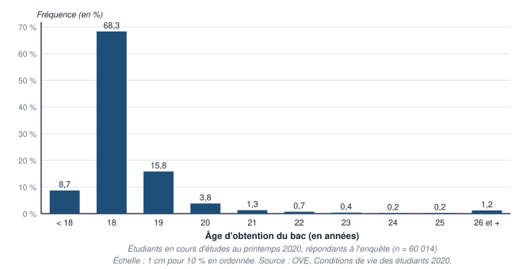

**Titre** : « Répartition des étudiants en cours d'études au printemps 2020 selon l'âge d'obtention du bac (en %) » · **axes** : l'âge en abscisse, la fréquence en ordonnée · **échelle** : par exemple 1 cm pour 10 % · **source** : OVE, Conditions de vie des étudiants 2020.
:::

### Exercice 4 — Interpréter une étude statistique

::: correction Les neuf réponses
1. **Population** : les **16 salariés** de l'entreprise couverts par l'étude · **unité statistique** : **un salarié** · **taille** : *N* = **16**.
2. Des **données brutes** : une ligne par salarié.
3. Une question par dimension, et le type :
   - **sécurité** : « Quel est votre type de contrat ? CDI, CDD, intérim » — qualitative, **ordinale** une fois rangée par sécurité croissante ;
   - **souplesse** : « Diriez-vous que l'organisation de votre temps de travail est pas du tout souple, plutôt pas souple, plutôt souple ou très souple ? » — qualitative **ordinale** ;
   - **soutien social** : « Comment jugez-vous la qualité du soutien de vos collègues et de votre hiérarchie, de 1 (très mauvaise) à 5 (très bonne) ? » — qualitative **ordinale codée en chiffres** (le piège : elle n'est pas quantitative) ;
   - **autonomie** : « Votre autonomie de décision est-elle forte ou faible ? » — qualitative **ordinale** à deux niveaux.

**4. et 5.** **Répartition de la qualité du lien social** — formule $f_k = n_k / 16$, puis $F_k = F_{k-1} + f_k$ :

| Lien social $x_k$ | Salariés | Effectif $n_k$ | Fréquence $f_k$ | Fréquence cumulée $F_k$ |
|---|---|---:|---:|---:|
| 1 | 7, 8 | 2 | 12,5 % | 12,5 % |
| 2 | 9, 10 | 2 | 12,5 % | 25 % |
| 3 | 3, 11 | 2 | 12,5 % | 37,5 % |
| 4 | 4, 5, 12, 15, 16 | 5 | 31,25 % | 68,75 % |
| 5 | 1, 2, 6, 13, 14 | 5 | 31,25 % | 100 % |
| **Ensemble** | | **16** | **100 %** | |

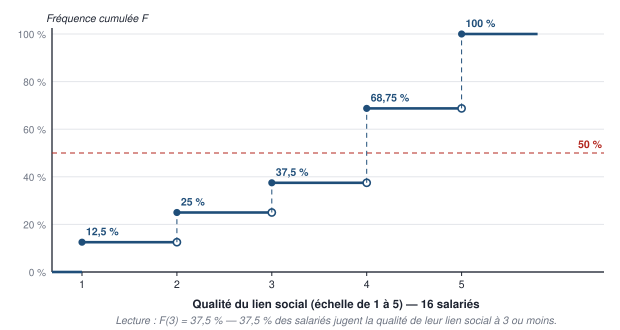

**6.** **Les quatre variables ordonnées**, du moins bon au meilleur : contrat — **intérim < CDD < CDI** (3 niveaux) ; souplesse — **pas du tout souple < plutôt pas souple < plutôt souple < très souple** (4) ; lien social — **1 < 2 < 3 < 4 < 5** (5) ; autonomie — **faible < forte** (2).

**7.** **Fréquences cumulées et position de la médiane** — la médiane est la modalité où la fréquence cumulée **atteint ou dépasse 50 %** :

| Variable | Fréquences cumulées | Médiane | Sous la médiane (en rouge) |
|---|---|---|---|
| Contrat | intérim 12,5 % · CDD 43,75 % · CDI 100 % | **CDI** | Intérim et CDD : salariés 2, 3, 4, 9, 10, 13, 16 |
| Souplesse | pas du tout 12,5 % · plutôt pas 43,75 % · plutôt souple 75 % · très souple 100 % | **Plutôt souple** | Salariés 1, 6, 7, 9, 12, 13, 14 |
| Lien social | 12,5 · 25 · 37,5 · 68,75 · 100 % | **4** | 1, 2 et 3 : salariés 3, 7, 8, 9, 10, 11 |
| Autonomie | faible 56,25 % · forte 100 % | **Faible** | **Aucune case** : la médiane est déjà le niveau le plus bas |

**Lecture pour l'objectif** : le salarié **9** cumule **trois** dimensions sous la médiane (CDD, plutôt pas souple, lien social 2) : c'est la priorité ; viennent ensuite les salariés **3, 7, 10 et 13** (deux dimensions chacun).

**8.** **Sous forme brute** : l'objectif est d'**identifier des salariés** ; la distribution conserve la répartition de chaque variable mais **perd le lien entre chaque salarié et ses valeurs** — on ne saurait plus qui aider.

**9.** **Sous forme résumée et agrégée**, sans identifier personne : pour chaque dimension, la **répartition en fréquences** ou la **part de salariés sous un seuil** (part des CDI, part des organisations « souples », part d'un lien social de 4 ou 5, part d'autonomie forte), éventuellement la **médiane** du lien social, suivies **d'une année sur l'autre** (chapitre 3) — plusieurs réponses sont possibles, pourvu qu'elles soient justifiées.
:::

## Corrigé du niveau 3 — Questions pièges et cas transversaux

::: correction Vrai ou faux, justifié
1. **Faux** : c'est une **étiquette** (qualitative nominale) ; additionner deux codes postaux n'a aucun sens.
2. **Faux** : c'est une variable **qualitative ordinale codée en chiffres** ; « un mot valant un chiffre ».
3. **Faux** : la nationalité est **nominale** — ses modalités ne se rangent pas, « ou moins » n'a pas de sens.
4. **Faux** : 90,4 % des familles ont 2 enfants **ou moins** ; celles qui ont exactement 2 enfants sont 20,1 %.
5. **Faux** : c'est la somme des **fréquences** qui vaut 1 ; la **dernière** fréquence cumulée vaut 100 %.
6. **Faux** : il montre des **structures** (des fréquences) ; les totaux se lisent sur le diagramme **empilé** en effectifs.
7. **Faux** : c'est **le match** — la valeur relevée (un temps de jeu) porte sur chaque match.
8. **Faux** : elle conserve **toute la répartition** ; elle ne perd que le lien entre chaque individu et sa valeur (et l'ordre du recueil).
9. **Faux** : elles figurent sur l'axe, avec une hauteur nulle — sinon l'axe des nombres est faussé (diagramme des frères et sœurs).
10. **Faux** : onze modalités **ordonnées**, des parts minuscules : les **colonnes** conviennent ; le camembert sert aux variables nominales à peu de modalités.
11. **Pas forcément** : une fréquence n'est pas un effectif. Avec 400 étudiants sur le site A et 250 sur le site B, 20 % de 400 = **80** et 30 % de 250 = **75** : **moins** d'étudiants en voiture sur le site B.
12. **Faux** : c'est l'**enquête quantitative** ; l'enquête qualitative observe **un petit nombre** d'individus en profondeur.
:::

## Corrigé du niveau 4 — Sujet au format de l'examen

::: correction Corrigé et barème — exercice 1
1. **Population** : les 40 étudiants du groupe de TD · **unité** : un étudiant · ***N* = 40** · **caractère** : le nombre de séances de TD manquées au premier semestre · **quantitatif discret** (un comptage) · **série brute** (une valeur par étudiant). *(2 points : 0,5 pour population et unité, 0,5 pour N, 1 pour le caractère et son type justifié.)*
2. Formules : $f_k = n_k / N$ ; $F_k = F_{k-1} + f_k$. *(1 point pour les formules, 3 pour le tableau juste.)*

| Séances manquées $x_k$ | Effectif $n_k$ | Fréquence $f_k$ | Fréquence cumulée $F_k$ |
|---|---:|---:|---:|
| 0 | 14 | 35 % | 35 % |
| 1 | 11 | 27,5 % | 62,5 % |
| 2 | 7 | 17,5 % | 80 % |
| 3 | 4 | 10 % | 90 % |
| 4 | 3 | 7,5 % | 97,5 % |
| 5 | 1 | 2,5 % | 100 % |
| **Ensemble** | **40** | **100 %** | |

Vérification : 14 + 11 + 7 + 4 + 3 + 1 = 40.

**3.** « **35 %** des étudiants du groupe n'ont manqué **aucune** séance de TD au premier semestre » ; « **62,5 %** en ont manqué **une ou moins** ». *(0,5 + 0,5.)*

**4.** Six colonnes (0 à 5) de hauteurs 14, 11, 7, 4, 3, 1 ; axes nommés (« Nombre de séances manquées », « Nombre d'étudiants ») ; échelle ; titre complet : « Répartition des 40 étudiants du groupe selon le nombre de séances de TD manquées au premier semestre ». *(1 point pour le tracé, 1 point pour les annotations.)*
:::

::: correction Corrigé et barème — exercices 2 et 3
**Exercice 2.**
1. **Population** : les 650 étudiants interrogés des deux sites · **sous-populations** : le **site A** (400) et le **site B** (250) · **caractère** : le mode de transport principal, **qualitatif nominal** · **4 modalités**. *(2 points.)*
2. $f_k = n_k / N_{\text{site}}$ — site A : bus **45 %**, tramway **15 %**, voiture **20 %**, vélo ou marche **20 %** · site B : bus **20 %**, tramway **40 %**, voiture **30 %**, vélo ou marche **10 %**. *(1 point par site.)*
3. Les deux sites n'ont pas la même taille : pour comparer des **habitudes** (des structures), il faut des **fréquences** — un diagramme **empilé à 100 %** (une colonne par site) ou des **colonnes groupées des fréquences**. Un diagramme des effectifs ferait paraître le site A plus « gros » partout. *(1 point pour le choix, 1 pour la justification.)*
4. **Faux raisonnement** : 30 % contre 20 %, ce sont des **fréquences** ; en **effectifs**, 75 étudiants viennent en voiture sur le site B contre **80** sur le site A. La part est plus forte sur le site B, mais le **nombre** est plus faible, car le site B est plus petit. *(1 point pour l'idée, 1 pour les chiffres.)*

**Exercice 3.**
1. Problématique → choix des données → méthode de recueil → campagne de mesures → traitement → prise de décision. *(1,5 point ; 0,25 par étape bien placée.)*
2. L'ancienneté en années : **quantitative** — continue par nature (une durée), discrète si on la relève en années entières (justifier) ; la CSP : **qualitative nominale** ; la mention au bac : **qualitative ordinale** (passable < assez bien < bien < très bien). *(0,5 point chacune.)*
:::
