# 1 — Carte du chapitre

::: synthese Le chapitre en quelques lignes
Une distribution contient souvent **trop d'informations** : trop de modalités, trop de valeurs. Le chapitre 2 apprend à la **résumer en quelques nombres**, pour une variable **quantitative**, en répondant à trois questions :

1. **Où se situe la série ?** Les **indicateurs de position** : le **mode** (la valeur la plus fréquente), la **moyenne** (la somme divisée par l'effectif), la **médiane** (la valeur du milieu) et les **quantiles** (quartiles, déciles, centiles).
2. **Comment les données sont-elles réparties autour ?** Les **indicateurs de dispersion** : l'**étendue**, les **écarts inter-quantiles**, puis ceux qui comparent chaque valeur à la moyenne — l'**écart absolu moyen**, la **variance**, l'**écart-type** —, que l'**inégalité de Bienaymé-Tchebychev** permet d'interpréter, et le **coefficient de variation**, sans unité.
3. **Comment la somme des données se répartit-elle ?** Les **indicateurs de concentration** : la **part de l'agrégat**, la **courbe de Lorenz** et l'**indice de Gini** — pour mesurer les inégalités.
:::

**Ce qui tombe à l'examen** — le format de l'épreuve n'est pas encore connu (à demander en TD). La planche de TD montre ce qui est attendu : sur des **données réelles** (Insee, OVE, BCE), **identifier** les éléments statistiques ; **calculer** une moyenne sur données brutes, sur une distribution ou par groupes ; une **médiane** et des **quantiles**, par interpolation linéaire ; une **classe modale** avec les densités, et **tracer un histogramme** ; une **variance** et un **écart-type** (y compris par agrégation, avec Koenig) ; un **intervalle de Bienaymé-Tchebychev** ; un **coefficient de variation** ; une **courbe de Lorenz** et un **indice de Gini** — et, à chaque fois, **une phrase d'interprétation**, exigée par la planche.

**Ce qu'il faut savoir par cœur**

| Quoi | Le contenu exact |
|---|---|
| **Densité** d'une classe | $d = f / a$ (fréquence divisée par l'amplitude) ; la **classe modale** a la plus forte densité |
| **Moyenne** | Brutes : $m = \frac{1}{N} \sum x_i$ · distribution : $m = \frac{1}{N} \sum n_i x_i = \sum f_i x_i$ · groupes : $m = \sum \frac{N_k}{N} m_k$ |
| **Médiane** | Brutes : le rang central · distribution : si $F(x_j) = 50$ %, med = $x_j$ ; sinon $med \approx x_a + \frac{(x_b - x_a)(0,5 - F(x_a))}{F(x_b) - F(x_a)}$ |
| **Quantile** d'ordre α | Même formule, avec α à la place de 0,5 ; $F(q) = α$ |
| **Dispersion par les quantiles** | Étendue = max − min · $D_9 - D_1$ · $Q_3 - Q_1$ · $D_9 / D_1$ |
| **Variance** | $\sigma^2 = \frac{1}{N} \sum (x_i - m)^2 = \frac{1}{N} \sum x_i^2 - m^2$ (Koenig) · distribution : $\sigma^2 = \sum f_i (x_i - m)^2 = \sum f_i x_i^2 - m^2$ |
| **Écart-type, EAM, CV** | $\sigma = \sqrt{\sigma^2}$ · $EAM = \frac{1}{N} \sum \lvert x_i - m \rvert$ · $CV = \sigma / m$ |
| **Propriétés** | $m_{aX+b} = a m_X + b$ · $V(a + X) = V(X)$ · $V(aX) = a^2 V(X)$ |
| **Bienaymé-Tchebychev** | $[m - k\sigma ; m + k\sigma]$ contient au moins $1 - 1/k^2$ des observations : **75 %** pour k = 2, **89 %** pour k = 3, **99 %** pour k = 10 |
| **Variance par groupes** | $\sigma^2 = \frac{1}{N} \sum N_k (\sigma_k^2 + m_k^2) - m^2$ · $\sigma^2 = V_{intra} + V_{inter}$ |
| **Gini** | $G = 2 \times$ aire de concentration $= 1 - \sum (b + B) \times h$ ; 0 = égalité, 1 = concentration maximale |

<!--saut-->

# 2 — Le cours reconstruit

## 2.1 — Le mode, la classe modale et l'histogramme

::: objectif À la fin de cette section, sans support, tu sais
- définir le mode et le trouver dans un tableau ;
- calculer l'amplitude et la densité d'une classe, et trouver la classe modale d'une distribution en classes ;
- tracer un histogramme et dire pourquoi l'aire de chaque rectangle est la fréquence de la classe.
:::

### Résumer la position d'une distribution

La distribution d'un caractère statistique peut être **résumée par une seule valeur** qui dit **où se situent les données** :

- le **mode** : la modalité la plus fréquente ;
- la **moyenne** : l'indicateur de tendance centrale le plus connu — la somme des observations divisée par leur nombre ;
- la **médiane** : un **centre de rang** — la valeur qui coupe la population en deux moitiés.

### Le mode

::: definition Mode
**En une phrase :** la valeur que l'on rencontre le plus souvent.

**Définition à connaître :** le **mode** est la **modalité qui présente la fréquence la plus élevée** — ou, ce qui revient au même, l'effectif le plus fort.
:::

::: exemple Les logements en Outre-mer (recensement de 2023) — cours et séance 2
| Type de logement | Guadeloupe | Martinique | Guyane | Réunion |
|---|---:|---:|---:|---:|
| Habitation de fortune | 1 098 | 790 | 3 698 | 1 867 |
| Case traditionnelle | 2 322 | 578 | 1 798 | 23 062 |
| Maison ou immeuble en bois | 8 363 | 6 086 | 11 841 | 12 913 |
| Maison ou immeuble en dur | 168 050 | 164 290 | 71 089 | 321 445 |
| **Ensemble** | **179 833** | **171 743** | **88 425** | **359 288** |

- **Population** : l'ensemble des logements des quatre départements d'Outre-mer en 2023 ; **taille** : *N* = 179 833 + 171 743 + 88 425 + 359 288 = **799 289** logements ; **unité statistique** : **un logement** — la case « 1 867 », ce sont 1 867 logements de la Réunion qui ont la modalité « habitation de fortune ».
- **Caractère** : le **type de logement**, qualitatif **nominal**, **4 modalités**. Une deuxième variable, la **zone géographique**, découpe la population en **4 sous-populations**.
- **A-t-on une distribution au sens classique ?** **Non** : ce sont **4 tableaux de distribution juxtaposés**, un par département — c'est pourquoi on les représente par un **diagramme en colonnes groupées**.
- **Le mode** du type de logement est « **maison ou immeuble en dur** », dans chaque département : 93,4 % des logements en Guadeloupe, 95,7 % en Martinique, 80,4 % en Guyane, 89,5 % à la Réunion.
- **À noter** : en Martinique, en Guyane et à la Réunion, la somme des lignes diffère du total d'une unité (171 744, 88 426, 359 287) : les chiffres du recensement sont des **estimations arrondies**. Ce n'est pas une erreur de calcul.
:::

### Classes, amplitude et densité

Une variable **continue** — un âge, un revenu — a trop de valeurs possibles pour qu'on les liste : on la **discrétise** en **classes**, c'est-à-dire en intervalles (« de 25 ans à moins de 30 ans » = [25 ; 30[).

::: definition Amplitude, densité, classe modale
**En une phrase :** l'amplitude est la largeur de la classe ; la densité, sa fréquence par unité de largeur ; la classe modale, celle où les individus sont le plus « serrés ».

**Définitions à connaître :**
- l'**amplitude** d'une classe est la **valeur maximale moins la valeur minimale** de la variable pour cette classe : $a = b_{sup} - b_{inf}$ ;
- la **densité** d'une classe est le **rapport entre la fréquence de la classe et son amplitude** : $d = f / a$ ;
- la **classe modale** est la classe qui a la **densité d'observations la plus élevée** — **pas** la plus forte fréquence, **ni** le plus fort effectif.
:::

**Pourquoi la densité ?** Parce que les classes n'ont pas toujours la même largeur. Une classe de 10 ans contient naturellement plus d'individus qu'une classe de 2 ans : comparer les effectifs reviendrait à comparer des intervalles de tailles différentes. La densité ramène chaque classe à **une unité de largeur** — ici, **une année d'âge** —, ce qui rend les classes comparables.

::: exemple Les personnes incarcérées selon l'âge, en 2020 (cours et séance 2)
| Âge | Effectif | Fréquence *f* | Amplitude *a* | Densité *d* = *f* / *a* |
|---|---:|---:|---:|---:|
| De 16 à moins de 18 ans | 819 | 0,010 | 2 | 0,0051 |
| De 18 à moins de 21 ans | 5 361 | 0,067 | 3 | 0,0224 |
| De 21 à moins de 25 ans | 11 444 | 0,143 | 4 | 0,0359 |
| **De 25 à moins de 30 ans** | **14 950** | **0,187** | **5** | **0,0375** |
| De 30 à moins de 40 ans | 23 979 | 0,301 | 10 | 0,0301 |
| De 40 à moins de 50 ans | 13 413 | 0,168 | 10 | 0,0168 |
| De 50 à moins de 60 ans | 6 501 | 0,081 | 10 | 0,0081 |
| 60 ans ou plus | 3 321 | 0,042 | 20 | 0,0021 |
| **Ensemble** | **79 788** | **1** | | |

- **Fréquence** : $f = 14\,950 / 79\,788 = 0,187$ — « **18,7 % des personnes incarcérées en 2020 ont de 25 à moins de 30 ans** ».
- **Amplitude** : 30 − 25 = 5 ans ; **densité** : $d = 0,187 / 5 = 0,0375$, soit **3,75 % par année d'âge**.
- **La classe modale est « de 25 à moins de 30 ans »** : sa densité, 0,0375, est la plus forte — alors que l'**effectif** le plus fort est celui des 30-40 ans (23 979). Mais cette classe est deux fois plus large.
- **Deux précisions que la diapositive ne donne pas** : la fréquence de la première classe y est écrite « 819/79 788 » — elle vaut **0,0103** ; et la dernière classe, « **60 ans ou plus** », est **ouverte** : l'amplitude 20 (de 60 à 80 ans) est une **convention** choisie pour pouvoir calculer sa densité.
:::

::: piege Une classe modale se lit sur la densité, jamais sur l'effectif
Le diagramme en colonnes des **effectifs** par classe d'âge (diapositive 6) fait croire que les 30-40 ans dominent : il **ne représente pas fidèlement** la répartition, car **les amplitudes de classe sont différentes** (séance 2). Seules les **densités** sont comparables. Autre précision : la diapositive 9 conclut que la classe modale est « 25-30 ans » ; c'est vrai **en 2020** (0,0375 contre 0,0359 pour les 21-25 ans), mais en 2005 et 2010 la densité la plus forte est celle des **21-25 ans**. Une classe modale se donne **pour une année précise**.
:::

### L'histogramme

::: definition Histogramme
**En une phrase :** le graphique d'une variable en classes, où chaque classe est un rectangle dont la surface est sa fréquence.

**Définition à connaître :** un **histogramme** se construit en mettant **en abscisse les limites des classes** et **en ordonnée la densité** des classes. Chaque classe est un rectangle de **base = amplitude** et de **hauteur = densité**. La **classe modale** correspond au **rectangle le plus haut**.
:::

::: formule L'aire d'un rectangle est la fréquence de la classe
$$ \text{Aire} = \text{Base} \times \text{Hauteur} = a \times d = a \times \frac{f}{a} = f $$

- *a* : l'amplitude de la classe (la base du rectangle) ;
- *d* : la densité de la classe (sa hauteur) ;
- *f* : la fréquence de la classe.

**Conséquence** : la **somme des aires vaut 1** (100 %), puisque la somme des fréquences vaut 1 : $\sum_{k=1}^{8} f_k = 1$ (séance 2). **Exemple** : pour la 4ᵉ classe d'âge, aire = 5 × 0,0375 = **0,187** = sa fréquence ; pour la 6ᵉ (40-50 ans), aire = 10 × 1,68 % = **0,168**.
:::

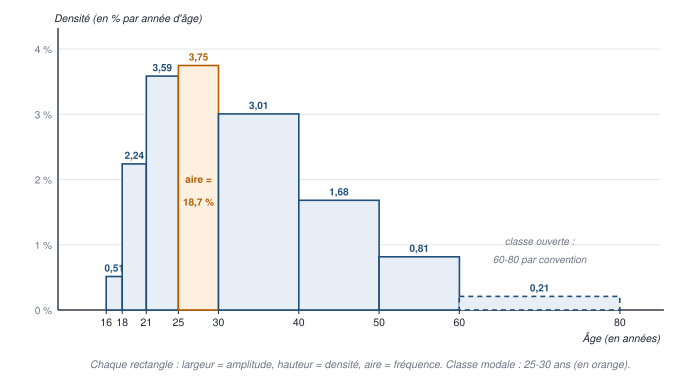

::: methode Tracer un histogramme, pas à pas
1. **Compléter le tableau** : fréquences $f = n / N$, amplitudes $a = b_{sup} - b_{inf}$, densités $d = f / a$ (en % par unité de la variable).
2. **Fixer une classe ouverte** si besoin (« 60 ans ou plus » → 60-80 par convention), et **le dire**.
3. **Choisir l'échelle** : en abscisse, les **bornes** des classes, à l'échelle (1 carreau pour 2 ans, par exemple) ; en ordonnée, la **densité** (1 carreau pour 1 % par an). « Ordonnée en cm » = densité × échelle.
4. **Tracer les rectangles**, **jointifs**, de largeur l'amplitude et de hauteur la densité.
5. **Titrer** et **nommer les axes**, avec les unités ; indiquer que **les fréquences se lisent dans l'aire** des rectangles.
6. **Repérer la classe modale** : le rectangle le plus haut.
:::

## 2.2 — La moyenne : trois formules et ses propriétés

::: objectif À la fin de cette section, sans support, tu sais
- choisir et appliquer la bonne formule de la moyenne selon que les données sont brutes, en distribution ou par groupes ;
- démontrer que la moyenne des groupes pondérée par leurs effectifs donne la moyenne d'ensemble ;
- énoncer et démontrer les propriétés de la moyenne, et dire quand préférer la médiane.
:::

### Sur données brutes

::: formule Moyenne arithmétique sur données brutes
$$ m = \frac{1}{N} \sum_{i=1}^{N} x_i = \frac{1}{N} (x_1 + x_2 + \dots + x_N) $$

- *N* : le nombre d'observations ;
- $x_i$ : la valeur de la $i$-ième observation — **l'indice *i* renvoie au numéro d'observation**, c'est-à-dire à la $i$-ième unité statistique de la base de données.

C'est l'indicateur de tendance centrale le plus connu : on **divise la somme des observations par leur nombre**.
:::

::: exemple Deux calculs du tableau (séances 2 et 4)
- **Les notes de dix élèves** (A à J) : 20, 12, 4, 4, 4, 12, 20, 20, 20, 12. $m = \frac{1}{10}(20 + 12 + 4 + 4 + 4 + 12 + 20 + 20 + 20 + 12) = \frac{128}{10} = 12,8$.
- **Le temps de production d'un bien sur six chaînes** (en secondes) : 10, 12, 8, 9, 15, 6. $m = \frac{60}{6} = 10$ s.
:::

### Sur une distribution

Si les données ne sont disponibles **que sous forme de distribution** — les modalités et leurs effectifs —, la formule change : chaque modalité compte **autant de fois qu'elle a d'individus**.

::: formule Moyenne d'une distribution
$$ m = \frac{1}{N} \sum_{i=1}^{p} n_i x_i \qquad \text{ou, de façon équivalente,} \qquad m = \sum_{i=1}^{p} \frac{n_i}{N} x_i = \sum_{i=1}^{p} f_i x_i $$

- *p* : le nombre de **modalités** — ici, **l'indice *i* renvoie au numéro de modalité** ;
- $n_i$ : l'effectif de la modalité $x_i$ ; $f_i = n_i / N$ : sa fréquence.

La première forme part des **effectifs** (formule 4 du cours), la seconde des **fréquences** (formule 5) : on a simplement fait entrer le $\frac{1}{N}$ dans la somme.
:::

::: exemple Les dix notes, sous forme de distribution (séance 2)
| Note $x_i$ | Effectif $n_i$ | Fréquence $f_i$ |
|---|---:|---:|
| 4 | 3 | 0,3 |
| 12 | 3 | 0,3 |
| 20 | 4 | 0,4 |
| **Ensemble** | **10** | **1** |

Avec les effectifs : $m = \frac{1}{10}(3 \times 4 + 3 \times 12 + 4 \times 20) = \frac{12 + 36 + 80}{10} = \frac{128}{10} = 12,8$. Avec les fréquences : $m = 0,3 \times 4 + 0,3 \times 12 + 0,4 \times 20 = 1,2 + 3,6 + 8 = 12,8$. **Même résultat** que sur les données brutes : c'est la vérification que demande la planche de TD.
:::

**Distribution en classes.** On ne connaît pas les valeurs à l'intérieur d'une classe : on remplace chaque classe par son **centre**, $c = (b_{inf} + b_{sup}) / 2$, et l'on calcule $m \approx \sum f_i c_i$ — une **estimation**, qui suppose les individus répartis uniformément dans chaque classe (c'est ainsi que le cours estime le salaire moyen de chaque classe, en section 2.7). Exemple : l'âge moyen des personnes incarcérées en 2020, avec les centres 17 ; 19,5 ; 23 ; 27,5 ; 35 ; 45 ; 55 et 70 (dernière classe prise de 60 à 80 ans), vaut environ **35,4 ans**.

### Par agrégation de groupes

La moyenne est souvent donnée **par groupe** ou par **sous-population** — par âge, par année, par région.

::: formule Moyenne par agrégation
$$ m = \sum_{k=1}^{K} \frac{N_k}{N} m_k = \frac{1}{N} \sum_{k=1}^{K} N_k m_k \qquad \text{avec} \qquad N = \sum_{k=1}^{K} N_k $$

- *K* : le nombre de sous-populations **disjointes** ;
- $N_k$ : l'effectif du groupe *k* ; $m_k$ : la moyenne de *X* dans ce groupe.

C'est une **moyenne pondérée** des moyennes de groupe, chacune pesant **la part de son groupe dans la population**, $N_k / N$. Cette part est parfois donnée sous forme de **fréquence** $f_k$.
:::

::: demo Pourquoi ça marche (séance 4)
La somme de toutes les observations se découpe groupe par groupe — c'est l'« astuce » du tableau :
$$ \sum_{i=1}^{N} x_i = \sum_{k=1}^{K} \left( \sum_{i \in k} x_i \right) $$
Or, dans chaque groupe, $m_k = \frac{1}{N_k} \sum_{i \in k} x_i$, donc $\sum_{i \in k} x_i = N_k \times m_k$ : **la somme d'un groupe est son effectif fois sa moyenne**. D'où :
$$ m = \frac{1}{N} \sum_{i=1}^{N} x_i = \frac{1}{N} \sum_{k=1}^{K} N_k m_k $$
:::

::: exemple Deux calculs du tableau (séance 2)
- **Deux divisions** : la division A compte 330 élèves de moyenne 12, la division B 270 élèves de moyenne 10. Moyenne des 600 élèves : $m = \frac{330}{600} \times 12 + \frac{270}{600} \times 10 = 0,55 \times 12 + 0,45 \times 10 = 6,6 + 4,5 = 11,1$. **Pas 11** : la division A, plus nombreuse, pèse plus.
- **Les salaires des fonctionnaires** (champ : agents fonctionnaires en France hors Mayotte ; Insee, Siasp) :

| | Fréquences 2022 (%) | Fréquences 2023 (%) | Salaire mensuel net moyen 2022 (€) | Salaire mensuel net moyen 2023 (€) |
|---|---:|---:|---:|---:|
| Catégorie A | 68,4 | 68,7 | 3 193 | 3 373 |
| Catégorie B | 18,7 | 18,9 | 2 632 | 2 720 |
| Catégorie C | 12,9 | 12,4 | 2 161 | 2 283 |
| **Titulaires A + B + C** | **100,0** | **100,0** | **2 955** | **3 116** |

En 2022 : $m = 0,684 \times 3\,193 + 0,187 \times 2\,632 + 0,129 \times 2\,161 = 2\,184,012 + 492,184 + 278,769 = 2\,954,97$, soit **2 955 €** : on retrouve le total. En 2023, le même calcul donne $0,687 \times 3\,373 + 0,189 \times 2\,720 + 0,124 \times 2\,283 = 3\,114,42$ € — **1,58 € de moins** que les 3 116 € du tableau : l'écart vient des **fréquences arrondies** au dixième ; le tableau donne la valeur exacte de l'Insee. **Attention** : la question de la diapositive parle de « France métropolitaine », mais le champ est la **France hors Mayotte**.
:::

::: piege La fréquence d'un groupe n'est pas la fréquence de X
Dans la formule par agrégation, $f_k = N_k / N$ est la fréquence de la variable **qui découpe la population en groupes** (la catégorie A, B, C), **pas** la fréquence d'une modalité du caractère *X* (le salaire). Ne mélange pas les deux dans un même calcul.
:::

**La somme d'une variable est son effectif fois sa moyenne** : $\sum x_i = N \times m$. C'est ainsi qu'on calcule une **masse salariale** : avec 1,8 million d'agents et un salaire moyen de 3 116 € par mois, la masse salariale est d'environ $1,8 \times 10^6 \times 3\,116 = 5,6$ milliards d'euros **par mois**, soit environ 67 milliards par an. C'est une **approximation** : le salaire moyen est celui des **fonctionnaires**, alors que les 1,8 million d'agents incluent des contractuels.

### Les propriétés de la moyenne

::: formule Propriété 1 — la somme des écarts à la moyenne est nulle
$$ \sum_{i=1}^{N} (x_i - m) = \sum_{i=1}^{N} x_i - N m = \sum_{i=1}^{N} x_i - N \times \frac{\sum x_i}{N} = 0 $$

*N* fois la moyenne, c'est la somme des observations. Les **écarts positifs et négatifs se compensent exactement** : la moyenne est le **point d'équilibre** de la distribution. C'est pourquoi on ne peut pas mesurer la dispersion par la moyenne des écarts (elle vaut toujours 0) : il faudra des valeurs absolues ou des carrés (section 2.5). Si la distribution est **symétrique**, l'axe de symétrie passe par la moyenne, et **la moyenne égale la médiane**.
:::

::: formule Propriété 2 — la moyenne est linéaire
$$ \text{si } Y = aX + b \text{ alors } m_Y = a\, m_X + b $$

- **multiplier** toutes les valeurs par *a* multiplie la moyenne par *a* (convertir des euros en dollars) ;
- **ajouter** *b* à toutes les valeurs augmente la moyenne de *b* (6 points de bonus pour tous : la moyenne monte de 6) ;
- à plus forte raison, **la moyenne d'une somme de deux variables est la somme de leurs moyennes**.

**Démonstration** : $m_Y = \frac{1}{N} \sum (a x_i + b) = a \times \frac{1}{N} \sum x_i + \frac{1}{N} \times N b = a\, m_X + b$.
:::

**Propriété 3 — la moyenne est sensible aux valeurs extrêmes.** Deux écarts de 5 à la moyenne comptent autant qu'un écart de 10 : pour un élève qui a 10 de moyenne, un 0/20 est aussi pénalisant que deux 5/20. Pour un caractère **non borné et étalé à droite**, comme le **revenu**, un seul très gros écart suffit à déplacer la moyenne. En cas de **dissymétrie** et de valeurs extrêmes, **la médiane est beaucoup plus stable**.

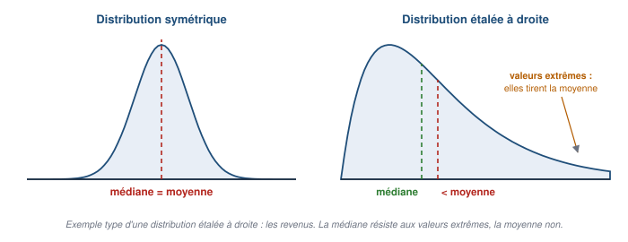

::: examen Ce qu'il faut savoir dire sur la forme d'une distribution
- **Symétrique** : médiane = moyenne.
- **Étalée à droite** (une longue queue vers les grandes valeurs, comme les revenus) : les valeurs extrêmes tirent la moyenne vers le haut, donc **médiane < moyenne**.
- À l'inverse, étalée à gauche : médiane > moyenne.

Comparer la moyenne et la médiane d'une distribution est une question d'interprétation fréquente : « la moyenne dépasse la médiane : la distribution est étalée à droite, quelques valeurs élevées tirent la moyenne vers le haut ».
:::

## 2.3 — La médiane et les quantiles

::: objectif À la fin de cette section, sans support, tu sais
- définir la médiane et la calculer sur données brutes (N pair ou impair) et sur une distribution, par interpolation linéaire ;
- généraliser aux quartiles, déciles et centiles, et écrire leur phrase d'interprétation ;
- expliquer pourquoi la médiane résiste aux valeurs extrêmes et ne s'agrège pas.
:::

### La médiane

::: definition Médiane
**En une phrase :** la valeur du milieu, qui laisse autant d'individus au-dessous qu'au-dessus.

**Définition à connaître :** la **médiane** est la valeur (modalité) de la variable statistique *X* qui **coupe la distribution de *X* en deux parts égales**, de telle sorte que **la moitié de la population présente un caractère inférieur** à la médiane, tandis que **l'autre moitié présente un caractère supérieur**.
:::

- Elle s'applique à un caractère **quantitatif** ou **qualitatif ordinal** (il faut pouvoir ranger).
- Contrairement à la moyenne, elle **n'a pas la propriété de linéarité** : on ne peut pas l'agréger.
- En économie-gestion, elle est **très utilisée pour les distributions de revenu**, justement parce qu'elle résiste aux valeurs extrêmes.

### La médiane sur données brutes

Il n'y a **pas de formule** : on applique un **algorithme**.

::: methode Calculer une médiane sur données brutes
1. **Trier** la série brute par ordre croissant.
2. **Repérer le rang central** : si *N* est **impair**, c'est le rang $(N + 1)/2$ ; la médiane est la valeur de l'individu de ce rang.
3. Si *N* est **pair**, il y a deux rangs centraux, $N/2$ et $N/2 + 1$ : la médiane est **à mi-chemin** entre leurs valeurs, $med = (x_{N/2} + x_{N/2+1}) / 2$.
:::

::: exemple Les densités de population de l'Union européenne (cours et séance 2)
| Union européenne à 15 (2003) | Densité (hab./km²) | Rang | Dix nouveaux pays (2004) | Densité (hab./km²) | Rang |
|---|---:|---:|---|---:|---:|
| Finlande | 15 | 1 | Estonie | 31 | 1 |
| Suède | 20 | 2 | Lettonie | 36 | 2 |
| Irlande | 57 | 3 | Lituanie | 54 | 3 |
| Espagne | 82 | 4 | Chypre | 97 | 4 |
| Grèce | 83 | 5 | **Slovénie** | **99** | **5** |
| Autriche | 98 | 6 | **Hongrie** | **109** | **6** |
| France métropolitaine | 108 | 7 | Slovaquie | 110 | 7 |
| **Portugal** | **113** | **8** | Pologne | 119 | 8 |
| Danemark | 125 | 9 | République tchèque | 129 | 9 |
| Italie | 190 | 10 | Malte | 1 246 | 10 |
| Luxembourg | 193 | 11 | | | |
| Allemagne | 231 | 12 | | | |
| Royaume-Uni | 242 | 13 | | | |
| Belgique | 341 | 14 | | | |
| Pays-Bas | 397 | 15 | | | |

*Source : Tableaux de l'économie française, Insee, 2004-2005, d'après le Population Reference Bureau.*

- **Éléments** : population = les pays de l'Union (15, puis les 10 entrants) ; unité statistique = **un pays** ; caractère = la **densité de population**, en habitants par km², quantitatif continu ; ce sont des **données brutes** (une ligne par pays), déjà triées.
- **Union à 15** : *N* = 15, impair ; rang central $(15 + 1)/2 = 8$ : **médiane = 113 hab./km²** (Portugal). **Phrase** : « la moitié des pays de l'Union à 15 ont une densité inférieure ou égale à 113 habitants par km², l'autre moitié une densité supérieure ou égale ».
- **Dix nouveaux pays** : *N* = 10, pair ; rangs 5 et 6 : $med = (99 + 109)/2 =$ **104 hab./km²**.
- **Union à 25** : en classant les 25 pays, le rang central (13ᵉ) est la Hongrie : **médiane = 109 hab./km²**.
- **Moyennes** : 2 295 / 15 = **153** ; 2 030 / 10 = **203** ; 4 325 / 25 = **173** hab./km².
- **Si la densité de Malte est divisée par 2** (1 246 → 623) : Malte reste le pays le plus dense, **les médianes ne bougent pas** (104 et 109) ; la moyenne des dix nouveaux pays tombe à (2 030 − 623) / 10 = **140,7**, celle de l'Union à 25 à 3 702 / 25 = **148,1**. **La médiane résiste aux valeurs extrêmes, la moyenne non.**
:::

::: piege La moyenne des densités n'est pas la densité de l'Union
Faire la moyenne simple des densités des pays donne le même poids à Malte (316 km²) qu'à la France. La **densité de l'Union** se calcule en divisant **sa population totale par sa superficie totale** — c'est une moyenne **pondérée par les superficies**. La moyenne de 173 hab./km² répond à une autre question : « quelle est la densité d'un pays membre, en moyenne ? ». Le signaler est un point bonus.
:::

::: examen La médiane ne s'agrège pas (diapositive 24)
Les revenus salariaux annuels médians du secteur privé en 2023 (France métropolitaine) valent 45 552 € pour les cadres, 29 640 € pour les professions intermédiaires, 23 148 € pour les ouvriers et 22 572 € pour les employés. **Peut-on calculer la médiane de l'ensemble avec la part de chaque catégorie ?** **Non** : la médiane n'est pas linéaire — contrairement à la moyenne, une moyenne pondérée des médianes n'est pas la médiane de l'ensemble. Il faudrait la **distribution complète** des salaires.
:::

### La médiane d'une distribution : fréquences cumulées et interpolation

Quand les données sont présentées sous forme de **distribution avec ses fréquences cumulées**, on les utilise pour trouver la médiane — la valeur *x* telle que $F(x) = 50$ %.

::: formule Médiane d'une distribution
**Cas 1** — s'il existe une modalité $x_j$ telle que $F(x_j) = 50$ %, alors **la médiane vaut $x_j$**.

**Cas 2** — sinon, on procède par **interpolation linéaire** entre les deux modalités qui encadrent 50 % : si $F(x_a) < 50$ % et $F(x_b) > 50$ %,

$$ med \approx x_a + \frac{(x_b - x_a)(0,5 - F(x_a))}{F(x_b) - F(x_a)} $$

- $x_a$, $x_b$ : les modalités (ou, pour des classes, les **bornes supérieures** des classes) juste avant et juste après le passage de 50 % ;
- $F(x_a)$, $F(x_b)$ : leurs fréquences cumulées ;
- la fraction $\frac{0,5 - F(x_a)}{F(x_b) - F(x_a)}$ dit **quelle proportion du chemin** de $F(x_a)$ à $F(x_b)$ il faut parcourir pour atteindre 50 % ; on parcourt la **même proportion** du chemin de $x_a$ à $x_b$.
:::

::: exemple Les familles selon le nombre d'enfants, 2008 et 2023 (cours et séance 3)
| Modalités | 2008 : effectifs (milliers) | 2008 : $F$ | 2023 : effectifs (milliers) | 2023 : $F$ |
|---|---:|---:|---:|---:|
| 0 enfant | 8 225 | 0,480 | 9 340 | 0,500 |
| 1 enfant | 3 821 | 0,703 | 4 085 | 0,719 |
| 2 enfants | 3 449 | 0,904 | 3 594 | 0,911 |
| 3 enfants | 1 241 | 0,976 | 1 219 | 0,976 |
| 4 enfants et plus | 396 | 1 | 442 | 1 |
| **Ensemble** | **17 132** | | **18 680** | |

- **Éléments** : deux populations (les familles en France en 2008 et en 2023), unité = une famille, caractère = nombre d'enfants, quantitatif discret, 5 modalités (la dernière est ouverte : « 4 et plus »). En 2023 : $f_1 = 9\,340 / 18\,680 = 0,5$ ; $f_2 = 21,87$ % ; $f_3 = 19,24$ % ; $f_4 = 6,53$ % ; $f_5 = 2,37$ % ; d'où $F_3 = 91,11$ % — « 91,11 % des familles en France en 2023 ont 2 enfants ou moins ».
- **2023 — cas 1** : $F(0) = 50$ % exactement, donc **med = 0 enfant**.
- **2008 — cas 2** : $F(0) = 0,48 < 0,5 < F(1) = 0,703$ : la médiane est **entre 0 et 1 enfant**. $x_a = 0$, $x_b = 1$ :
$$ med \approx 0 + \frac{(1 - 0)(0,5 - 0,48)}{0,703 - 0,48} = \frac{0,02}{0,223} \approx 0,089 \text{ enfant} $$
:::

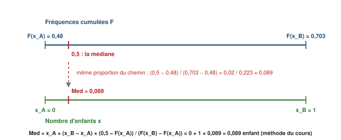

::: piege Une convention à connaître, et à vérifier en TD
Le cours applique l'interpolation même à une **variable discrète** (0,089 enfant), comme au tableau de la séance 3. Beaucoup de manuels, pour une variable discrète, retiendraient plutôt la **première modalité dont la fréquence cumulée atteint 50 %** — ici 1 enfant. **À l'examen, suis la méthode du cours** et, si la variable est discrète, ajoute une demi-phrase : « valeur interpolée ; la famille médiane a 0 ou 1 enfant ». De même, pour le cas n° 2 du cours (50 notes), la règle $F = 50$ % donne une médiane de **11**, alors que la règle du rang central sur les 50 notes brutes donnerait (11 + 13) / 2 = **12** : applique la règle qui correspond à la présentation des données. **Demande à ton chargé de TD laquelle il attend.**
:::

**Pour une distribution en classes**, $x_a$ et $x_b$ sont des **bornes de classes** : la fréquence cumulée d'une classe s'atteint à sa **borne supérieure**. Exemple : l'âge médian des personnes incarcérées en 2020. $F(30) = 40,8$ % et $F(40) = 70,9$ %, donc $med \approx 30 + 10 \times \frac{0,5 - 0,408}{0,709 - 0,408} \approx$ **33,1 ans** : « la moitié des personnes incarcérées en 2020 ont moins de 33 ans environ ».

### Les quantiles

::: definition Quantiles
**En une phrase :** les valeurs qui découpent la population en parts égales — la médiane en deux, les quartiles en quatre, les déciles en dix, les centiles en cent.

**Définition à connaître :** les quantiles **généralisent la médiane** :
- les **quartiles** $Q_1$, $Q_2$, $Q_3$ coupent la distribution en **4 parts égales** : 25 % au-dessous de $Q_1$, 25 % entre $Q_1$ et $Q_2$, 25 % entre $Q_2$ et $Q_3$, 25 % au-dessus de $Q_3$ ; $Q_2$ est la médiane ;
- les **déciles** $D_1$ à $D_9$ la coupent en **10 parts égales** : 10 % au-dessous de $D_1$, …, 10 % au-dessus de $D_9$ ; $D_5$ est la médiane ;
- les **centiles** (ou **percentiles**) $C_1$ à $C_{99}$ la coupent en **100 parts égales**.

Le **quantile d'ordre α** est la valeur *q* de *X* telle qu'**une proportion α de la population a une valeur inférieure à *q*** : $F(q) = α$, donc $q = F^{-1}(α)$ — c'est l'**inverse de la fonction de répartition** empirique. Le quantile d'ordre 10 % est $D_1$, celui d'ordre 50 % la médiane, celui d'ordre 75 % $Q_3$, celui d'ordre 4 % le centile $C_4$.
:::

::: formule Quantile d'ordre α par interpolation linéaire
Si une modalité $x_j$ vérifie $F(x_j) = α$, le quantile vaut $x_j$ ; sinon, si $F(x_a) < α < F(x_b)$ :

$$ Q_α \approx x_a + \frac{(x_b - x_a)(α - F(x_a))}{F(x_b) - F(x_a)} $$

C'est la formule de la médiane, avec α à la place de 0,5. **Attention à l'écriture** : au tableau de la séance 3, le facteur $(x_b - x_a)$ est écrit au dénominateur ; il **multiplie** — le résultat était juste parce que $x_b - x_a = 1$.
:::

::: exemple Le cas n° 2 du cours : 50 notes, cinq par note (séance 3)
Notes 7, 8, 9, 10, 11, 13, 14, 15, 16, 17, chacune obtenue par 5 élèves ($f = 0,1$) ; fréquences cumulées : 0,1 ; 0,2 ; 0,3 ; 0,4 ; 0,5 ; 0,6 ; 0,7 ; 0,8 ; 0,9 ; 1.

- **Médiane** : $F(11) = 0,5$ exactement → **med = 11**.
- **Premier décile** : $F(7) = 0,1$ → **$D_1$ = 7** ; **neuvième décile** : $F(16) = 0,9$ → **$D_9$ = 16** — « 90 % des élèves ont 16 ou moins ».
- **Premier quartile** : $F(8) = 0,2 < 0,25 < F(9) = 0,3$ → $Q_1 \approx 8 + \frac{(9 - 8)(0,25 - 0,2)}{0,3 - 0,2} = 8 + 0,5 =$ **8,5**.
- **Troisième quartile** : $F(14) = 0,7 < 0,75 < F(15) = 0,8$ → $Q_3 \approx 14 + \frac{(15 - 14)(0,05)}{0,1} =$ **14,5**.
:::

::: exemple Le cas n° 3 : 20 élèves à 6, 10 à 12, 20 à 18 (séance 3)
Fréquences cumulées : $F(6) = 0,4$ ; $F(12) = 0,6$ ; $F(18) = 1$.

- **Médiane** : $F(6) = 0,4 < 0,5 < F(12) = 0,6$ → $med \approx 6 + \frac{(12 - 6)(0,5 - 0,4)}{0,6 - 0,4} = 6 + 3 =$ **9**.
- **Troisième quartile** : $F(12) = 0,6 < 0,75 < F(18) = 1$ → $Q_3 \approx 12 + (18 - 12) \times \frac{0,15}{0,4} = 12 + 0,375 \times 6 =$ **14,25**.
- **$Q_1$ et $D_1$** : l'interpolation exige une modalité $x_a$ avec $F(x_a) < 25$ % : il n'y en a pas (la première a déjà $F = 40$ %). Il faudrait choisir arbitrairement un « support » — le cours ne les calcule pas (ils sont barrés au tableau).
:::

::: exemple Le niveau de vie en France en 2024 (cours)
| Indicateur | $D_1$ | $D_2$ | $D_3$ | $D_4$ | $D_5$ | $D_6$ | $D_7$ | $D_8$ | $D_9$ | $C_{95}$ |
|---|---|---|---|---|---|---|---|---|---|---|
| **Niveau de vie (€ par UC)** | 13 970 | 17 700 | 20 980 | 23 880 | 26 740 | 29 880 | 33 680 | 38 780 | 48 580 | 61 220 |

*Source : Insee, enquête Revenus fiscaux et sociaux.*

- Le **niveau de vie** est le revenu disponible du ménage divisé par son nombre d'**unités de consommation** (UC) : 1 UC pour le premier adulte, 0,5 pour chaque autre personne de 14 ans ou plus, 0,3 pour chaque enfant de moins de 14 ans. Il permet de comparer des ménages de tailles différentes. Il s'exprime ici en **euros par an**.
- **Lectures** : « **10 %** des personnes ont un niveau de vie inférieur à **13 970 €** par an et par UC » ($D_1$) ; « la **moitié** vit avec moins de **26 740 €** » ($D_5$, la médiane) ; « **10 %** vivent avec plus de **48 580 €** » ($D_9$) ; « **5 %** avec plus de **61 220 €** » ($C_{95}$).
- **Asymétrie** : de $D_1$ à la médiane, il y a 12 770 € ; de la médiane à $D_9$, **21 840 €** — les écarts grandissent vers le haut : la distribution est **étalée à droite**. L'observation des écarts entre quantiles permet de déduire l'asymétrie (cours).
- **Erreur du support** : la diapositive 35 titre son graphique « Revenus déclarés par déciles et centiles des individus retraités, année 2008 » ; il reprend en réalité **exactement les valeurs de 2024 ci-dessus**, avec l'étiquette « Niveau de vie par UC (en €) ».
:::

## 2.4 — Mesurer la dispersion avec les quantiles

::: objectif À la fin de cette section, sans support, tu sais
- expliquer pourquoi la moyenne ne suffit pas, avec les quatre classes du cours ;
- calculer et interpréter l'étendue, les écarts et rapports inter-quantiles ;
- lire et construire une boîte à moustaches.
:::

### Même moyenne, dispersions différentes

Une classe de 50 élèves a **12/20 de moyenne**. Quatre cas possibles (cours) :

| Cas | Les notes |
|---|---|
| **Cas n° 1** | Les 50 élèves ont 12/20 |
| **Cas n° 2** | 5 élèves ont 7, 5 ont 8, 5 ont 9, 5 ont 10, 5 ont 11, 5 ont 13, 5 ont 14, 5 ont 15, 5 ont 16, 5 ont 17 |
| **Cas n° 3** | 20 élèves ont 6, 20 ont 18, 10 ont 12 |
| **Cas n° 4** | 5 élèves ont 4, 10 ont 8, 10 ont 10, 10 ont 14, 10 ont 16, 5 ont 20 |

Dans chaque cas, la moyenne vaut bien 12 : par exemple, cas n° 3 : $(20 \times 6 + 10 \times 12 + 20 \times 18)/50 = 600/50 = 12$. **Dans quel cas les notes sont-elles le plus dispersées ?** Il y a plusieurs façons de mesurer la dispersion — selon le point de référence, le poids donné aux grands écarts, aux effectifs : les indicateurs ne répondent pas tous la même chose.

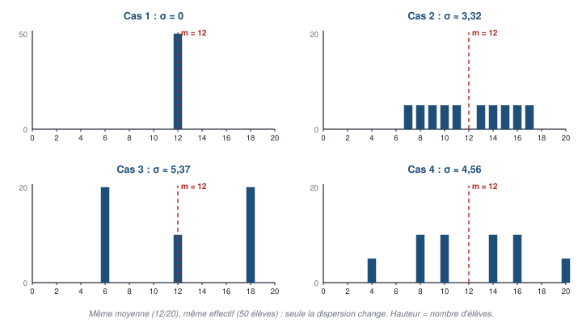

### L'étendue

::: definition Étendue
**En une phrase :** l'écart entre la plus grande et la plus petite valeur.

**Définition à connaître :** l'**étendue** d'une série est la **différence entre le maximum et le minimum** de la série. Exemple : des notes de 3 à 17 ont une étendue de 17 − 3 = **14**.
:::

C'est une amplitude calculée sur **toute** la série : très simple, mais elle ne rend compte **que des deux extrêmes** — elle est donc, par définition, **sensible aux valeurs extrêmes**.

### Les écarts et rapports inter-quantiles

::: definition Écarts inter-quantiles
**En une phrase :** l'étendue d'une distribution dont on a retiré les valeurs extrêmes.

**Définitions à connaître :**
- l'**écart inter-centiles** $C_{99} - C_1$ est l'étendue de la distribution **tronquée** : on retire le 1 % le plus faible et le 1 % le plus fort ;
- l'**écart inter-déciles** $D_9 - D_1$ retire **20 %** de la population (10 % de chaque côté) : il mesure l'amplitude des **80 % centraux** ;
- l'**écart inter-quartile** $Q_3 - Q_1$ mesure l'amplitude des **50 % de la population situés au centre** de la distribution, autour de la médiane ;
- les écarts se calculent aussi **en relatif**, sous forme de **rapport** : $D_9 / D_1$, $Q_3 / Q_1$ — un rapport est **sans unité**.
:::

::: exemple Les quatre cas (cours et séance 3)
| Cas | Étendue | $D_9 - D_1$ | $Q_3 - Q_1$ | $D_9 / D_1$ |
|---|---|---|---|---|
| **n° 1** | 0 | 0 | 0 | 1 |
| **n° 2** | 17 − 7 = **10** | 16 − 7 = **9** | 14,5 − 8,5 = **6** | 16 / 7 ≈ **2,29** |
| **n° 3** | 18 − 6 = **12** | incalculable par interpolation | incalculable ($Q_1$) | — |
| **n° 4** | 20 − 4 = **16** | 16 − 4 = **12** | 14,5 − 7 = **7,5** | 16 / 4 = **4** |

Cas n° 4 : $F(4) = 0,1$ donne $D_1 = 4$ ; $F(16) = 0,9$ donne $D_9 = 16$ ; $Q_1 \approx 4 + (8 - 4) \times \frac{0,25 - 0,1}{0,3 - 0,1} = 7$ ; $Q_3 \approx 14 + (16 - 14) \times \frac{0,05}{0,2} = 14,5$. (Au tableau, $D_9 / D_1 = 16/7$ est arrondi à 2,28 ; l'arrondi exact est **2,29**.)

**Conclusion du cours** : les indicateurs **ne vont pas tous dans le même sens**, loin de là — l'étendue classe le cas n° 4 en tête, et le cas n° 3 échappe aux quantiles. D'où les indicateurs fondés sur **tous** les écarts à la moyenne (section 2.5).
:::

::: exemple Les salaires selon la catégorie socio-professionnelle (cours et séance 3)
| | Ensemble | Cadres* | Professions intermédiaires | Employés | Ouvriers |
|---|---:|---:|---:|---:|---:|
| $D_1$ | 1 440 | 2 240 | 1 640 | 1 380 | 1 380 |
| $Q_1$ | 1 660 | 2 810 | 1 940 | 1 510 | 1 570 |
| $D_5$ | 2 090 | 3 620 | 2 360 | 1 730 | 1 830 |
| $Q_3$ | 2 880 | 4 930 | 2 890 | 2 060 | 2 200 |
| $D_9$ | 4 160 | 7 060 | 3 590 | 2 520 | 2 630 |
| **$D_9 - D_1$** | **2 720** | **4 820** | **1 950** | **1 140** | **1 250** |
| **$D_9 / D_1$** | **2,9** | **3,2** | **2,2** | **1,8** | **1,9** |

*Source : Insee, tous salariés en France hors Mayotte. \*Les chefs d'entreprise salariés sont inclus dans les cadres. Salaires **mensuels nets en euros** — l'unité n'est pas écrite sur la diapositive (très probablement en équivalent temps plein : à vérifier).*

- **Lecture de $D_9 - D_1$** (séance 3) : « **l'écart de salaire entre les 10 % des salariés les mieux payés et les 10 % les moins bien payés atteint au moins 2 720 €** » — tout salarié du décile du haut gagne au moins 4 160 €, tout salarié du décile du bas au plus 1 440 € : **au moins** 2 720 € les séparent.
- **Lecture de $D_9 / D_1$ chez les cadres** : « les 10 % des cadres les mieux payés perçoivent un salaire **au moins 3,2 fois** supérieur à celui des 10 % des cadres les moins bien payés ».
- **Conclusion** : c'est **chez les cadres** que la dispersion des salaires est **la plus élevée** (écart 4 820 €, rapport 3,2) ; **chez les employés**, la plus faible (1 140 €, 1,8).
:::

### La boîte à moustaches

::: definition Boîte à moustaches (boxplot)
**En une phrase :** un dessin qui résume une distribution par cinq quantiles.

**Définition à connaître :** la **boîte à moustaches** représente de façon résumée la distribution d'un caractère : **au centre de la boîte, la médiane** ; **les bords de la boîte, le premier et le troisième quartile** ; **les moustaches**, dont la longueur **varie selon les logiciels** — jusqu'à **1,5 fois l'écart inter-quartile** au-delà de la boîte, ou jusqu'aux **déciles $D_1$ et $D_9$**. Les points au-delà des moustaches sont des **valeurs atypiques**.
:::

Elle permet de **visualiser les asymétries** — une médiane décentrée dans la boîte, une moustache plus longue d'un côté — et de **comparer plusieurs distributions** d'un coup d'œil.

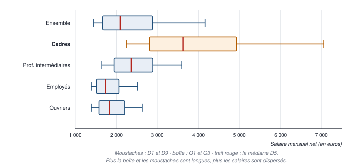

**Ce qu'on lit** : la boîte des cadres est la plus longue et la plus décalée vers la droite — salaires plus élevés **et** plus dispersés ; dans toutes les catégories, la moustache de droite est plus longue que celle de gauche et la médiane est plus près de $Q_1$ que de $Q_3$ : les distributions de salaires sont **étalées à droite**.

## 2.5 — Variance, écart-type et coefficient de variation

::: objectif À la fin de cette section, sans support, tu sais
- calculer l'écart absolu moyen, la variance et l'écart-type sur données brutes et sur une distribution, avec un tableau de calcul ;
- démontrer et utiliser la formule de Koenig et les propriétés de la variance ;
- calculer et interpréter le coefficient de variation.
:::

### Comparer toutes les valeurs à la moyenne

Les indicateurs précédents reposent sur l'écart entre **deux** quantiles. Ceux-ci comparent **l'ensemble des valeurs à la moyenne** : l'**écart absolu moyen**, la **variance** et l'**écart-type**. Il y a plusieurs formules pour un même concept, **selon la présentation des données** : sur données brutes, une moyenne des *N* écarts, observation par observation ; sur une distribution, une moyenne sur les *p* modalités, **pondérée par les effectifs**.

**Pourquoi pas la moyenne des écarts ?** Parce qu'elle vaut toujours **zéro** : les écarts positifs et négatifs se compensent (propriété 1 de la moyenne). On neutralise donc le signe, **par la valeur absolue** (écart absolu moyen) ou **par le carré** (variance).

::: definition Écart absolu moyen, variance, écart-type
**En une phrase :** l'écart absolu moyen est l'écart moyen à la moyenne ; la variance, la moyenne des carrés des écarts ; l'écart-type, sa racine, qui ramène la variance dans l'unité de la variable.

**Définitions à connaître :**
- l'**écart absolu moyen** : $EAM = \frac{1}{N} \sum_{i=1}^{N} \lvert x_i - m \rvert$ ;
- la **variance** : $\sigma^2 = V(X) = \frac{1}{N} \sum_{i=1}^{N} (x_i - m)^2$ — la **moyenne des carrés des écarts à la moyenne** ;
- l'**écart-type** : $\sigma = \sqrt{V(X)}$ (« sigma minuscule »).
:::

::: exemple Le tableau de calcul : les âges de 20 personnes (cours)
Une ligne par observation : $x_i$, l'écart $x_i - m$, l'écart absolu $\lvert x_i - m \rvert$, le carré $(x_i - m)^2$.

| $x_i$ | $x_i - m$ | $\lvert x_i - m \rvert$ | $(x_i - m)^2$ | | $x_i$ | $x_i - m$ | $\lvert x_i - m \rvert$ | $(x_i - m)^2$ |
|---:|---:|---:|---:|---|---:|---:|---:|---:|
| 30 | −17,9 | 17,9 | 320,41 | | 48 | 0,1 | 0,1 | 0,01 |
| 36 | −11,9 | 11,9 | 141,61 | | 49 | 1,1 | 1,1 | 1,21 |
| 41 | −6,9 | 6,9 | 47,61 | | 50 | 2,1 | 2,1 | 4,41 |
| 42 | −5,9 | 5,9 | 34,81 | | 52 | 4,1 | 4,1 | 16,81 |
| 42 | −5,9 | 5,9 | 34,81 | | 52 | 4,1 | 4,1 | 16,81 |
| 44 | −3,9 | 3,9 | 15,21 | | 54 | 6,1 | 6,1 | 37,21 |
| 46 | −1,9 | 1,9 | 3,61 | | 55 | 7,1 | 7,1 | 50,41 |
| 47 | −0,9 | 0,9 | 0,81 | | 57 | 9,1 | 9,1 | 82,81 |
| 47 | −0,9 | 0,9 | 0,81 | | 58 | 10,1 | 10,1 | 102,01 |
| 47 | −0,9 | 0,9 | 0,81 | | 61 | 13,1 | 13,1 | 171,61 |

- **Moyenne** : $m = 958 / 20 = 47,9$ ans ; la somme de la 2ᵉ colonne vaut bien **0**.
- **Écart absolu moyen** : $EAM = 114 / 20 = 5,7$ — « les âges s'écartent en moyenne de 5,7 ans de l'âge moyen (47,9 ans) ».
- **Variance** : $\sigma^2 = 1\,083,8 / 20 = 54,19$ — elle **n'est pas d'une interprétation aisée**, car les écarts d'âge sont **au carré** : son unité est l'« an² ».
- **Écart-type** (que la diapositive ne calcule pas) : $\sigma = \sqrt{54,19} \approx$ **7,36 ans** — interprétable, car **mesuré en années**.
:::

::: exemple Six chaînes de production (séance 4)
Temps de production (s) : 10, 12, 8, 9, 15, 6 ; $m = 10$ s. Écarts : 0, 2, −2, −1, 5, −4 ; carrés : 0, 4, 4, 1, 25, 16. $V = \frac{0 + 4 + 4 + 1 + 25 + 16}{6} = \frac{50}{6} \approx 8,33$ **s²** ; $\sigma = \sqrt{8,33} \approx$ **2,89 s**.
:::

### La variance d'une distribution

::: formule Variance à partir d'une distribution
$$ \sigma^2 = \frac{1}{N} \sum_{i=1}^{p} n_i (x_i - m)^2 = \frac{1}{N} \sum_{i=1}^{p} n_i x_i^2 - m^2 $$
$$ \sigma^2 = \sum_{i=1}^{p} f_i (x_i - m)^2 = \sum_{i=1}^{p} f_i x_i^2 - m^2 $$

- *p* modalités, d'effectifs $n_i$ et de fréquences $f_i$ ; **l'indice *i* renvoie au numéro de modalité** ;
- chaque carré d'écart est **pondéré** par l'effectif (ou la fréquence) de sa modalité ;
- la seconde égalité de chaque ligne est la **formule de Koenig** (ci-dessous).
:::

::: exemple Les cas n° 2 et n° 3 (séance 4) — et le n° 4 corrigé
**Cas n° 3, avec les effectifs** :

| $x_i$ | $n_i$ | $n_i x_i$ | $x_i - m$ | $(x_i - m)^2$ | $n_i (x_i - m)^2$ |
|---:|---:|---:|---:|---:|---:|
| 6 | 20 | 120 | −6 | 36 | 720 |
| 12 | 10 | 120 | 0 | 0 | 0 |
| 18 | 20 | 360 | 6 | 36 | 720 |
| **Total** | **50** | **600** | | | **1 440** |

$m = 600 / 50 = 12$ ; $\sigma^2 = 1\,440 / 50 =$ **28,8** ; $\sigma = \sqrt{28,8} \approx$ **5,37**.

**Cas n° 2, avec les fréquences** : chaque note a $f_i = 0,1$ ; les écarts à 12 vont de −5 à +5 (sans 0) ; $\sigma^2 = 0,1 \times (25 + 16 + 9 + 4 + 1 + 1 + 4 + 9 + 16 + 25) = 0,1 \times 110 =$ **11** ; $\sigma = \sqrt{11} \approx$ **3,32**.

**Cas n° 4** : $\sigma^2 = \frac{5 \times 64 + 10 \times 16 + 10 \times 4 + 10 \times 4 + 10 \times 16 + 5 \times 64}{50} = \frac{1\,040}{50} =$ **20,8** ; $\sigma \approx$ **4,56**. **Attention, erreur du support** : la diapositive 55 donne « $\sigma^2 = 10,4$ et $\sigma = 3,2$ » — c'est faux (la moitié de la bonne valeur de la variance).

**Bilan des quatre cas** : $\sigma$ = 0 ; 3,32 ; **5,37** ; 4,56. **Le cas n° 3 est le plus dispersé** au sens de l'écart-type — alors que l'étendue désignait le cas n° 4 : la variance donne un grand poids aux **grands écarts**, nombreux dans le cas n° 3 (40 élèves à 6 points de la moyenne).
:::

### La formule de Koenig

::: formule Formule de Koenig
$$ V(X) = \frac{1}{N} \sum_{i=1}^{N} x_i^2 - m^2 $$

**La variance est la moyenne des carrés moins le carré de la moyenne.** C'est souvent plus rapide à calculer, et c'est l'outil pour **agréger** des variances (section 2.6).
:::

::: demo Démonstration (séance 4)
On développe le carré avec $(a - b)^2 = a^2 + b^2 - 2ab$, où $a = x_i$ et $b = m$ :
$$ V(X) = \frac{1}{N} \sum (x_i - m)^2 = \frac{1}{N} \sum x_i^2 + \frac{1}{N} \sum m^2 - \frac{1}{N} \sum 2 x_i m $$
- $\frac{1}{N} \sum_{i=1}^{N} m^2 = \frac{1}{N} (m^2 + m^2 + \dots)$, *N* fois, $= \frac{N m^2}{N} = m^2$ ;
- $\frac{1}{N} \sum 2 x_i m = 2m \times \frac{1}{N} \sum x_i = 2m \times m = 2m^2$.

D'où $V(X) = \frac{1}{N} \sum x_i^2 + m^2 - 2m^2 = \frac{1}{N} \sum x_i^2 - m^2$. **Vérification** sur les six chaînes : $\frac{650}{6} - 10^2 = 108,33 - 100 = 8,33$.
:::

### Les propriétés de la variance

::: formule Changer d'origine ou d'unité
$$ V(a + X) = V(X) \qquad V(aX) = a^2\, V(X) \qquad V(-X) = V(X) $$

- **ajouter le même nombre *a*** à toutes les valeurs **ne change pas la variance** : tous les écarts à la moyenne restent les mêmes ;
- **multiplier** toutes les valeurs par *a* **multiplie la variance par $a^2$** — la variance **n'est pas linéaire** ; l'écart-type, lui, est multiplié par $\lvert a \rvert$ ;
- en corollaire, $V(-X) = (-1)^2 V(X) = V(X)$.
:::

::: exemple 115 notes augmentées, puis multipliées (cours)
115 notes : 18 élèves à 5, 15 à 6, 27 à 7, 30 à 8, 25 à 9 ; moyenne $834 / 115 \approx 7,25$ ; variance $\approx 1,82$, écart-type $\approx 1,35$.
- **+ 6 points pour tous** : la moyenne passe à **13,25**, la variance **reste 1,82** — le graphique est simplement décalé.
- **Notes multipliées par 2** : la moyenne passe à **14,50**, la variance est multipliée par 4 (**7,29**), l'écart-type par 2 (**2,70**) — le graphique est étiré.
:::

### Le coefficient de variation

La variance et l'écart-type dépendent de l'**unité de mesure** : changer de monnaie ou de mètre à centimètre les change. Pour comparer la dispersion de caractères mesurés différemment, on rapporte l'écart-type à la moyenne.

::: formule Coefficient de variation
$$ CV = \frac{\sigma(X)}{m_X} $$

Il est **sans unité** et s'exprime **en pourcentage**. Il permet de comparer la dispersion de variables d'unités ou de niveaux différents : des revenus en dollars et en yens, des poids de naissance et des tailles. Exemple : l'écart-type des âges (7,36 ans) rapporté à leur moyenne (47,9 ans) donne $CV \approx 15,4$ %.
:::

::: examen Quelle formule, quelles données ?
Pour choisir le calcul, **identifie d'abord la présentation des données** (cours) :
- **données brutes** : toutes les observations individuelles sont disponibles → formules en $\frac{1}{N} \sum_{i=1}^{N}$ ;
- **distribution** : toutes les modalités et leurs effectifs ou fréquences → formules pondérées $\sum n_i$ ou $\sum f_i$ ;
- **données agrégées par sous-groupes** : effectifs, moyennes et écarts-types par groupe → formules par agrégation (section 2.6).
:::

## 2.6 — Interpréter et agréger : Bienaymé-Tchebychev, variance par groupes

::: objectif À la fin de cette section, sans support, tu sais
- énoncer l'inégalité de Bienaymé-Tchebychev et construire des intervalles m ± kσ, avec leur phrase d'interprétation ;
- interpréter la volatilité d'une série financière, sans l'erreur d'unités du support ;
- agréger des variances de groupes avec Koenig, et décomposer la variance en variance intra et inter.
:::

### L'inégalité de Bienaymé-Tchebychev

C'est elle qui permet d'**interpréter l'écart-type en lien avec la moyenne** — très pratique quand on ne nous donne **qu'une moyenne et un écart-type** pour résumer des données.

::: formule Inégalité de Bienaymé-Tchebychev
Pour tout $k > 1$, l'intervalle $[m - k\sigma ; m + k\sigma]$ contient **au moins une proportion** $1 - \frac{1}{k^2}$ des observations — donc **au plus** $\frac{1}{k^2}$ des observations sont en dehors.

| *k* | Au moins dans $m \pm k\sigma$ | Au plus en dehors |
|:---:|:---:|:---:|
| 2 | $1 - 1/4 =$ **75 %** | 25 % |
| 3 | $1 - 1/9 \approx$ **89 %** | 11 % |
| 10 | $1 - 1/100 =$ **99 %** | 1 % |

Elle est vraie **pour toute distribution**, quelle que soit sa forme : c'est une **garantie minimale** — en pratique, la proportion réelle est souvent bien plus forte. Irénée-Jules **Bienaymé** et Pafnouti **Tchebychev** l'ont établie au XIXᵉ siècle.
:::

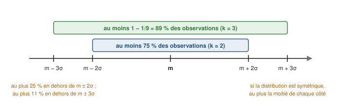

**Si la distribution est symétrique**, ce qui est en dehors se partage **également** des deux côtés : **au plus $\frac{1}{2k^2}$** des observations dépassent $m + k\sigma$ — 12,5 % pour k = 2, 5,6 % pour k = 3. C'est la clé de l'exercice sur la pollution (partie 5).

::: exemple Les âges : m = 47,9 ans, σ ≈ 7,36 ans
$m \pm 2\sigma = [47,9 - 14,7 ; 47,9 + 14,7] = [33,2 ; 62,6]$ : **au moins 75 %** des personnes ont entre 33,2 et 62,6 ans. **Vérification** : 19 âges sur 20 (95 %) y sont — seul 30 ans est en dehors.
:::

### Application en finance : la volatilité

L'écart-type, très utilisé en finance, s'interprète comme la **volatilité** d'une série : le **risque**. La **rentabilité journalière** d'une action est le **taux de variation** de son prix entre la veille et le jour : $r_t = \frac{P_t - P_{t-1}}{P_{t-1}}$. On calcule sa moyenne et son écart-type sur une fenêtre de jours : on obtient un **double indicateur**, rendement moyen et risque.

::: exemple Une action du 22 août au 21 septembre 2012 (cours et classeur Excel)
Prix de clôture : 35,02 € le 22 août, 34,78 € le 23 août… 39,67 € le 21 septembre — **23 prix, donc 22 rentabilités**. Premier calcul : $r = (34,78 - 35,02) / 35,02 = -0,685$ %.

- **Rentabilité journalière moyenne** : $m = 0,587$ % ; **volatilité** : $\sigma = 1,954$ %.
- **Avec k = 2** : $m - 2\sigma = 0,587 - 2 \times 1,954 \approx -3,32$ % et $m + 2\sigma \approx 4,49$ % (calculés avec les valeurs non arrondies du classeur : 0,58711 % et 1,95351 %). **Phrase** : « **plus de 3 jours sur 4** (au moins 75 % des jours), la rentabilité journalière est comprise entre −3,32 % et +4,49 % ». **Vérification** : 21 jours sur 22 (95 %) y sont — seul le 6 septembre (+5,48 %) en sort.
:::

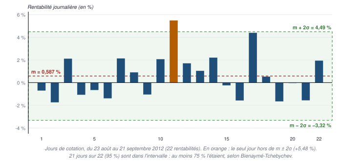

::: exemple Cinq fenêtres de 2012 (diapositive 48)
| Période | Du 23/05 au 21/06 | Du 22/06 au 23/07 | Du 24/07 au 22/08 | Du 23/08 au 21/09 | Du 23/05 au 21/09 |
|---|---:|---:|---:|---:|---:|
| Jours | 22 | 22 | 22 | 22 | 88 |
| Rentabilité moyenne *m* (%) | 0,372 | −0,307 | 1,244 | 0,587 | 0,474 |
| Volatilité σ (%) | 2,555 | 3,374 | 3,128 | 1,954 | 2,861 |
| $m - 2\sigma$ (%) | −4,74 | −7,06 | −5,01 | −3,32 | −5,25 |

**Lecture juste** : dans **toutes** les périodes, $m - 2\sigma$ est **négatif** : on peut seulement dire qu'au moins 75 % des jours, la rentabilité dépasse ce seuil négatif. **Bienaymé-Tchebychev ne garantit des gains dans aucune période**, même 75 % du temps — et encore moins 99 % (k = 10 donne $m - 10\sigma$ entre −19 % et −34 %). La période 4 a le risque le plus faible (σ = 1,954 %) ; la période 3, le rendement moyen le plus fort.
:::

::: piege L'erreur d'unités de la diapositive 48 et du classeur
La diapositive conclut « il y a 99 % de chances de faire des gains en période 1, 2, 3, 5 » et « pour s'assurer des gains 999 fois sur 1 000, il ne fallait pas investir en période 1, 2, 4, 5 ». Ces phrases viennent de la **deuxième feuille du classeur Excel**, qui calcule $m - k\sigma$ en **divisant σ par 100** alors que *m* reste en pourcentage : $0,372 - 2 \times 2,555 / 100 = 0,32$ au lieu de $0,372 - 2 \times 2,555 = -4,74$. **Les deux nombres sont déjà en %** : il ne faut rien diviser. La liste « 1, 2, 3, 5 » contredit d'ailleurs le calcul fautif lui-même (qui donne 1, 3, 4, 5), et la période 2 a une rentabilité moyenne **négative**. La **première** feuille du classeur, elle, est juste ($[-3,32\ \% ; 4,49\ \%]$). **Si la question tombe, fais le calcul juste et dis en une phrase que *m* et σ sont tous deux en %** — et demande en TD comment ton chargé de TD veut qu'on la traite.
:::

### Agréger des variances : la formule de Koenig par groupes

La moyenne s'agrège facilement (c'est un opérateur linéaire) ; **l'écart-type, non** : on ne peut pas calculer facilement la volatilité annuelle à partir des volatilités mensuelles… **mais il y a un moyen** : Koenig.

::: formule Variance par agrégation
$K$ groupes d'effectifs $N_k$, de moyennes $m_k$ et de variances $\sigma_k^2$ ; $N = \sum N_k$ et $m = \frac{1}{N} \sum N_k m_k$ :

$$ \sigma^2 = \frac{1}{N} \sum_{k=1}^{K} N_k \left( \sigma_k^2 + m_k^2 \right) - m^2 $$
:::

::: demo Démonstration (séance 4)
1. **Dans chaque groupe**, Koenig donne $\sigma_k^2 = \frac{1}{N_k} \sum_{i \in k} x_i^2 - m_k^2$, donc $\sum_{i \in k} x_i^2 = N_k (\sigma_k^2 + m_k^2)$ : **la somme des carrés d'un groupe se retrouve avec son effectif, sa variance et sa moyenne**.
2. **Pour la population**, Koenig donne $\sigma^2 = \frac{1}{N} \sum_{i=1}^{N} x_i^2 - m^2$.
3. **L'astuce** : la somme des carrés de la population est la somme des sommes de carrés des groupes : $\sum_{i=1}^{N} x_i^2 = \sum_{k=1}^{K} \sum_{i \in k} x_i^2 = \sum_{k=1}^{K} N_k (\sigma_k^2 + m_k^2)$.
4. D'où la formule.
:::

### La décomposition de la variance

En séparant les deux termes de la formule précédente :

::: formule Variance totale = variance intra-groupe + variance inter-groupe
$$ \sigma^2 = V_{intra} + V_{inter} $$
$$ V_{intra} = \sum_{k=1}^{K} \frac{N_k}{N} \sigma_k^2 \qquad V_{inter} = \sum_{k=1}^{K} \frac{N_k}{N} (m_k - m)^2 = \sum_{k=1}^{K} \frac{N_k}{N} m_k^2 - m^2 $$

- la **variance intra-groupe** est la **moyenne pondérée des variances des groupes** : la dispersion **à l'intérieur** des groupes ;
- la **variance inter-groupe** est la **variance des moyennes des groupes** autour de la moyenne générale : la dispersion **entre** les groupes.

**Attention, erreur du support** : la diapositive 58 écrit $V_{intra} = \sum \frac{N_k}{N} \sigma_k$ — **sans le carré**. C'est bien la moyenne des **variances** $\sigma_k^2$, comme au tableau de la séance 4.
:::

::: exemple Les deux divisions, avec des écarts-types (données fictives pour l'exemple)
Division A : 330 élèves, moyenne 12, écart-type 3 ; division B : 270 élèves, moyenne 10, écart-type 4. On a vu $m = 11,1$.
- **Variance totale** : $\sigma^2 = \frac{330 \times (9 + 144) + 270 \times (16 + 100)}{600} - 11,1^2 = \frac{50\,490 + 31\,320}{600} - 123,21 = 136,35 - 123,21 = 13,14$ ; $\sigma \approx 3,62$.
- **Intra** : $\frac{330 \times 9 + 270 \times 16}{600} = \frac{7\,290}{600} = 12,15$. **Inter** : $\frac{330 \times 0,9^2 + 270 \times 1,1^2}{600} = \frac{267,3 + 326,7}{600} = 0,99$. **Vérification** : 12,15 + 0,99 = 13,14.
- **Interprétation** : 92 % de la variance ($12,15 / 13,14$) vient de la dispersion **à l'intérieur** des divisions ; l'écart entre les deux moyennes n'en explique que 8 %.
:::

## 2.7 — La concentration : courbe de Lorenz et indice de Gini

::: objectif À la fin de cette section, sans support, tu sais
- distinguer concentration et dispersion ;
- calculer la part de l'agrégat de chaque classe et les coordonnées d'une courbe de Lorenz, puis la tracer et l'interpréter ;
- calculer un indice de Gini par la méthode des trapèzes et l'interpréter.
:::

### Concentration ou dispersion ?

Les deux familles d'indicateurs peuvent mesurer les **inégalités** d'un caractère quantitatif, mais pas de la même façon :

- la **dispersion** s'intéresse à la **répartition des observations** de la variable : à quel point les valeurs s'écartent les unes des autres ;
- la **concentration** s'intéresse à la **répartition de la somme** (du total) de la variable : **qui détient quelle part du total**.

La concentration n'a donc de sens que si **la somme de la variable a un sens** : la somme des revenus d'une population (la masse des revenus) en a un ; **la somme des tailles, non**.

### La part de l'agrégat

::: formule Part de l'agrégat d'une classe
$$ \text{somme de } X \text{ dans la classe } k = \sum_{i \in k} x_i = N_k\, m_k \qquad \text{part de la classe } k = \frac{N_k\, m_k}{\sum_{j} N_j\, m_j} $$

Pour des salaires, la somme s'appelle la **masse salariale** : **salaire moyen de la classe × effectif de la classe**. Si l'on ne connaît que les **proportions** de la population, on peut poser l'effectif total égal à 1 : dans le calcul des parts, *N* disparaît.
:::

::: exemple Les salaires dans les entreprises en France, 2005 et 2021 (cours)
La population est découpée en **cinq classes de 20 %** des salariés (les quintiles) ; le salaire moyen de chaque classe est **estimé par le centre** de la classe.

| Proportion de salariés | Bornes 2005 | Salaire moyen estimé 2005 | Part de la masse salariale 2005 | Bornes 2021 | Salaire moyen estimé 2021 | Part de la masse salariale 2021 |
|---:|---|---:|---:|---|---:|---:|
| 20 % | 11 000 – 12 894 | 11 947 | 11,2 % | 1 333 – 6 709 | 4 021 | 3,9 % |
| 20 % | 12 894 – 15 555 | 14 225 | 13,3 % | 6 709 – 15 110 | 10 910 | 10,6 % |
| 20 % | 15 555 – 19 098 | 17 327 | 16,2 % | 15 110 – 22 942 | 19 026 | 18,4 % |
| 20 % | 19 098 – 25 818 | 22 458 | 21,1 % | 22 942 – 32 124 | 27 533 | 26,7 % |
| 20 % | 25 818 – 55 600 | 40 709 | 38,2 % | 32 124 – 51 490 | 41 807 | 40,5 % |
| **Ensemble** | | **21 333** | **100** | | **20 659** | **100** |

**Le calcul, pour 2005** : centre de la 1ʳᵉ classe $= (11\,000 + 12\,894)/2 = 11\,947$ ; toutes les classes ayant le même effectif, la part de la 1ʳᵉ est $\frac{11\,947}{11\,947 + 14\,225 + 17\,327 + 22\,458 + 40\,709} = \frac{11\,947}{106\,666} = 11,2$ % ; salaire moyen d'ensemble $= 106\,666 / 5 = 21\,333$ €.

**Évolution** : la part des 20 % les moins payés tombe de **11,2 % à 3,9 %**, celle des 20 % les mieux payés monte de **38,2 % à 40,5 %** : les inégalités de salaire ont **augmenté**. **Prudence** : l'unité (salaires annuels en euros, très probablement) et le champ ne sont pas précisés ; une borne basse de 1 333 € en 2021 contre 11 000 € en 2005 laisse penser que les deux années ne couvrent pas les mêmes salariés (temps partiel inclus en 2021 ?) — **à vérifier** avant de conclure fermement.
:::

### La courbe de Lorenz

::: definition Courbe de Lorenz
**En une phrase :** la courbe qui dit quelle part du total détiennent les x % les plus « pauvres ».

**Définition à connaître :** la **courbe de Lorenz** représente la **part cumulée de l'agrégat de *X*** (en ordonnée) en fonction de la **fréquence cumulée de la population** (en abscisse), les individus étant rangés par valeurs croissantes. Pour les salaires, elle met en correspondance **la part cumulée de la masse salariale** et **la part cumulée des salariés**. Elle part de (0 ; 0) et arrive à (100 % ; 100 %).
:::

| Part cumulée des salariés | 20 % | 40 % | 60 % | 80 % | 100 % |
|---|---:|---:|---:|---:|---:|
| **Part cumulée de la masse salariale, 2005** | 11,2 % | 24,5 % | 40,7 % | 61,8 % | 100 % |
| **Part cumulée de la masse salariale, 2021** | 3,9 % | 14,5 % | 32,9 % | 59,6 % | 100 % |

*Les cumuls s'obtiennent de proche en proche : 11,2 ; 11,2 + 13,3 = 24,5 ; 24,5 + 16,2 = 40,7 ; etc.*

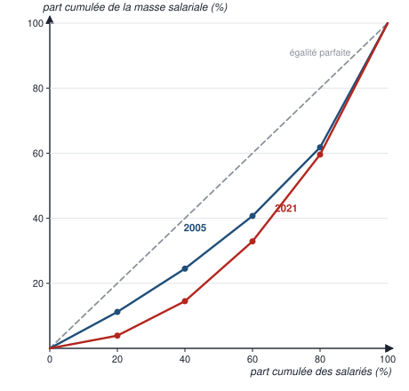

::: methode Interpréter une courbe de Lorenz
1. **Une phrase par point** : « en 2005, les 20 % des salariés les moins bien payés perçoivent 11,2 % de la masse salariale » ; « les 80 % les moins payés en perçoivent 61,8 %, donc les 20 % les mieux payés, 38,2 % ».
2. **La diagonale** est la courbe de l'**égalité parfaite** (x % des salariés perçoivent x % de la masse). **Plus la courbe s'éloigne de la diagonale, plus la concentration est forte** et plus les inégalités sont marquées.
3. **Si une courbe est partout plus éloignée** que l'autre, l'inégalité est plus forte **pour tous les ordres de quantiles** : tous les indicateurs d'inégalité convergent — ici, 2021 est plus inégalitaire que 2005.
4. **Si les courbes se croisent**, on ne peut pas conclure sans indicateur : on mesure alors la surface entre la courbe et la diagonale (le Gini), et différents indicateurs peuvent donner des conclusions contradictoires.
:::

### L'indice de Gini

::: definition Indice de Gini
**En une phrase :** un nombre entre 0 et 1 qui mesure l'écart entre la courbe de Lorenz et l'égalité parfaite.

**Définition à connaître :** géométriquement, l'**indice de Gini** vaut **deux fois l'aire comprise entre la diagonale et la courbe de Lorenz** (l'**aire de concentration**). **Proche de 0** : concentration (inégalité) **faible** ; **proche de 1** : concentration **forte**.
:::

::: formule Calcul de l'indice de Gini par les trapèzes
$$ G = 2 \left[ \frac{1}{2} - \sum \frac{(b + B)\, h}{2} \right] = 1 - \sum (b + B)\, h $$

- $\frac{1}{2}$ : l'aire sous la diagonale ;
- sous la courbe de Lorenz, l'aire se découpe en **trapèzes**, un par classe : $b$ et $B$ sont les parts cumulées **au début et à la fin** de la classe (la petite et la grande base), $h$ est la **part de la population de la classe** (la hauteur, en proportion) ;
- aire de concentration $= \frac{1}{2} - \sum$ aires des trapèzes ; Gini = 2 × aire de concentration.
:::

::: exemple Le Gini des salaires, 2005 et 2021
| Classe (h = 0,2) | *b* 2005 | *B* 2005 | Aire 2005 : $(b + B) h / 2$ | *b* 2021 | *B* 2021 | Aire 2021 |
|---|---:|---:|---:|---:|---:|---:|
| 0 – 20 % | 0 | 0,112 | 0,0112 | 0 | 0,039 | 0,0039 |
| 20 – 40 % | 0,112 | 0,245 | 0,0357 | 0,039 | 0,145 | 0,0184 |
| 40 – 60 % | 0,245 | 0,407 | 0,0652 | 0,145 | 0,329 | 0,0474 |
| 60 – 80 % | 0,407 | 0,618 | 0,1025 | 0,329 | 0,596 | 0,0925 |
| 80 – 100 % | 0,618 | 1 | 0,1618 | 0,596 | 1 | 0,1596 |
| **Somme** | | | **0,3764** | | | **0,3218** |

- **2005** : aire de concentration $= 0,5 - 0,3764 = 0,1236$ ; $G = 2 \times 0,1236 \approx$ **0,247**.
- **2021** : aire de concentration $= 0,5 - 0,3218 = 0,1782$ ; $G = 2 \times 0,1782 \approx$ **0,356**.
- **Interprétation** : l'indice de Gini passe de 0,25 à 0,36 — la concentration des salaires a **augmenté** (avec la prudence déjà dite sur la comparabilité des deux années). La diapositive 68 écrit l'aire du trapèze de 60 à 80 % « 1025 » : c'est la même valeur calculée **en pourcentages** ($(40,7 + 61,8) \times 20 / 2 = 1\,025$ %², soit 0,1025).
:::

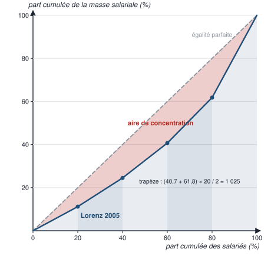

::: piege Des classes de largeurs différentes
Si les classes n'ont pas toutes la même part de la population — par exemple P0-P20, …, P80-P90, P90-P100 —, la **hauteur *h* change d'un trapèze à l'autre** (0,2 puis 0,1). L'oublier fausse le Gini : c'est le piège de l'exercice sur les données de la BCE (partie 5).
:::

::: examen Récapitulons (cours)
Tu sais résumer la distribution d'un caractère statistique à l'aide d'**indicateurs de position** (mode, moyenne, médiane, quantiles), de **dispersion** (étendue, écarts inter-quantiles, EAM, variance, écart-type, coefficient de variation) et de **concentration** (courbe de Lorenz, indice de Gini). **Le choix des indicateurs dépend du type de données, mais aussi de ce que l'on veut en faire.**
:::

# 3 — Pièges et points bonus

## Les confusions qui coûtent des points

| Ne confonds pas… | Ce qui est juste |
|---|---|
| **Classe modale** et **classe de plus fort effectif** | Avec des amplitudes inégales, la classe modale a la plus forte **densité** $f / a$ |
| **Hauteur** et **aire** d'un rectangle d'histogramme | La hauteur est la **densité** ; la **fréquence** se lit dans l'**aire** |
| **Indice d'observation** et **indice de modalité** | $\frac{1}{N} \sum_{i=1}^{N} x_i$ sur données brutes **contre** $\frac{1}{N} \sum_{i=1}^{p} n_i x_i$ sur une distribution |
| **Moyenne des moyennes** et **moyenne pondérée** | La moyenne d'ensemble pondère chaque groupe par son effectif : 11,1 et non 11 |
| **Moyenne** et **médiane** | Sensible aux extrêmes, linéaire, agrégeable **contre** robuste, non linéaire, non agrégeable |
| **$F(x) = 50$ %** et **$f(x) = 50$ %** | La médiane se cherche sur les fréquences **cumulées** |
| **$x_a$, $x_b$** pour des classes | Ce sont les **bornes supérieures** des classes où F passe 50 % — pas leurs centres |
| **Écart** et **rapport** inter-quantiles | $D_9 - D_1$ en euros **contre** $D_9 / D_1$ sans unité |
| **Variance** et **écart-type** | En unité² (s², €²) **contre** dans l'unité de la variable |
| **$V(aX)$** et **$a\,V(X)$** | La variance est multipliée par $a^2$ ; l'écart-type par $\lvert a \rvert$ |
| **Ajouter** et **multiplier** | $V(a + X) = V(X)$ : décaler ne disperse pas |
| **« Au moins 75 % »** et **« 75 % »** | Bienaymé-Tchebychev donne un **minimum**, valable pour toute distribution |
| **Variance intra** et **inter** | Moyenne des **variances** des groupes **contre** variance des **moyennes** des groupes |
| **Dispersion** et **concentration** | La répartition des **observations** **contre** la répartition de la **somme** |
| **Abscisse** et **ordonnée** de Lorenz | La part cumulée de la **population** en abscisse, celle du **total** en ordonnée |

## Si tu lis autre chose ailleurs : les erreurs des sources, corrigées

| On lit dans les supports… | Ce qui est exact |
|---|---|
| Cas n° 4 : « σ² = 10,4 et σ = 3,2 » (diapositive 55) | **σ² = 1 040 / 50 = 20,8 ; σ ≈ 4,56** |
| $V_{intra} = \sum \frac{N_k}{N} \sigma_k$ (diapositive 58) | $V_{intra} = \sum \frac{N_k}{N} \sigma_k^{\,2}$ : la moyenne des **variances** |
| « 99 % de chances de faire des gains en période 1, 2, 3, 5 » (diapositive 48 et classeur, feuille 2) | Erreur d'unités (σ divisé par 100) : $m - 2\sigma$ est **négatif** dans toutes les périodes ; aucun gain n'est garanti |
| « Revenus déclarés … des individus retraités, année 2008 » (diapositive 35) | Ce sont les **déciles de niveau de vie de 2024** de la diapositive 34 |
| La classe modale « de 25 à 30 ans » (diapositive 9, sans année) | Vraie **en 2020** ; en 2005 et 2010, ce sont les 21-25 ans |
| « contient au moins 1 − 1/k² observations » (diapositive 44) | Au moins une **proportion** 1 − 1/k² des observations |
| « salaire mensuel net moyen en France métropolitaine » (diapositive 18) | Champ : France **hors Mayotte** ; moyenne 2023 recalculée : 3 114,42 € (fréquences arrondies) |
| $Q_1 \approx 8 + \frac{0,25 - 0,2}{(9 - 8)(0,3 - 0,2)}$ (tableau, séance 3) | $(x_b - x_a)$ **multiplie** : $8 + (9 - 8) \times \frac{0,05}{0,1}$ |
| « un petit pays avec 4 habitants » (planche, concentration, exercice 1) | Le pays A en a **5** |

## Ce que les correcteurs récompensent

- **La formule écrite avant le calcul**, avec les bons indices — observation ou modalité —, puis le calcul posé en **tableau** (une colonne par étape : $n_i x_i$, $x_i - m$, $(x_i - m)^2$…), comme au tableau du CM.
- **Une phrase d'interprétation pour chaque résultat** — exigée par la planche : unité, population, date, et les bons mots : « la moitié », « au moins », « au plus », « ou moins ».
- **Les unités justes** : la variance en unité², l'écart-type dans l'unité, le coefficient de variation et les rapports sans unité.
- **Les conventions annoncées** : classe ouverte fermée à 60-80 ans, centres de classes, interpolation « méthode du cours ».
- **L'esprit critique** : repérer qu'une moyenne de densités n'est pas la densité d'ensemble, qu'une médiane ne s'agrège pas, que Bienaymé-Tchebychev ne garantit qu'un minimum, qu'une comparaison entre deux années suppose le même champ.
- **La comparaison moyenne-médiane** pour dire la forme d'une distribution.

# 4 — Ancrage mémoriel

## 4.1 — Fiche de synthèse

| | L'essentiel à savoir par cœur |
|---|---|
| **Mode** | La modalité la plus fréquente · en classes : **densité** $d = f / a$, **classe modale** = plus forte densité · **histogramme** : bornes en abscisse, densité en ordonnée, **aire = fréquence**, somme des aires = 1 |
| **Moyenne** | Brutes $\frac{1}{N} \sum x_i$ · distribution $\frac{1}{N} \sum n_i x_i = \sum f_i x_i$ · classes : centres · groupes $\sum \frac{N_k}{N} m_k$ (démo : $\sum_{i \in k} x_i = N_k m_k$) · $\sum x_i = N m$ (masse salariale) · $\sum (x_i - m) = 0$ · $m_{aX+b} = a m_X + b$ · sensible aux extrêmes |
| **Médiane** | Coupe la population en deux moitiés · brutes : trier, rang $(N + 1)/2$, ou moyenne des deux rangs centraux · distribution : $F(x_j) = 50$ % → $x_j$ ; sinon interpolation $x_a + (x_b - x_a) \frac{0,5 - F(x_a)}{F(x_b) - F(x_a)}$ · non linéaire, non agrégeable, robuste · étalée à droite : méd < moy |
| **Quantiles** | $Q_1, Q_3$ ; $D_1 \dots D_9$ ; $C_1 \dots C_{99}$ · $F(q) = α$, $q = F^{-1}(α)$ · même interpolation avec α |
| **Dispersion (quantiles)** | Étendue max − min · $C_{99} - C_1$, $D_9 - D_1$ (80 % centraux), $Q_3 - Q_1$ (50 % centraux), rapports $D_9 / D_1$ · boîte à moustaches : médiane, $Q_1$-$Q_3$, moustaches ($D_1$-$D_9$ ou 1,5 × IQR) |
| **Variance** | $EAM = \frac{1}{N} \sum \lvert x_i - m \rvert$ · $\sigma^2 = \frac{1}{N} \sum (x_i - m)^2 = \frac{1}{N} \sum x_i^2 - m^2$ (Koenig) · distribution : $\sum f_i (x_i - m)^2$ · $\sigma = \sqrt{\sigma^2}$ · $V(a + X) = V(X)$, $V(aX) = a^2 V(X)$ · $CV = \sigma / m$ sans unité |
| **Tchebychev** | $m \pm k\sigma$ contient au moins $1 - 1/k^2$ : 75 % (k = 2), 89 % (k = 3), 99 % (k = 10) · symétrique : au plus $1/(2k^2)$ de chaque côté · finance : σ = volatilité |
| **Groupes** | $\sigma^2 = \frac{1}{N} \sum N_k (\sigma_k^2 + m_k^2) - m^2$ · $V_{intra} = \sum \frac{N_k}{N} \sigma_k^2$ · $V_{inter} = \sum \frac{N_k}{N} (m_k - m)^2$ · total = intra + inter |
| **Concentration** | Répartition de la **somme** (revenus oui, tailles non) · part $= N_k m_k / \sum N_j m_j$ · **Lorenz** : part cumulée du total selon part cumulée de la population ; diagonale = égalité · **Gini** $= 2 \times$ aire de concentration $= 1 - \sum (b + B) h$ ; 0 égalité, 1 concentration maximale |

## 4.2 — Moyens mnémotechniques

| Pour retenir… | Le moyen |
|---|---|
| La classe modale | **« Dense, pas nombreuse »** : on cherche où les individus sont le plus serrés, par année d'âge — la densité |
| L'histogramme | **« Hauteur = densité, surface = fréquence »** |
| Les trois moyennes | **Brutes : je divise par N · distribution : je pondère par n · groupes : je pondère par N_k** |
| L'interpolation | **« Même proportion du chemin »** sur l'axe des F et sur l'axe des x |
| Koenig | **« Moyenne des carrés moins carré de la moyenne »** — MCCM |
| Les propriétés de la variance | **« Décaler ne disperse pas, étirer disperse au carré »** |
| Bienaymé-Tchebychev | **2 → 3/4 · 3 → 8/9 · 10 → 99/100** : au moins $1 - 1/k^2$ |
| Intra et inter | **Intra = à l'intérieur** (moyenne des variances) · **Inter = entre** (variance des moyennes) |
| Dispersion et concentration | **Dispersion : les valeurs · concentration : le gâteau** — qui mange quelle part du total |
| Gini | **« 1 moins la somme des (b + B) × h »** ; 0 = partage égal, 1 = un seul a tout |

## 4.3 — Le schéma qui relie tout

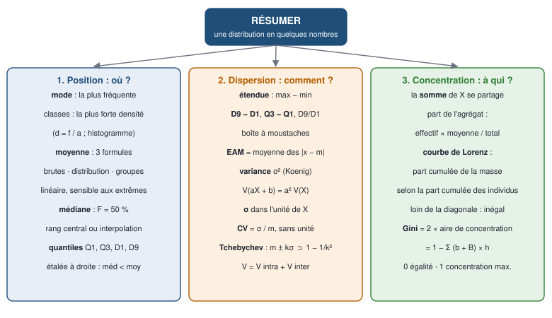

**Comment t'en servir :** à chaque révision, redessine ce schéma sur une feuille blanche, **de mémoire** : « résumer » au centre, puis les trois questions — où ? comment ? à qui ? —, puis, sous chacune, les indicateurs et leurs formules. Compare avec le modèle et complète en couleur ce qui manquait.

# 5 — Teste-toi

*Fais tout ce test sur une feuille, **sans regarder le cours**, avec une calculatrice. Le corrigé est **à la fin du document**, dans la partie « Corrigés », sur une page à part : ne la lis qu'après. Le QCM vérifie que tu sais le cours ; les exercices des niveaux 2 à 4 sont au format de l'examen. Chaque question renvoie à sa section (§).*

## Niveau 1 — QCM

*Une seule bonne réponse par question.*

**1.** Avec des classes d'amplitudes inégales, la classe modale est celle qui a : *(§ 2.1)*

- **a)** le plus grand effectif
- **b)** la plus grande fréquence
- **c)** la plus grande densité
- **d)** la plus grande amplitude

**2.** Une classe [25 ; 30[ de fréquence 0,187 a une densité de : *(§ 2.1)*

- **a)** 0,0374
- **b)** 0,187
- **c)** 0,935
- **d)** 5,35

**3.** Dans un histogramme, la fréquence d'une classe se lit : *(§ 2.1)*

- **a)** sur la hauteur du rectangle
- **b)** sur la largeur du rectangle
- **c)** sur l'axe des abscisses
- **d)** dans l'aire du rectangle

**4.** La moyenne des notes 4, 4, 4, 12, 12, 12, 20, 20, 20, 20 vaut : *(§ 2.2)*

- **a)** 12
- **b)** 12,8
- **c)** 13,3
- **d)** 16

**5.** La division A (330 élèves) a 12 de moyenne, la division B (270 élèves) 10. La moyenne des 600 élèves vaut : *(§ 2.2)*

- **a)** 11
- **b)** 10,9
- **c)** 11,1
- **d)** 11,2

**6.** Si l'on ajoute 2 points à toutes les notes, la moyenne : *(§ 2.2)*

- **a)** augmente de 2
- **b)** ne change pas
- **c)** est multipliée par 2
- **d)** augmente de 4

**7.** La somme des écarts à la moyenne, $\sum (x_i - m)$, vaut toujours : *(§ 2.2)*

- **a)** la variance
- **b)** l'étendue
- **c)** *N*
- **d)** 0

**8.** Dans une distribution étalée à droite, comme celle des revenus : *(§ 2.2)*

- **a)** la médiane est supérieure à la moyenne
- **b)** la médiane est inférieure à la moyenne
- **c)** la médiane égale la moyenne
- **d)** on ne peut rien dire

**9.** La médiane de 15 valeurs rangées par ordre croissant est : *(§ 2.3)*

- **a)** la 7ᵉ valeur
- **b)** la moyenne de la 7ᵉ et de la 8ᵉ
- **c)** la 8ᵉ valeur
- **d)** la moyenne des 15 valeurs

**10.** Dix valeurs rangées ; la 5ᵉ vaut 99 et la 6ᵉ vaut 109. La médiane vaut : *(§ 2.3)*

- **a)** 99
- **b)** 104
- **c)** 109
- **d)** 208

**11.** Sur une distribution, si $F(x_j) = 50$ % exactement : *(§ 2.3)*

- **a)** la médiane vaut $x_j$
- **b)** il faut interpoler entre $x_j$ et la modalité suivante
- **c)** la médiane vaut 50
- **d)** la médiane n'existe pas

**12.** La formule d'interpolation de la médiane est : *(§ 2.3)*

- **a)** $x_a + \frac{(x_b - x_a)(F(x_b) - F(x_a))}{0,5 - F(x_a)}$
- **b)** $x_a + \frac{F(x_b) - F(x_a)}{(x_b - x_a)(0,5 - F(x_a))}$
- **c)** $\frac{x_a + x_b}{2}$
- **d)** $x_a + \frac{(x_b - x_a)(0,5 - F(x_a))}{F(x_b) - F(x_a)}$

**13.** « $D_1$ = 13 970 € par UC » (niveau de vie 2024) signifie que : *(§ 2.3)*

- **a)** 10 % des personnes ont un niveau de vie inférieur à 13 970 €
- **b)** 10 % des personnes ont un niveau de vie supérieur à 13 970 €
- **c)** le niveau de vie moyen des 10 % les plus pauvres est de 13 970 €
- **d)** les 10 % les plus pauvres ont 13 970 € au total

**14.** Si l'on divise par 2 la plus grande valeur d'une série (qui reste la plus grande) : *(§ 2.3)*

- **a)** la médiane et la moyenne baissent
- **b)** rien ne change
- **c)** la médiane ne change pas, la moyenne baisse
- **d)** la médiane baisse, la moyenne ne change pas

**15.** $Q_3$ est le quantile d'ordre : *(§ 2.3)*

- **a)** 3 %
- **b)** 30 %
- **c)** 33 %
- **d)** 75 %

**16.** L'écart inter-quartile $Q_3 - Q_1$ mesure l'amplitude : *(§ 2.4)*

- **a)** des 50 % centraux de la population
- **b)** des 80 % centraux
- **c)** de toute la série
- **d)** des 25 % les plus élevés

**17.** « $D_9 - D_1$ = 2 720 € » signifie que : *(§ 2.4)*

- **a)** les 10 % les mieux payés gagnent 2 720 € de plus que la moyenne
- **b)** au moins 2 720 € séparent les salaires des 10 % les mieux payés de ceux des 10 % les moins bien payés
- **c)** le salaire médian est de 2 720 €
- **d)** l'écart-type des salaires est de 2 720 €

**18.** Dans une boîte à moustaches, les bords de la boîte sont : *(§ 2.4)*

- **a)** le minimum et le maximum
- **b)** $D_1$ et $D_9$
- **c)** $Q_1$ et $Q_3$
- **d)** la moyenne plus ou moins un écart-type

**19.** La variance est : *(§ 2.5)*

- **a)** la moyenne des écarts à la moyenne
- **b)** la moyenne des carrés des écarts à la moyenne
- **c)** la racine de l'écart-type
- **d)** l'écart entre le maximum et le minimum

**20.** La formule de Koenig s'écrit : *(§ 2.5)*

- **a)** $V(X) = \frac{1}{N} \sum x_i^2 - m^2$
- **b)** $V(X) = \frac{1}{N} \sum x_i^2 + m^2$
- **c)** $V(X) = (\frac{1}{N} \sum x_i)^2$
- **d)** $V(X) = m^2 - \frac{1}{N} \sum x_i^2$

**21.** Des temps mesurés en secondes ont une variance qui s'exprime en : *(§ 2.5)*

- **a)** secondes
- **b)** secondes au carré
- **c)** pourcentage
- **d)** sans unité

**22.** Si l'on multiplie toutes les valeurs par 3, la variance est : *(§ 2.5)*

- **a)** inchangée
- **b)** multipliée par 3
- **c)** augmentée de 3
- **d)** multipliée par 9

**23.** Pour comparer la dispersion de revenus en dollars et en yens, on utilise : *(§ 2.5)*

- **a)** le coefficient de variation
- **b)** la variance
- **c)** l'écart-type
- **d)** l'étendue

**24.** 20 élèves ont 6, 10 ont 12 et 20 ont 18 (moyenne 12). La variance vaut : *(§ 2.5)*

- **a)** 0
- **b)** 11
- **c)** 20,8
- **d)** 28,8

**25.** Selon Bienaymé-Tchebychev, l'intervalle $m \pm 2\sigma$ contient : *(§ 2.6)*

- **a)** exactement 75 % des observations
- **b)** au moins 75 % des observations
- **c)** au moins 95 % des observations
- **d)** au plus 75 % des observations

**26.** Une rentabilité journalière moyenne m = 0,587 % et une volatilité σ = 1,954 % donnent $m - 2\sigma$ ≈ : *(§ 2.6)*

- **a)** 0,55 %
- **b)** −1,37 %
- **c)** −3,32 %
- **d)** −7,06 %

**27.** La variance intra-groupe est : *(§ 2.6)*

- **a)** la variance des moyennes des groupes
- **b)** la moyenne pondérée des variances des groupes
- **c)** la variance totale moins la moyenne
- **d)** la somme des écarts-types des groupes

**28.** La courbe de Lorenz place en abscisse : *(§ 2.7)*

- **a)** la part cumulée du total de la variable
- **b)** les valeurs de la variable
- **c)** la part cumulée de la population
- **d)** la densité

**29.** Un indice de Gini égal à 0 signifie : *(§ 2.7)*

- **a)** l'égalité parfaite
- **b)** la concentration maximale
- **c)** une moyenne nulle
- **d)** une erreur de calcul

**30.** La concentration n'a pas de sens pour : *(§ 2.7)*

- **a)** les revenus des ménages
- **b)** les salaires
- **c)** le patrimoine des ménages
- **d)** la taille des individus

## Niveau 2 — Exercices types d'examen

*Ce sont les dix exercices de la planche de TD du chapitre 2 : fais-les seul avant les séances, chronomètre en main, puis corrige avec la partie « Corrigés », à la fin du document.*

### Exercice 1 — L'économie du sport (planche, position, exercice 1 ; § 2.2)

L'Observatoire de l'économie du sport a publié ces données : « Poids économique et démographique selon la taille des entreprises du sport ».

| Catégorie | | Nombre d'entreprises | Chiffre d'affaires (en Md€) |
|---|---|---:|---:|
| Non employeuses | Micro-entreprises inactives | 10 230 | 0,0 |
| | Micro-entreprises actives | 41 030 | 0,4 |
| | Entrepreneurs individuels | 27 202 | 3,8 |
| | Sociétés | 22 656 | 2,8 |
| | **Sous-total** | **101 118** | **7** |
| Employeuses | TPE employeuses | 23 849 | 13 |
| | PME | 3 341 | 17 |
| | ETI et GE* | 143 | 21 |
| | Paris sportifs | 13 | 13 |
| **Total** | | **128 464** | **71** |

*\* Hors paris sportifs.*

1. Identifiez la population, l'unité statistique, le ou les caractères statistiques.
2. À quoi correspond la 2ᵉ colonne du tableau, « Nombre d'entreprises » ?
3. Et la 3ᵉ colonne, « Chiffre d'affaires » ?
4. Calculez le chiffre d'affaires moyen par TPE employeuse (phrase d'interprétation requise).

### Exercice 2 — La taille des nouveau-nés (planche, position, exercice 2 ; § 2.2 et 2.3)

Une maternité a relevé la taille des 12 nouveau-nés du dernier mois : 48, 51, 51, 50, 52, 49, 52, 50, 50, 48, 51, 50 cm.

1. Quels sont la population, l'unité statistique, le caractère et son type ?
2. Calculez la taille moyenne des bébés.
3. Mettez ces données sous forme de distribution.
4. Calculez la moyenne à partir de la distribution et vérifiez que vous obtenez le même résultat.
5. Calculez la taille médiane par interpolation linéaire.
6. Déterminez le premier quartile et donnez une phrase d'interprétation.

### Exercice 3 — Tracer un histogramme (planche, position, exercice 3 ; § 2.1)

Répartition des individus scolarisés en France en 2017-2018 selon l'âge (source : DEPP, ministère de l'Éducation nationale) :

| Tranche d'âge (années) | [2 ; 6[ | [6 ; 12[ | [12 ; 15[ | [15 ; 18[ | [18 ; 22[ | [22 ; 30[ |
|---|---:|---:|---:|---:|---:|---:|
| **Effectifs** | 2 499 939 | 4 187 564 | 3 286 073 | 2 410 309 | 2 194 176 | 765 961 |

1. Calculez les fréquences, les amplitudes de classe et les densités.
2. Tracez l'histogramme (1 carreau = 2 ans, ou 1 %). Où se lisent les fréquences ?
3. Déterminez la classe modale.

### Exercice 4 — Le revenu des parents d'étudiants (planche, position, exercice 4 ; § 2.1, 2.3 et 2.4)

Enquête Conditions de vie des étudiants 2020 (OVE) : répartition des étudiants selon les revenus mensuels de leurs parents (somme des revenus des deux parents), en %. Champ : étudiants ayant renseigné un revenu pour leurs deux parents (*n* = 41 356).

| Revenu des parents (€ par mois) | Fréquence (%) |
|---|---:|
| Moins de 1 000 | 6,6 |
| De 1 001 à 2 000 | 12,5 |
| De 2 001 à 3 000 | 17,2 |
| De 3 001 à 4 000 | 24,0 |
| De 4 001 à 5 000 | 14,8 |
| De 5 001 à 6 000 | 7,7 |
| De 6 001 à 7 000 | 6,0 |
| De 7 001 à 8 000 | 3,4 |
| De 8 001 à 9 000 | 2,3 |
| De 9 001 à 10 000 | 1,2 |
| Plus de 10 000 | 4,3 |

1. Pourquoi la dernière classe paraît-elle si élevée dans le diagramme en barres de la planche ? Quelle représentation aurait évité cette illusion ? Avez-vous toutes les informations pour la tracer ?
2. Si la première et la dernière classe ont une amplitude au moins égale à 1 000, quelle est la classe modale ?
3. Créez le tableau de distribution : effectifs, fréquences, fréquences cumulées.
4. Calculez la médiane du revenu des parents ; phrase d'interprétation.
5. Calculez les quartiles et l'écart inter-quartile ; phrase d'interprétation.
6. Calculez les déciles $D_1$ et $D_9$ ; phrase d'interprétation.

### Exercice 5 — Les poids de naissance (planche, dispersion, exercice 1 ; § 2.5)

Une maternité relève les poids de naissance (en kg) des 80 derniers-nés :

| Poids (kg) | 1,8 | 2,3 | 2,8 | 2,9 | 3,4 | 4,2 |
|---|---:|---:|---:|---:|---:|---:|
| **Nombre de nouveau-nés** | 2 | 12 | 16 | 20 | 25 | 5 |

1. Calculez les fréquences et le poids moyen.
2. Calculez les carrés des écarts à la moyenne pondérés par la part de chaque groupe ; déduisez-en la variance et l'écart-type.

### Exercice 6 — Le contrôle qualité d'une enquête (planche, dispersion, exercice 2 ; § 2.5 et 2.6)

Vous coordonnez une enquête téléphonique ; vos enquêteurs vous transmettent leurs résultats :

| Enquêteur | Questionnaires | Questions correctement renseignées par questionnaire, en moyenne | Écart-type |
|---|---:|---:|---:|
| A | 120 | 92 | 5 |
| B | 230 | 82 | 1 |
| C | 80 | 90 | 4 |
| D | 70 | 75 | 6 |

1. Calculez, enquêteur par enquêteur, un indicateur de dispersion qui ne dépend pas de la moyenne.
2. Calculez la moyenne agrégée pour l'ensemble des questionnaires.
3. Avec la formule de Koenig, agrégez les sommes des carrés pour calculer l'écart-type de l'ensemble.

### Exercice 7 — La pollution de l'air (planche, dispersion, exercice 3 ; § 2.6)

Une personne asthmatique compare quatre zones. Les distributions des concentrations de polluants sont **symétriques**. Émissions journalières sur un an (en µg/m³) :

| Zone | 1 | 2 | 3 | 4 |
|---|---:|---:|---:|---:|
| **Concentration journalière moyenne** | 80 | 90 | 70 | 100 |
| **Écart-type** | 18 | 16 | 20 | 8 |

1. Dans quels intervalles se situent les taux de pollution au moins 75 % du temps (Bienaymé-Tchebychev, k = 2) ?
2. La personne peut quitter la zone environ 45 jours par an, soit environ 12,5 % du temps, en cas de pic. Où doit-elle vivre pour minimiser les pics d'exposition en sa présence (k = 2) ?
3. Même question si elle ne peut partir que 20 jours par an, soit environ 5-6 % du temps (k = 3).

### Exercice 8 — Les températures (planche, dispersion, exercice 4 ; § 2.5)

Températures à midi à Aix-en-Provence cette semaine : 12°, 14°, 8°, 12°, 18°, 12°, 8°. Sur cette période, le coefficient de variation observé depuis 50 ans atteint habituellement 20 %. Calculez le coefficient de variation de la semaine et concluez.

### Exercice 9 — Deux petits pays (planche, concentration, exercice 1 ; § 2.5 et 2.7)

| Pays A | Revenu (\$) | | Pays B | Revenu (¥) |
|---|---:|---|---|---:|
| Habitant 1 | 50 | | Habitant 1 | 2 000 |
| Habitant 2 | 0 | | Habitant 2 | 2 000 |
| Habitant 3 | 50 | | Habitant 3 | 6 000 |
| Habitant 4 | 150 | | Habitant 4 | 6 000 |
| Habitant 5 | 150 | | | |

1. Peut-on comparer la concentration des revenus de ces deux pays ? Pourquoi ?
2. Tracez la courbe de Lorenz du pays A.
3. Calculez l'indice de Gini associé.
4. Calculez l'écart-type et le coefficient de variation du pays A.
5. Mêmes questions (Gini, écart-type, coefficient de variation) pour le pays B.
6. Que concluez-vous ?
7. À partir de ces données, calculez un indicateur de dispersion comparable, puis concluez.

### Exercice 10 — Revenu et patrimoine en Europe (planche, concentration, exercice 2 ; § 2.7)

La Banque centrale européenne a publié en mars 2020 les quantiles du revenu et du patrimoine des ménages en 2017, en milliers d'euros :

| Tranche de ménages | P0-P20 | P20-P40 | P40-P60 | P60-P80 | P80-P90 | P90-P100 |
|---|---:|---:|---:|---:|---:|---:|
| **Patrimoine net moyen** | 0 | 26,7 | 101,3 | 224,9 | 404,5 | 1 189,7 |
| **Revenu brut moyen** | 9,2 | 20,1 | 31,3 | 48,0 | 70,3 | 135,7 |

1. Que regroupe la notion de patrimoine ? Quelle différence avec le revenu ?
2. Calculez le revenu moyen et le patrimoine moyen de l'ensemble des ménages.
3. Calculez la part du patrimoine et la part du revenu de chaque tranche.
4. Écrivez une phrase d'interprétation pour la ligne P90-P100.
5. Calculez les coordonnées des courbes de Lorenz du revenu et du patrimoine.
6. Tracez les deux courbes.
7. Calculez l'indice de Gini dans les deux cas.
8. Concluez.

## Niveau 3 — Questions pièges et cas transversaux

*Vrai ou faux ? Justifie chaque réponse en une phrase.*

1. La classe modale est la classe qui a le plus grand effectif.
2. La moyenne de deux groupes est toujours la moyenne de leurs deux moyennes.
3. Si l'on ajoute 5 à toutes les valeurs, l'écart-type augmente de 5.
4. La variance d'une durée mesurée en minutes s'exprime en minutes.
5. La médiane de quatre valeurs rangées est la deuxième valeur.
6. Une distribution dont la moyenne dépasse nettement la médiane est probablement étalée à droite.
7. Selon Bienaymé-Tchebychev, 95 % des observations sont dans m ± 2σ.
8. On peut calculer le salaire médian de tous les salariés à partir des médianes de chaque catégorie et de leurs parts.
9. On ne peut pas comparer la dispersion de revenus en dollars et en yens avec l'écart-type.
10. Un indice de Gini de 0,66 indique une concentration plus forte qu'un indice de 0,42.
11. La variance intra-groupe est la variance des moyennes des groupes.
12. « $D_9 / D_1$ = 3,2 » signifie que les 10 % les mieux payés gagnent exactement 3,2 fois plus que les 10 % les moins bien payés.

## Niveau 4 — Sujet au format de l'examen

::: objectif Le cadre
**Le format réel de l'épreuve n'est pas encore connu** : aucune annale ni modalité n'a été reçue. Ce sujet suit le format des planches de TD — exercices sur données, calculs posés en tableau, phrases d'interprétation —, avec calculatrice, sans document. Les données sont **fictives**. Il sera recalé sur les annales dès que tu les auras envoyées.

**En trois pomodoros** : **P1** l'exercice 1 ; **P2** les exercices 2 et 3 ; **P3** la correction au barème. Les examens blancs, eux, se feront d'une traite, à la durée réelle.
:::

**Exercice 1 — Le temps de trajet (8 points).** Une université a relevé le temps de trajet domicile-université (en minutes) de 200 étudiants :

| Temps (min) | [0 ; 10[ | [10 ; 20[ | [20 ; 30[ | [30 ; 45[ | [45 ; 60[ | [60 ; 90[ |
|---|---:|---:|---:|---:|---:|---:|
| **Effectif** | 20 | 50 | 60 | 45 | 15 | 10 |

1. Identifiez la population, l'unité statistique, le caractère et son type. (1 point)
2. Complétez le tableau : fréquences, amplitudes, densités, fréquences cumulées. Quelle est la classe modale ? (2 points)
3. Estimez le temps de trajet moyen. (1 point)
4. Calculez la médiane, $Q_1$ et $Q_3$ par interpolation ; phrase d'interprétation pour chacun. (3 points)
5. Comparez la moyenne et la médiane : que dit-on de la forme de la distribution ? (1 point)

**Exercice 2 — Trois équipes (6 points).** Un centre d'appels compte trois équipes ; nombre d'appels traités par jour et par salarié :

| Équipe | Salariés | Moyenne | Écart-type |
|---|---:|---:|---:|
| A | 20 | 50 | 6 |
| B | 30 | 60 | 8 |
| C | 50 | 40 | 5 |

1. Calculez la moyenne de l'ensemble des salariés. (1 point)
2. Calculez la variance et l'écart-type de l'ensemble (formule de Koenig). (2 points)
3. Décomposez la variance en variance intra et inter-équipes ; interprétez. (2 points)
4. Quelle équipe est la plus homogène relativement à son niveau ? (1 point)

**Exercice 3 — Cinq associés (6 points).** Les revenus annuels (en milliers d'euros) des cinq associés d'un cabinet : 20, 60, 20, 160, 40.

1. Calculez la moyenne, l'écart-type et le coefficient de variation. (2 points)
2. Calculez les coordonnées de la courbe de Lorenz ; écrivez une phrase pour le premier point. (2 points)
3. Calculez l'indice de Gini et interprétez-le. (2 points)

# 6 — Auto-évaluation

**Si tu ne sais pas répondre à ces questions sans regarder, tu ne maîtrises pas encore le chapitre.**

1. Définis le mode, l'amplitude, la densité et la classe modale, et dis pourquoi la classe modale ne se lit jamais sur l'effectif.
2. Trace de mémoire l'histogramme des personnes incarcérées en 2020 et démontre que l'aire d'un rectangle est la fréquence de sa classe.
3. Écris les trois formules de la moyenne — données brutes, distribution, groupes — et dis ce que désigne l'indice dans chacune.
4. Démontre la formule de la moyenne par agrégation, puis refais le calcul des 600 élèves.
5. Énonce et démontre les deux premières propriétés de la moyenne ; explique la troisième avec l'exemple du 0/20.
6. Donne la médiane de 15 puis de 10 valeurs rangées ; dis pourquoi la médiane résiste aux valeurs extrêmes et pourquoi elle ne s'agrège pas.
7. Écris la formule d'interpolation de la médiane, explique « la même proportion du chemin », et refais la médiane de 2008 (0,089 enfant) et l'âge médian des personnes incarcérées (33,1 ans).
8. Définis quartiles, déciles, centiles et quantile d'ordre α ; écris les phrases de lecture de $D_1$, de la médiane et de $D_9$ du niveau de vie de 2024.
9. Calcule l'étendue, $D_9 - D_1$, $Q_3 - Q_1$ et $D_9 / D_1$ des cas n° 2 et n° 4, et dis pourquoi le cas n° 3 échappe aux quantiles.
10. Dessine une boîte à moustaches, nomme chacun de ses éléments et dis ce qu'elle révèle de la forme des distributions de salaires.
11. Construis le tableau de calcul de l'écart absolu moyen, de la variance et de l'écart-type des six chaînes de production, avec l'unité de chaque résultat.
12. Démontre la formule de Koenig, puis refais la variance des cas n° 2, n° 3 et n° 4 — et dis où se trompe la diapositive 55.
13. Énonce les propriétés de la variance et la formule du coefficient de variation ; dis quand ce dernier s'impose.
14. Énonce l'inégalité de Bienaymé-Tchebychev pour k = 2, 3 et 10, avec sa phrase d'interprétation, et explique l'erreur de la diapositive 48.
15. Démontre la formule de la variance par agrégation, puis décompose la variance des deux divisions en variance intra et inter.
16. Distingue dispersion et concentration ; calcule les parts, la courbe de Lorenz et l'indice de Gini des salaires de 2005, et interprète-les.

# 7 — Révision en marchant

1. **Les trois questions du chapitre ?** → Où se situe la série ? Comment les données se répartissent-elles ? Comment la somme se répartit-elle ?
2. **Le mode ?** → La modalité la plus fréquente.
3. **L'amplitude d'une classe ?** → La borne supérieure moins la borne inférieure.
4. **La densité d'une classe ?** → Sa fréquence divisée par son amplitude.
5. **La classe modale ?** → La classe de plus forte densité, pas de plus fort effectif.
6. **La classe modale des personnes incarcérées en 2020 ?** → De 25 à moins de 30 ans.
7. **En ordonnée d'un histogramme ?** → La densité.
8. **Où se lit la fréquence dans un histogramme ?** → Dans l'aire du rectangle.
9. **La somme des aires d'un histogramme ?** → 1, soit 100 %.
10. **La moyenne sur données brutes ?** → La somme des valeurs divisée par N.
11. **La moyenne d'une distribution ?** → La somme des effectifs fois les modalités, divisée par N ; ou la somme des fréquences fois les modalités.
12. **Une classe, dans le calcul de la moyenne ?** → On la remplace par son centre.
13. **La moyenne de plusieurs groupes ?** → Les moyennes des groupes, pondérées par la part de chaque groupe.
14. **330 élèves à 12 et 270 élèves à 10 ?** → 11,1, et non 11.
15. **La somme d'une variable ?** → L'effectif fois la moyenne.
16. **La somme des écarts à la moyenne ?** → Zéro.
17. **Si Y = aX + b ?** → La moyenne de Y vaut a fois celle de X, plus b.
18. **Une distribution étalée à droite ?** → Médiane inférieure à la moyenne.
19. **La médiane ?** → La valeur qui coupe la population en deux moitiés.
20. **La médiane de N valeurs, N impair ?** → La valeur de rang (N + 1)/2.
21. **Et si N est pair ?** → La moyenne des deux valeurs centrales.
22. **La médiane s'agrège-t-elle ?** → Non : elle n'est pas linéaire.
23. **Si une fréquence cumulée vaut exactement 50 % ?** → La médiane est cette modalité.
24. **Sinon ?** → Interpolation linéaire : la même proportion du chemin.
25. **Pour des classes, les deux valeurs de l'interpolation ?** → Les bornes supérieures des classes.
26. **Le quantile d'ordre α ?** → La valeur sous laquelle se trouve une part α de la population.
27. **Le troisième quartile ?** → Le quantile d'ordre 75 %.
28. **Le premier décile du niveau de vie en 2024 ?** → 13 970 € : 10 % des personnes vivent avec moins.
29. **L'étendue ?** → Le maximum moins le minimum.
30. **L'écart inter-déciles ?** → L'amplitude des 80 % centraux.
31. **L'écart inter-quartile ?** → L'amplitude des 50 % centraux.
32. **Un rapport D9 sur D1 de 3,2 chez les cadres ?** → Les 10 % les mieux payés gagnent au moins 3,2 fois plus que les 10 % les moins bien payés.
33. **La boîte à moustaches ?** → La médiane au centre, Q1 et Q3 aux bords, les moustaches au-delà.
34. **L'écart absolu moyen ?** → La moyenne des écarts à la moyenne, en valeur absolue.
35. **La variance ?** → La moyenne des carrés des écarts à la moyenne.
36. **Koenig ?** → La moyenne des carrés moins le carré de la moyenne.
37. **L'unité de la variance ?** → L'unité de la variable, au carré.
38. **L'écart-type ?** → La racine de la variance, dans l'unité de la variable.
39. **Ajouter le même nombre à toutes les valeurs ?** → La variance ne change pas.
40. **Multiplier toutes les valeurs par a ?** → La variance est multipliée par a au carré.
41. **Le coefficient de variation ?** → L'écart-type divisé par la moyenne, sans unité.
42. **Bienaymé-Tchebychev avec k = 2 ?** → Au moins 75 % des observations dans m ± 2σ.
43. **Avec k = 3 ?** → Au moins 89 %.
44. **Avec k = 10 ?** → Au moins 99 %.
45. **La variance du cas n° 4 ?** → 20,8, et non 10,4.
46. **La volatilité ?** → L'écart-type des rentabilités : le risque.
47. **La variance de plusieurs groupes ?** → La moyenne pondérée des (variance + moyenne au carré) des groupes, moins le carré de la moyenne.
48. **La variance intra-groupe ?** → La moyenne pondérée des variances des groupes.
49. **La variance inter-groupe ?** → La variance des moyennes des groupes.
50. **Dispersion ou concentration ?** → La répartition des observations, ou celle de la somme.
51. **La courbe de Lorenz ?** → La part cumulée du total en fonction de la part cumulée de la population.
52. **La diagonale du graphique de Lorenz ?** → L'égalité parfaite.
53. **L'indice de Gini ?** → Deux fois l'aire de concentration : 1 moins la somme des (b + B) × h.
54. **Le Gini des salaires en 2005 et en 2021 ?** → 0,25 puis 0,36 : les inégalités ont augmenté.

# Annexe A — Glossaire du chapitre

| Terme | En une phrase | Définition académique |
|---|---|---|
| Indicateur de position | Un nombre qui dit où se situe la série | Valeur unique qui résume la localisation d'une distribution : mode, moyenne, médiane, quantiles |
| Mode | La valeur la plus fréquente | Modalité qui présente la fréquence (ou l'effectif) la plus élevée |
| Classe | Un intervalle de valeurs | Intervalle $[b_{inf} ; b_{sup}[$ qui regroupe les valeurs d'une variable continue discrétisée |
| Classe ouverte | Une classe à laquelle il manque une borne | Classe du type « 60 ans ou plus » ou « moins de 1 000 € », dont l'amplitude doit être fixée par une convention annoncée |
| Amplitude de classe | La largeur d'une classe | Valeur maximale moins valeur minimale de la variable pour la classe : $a = b_{sup} - b_{inf}$ |
| Densité de classe | La fréquence par unité de largeur | Rapport entre la fréquence de la classe et son amplitude : $d = f / a$ |
| Classe modale | La classe où les individus sont le plus serrés | Classe qui a la densité d'observations la plus élevée |
| Histogramme | Des rectangles dont l'aire est la fréquence | Représentation d'une distribution en classes : bornes des classes en abscisse, densités en ordonnée, rectangles jointifs d'aire égale à la fréquence de la classe |
| Centre de classe | Le milieu d'une classe | $(b_{inf} + b_{sup}) / 2$, qui remplace les valeurs de la classe pour estimer une moyenne |
| Moyenne arithmétique | La somme divisée par l'effectif | Indicateur de tendance centrale : $m = \frac{1}{N} \sum x_i$ sur données brutes, $m = \sum f_i x_i$ sur une distribution |
| Moyenne pondérée | Chaque valeur compte selon son poids | Moyenne dans laquelle chaque valeur est multipliée par un poids — effectif, fréquence, part du groupe |
| Moyenne par agrégation | La moyenne d'ensemble à partir des moyennes des groupes | $m = \sum \frac{N_k}{N} m_k$ pour *K* sous-populations disjointes |
| Masse salariale | La somme des salaires | Agrégat des salaires d'une population : effectif × salaire moyen |
| Linéarité | La propriété qui permet d'agréger | Si $Y = aX + b$ alors $m_Y = a m_X + b$ ; la médiane et l'écart-type ne sont pas linéaires |
| Médiane | La valeur du milieu | Valeur de *X* qui coupe la distribution en deux parts égales : la moitié de la population a une valeur inférieure, l'autre moitié une valeur supérieure |
| Rang central | La place du milieu dans la série triée | Rang $(N + 1)/2$ si *N* est impair ; rangs $N/2$ et $N/2 + 1$ si *N* est pair |
| Interpolation linéaire | La même proportion du chemin | Estimation d'une valeur entre deux points connus, en supposant une relation linéaire entre eux ; sert à calculer médiane et quantiles sur une distribution |
| Fonction de répartition | La courbe des fréquences cumulées | $F(x)$ : proportion de la population dont la valeur est inférieure ou égale à *x* |
| Quantile d'ordre α | La valeur sous laquelle se trouve une part α de la population | Valeur *q* telle que $F(q) = α$, soit $q = F^{-1}(α)$ |
| Quartiles | Les trois valeurs qui coupent en quatre | $Q_1$, $Q_2$ (la médiane) et $Q_3$ : quantiles d'ordre 25, 50 et 75 % |
| Déciles | Les neuf valeurs qui coupent en dix | $D_1$ à $D_9$ : quantiles d'ordre 10 à 90 % ; $D_5$ est la médiane |
| Centiles (percentiles) | Les 99 valeurs qui coupent en cent | $C_1$ à $C_{99}$ : quantiles d'ordre 1 à 99 % |
| Niveau de vie | Le revenu par unité de consommation | Revenu disponible du ménage divisé par son nombre d'unités de consommation : 1 pour le premier adulte, 0,5 par autre personne de 14 ans ou plus, 0,3 par enfant de moins de 14 ans |
| Indicateur de dispersion | Un nombre qui dit si les valeurs sont serrées ou étalées | Mesure de l'écartement des valeurs entre elles ou autour de la moyenne |
| Étendue | Le plus grand moins le plus petit | Différence entre le maximum et le minimum de la série |
| Écart inter-quantile | L'étendue sans les valeurs extrêmes | Différence entre deux quantiles symétriques : $C_{99} - C_1$, $D_9 - D_1$ (80 % centraux), $Q_3 - Q_1$ (50 % centraux) |
| Rapport inter-quantile | Combien de fois plus | Quotient de deux quantiles, sans unité : $D_9 / D_1$, $Q_3 / Q_1$ |
| Boîte à moustaches | Un dessin en cinq repères | Représentation résumée d'une distribution : médiane au centre, $Q_1$ et $Q_3$ aux bords de la boîte, moustaches jusqu'à $D_1$ et $D_9$ ou jusqu'à 1,5 fois l'écart inter-quartile, valeurs atypiques au-delà |
| Écart absolu moyen | L'écart moyen à la moyenne | $EAM = \frac{1}{N} \sum \lvert x_i - m \rvert$ |
| Variance | La moyenne des carrés des écarts | $\sigma^2 = V(X) = \frac{1}{N} \sum (x_i - m)^2$, exprimée dans l'unité de la variable au carré |
| Écart-type | La racine de la variance | $\sigma = \sqrt{V(X)}$, dans l'unité de la variable |
| Formule de Koenig | Moyenne des carrés moins carré de la moyenne | $V(X) = \frac{1}{N} \sum x_i^2 - m^2$ |
| Coefficient de variation | L'écart-type rapporté à la moyenne | $CV = \sigma / m$, sans unité, en pourcentage ; compare la dispersion de variables d'unités ou de niveaux différents |
| Inégalité de Bienaymé-Tchebychev | Au moins 75 % dans m ± 2σ | Pour tout $k > 1$, l'intervalle $[m - k\sigma ; m + k\sigma]$ contient au moins une proportion $1 - 1/k^2$ des observations, quelle que soit la distribution |
| Rentabilité journalière | Le taux de variation du prix d'un jour à l'autre | $r_t = (P_t - P_{t-1}) / P_{t-1}$ |
| Volatilité | Le risque d'un placement | Écart-type des rentabilités sur une période |
| Variance intra-groupe | La dispersion à l'intérieur des groupes | Moyenne des variances des groupes, pondérée par leurs effectifs : $\sum \frac{N_k}{N} \sigma_k^2$ |
| Variance inter-groupe | La dispersion entre les groupes | Variance des moyennes des groupes autour de la moyenne générale : $\sum \frac{N_k}{N} (m_k - m)^2$ |
| Indicateur de concentration | Qui détient quelle part du total | Mesure de la répartition de la somme d'une variable entre les individus : parts de l'agrégat, courbe de Lorenz, indice de Gini |
| Part de l'agrégat | La part du total détenue par une classe | $N_k m_k / \sum N_j m_j$ |
| Courbe de Lorenz | La part du total détenue par les x % les moins dotés | Courbe de la part cumulée de l'agrégat (en ordonnée) en fonction de la part cumulée de la population (en abscisse), les individus étant rangés par valeurs croissantes |
| Aire de concentration | L'aire entre la diagonale et la courbe | Surface comprise entre la droite d'égalité parfaite et la courbe de Lorenz |
| Indice de Gini | Un nombre de 0 à 1 qui mesure l'inégalité | Deux fois l'aire de concentration : $G = 1 - \sum (b + B)\, h$ ; 0 = égalité parfaite, 1 = concentration maximale |
| Patrimoine | Ce que l'on possède | Stock de biens détenus à une date — logement, placements financiers, biens professionnels —, net des dettes |
| Revenu | Ce que l'on perçoit | Flux de ressources perçues sur une période : salaires, pensions, revenus du patrimoine, prestations |

# Annexe B — Tableau de couverture des sources

*Chaque élément des sources : ✔ traité · ⚠ traité et corrigé · ✖ absent des sources.*

| № | Élément des sources | État | Où c'est traité |
|:---:|---|:---:|---|
| **1** | Diapo 1 — titre du chapitre 2 | **✔** | § 1 |
| **2** | Diapo 2 — trop d'informations, la synthèse ; contenu et plan : position, dispersion, concentration | **✔** | § 1 |
| **3** | Diapo 3 — résumer la position : mode, moyenne, médiane (centre de rang) | **✔** | § 2.1 |
| **4** | Diapo 4 — les logements en Outre-mer, 2023 | **⚠** | § 2.1 — N = 799 289 ; trois totaux diffèrent d'une unité (estimations arrondies) |
| **5** | Diapo 5 — le diagramme : quatre diagrammes juxtaposés | **✔** | § 2.1 |
| **6** | Diapo 6 — les effectifs des personnes incarcérées par classe d'âge | **✔** | § 2.1 — pourquoi ce diagramme trompe |
| **7** | Diapo 7 — le tableau : fréquences, amplitudes, densités | **⚠** | § 2.1 — « 819/79 788 » vaut 0,0103 ; la classe ouverte fermée à 60-80 ans par convention |
| **8** | Diapo 8 — amplitude, densité, classe modale | **✔** | § 2.1 |
| **9** | Diapo 9 — les densités ; la classe modale « 25 à 30 ans » | **⚠** | § 2.1 — vrai en 2020 seulement |
| **10** | Diapo 10 — l'histogramme ; aire = fréquence ; somme des aires = 1 | **✔** | § 2.1 |
| **11** | Diapo 11 — l'histogramme des personnes incarcérées, 2020 | **✔** | § 2.1 — redessiné à l'échelle |
| **12** | Diapo 12 — la moyenne arithmétique, formule (3) | **✔** | § 2.2 |
| **13** | Diapo 13 — la moyenne d'une distribution, formules (4) et (5) ; l'indice de modalité | **✔** | § 2.2 |
| **14** | Diapo 14 — la moyenne par agrégation, formule (6) | **✔** | § 2.2 — démonstration de la séance 4 |
| **15** | Diapo 15 — une moyenne pondérée ; la fréquence du caractère qui découpe les groupes | **✔** | § 2.2 — encadré piège |
| **16** | Diapo 16 — propriété 1 : la somme des écarts à la moyenne est nulle, formule (7) | **✔** | § 2.2 |
| **17** | Diapo 17 — propriété 2 : la linéarité, formule (8) | **✔** | § 2.2 — démonstration ajoutée |
| **18** | Diapo 18 — les salaires des fonctionnaires ; la masse salariale | **⚠** | § 2.2 — champ hors Mayotte ; 3 114,42 € recalculés en 2023 ; masse salariale calculée |
| **19** | Diapo 19 — propriété 3 : la sensibilité aux valeurs extrêmes | **✔** | § 2.2 — figure des formes de distribution |
| **20** | Diapo 20 — la médiane : définition, variables concernées, non-linéarité, revenus | **✔** | § 2.3 |
| **21** | Diapo 21 — la médiane sur données brutes : l'algorithme | **✔** | § 2.3 |
| **22** | Diapo 22 — les densités de l'Union à 15 et à 25 : médianes | **✔** | § 2.3 — éléments, médianes, phrase |
| **23** | Diapo 23 — les moyennes des densités ; Malte divisée par 2 | **✔** | § 2.3 — calculées ; piège de la moyenne des densités |
| **24** | Diapo 24 — les revenus salariaux médians par catégorie, 2023 | **✔** | § 2.3 — la médiane ne s'agrège pas |
| **25** | Diapo 25 — la médiane d'une distribution ; l'interpolation linéaire | **✔** | § 2.3 — formule expliquée |
| **26** | Diapo 26 — les familles en 2008 et 2023 : la médiane | **⚠** | § 2.3 — « 4 enfants » signifie 4 et plus ; convention d'interpolation pour une variable discrète, à confirmer en TD |
| **27** | Diapo 27 — les quatre cas d'une classe de 50 élèves | **✔** | § 2.4 — moyennes vérifiées ; figure |
| **28** | Diapo 28 — l'étendue | **✔** | § 2.4 |
| **29** | Diapo 29 — écarts inter-centiles, inter-déciles, inter-quartile ; rapports | **✔** | § 2.4 |
| **30** | Diapo 30 — les quantiles : quartiles, déciles, centiles | **✔** | § 2.3 |
| **31** | Diapo 31 — interpréter un quantile ; l'inverse de la fonction de répartition | **✔** | § 2.3 |
| **32** | Diapo 32 — application aux quatre cas | **✔** | § 2.4 — cas n° 4 calculé ; 16/7 ≈ 2,29 |
| **33** | Diapo 33 — le quantile d'ordre α par interpolation | **✔** | § 2.3 |
| **34** | Diapo 34 — le niveau de vie en 2024 : déciles et $C_{95}$ | **✔** | § 2.3 — unités de consommation expliquées ; phrases de lecture ; asymétrie |
| **35** | Diapo 35 — « version alternative » : le graphique des quantiles | **⚠** | § 2.3 — titre faux : ce sont les valeurs de 2024 |
| **36** | Diapo 36 — la boîte à moustaches : définition | **✔** | § 2.4 |
| **37** | Diapo 37 — un exemple de boîte à moustaches : écart inter-quartile, 1,5 fois l'écart, valeur atypique | **✔** | § 2.4 — définition complète ; boîtes des salaires dessinées |
| **38** | Diapo 38 — les déciles des salaires par catégorie ; $D_9 - D_1$ et $D_9 / D_1$ | **⚠** | § 2.4 — unité absente (mensuels nets en euros, à vérifier) ; phrases de lecture |
| **39** | Diapo 39 — la dispersion : deux familles d'indicateurs | **✔** | § 2.5 |
| **40** | Diapo 40 — plusieurs formules selon la présentation des données | **✔** | § 2.5 |
| **41** | Diapo 41 — le tableau de calcul sur données brutes | **✔** | § 2.5 |
| **42** | Diapo 42 — le tableau des âges de 20 personnes | **✔** | § 2.5 — sommes vérifiées |
| **43** | Diapo 43 — écart absolu moyen 5,7 ; variance 54,2 ; écart-type | **⚠** | § 2.5 — σ ≈ 7,36 ans, que la diapositive ne calcule pas |
| **44** | Diapo 44 — l'inégalité de Bienaymé-Tchebychev | **⚠** | § 2.6 — « au moins une proportion » ; k = 10 ajouté (séance 4) |
| **45** | Diapo 45 — application en finance : prix et rentabilités | **✔** | § 2.6 |
| **46** | Diapo 46 — la rentabilité journalière ; le risque sur 22 jours ; le double indicateur | **✔** | § 2.6 — formule de la rentabilité écrite |
| **47** | Diapo 47 — le graphique du prix et de la rentabilité | **✔** | § 2.6 — redessiné avec m ± 2σ |
| **48** | Diapo 48 — cinq fenêtres de 2012 ; « 99 % de chances de faire des gains » | **⚠** | § 2.6 — erreur d'unités : m − 2σ est négatif dans les cinq périodes |
| **49** | Diapo 49 — calculs d'agrégats : l'écart-type n'est pas linéaire | **✔** | § 2.6 |
| **50** | Diapo 50 — Koenig ; $V(a + X)$ ; $V(aX)$ ; $V(-X)$ | **✔** | § 2.5 — démonstration de la séance 4 |
| **51** | Diapo 51 — 115 notes augmentées de 6 points | **✔** | § 2.5 — moyenne et variance calculées |
| **52** | Diapo 52 — 115 notes multipliées par 2 | **✔** | § 2.5 — moyenne, variance et écart-type calculés |
| **53** | Diapo 53 — le coefficient de variation | **✔** | § 2.5 |
| **54** | Diapo 54 — la variance d'une distribution : effectifs, fréquences | **✔** | § 2.5 |
| **55** | Diapo 55 — cas n° 1 à 4 : variances et écarts-types | **⚠** | § 2.5 — cas n° 4 : 20,8 et 4,56, et non 10,4 et 3,2 |
| **56** | Diapo 56 — choisir la formule selon la présentation des données | **✔** | § 2.5 — encadré examen |
| **57** | Diapo 57 — la variance par agrégation avec Koenig | **✔** | § 2.6 — démonstration de la séance 4 |
| **58** | Diapo 58 — la décomposition intra / inter | **⚠** | § 2.6 — $\sigma_k^2$ et non $\sigma_k$ ; exemple chiffré ajouté |
| **59** | Diapo 59 — concentration et dispersion ; une somme qui a un sens | **✔** | § 2.7 |
| **60** | Diapo 60 — la part de l'agrégat ; la masse salariale | **✔** | § 2.7 |
| **61** | Diapo 61 — les classes de salaires en 2005 | **⚠** | § 2.7 — calcul détaillé ; unité et champ non précisés |
| **62** | Diapo 62 — les classes de salaires en 2021 | **⚠** | § 2.7 — même réserve ; comparabilité avec 2005 à vérifier |
| **63** | Diapo 63 — comparaison 2005-2021 | **✔** | § 2.7 |
| **64** | Diapo 64 — la courbe de Lorenz : définition et lecture | **✔** | § 2.7 |
| **65** | Diapo 65 — le tableau des parts cumulées | **✔** | § 2.7 — cumuls vérifiés |
| **66** | Diapo 66 — les courbes de Lorenz de 2005 et 2021 | **✔** | § 2.7 — redessinées |
| **67** | Diapo 67 — interpréter la courbe ; des courbes qui se croisent | **✔** | § 2.7 — méthode |
| **68** | Diapo 68 — le calcul du Gini de 2005 par les trapèzes | **⚠** | § 2.7 — Gini non conclu : 0,247 en 2005 et 0,356 en 2021 calculés ; le « 1025 » expliqué |
| **69** | Diapo 69 — l'indice de Gini : définition et formule | **✔** | § 2.7 — formule simplifiée $1 - \sum (b + B) h$ |
| **70** | Diapo 70 — récapitulons | **✔** | § 2.7 |
| **71** | Notes du tableau, séance 2, p. 1 — logements (N, mode), personnes incarcérées (f, a, d), croquis d'histogramme, aire = fréquence, formules (4) et (5), les dix notes | **✔** | § 2.1, § 2.2 |
| **72** | Notes du tableau, séance 2, p. 2 — distribution des dix notes, deux divisions (11,1), fonctionnaires, densités de l'Union (113, 104, 203, 140,7) | **⚠** | § 2.2, § 2.3 — « vérifier 3 116 € » : le calcul donne 3 114,42 € |
| **73** | Notes du tableau, séance 2, p. 3 — trois croquis : distribution symétrique, étalée à droite, valeurs extrêmes | **✔** | § 2.2 — figure |
| **74** | Notes du tableau, séance 3, p. 1 — familles 2023 (fréquences, médiane 0) et 2008 (interpolation, 0,089) ; cas n° 2 : médiane, $D_1$, $D_9$ | **✔** | § 2.3 |
| **75** | Notes du tableau, séance 3, p. 2 — $Q_1$ et $Q_3$ du cas n° 2 ; écarts ; cas n° 3 (médiane 9, $Q_3$ = 14,25) ; lecture de $D_9 - D_1$ | **⚠** | § 2.3, § 2.4 — formule de $Q_1$ mal écrite ; 16/7 s'arrondit à 2,29 |
| **76** | Notes du tableau, séance 3, p. 3 — $D_9 / D_1$ = 3,2 chez les cadres ; conclusion | **✔** | § 2.4 |
| **77** | Notes du tableau, séance 4, p. 1 — variance des six chaînes ; Bienaymé-Tchebychev pour k = 2, 3, 10 ; début de Koenig | **⚠** | § 2.5, § 2.6 — unité de la variance : s² |
| **78** | Notes du tableau, séance 4, p. 2 — démonstration de Koenig ; moyenne et variance par agrégation | **✔** | § 2.2, § 2.5, § 2.6 |
| **79** | Notes du tableau, séance 4, p. 3 — l'astuce des groupes ; intra et inter ; cas n° 3 en effectifs | **✔** | § 2.5, § 2.6 |
| **80** | Notes du tableau, séance 4, p. 4 — variance du cas n° 3 (28,8) et du cas n° 2 en fréquences (11) | **✔** | § 2.5 |
| **81** | Classeur Excel, feuille 1 — 23 prix, 22 rentabilités, moyenne, variance, écart-type, m ± 2σ | **✔** | § 2.6 — juste ; 21 jours sur 22 dans l'intervalle |
| **82** | Classeur Excel, feuille 2 — m − kσ par période | **⚠** | § 2.6 — erreur d'unités : σ divisé par 100 |
| **83** | Planche de TD, position, exercice 1 — l'économie du sport | **✔** | § 5, niveau 2 — corrigé à la fin |
| **84** | Planche de TD, position, exercice 2 — la taille des nouveau-nés | **⚠** | § 5, niveau 2 — corrigé à la fin ; médiane interpolée 49,75 cm, 50 cm au rang central |
| **85** | Planche de TD, position, exercice 3 — l'histogramme des individus scolarisés | **⚠** | § 5, niveau 2 — corrigé à la fin ; ligne de source tronquée sur la planche |
| **86** | Planche de TD, position, exercice 4 — le revenu des parents d'étudiants | **✔** | § 5, niveau 2 — corrigé à la fin |
| **87** | Planche de TD, dispersion, exercice 1 — les poids de naissance | **✔** | § 5, niveau 2 — corrigé à la fin |
| **88** | Planche de TD, dispersion, exercice 2 — le contrôle qualité d'une enquête | **⚠** | § 5, niveau 2 — corrigé à la fin ; « qui ne dépend pas de la moyenne » : le coefficient de variation, à confirmer en TD |
| **89** | Planche de TD, dispersion, exercice 3 — la pollution atmosphérique | **✔** | § 5, niveau 2 — corrigé à la fin |
| **90** | Planche de TD, dispersion, exercice 4 — les températures | **✔** | § 5, niveau 2 — corrigé à la fin |
| **91** | Planche de TD, concentration, exercice 1 — deux petits pays | **⚠** | § 5, niveau 2 — corrigé à la fin ; le pays A a 5 habitants, pas 4 |
| **92** | Planche de TD, concentration, exercice 2 — revenu et patrimoine en Europe | **⚠** | § 5, niveau 2 — corrigé à la fin ; « P40-060 » se lit P40-P60 ; tranches classées séparément |

<!--saut-->

# Corrigés

*Ne lis cette partie qu'après avoir fait le test en entier, sur une feuille. Pour chaque erreur, relis la section indiquée, puis refais la question le lendemain.*

## Corrigé du niveau 1 — QCM

| Question | Réponse | Pourquoi |
|:---:|:---:|---|
| 1 | **c** | Les classes n'ont pas la même largeur : seule la densité $f / a$ les rend comparables. |
| 2 | **a** | $d = f / a = 0,187 / 5 = 0,0374$, soit 3,74 % par année d'âge (0,0375 avec la fréquence non arrondie). |
| 3 | **d** | Aire = amplitude × densité = $a \times f / a = f$ ; la hauteur, elle, est la densité. |
| 4 | **b** | $(3 \times 4 + 3 \times 12 + 4 \times 20) / 10 = 128 / 10 = 12,8$. |
| 5 | **c** | $0,55 \times 12 + 0,45 \times 10 = 6,6 + 4,5 = 11,1$ : la division A, plus nombreuse, pèse plus. |
| 6 | **a** | La moyenne est linéaire : ajouter 2 à toutes les valeurs ajoute 2 à la moyenne. |
| 7 | **d** | $\sum (x_i - m) = \sum x_i - N m = 0$ : les écarts se compensent. |
| 8 | **b** | Les grandes valeurs tirent la moyenne vers le haut ; la médiane résiste. |
| 9 | **c** | *N* = 15 est impair : rang $(15 + 1) / 2 = 8$. |
| 10 | **b** | *N* = 10 est pair : $(99 + 109) / 2 = 104$. |
| 11 | **a** | C'est le premier cas de la méthode : aucune interpolation. |
| 12 | **d** | La proportion du chemin, $\frac{0,5 - F(x_a)}{F(x_b) - F(x_a)}$, multiplie $x_b - x_a$. |
| 13 | **a** | $D_1$ laisse 10 % de la population au-dessous de lui. |
| 14 | **c** | La médiane ne dépend que des rangs ; la moyenne, de toutes les valeurs. |
| 15 | **d** | 75 % de la population au-dessous de $Q_3$, 25 % au-dessus. |
| 16 | **a** | $Q_3 - Q_1$ laisse de côté 25 % de chaque côté. |
| 17 | **b** | Un écart entre deux seuils : « au moins 2 720 € ». |
| 18 | **c** | La médiane au centre, $Q_1$ et $Q_3$ aux bords ; les moustaches vont plus loin. |
| 19 | **b** | Les carrés neutralisent le signe des écarts. |
| 20 | **a** | La moyenne des carrés moins le carré de la moyenne. |
| 21 | **b** | Les écarts sont élevés au carré. |
| 22 | **d** | $V(aX) = a^2 V(X) = 9\, V(X)$. |
| 23 | **a** | Sans unité, il compare des variables d'unités différentes. |
| 24 | **d** | $(20 \times 36 + 10 \times 0 + 20 \times 36) / 50 = 1\,440 / 50 = 28,8$. |
| 25 | **b** | Un minimum, valable pour toute distribution. |
| 26 | **c** | $0,587 - 2 \times 1,954 = 0,587 - 3,908 = -3,321$ %. |
| 27 | **b** | Intra = à l'intérieur des groupes ; la réponse a) est la variance inter. |
| 28 | **c** | La population en abscisse, le total en ordonnée. |
| 29 | **a** | La courbe de Lorenz se confond alors avec la diagonale. |
| 30 | **d** | La somme des tailles n'a pas de sens. |

**Ton score** : 28 bonnes réponses ou plus sur 30, le cours est su ; de 22 à 27, relis les sections de tes erreurs ; moins de 22, reprends le cycle APPRENDRE des sections concernées.

## Corrigé du niveau 2 — Exercices types d'examen

### Exercice 1 — L'économie du sport

::: correction Population, colonnes, moyenne d'un groupe
1. **Population** : les **entreprises du secteur du sport** en France — l'année n'est pas précisée (« publié récemment ») —, *N* = **128 464** · **unité statistique** : **une entreprise** du sport · **caractères** : la **catégorie d'entreprise** selon sa taille, **qualitative**, 8 modalités regroupées en deux (non employeuses, employeuses) — **nominale** dans l'ensemble : on peut ranger TPE < PME < ETI et GE, mais pas les 8 modalités, qui mêlent statut et activité — et le **chiffre d'affaires**, **quantitatif continu**, donné ici sous forme **agrégée**.
2. La colonne « Nombre d'entreprises » donne les **effectifs** $N_k$ de chaque catégorie : c'est la **distribution des entreprises** selon la catégorie, leur **poids démographique**. Le total, 128 464, est la taille de la population : 101 118 + 27 346 = 128 464.
3. La colonne « Chiffre d'affaires » donne, pour chaque catégorie, la **somme** des chiffres d'affaires de ses entreprises — un **agrégat**, en milliards d'euros, $\sum_{i \in k} x_i = N_k\, m_k$ : leur **poids économique**. Ce n'est **pas** une moyenne. Total : 7 + 64 = 71 milliards d'euros.
4. **Formule** : la moyenne d'un groupe est sa somme divisée par son effectif, $m_k = \frac{1}{N_k} \sum_{i \in k} x_i$. **Calcul** : $m = \frac{13 \times 10^9}{23\,849} \approx 545\,096$ €. **Phrase** : « une TPE employeuse du secteur du sport réalise en moyenne un chiffre d'affaires d'environ **545 000 €** ». **Précision** (point bonus) : les 13 milliards sont arrondis au milliard ; la vraie moyenne est donc comprise entre 12,5 et 13,5 milliards divisés par 23 849, soit entre **524 131 €** et **566 061 €**.

**Point bonus** : la moyenne de toutes les entreprises, $71 \times 10^9 / 128\,464 \approx 552\,684$ €, ne décrit aucune entreprise type — les 101 118 non employeuses réalisent en moyenne 69 226 €, les 13 opérateurs de paris sportifs 1 milliard chacun. La moyenne est **sensible aux valeurs extrêmes** (§ 2.2).
:::

### Exercice 2 — La taille des nouveau-nés

::: correction Les six réponses
1. **Population** : les **12 nouveau-nés** de la maternité au cours du dernier mois · **unité** : **un nouveau-né** · **caractère** : la **taille à la naissance**, en centimètres · **quantitatif continu** (une mesure), relevé ici au centimètre près — d'où des valeurs entières. Ce sont des **données brutes**.
2. $m = \frac{1}{12} \sum_{i=1}^{12} x_i = \frac{602}{12} \approx$ **50,17 cm** : « les nouveau-nés du dernier mois mesuraient en moyenne 50,17 cm ».
3. Trier — 48, 48, 49, 50, 50, 50, 50, 51, 51, 51, 52, 52 —, puis compter :

| Taille $x_i$ (cm) | Effectif $n_i$ | Fréquence $f_i$ | Fréquence cumulée $F_i$ |
|---|---:|---:|---:|
| 48 | 2 | 16,67 % | 16,67 % |
| 49 | 1 | 8,33 % | 25 % |
| 50 | 4 | 33,33 % | 58,33 % |
| 51 | 3 | 25 % | 83,33 % |
| 52 | 2 | 16,67 % | 100 % |
| **Ensemble** | **12** | **100 %** | |

**4.** $m = \frac{1}{12} (2 \times 48 + 1 \times 49 + 4 \times 50 + 3 \times 51 + 2 \times 52) = \frac{96 + 49 + 200 + 153 + 104}{12} = \frac{602}{12} \approx$ **50,17 cm** : le même résultat.

**5.** $F(49) = 25$ % $< 50$ % $< F(50) = 58,33$ %, donc $med \approx 49 + \frac{(50 - 49)(0,5 - 0,25)}{0,5833 - 0,25} = 49 + \frac{0,25}{0,3333} =$ **49,75 cm**. **Phrase** : « la taille médiane des nouveau-nés du dernier mois est d'environ 49,75 cm — valeur interpolée entre 49 et 50 cm ». **À signaler** : sur les données brutes (*N* = 12, pair), la règle du rang central donne $(x_6 + x_7) / 2 = (50 + 50) / 2 =$ **50 cm**. La planche demande l'interpolation : donne 49,75 cm et ajoute la remarque — un point à confirmer en TD.

**6.** $F(49) = 25$ % exactement : **$Q_1$ = 49 cm**, sans interpolation. « **25 %** des nouveau-nés du dernier mois mesuraient **49 cm ou moins**, 75 % mesuraient 49 cm ou plus. » Vérification : 3 bébés sur 12 — 48, 48 et 49 cm —, soit 25 %.
:::

### Exercice 3 — Tracer un histogramme

::: correction Tableau, histogramme, classe modale
**1.** $N$ = 2 499 939 + 4 187 564 + 3 286 073 + 2 410 309 + 2 194 176 + 765 961 = **15 344 022** personnes scolarisées ; $f = n / N$, $a = b_{sup} - b_{inf}$, $d = f / a$.

| Tranche d'âge (années) | Effectif | Fréquence | Amplitude | Densité (% par année d'âge) |
|---|---:|---:|---:|---:|
| [2 ; 6[ | 2 499 939 | 16,29 % | 4 | 4,07 |
| [6 ; 12[ | 4 187 564 | 27,29 % | 6 | 4,55 |
| [12 ; 15[ | 3 286 073 | 21,42 % | 3 | **7,14** |
| [15 ; 18[ | 2 410 309 | 15,71 % | 3 | 5,24 |
| [18 ; 22[ | 2 194 176 | 14,30 % | 4 | 3,57 |
| [22 ; 30[ | 765 961 | 4,99 % | 8 | 0,62 |
| **Ensemble** | **15 344 022** | **100 %** | | |

**2.** Avec l'échelle de la planche — en abscisse 1 carreau pour 2 ans, en ordonnée 1 carreau pour 1 % par année d'âge —, les rectangles ont pour largeurs 2 ; 3 ; 1,5 ; 1,5 ; 2 et 4 carreaux, et pour hauteurs, en carreaux, les densités : 4,07 ; 4,55 ; 7,14 ; 5,24 ; 3,57 ; 0,62 (c'est la colonne « Ordonnée » de la planche). **Les fréquences se lisent dans l'aire des rectangles** : pour [12 ; 15[, 3 ans × 7,14 % par an = 21,42 %.

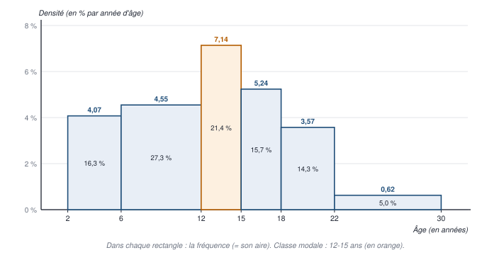

**3.** La **classe modale** est **[12 ; 15[** : sa densité, 7,14 % par année d'âge, est la plus forte — alors que le plus fort **effectif** est celui des 6-12 ans (4 187 564), une classe deux fois plus large. « C'est entre 12 et 15 ans que les personnes scolarisées en 2017-2018 sont le plus nombreuses par année d'âge. »
:::

### Exercice 4 — Le revenu des parents d'étudiants

::: correction Les six réponses
**1.** La dernière classe, « plus de 10 000 € », est **ouverte** : elle regroupe **tous** les revenus au-delà de 10 000 €, sur un intervalle bien plus large que 1 000 € — or le diagramme lui donne une barre de même épaisseur que les autres, et sa longueur (4,3 %) dépasse celle des trois classes précédentes (3,4 ; 2,3 ; 1,2 %). Il aurait fallu un **histogramme**, dont la hauteur est la **densité** et l'**aire** la fréquence : la dernière classe, très large, y serait **très basse**. **Non**, on n'a pas toutes les informations : la borne supérieure de la dernière classe est inconnue (et la borne inférieure de la première, sans doute 0) ; il faudrait la fixer par une **convention**, et le dire.

**2.** Les classes intermédiaires ont toutes 1 000 € d'amplitude : leurs densités se comparent comme leurs fréquences. La première et la dernière, d'amplitude au moins égale à 1 000 €, ont une densité au plus égale à 6,6 % et 4,3 % pour 1 000 €. La **classe modale** est donc **de 3 001 à 4 000 €**, avec 24,0 % pour 1 000 €.

**3.** Convention : bornes arrondies au millier (l'euro d'écart de « 1 001 à 2 000 » est négligeable) ; première classe de 0 à 1 000 €. Effectifs = fréquence × 41 356.

| Revenu des parents (€ par mois) | Effectif (arrondi) | Fréquence | Fréquence cumulée |
|---|---:|---:|---:|
| Moins de 1 000 | 2 729 | 6,6 % | 6,6 % |
| De 1 001 à 2 000 | 5 170 | 12,5 % | 19,1 % |
| De 2 001 à 3 000 | 7 113 | 17,2 % | 36,3 % |
| De 3 001 à 4 000 | 9 925 | 24,0 % | 60,3 % |
| De 4 001 à 5 000 | 6 121 | 14,8 % | 75,1 % |
| De 5 001 à 6 000 | 3 184 | 7,7 % | 82,8 % |
| De 6 001 à 7 000 | 2 481 | 6,0 % | 88,8 % |
| De 7 001 à 8 000 | 1 406 | 3,4 % | 92,2 % |
| De 8 001 à 9 000 | 951 | 2,3 % | 94,5 % |
| De 9 001 à 10 000 | 496 | 1,2 % | 95,7 % |
| Plus de 10 000 | 1 778 | 4,3 % | 100 % |
| **Ensemble** | **41 356** | **100 %** | |

La somme des effectifs arrondis vaut 41 354, et non 41 356 : les fréquences de la source sont arrondies au dixième.

**4.** $F(3\,000) = 36,3$ % $< 50$ % $< F(4\,000) = 60,3$ %, donc $med \approx 3\,000 + 1\,000 \times \frac{0,5 - 0,363}{0,603 - 0,363} = 3\,000 + 1\,000 \times \frac{0,137}{0,240} \approx$ **3 571 €**. « La moitié des étudiants ont des parents qui gagnent, à eux deux, moins de 3 571 € par mois environ ; l'autre moitié, plus. »

**5.** $Q_1 \approx 2\,000 + 1\,000 \times \frac{0,25 - 0,191}{0,363 - 0,191} \approx$ **2 343 €** ; $Q_3 \approx 4\,000 + 1\,000 \times \frac{0,75 - 0,603}{0,751 - 0,603} \approx$ **4 993 €** ; $Q_2$ = la médiane, 3 571 € ; écart inter-quartile : $Q_3 - Q_1 \approx$ **2 650 €**. « 25 % des étudiants ont des parents qui gagnent moins de 2 343 € par mois à eux deux, 25 % plus de 4 993 € ; les revenus des parents des 50 % d'étudiants du milieu s'étalent sur 2 650 € environ. »

**6.** $D_1 \approx 1\,000 + 1\,000 \times \frac{0,10 - 0,066}{0,191 - 0,066} =$ **1 272 €** ; $D_9 \approx 7\,000 + 1\,000 \times \frac{0,90 - 0,888}{0,922 - 0,888} \approx$ **7 353 €**. « 10 % des étudiants ont des parents qui gagnent moins de 1 272 € par mois à eux deux ; 10 % ont des parents qui gagnent plus de 7 353 €. » **Point bonus** : $D_9 / D_1 \approx 5,78$ — le seuil des 10 % les plus aisés est près de **6 fois** celui des 10 % les plus modestes ; et les écarts grandissent vers le haut ($D_9 - med \approx 3\,782$ € contre $med - D_1 \approx 2\,299$ €) : la distribution est **étalée à droite**.
:::

### Exercice 5 — Les poids de naissance

::: correction Le tableau de calcul
| Poids $x_i$ (kg) | $n_i$ | $f_i$ | $f_i\, x_i$ | $x_i - m$ | $(x_i - m)^2$ | $f_i (x_i - m)^2$ |
|---:|---:|---:|---:|---:|---:|---:|
| 1,8 | 2 | 0,025 | 0,045 | −1,2 | 1,44 | 0,036 |
| 2,3 | 12 | 0,15 | 0,345 | −0,7 | 0,49 | 0,0735 |
| 2,8 | 16 | 0,20 | 0,56 | −0,2 | 0,04 | 0,008 |
| 2,9 | 20 | 0,25 | 0,725 | −0,1 | 0,01 | 0,0025 |
| 3,4 | 25 | 0,3125 | 1,0625 | 0,4 | 0,16 | 0,05 |
| 4,2 | 5 | 0,0625 | 0,2625 | 1,2 | 1,44 | 0,09 |
| **Total** | **80** | **1** | **3** | | | **0,26** |

**1.** $f_i = n_i / 80$ ; $m = \sum f_i x_i =$ **3 kg** : « les 80 derniers-nés de la maternité pesaient en moyenne 3 kg ».

**2.** $V = \sum f_i (x_i - m)^2 =$ **0,26 kg²** ; $\sigma = \sqrt{0,26} \approx$ **0,51 kg**, soit environ 510 g. Vérification par Koenig : $\sum f_i x_i^2 - m^2 = 9,26 - 9 = 0,26$. « L'écart-type des poids de naissance est de 0,51 kg : c'est l'ordre de grandeur de l'écart entre le poids d'un bébé et la moyenne de 3 kg. » **Point bonus** : $CV = 0,51 / 3 \approx 17$ % ; et, par Bienaymé-Tchebychev, au moins 75 % des bébés pèsent entre 1,98 et 4,02 kg — en réalité 73 sur 80, soit 91 %.
:::

### Exercice 6 — Le contrôle qualité d'une enquête

::: correction Les trois réponses
**1.** L'indicateur attendu est très probablement le **coefficient de variation**, $CV = \sigma / m$ : il rapporte la dispersion au **niveau moyen** de chaque enquêteur, et neutralise ainsi l'effet de la moyenne (l'énoncé dit « qui ne dépend pas de la moyenne » : à confirmer en TD).

| Enquêteur | $N_k$ | $m_k$ | $\sigma_k$ | $CV_k = \sigma_k / m_k$ | $\sigma_k^2 + m_k^2$ | $N_k (\sigma_k^2 + m_k^2)$ |
|---|---:|---:|---:|---:|---:|---:|
| A | 120 | 92 | 5 | 5,43 % | 25 + 8 464 = 8 489 | 1 018 680 |
| B | 230 | 82 | 1 | 1,22 % | 1 + 6 724 = 6 725 | 1 546 750 |
| C | 80 | 90 | 4 | 4,44 % | 16 + 8 100 = 8 116 | 649 280 |
| D | 70 | 75 | 6 | 8,00 % | 36 + 5 625 = 5 661 | 396 270 |
| **Ensemble** | **500** | | | | | **3 610 980** |

« **B** est l'enquêteur le plus **régulier** (CV de 1,22 %) ; **D** le moins régulier (8 %), et c'est aussi celui qui renseigne correctement le moins de questions (75 en moyenne). »

**2.** $m = \frac{1}{N} \sum N_k m_k = \frac{120 \times 92 + 230 \times 82 + 80 \times 90 + 70 \times 75}{500} = \frac{11\,040 + 18\,860 + 7\,200 + 5\,250}{500} = \frac{42\,350}{500} =$ **84,7 questions** correctement renseignées par questionnaire.

**3.** $\sigma^2 = \frac{1}{N} \sum N_k (\sigma_k^2 + m_k^2) - m^2 = \frac{3\,610\,980}{500} - 84,7^2 = 7\,221,96 - 7\,174,09 =$ **47,87** ; $\sigma \approx$ **6,92 questions**. **Point bonus** — la décomposition : $V_{intra} = \frac{120 \times 25 + 230 \times 1 + 80 \times 16 + 70 \times 36}{500} = \frac{7\,030}{500} = 14,06$ et $V_{inter} = 47,87 - 14,06 = 33,81$ : **71 %** de la dispersion vient des **écarts entre enquêteurs** — le contrôle qualité doit viser d'abord l'enquêteur D.
:::

### Exercice 7 — La pollution de l'air

::: correction Les trois réponses
**1.** Avec k = 2, au moins 75 % des jours, la concentration est dans $[m - 2\sigma ; m + 2\sigma]$ ; la même table donne, pour la question 3, les bornes à k = 3 :

| Zone | *m* | σ | $m - 2\sigma$ | $m + 2\sigma$ | $m - 3\sigma$ | $m + 3\sigma$ |
|---|---:|---:|---:|---:|---:|---:|
| 1 | 80 | 18 | 44 | 116 | 26 | 134 |
| 2 | 90 | 16 | 58 | 122 | 42 | 138 |
| 3 | 70 | 20 | 30 | **110** | 10 | 130 |
| 4 | 100 | 8 | 84 | 116 | 76 | **124** |

« Dans la zone 1, au moins 75 % des jours, la concentration est comprise entre 44 et 116 µg/m³ » — et de même pour les autres zones.

**2.** Au plus 25 % des jours sont **hors** de $m \pm 2\sigma$ ; la distribution étant **symétrique**, au plus **12,5 %** des jours dépassent $m + 2\sigma$ — exactement la part du temps où la personne peut partir. Elle part les jours de pic ; quand elle est là, la concentration reste sous $m + 2\sigma$. Elle choisit donc la zone où ce plafond est le plus bas : **la zone 3** (110 µg/m³), malgré son écart-type élevé.

**3.** 20 jours, c'est environ 5,5 % du temps ; avec k = 3, au plus $1/9 \approx 11,1$ % des jours sont hors de $m \pm 3\sigma$, donc au plus **5,6 %** au-dessus de $m + 3\sigma$. Le plafond le plus bas est celui de **la zone 4** (124 µg/m³). **Conclusion** : moins la personne peut partir, plus la **régularité** — un petit écart-type — compte : la zone 4, pourtant la plus polluée en moyenne, devient le meilleur choix.
:::

### Exercice 8 — Les températures

::: correction Calcul et conclusion
Données brutes, *N* = 7 : $m = \frac{12 + 14 + 8 + 12 + 18 + 12 + 8}{7} = \frac{84}{7} =$ **12 °C** ; écarts : 0, 2, −4, 0, 6, 0, −4 ; carrés : 0, 4, 16, 0, 36, 0, 16 ; $V = \frac{72}{7} \approx$ **10,29 °C²** ; $\sigma \approx$ **3,21 °C** ; $CV = \frac{3,21}{12} \approx$ **26,7 %**.

**Conclusion** : 26,7 % > 20 % : les températures de la semaine ont été **plus dispersées, relativement à leur moyenne, que d'habitude** à cette période — une semaine plus irrégulière que la normale.
:::

### Exercice 9 — Deux petits pays

::: correction Les sept réponses
**1.** **Oui** : la concentration se mesure avec des **parts** du total — courbe de Lorenz, indice de Gini —, **sans unité** : elle ne dépend ni de la monnaie ni du nombre d'habitants. (L'énoncé annonce « 4 habitants » : le pays A en a **5**.)

**2.** Pays A, revenus rangés par ordre croissant : 0, 50, 50, 150, 150 ; total : 400 \$.

| Part cumulée des habitants | 20 % | 40 % | 60 % | 80 % | 100 % |
|---|---:|---:|---:|---:|---:|
| Revenu rangé (\$) | 0 | 50 | 50 | 150 | 150 |
| Part du revenu total | 0 % | 12,5 % | 12,5 % | 37,5 % | 37,5 % |
| **Part cumulée du revenu** | **0 %** | **12,5 %** | **25 %** | **62,5 %** | **100 %** |

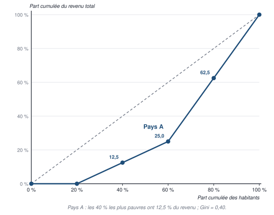

« Les 40 % des habitants les plus pauvres du pays A perçoivent 12,5 % du revenu total. »

**3.** $G = 1 - \sum (b + B)\, h = 1 - 0,2 \times [(0 + 0) + (0 + 0,125) + (0,125 + 0,25) + (0,25 + 0,625) + (0,625 + 1)] = 1 - 0,2 \times 3 =$ **0,40**.

**4.** $m = 400 / 5 =$ **80 \$** ; écarts : −30, −80, −30, 70, 70 ; $V = \frac{900 + 6\,400 + 900 + 4\,900 + 4\,900}{5} = \frac{18\,000}{5} = 3\,600$ \$² ; $\sigma =$ **60 \$** ; $CV = 60 / 80 =$ **75 %**.

**5.** Pays B : 2 000, 2 000, 6 000, 6 000 ; total : 16 000 ¥ ; parts cumulées : 12,5 % ; 25 % ; 62,5 % ; 100 % pour 25, 50, 75 et 100 % des habitants. $G = 1 - 0,25 \times [(0 + 0,125) + (0,125 + 0,25) + (0,25 + 0,625) + (0,625 + 1)] = 1 - 0,25 \times 3 =$ **0,25**. $m =$ **4 000 ¥** ; écarts : ± 2 000 ; $V = 4\,000\,000$ ¥² ; $\sigma =$ **2 000 ¥** ; $CV = 2\,000 / 4\,000 =$ **50 %**.

**6.** Le revenu est **plus concentré** dans le pays A (G = 0,40 contre 0,25) : ses parts sont celles du pays B, **plus un habitant sans revenu**, qui creuse l'inégalité. Les **écarts-types**, eux, ne se comparent pas : 60 \$ et 2 000 ¥ ne sont pas dans la même unité.

**7.** L'indicateur de dispersion comparable est le **coefficient de variation**, sans unité : 75 % dans le pays A contre 50 % dans le pays B — **la même conclusion** que le Gini : le pays A est le plus inégalitaire.
:::

### Exercice 10 — Revenu et patrimoine en Europe

::: correction Les huit réponses
**1.** Le **patrimoine** d'un ménage est l'ensemble de ce qu'il **possède à une date** — logement et autres biens immobiliers, placements financiers, biens professionnels —, **net des dettes** (emprunts restant à rembourser) : c'est un **stock**. Le **revenu** est ce qu'il **perçoit sur une période** — salaires, pensions, revenus du patrimoine (loyers, intérêts, dividendes), prestations : c'est un **flux**. Les deux sont liés : le revenu épargné accroît le patrimoine, qui rapporte à son tour des revenus.

**2.** Les tranches n'ont **pas toutes le même poids** : 20 % des ménages pour les quatre premières, **10 %** pour P80-P90 et P90-P100 — le piège. Par agrégation, la moyenne est la somme des moyennes de tranche pondérées par leur poids *h* :

- patrimoine : $0,2 \times (0 + 26,7 + 101,3 + 224,9) + 0,1 \times (404,5 + 1\,189,7) = 70,58 + 159,42 = 230,0$, soit **230 000 €** ;
- revenu : $0,2 \times (9,2 + 20,1 + 31,3 + 48,0) + 0,1 \times (70,3 + 135,7) = 21,72 + 20,6 = 42,32$, soit **42 320 €**.

« En 2017, le patrimoine net moyen des ménages était d'environ 230 000 €, et leur revenu brut moyen d'environ 42 320 €. »

**3.** Premier tableau — la somme de chaque tranche est $h \times m_k$ (en posant l'effectif total égal à 1), sa part est cette somme divisée par la moyenne d'ensemble :

| Tranche | Poids *h* | Part cumulée des ménages | Patrimoine : $h \times m_k$ | Part du patrimoine | Revenu : $h \times m_k$ | Part du revenu |
|---|---:|---:|---:|---:|---:|---:|
| P0-P20 | 0,2 | 20 % | 0 | 0 % | 1,84 | 4,35 % |
| P20-P40 | 0,2 | 40 % | 5,34 | 2,32 % | 4,02 | 9,50 % |
| P40-P60 | 0,2 | 60 % | 20,26 | 8,81 % | 6,26 | 14,79 % |
| P60-P80 | 0,2 | 80 % | 44,98 | 19,56 % | 9,60 | 22,68 % |
| P80-P90 | 0,1 | 90 % | 40,45 | 17,59 % | 7,03 | 16,61 % |
| P90-P100 | 0,1 | 100 % | 118,97 | 51,73 % | 13,57 | 32,07 % |
| **Ensemble** | **1** | | **230,00** | **100 %** | **42,32** | **100 %** |

(Les parts du patrimoine, arrondies, totalisent 100,01 % : c'est l'effet des arrondis.)

**4.** « En 2017, les **10 % des ménages les plus dotés en patrimoine** détenaient **51,7 %** du patrimoine net total, avec un patrimoine net moyen de 1 189 700 €, plus de 5 fois la moyenne ; les **10 % des ménages aux revenus les plus élevés** percevaient **32,1 %** du revenu brut total. » Attention : ce ne sont pas forcément les mêmes ménages — chaque variable est classée séparément.

**5.** Second tableau — coordonnées des courbes de Lorenz et aires des trapèzes, $(b + B) \times h / 2$ :

| Part cumulée des ménages | Part cumulée du patrimoine | Trapèze (patrimoine) | Part cumulée du revenu | Trapèze (revenu) |
|---:|---:|---:|---:|---:|
| 20 % | 0 % | 0 | 4,35 % | 0,00435 |
| 40 % | 2,32 % | 0,00232 | 13,85 % | 0,01820 |
| 60 % | 11,13 % | 0,01345 | 28,64 % | 0,04249 |
| 80 % | 30,69 % | 0,04182 | 51,32 % | 0,07996 |
| 90 % | 48,27 % | 0,03948 | 67,93 % | 0,05963 |
| 100 % | 100 % | 0,07414 | 100 % | 0,08397 |
| **Total** | | **0,1712** | | **0,2886** |

**6.** Les deux courbes :

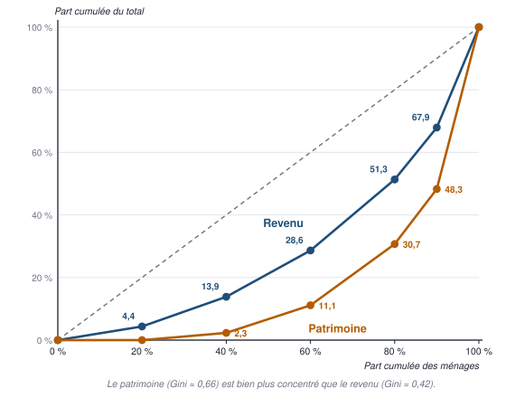

**7.** $G = 2 \times (0,5 - \text{somme des trapèzes})$ : patrimoine, $G = 2 \times (0,5 - 0,1712) \approx$ **0,658** ; revenu, $G = 2 \times (0,5 - 0,2886) \approx$ **0,423**.

**8.** La courbe du patrimoine est **partout** plus éloignée de la diagonale que celle du revenu, et son indice de Gini est bien plus élevé (0,66 contre 0,42) : **le patrimoine est beaucoup plus concentré que le revenu**. Les 20 % des ménages les moins dotés n'ont aucun patrimoine net, alors que les 20 % aux revenus les plus faibles perçoivent 4,35 % des revenus ; les 10 % les plus dotés détiennent plus de la moitié du patrimoine. Explication : le patrimoine est un **stock** qui s'accumule au fil de la vie — épargne, héritages — et rapporte lui-même des revenus, ce qui creuse les écarts.
:::

## Corrigé du niveau 3 — Questions pièges et cas transversaux

::: correction Vrai ou faux, justifié
1. **Faux** : c'est la classe de plus forte **densité** $f / a$ ; les deux ne coïncident que si toutes les classes ont la même amplitude — en 2020, les 30-40 ans ont le plus fort effectif, mais la classe modale est celle des 25-30 ans.
2. **Faux** : il faut **pondérer** par les effectifs — 11,1 et non 11 pour les deux divisions ; la moyenne simple des moyennes ne convient que si les groupes ont le même effectif.
3. **Faux** : $V(a + X) = V(X)$ — décaler ne disperse pas : l'écart-type ne change pas.
4. **Faux** : elle s'exprime en **minutes au carré** ; c'est l'écart-type qui s'exprime en minutes.
5. **Faux** : *N* = 4 est pair : la médiane est la **moyenne de la 2ᵉ et de la 3ᵉ** valeur.
6. **Vrai** : les grandes valeurs tirent la moyenne vers le haut, la médiane résiste — c'est le cas des revenus.
7. **Faux** : **au moins 75 %**. On peut observer 95 % — 19 âges sur 20 dans l'exemple du cours —, mais l'inégalité ne le garantit pas.
8. **Faux** : la médiane **n'est pas linéaire** : une moyenne pondérée des médianes n'est pas la médiane de l'ensemble ; il faudrait la distribution complète.
9. **Vrai** : l'écart-type a l'**unité** de la variable ; pour comparer, il faut le **coefficient de variation**, sans unité.
10. **Vrai** : plus l'indice est proche de 1, plus la concentration est forte — ce sont le patrimoine (0,66) et le revenu (0,42) des ménages de l'exercice 10.
11. **Faux** : c'est la définition de la variance **inter**-groupe ; la variance intra est la **moyenne pondérée des variances** des groupes.
12. **Faux** : c'est un rapport entre deux **seuils** : les 10 % les mieux payés gagnent **au moins** 3,2 fois plus que les 10 % les moins bien payés — le moins payé du décile du haut touche 3,2 fois le salaire du mieux payé du décile du bas.
:::

## Corrigé du niveau 4 — Sujet au format de l'examen

::: correction Corrigé et barème — exercice 1
1. **Population** : les 200 étudiants interrogés de l'université · **unité** : un étudiant · **caractère** : le temps de trajet domicile-université, en minutes · **quantitatif continu** (une durée mesurée), présenté **en classes**. *(1 point.)*
2. Formules : $f = n / N$ ; $a = b_{sup} - b_{inf}$ ; $d = f / a$ ; $F_k = F_{k-1} + f_k$. *(0,5 point pour les formules, 1 pour le tableau, 0,5 pour la classe modale justifiée.)*

| Temps (min) | Effectif | Fréquence | Amplitude | Densité (% par minute) | Fréquence cumulée |
|---|---:|---:|---:|---:|---:|
| [0 ; 10[ | 20 | 10 % | 10 | 1 | 10 % |
| [10 ; 20[ | 50 | 25 % | 10 | 2,5 | 35 % |
| [20 ; 30[ | 60 | 30 % | 10 | **3** | 65 % |
| [30 ; 45[ | 45 | 22,5 % | 15 | 1,5 | 87,5 % |
| [45 ; 60[ | 15 | 7,5 % | 15 | 0,5 | 95 % |
| [60 ; 90[ | 10 | 5 % | 30 | 0,17 | 100 % |
| **Ensemble** | **200** | **100 %** | | | |

**La classe modale** est [20 ; 30[, de plus forte densité : 3 % par minute.

**3.** Avec les centres de classe 5 ; 15 ; 25 ; 37,5 ; 52,5 et 75 : $m \approx 0,10 \times 5 + 0,25 \times 15 + 0,30 \times 25 + 0,225 \times 37,5 + 0,075 \times 52,5 + 0,05 \times 75$, soit $0,5 + 3,75 + 7,5 + 8,4375 + 3,9375 + 3,75 =$ **27,875 min** — environ 27,9 minutes, une estimation fondée sur les centres de classe. *(1 point.)*

**4.** *(1 point chacun, dont 0,5 pour la phrase.)*

- **Médiane** : $F(20) = 35$ % $< 50$ % $< F(30) = 65$ %, donc $med \approx 20 + 10 \times \frac{0,50 - 0,35}{0,65 - 0,35} = 20 + 5 =$ **25 min** : « la moitié des étudiants mettent moins de 25 minutes pour venir à l'université ».
- **$Q_1$** : $F(10) = 10$ % $< 25$ % $< F(20) = 35$ %, donc $Q_1 \approx 10 + 10 \times \frac{0,25 - 0,10}{0,35 - 0,10} = 10 + 6 =$ **16 min** : « un quart des étudiants mettent moins de 16 minutes ».
- **$Q_3$** : $F(30) = 65$ % $< 75$ % $< F(45) = 87,5$ %, donc $Q_3 \approx 30 + 15 \times \frac{0,75 - 0,65}{0,875 - 0,65} \approx 30 + 6,67 =$ **36,7 min** : « un quart des étudiants mettent plus de 36,7 minutes environ ».

**5.** La moyenne (27,9 min) **dépasse** la médiane (25 min), et $Q_3 - med$ (11,7 min) dépasse $med - Q_1$ (9 min) : la distribution est **étalée à droite** — quelques longs trajets, jusqu'à 90 minutes, tirent la moyenne vers le haut. *(1 point.)*
:::

::: correction Corrigé et barème — exercices 2 et 3
**Exercice 2.**

1. $m = \frac{20 \times 50 + 30 \times 60 + 50 \times 40}{100} = \frac{1\,000 + 1\,800 + 2\,000}{100} =$ **48 appels** par jour et par salarié. *(1 point.)*
2. $\sigma^2 = \frac{20 \times (36 + 2\,500) + 30 \times (64 + 3\,600) + 50 \times (25 + 1\,600)}{100} - 48^2 = \frac{50\,720 + 109\,920 + 81\,250}{100} - 2\,304 = 2\,418,9 - 2\,304 =$ **114,9** ; $\sigma \approx$ **10,72 appels**. *(1 point pour la formule, 1 pour le calcul.)*
3. $V_{intra} = \frac{20 \times 36 + 30 \times 64 + 50 \times 25}{100} = \frac{3\,890}{100} = 38,9$ ; $V_{inter} = \frac{20 \times 2^2 + 30 \times 12^2 + 50 \times (-8)^2}{100} = \frac{80 + 4\,320 + 3\,200}{100} = 76$ ; vérification : 38,9 + 76 = 114,9. **Interprétation** : 66 % de la variance ($76 / 114,9$) vient des **écarts entre équipes** — l'équipe explique l'essentiel des différences entre salariés. *(1 point pour le calcul, 1 pour l'interprétation.)*
4. Coefficients de variation : A, $6 / 50 =$ **12 %** ; B, $8 / 60 \approx$ 13,3 % ; C, $5 / 40 =$ 12,5 %. **L'équipe A** est la plus homogène relativement à son niveau — même si C a le plus petit écart-type : il faut raisonner **en relatif**. *(1 point.)*

**Exercice 3.**

1. $m = \frac{20 + 60 + 20 + 160 + 40}{5} = \frac{300}{5} =$ **60 k€** ; écarts : −40, 0, −40, 100, −20 ; $V = \frac{1\,600 + 0 + 1\,600 + 10\,000 + 400}{5} = \frac{13\,600}{5} = 2\,720$ (k€)² ; $\sigma \approx$ **52,15 k€** ; $CV \approx$ **86,9 %**. *(2 points.)*
2. Revenus rangés : 20, 20, 40, 60, 160 (total : 300) ; parts : 6,67 % ; 6,67 % ; 13,33 % ; 20 % ; 53,33 % ; **parts cumulées** : **6,67 % ; 13,33 % ; 26,67 % ; 46,67 % ; 100 %** pour 20, 40, 60, 80 et 100 % des associés. « Les 20 % des associés les moins bien rémunérés — un associé sur cinq — perçoivent 6,67 % du total des revenus du cabinet. » *(2 points.)*
3. $G = 1 - 0,2 \times [(0 + 0,0667) + (0,0667 + 0,1333) + (0,1333 + 0,2667) + (0,2667 + 0,4667) + (0,4667 + 1)] = 1 - 0,2 \times 2,8667 \approx$ **0,427**. **Interprétation** : une concentration **moyenne**, nettement au-dessus de l'égalité (0) et loin du maximum (1) ; à lui seul, l'associé le mieux payé perçoit plus de la moitié du total (53 %). *(2 points.)*
:::
